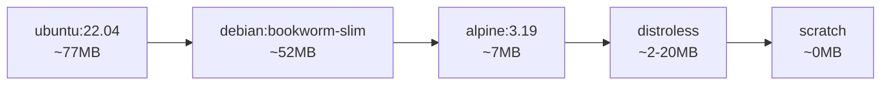
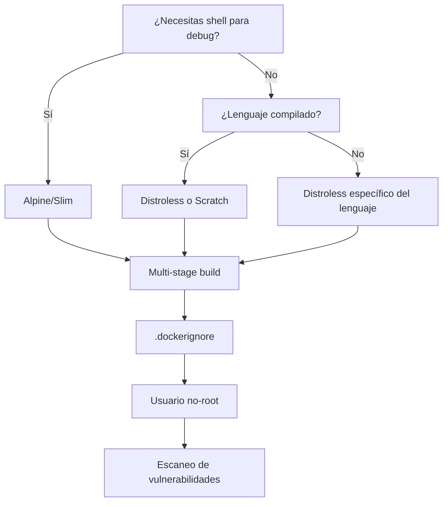

# Técnicas para aligerar contenedores y mejorar su seguridad

Si alguna vez has construido una imagen de Docker y te has preguntado por qué pesa más que tu colección completa de memes... este artículo es para ti. Y lo mejor es que, al reducir el tamaño de tus contenedores, también estarás mejorando su seguridad. Dos pájaros de un tiro.

La lógica es simple: **menos código = menos superficie de ataque**. Cada librería, cada binario y cada archivo que añades a tu contenedor es una potencial vulnerabilidad esperando a ser explotada.

<!-- truncate -->

## Por qué importa el tamaño de tus contenedores

Antes de entrar en materia, déjame contarte por qué deberías preocuparte por el tamaño de tus imágenes:

- **Despliegues más rápidos**: Menos bytes que transferir significa menos tiempo de espera
- **Menor consumo de recursos**: Tanto en almacenamiento como en red
- **Menos vulnerabilidades**: Menos paquetes instalados = menos CVEs potenciales
- **Arranque más rápido**: Ideal para entornos serverless y escalado automático
- **Costes reducidos**: Almacenamiento y transferencia en registros de contenedores

Ahora sí, vamos con las técnicas.

## 1. Elige la imagen base adecuada

La elección de la imagen base es probablemente la decisión más importante que tomarás. Aquí tienes las opciones más comunes ordenadas de mayor a menor tamaño:



### Ubuntu/Debian vs Alpine

La diferencia principal está en la librería C que utilizan:
- **Ubuntu/Debian**: Usan `glibc` (GNU C Library)
- **Alpine**: Usa `musl libc`, más ligera pero puede causar incompatibilidades

```dockerfile
# ❌ Imagen pesada (~77MB solo la base)
FROM ubuntu:22.04

# ✅ Alternativa ligera (~7MB)
FROM alpine:3.19
```

### Variantes slim

Muchas imágenes oficiales ofrecen variantes `slim` que eliminan paquetes innecesarios:

```dockerfile
# ❌ Imagen completa de Python (~1GB)
FROM python:3.12

# ✅ Variante slim (~150MB)
FROM python:3.12-slim

# ✅✅ Variante alpine (~50MB)
FROM python:3.12-alpine
```

## 2. Multi-stage builds: Tu mejor aliado

Los builds multi-etapa son probablemente la técnica más potente para reducir el tamaño de tus imágenes. La idea es simple: usa una imagen pesada para compilar y una ligera para ejecutar.

```dockerfile
# Etapa de construcción
FROM golang:1.22-alpine AS builder
WORKDIR /app
COPY . .
RUN go build -o myapp .

# Etapa de producción
FROM alpine:3.19
COPY --from=builder /app/myapp /myapp
ENTRYPOINT ["/myapp"]
```

### Ejemplo práctico con Node.js

```dockerfile
# Etapa 1: Instalación de dependencias
FROM node:20-alpine AS deps
WORKDIR /app
COPY package*.json ./
RUN npm ci --only=production

# Etapa 2: Build
FROM node:20-alpine AS builder
WORKDIR /app
COPY . .
COPY --from=deps /app/node_modules ./node_modules
RUN npm run build

# Etapa 3: Producción
FROM node:20-alpine AS runner
WORKDIR /app
ENV NODE_ENV=production

# Crear usuario no-root
RUN addgroup -g 1001 -S nodejs && \
    adduser -S nextjs -u 1001

COPY --from=builder --chown=nextjs:nodejs /app/dist ./dist
COPY --from=deps --chown=nextjs:nodejs /app/node_modules ./node_modules

USER nextjs
EXPOSE 3000
CMD ["node", "dist/index.js"]
```

## 3. Imágenes Distroless: Seguridad por defecto

Las imágenes **distroless** de Google son imágenes que contienen únicamente tu aplicación y sus dependencias de runtime. No incluyen:

- Shell (ni bash, ni sh)
- Gestores de paquetes
- Herramientas de sistema

Esto significa que aunque un atacante consiga acceso al contenedor, no podrá hacer prácticamente nada.

```dockerfile
# Build
FROM golang:1.22-alpine AS builder
WORKDIR /app
COPY . .
RUN CGO_ENABLED=0 go build -o myapp .

# Producción con distroless
FROM gcr.io/distroless/static-debian12
COPY --from=builder /app/myapp /myapp
ENTRYPOINT ["/myapp"]
```

### Variantes de distroless disponibles

| Imagen | Uso recomendado | Tamaño aproximado |
|--------|-----------------|-------------------|
| `gcr.io/distroless/static` | Binarios estáticos (Go, Rust) | ~2MB |
| `gcr.io/distroless/base` | Binarios dinámicos con glibc | ~20MB |
| `gcr.io/distroless/java21` | Aplicaciones Java | ~200MB |
| `gcr.io/distroless/python3` | Aplicaciones Python | ~50MB |
| `gcr.io/distroless/nodejs20` | Aplicaciones Node.js | ~120MB |

## 4. Imagen Scratch: El minimalismo absoluto

Si distroless te parece demasiado pesado (sí, hay gente así), puedes usar `scratch`. Es literalmente una imagen vacía.

```dockerfile
FROM golang:1.22-alpine AS builder
WORKDIR /app
COPY . .
# Compilación estática obligatoria
RUN CGO_ENABLED=0 GOOS=linux go build -a -installsuffix cgo -o myapp .

FROM scratch
COPY --from=builder /app/myapp /myapp
ENTRYPOINT ["/myapp"]
```

> ⚠️ **Importante**: Con `scratch` necesitas compilar tu aplicación de forma estática y copiar manualmente cualquier certificado SSL que necesites:

```dockerfile
FROM scratch
COPY --from=builder /etc/ssl/certs/ca-certificates.crt /etc/ssl/certs/
COPY --from=builder /app/myapp /myapp
ENTRYPOINT ["/myapp"]
```

## 5. Optimización de capas y caché

El orden de las instrucciones en tu Dockerfile importa más de lo que crees. Docker cachea cada capa, así que pon primero lo que menos cambia:

```dockerfile
# ❌ Mal: Cualquier cambio en el código invalida la caché de npm
FROM node:20-alpine
WORKDIR /app
COPY . .
RUN npm ci

# ✅ Bien: Solo se reinstalan dependencias si cambia package.json
FROM node:20-alpine
WORKDIR /app
COPY package*.json ./
RUN npm ci
COPY . .
```

### Combina comandos RUN

Cada instrucción `RUN` crea una nueva capa. Combínalas cuando tenga sentido:

```dockerfile
# ❌ Múltiples capas (el apt-get clean no ayuda)
RUN apt-get update
RUN apt-get install -y curl
RUN apt-get clean

# ✅ Una sola capa, limpieza efectiva
RUN apt-get update && \
    apt-get install -y --no-install-recommends curl && \
    apt-get clean && \
    rm -rf /var/lib/apt/lists/*
```

## 6. Usa .dockerignore

El archivo `.dockerignore` es el `.gitignore` de Docker. Evita copiar archivos innecesarios al contexto de build:

```dockerignore
# Control de versiones
.git
.gitignore

# Dependencias (se instalarán en el build)
node_modules
vendor

# Archivos de desarrollo
*.md
.env.local
.vscode
.idea

# Tests y documentación
tests/
docs/
coverage/

# Archivos de build locales
dist/
build/
*.log
```

## 7. Técnicas de seguridad adicionales

### Ejecutar como usuario no-root

Por defecto, los contenedores corren como root. Esto es un riesgo de seguridad:

```dockerfile
FROM node:20-alpine

# Crear usuario sin privilegios
RUN addgroup -g 1001 appgroup && \
    adduser -u 1001 -G appgroup -D appuser

WORKDIR /app
COPY --chown=appuser:appgroup . .

# Cambiar al usuario sin privilegios
USER appuser

CMD ["node", "index.js"]
```

### Filesystem de solo lectura

Monta el filesystem como solo lectura en producción:

```yaml
# docker-compose.yml
services:
  app:
    image: myapp:latest
    read_only: true
    tmpfs:
      - /tmp
      - /var/run
```

### Escaneo de vulnerabilidades

Integra escaneo de vulnerabilidades en tu pipeline de CI/CD:

```bash
# Con Docker Scout
docker scout cves myimage:latest

# Con Trivy
trivy image myimage:latest

# Con Grype
grype myimage:latest
```

### Firma y verificación de imágenes

Usa Docker Content Trust o Cosign para firmar tus imágenes:

```bash
# Habilitar Docker Content Trust
export DOCKER_CONTENT_TRUST=1

# Firmar con Cosign
cosign sign myregistry.io/myimage:latest
```

## 8. Comparativa práctica

Veamos una comparativa real de tamaños para una aplicación Go simple:

| Imagen base | Tamaño final | Paquetes | CVEs potenciales |
|-------------|--------------|----------|------------------|
| `golang:1.22` | ~850MB | ~500 | Alto |
| `golang:1.22-alpine` | ~250MB | ~50 | Medio |
| `alpine:3.19` + binario | ~12MB | ~15 | Bajo |
| `gcr.io/distroless/static` | ~4MB | ~0 | Muy bajo |
| `scratch` | ~2MB | 0 | Mínimo |

## Resumen y recomendaciones



**Mis recomendaciones según el caso de uso:**

1. **Desarrollo**: Usa imágenes completas para facilitar el debug
2. **Producción**: Siempre multi-stage builds con imágenes mínimas
3. **Go/Rust**: Distroless static o scratch
4. **Python/Node.js**: Distroless específico o Alpine
5. **Java**: Distroless Java o Eclipse Temurin slim

## Recursos adicionales

- [Documentación oficial de Docker sobre multi-stage builds](https://docs.docker.com/build/building/multi-stage/)
- [Repositorio de imágenes Distroless](https://github.com/GoogleContainerTools/distroless)
- [Docker Scout para escaneo de vulnerabilidades](https://docs.docker.com/scout/)
- [Trivy - Escáner de seguridad open source](https://github.com/aquasecurity/trivy)

---

Recuerda: **un contenedor más pequeño no solo es más rápido, sino también más seguro**. Cada byte que eliminas es una potencial vulnerabilidad menos en tu sistema.

¿Tienes alguna otra técnica que uses para optimizar tus contenedores? ¡Déjame un comentario!
