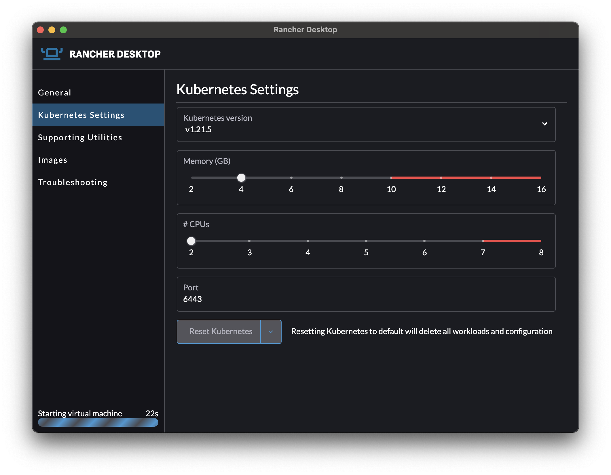

Ya estuve explicando en este [artículo](/blog/2021/2021_09_12_docker_de_pago/index.md) los nuevos planes de Docker Desktop y cómo afectarían a los usuarios. Aunque existen otras alternativas como Buildah o Podman, estas solo funcionan sobre Linux. Si sois usuarios de Windows o Mac y pensáis en montar una máquina Linux, quizá prefiráis usar Docker Engine por la familiaridad que ofrece en lugar de usar otras herramientas.

<!-- truncate -->

Rancher Desktop se posiciona como una alternativa a tener en cuenta. Dentro vídeo <i class='fa fa-film'></i>
https://youtu.be/LmKN4NvpR-4 

## ¿Qué es Rancher Desktop?
Si vienes del mundo de Kubernetes, seguro que Rancher te es familiar. Este es una plataforma de Kubernetes con una capa de gestión pensada en la facilidad de despliegue y gestión de clústers.

En esta ocasión, Rancher Desktop es una forma de acercarse a los desarrolladores y competir directamente con Docker en el escritorio.

## ¿Qué aporta?
El planteamiento es similar al de Docker Desktop, gestiona automáticamente la instalación de una interfaz de usuario, el engine de contenedores (containerd), k3s (la misma tecnología que utiliza Rancher para Kubernetes), kubectl, etc., y todo este paquete en una instalación sencilla.

Si has visto el vídeo, Rancher Desktop, al menos en Windows, tiene algunos pequeños errores. Cabe recordar que su estado de desarrollo es pre-release y es normal que durante sus betas encontremos errores que nos impidan utilizarlo a día de hoy.

### Características adicionales de Rancher Desktop
Rancher Desktop no solo ofrece una alternativa a Docker Desktop, sino que también incluye características adicionales que pueden ser de gran utilidad para los desarrolladores:

- **Compatibilidad con múltiples versiones de Kubernetes**: Puedes cambiar fácilmente entre diferentes versiones de Kubernetes según tus necesidades de desarrollo y pruebas.
- **Integración con Helm**: Rancher Desktop incluye soporte para Helm, lo que facilita la gestión de paquetes de Kubernetes.
- **Soporte para CRI-O y containerd**: Además de Docker, Rancher Desktop soporta otros runtimes de contenedores como CRI-O y containerd, proporcionando flexibilidad en la elección del runtime.

## La alternativa definitiva
Como ya comentaba, una solución 100% efectiva es instalar Docker en una máquina virtual de Linux. Esto lo podríamos hacer manualmente, pero, puestos a hacerlo, mejor hacerlo bien.

Un viejo compañero con alias [Yohnah](https://github.com/Yohnah) en Github ha creado un repositorio con automatismos y una máquina virtual preparada para desplegar automáticamente con Vagrant. La máquina virtual viene con Docker instalado y listo para funcionar. Además, el automatismo deja el host configurado para que utilice el Docker Engine de la máquina virtual de una forma similar a la que lo hace Docker Desktop. Toda la guía aquí:
https://github.com/Yohnah/Docker

¡Hasta el siguiente!
