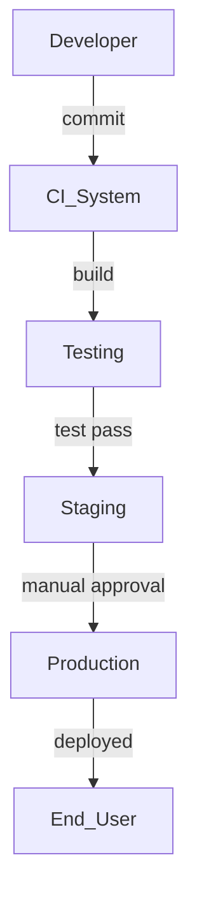

# Crear Diagramas como Código: Integración de DevOps y GitOps

En el desarrollo de software y la gestión de infraestructuras, la necesidad de documentar y visualizar procesos complejos es crucial. Tradicionalmente, los diagramas eran creados manualmente con herramientas de diseño visual, pero esta práctica puede ser tediosa, propensa a errores y difícil de mantener en proyectos ágiles. **Crear diagramas como código** ha emergido como una solución moderna y eficaz, que no solo se alinea con las filosofías de **DevOps** y **GitOps**, sino que también permite una fácil integración en flujos de trabajo como **Markdown**.


[](https://youtu.be/Gvt0iRxg99I)

<!-- truncate -->

Dentro vídeo: https://youtu.be/Gvt0iRxg99I

## ¿Qué significa crear diagramas como código?

El concepto de **diagramas como código** se refiere a la práctica de generar diagramas de manera automática a partir de descripciones en texto, utilizando formatos de archivo fácilmente gestionables dentro de repositorios de control de versiones, como **Git**. En lugar de crear diagramas estáticos y manuales con herramientas visuales, los diagramas se generan a partir de scripts o lenguajes de marcado, y se pueden actualizar automáticamente a medida que el código cambia.

Este enfoque ofrece varias ventajas:
- **Control de versiones**: Al almacenar el diagrama como código en Git, puedes rastrear los cambios a lo largo del tiempo, revisar el historial y revertir si es necesario, igual que con cualquier otro archivo de código.
- **Automatización**: Los diagramas pueden generarse automáticamente cada vez que se produce un cambio en el código, asegurando que siempre estén actualizados.
- **Reproducibilidad**: Dado que los diagramas se basan en código, pueden regenerarse en cualquier entorno, eliminando la dependencia de herramientas específicas o interfaces gráficas.

## Conexión con las filosofías DevOps y GitOps

En la práctica, **DevOps** fomenta la colaboración entre los equipos de desarrollo y operaciones, con un enfoque en la automatización y la integración continua. Los diagramas como código encajan perfectamente en este paradigma, ya que promueven la automatización en la generación de documentación visual. Los diagramas pueden ser generados en cada paso del ciclo de vida del software, desde la planificación y diseño, hasta la implementación y monitoreo.

Por otro lado, **GitOps** lleva esta idea un paso más allá, haciendo que el control de versiones en Git no solo sea el repositorio del código fuente, sino también de la infraestructura. Crear diagramas como código permite visualizar la infraestructura como parte del proceso GitOps, donde cualquier cambio en el estado del sistema puede reflejarse automáticamente en los diagramas que describen la infraestructura o los flujos de trabajo.

## Herramientas y lenguajes más utilizados

Existen varias herramientas y lenguajes que permiten la creación de diagramas como código. Aquí mencionamos algunas de las más populares:

1. **PlantUML**: Esta herramienta permite generar diagramas UML (Unified Modeling Language) a partir de texto. Se integra fácilmente en flujos de trabajo de **Markdown** y puede generar diagramas como clases, secuencias, componentes y actividades.
   
   Un ejemplo de código PlantUML para un diagrama de secuencia sería:

   ```plantuml
   @startuml
   Alice -> Bob: Hola Bob, ¿cómo estás?
   Bob --> Alice: ¡Estoy bien, gracias!
   @enduml
   ```

2. **Mermaid.js**: Una herramienta muy utilizada en entornos de documentación en **Markdown**, como GitHub y GitLab. Mermaid permite generar diagramas de flujo, gráficos Gantt y otros tipos de diagramas de forma sencilla.

   Ejemplo de diagrama de flujo con Mermaid:
   
   ```mermaid
   graph TD;
       A-->B;
       A-->C;
       B-->D;
       C-->D;
   ```

3. **Diagrams**: Es una librería de Python que permite generar diagramas de arquitectura en la nube utilizando texto. Esta herramienta es especialmente útil para documentar infraestructuras en AWS, GCP, Azure y otras plataformas en la nube.

   Ejemplo de uso con AWS:

   ```python
   from diagrams import Diagram
   from diagrams.aws.compute import EC2
   from diagrams.aws.network import ELB
   from diagrams.aws.database import RDS

   with Diagram("Web Service", show=False):
       ELB("lb") >> EC2("web") >> RDS("db")
   ```

## Generación de diagramas con ChatGPT

Una de las grandes ventajas de la inteligencia artificial hoy en día es su capacidad para acelerar procesos manuales. **ChatGPT**, por ejemplo, puede asistir en la generación automática de diagramas como código a partir de descripciones en lenguaje natural. Imagina que necesitas un diagrama de flujo para describir un proceso de desarrollo continuo; puedes darle a ChatGPT la descripción y este te generará el código correspondiente, por ejemplo, en **Mermaid** o **PlantUML**.

### Ejemplo práctico:

Supongamos que tienes el siguiente requerimiento: "Genera un diagrama que muestre el flujo de trabajo de un pipeline de CI/CD, desde el commit del código hasta su despliegue en producción". Podrías preguntarle a ChatGPT y obtener una respuesta como esta en formato **Mermaid**:



Este diagrama muestra cómo el código pasa desde el commit en el sistema de CI, se construye, se prueba, se despliega en **staging**, y finalmente, después de la aprobación manual, llega a producción.

## Automatización con scripts

Otro aspecto interesante de la creación de diagramas como código es la posibilidad de **automatizar su generación** a través de scripts. Por ejemplo, puedes crear scripts en **Bash** o **Python** que analicen los cambios en tu repositorio, y que automáticamente generen y actualicen los diagramas correspondientes en cada commit.

Un ejemplo de este tipo de automatización podría ser un script que detecta cambios en los archivos de infraestructura (como archivos **Terraform** o **Kubernetes YAML**) y genera automáticamente un diagrama actualizado utilizando PlantUML o Diagrams.

```bash
#!/bin/bash
# Script para generar diagramas automáticamente al cambiar archivos de Terraform

# Definir los archivos a monitorizar
FILES="infra/*.tf"

# Generar diagrama cuando haya cambios
inotifywait -m $FILES |
while read file; do
  echo "Detectado cambio en $file. Generando diagrama..."
  python generar_diagrama.py  # Ejecuta script Python para generar diagrama
done
```

Este tipo de automatización es ideal en entornos de **CI/CD**, donde cada vez que el estado de la infraestructura cambia, se puede generar un nuevo diagrama y almacenarlo junto con el código.

## Conclusión

Crear **diagramas como código** es una práctica que aporta grandes beneficios a los equipos que siguen las filosofías **DevOps** y **GitOps**, permitiendo la automatización de la documentación visual, la integración fluida con Git y la actualización continua de diagramas a medida que el código o la infraestructura evolucionan. Herramientas como **PlantUML**, **Mermaid** y **Diagrams**, combinadas con la capacidad de **ChatGPT** para generar diagramas a partir de descripciones en lenguaje natural, hacen que esta práctica sea accesible y eficiente para cualquier equipo.

Si todavía estás creando diagramas manualmente, ¡es hora de dar el salto a los diagramas como código y automatizar tu documentación visual!
