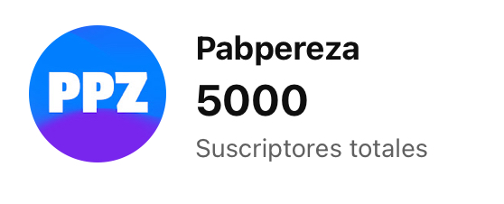

# ¡Especial 5000 subscriptores en Youtube!
¡Wow! ¡5000 subscriptores en Youtube! No me lo puedo creer. Francamente, cuando empecé a subir vídeos a Youtube no tenía ningún tipo de pretensión. Quería hablar de aquellas cosas que me gustan, que me apasionan y que me divierten. 

<!-- truncate -->

Con el tiempo, he ido mejorando la calidad de los vídeos, el contenido y la forma de presentarlo aunque llegado a este punto, una parte de la ilusión inicial se ha transformado en la responsabilidad de ser constante, riguroso y disciplinado. Este reto personal, me ha llevado a aprender mucho, a investigar y a profundizar en temas que de otra forma, no hubiera hecho.

Esta había sido siempre la idea inicial, aprender enseñando. Uno de los mantras que más resuenan en mi cabeza es la icónica frase de Richard Feynman: "Si quieres aprender algo, enseñalo". Pero no solo he aprendido de tecnología, también de disciplina, constancia, comunicación, edición de vídeo, foto... etc. Ha sido un viaje transformador en muchos sentidos.

## Especial agradecimiento
Puede ser que me este poniendo muy sentimental y, seguramente no sea para tanto, pero cada vídeo que subo lleva muchas horas de trabajo detrás, muchas horas de investigación, grabación, edición... etc. Por eso, quiero agradecer a todas las personas que me han apoyado, que han comentado, que han compartido, que han dado like, que han suscrito... etc.

De verdad, ¡GRACIAS!. Parece una tontería, pero cada comentario que he recibido, cada bonita palabra de ánimo, dudas, críticas constructivas... etc. me han ayudado a seguir adelante, a mejorar y a crecer.

Eso y el cachondeo de algunos por TikTok y otras redes (por cierto, en TikTok, empecé hace poco y ya somos más de 2500 personas), en los cuales me comparáis con John Lennon o Guinxu (un youtuber de desarrollo de videojuegos que me encanta), y si, parezco su versión más vieja pedazo de c***** jajaja.

## ¿Qué viene ahora?
Si que quiero interaccionar más con la comunidad, estoy haciendo más vídeos cortos respondiendo dudas concretas y dejando el futuro del canal en manos de los intereses de la comunidad.

Por otra parte, aún estoy terminando el curso de Docker y me gustaría más adelante hacer más vídeos hablando de kubernetes. Tengo muchas ideas, muchas sugerencias pero poco tiempo para llevarlas a cabo.

He sido padre recientemente y mi tiempo ahora es más limitado, aunque se aprende, a la fuerza eso si jeje, a gestionarlo mejor. Aún así, quiero seguir subiendo un vídeo largo semanal, shorts a discreción y algún podcast cada 3 o 4 meses. Sin presiones pero con cierta constancia.

## Dudas más comunes

* Directos
Uf, me pongo de los nervios pero si que he pensado en emitir en directo el proceso de preparación e investigación, me permitiría recoger feedback en tiempo real y sería una forma de interactuar más con la comunidad. Es posible que me anime.

* Kubernetes
Muchos me habéis preguntado por kubernetes y si, tengo pensado hacer un curso de kubernetes, espero acabar el de docker en las próximas semanas y empezar con kubernetes. Este ya lo tengo medio preparado gracias a los apuntes que saqué de la certificación CKA y me gustaría que estuviera orientado también a servir como preparación de la misma.

* Jenkins
He visto que hay mucho interés en Jenkins y haré un mini curso en un único de vídeo de su puesta en marcha y los principales conceptos. 

Por lo demás, gracias de nuevo por el apoyo, recuerda dejar un comentario con tus intereses y nos vemos en el próximo vídeo. ¡Hasta la próxima!

