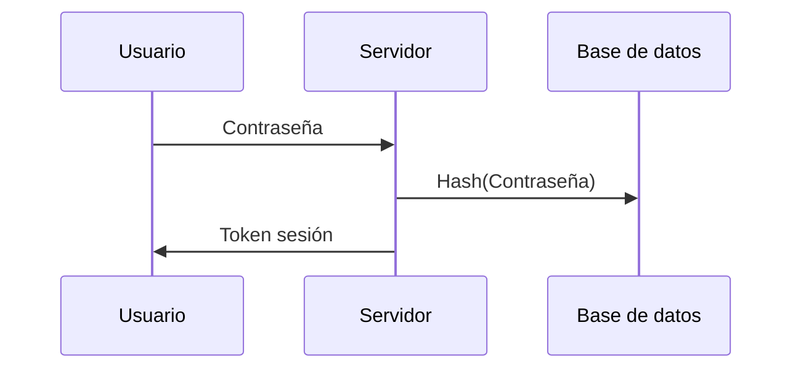

¡Pon a prueba tus contraseñas, secretos y hashes!

Bueno, comenzaremos hablando sobre cómo se utilizan las contraseñas en nuestras actividades cotidianas. Desde el acceso a nuestros correos electrónicos hasta nuestras cuentas bancarias, las contraseñas juegan un papel crucial en la protección de nuestra información personal. Es verdad que todas las grandes compañias están trabajando en un nuevo estándar llamado passkey para que los usuarios finales no manejen credenciales, hablaré más adelante sobre esto. 

En cualquiera de los casos, maneje o no contraseñas el usuario, los sistemas siempre manejan secretos para validar la autenticación y autorización de un usuario, una llamada a un API o la interacción que sea, a través de tokens de muchos tipos, entre los más destacados, JWT.

Ahora, hablemos sobre cómo se transportan y almacenan las contraseñas durante las llamadas HTTP u otros protocolos. Cuando introduces tu contraseña en un sitio web, esta se transforma en un hash antes de ser enviada, y se almacena en la base de datos del sitio web.

Pero, ¿qué sucede cuando los cibercriminales intentan robar o descifrar estos hashes o tokens? Utilizan una variedad de técnicas. El método más común es la ingeniería social, como el phishing, que implican manipularte para que les reveles tu contraseña, y es una de las más efectivas actualmente.

Otra vía, y la que quiero explorar hoy, es el uso de herramientas de cracking o recuperación de contraseñas, con el objetivo que ser capaces de poner a prueba nuestros secretos.

## Como se obtienen los hashes
Un atacante puede obtener hashes de contraseñas de varias maneras. Por ejemplo, si un atacante obtiene acceso a una base de datos de contraseñas, puede extraer los hashes de las contraseñas almacenadas en la base de datos. También puede obtener hashes de contraseñas interceptando el tráfico de red o mediante la ingeniería inversa de aplicaciones.

Una vez que un atacante tiene un hash de contraseña, puede utilizar herramientas de cracking de contraseñas para obtener la contraseña original. Esto se hace comparando los hashes calculados con los hashes obtenidos, y cuando hay una coincidencia, la contraseña ha sido descifrada.

## Hashcat
Hashcat es una de las herramientas más avanzadas en recuperación de contraseñas. Puede utilizar diferentes métodos de ataque para descifrar un hash de contraseña, incluyendo ataques de fuerza bruta, ataques de diccionario y otros. Funciona comparando los hashes calculados con los hashes obtenidos, y cuando hay una coincidencia, la contraseña ha sido descifrada.

[Web oficial de Hashcat](https://hashcat.net/hashcat/)

## Ejemplos
Para poner en práctica la herramienta he creado un vídeo en el que muestro cómo crackear diferentes tipos de hashes con diferentes métodos de ataque. 

