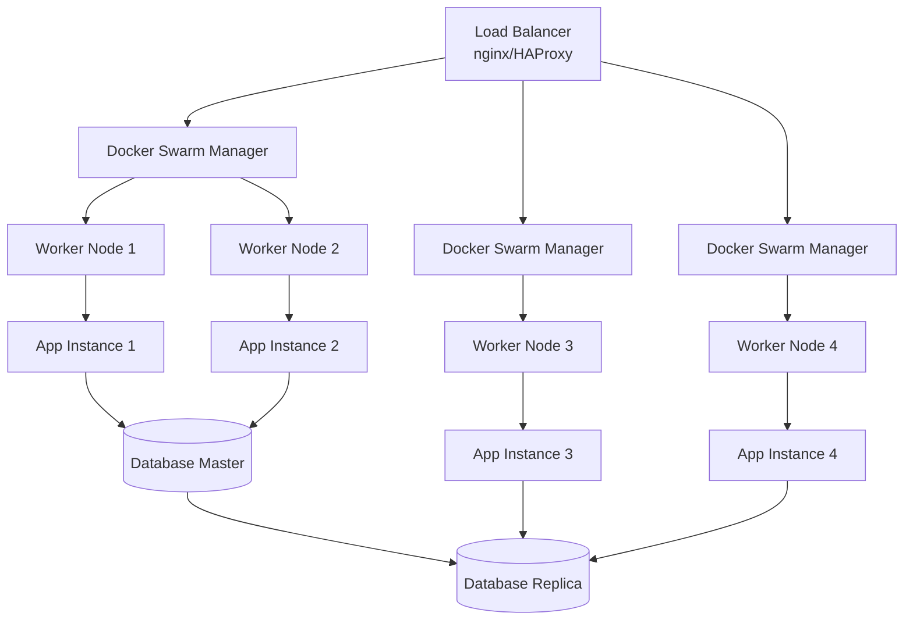
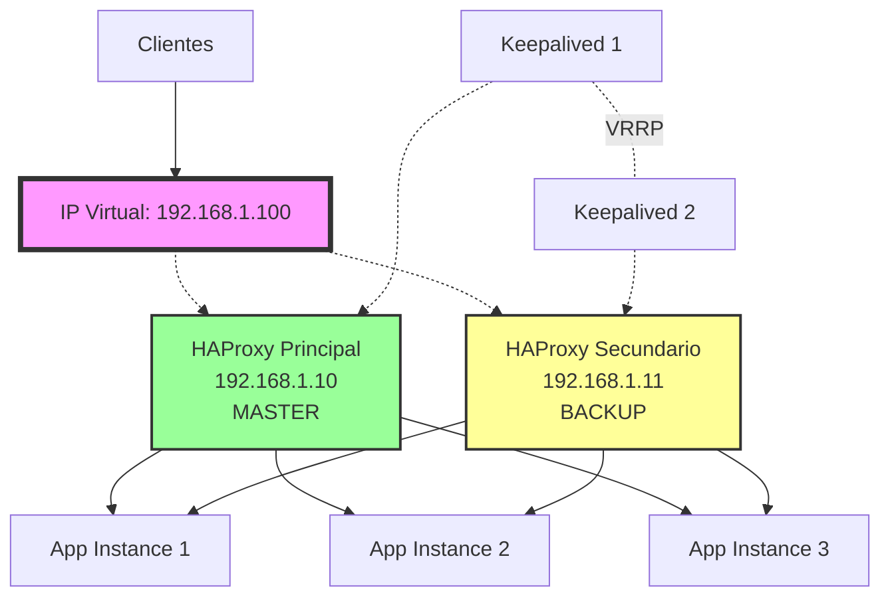

# Alta Disponibilidad con Docker y Docker Swarm - Guía Completa 2025

La **alta disponibilidad** es fundamental para cualquier aplicación en producción. En este artículo te enseño cómo implementar un entorno altamente disponible utilizando Docker y Docker Swarm, cubriendo desde balanceadores de carga hasta estrategias de monitorización y recuperación ante fallos.

Si estás empezando con Docker, te recomiendo revisar primero nuestro [curso completo de Docker](/docs/cursos/docker/) donde cubrimos desde los conceptos básicos hasta el despliegue en producción.

<!-- truncate -->

## ¿Qué es la Alta Disponibilidad?

La **alta disponibilidad (HA)** se refiere a la capacidad de un sistema para permanecer operativo durante el mayor tiempo posible, minimizando el tiempo de inactividad no planificado. En términos de contenedores, esto significa:

- **Redundancia**: Múltiples instancias de servicios corriendo simultáneamente
- **Distribución**: Servicios distribuidos en diferentes nodos físicos
- **Recuperación automática**: Capacidad de recuperarse automáticamente de fallos
- **Balanceado de carga**: Distribución inteligente del tráfico entre instancias

## Arquitectura de Alta Disponibilidad con Docker

### Componentes Clave



## 1. Balanceadores de Carga

### Option A: nginx como Load Balancer

Primero, creemos una configuración nginx para balancear carga entre múltiples instancias:

```nginx
# nginx.conf
upstream app_backend {
    least_conn;
    server app1:3000 max_fails=3 fail_timeout=30s;
    server app2:3000 max_fails=3 fail_timeout=30s;
    server app3:3000 max_fails=3 fail_timeout=30s;
    
    # Health check
    keepalive 32;
}

server {
    listen 80;
    server_name myapp.example.com;
    
    # Health check endpoint para el load balancer
    location /health {
        access_log off;
        return 200 "healthy\n";
        add_header Content-Type text/plain;
    }
    
    location / {
        proxy_pass http://app_backend;
        proxy_set_header Host $host;
        proxy_set_header X-Real-IP $remote_addr;
        proxy_set_header X-Forwarded-For $proxy_add_x_forwarded_for;
        proxy_set_header X-Forwarded-Proto $scheme;
        
        # Timeouts y retry
        proxy_connect_timeout 5s;
        proxy_send_timeout 60s;
        proxy_read_timeout 60s;
        proxy_next_upstream error timeout http_502 http_503 http_504;
    }
}
```

### Docker Compose con nginx Load Balancer

```yaml
# docker-compose.nginx-lb.yml
version: '3.8'

services:
  nginx:
    image: nginx:alpine
    ports:
      - "80:80"
      - "443:443"
    volumes:
      - ./nginx.conf:/etc/nginx/nginx.conf:ro
      - ./ssl:/etc/ssl/certs:ro
    networks:
      - app-network
    deploy:
      replicas: 2
      placement:
        constraints:
          - node.role == manager
      restart_policy:
        condition: on-failure
        max_attempts: 3

  app:
    image: myapp:latest
    networks:
      - app-network
    environment:
      - NODE_ENV=production
      - DB_HOST=database
    deploy:
      replicas: 6
      resources:
        limits:
          cpus: '0.5'
          memory: 512M
        reservations:
          cpus: '0.25'
          memory: 256M
      restart_policy:
        condition: on-failure
        max_attempts: 3
      update_config:
        parallelism: 2
        delay: 10s
        failure_action: rollback
        order: start-first
    healthcheck:
      test: ["CMD", "curl", "-f", "http://localhost:3000/health"]
      interval: 30s
      timeout: 10s
      retries: 3
      start_period: 40s

  database:
    image: postgres:15
    environment:
      - POSTGRES_DB=myapp
      - POSTGRES_USER=user
      - POSTGRES_PASSWORD_FILE=/run/secrets/db_password
    volumes:
      - postgres_data:/var/lib/postgresql/data
    networks:
      - app-network
    deploy:
      placement:
        constraints:
          - node.labels.database == true
      restart_policy:
        condition: on-failure
    secrets:
      - db_password

volumes:
  postgres_data:
    driver: local

networks:
  app-network:
    driver: overlay
    attachable: true

secrets:
  db_password:
    external: true
```

### Option B: HAProxy para Balanceo Avanzado

```bash
# haproxy.cfg
global
    daemon
    log stdout local0
    maxconn 4096

defaults
    mode http
    timeout connect 5s
    timeout client 30s
    timeout server 30s
    option httplog
    log global

frontend app_frontend
    bind *:80
    bind *:443 ssl crt /etc/ssl/certs/app.pem
    redirect scheme https if !{ ssl_fc }
    
    # Health check del load balancer
    monitor-uri /haproxy-health
    
    default_backend app_servers

backend app_servers
    balance roundrobin
    option httpchk GET /health
    http-check expect status 200
    
    server app1 app1:3000 check inter 10s rise 2 fall 3
    server app2 app2:3000 check inter 10s rise 2 fall 3
    server app3 app3:3000 check inter 10s rise 2 fall 3
    
    # Sticky sessions si es necesario
    # cookie SERVERID insert indirect nocache

stats enable
stats uri /haproxy-stats
stats refresh 30s
stats auth admin:secure_password_here
```

### HAProxy en Alta Disponibilidad con Keepalived

Para garantizar que el balanceador de carga nunca sea un punto único de fallo, implementaremos **dos instancias de HAProxy con Keepalived** que gestionará una IP virtual flotante (VIP) entre ambos servidores. Si el HAProxy principal falla, Keepalived moverá automáticamente la VIP al servidor secundario.

#### Arquitectura del Setup HA



#### Configuración de Keepalived

**En el servidor HAProxy principal (192.168.1.10):**

```bash
# /etc/keepalived/keepalived.conf (MASTER)
vrrp_script chk_haproxy {
    script "/usr/bin/killall -0 haproxy"  # Verifica que HAProxy esté corriendo
    interval 2                             # Verificar cada 2 segundos
    weight 2                               # Prioridad
}

vrrp_instance VI_1 {
    state MASTER                          # Este es el nodo principal
    interface eth0                        # Interfaz de red
    virtual_router_id 51                  # ID único del cluster VRRP
    priority 101                          # Prioridad (mayor = preferido)
    advert_int 1                          # Intervalo de anuncio VRRP
    
    authentication {
        auth_type PASS
        auth_pass secret_password_here    # Contraseña compartida
    }
    
    virtual_ipaddress {
        192.168.1.100/24                  # IP Virtual flotante
    }
    
    track_script {
        chk_haproxy                       # Monitorear HAProxy
    }
    
    # Script que se ejecuta cuando este nodo se convierte en MASTER
    notify_master "/etc/keepalived/notify_master.sh"
    
    # Script que se ejecuta cuando este nodo se convierte en BACKUP
    notify_backup "/etc/keepalived/notify_backup.sh"
    
    # Script que se ejecuta cuando se detecta un fallo
    notify_fault "/etc/keepalived/notify_fault.sh"
}
```

**En el servidor HAProxy secundario (192.168.1.11):**

```bash
# /etc/keepalived/keepalived.conf (BACKUP)
vrrp_script chk_haproxy {
    script "/usr/bin/killall -0 haproxy"
    interval 2
    weight 2
}

vrrp_instance VI_1 {
    state BACKUP                          # Este es el nodo de respaldo
    interface eth0
    virtual_router_id 51                  # Mismo ID que el MASTER
    priority 100                          # Prioridad menor que el MASTER
    advert_int 1
    
    authentication {
        auth_type PASS
        auth_pass secret_password_here    # Misma contraseña que el MASTER
    }
    
    virtual_ipaddress {
        192.168.1.100/24                  # Misma VIP
    }
    
    track_script {
        chk_haproxy
    }
    
    notify_master "/etc/keepalived/notify_master.sh"
    notify_backup "/etc/keepalived/notify_backup.sh"
    notify_fault "/etc/keepalived/notify_fault.sh"
}
```

#### Scripts de Notificación

```bash
#!/bin/bash
# /etc/keepalived/notify_master.sh
# Se ejecuta cuando este nodo se convierte en MASTER

TYPE=$1
NAME=$2
STATE=$3

echo "$(date) - Transición a MASTER" >> /var/log/keepalived-notify.log

# Notificar a sistema de monitoreo
curl -X POST https://monitoring.example.com/api/alerts \
  -H "Content-Type: application/json" \
  -d "{\"message\":\"HAProxy $(hostname) ahora es MASTER\",\"severity\":\"info\"}"

# Asegurar que HAProxy está corriendo
systemctl is-active --quiet haproxy || systemctl start haproxy
```

```bash
#!/bin/bash
# /etc/keepalived/notify_backup.sh
# Se ejecuta cuando este nodo se convierte en BACKUP

echo "$(date) - Transición a BACKUP" >> /var/log/keepalived-notify.log

curl -X POST https://monitoring.example.com/api/alerts \
  -H "Content-Type: application/json" \
  -d "{\"message\":\"HAProxy $(hostname) ahora es BACKUP\",\"severity\":\"info\"}"
```

```bash
#!/bin/bash
# /etc/keepalived/notify_fault.sh
# Se ejecuta cuando se detecta un fallo

echo "$(date) - FALLO detectado" >> /var/log/keepalived-notify.log

curl -X POST https://monitoring.example.com/api/alerts \
  -H "Content-Type: application/json" \
  -d "{\"message\":\"FALLO en HAProxy $(hostname)\",\"severity\":\"critical\"}"
```

**Dar permisos de ejecución a los scripts:**

```bash
chmod +x /etc/keepalived/notify_*.sh
```

#### Docker Compose para HAProxy + Keepalived

```yaml
# docker-compose-haproxy-ha.yml (En ambos servidores)
version: '3.8'

services:
  haproxy:
    image: haproxy:2.8-alpine
    container_name: haproxy
    volumes:
      - ./haproxy.cfg:/usr/local/etc/haproxy/haproxy.cfg:ro
      - ./ssl:/etc/ssl/certs:ro
    ports:
      - "80:80"
      - "443:443"
      - "8404:8404"  # Stats
    networks:
      - backend
    restart: unless-stopped
    healthcheck:
      test: ["CMD", "nc", "-z", "localhost", "80"]
      interval: 10s
      timeout: 5s
      retries: 3
    sysctls:
      - net.ipv4.ip_nonlocal_bind=1  # Permite bindear a la VIP
    deploy:
      resources:
        limits:
          cpus: '1.0'
          memory: 512M
        reservations:
          cpus: '0.5'
          memory: 256M

  keepalived:
    image: osixia/keepalived:2.0.20
    container_name: keepalived
    cap_add:
      - NET_ADMIN
      - NET_BROADCAST
      - NET_RAW
    network_mode: host
    volumes:
      - ./keepalived.conf:/usr/local/etc/keepalived/keepalived.conf:ro
      - ./notify_scripts:/etc/keepalived:ro
      - /var/log:/var/log
    environment:
      - KEEPALIVED_INTERFACE=eth0
      - KEEPALIVED_VIRTUAL_IPS=192.168.1.100
      - KEEPALIVED_UNICAST_PEERS=#PYTHON2BASH:['192.168.1.10', '192.168.1.11']
      - KEEPALIVED_PRIORITY=101  # Cambiar a 100 en el servidor BACKUP
    restart: unless-stopped
    depends_on:
      - haproxy

networks:
  backend:
    driver: bridge
```

#### Configuración Avanzada de HAProxy con Peers

Para sincronizar el estado entre ambos HAProxy (sticky sessions, rate limiting, etc.), agregamos peers:

```bash
# haproxy.cfg (En ambos servidores)
global
    daemon
    log stdout local0
    maxconn 4096
    
    # Sincronización entre peers
    stats socket /var/run/haproxy.sock mode 660 level admin
    stats timeout 30s

# Configuración de peers para sincronización
peers haproxy_cluster
    peer haproxy1 192.168.1.10:1024
    peer haproxy2 192.168.1.11:1024

defaults
    mode http
    timeout connect 5s
    timeout client 30s
    timeout server 30s
    option httplog
    option dontlognull
    log global

frontend app_frontend
    bind *:80
    bind *:443 ssl crt /etc/ssl/certs/app.pem
    
    # Redirigir HTTP a HTTPS
    redirect scheme https code 301 if !{ ssl_fc }
    
    # Health check endpoint
    monitor-uri /haproxy-health
    
    default_backend app_servers

backend app_servers
    balance roundrobin
    option httpchk GET /health
    http-check expect status 200
    
    # Sticky sessions con sincronización entre peers
    stick-table type ip size 1m expire 30m peers haproxy_cluster
    stick on src
    
    # Servidores backend
    server app1 app1:3000 check inter 10s rise 2 fall 3 maxconn 100
    server app2 app2:3000 check inter 10s rise 2 fall 3 maxconn 100
    server app3 app3:3000 check inter 10s rise 2 fall 3 maxconn 100

# Frontend para peers
frontend peer_frontend
    bind *:1024
    default_backend peer_backend

backend peer_backend
    mode tcp
    server peer 127.0.0.1:1024

# Estadísticas y monitoreo
listen stats
    bind *:8404
    stats enable
    stats uri /stats
    stats refresh 10s
    stats auth admin:secure_password_here
    stats admin if TRUE
```

#### Instalación y Configuración Paso a Paso

**1. Instalar HAProxy y Keepalived en ambos servidores:**

```bash
# Ubuntu/Debian
sudo apt-get update
sudo apt-get install -y haproxy keepalived

# CentOS/RHEL
sudo yum install -y haproxy keepalived
```

**2. Configurar el kernel para permitir binding a IP no local:**

```bash
# Necesario para que HAProxy pueda bindear a la VIP antes de que esté asignada
sudo sysctl -w net.ipv4.ip_nonlocal_bind=1
echo "net.ipv4.ip_nonlocal_bind=1" | sudo tee -a /etc/sysctl.conf
```

**3. Verificar la configuración:**

```bash
# Verificar HAProxy
sudo haproxy -c -f /etc/haproxy/haproxy.cfg

# Verificar Keepalived
sudo keepalived -t -f /etc/keepalived/keepalived.conf
```

**4. Iniciar los servicios:**

```bash
sudo systemctl enable haproxy keepalived
sudo systemctl start haproxy keepalived
```

**5. Verificar el estado:**

```bash
# Ver logs de Keepalived
sudo journalctl -u keepalived -f

# Verificar la VIP
ip addr show eth0

# Ver estado de HAProxy
echo "show info" | sudo socat stdio /var/run/haproxy.sock

# Ver estadísticas
curl http://192.168.1.100:8404/stats
```

#### Pruebas de Failover

```bash
#!/bin/bash
# test-failover.sh
# Script para probar el failover automático

VIP="192.168.1.100"
INTERVAL=1

echo "Iniciando prueba de failover..."
echo "Presiona Ctrl+C para detener"
echo ""

while true; do
    TIMESTAMP=$(date '+%Y-%m-%d %H:%M:%S')
    RESPONSE=$(curl -s -o /dev/null -w "%{http_code}" http://$VIP/health)
    
    if [ "$RESPONSE" = "200" ]; then
        # Obtener qué servidor está respondiendo
        SERVER=$(curl -s -I http://$VIP | grep "X-Server" | cut -d' ' -f2)
        echo "[$TIMESTAMP] ✅ VIP responde: $RESPONSE - Servidor: $SERVER"
    else
        echo "[$TIMESTAMP] ❌ VIP no responde o error: $RESPONSE"
    fi
    
    sleep $INTERVAL
done
```

**Ejecutar prueba de failover:**

```bash
# En una terminal, ejecutar el script de monitoreo
./test-failover.sh

# En otra terminal, simular fallo del HAProxy principal
ssh 192.168.1.10 "sudo systemctl stop haproxy"

# Observar cómo el tráfico se redirige automáticamente al secundario
# Luego reiniciar el principal
ssh 192.168.1.10 "sudo systemctl start haproxy"

# El principal debería recuperar la VIP automáticamente
```

#### Monitoreo del Cluster HA

Script para verificar el estado del cluster:

```bash
#!/bin/bash
# check-ha-status.sh

echo "=== Estado del Cluster HAProxy HA ==="
echo ""

# Verificar VIP
echo "1. IP Virtual (VIP):"
VIP_HOST=$(ip addr show | grep "192.168.1.100" | wc -l)
if [ $VIP_HOST -gt 0 ]; then
    echo "   ✅ VIP asignada en este host"
    ROLE="MASTER"
else
    echo "   ⚠️  VIP NO asignada en este host"
    ROLE="BACKUP"
fi
echo ""

# Verificar Keepalived
echo "2. Keepalived:"
if systemctl is-active --quiet keepalived; then
    echo "   ✅ Keepalived corriendo"
    echo "   Rol: $ROLE"
else
    echo "   ❌ Keepalived detenido"
fi
echo ""

# Verificar HAProxy
echo "3. HAProxy:"
if systemctl is-active --quiet haproxy; then
    echo "   ✅ HAProxy corriendo"
    HAPROXY_CONNS=$(echo "show info" | socat stdio /var/run/haproxy.sock | grep "CurrConns" | cut -d: -f2)
    echo "   Conexiones actuales: $HAPROXY_CONNS"
else
    echo "   ❌ HAProxy detenido"
fi
echo ""

# Verificar backends
echo "4. Estado de Backends:"
echo "show stat" | socat stdio /var/run/haproxy.sock | grep "app_servers" | grep "^app" | while read line; do
    SERVER=$(echo $line | cut -d',' -f1)
    STATUS=$(echo $line | cut -d',' -f18)
    
    if [ "$STATUS" = "UP" ]; then
        echo "   ✅ $SERVER: UP"
    else
        echo "   ❌ $SERVER: $STATUS"
    fi
done
echo ""

# Verificar peer sync
echo "5. Sincronización Peers:"
echo "show peers" | socat stdio /var/run/haproxy.sock | grep "haproxy"
echo ""
```

## 2. Docker Swarm para Alta Disponibilidad

Docker Swarm nos proporciona orquestación nativa con funcionalidades de alta disponibilidad. Si no estás familiarizado con Docker Swarm, revisa nuestra [guía completa de Docker Swarm](/docs/cursos/docker/docker_swarm_orquestacion_de_contenedores_y_escalabilidad).

### Configuración del Cluster Swarm

```bash
# En el primer manager
docker swarm init --advertise-addr 192.168.1.10

# Obtener token para managers adicionales
docker swarm join-token manager

# En los otros nodos manager
docker swarm join --token SWMTKN-1-xxx... 192.168.1.10:2377

# Añadir workers
docker swarm join-token worker
docker swarm join --token SWMTKN-1-yyy... 192.168.1.10:2377
```

### Stack para Alta Disponibilidad

```yaml
# docker-stack-ha.yml
version: '3.8'

services:
  app:
    image: myapp:latest
    ports:
      - "80:3000"
    networks:
      - app-network
    environment:
      - NODE_ENV=production
      - DB_HOST=database
      - REDIS_HOST=redis
    deploy:
      # Configuración de réplicas
      replicas: 8
      placement:
        max_replicas_per_node: 2
        constraints:
          - node.role == worker
      
      # Recursos
      resources:
        limits:
          cpus: '0.5'
          memory: 512M
        reservations:
          cpus: '0.25'
          memory: 256M
      
      # Estrategia de actualización
      update_config:
        parallelism: 2
        delay: 10s
        failure_action: rollback
        monitor: 60s
        order: start-first
      
      # Política de reinicio
      restart_policy:
        condition: on-failure
        delay: 5s
        max_attempts: 3
        window: 120s
        
      # Load balancing interno de Swarm
      endpoint_mode: vip
    
    healthcheck:
      test: ["CMD", "wget", "--quiet", "--tries=1", "--spider", "http://localhost:3000/health"]
      interval: 30s
      timeout: 10s
      retries: 3
      start_period: 40s

  database:
    image: postgres:15
    environment:
      POSTGRES_DB: myapp
      POSTGRES_USER: user
      POSTGRES_PASSWORD_FILE: /run/secrets/db_password
    volumes:
      - postgres_data:/var/lib/postgresql/data
    networks:
      - app-network
    deploy:
      replicas: 1
      placement:
        constraints:
          - node.labels.database == primary
      restart_policy:
        condition: on-failure
        max_attempts: 3
    secrets:
      - db_password

  redis:
    image: redis:7-alpine
    command: redis-server --appendonly yes --replica-read-only no
    networks:
      - app-network
    volumes:
      - redis_data:/data
    deploy:
      replicas: 3
      placement:
        max_replicas_per_node: 1
      restart_policy:
        condition: on-failure

  # Replica de base de datos para lecturas
  database_replica:
    image: postgres:15
    environment:
      POSTGRES_DB: myapp
      POSTGRES_USER: user
      POSTGRES_PASSWORD_FILE: /run/secrets/db_password
      PGUSER: postgres
    volumes:
      - postgres_replica_data:/var/lib/postgresql/data
    networks:
      - app-network
    deploy:
      replicas: 2
      placement:
        constraints:
          - node.labels.database == replica
      restart_policy:
        condition: on-failure
    secrets:
      - db_password

volumes:
  postgres_data:
    driver: local
  postgres_replica_data:
    driver: local
  redis_data:
    driver: local

networks:
  app-network:
    driver: overlay
    attachable: true

secrets:
  db_password:
    external: true
```

### Desplegar el Stack

```bash
# Crear el secreto
echo "mi_password_super_seguro" | docker secret create db_password -

# Etiquetar nodos para placement
docker node update --label-add database=primary node1
docker node update --label-add database=replica node2
docker node update --label-add database=replica node3

# Desplegar el stack
docker stack deploy -c docker-stack-ha.yml myapp

# Verificar el despliegue
docker stack services myapp
docker service ls
```

## 3. Monitorización y Health Checks

### Health Checks Avanzados

```javascript
// health.js - Endpoint de health check completo
const express = require('express');
const redis = require('redis');
const { Pool } = require('pg');

const app = express();
const redisClient = redis.createClient({ host: 'redis' });
const pgPool = new Pool({ host: 'database' });

// Health check básico
app.get('/health', (req, res) => {
  res.status(200).json({ status: 'OK', timestamp: new Date().toISOString() });
});

// Health check detallado
app.get('/health/detailed', async (req, res) => {
  const health = {
    status: 'OK',
    timestamp: new Date().toISOString(),
    services: {}
  };

  try {
    // Check Redis
    await redisClient.ping();
    health.services.redis = { status: 'OK' };
  } catch (error) {
    health.services.redis = { status: 'ERROR', error: error.message };
    health.status = 'DEGRADED';
  }

  try {
    // Check Database
    const result = await pgPool.query('SELECT 1');
    health.services.database = { status: 'OK' };
  } catch (error) {
    health.services.database = { status: 'ERROR', error: error.message };
    health.status = 'DEGRADED';
  }

  const statusCode = health.status === 'OK' ? 200 : 503;
  res.status(statusCode).json(health);
});

// Readiness check (para Kubernetes-style checks)
app.get('/ready', async (req, res) => {
  // Verificar que todas las dependencias estén listas
  try {
    await Promise.all([
      redisClient.ping(),
      pgPool.query('SELECT 1')
    ]);
    res.status(200).json({ ready: true });
  } catch (error) {
    res.status(503).json({ ready: false, error: error.message });
  }
});

// Liveness check
app.get('/live', (req, res) => {
  // Check básico que la aplicación responde
  res.status(200).json({ alive: true });
});

app.listen(3001, () => {
  console.log('Health check server running on port 3001');
});
```

### Monitorización con Prometheus y Grafana

```yaml
# monitoring-stack.yml
version: '3.8'

services:
  prometheus:
    image: prom/prometheus:latest
    ports:
      - "9090:9090"
    volumes:
      - ./prometheus.yml:/etc/prometheus/prometheus.yml:ro
      - prometheus_data:/prometheus
    command:
      - '--config.file=/etc/prometheus/prometheus.yml'
      - '--storage.tsdb.path=/prometheus'
      - '--web.console.libraries=/etc/prometheus/console_libraries'
      - '--web.console.templates=/etc/prometheus/consoles'
      - '--storage.tsdb.retention.time=15d'
      - '--web.enable-lifecycle'
    networks:
      - monitoring
    deploy:
      placement:
        constraints:
          - node.role == manager

  grafana:
    image: grafana/grafana:latest
    ports:
      - "3000:3000"
    environment:
      - GF_SECURITY_ADMIN_PASSWORD=admin123
    volumes:
      - grafana_data:/var/lib/grafana
      - ./grafana/dashboards:/var/lib/grafana/dashboards
      - ./grafana/provisioning:/etc/grafana/provisioning
    networks:
      - monitoring
    deploy:
      placement:
        constraints:
          - node.role == manager

  cadvisor:
    image: gcr.io/cadvisor/cadvisor:latest
    volumes:
      - /:/rootfs:ro
      - /var/run:/var/run:rw
      - /sys:/sys:ro
      - /var/lib/docker/:/var/lib/docker:ro
    ports:
      - "8080:8080"
    networks:
      - monitoring
    deploy:
      mode: global

  node-exporter:
    image: prom/node-exporter:latest
    volumes:
      - /proc:/host/proc:ro
      - /sys:/host/sys:ro
      - /:/rootfs:ro
    command:
      - '--path.procfs=/host/proc'
      - '--path.sysfs=/host/sys'
      - '--collector.filesystem.ignored-mount-points'
      - '^/(sys|proc|dev|host|etc|rootfs/var/lib/docker/containers|rootfs/var/lib/docker/overlay2|rootfs/run/docker/netns|rootfs/var/lib/docker/aufs)($$|/)'
    ports:
      - "9100:9100"
    networks:
      - monitoring
    deploy:
      mode: global

volumes:
  prometheus_data:
  grafana_data:

networks:
  monitoring:
    driver: overlay
```

## 4. Estrategias de Backup y Replicación

### Backup Automatizado de Base de Datos

```bash
#!/bin/bash
# backup-db.sh - Script de backup automatizado

set -e

# Configuración
BACKUP_DIR="/backups"
RETENTION_DAYS=7
DB_CONTAINER="myapp_database"
S3_BUCKET="myapp-backups"

# Crear directorio de backup
mkdir -p $BACKUP_DIR

# Generar backup
TIMESTAMP=$(date +%Y%m%d_%H%M%S)
BACKUP_FILE="backup_${TIMESTAMP}.sql"

echo "Iniciando backup de base de datos..."
docker exec $DB_CONTAINER pg_dump -U user myapp > $BACKUP_DIR/$BACKUP_FILE

# Comprimir backup
gzip $BACKUP_DIR/$BACKUP_FILE
BACKUP_FILE_GZ="${BACKUP_FILE}.gz"

# Subir a S3 (opcional)
if command -v aws &> /dev/null; then
    echo "Subiendo backup a S3..."
    aws s3 cp $BACKUP_DIR/$BACKUP_FILE_GZ s3://$S3_BUCKET/
fi

# Limpiar backups antiguos
echo "Limpiando backups antiguos..."
find $BACKUP_DIR -name "backup_*.sql.gz" -mtime +$RETENTION_DAYS -delete

echo "Backup completado: $BACKUP_FILE_GZ"
```

### Docker Compose con Backup Automatizado

```yaml
# docker-compose.backup.yml
version: '3.8'

services:
  # ... otros servicios ...

  backup:
    image: postgres:15
    volumes:
      - postgres_data:/var/lib/postgresql/data:ro
      - ./backups:/backups
      - ./scripts:/scripts:ro
    environment:
      - PGPASSWORD=password
    command: |
      sh -c '
        while true; do
          sleep 86400  # 24 horas
          pg_dump -h database -U user myapp > /backups/backup_$$(date +%Y%m%d_%H%M%S).sql
          find /backups -name "backup_*.sql" -mtime +7 -delete
        done
      '
    networks:
      - app-network
    deploy:
      placement:
        constraints:
          - node.labels.backup == true
      restart_policy:
        condition: on-failure
```

## 5. Tolerancia a Fallos y Resilencia

### Circuit Breaker Pattern

```javascript
// circuit-breaker.js
class CircuitBreaker {
  constructor(request, options = {}) {
    this.request = request;
    this.state = 'CLOSED';
    this.failureCount = 0;
    this.successCount = 0;
    this.nextAttempt = Date.now();
    
    // Configuración
    this.failureThreshold = options.failureThreshold || 5;
    this.successThreshold = options.successThreshold || 2;
    this.timeout = options.timeout || 30000; // 30 segundos
  }

  async call(...args) {
    if (this.state === 'OPEN') {
      if (this.nextAttempt > Date.now()) {
        throw new Error('Circuit breaker is OPEN');
      }
      this.state = 'HALF_OPEN';
    }

    try {
      const result = await this.request(...args);
      return this.onSuccess(result);
    } catch (error) {
      return this.onFailure(error);
    }
  }

  onSuccess(result) {
    this.failureCount = 0;
    
    if (this.state === 'HALF_OPEN') {
      this.successCount++;
      if (this.successCount >= this.successThreshold) {
        this.state = 'CLOSED';
        this.successCount = 0;
      }
    }
    
    return result;
  }

  onFailure(error) {
    this.failureCount++;
    
    if (this.failureCount >= this.failureThreshold) {
      this.state = 'OPEN';
      this.nextAttempt = Date.now() + this.timeout;
    }
    
    throw error;
  }
}

// Uso del Circuit Breaker
const dbRequest = new CircuitBreaker(async () => {
  return await database.query('SELECT * FROM users');
}, { failureThreshold: 3, timeout: 60000 });
```

### Retry con Exponential Backoff

```javascript
// retry.js
async function retryWithBackoff(fn, maxRetries = 3, baseDelay = 1000) {
  let lastError;
  
  for (let attempt = 0; attempt <= maxRetries; attempt++) {
    try {
      return await fn();
    } catch (error) {
      lastError = error;
      
      if (attempt === maxRetries) {
        break;
      }
      
      // Exponential backoff with jitter
      const delay = baseDelay * Math.pow(2, attempt) + Math.random() * 1000;
      console.log(`Attempt ${attempt + 1} failed, retrying in ${delay}ms...`);
      await new Promise(resolve => setTimeout(resolve, delay));
    }
  }
  
  throw lastError;
}

// Uso
const result = await retryWithBackoff(async () => {
  return await fetch('http://api.example.com/data');
}, 3, 1000);
```

## 6. Automatización y Orquestación

### Script de Despliegue Automático

```bash
#!/bin/bash
# deploy.sh - Script de despliegue con verificaciones

set -e

# Configuración
STACK_NAME="myapp"
COMPOSE_FILE="docker-stack-ha.yml"
HEALTH_CHECK_URL="http://localhost/health"
MAX_WAIT_TIME=300  # 5 minutos

echo "🚀 Iniciando despliegue de $STACK_NAME..."

# Verificar que el swarm esté activo
if ! docker info --format '{{.Swarm.LocalNodeState}}' | grep -q "active"; then
    echo "❌ Docker Swarm no está activo"
    exit 1
fi

# Backup previo si existe
if docker stack ls | grep -q $STACK_NAME; then
    echo "📦 Creando backup de la configuración actual..."
    docker stack services $STACK_NAME --format "table {{.Name}}\t{{.Replicas}}" > backup_services_$(date +%Y%m%d_%H%M%S).txt
fi

# Desplegar el stack
echo "🔄 Desplegando stack..."
docker stack deploy -c $COMPOSE_FILE $STACK_NAME

# Esperar a que los servicios estén listos
echo "⏳ Esperando a que los servicios estén listos..."
start_time=$(date +%s)

while true; do
    current_time=$(date +%s)
    elapsed=$((current_time - start_time))
    
    if [ $elapsed -gt $MAX_WAIT_TIME ]; then
        echo "❌ Timeout esperando que los servicios estén listos"
        exit 1
    fi
    
    # Verificar estado de los servicios
    all_ready=true
    for service in $(docker stack services $STACK_NAME --format "{{.Name}}"); do
        replicas=$(docker service ls --filter name=$service --format "{{.Replicas}}")
        if [[ $replicas != *"/"* ]] || [[ ${replicas#*/} != ${replicas%/*} ]]; then
            all_ready=false
            break
        fi
    done
    
    if $all_ready; then
        echo "✅ Todos los servicios están listos"
        break
    fi
    
    echo "⏳ Servicios aún iniciando... ($elapsed/${MAX_WAIT_TIME}s)"
    sleep 10
done

# Health check de la aplicación
echo "🏥 Verificando health check..."
for i in {1..30}; do
    if curl -sf $HEALTH_CHECK_URL > /dev/null; then
        echo "✅ Health check OK"
        break
    fi
    
    if [ $i -eq 30 ]; then
        echo "❌ Health check falló después de 30 intentos"
        docker stack services $STACK_NAME
        exit 1
    fi
    
    echo "⏳ Esperando health check... ($i/30)"
    sleep 10
done

echo "🎉 Despliegue completado exitosamente!"
echo "📊 Estado final de los servicios:"
docker stack services $STACK_NAME
```

### Monitorización Continua con Alertas

```yaml
# alertmanager.yml
global:
  smtp_smarthost: 'localhost:587'
  smtp_from: 'alerts@myapp.com'

route:
  group_by: ['alertname']
  group_wait: 10s
  group_interval: 10s
  repeat_interval: 1h
  receiver: 'web.hook'

receivers:
- name: 'web.hook'
  email_configs:
  - to: 'admin@myapp.com'
    subject: '🚨 {{ range .Alerts }}{{ .Annotations.summary }}{{ end }}'
    body: |
      {{ range .Alerts }}
      Alert: {{ .Annotations.summary }}
      Description: {{ .Annotations.description }}
      Instance: {{ .Labels.instance }}
      Severity: {{ .Labels.severity }}
      {{ end }}
  slack_configs:
  - api_url: 'https://hooks.slack.com/services/YOUR/SLACK/WEBHOOK'
    channel: '#alerts'
    text: '🚨 {{ range .Alerts }}{{ .Annotations.summary }}{{ end }}'
```

### Reglas de Alerta Prometheus

```yaml
# alert-rules.yml
groups:
- name: docker-swarm
  rules:
  - alert: ServiceDown
    expr: up == 0
    for: 30s
    labels:
      severity: critical
    annotations:
      summary: "Servicio {{ $labels.instance }} está caído"
      description: "El servicio {{ $labels.instance}} no responde hace más de 30 segundos"

  - alert: HighCPUUsage
    expr: (100 - (avg by (instance) (rate(node_cpu_seconds_total{mode="idle"}[5m])) * 100)) > 80
    for: 2m
    labels:
      severity: warning
    annotations:
      summary: "Alto uso de CPU en {{ $labels.instance }}"
      description: "CPU usage está por encima del 80% por más de 2 minutos"

  - alert: HighMemoryUsage
    expr: (1 - (node_memory_MemAvailable_bytes / node_memory_MemTotal_bytes)) * 100 > 85
    for: 2m
    labels:
      severity: warning
    annotations:
      summary: "Alto uso de memoria en {{ $labels.instance }}"
      description: "Memoria usage está por encima del 85% por más de 2 minutos"

  - alert: ContainerRestarting
    expr: increase(docker_container_restart_count[5m]) > 0
    for: 1m
    labels:
      severity: warning
    annotations:
      summary: "Contenedor reiniciando frecuentemente"
      description: "El contenedor {{ $labels.name }} se ha reiniciado {{ $value }} veces en los últimos 5 minutos"
```

## 7. Checklist de Alta Disponibilidad

### ✅ Diseño y Arquitectura
- [ ] **Múltiples instancias**: Al menos 3 réplicas de cada servicio crítico
- [ ] **Distribución geográfica**: Servicios distribuidos en diferentes nodos/zonas
- [ ] **Separación de responsabilidades**: Servicios desacoplados con interfaces claras
- [ ] **Manejo de sesiones**: Implementación stateless o sticky sessions según necesidad

### ✅ Balanceado de Carga
- [ ] **Load balancer configurado**: nginx, HAProxy o AWS ALB/ELB
- [ ] **Health checks activos**: Verificación automática del estado de servicios
- [ ] **Algoritmo de balanceo**: Round-robin, least-connections, o weighted según caso
- [ ] **SSL termination**: Certificados SSL configurados correctamente

### ✅ Monitorización y Alertas
- [ ] **Métricas de infraestructura**: CPU, memoria, disco, red
- [ ] **Métricas de aplicación**: Latencia, throughput, error rate
- [ ] **Health checks detallados**: Verificación de dependencias externas
- [ ] **Alertas configuradas**: Notificaciones por email, Slack, PagerDuty
- [ ] **Dashboards**: Grafana o equivalente para visualización

### ✅ Backup y Recuperación
- [ ] **Backup automático**: Base de datos y archivos críticos
- [ ] **Estrategia de retención**: Política clara de cuánto tiempo mantener backups
- [ ] **Procedimientos de restore**: Documentados y probados regularmente
- [ ] **Backup offsite**: Copias en ubicación diferente (cloud storage)

### ✅ Tolerancia a Fallos
- [ ] **Circuit breakers**: Implementados para servicios externos
- [ ] **Retry logic**: Con exponential backoff para operaciones que pueden fallar
- [ ] **Graceful degradation**: Funcionalidad reducida cuando hay problemas
- [ ] **Failover automático**: Cambio automático a servicios de respaldo

### ✅ Seguridad
- [ ] **Secrets management**: Contraseñas y tokens almacenados de forma segura
- [ ] **Network segmentation**: Redes privadas para comunicación entre servicios
- [ ] **Access control**: Autenticación y autorización apropiadas
- [ ] **Updates automáticos**: Parches de seguridad aplicados regularmente

## Conclusiones

Implementar alta disponibilidad con Docker y Docker Swarm requiere una planificación cuidadosa y la implementación de múltiples capas de redundancia. Los puntos clave son:

1. **Diseña para el fallo**: Asume que los componentes fallarán y planifica en consecuencia
2. **Monitoriza todo**: Lo que no puedes medir, no lo puedes mejorar
3. **Automatiza los procesos**: Reduce el factor humano en operaciones críticas
4. **Practica la recuperación**: Prueba regularmente tus procedimientos de disaster recovery
5. **Documenta todo**: Procedimientos claros para el equipo de operaciones

Docker Swarm ofrece muchas funcionalidades nativas para alta disponibilidad, pero complementar con herramientas externas como balanceadores de carga dedicados y sistemas de monitorización robustos es clave para entornos de producción críticos.

Para profundizar más en Docker y container orchestration, no olvides revisar nuestro [curso completo de Docker](/docs/cursos/docker/) que cubre desde conceptos básicos hasta despliegues avanzados en producción.

## Recursos Adicionales

- [Documentación oficial de Docker Swarm](https://docs.docker.com/engine/swarm/)
- [Prometheus + Grafana setup guide](https://prometheus.io/docs/visualization/grafana/)
- [nginx Load Balancing](https://nginx.org/en/docs/http/load_balancing.html)
- [HAProxy Configuration Manual](https://cbonte.github.io/haproxy-dconv/)
- [Circuit Breaker Pattern](https://martinfowler.com/bliki/CircuitBreaker.html)

---

¿Te ha resultado útil esta guía? ¡Compártela y sígueme en [YouTube](https://www.youtube.com/@Pabpereza) para más contenido sobre DevSecOps y contenedores! 🚀