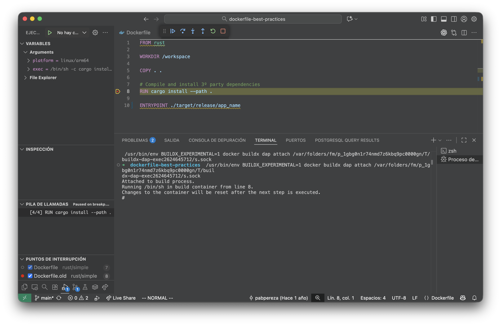
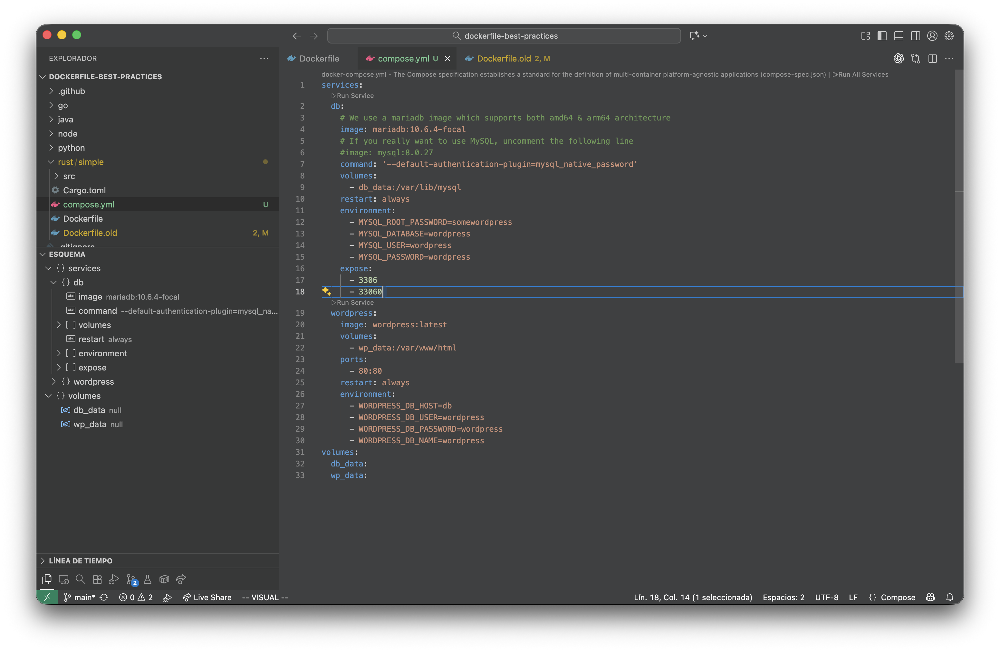

# Depurar builds de Docker en VS Code como un profesional
Construir imágenes de contenedor se ha convertido en un noble arte que, sin ser milenario, ni requerir rituales complejos, si que puede llegar a ser frustrante si no damos con la tecla adecuada. 

¿Te suena familiar esa frustración de no entender qué está pasando durante las diferentes etapas del build? ¿Cuál era el valor de ese ARG? ¿Qué archivos se copiaron realmente en la imagen? Si has trabajado con Docker, seguro que has pasado por esto más de una vez.

Ni hablar cabe del tiempo que se pierde por el camino haciendo prueba y error.

<!-- truncate -->

La buena noticia es que Docker ha estado mejorando la experiencia de desarrollo con actualizaciones en **Docker Build** (Buildx) y la extensión de **VS Code** (Docker DX). 

Además junto con esta funcionalidad, también te voy a hablar del comando `docker debug`, que ya existía desde hace un tiempo pero creo que aún no es muy conocido.

En conjunto, en este vídeo, vamos a aprender a depurar imágenes de Docker en su fase de construcción, previamente a ser ejecutadas y, como no, también en su fase de ejecución.

Vamos con ello.


## DockerDX y Visual Studio Code

Para empezar a depurar Dockerfiles en Visual Studio Code necesitas:

1. **Instalar la última versión** de la extensión Docker DX
2. **Actualizar a la última versión** de Docker Desktop para tener las herramientas de build más recientes
3. **Verificar tu versión de Buildx** ejecutando `docker buildx version` - asegúrate de tener al menos la versión 0.29.x

## Creando una configuración de lanzamiento
Abre tu Dockerfile y luego abre la vista de "Run and Debug" (Ejecutar y depurar) en Visual Studio Code.


Haz clic en el enlace **"create a launch.json file"**. Si ya tienes configuraciones previas, abre tu archivo `launch.json` haciendo clic en el icono de engranaje en la esquina superior derecha de la vista Run and Debug.

En tu archivo `launch.json`, crea una nueva configuración para depurar tu build de Docker. Puedes usar este ejemplo para empezar:

```json
{
  "name": "Docker: Build",
  "type": "dockerfile",
  "request": "launch",
  "dockerfile": "Dockerfile",
  "contextPath": "${workspaceFolder}"
}
```

En cualquier caso, si le das al botón de añadir configuración, deberías ver una opción para **Docker: Build** que puedes seleccionar y se añadirá automáticamente a tu archivo `launch.json`.

## Añadiendo un breakpoint
Ahora que has completado la configuración, vamos a añadir un **breakpoint** a nuestro Dockerfile. Coloca un breakpoint junto a una de tus instrucciones `RUN` haciendo clic en el margen izquierdo del editor o presionando **F9**. Debería aparecer un círculo indicando que se ha añadido el breakpoint.

## Lanzando el depurador
Ya estamos listos para arrancar el depurador. Selecciona la configuración que creaste y pulsa **F5**. El build debería pausarse en la línea `RUN` donde colocaste el breakpoint.


### Funcionalidades de depuración
Ahora te voy a mostrar las tres características principales que proporciona el Buildx Debugger.

#### Inspección de variables
Cuando un build está en estado suspendido, puedes examinar cualquier variable que se haya definido. En este ejemplo, al observar el valor de `workdir` del comando ejecutado en el panel izquierdo, podemos ver que el comando no se está ejecutando en la carpeta correcta, ya que habíamos copiado el contenido en `/app`. Podemos arreglar esto añadiendo `WORKDIR /app` antes de la línea `RUN`. También puedes ver variables que han sido definidas tanto por tu imagen como por la imagen base, como `VAR` y `NODE_VERSION`.


#### Explorador de archivos
Además de inspeccionar variables, también puedes examinar la estructura del sistema de archivos para ver qué ya está ahí y qué has copiado. Para archivos de texto, incluso puedes ver su contenido en el campo `data`.


#### Depuración interactiva
Crear el Dockerfile correcto es casi siempre un proceso iterativo. Esto sucede frecuentemente porque el sistema host en el que estás desarrollando tiene pocas similitudes con la imagen que estás construyendo. Piensa en las diferencias entre ejecutar Ubuntu localmente pero intentar construir una imagen de Alpine Linux. Las pequeñas diferencias en los nombres de paquetes generan un montón de idas y venidas entre tu editor y el navegador buscando el nombre correcto. Añades una línea aquí, comentas otra línea allá, ejecutas `docker build` otra vez y cruzas los dedos.

Este proceso iterativo ahora se puede **optimizar enormemente** con la ayuda del depurador. Cuando tu build está en estado suspendido, abre la vista Debug Console y coloca el cursor en el campo de entrada en la parte inferior. Escribe `exec` y pulsa Enter. La vista de Terminal debería abrirse con una shell conectada a la imagen que se está construyendo.



Esta funcionalidad es un **cambio radical** porque ahora puedes abrir fácilmente la imagen de un Dockerfile en cualquier paso dado e inspeccionar su contenido y ejecutar comandos para hacer pruebas. Antes teníamos que comentar todo lo que venía después de la línea problemática, construir la imagen Docker, y luego ejecutarla manualmente y abrir una shell dentro de la imagen. ¡Todo eso ahora se condensa en añadir un breakpoint en tu editor e iniciar una sesión de depuración! 

Ten en cuenta que ninguno de los cambios que hagas en la terminal se persiste, esto es puramente para experimentación. En la siguiente figura puedes ver que se creó un archivo cuando el depurador estaba pausado en la línea 3. Cuando el depurador avanzó a la línea 4, el archivo desapareció.


### Compose Outline 
También nos ayuda en los ficheros de Docker Compose, agrupando los servicios y facilitando la navegación entre ellos.

Podemos buscarlos como en cualquier otro fichero con Ctrl+P y escribiendo el nombre del servicio, como si fueran variables o funciones en un fichero de código.



Esta vista también muestra la jerarquía de los servicios, lo que facilita la comprensión de cómo se relacionan entre sí.

Además, podemos ejecutar servicios individualmente y directamente en esta vista, lo que agiliza el proceso de desarrollo y prueba.


## Docker debug 

### Depurar imágenes construidas
Este comando nos permite depurar imágenes de docker que ya tengamos creadas o bien contenedores que tengamos en ejecución. Para ello, docker ejecuta un contenedor basado en nixOS con todas las herramientas necesarias para depurar la imagen o contenedor que le indiquemos y nos abre una terminal dentro de ese contenedor.

Para el caso de las imágenes, lo que hace es ejecutarla en un contenedor y a su vez, ejecutar esta contenedor de depuración compartiendo el sistema de archivos del contenedor que se ha creado a partir de la imagen que queremos depurar.

De esta forma, podemos inspeccionar el sistema de archivos de la imagen que queremos depurar y ejecutar comandos dentro de ese sistema de archivos.

Lo podemos hacer con el siguiente comando:

```bash
docker debug <nombre_imagen>
```

### Depurar contenedores en ejecución
También podemos depurar contenedores que ya estén en ejecución. En este caso, lo que hace es compartir el sistema de archivos del contenedor en ejecución con el contenedor de depuración.

Para ello, ejecutamos el siguiente comando:

```bash
docker debug <nombre_contenedor>
```

### Algunos trucos útiles
Para ambos casos, el contenedor de depuración tiene varios comandos útiles como:
* install/uninstall: para instalar o desinstalar paquetes dentro del contenedor de depuración.
* entrypoint: para visualizar las condiciones de arranque del contenedor.
* además, en el arranque da información muy útil sobre el contenedor o imagen que estamos depurando.


## Conclusiones
La nueva funcionalidad de depuración para Docker builds en VS Code, junto con el comando de `docker debug`, son herramientas que realmente marca la diferencia en tu día a día. Estas te permitirán depurar tus aplicaciones basadas en contenedores tanto en la fase de construcción como en la fase de ejecución. 

Si trabajas con Docker de forma habitual, te recomiendo que actualices tus herramientas y pruebes esta funcionalidad. Te va a ahorrar mucho tiempo y frustración.

¡Hasta la próxima!