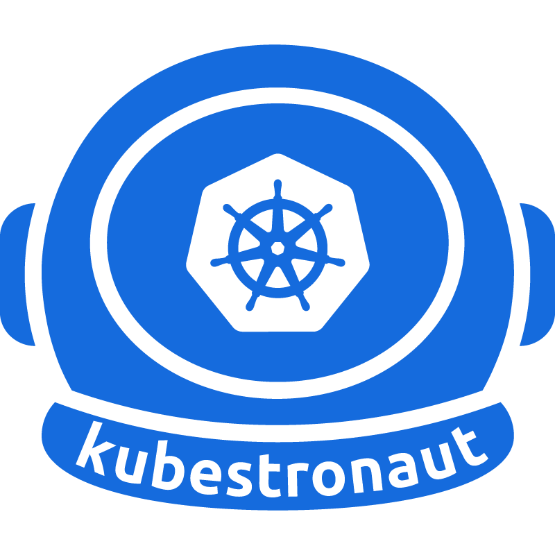
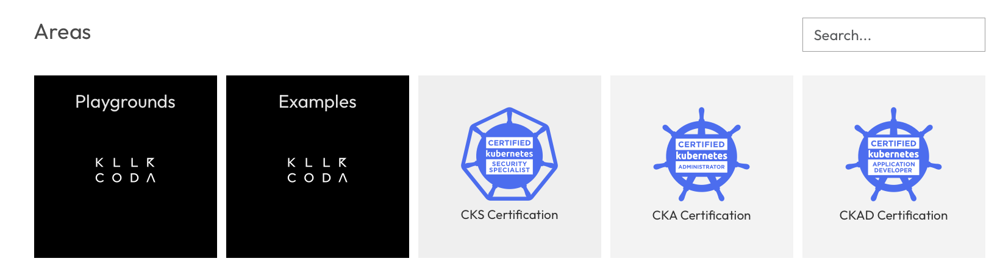

# Kubeastronaut, mi experiencia y todas las dudas
A principios de este año, obtuve el reconocimiento oficial de Kubeastronaut por parte de la CNCF (Cloud Native Computing Foundation).

Esto implica haber obtenido las siguientes certificaciones:
* KCNA - Kubernetes and Cloud Native Essentials
* CKAD - Certified Kubernetes Application Developer
* CKA - Certified Kubernetes Administrator
* KCSA - Kubernetes Security Specialist Associate
* CKS - Certified Kubernetes Security Specialist

En este artículo quiero compartir mi experiencia personal al obtener estas certificaciones, el proceso que seguí, los requisitos necesarios y responder a todas las dudas comunes que puedan surgir sobre Kubeastronaut.

<!-- truncate -->
## ¿Qué es Kubeastronaut?

Kubeastronaut es el reconocimiento más alto que otorga la CNCF a profesionales que demuestran un dominio completo del ecosistema Kubernetes. No es una certificación en sí misma, sino un logro que se obtiene al completar las cinco certificaciones oficiales de Kubernetes. Bueno, miento, no es el más alto, también existe el Golden Kubeastronaut, pero eso ya es otra historia.

La verdad es que estas certificaciones están ganando mucha popularidad en la industria y, además de enseñarte cosas nuevas, también pueden abrirte puertas en el ámbito profesional. En cualquier caso, me gustaría analizar cada una, ver cuáles son las imprescindibles y resolver todas las dudas que me surgieron cuando comencé este camino.

## Mi camino hacia Kubeastronaut

### El orden que seguí

Explico el orden en el que obtuve cada certificación y por qué elegí esa progresión específica. Aunque, siendo francos, no tenía ninguna estrategia. La que más me llamaba la atención era el CKS, pero esta requiere tener sí o sí el CKA. Es el único caso de dependencia entre certificaciones.

Así que me aventuré con el CKA, luego el CKS y, viendo que el CKAD se orientaba más a la parte de desarrollo, que es a quien realmente doy soporte en mi día a día, pensé que sería incluso más útil que el CKA, aunque comparten muchos temas.

Tras completar las tres certificaciones principales, me di cuenta de que existía este programa de Kubeastronaut. Me eché las manos a la cabeza... porque no sabía que existían el KCNA y el KCSA que, a mi entender, son las introducciones teóricas de CKA y CKS respectivamente.

A estas alturas, y aunque sabía que ya no me iban a aportar demasiado, una oferta del Black Friday me hizo decidirme a hacerlas. Y oye, al final, aquí estamos.

### Orden oficial recomendado
Aunque no hay un orden oficial obligatorio, la CNCF sugiere comenzar con el KCNA para establecer una base sólida en Kubernetes y tecnologías nativas de la nube. Luego, dependiendo de tus intereses y objetivos profesionales, puedes optar por CKAD o CKA, seguido de KCSA y finalmente CKS para aquellos interesados en la seguridad.

Quedando así la lista:
1. KCNA
2. CKAD
3. CKA
4. KCSA
5. CKS

## ¿Qué certificaciones me tengo que hacer?
Salvo que quieras venirte arriba y obtener el reconocimiento, te recomendaría los siguientes supuestos:
* Si eres desarrollador y trabajas con aplicaciones en Kubernetes, el CKAD es imprescindible.
* Si eres administrador de sistemas o ingeniero de DevOps, el CKA viene muy bien.
* Si te interesa la seguridad en Kubernetes, el CKS es una excelente opción, pero recuerda que necesitas el CKA primero.

¿Recomiendo las opciones teóricas de KCNA y KCSA? Personalmente, ya tenía experiencia en Kubernetes cuando empecé, así que no las necesité. Si no sabes nada, sí que pueden darte una buena base para empezar.

En cualquier caso, si quieres hacerlas todas, busca las mejores ofertas. También hay un pack para adquirirlas todas en conjunto. Es bastante dinero, así que asegúrate de tu decisión. Si no lo tienes claro, empieza por una y ve viendo si realmente te aporta valor.

He leído muchas veces que las certificaciones tienen un afán recaudatorio. No es del todo cierto, aunque sería discutible en las teóricas. Aunque hay muchos recursos en internet, tener un camino estructurado y oficial te puede ahorrar tiempo. Aquí tú verás si prefieres invertir tu tiempo o tu dinero.

## ¿Compro solo el examen o el pack con materiales?
Siguiendo la reflexión anterior, cada certificación tiene la opción de pagar solo el examen o pagar un pack que incluye materiales de estudio oficiales.

Si pagas solo por los exámenes, puedes buscar recursos gratuitos o de terceros en internet. Hay muchos blogs, vídeos y cursos que pueden ayudarte a prepararte sin gastar dinero en materiales oficiales. Como mi curso de Kubernetes que estoy haciendo en [Youtube](https://www.youtube.com/playlist?list=PLQhxXeq1oc2k9MFcKxqXy5GV4yy7wqSma).

En mi caso, compré los materiales para las prácticas de CKA, CKS y CKAD, y no me arrepiento. Comparé con lo que vi online y creo que vas más al grano y con prácticas específicas. Si tienes experiencia práctica, seguramente puedas aventurarte solo con el examen.

Si solo pagas por el derecho al examen, debes saber que también incluye acceso a dos simulacros de examen oficiales, que pueden ser muy útiles para familiarizarte con el formato y la presión del examen real. Sobre todo porque hay que tener cierta agilidad con el teclado y tener clara la sintaxis de los objetos o saber dónde buscarla rápidamente en la documentación.

Para todos los que tengáis cero experiencia en Kubernetes, queráis aprender bien las bases y os lo podáis permitir, os recomendaría comprar los materiales oficiales.

### Tiempo invertido
En mi caso personal, las certificaciones CKA y CKS me llevaron alrededor de 2-3 meses de ponerme en serio un par de horas diarias. ¡Ojo! Porque esto depende mucho de tu experiencia previa. Yo ya trabajaba en una empresa que usaba Kubernetes, tenía bastante experiencia con contenedores y había hecho un curso de Udemy hacía tiempo.

Una vez obtenidas estas dos, el CKAD me llevó dos semanas en navidades dándole caña, 3-4 horas diarias. Por último, las teóricas KCNA y KCSA me llevaron una semana cada una, dedicando unas 2 horas diarias.

Mi orden no fue el más ortodoxo, también por el desconocimiento inicial. Por eso creo que este vídeo era necesario.

En resumen, en mi caso fueron 2 años de formación, dada la disponibilidad que tenía. Sumado a la universidad, aprovechaba los veranos y los festivos para darle empujones a las certificaciones y luego las dejaba aparcadas un tiempo. Si tenéis disponibilidad y constancia, aún sin experiencia previa, en 6 meses o un año podéis tenerlas todas. A un ritmo más relajado, en un par de años.

El tiempo es importante, porque para cumplir con los requisitos de Kubeastronaut, tienes que tener todas las certificaciones vigentes. Y cada certificación tiene una validez de 2 años desde la fecha de obtención. Además, justo el 1 de abril de 2024 cambiaron el criterio; antes de esa fecha, las certificaciones tenían una validez de 3 años.

### Costes totales
Personalmente, me habré gastado unos 1500 euros en total, entre exámenes y materiales. El black friday esta a la vuelta de la esquina. También, tengo dos cupones de descuento del 50%. Comentaré las bases al final del vídeo.

Sin descuentos, si vas a la web y buscas el pack completo, son 1650$ a fecha de este artículo. 

## Preparación para los exámenes
En mi caso, creo que con los materiales oficiales, hacer los simulacros y practicar mucho en un clúster real, fue suficiente. Eso sí, montarlo com dios manda, con varios nodos, en VMs locales... sudad, no lo hagáis en modo fácil porque aprenderéis mucho menos.

Aquí os dejo el artículo donde monto un cluster real, similiar a la guía oficial del CKA: https://pabpereza.dev/docs/cursos/kubernetes/instalacion_de_kubernetes_cluster_completo_ubuntu_server_con_kubeadm

Durante el curso, seguro que se os rompe un par de veces el cluster, mejor, es parte del aprendizaje. Os cagaréis en todo, pero merecerá la pena.

También me ayudó un montón, y no me cansaré de recomendarla, la web de [https://killercoda.com](https://killercoda.com). Tiene escenarios prácticos gratuitos para practicar comandos y situaciones reales de kubernetes. Indispensable. Además, corrige los ejercicios y tiene una interfaz parecida a la del examen oficial.

Y no hay más misterio, métele horas. No necesitas recursos milagrosos. Solo coger casos prácticos y montarlos tú mismo. También dejo algunos links a recursos interesantes que en su día me ayudaron:
- [https://github.com/techiescamp/cka-certification-guide](https://github.com/techiescamp/cka-certification-guide)
- [https://github.com/techiescamp/cks-certification-guide](https://github.com/techiescamp/cks-certification-guide)
- [https://github.com/dgkanatsios/CKAD-exercises](https://github.com/dgkanatsios/CKAD-exercises)
- [https://github.com/bmuschko/ckad-prep](https://github.com/bmuschko/ckad-prep)

Para todo lo demás, la documentación oficial de Kubernetes es tu mejor amiga. Aprende a buscar rápido en ella, porque en el examen puedes usarla libremente y la usarás mucho.

Por útlimo, creo recordar que los últimos exámenes ya traían el alias `kubectl k` preconfigurado. Ví en su momento que muchas personas se escribían alias también para muchos comandos como "--dry-run=client" o "--field-selector". Personalmente no lo hice, pero si te sientes más cómodo, adelante. 

En mi esperiencia, solo los usé un par de veces en cada examen y tardo menos tiempo en escribirlos.

También VIM es un aliado, si no lo dominas, no pasa nada, pero aprende a moverte rápido por él. La interfaz del examen es un remote desktop que siempre tiene un podo de lag, así que responde mejor al teclado que al ratón.

Tampoco es imprescindible VIM, pero si sabes buscar y reemplazar en él, te ahorras mucho tiempo. Conocidos se lo han sacado con nano u otros, aquí a gustos, pero aprende al menos a borrar líneas enteras, buscar, moverte rápido en el terminal... que el tiempo es oro.

Sí, relacionado con el tiempo, normalmente se va justo para terminarlo todo. Si lo llevas bien da tiempo de sobra y puedes repasar. En mi caso el CKS es el que más me costó y no me sobró nada de tiempo, y eso que me considero super ágil con el terminal... pero las network policies siempre se me lían en el cerebro jajaja.

Ahora sí, veamos las dudas que me habéis pasaado muchos de vosotros.

## Dudas de la comunidad
Me voy a limitar a responder las que no están en el FAQ oficial, ya que ese estará siempre más actualizado. Aquí recopilo las dudas por privado, de linkedin e instagram y, por supuesto, las públicas en los comentarios del vídeo de youtube y la pestaña de comunidad. Gracias a los que os habéis animado a hacerlo y, especialmente, a los que lo habéis hecho públicamente, solo a estos los mencionaré. Que ayuda al posicionamiento de los vídeos y posts 😂.

### ¿Puedo hacer los exámenes en español?
No, están solo disponibles en inglés y japonés o chino, no recuerdo bien. Pero vaya... si tu inglés es básico, no te preocupes, el vocabulario es bastante limitado y específico de Kubernetes. Con un nivel intermedio-bajo puedes apañarte perfectamente. 

También para los que no son nativos, la CNCF ofrece 30 minutos adicionales para completar el examen, lo cual puede ser útil para aquellos que necesiten un poco más de tiempo para leer y comprender las preguntas. Yo no sabía esto y no lo pedí en su día, no se si lo pusieron después o que.

### ¿Qué tan compleja puede el CKS? Que requisitos u otras certificaciones o recorrido se debería tener en cuenta.
Gracias @bry-labs por la pregunta.

Buenos, como comentaba antes, solo necesitas el CKA oficialmente para presentarte. Si además del CKA, ya tenías conocimientos previos, te será un poco más difícil, pero totalmente asequible.

Si no tienes experiencia previa, y tampoco unos buenos fundamentos igual si que te viene bien la KCSA antes. Esta certificación es la específica de seguridad en kubernetes a nivel teórico. Pero vamos, que con el CKA y estudiando un poco, lo puedes sacar sin problemas.

### ¿Cada cuánto tiempo hay que renovar las certificaciones?
Cada certificación tiene una validez de 2 años desde la fecha de obtención. Para renovarlas, debes volver a realizar el examen correspondiente antes de que expire tu certificación actual.

En cualquier caso, yo personalmente no voy a renovarlas. Para mí ya han cumplido su función de aprendizaje y certificación de conocimientos. Además, el coste y el tiempo necesario para renovarlas no justifican el beneficio que obtendría al mantenerlas vigentes, por lo menos en mi situación actual.

### ¿Cómo el proceso del examen? ¿Como te vigilan?
Bueno, antes de empezar verifican vía webcam tu identidad y el entorno donde vas a hacer el examen. Tienes que asegurarte de que no hay nadie más en la habitación contigo y que no tienes materiales de ayuda a mano. El primer examen lo hice en la torre, con la mesa medianamente despejada y aún así me hicieron quitar hasta un ambientador que parecía un altavoz inteligente 😂.

Una vez que aprendí de ese error, en los siguientes los hice con el portátil en la mesa del salón con todo despejado. 

Algunas cosas a tener en cuenta, si usaís web en una torre, aseguraros que el cable os permite moveros un poco, porque tenéis que girarla para mostrar toda la habitación, incluido el suele, debajo del teclado, alformbrilla y mesa. No imagináis lo que sudé la primera comprobación, madre mía. No me llegaba apenas el cable y por poco me deniegan la comprobación. Supongo que me hubieran obligado a fijar otra fecha o incluso perder la convocatoria.

En cualquier caso, leeros bien las normas previas al examen, que son bastante estrictas. No podéis levantaros, no podéis beber agua... nada de nada. Solo podéis tener el ordenador con el que hacéis el examen, una botella de agua transparente y el DNI, punto.

En el CKS, me advirtiron dos veces, una por rascarme la nariz (porque no puedes taparte la boca durante el examen, por si piensan que hablas con alguien) y en otra ocasión, por leer en voz alta una pregunta. Así que cuidadín con eso.

También, en el CKAD, estaba tan cansado ese día que tenía la vista borrosa y, me acercaba tanto a la pantalla que no se me veía el rostro completo. Me avisaron una vez, me alejé un poco y ya está. Igualmente, yo no jugaría mucho con la paciencia del supervisor remoto, después de un par de avisos te pueden dar por suspendido el examen. Tampoco os digo esto para presionar, a veces es inebitable, simplemente tened cuidado. Para mi personalmente me es muy dificil no ponermete a cantar en voz alta las preguntas o rascarme la frente cuando estoy concentrado.

### ¿En que momento salen las mejores ofertas para comprar los exámenes?
Creo que la mejor época es el black friday, que suelen sacar packs con descuentos interesantes. También, de vez en cuando, la CNCF lanza promociones especiales o descuentos para estudiantes y miembros de ciertas organizaciones. Así que vale la pena estar atento a su sitio web oficial y sus redes sociales para no perderse ninguna oferta.

### ¿Habrá certificaciones para Docker?
De @spectronewcastro. Pues la CNCF no tiene certificaciones oficiales para Docker. Para esta tecnología te recomendaría la DCA (Docker Certified Associate) que validará tus habilidades y conocimientos en el uso de Docker y contenedores. 

Personalmente no la he hecho, pero tengo buen feedback de ella. A mi ya no me interesa mucho porque salió cuando ya tenía mucha experiencia.

### ¿Cuál sería el mejor orden para realizar las 5 certificaciones? Teniendo en cuenta que todas tienen que estar vigentes para obtener el Kubeastronaut..., ¿Cómo las situarías por ranking de dificultad?
De @Juanje42, gracias por la pregunta. Como comentaba anteriormente, creo que lo mejor sería seguir el orden oficial que comentaba antes. Puedes empezar por el KCNA, es la base teórica inical. Luego, te da igual CKAD o CKA, dependiendo de si eres más desarrollador o administrador. Si vas con miendo, igual te es más fácil el CKAD. Luego KCSA y por último CKS.

Mi nota de dificultad personal sería:
1. CKS - 8/10
2. CKA - 7.5/10
3. CKAD - 7/10
4. KCSA -  5/10
5. KCNA - 4/10

Este ranking lo he intentado hacer sin ponderar mi experiencia previa, intentando ser objetivo. Pero claro, cada uno tendrá su propia experiencia y puede variar. Todo el que conozco que la tiene, con un poco de experiencia previa, la ha sacado sin problemas. 

Las teóricas no son difíciles, solo requieren entender los conceptos. Concretamente la KCSA, al ser la parte de seguridad, tiene conceptos más complejos o nuevos para muchos. Pero vamos, que con estudiar los materiales oficiales, lo puedes sacar sin problemas.

También en su momento me hice con tests de ChatGPT para que me fuera preguntando mientras conducía. Había que amortizar el tiempo.

Un matiz, porque yo hice el orden mal, entonces las teóricas las hice al final. Si las haces al principio, igual te ayudan a entender mejor los conceptos para los prácticos y tu experiencia es más sencilla en general.

### Resto de dudas
En general, la mayoría quedarían contestadas, principalmente os preocupaba el orden, coste, dificultad o mi experiencia personal. Si tenéis más dudas, podéis dejarlas en los comentarios del vídeo de YouTube y con gusto las responderé.

## Sorteo de cupones de descuento
Por último, y lo que estaríais esperando muchos, voy a sortear dos cupones de descuento del 50% para las principales certificaciones de la CNCF, sí, incluidas las del Kubeastronaut.

Podéis participar desde cualquier parte del mundo, las bases son las siguientes:
* Ser suscriptor del canal de YouTube
* Seguirme en Instagram [@pabpereza](https://www.instagram.com/pabpereza/)
* Dejar un comentario en el primer post fijado mencionando a otra persona.

Si ganas, te enviaré dos cupones para ti y para la persona con la que quieras certificarte, para que os podáis apoyar y motivar mutuamente en el proceso de estudio.

Cuantos más comentarios dejéis, más oportunidades tenéis de ganar, aunque solo podrás mencionar una vez a la misma persona. El sorteo se realizará el domingo 16 de noviembre (2025, por si alguien lee esto en el futuro) y anunciaré los ganadores en Instagram y YouTube.

Nos vemos en el próximo. ¡Un abrazo!