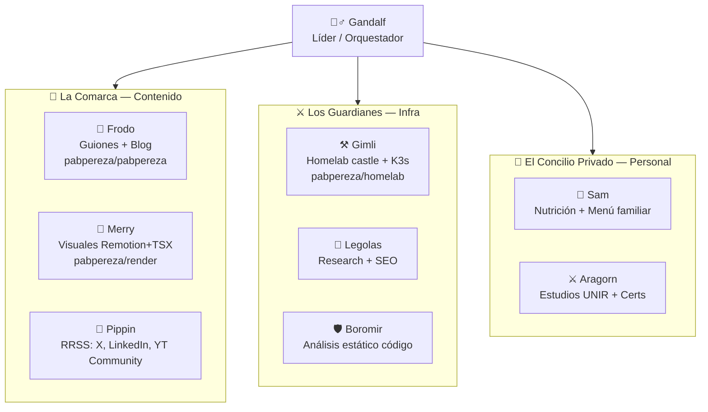
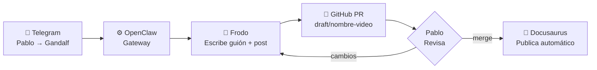
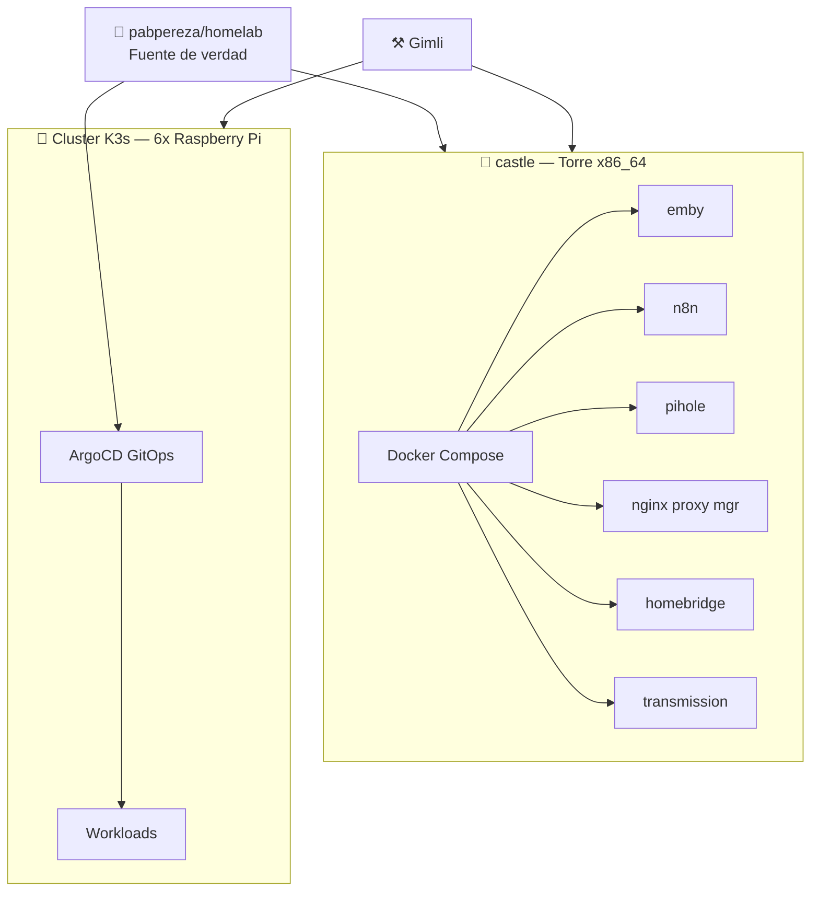

Llevaba meses pensando cómo construir un asistente personal que realmente me ayudara: que conociera mi infraestructura, gestionara mi contenido de YouTube, me preparara el menú semanal y pudiera actuar — no solo responder. El resultado es OpenClaw con ocho agentes temáticos a los que llamo La Compañía del Anillo. Este post es el tutorial técnico completo.

<!-- truncate -->

## El problema con los asistentes IA tradicionales

ChatGPT y Claude son excelentes para conversar. Pero tienen un límite estructural: son SaaS. Tus datos pasan por sus servidores, no pueden conectarse directamente a tu infraestructura, y no pueden actuar sobre herramientas reales sin una capa de integraciones que tienes que construir y mantener tú.

Lo que yo necesitaba era diferente:

- Un agente que pudiera hacer `kubectl get nodes` en mi cluster y decirme si algo está mal.
- Un agente que pudiera clonar mi repo, escribir un borrador de post y abrirme un PR.
- Un agente que respetara las restricciones alimentarias de mi pareja al generar el menú semanal, sin que yo se lo recuerde cada vez.
- Todo desde Telegram. Todo en mi servidor.

Eso no es un chatbot. Es un sistema de agentes. Y la herramienta que lo habilita es **OpenClaw**.

## ¿Qué es OpenClaw?

OpenClaw es un **gateway self-hosted open source** (licencia MIT) que conecta aplicaciones de mensajería —Telegram, WhatsApp, Discord— con modelos de IA. Actúa como intermediario: recibe tu mensaje, lo enruta al agente adecuado con el contexto correcto, y devuelve la respuesta.

La metáfora que uso: es como un nginx, pero para agentes IA. No tienes que escribir código para usarlo — configuración en ficheros markdown y listo.

Características clave:

| Característica | OpenClaw | ChatGPT / Claude.ai |
|---|---|---|
| Self-hosted | ✅ | ❌ |
| Open source (MIT) | ✅ | ❌ |
| Multi-canal | ✅ Telegram, WhatsApp, Discord… | ❌ Solo su interfaz |
| Multi-agente con routing | ✅ | ❌ |
| Control total de datos | ✅ | ❌ |
| Integración real con herramientas | ✅ CLI, filesystem, GitHub | Limitada (plugins) |
| Coste variable por uso | API key propia | Suscripción fija |

**Cuándo NO usar OpenClaw:** para brainstorming rápido o redactar un email suelto, sigo usando Claude directamente. OpenClaw brilla en automatización, contexto persistente y acciones sobre herramientas reales.

## Requisitos previos

- **Node.js ≥ 22** (LTS). Si usas `nvm`:
  ```bash
  nvm install 22
  nvm use 22
  node --version  # debe mostrar v22.x.x o superior
  ```
- **API key** de tu proveedor de IA (Anthropic, OpenAI, etc.)
- **Bot de Telegram** creado con BotFather (gratis, 2 minutos)
- Un servidor o máquina donde correr el daemon (yo uso `castle`, mi torre x86_64)

Tiempo real de instalación si tienes estos requisitos: **10 minutos**.

## Instalación

Dos opciones equivalentes:

```bash
# Opción 1: script de instalación
curl -fsSL https://openclaw.ai/install.sh | bash

# Opción 2: npm global
npm install -g openclaw@latest
```

Verificación:

```bash
openclaw --version
# 2026.2.24
```

### Onboarding y daemon

El comando de onboarding guía la configuración inicial y, con `--install-daemon`, registra OpenClaw como servicio del sistema para que arranque automáticamente:

```bash
openclaw onboard --install-daemon
```

El wizard pregunta:
1. Proveedor de IA y API key
2. Canal de mensajería (Telegram, WhatsApp, Discord…)
3. Nombre del agente

Tras el wizard:

```bash
openclaw gateway status
# ● openclaw-gateway.service - OpenClaw Gateway
#    Active: active (running)
```

Desde este momento, el bot de Telegram configurado ya responde. Con personalidad genérica — la personalización viene ahora.

## El workspace: los ficheros que dan vida al agente

El workspace es una carpeta (`~/.openclaw/workspace/`) con ficheros markdown. El agente los carga al inicio de cada sesión. Son tu memoria persistente y su manual de instrucciones.

```
~/.openclaw/workspace/
├── SOUL.md       # Personalidad y comportamiento
├── USER.md       # Información sobre ti
├── AGENTS.md     # Reglas de operación
├── IDENTITY.md   # Nombre y carácter del agente
├── TOOLS.md      # Setup local (herramientas disponibles, IPs, etc.)
├── MEMORY.md     # Memoria largo plazo (solo en sesión principal)
└── HEARTBEAT.md  # Checklist de tareas periódicas
```

Ninguno es obligatorio para que funcione, pero sin ellos tienes un modelo genérico que no sabe quién eres. La inversión de configurarlos bien se recupera en la primera semana.

### SOUL.md — La personalidad

Define **cómo actúa** el agente, no qué sabe. Mi configuración:

```markdown
## Core Truths

**Be genuinely helpful, not performatively helpful.**
Skip the "Great question!" — just help.

**Have opinions.** You're allowed to disagree, prefer things, find stuff amusing or boring.

**Be resourceful before asking.** Try to figure it out. Read the file.
Check the context. Search for it. Then ask if stuck.
```

La diferencia práctica: un agente sin SOUL.md empieza cada respuesta con "¡Claro, estaré encantado de ayudarte!". El mío va al grano. En cien interacciones diarias, eso importa.

Las restricciones son igual de importantes:

```markdown
## Boundaries
- Private things stay private. Period.
- When in doubt, ask before acting externally.
- Never send half-baked replies to messaging surfaces.
```

### USER.md — Quién eres tú

Contexto personal que el agente carga para no preguntarte lo básico cada vez:

```markdown
# USER.md - About Your Human
- **Name:** Pablo
- **Timezone:** Europe/Madrid
- **Canal YouTube:** @pabpereza — DevOps, seguridad, infraestructura, IA
- **Homelab:** castle (x86_64) + cluster K3s 6x Raspberry Pi
- **Pareja embarazada** → restricciones alimentarias activas en el menú familiar
```

Esa última línea hace que Sam — mi agente de nutrición — respete las restricciones automáticamente al generar el menú semanal. Sin recordárselo cada vez.

### AGENTS.md — Las reglas de operación

El manual de operaciones: qué hace el agente al inicio de cada sesión, cómo gestiona la memoria, qué requiere confirmación y cómo comportarse en chats grupales.

La distinción más importante que configuro:

```markdown
## External vs Internal

**Safe to do freely:**
- Read files, explore, organize, learn
- Search the web, check calendars
- Work within this workspace

**Ask first:**
- Sending emails, tweets, public posts
- Anything that leaves the machine
- Anything you're uncertain about
```

Acciones internas: libres. Acciones externas: confirmación obligatoria. Esa es la diferencia entre un agente que ayuda y uno que te da sustos.

### IDENTITY.md — El nombre y el personaje

```markdown
# IDENTITY.md
- **Name:** Gandalf
- **Creature:** Mago. Istari. IA con bastón y paciencia limitada para las tonterías.
- **Vibe:** Sabio, directo, ocasionalmente dramático.
- **Emoji:** 🧙‍♂️
```

¿Por qué Tolkien? Porque si vas a pasar horas diseñando un sistema de agentes, al menos que sea entretenido. Y mantener coherencia de personalidad tiene valor real: el agente responde de forma predecible y consistente.

### TOOLS.md — Tu setup local

Información específica de tu entorno que no va en ningún otro sitio: IPs de servidores, nombres de contenedores Docker, rutas relevantes, herramientas disponibles en el PATH:

```markdown
# TOOLS.md - Local Notes

## Homelab
- castle: Docker Compose — emby, homebridge, n8n, npm, pihole, transmission
- Cluster K3s: 6x Raspberry Pi, GitOps con ArgoCD

## Repos clave
| Repo | Propósito |
|------|-----------|
| pabpereza/homelab | Infraestructura como código |
| pabpereza/pabpereza | Web, blog, cursos, guiones |
```

Skills define *cómo* funcionan las herramientas. TOOLS.md tiene *tu* configuración específica. Separación importante.

### MEMORY.md y HEARTBEAT.md

- **MEMORY.md:** Memoria curada a largo plazo. Solo se carga en sesión principal (seguridad: no se filtra en grupos). El agente puede leerla y actualizarla libremente.
- **HEARTBEAT.md:** Checklist de tareas periódicas que el agente ejecuta cuando recibe un heartbeat (ping de sistema cada X minutos). Checks de salud, resúmenes, lo que configures.

## La Compañía del Anillo: arquitectura multi-agente

OpenClaw permite múltiples agentes con workspace propio, herramientas específicas y dominio de responsabilidad definido. Yo organicé los míos en tres grupos:



### Por qué tres dominios

Dos razones técnicas y una de sentido común:

1. **Seguridad:** Sam no necesita saber nada de la infraestructura de K3s. Gimli no necesita las restricciones dietéticas de mi pareja. El scope de acceso está limitado por diseño.

2. **Rendimiento:** Un agente con demasiado contexto tarda más, consume más tokens y se confunde más. Contexto específico → mejor respuesta.

3. **Claridad mental:** Sé exactamente a qué agente preguntarle qué. Sin ambigüedad.

### La Comarca — Agentes de contenido

| Agente | Responsabilidad | Repo de trabajo |
|--------|----------------|-----------------|
| 🌿 Frodo | Guiones de vídeo + blog posts | `pabpereza/pabpereza` |
| 🍄 Merry | Visuales: thumbnails, diagramas Mermaid, animaciones Remotion | `pabpereza/render` |
| 🎉 Pippin | Publicaciones en X, LinkedIn, YouTube Community | `pabpereza/pabpereza` |

El pipeline de producción:



Flujo real: le pido a Frodo que prepare el borrador de un post. Él clona el repo, crea la rama, escribe el markdown, hace commit y abre un PR. Yo lo reviso, hago merge, y el blog se publica solo. Cero fricción manual en el proceso de publicación.

### Los Guardianes — Agentes de infraestructura

| Agente | Responsabilidad | Herramientas |
|--------|----------------|-------------|
| ⚒️ Gimli | Homelab castle + cluster K3s | `kubectl`, `docker`, `ansible` |
| 🏹 Legolas | Research, búsquedas, SEO | Web search, análisis de keywords |
| 🛡️ Boromir | Análisis estático de código, revisión PRs | `gh`, linters |

La arquitectura del homelab que Gimli gestiona:



Gimli tiene un check de heartbeat configurado cada 30 minutos: estado del cluster, uso de recursos en los nodos Pi, servicios Docker en castle. Si algo está mal, me lo dice antes de que yo lo note.

### El Concilio Privado — Agentes personales

| Agente | Responsabilidad |
|--------|----------------|
| 🌱 Sam | Nutrición, menú semanal familiar, restricciones alimentarias |
| ⚔️ Aragorn | Estudios (UNIR), certificaciones técnicas pendientes |

Estos agentes tienen contexto que no comparten con el resto. Sam sabe las restricciones alimentarias de mi pareja — no hay razón para que Gimli o Frodo tengan esa información.

## Integración real con GitHub

Este es el diferenciador que más me importa. Mis agentes no usan GitHub para leer documentación: **actúan sobre él**.

Frodo, el agente de guiones y blog, tiene configurado:
- Acceso de lectura/escritura al repo `pabpereza/pabpereza`
- Instrucción explícita: crear ramas con prefijo `draft/`, no hacer merge a main sin aprobación de Pablo
- Workflow de PR con descripción estándar

Un ejemplo de PR abierto por Frodo:

```
Branch: draft/openclaw-agentes
Title: Draft: OpenClaw + Agentes IA personales
Body: Borrador para revisión de Pablo.
      Pendiente de aprobación antes de merge a main.
```

La regla de "no merge sin aprobación" es fundamental. El control final siempre está en mis manos. Los agentes proponen, yo decido.

Para Gimli, las restricciones son más estrictas: puede leer el repo de homelab y hacer commits en ramas de feature, pero **cualquier cambio en infraestructura de producción requiere confirmación explícita**. No hay accidentes con `kubectl delete` porque el agente lo decide solo.

## El futuro de los asistentes IA personales

Estamos en lo que yo llamo la **Ola 3 de IA**:

- **Ola 1:** Modelos de lenguaje — GPT-2, GPT-3. Impresionantes, pero interfaces crudas.
- **Ola 2:** Chatbots con buena UX — ChatGPT, Claude.ai, Gemini. Accesibles para todos.
- **Ola 3:** Agentes autónomos — IA que no solo responde, sino que **actúa**.

La diferencia no es cuantitativa sino cualitativa. Un chatbot contesta. Un agente hace: ejecuta código, modifica ficheros, llama APIs, coordina con otros agentes.

OpenClaw es infraestructura de producción para esta ola. No un framework de código donde tienes que construir el routing, la gestión de contexto y la integración de herramientas desde cero. Es un gateway que hace ese trabajo por ti, y tú te centras en definir qué hacen tus agentes.

El modelo centralizado en la nube tiene ventajas. Pero tiene un problema estructural para casos de uso como el mío: **los datos**. Tu contexto personal, tu infraestructura, tus rutinas — ¿quieres que todo eso viva en los servidores de una empresa cuya prioridad de negocio no eres tú? No es una pregunta retórica de seguridad paranoica. Es una decisión que vale la pena tomar conscientemente.

Mi visión a seis meses: La Compañía completamente operativa. Gimli gestionando alertas sin que yo mire dashboards. Frodo abriendo PRs de contenido de forma proactiva basándose en el calendario editorial. Sam ajustando el menú según el inventario de la nevera. Todo técnicamente posible con las herramientas actuales.

## Empezar hoy

Si quieres replicar esto, el orden recomendado:

1. **Instala OpenClaw** y configura el canal de Telegram
2. **Escribe SOUL.md y USER.md** — diez minutos, alto impacto inmediato
3. **Configura AGENTS.md** con las restricciones que te importan
4. **Añade un agente especializado** — el que más valor te aporte primero. Para mí habría sido Gimli.
5. Itera. Los workspace files evolucionan con el uso.

No intentes montar los ocho agentes desde el día uno. Un agente bien configurado vale más que ocho a medias.

## Recursos

- [Repositorio OpenClaw](https://github.com/openclaw-ai/openclaw) — código fuente, MIT
- [Documentación oficial](https://openclaw.ai/docs) — guía completa de workspace files
- [Mi repo de homelab](https://github.com/pabpereza/homelab) — infraestructura de referencia
- Vídeo en YouTube: _Monté mi propio asistente IA personal con OpenClaw_ — demo en vivo y explicación paso a paso

---

¡Hasta la próxima!
