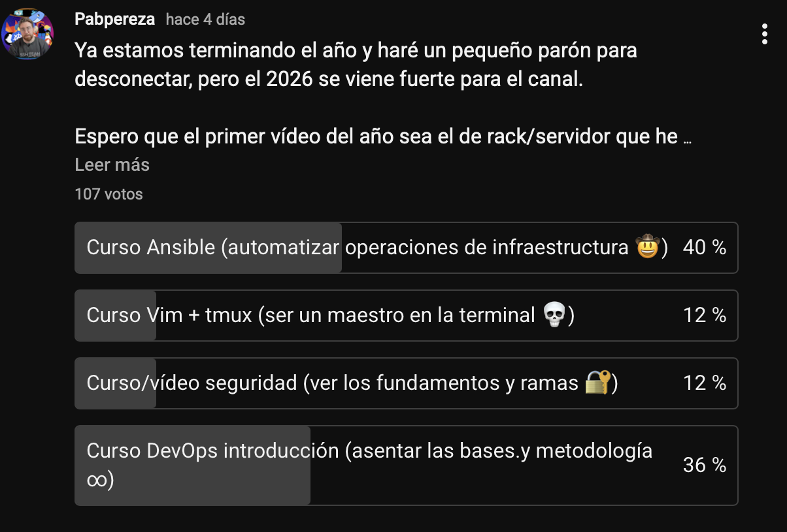

# ¡Somos 20.000! Hay más gente en este canal que en mi ciudad
Esta es Arnedo, una ciudad preciosa de La Rioja conocida por el calzado.

Según el último censo, aquí vivimos unas **15.000 personas**. Es una cifra que para mí siempre ha significado "mucha gente".

Pero este 25 de diciembre, al mirar las estadísticas del canal, me he llevado un gran regalo de navidad. ¡Hemos superado los 20.000 suscriptores en YouTube!

TODO: Incluir plano de la ciudad. ¿Barrido con el estabilizador? Igual hasta timelapse

Esto sería llenar con creces esta ciudad entera, y, viéndolo así, me parece una locura. También es verdad que todo mola más cuando se mide en ciudades, campos de fútbol o aviones Boeing 747. Aunque bueno, en estas escalas sería poco más que el estadio de las Gaunas del Logroñés o 50 aviones juntos. Este comparación si me gusta más.

En fin, que me enrollo. Quería aprovechar este vídeo especial para daros las gracias y contaros un poco cómo veo el canal ahora que hemos alcanzado esta cifra redonda.

Esto ya solo es un hobby para mí, se ha convertido en una parte fundamental de mi vida, de mis motivaciones y también de mi crecimiento profesional.

Este canal me ha dado dolores de cabeza, horas de estrés y también alguna que otro noche sin dormir todo lo que debería. Pero, sobre todo, me ha dado muchas alegrías, aprendizajes y personas increíbles a las que he podido conocer gracias a él.

Gracias por estar ahí, por comentar, por compartir y por formar parte de esta comunidad. Sois la leche. Gracias de verdad por el apoyo.

En este vídeo quiero contaros mi perspectiva sobre el canal, lo que tengo que pensado para 2026, hablar de la sostenibilidad del proyecto y, por último, dejaros un regalito. Quedate hasta el final.

TODO: Transición con efecto zoom al estudio

## De la ilusión a la consolidación

TODO: Incluir plano del estudio, sentado en la silla frente a la cámara, hablando directamente al espectador.

Hace poco más de un año celebrábamos los 5.000 suscriptores. En aquel vídeo os contaba que estaba sorprendido, casi incrédulo. Hoy, la sensación es diferente: siento **orgullo y responsabilidad**.

El crecimiento de estos últimos meses ha sido exponencial. Hace unos meses preparaba esta entrada [Ruta DevSecOps](../mi_ruta_devsecops_2025/mi_ruta_devsecops_2025.md), comentando un poco mi trayectoria profesional así que no me repetiré mucho. Si te interesa, te recomiendo que lo veas.

Este canal comenzó con las ganas de compartir ideas locas que se pasaban por la cabeza, como usar zip bombas para proteger una web o como hackear algun servicio que otro. Siempre que me preguntan, digo lo mismo, era más una forma de poder expresarme y, ya de paso, dejar de darle la brasa a mis amigos tekies.

En este proceso, vi que la enseñanza era una forma muy poderosa de aprendizaje. Enseñar te obliga a estructurar ideas, a documentarte y a practicar mucho más de lo que solemos hacer en el día a día.

Con el tiempo, el canal ha crecido, me he exigido más calidad, he aprendido edición de vídeo, usar cámaras, iluminación, sonido... y he ido puliendo el contenido.

También he mejorado considerablemente mi dicción, que sigue siendo muy mejorable, pero no veas lo mal que he hablado siempre y lo que se frustraba mi madre conmigo.

Pero claro, como todo lo que crece, también madura y trae consigo responsabilidades. Ahora ya no soy simplemente una persona que graba vídeos en su casa, también absorbo una responsabilidad de cara a la comunidad.

Recibo mucho amor en vuestros comentarios pero también he recibido donaciones, personas que se han hecho miembros del canal y, bueno, por lo menos para mi, cuando alguien te da su dinero, aunque sea un euro, sientes que tienes que corresponder de alguna forma. Por lo que intentaré que, además de ser un hobbie, también pueda ser un proyecto sostenible en el tiempo, equilibrado pasión, tiempo, calidad y recursos.

En cuanto a dinero y sostenibilidad de el canal, lo comentaré al final. Vamos con el contenido del canal.

¿Qué tengo pensado para 2026?

## Estado de las promesas y 2026

TODO: Incluir planos de los cursos, screencasts, etc.

En el especial de 5k prometí que el **curso de Kubernetes** sería una realidad. Aún sigo trabajando en ello, pero esta bastante maduro y espero terminarlo este año (con todas sus variantes de especialización).

Este año me habéis pedido mucho contenido sobre DevOps, en concreto Ansible. Hace una semana lancé la siguiente encuesta en la comunidad:
> ¿Qué curso os gustaría que hiciera a continuación?
> - Curso de Ansible
> - Curso de DevOps
> - Curso de Seguridad
> - Curso de Vim + Tmux

Estos han sido los resultados:

Aunque intentaré abordar todo lo que ponía en la encuesta, parece que Ansible es lo que más os interesa. Así que será el siguiente curso que empiece a preparar.

También exploraré mucho la parte de homelab, hardware y los laboratorios que monte en mi casa para dar soporte a los cursos y probar nuevas tecnologías.

En cuanto a DevOps, creo que me faltan vídeos más introducctorios y, un curso de iniciación, podría ser interesante.

Va a ser un año muy intenso, con mucho trabajo y mucho contenido. Espero que os guste.

Y, dicho esto, me gustaría hablar un poco de la sostenibilidad del canal.

## Sostenibilidad del canal
Como comentaba, esta canal nace de un hobby, pero con el tiempo se ha convertido en una parte muy importante de mi vida. La cantidad de horas que le dedico es enorme y, aunque lo hago con mucho gusto, también necesito que sea sostenible en el tiempo.

Actualmente no busco vivir directamente de ello, me gusta mi puesto actual y creo que aún debo aprender mucho más en el sector. Más adelante, me gustaría poder dedicarme a esto y dar clases para universidades, institutos o empresas, pero no siento que esté aún en ese momento.

Lo que si veo es que estoy en el punto de inflexión de contratar ayuda externa para la edición de vídeo y otras tareas pesadas del canal que me quitan mucho tiempo. Tiempo que me gustaría dedicar a crear contenido, investigar y aprender nuevas tecnologías.

Estuve en septiembre trabajando con una empresa, aunque no cuajó, porque no me veía aún delegando la estrategia del canal. Si que ví que necesitaba ayuda para poder mantener el ritmo, la constancia y no quemarme por el camino.

Para ello, he invertido todo el dinero que ha generado este canal en comprar equipo nuevo hasta llegar al nivel de calidad que deseaba y, creo por los comentarios, que lo he conseguido.

En 2026, mi idea de sostenibilidad para el canal, es que pueda cubrir al menos los gastos de un editor que me descarge un poco de trabajo.

Ahora genero algo más de dinero mensualmente con la publicidad de Youtube, algunos de vosotros os habéis hecho miembros del canal y también recibo donaciones puntuales a través de Youtube.

Pero no he llegado aún a ese punto. Mi idea es, seguir creando contenido gratuito pero 2 cosas:
* Maximizar los ingresos de las membresías utilizando una plataforma como Patreon que no se lleve tanta comisión como Youtube.
* Crear contenido exclusivo, personal o incluso sesiones de consultoría o mentoría para los mecenas del canal.

Esto sumaría las siguientes ventajas:
* Ver el contenido por adelantado y sin publicidad.
* Acceso a contenido exclusivo creado solo para mecenas, detrás de cámaras y material adicional.
* Decidir el tema de un vídeo al mes e influenciar en la dirección del canal.
* Acceso a sesiones de consultoría o mentoría personalizadas (según el nivel de aportación).
* Camisetas tan guapas como esta.
* Sorteos exclusivos
* y mucho más.

Esto lo hago principalmente para poder dar valor a las personas que ya están apoyando económicamente el canal, que de verdad, os lo agradezco un montón y espero poder corresponderlo. Además, igual atraer nuevos mencenas que quieran apoyar el proyecto.

Si consigo llegar a ese punto, podré contratar ayuda externa y dedicar más tiempo a crear contenido de calidad para vosotros de una forma continuada. 

Os dejo el enlace a mi Patreon en la descripción por si queréis echarle un vistazo: 
TODO: Crear un Patreon

## Un regalo para la comunidad
No podía cerrar este especial sin un regalo. Vuelvo a sortear otros dos cupones del 50% de descuento para las certificaciones de la CNCF (Cloud Native Computing Foundation) pero ojo, esta vez voy con todo, porque además sortearé un kit de Raspberry Pi 5 completo para montar tu propio laboratorio en casa y un lote de pegatinas de programación, tecnología y del canal.

En resumen, todo esto es lo que quiero sortear:
* Primer premio: Dos cupones del 50% de descuento para las certificaciones de la CNCF (Cloud Native Computing Foundation) valorados entre 150-200€ cada uno, según la certificación que elijáis.
* Segundo premio: Un kit de Raspberry Pi 5 completo para montar tu propio laboratorio en casa (Raspberry Pi 5, caja, fuente de alimentación, tarjeta SD... ect) valorado en unos 100€ (según el país del premiado).
* Tercer premio: Un lote de pegatinas de programación, tecnología y del canal valorado en unos 30€.

Seguidme en instragram, ahí anunciaré las bases del sorteo y la fecha del directo donde los realizaré.

## Gracias por todo
Gracias por hacer de este humilde canal lo que es hoy. Gracias por estar ahí, por comentar, por compartir y por formar parte de esta comunidad. De verdad, sois la leche.

Nos vemos en el próximo commit. ¡Chao!

