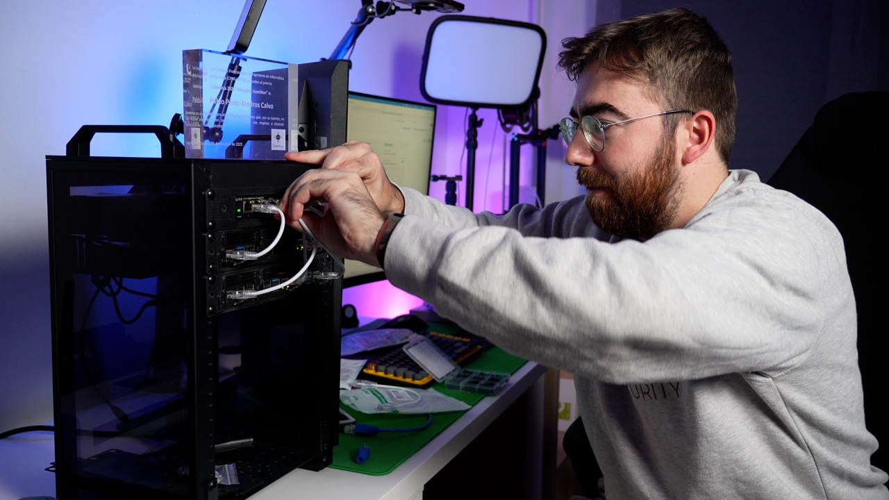

# Proyecto HomeLab - Montando mi primer Rack de 10" con Raspberry Pi (Parte 1)
Hola a todos y bienvenidos. Tenía muchísimas ganas de escribir este post porque, por fin, tengo terminada la primera versión de mi rack.

Hace tiempo que quería alejarme de la dependencia de tantas suscripciones en la nube (OneDrive, iCloud, etc.) y centralizar mis datos. Además, como genero mucho contenido de vídeo para el canal, necesitaba una solución de almacenamiento escalable. Pero, siendo sinceros, la razón principal es **mi gusto personal por el cacharreo**.

Quería montar un laboratorio en casa para aprovechar todas las Raspberry Pi que tenía acumuladas, crear un clúster de Kubernetes dedicado a mis cursos y trastear con nuevas tecnologías en un entorno realista.

## ¿Por qué un Rack de 10 pulgadas?

El objetivo era tener algo compacto. No tengo espacio en casa para un armario rack estándar de 19 pulgadas (los gigantes de los CPD), ni tendría equipo suficiente para llenarlo.

Descubrí el estándar de **10 pulgadas**, una opción muy "cuqui" y funcional.
Elegí el modelo **Rack T1 de la marca DeskPi**, concretamente la versión de 8 unidades (8U). Es perfecto porque:

* Es compacto y cabe en cualquier rincón o estantería.
* Es compatible con impresoras 3D domésticas (las piezas entran en la cama de impresión).
* Permite centralizar red y cómputo en una sola caja portátil.

## El Hardware
Todos los materiales los compré por amazon, los enlaces de abajo son de afiliados (a ti te cuesta lo mismo y a mí me ayudas a mantener vivo el proyecto).

La lista de materiales incluye:
* **[Rack DeskPI RackMate T1 8U](https://amzn.to/3N0Mc9G):** El chasis de 10" y 8 unidades de altura.
* **[Raspberry Pi 4/5](https://amzn.to/3N0Mc9G):** Varias unidades para el clúster.
* **[Switch](https://amzn.to/3N0Mc9G):** Un TP-Link de 8 puertos Gigabit (unos 30€).
* **[Alimentación](https://amzn.to/3N0Mc9G):** Una fuente de 300W con múltiples salidas USB (5V/5A) para alimentar las Raspberrys sin llenar todo de cargadores individuales.
* **[Digitus (Regleta)](https://amzn.to/3N0Mc9G):** Una regleta específica para rack de 10" de la marca Digitus.
* **[Tarjetas SD](https://amzn.to/3N0Mc9G)**: De 64Gb, aunque podrían ser de más o menos capacidad según tus necesidades.
* **[Cables de red](https://amzn.to/3N0Mc9G):** Latiguillos cortos (15-25 cm) para evitar enredos.
* **[Cabezales autocrimpables](https://amzn.to/3N0Mc9G):** Por si quieres hacer tus propios cables.
* **[Conectores de alimentación en L](https://amzn.to/3N0Mc9G):** Para gestionar mejor el espacio en el rack.

Toda esta parte de homelab, la añadiré a una colección de afiliados de amazon llamada [Mi HomeLab en Amazon](https://amzn.to/3N0Mc9G) donde iré actualizando los componentes que use en futuros proyectos.

## Impresión 3D: La personalización clave

Como el estándar es de 10 pulgadas, hay muchísimos modelos en Internet para imprimir accesorios. Quería que el acabado fuera sobrio, así que usé filamento **negro mate** para evitar brillos extraños.

Imprimí dos tipos de piezas principales:

1. **Soporte para el Switch TP-Link:** Encontré un modelo que encaja perfectamente y deja los puertos a ras del frontal. [Enlace a Thingiverse](https://www.thingiverse.com/thing:7099814)
2. **Módulos para Raspberry Pi:** Unos brackets que permiten montar hasta 3 Raspberry Pi en una sola unidad de rack (1U). Son modulares, por lo que puedo combinar modelos de RPi 3, 4 o 5 simplemente cambiando la pieza de anclaje. [Enlace a thingiverse](https://www.thingiverse.com/thing:6707403)

## El montaje y la gestión de cables

Aquí es donde viene la diversión (y el sufrimiento). Para la red, tuve un dilema: **¿Hacer mis propios cables o comprarlos hechos?**

Al principio intenté crimpar mis propios cables usando conectores "toolless" (que no requieren crimpadora). Aunque funcionan, los cabezales son enormes y el cable rígido es difícil de gestionar en un espacio tan pequeño.

**La solución:** Comprar latiguillos de red cortos (15-25 cm) específicos para rack. Son más finos, flexibles y estéticamente quedan mucho mejor.

Para la alimentación, coloqué la fuente USB y un SSD (para el almacenamiento del clúster) en la parte trasera, usando bandejas impresas. El resultado es un frontal muy limpio y una trasera donde solo sale **un cable de alimentación y un cable de red** hacia el router principal.

## Resultado final y próximos pasos

El rack ahora mismo aloja mi switch, el clúster de Kubernetes inicial y la gestión de energía. Todo está contenido y es fácil de transportar si necesito mover el laboratorio.

Esto es solo la **Parte 1**. En el futuro planeo:
* Montar un sistema **NAS** dentro del rack (estoy dudando entre usar Raspberrys con adaptadores SATA o una placa Mini-ITX, ¡acepto sugerencias en los comentarios!).
* Configurar todo el software Open Source (Kubernetes, Pi-hole, gestión de contenedores).

Espero que os haya gustado el montaje y os anime a crear vuestro propio entorno de "Self-Hosting" para dejar de depender tanto de terceros.

¡Nos vemos en la próxima parte con la configuración del software!
