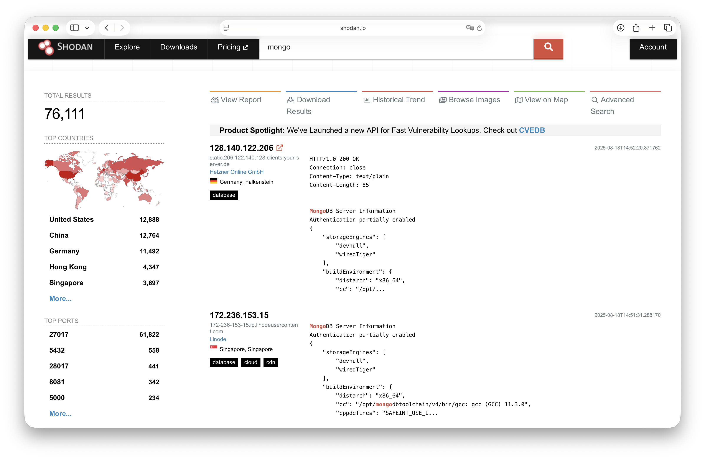

# Jamás confíes ciegamente en la IA, y menos para tu infrastructura
Hace un par se semanas, un amigo me escribió frustrado por un problema que tenía en una base de datos, concreatamente un mongodb desplegado con Docker.

Cada noche su base de datos desaparecía, no se explicaba porqué, pensaba que montaba mal los volúmenes o que no estaba utilizando docker compose como se debía.

Tras revisarlo, nos dimos cuenta que le estaban secuestrando la base de datos y pidiéndole un rescate en criptomonedas por el contenido de la misma. 

El problema, confiando en el docker compose que generó una IA expuso de forma indebida la base de datos y esto permitió a ciberdelincuente entrar y robar toda la información.

Por suerte, esta base de datos era para una aplicación que empezaba a desarrollar y no había ningún dato sensible pero podría haber sido muy grave en cualquier otra situación.

Todo esto, me dió la idea de hacer este vídeo, compartir la experiencia que tuvo, y responder 3 preguntas:

* ¿Cómo se predujo el ciberataque y como los cibercriminales detectan tan rápido un servicio expuesto si el servidor y la base de datos estaban recién levantadas y ni si quiera están indexadas en google u otros buscadores?
* ¿Que errores de seguridad tenemos que evitar cuando desplegamos nuestras applicaciones en servidores con Docker y cuáles son las configuraciones claves hay que tener en cuenta en materia de seguridad?
* ¿Porque hay que repasar el resultado de una IA, evitando confiar ciegamente en ella, y como podemos usarla para corregir sus propios errores?

Quédate hasta el final para saber como se produjo el error, como un cibercriminal detectó el servicio expuesto en apenas unas horas y como pudimos solucionarlo rápidamente. 


## ¿Cómo detecta un ciberdelincuente un servicio expuesto?
La pregunta más habitual en estos casos suele ser, ¿por qué a mí? ¿cómo lo han encontrado tan rápido esta base de datos si mi aplicación no está indexada en buscadores?. 

Existe la falsa creencia de que si algo no es conocido, no es popular, está libre de peligros. En plan, quien me va a atacar a mí, mi servidor de pruebas no tiene nada de valor. Que es un problema de seguridad no se vea no significa que no exista, a esto lo llamaamos en el sector, seguridad por oscuridad, y no suele ser efectiva todo sea dicho.

La mayoría de los ataques hoy en día son automatizados y normalmente buscan siempre el eslabón más debil. Si lo piensas tienen sentido, que prefieres, invertir muchos recursos en un ataque complejo, sofisticado y caro de realizar, o ir recogiendo muchas migas de pan de forma sencilla.

Con este último enfoque, es como miles de programas, bots o automatismos manejados por cibercriminales es como consiguen rápidamente descubrir servicios expuestos mal configurados. Aquí concretamente existe un servicio que se llama shodan y es uno de los tantos que se encarga que analizar servicios expuestos en la red.

Shodan es una aplicación que podríamos llamar el google de los dispositivos. Los buscadores indexan páginas o servicios web, shodan IPs y puertos. Simplemente funcionan analizando todas las IPs y puertos públicos en internet y creando una base de datos. Veamos como consultar esta información

Podemos entrar en la [web de shodan](https://www.shodan.io/) y empezar a buscar dispositivos por IP, servicios que contiene, puertos, país... una maravilla. 

Vamos a filtrar por bases de datos de mongo expuestas públicamente en internet, haber lo que nos encontramos. Podemos utilizar los filtros en la interfaz o escribir simplemente mongo para ver que hay cerca de unos 70.000 mongos expuestos alrededor del mundo, mayoritariamente en el puerto 27017 (el de por defecto). 



Shodan no solo lista los puertos abiertos, sino que se conecta a ellos y lee las respuestas, permiéndole indentificar en los mensajes de bienvenida el tipo de servicio que es y el protocolo que utiliza. Otro ejemplo de que el ocultismo no funciona, por si estabas pensaban en cambiar el puerto por defecto y pensar que estabas a salvo.

También podríamos buscar directamente las IPs de nuestros servidores, que seguro que os ha surgido la curiosidad de saber lo que tenéis expuesto. 

Hilando desde la perspectiva de un ciberdelicuente, utilizar estas bases de datos en automatimos, permiten atacar a discrección cualquier servicio expuesto. Además, si sabemos filtrar y estamos atentos a las vulnerabilidad del sector, podemos identificar las versiones exactas de un software que sería fácilmente explotable por un fallo de seguridad. 

Bonus tip, te puedes instalar la CLI de shodan o utilizarlo como librería de python en tus programas. Personalmente, utilizo mucho el siguiente comando para enumerar rápidamente información de un servidor.
```bash
shodan host <IP>
```

Finalmente, volviendo con nuestro caso, al exponerse el mongo de mi amigo a internet (o cualquier servicio que expongas tu mismo) se vuelmente automáticamente en el foco de ataques. Da igual la popularidad del servicio, su tráfico, el dinero que maneje el servicio, los automatismos no entienden de clases. Si os interesa conocer el volumen de ataques que se reciben a diario, puedes levantar un honeypot que actue de imán de ciberataques para que te hagas una idea.


## Seguridad en Docker
La mayoría de las personas no saben que docker hace un bypass del firewall. ¿Cómo? ¿Esto es normal?. Al menos en Linux, es como funciona Docker. Por defecto, hace caso omiso de las reglas que podáis aplicar en un firewall tipo ufw de debian/ubuntu o similares.


Por eso, cuando hacemos un docker run como este:
```
docker run -d -p 27017:27017 --name mongodb mongo
```

o en un compose:
```
services:
  mongodb:
    image: mongo
    ports:
      - "27017:27017"
```

Tenemos que tener claro que en Linux, y salvo en las versiones de Docker Desktop, ejecutar así un contenedor implica que abre también ese puerto en el host y lo vincula con el del contenedor. Por consiguiente, también lo estas exponiendo públicamente a internet.


Tenemos dos formas de solucionarlo, o bien quitamos el mapeo de puertos o lo configuramos adecuadamente para que no esté expuesto. 

* Si optamos por quitar el mapeo, no te preocupes, si tienes varias aplicaciones en un compose estas seguirán siendo accesibles entre ellas. Por defecto, docker compose genera una red para todos los contendores y entre ellos siempre habrá visibilidad salvo que se indique lo contrario.
* Si necesitas igualmente exponer el puerto en el host, puedes hacerlo de forma segura precediento el puerto del host con `127.0.0.1:`. De esta forma, solo será accesible desde el host y no desde el exterior. Por defecto, docker lo expone con `0.0.0.0:` y es el motivo principal por el que esto puede ser un problema.

El docker compose quedaría así:
```bash
services:
  mongodb:
    image: mongo
    ports:
      - "127.0.0.1:27017:27017"
```

Y, si solo fuerais a acceder al mongo desde la red de docker, podéis quitar directamente el mapeo de puertos. Recuerda que esto no impediría al container de mongo abrir su puerto, simplemente solo sería visible dentro de la red de docker. El compose quedaría así:
```bash
services:
  mongodb:
    image: mongo
```

Una vez que expones el puerto en el host de forma privada, lo más fácil y seguro es enrutar a tus servicios a traves de SSH, ya sea para conectarse a una base de datos o configurar cualquier cosa.

## Moralejas
Aunque seamos desarrolladores, nos dediquemos a la parte de datos o simplemente no sepamos mucho de infraestructura, no podemos confiar ciegamente en la IA. No se puede saber de todo, eso esta claro, pero recuerda que la IA no tiene el contexto de todo. Apoyate siempre en compañeros del área devops, sistemas o seguridad, si disponéis en la empresa.

En el video veremos si le podemos dar ese contexto a la IA para saber si se podría haber evitado.

Nos vemos en el siguiente.


