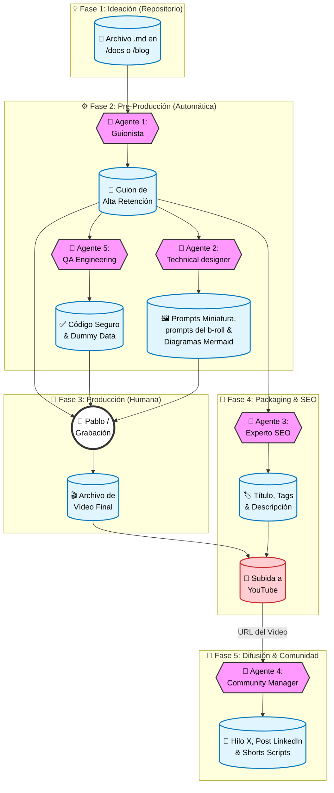

### 🔄 Resumen del Flujo de Trabajo Automatizado 

Ahora que tienes los 5 agentes, así es como deberías usarlos con tu repositorio para maximizar tu productividad:

1.  **Paso 1 (Blog/Docs):** Tienes una idea o un apunte en `/docs/notas`.
    * *Acción:* Se lo pasas al **Guionista DevOps**.
    * *Resultado:* Tienes el guion con los "Hooks" y la estructura de retención.
2.  **Paso 2 (Validación):** Tomas los bloques de código del guion.
    * *Acción:* Se los pasas al **Code Validator**.
    * *Resultado:* Código limpio, seguro y datos de prueba listos para tu terminal.
3.  **Paso 3 (Visuales):**
    * *Acción:* Le pides al **Visualizador Técnico** la miniatura y diagramas.
    * *Resultado:* Generas la imagen con DALL-E/Midjourney y el diagrama en Mermaid.
4.  **Paso 4 (Grabación):** *Aquí entras tú.* Grabas la voz y la pantalla siguiendo el guion y usando el código validado.
5.  **Paso 5 (Publicación):**
    * *Acción:* Le pasas el guion final al **Experto SEO**.
    * *Resultado:* Tienes título, descripción y tags para subir a YouTube.
6.  **Paso 6 (Promoción):**
    * *Acción:* Le pasas el enlace del vídeo publicado al **Community Manager**.
    * *Resultado:* Tienes el hilo de Twitter, el post de LinkedIn y las ideas para Shorts.

