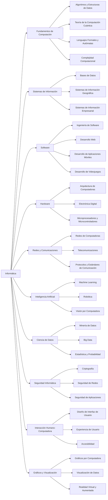

```mermaid
graph LR
  A[Informática] --> B[Fundamentos de Computación]
  A --> C[Sistemas de Información]
  A --> D[Software]
  A --> E[Hardware]
  A --> F[Redes y Comunicaciones]
  A --> G[Inteligencia Artificial]
  A --> H[Ciencia de Datos]
  A --> I[Seguridad Informática]
  A --> J[Interacción Humano-Computadora]
  A --> K[Gráficos y Visualización]
  
  B --> BA[Algoritmos y Estructuras de Datos]
  B --> BB[Teoría de la Computación Cuántica]
  B --> BC[Lenguajes Formales y Autómatas]
  B --> BD[Complejidad Computacional]

  C --> CA[Bases de Datos]
  C --> CB[Sistemas de Información Geográfica]
  C --> CC[Sistemas de Información Empresarial]

  D --> DA[Ingeniería de Software]
  D --> DB[Desarrollo Web]
  D --> DC[Desarrollo de Aplicaciones Móviles]
  D --> DD[Desarrollo de Videojuegos]

  E --> EA[Arquitectura de Computadoras]
  E --> EB[Electrónica Digital]
  E --> EC[Microprocesadores y Microcontroladores]

  F --> FA[Redes de Computadoras]
  F --> FB[Telecomunicaciones]
  F --> FC[Protocolos y Estándares de Comunicación]

  G --> GA[Machine Learning]
  G --> GB[Robótica]
  G --> GC[Visión por Computadora]

  H --> HA[Minería de Datos]
  H --> HB[Big Data]
  H --> HC[Estadística y Probabilidad]

  I --> IA[Criptografía]
  I --> IB[Seguridad de Redes]
  I --> IC[Seguridad de Aplicaciones]

  J --> JA[Diseño de Interfaz de Usuario]
  J --> JB[Experiencia de Usuario]
  J --> JC[Accesibilidad]

  K --> KA[Gráficos por Computadora]
  K --> KB[Visualización de Datos]
  K --> KC[Realidad Virtual y Aumentada]
```