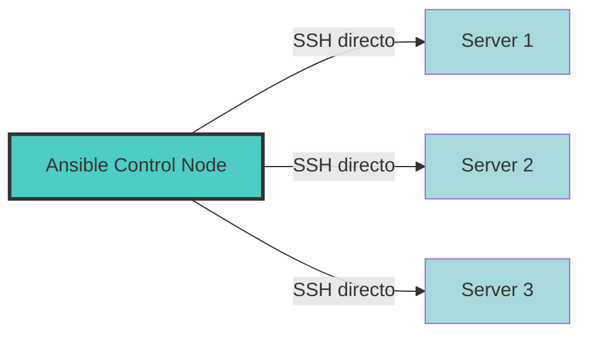
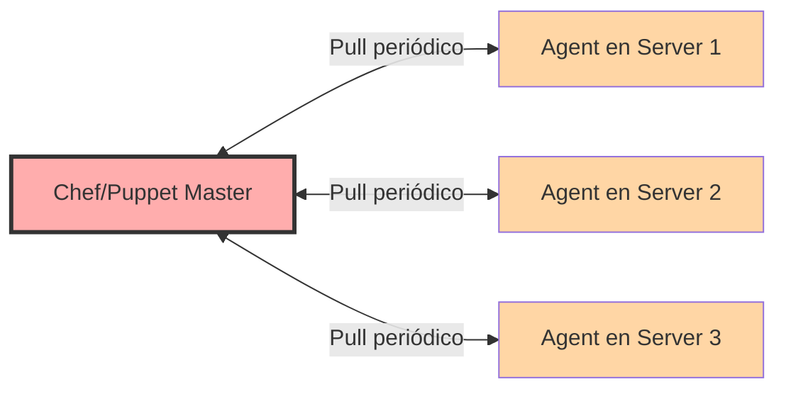
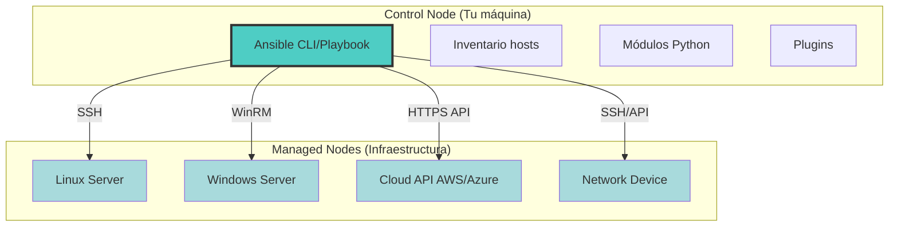
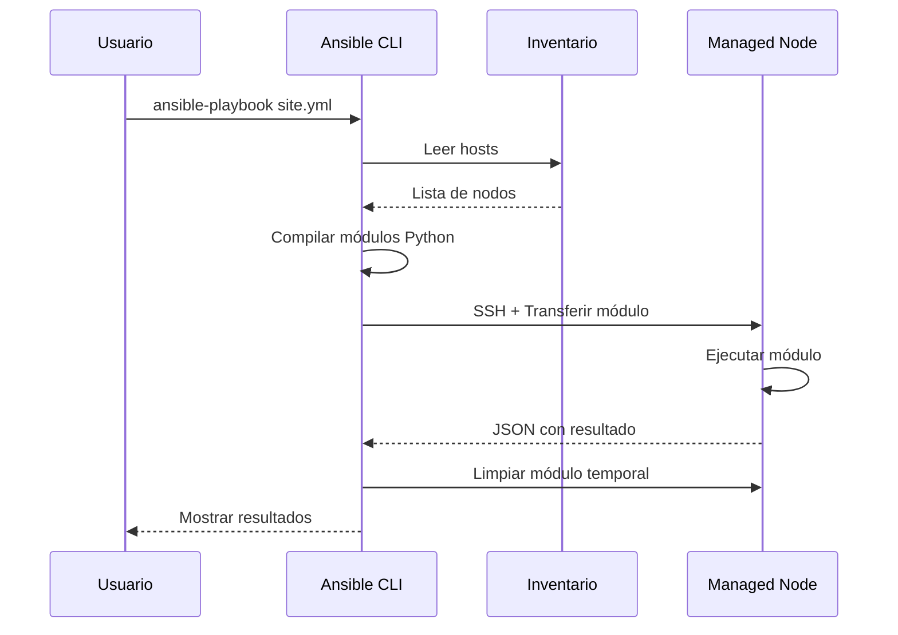

# Introducción: ¿Qué es Ansible? 🚀

Bienvenido al curso de Ansible. En esta introducción descubrirás qué es Ansible, por qué es una de las herramientas de automatización más populares del mundo DevOps, y cómo puede transformar la forma en que gestionas tu infraestructura.

:::info Video de Introducción
Video pendiente de grabación. Suscríbete al canal de YouTube para recibir la notificación.
:::

## 🎯 ¿Qué es Ansible?

### Definición
**Ansible** es una plataforma de automatización IT open-source que permite:
- **Gestión de configuraciones**: Mantener servidores en un estado deseado
- **Despliegue de aplicaciones**: Automatizar el deployment de software
- **Orquestación**: Coordinar tareas complejas entre múltiples sistemas
- **Aprovisionamiento**: Configurar infraestructura desde cero

### La Filosofía: Simplicidad y Potencia
```
Complejidad tradicional → Ansible → Simplicidad radical
      ↓                      ↓              ↓
  Scripts caóticos    YAML legible    Infraestructura predecible
```

Ansible fue creado en 2012 por Michael DeHaan con un objetivo claro: hacer la automatización IT accesible para todos, no solo para expertos en programación. En 2015 fue adquirido por Red Hat (ahora IBM), consolidándose como estándar de la industria.

## 🌟 Casos de Uso Principales

### 1. Gestión de Configuración
Mantén la coherencia en todos tus servidores. Si tienes 100 servidores web, asegúrate de que todos tengan la misma configuración de Nginx, los mismos certificados SSL y las mismas políticas de seguridad.

**Ejemplo práctico:**
```yaml
- name: Configurar servidores web uniformemente
  hosts: webservers
  tasks:
    - name: Instalar Nginx
      apt:
        name: nginx
        state: present

    - name: Configurar firewall
      ufw:
        rule: allow
        port: '80,443'
        proto: tcp
```

### 2. Despliegue Continuo (CI/CD)
Integra Ansible en tus pipelines de Jenkins, GitLab CI o GitHub Actions para desplegar aplicaciones de forma automatizada y consistente.

### 3. Orquestación Multi-Tier
Coordina despliegues complejos que involucran bases de datos, load balancers, servidores de aplicación y más, en el orden correcto.

### 4. Gestión de la Nube
Aprovisiona y gestiona recursos en AWS, Azure, Google Cloud, OpenStack y otras plataformas cloud.

### 5. Cumplimiento y Auditoría
Garantiza que tu infraestructura cumple con estándares de seguridad (PCI-DSS, HIPAA, SOC2) aplicando configuraciones de forma automática y auditable.

### 6. Disaster Recovery
Automatiza la reconstrucción completa de tu infraestructura en minutos, convirtiendo un desastre en un inconveniente menor.

## ⚔️ Ansible vs Otras Herramientas (Chef, Puppet, SaltStack)

### Comparativa Rápida

| Característica | Ansible | Chef | Puppet | SaltStack |
|----------------|---------|------|--------|-----------|
| **Agentes** | ❌ No (Agentless) | ✅ Sí | ✅ Sí | ✅ Sí |
| **Lenguaje** | YAML (Declarativo) | Ruby (Imperativo) | DSL propio | YAML + Python |
| **Curva de aprendizaje** | 🟢 Baja | 🔴 Alta | 🟡 Media | 🟡 Media |
| **Modelo** | Push | Pull | Pull | Push/Pull |
| **SSH nativo** | ✅ Sí | ❌ No | ❌ No | ✅ Opcional |
| **Velocidad inicial** | 🚀 Muy rápida | 🐌 Lenta | 🐌 Lenta | 🏃 Rápida |

### Ventajas de Ansible

#### 1. **Sin Agentes (Agentless)**


**Beneficios:**
- No necesitas instalar/mantener software adicional en tus servidores
- Menor superficie de ataque (seguridad)
- Arranque inmediato: si tiene SSH, puedes gestionarlo

**Chef/Puppet:**


**Inconvenientes:**
- Debes instalar y mantener agentes en cada servidor
- Los agentes consumen recursos (CPU, RAM)
- Si el agente falla, pierdes control del servidor

#### 2. **YAML Legible**
Ansible usa YAML, un formato de datos human-readable que puedes entender aunque no sepas programar.

**Ansible (YAML):**
```yaml
- name: Asegurar que Apache está corriendo
  service:
    name: apache2
    state: started
    enabled: yes
```

**Chef (Ruby DSL):**
```ruby
service 'apache2' do
  action [:enable, :start]
  supports :restart => true, :reload => true
end
```

**Puppet (DSL propio):**
```puppet
service { 'apache2':
  ensure => 'running',
  enable => true,
}
```

#### 3. **Modelo Push vs Pull**

**Ansible (Push):**
- TÚ decides cuándo se ejecutan los cambios
- Control total del timing
- Ideal para CI/CD y despliegues bajo demanda

**Chef/Puppet (Pull):**
- Los agentes consultan periódicamente al master
- Cambios eventuales (cada 30min por defecto)
- Mejor para mantener estado a largo plazo

**¿Cuándo es mejor cada uno?**
- **Push (Ansible)**: Despliegues puntuales, CI/CD, cambios críticos inmediatos
- **Pull (Chef/Puppet)**: Infraestructura masiva que debe autocurarse continuamente

#### 4. **Curva de Aprendizaje**

**Tiempo para ser productivo:**
- **Ansible**: 🟢 1-2 días (si sabes SSH y YAML básico)
- **SaltStack**: 🟡 1-2 semanas
- **Chef**: 🔴 2-4 semanas (requiere conocimientos de Ruby)
- **Puppet**: 🔴 2-4 semanas (requiere aprender su DSL)

### Cuándo NO usar Ansible

Ansible no siempre es la mejor opción:

❌ **Infraestructura gigante (10,000+ nodos) con cambios frecuentes**: SaltStack es más rápido en ejecución masiva paralela.

❌ **Necesitas un agente siempre monitorizando**: Puppet/Chef tienen agentes que pueden detectar drift (desviación) y autocorregir sin intervención manual.

❌ **Lógica de negocio compleja en Ruby**: Si tu equipo ya es experto en Ruby y Chef, migrar puede no aportar valor.

✅ **La mayoría de los demás casos**: Ansible es la opción más pragmática.

## 🏗️ Arquitectura de Ansible: Visión General

### Componentes Principales



### 1. **Control Node (Nodo de Control)**
Es donde instalas y ejecutas Ansible. Puede ser:
- Tu portátil local
- Un servidor bastión/jump host
- Un runner de CI/CD (Jenkins, GitHub Actions, GitLab Runner)

**Requisitos:**
- Sistema operativo: Linux, macOS, WSL (no Windows nativo)
- Python 3.8+
- Ansible instalado (`pip install ansible`)

### 2. **Managed Nodes (Nodos Gestionados)**
Los sistemas que automatizas. **No necesitan Ansible instalado**, solo:
- **Linux/Unix**: SSH habilitado + Python 2.7 o 3.5+
- **Windows**: WinRM habilitado + PowerShell 3.0+
- **Dispositivos de red**: API REST o SSH

### 3. **Inventario (Inventory)**
Un archivo (INI, YAML o script dinámico) que lista tus hosts y los agrupa.

**Ejemplo (`hosts.ini`):**
```ini
[webservers]
web1.ejemplo.com
web2.ejemplo.com

[databases]
db.ejemplo.com

[production:children]
webservers
databases
```

### 4. **Módulos (Modules)**
Unidades de código reutilizable que ejecutan tareas específicas:
- `apt`, `yum`: Gestión de paquetes
- `service`: Gestión de servicios
- `file`, `copy`, `template`: Gestión de archivos
- `user`, `group`: Gestión de usuarios
- `docker_container`, `k8s`: Contenedores
- Más de 3,000 módulos incluidos + colecciones comunitarias

### 5. **Playbooks**
Archivos YAML que definen el estado deseado de tu infraestructura. Son como "recetas" o "partituras" que Ansible ejecuta.

### 6. **Plugins**
Extensiones que amplían las capacidades de Ansible:
- **Connection plugins**: SSH, WinRM, Docker, kubectl
- **Inventory plugins**: AWS EC2, Azure, GCP, VMware
- **Filter plugins**: Transformaciones de datos (Jinja2)

### Flujo de Ejecución



## 📋 Prerrequisitos para este Curso

### Conocimientos Recomendados

#### Esenciales (Debes tener)
- ✅ **Linux básico**: Navegación por terminal, comandos básicos (ls, cd, cat, vim/nano)
- ✅ **SSH**: Saber conectarte a un servidor remoto (`ssh user@host`)
- ✅ **YAML básico**: Entender la sintaxis (o aprender en el curso)

#### Útiles (Ayudan mucho)
- 🟡 **Git**: Control de versiones para tus playbooks
- 🟡 **Docker**: Para practicar sin romper nada
- 🟡 **Cloud básico**: AWS/Azure/GCP conceptos generales

#### No Necesarios (Los aprenderás aquí)
- ❌ Programación avanzada
- ❌ Experiencia previa con IaC
- ❌ Certificaciones

### Entorno de Práctica

Para seguir el curso necesitarás:

1. **Un sistema de control (tu PC)**
   - Linux, macOS o Windows con WSL
   - Python 3.8+ instalado
   - Editor de texto (VS Code recomendado con extensión YAML)

2. **Nodos de práctica** (al menos uno):

   **Opción A: Máquinas virtuales locales**
   - VirtualBox/VMware + Ubuntu Server
   - Vagrant para automatizar VMs

   **Opción B: Contenedores Docker**
   - Más ligero y rápido
   - Ideal para experimentar

   **Opción C: VPS en la nube**
   - AWS EC2 free tier
   - DigitalOcean Droplet ($5/mes)
   - Linode, Vultr, etc.

3. **Configuración SSH**
   - Claves SSH generadas (`ssh-keygen`)
   - Acceso sin contraseña configurado (ssh-copy-id)

### Verificación de Prerrequisitos

Antes de empezar, verifica que tienes todo listo:

```bash
# ¿Tienes Python 3?
python3 --version  # Debe ser 3.8 o superior

# ¿Tienes SSH?
ssh -V  # OpenSSH debe estar instalado

# ¿Tienes un servidor accesible? (ejemplo)
ssh usuario@ip_servidor  # Debe conectar sin errores

# ¿Puedes crear archivos YAML?
echo "clave: valor" > test.yml && cat test.yml
```

Si todos estos comandos funcionan, ¡estás listo! 🎉

## 🎓 Qué Aprenderás en este Curso

Este curso está estructurado en módulos progresivos:

### **Fundamentos** (Módulos 1-6)
- ✅ Arquitectura y conceptos core
- ✅ Instalación en diferentes sistemas
- ✅ Inventarios y comandos ad-hoc
- ✅ Escribir playbooks efectivos
- ✅ Variables, facts y templating
- ✅ Condicionales, bucles y manejo de errores

### **Avanzado** (Módulos 7-9)
- ✅ Roles y estructura modular
- ✅ Ansible Vault (secretos seguros)
- ✅ Jinja2 templates avanzados
- ✅ Ansible Tower/AWX (GUI empresarial)
- ✅ Integración con CI/CD
- ✅ Futuro de Ansible y tendencias

### **Proyectos Prácticos**
- 🛠️ Configurar un cluster web completo (Nginx + PHP-FPM)
- 🛠️ Desplegar una aplicación Dockerizada
- 🛠️ Hardening de servidores (seguridad)
- 🛠️ Backup automático multi-servidor

## 🚀 ¿Por qué Aprender Ansible en 2026?

### Demanda Laboral
- **+40% de ofertas DevOps** mencionan Ansible (Stack Overflow 2025)
- **Salarios**: DevOps Engineers con Ansible ganan 15-25% más que sin automatización
- **Empresas**: Usado por Red Hat, NASA, Apple, Cisco, Bloomberg

### Comunidad y Ecosistema
- **100,000+ Ansible roles** en Ansible Galaxy
- **3,000+ módulos** oficiales + miles de colecciones comunitarias
- **Documentación exhaustiva** y comunidad activa en GitHub

### Futuro-Proof
- **Ansible Automation Platform 2.x** (Red Hat) con soporte empresarial
- **Event-Driven Ansible**: Reacciona automáticamente a eventos (próxima generación)
- **Integración con Kubernetes**: Ansible Operator para gestionar apps cloud-native

## 📚 Recursos Adicionales

Antes de comenzar el módulo 1, ten estos recursos a mano:

- 📖 **Documentación Oficial**: [docs.ansible.com](https://docs.ansible.com)
- 🎮 **Ansible Galaxy**: [galaxy.ansible.com](https://galaxy.ansible.com)
- 💬 **Comunidad**: Reddit r/ansible, Stack Overflow
- 📺 **YouTube**: [Canal de pabpereza](https://youtube.com/@pabpereza)

---

## ✅ Siguiente Paso

Ahora que entiendes qué es Ansible, sus ventajas y cómo se compara con otras herramientas, es hora de ensuciarse las manos.

**➡️ Continúa con:** [Módulo 1: Fundamentos y Arquitectura](101.Fundamentos_arquitectura.md)

¡Nos vemos en el próximo módulo! 🎯
