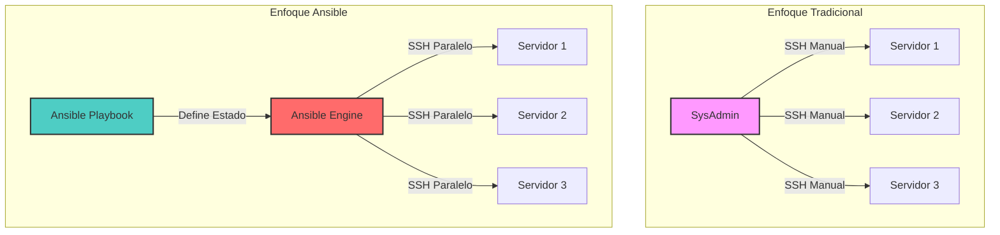
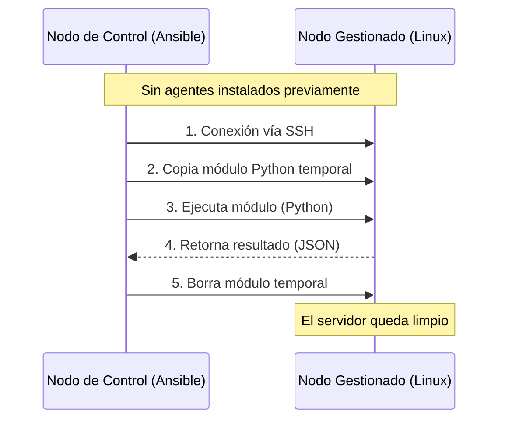
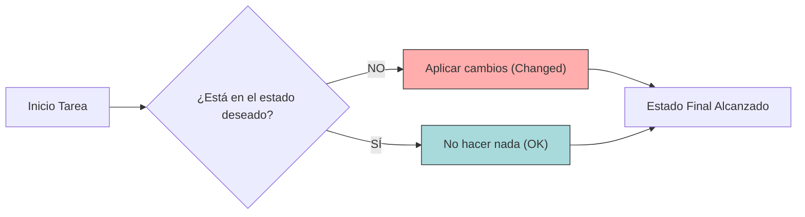
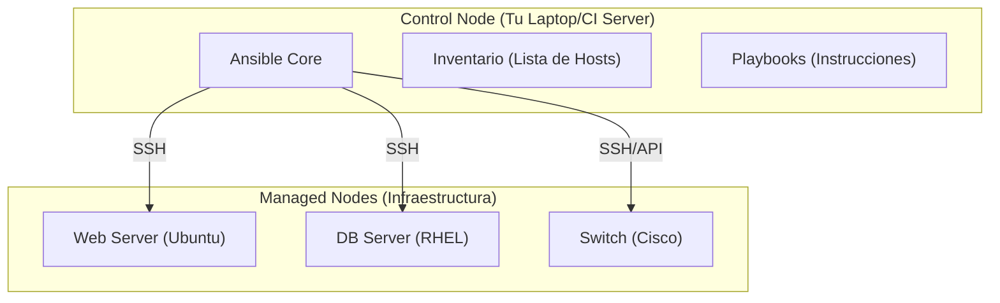

# Fundamentos y arquitectura de Ansible 🏗️

:::info Video pendiente de grabación
Suscríbete al canal de YouTube para recibir la notificación.
:::

## 1.1. ¿qué es ansible? iac y evolución

### 🎻 La analogía: el director de orquesta
Imagina que tienes que dirigir una orquesta de 100 músicos.
*   **Método Manual (SysAdmin tradicional):** Vas músico por músico diciéndole qué nota tocar en cada momento. Te vuelves loco y la música suena fatal.
*   **Scripts (Bash/Python):** Les das una partitura, pero si uno se pierde, la canción se rompe.
*   **Ansible (IaC):** Eres el director. Tienes una partitura maestra (Playbook). Tú marcas el ritmo y el estado deseado ("¡Más fuerte los violines!"). Si un músico desafina, Ansible se encarga de corregirlo automáticamente para que coincida con la partitura.

### 🧠 Concepto visual



### 📘 Explicación Técnica
Ansible es una herramienta de **Infraestructura como Código (IaC)** open-source que automatiza el aprovisionamiento de software, la gestión de configuraciones y el despliegue de aplicaciones.

A diferencia de los scripts tradicionales que son **imperativos** (haz esto, luego esto, luego esto), Ansible tiende a ser **declarativo**. Tú defines el **estado final deseado** (quiero que Nginx esté instalado y corriendo) y Ansible se encarga de los pasos necesarios para llegar ahí.

### 💻 Código: Script vs Ansible

**El método antiguo (Bash Script - Imperativo):**
```bash
# script_instalar.sh
# Si ejecutas esto dos veces, apt podría quejarse o fallar
apt-get update
apt-get install -y nginx
service nginx start
```

**El método Ansible (YAML - Declarativo):**
```yaml
# playbook.yml
- name: Asegurar que Nginx está presente
  apt:
    name: nginx
    state: present  # <-- ESTADO DESEADO

- name: Asegurar que Nginx está corriendo
  service:
    name: nginx
    state: started
    enabled: yes
```

### 📝 Resumen
*   Ansible permite definir tu infraestructura como código (IaC).
*   Es declarativo: te centras en el "qué" (estado final), no en el "cómo".
*   Escala masivamente: gestiona 1 o 1000 servidores con el mismo esfuerzo.

---

## 1.2. Arquitectura "Agentless"

### 🕵️ La Analogía: La Llave Maestra
Imagina que eres un consultor que visita oficinas.
*   **Con Agente (Puppet/Chef):** Tienes que instalar un robot en cada oficina antes de poder trabajar. Si el robot se rompe, no puedes hacer nada.
*   **Agentless (Ansible):** Usas la puerta estándar (SSH) que ya tienen todas las oficinas. Solo necesitas la llave (credenciales) para entrar, hacer tu trabajo y salir sin dejar rastro.

### 🧠 Concepto Visual



### 📘 Explicación Técnica
Ansible es **Agentless**. No requiere instalar ningún software adicional en los nodos que vas a gestionar (ni demonios, ni bases de datos).

Utiliza protocolos estándar existentes:
*   **Linux/Unix:** SSH (Secure Shell).
*   **Windows:** WinRM (Windows Remote Management).

Esto reduce drásticamente la carga administrativa y los agujeros de seguridad, ya que no hay un "agente de Ansible" escuchando en un puerto extraño que debas parchear.

### 💻 Requisitos Técnicos

**En el Nodo de Control (Tu PC):**
*   Python instalado.
*   Ansible instalado.

**En los Nodos Gestionados (Servidores):**
*   Python instalado (para ejecutar los módulos que envía Ansible).
*   Acceso SSH habilitado.

### 📝 Resumen
*   Ansible no instala agentes en los servidores destino.
*   Usa SSH para Linux y WinRM para Windows.
*   Es más seguro y ligero al no dejar procesos corriendo en segundo plano.

---

## 1.3. Idempotencia

### 💡 La Analogía: El Interruptor de la Luz
Entras en una habitación y quieres luz.
*   Si el interruptor está apagado, lo pulsas -> **Cambio de estado (Luz ON)**.
*   Si el interruptor ya está encendido, lo miras y no haces nada -> **Estado mantenido (Luz ON)**.
*   Si pulsas el interruptor 50 veces hacia la posición "ON", el resultado es el mismo: la luz está encendida y no explota la bombilla. Eso es **idempotencia**.

### 🧠 Concepto Visual



### 📘 Explicación Técnica
La **idempotencia** es la propiedad de realizar una operación varias veces sin cambiar el resultado más allá de la aplicación inicial.

En Ansible, la mayoría de los módulos son idempotentes. Si ejecutas un playbook 100 veces, Ansible solo realizará cambios la primera vez. Las 99 veces restantes verificará que el estado es correcto y reportará "OK" (sin cambios). Esto es vital para la estabilidad.

### 💻 Caso Práctico

Supongamos que queremos crear un usuario 'deployer'.

**Ejecución 1 (El usuario no existe):**
```bash
TASK [Crear usuario deployer] **************************************************
changed: [servidor1]  <-- Ansible lo crea. Estado: CHANGED (Amarillo)
```

**Ejecución 2 (El usuario YA existe):**
```bash
TASK [Crear usuario deployer] **************************************************
ok: [servidor1]       <-- Ansible verifica y no hace nada. Estado: OK (Verde)
```

### 📝 Resumen
*   Idempotencia significa que puedes ejecutar el mismo código múltiples veces sin efectos secundarios negativos.
*   Garantiza la consistencia: el resultado final siempre es el estado deseado.
*   Ansible te informa si hubo cambios (`changed`) o si ya estaba todo correcto (`ok`).

---

## 1.4. Nodo de Control vs Nodos Gestionados

### 🎮 La Analogía: La Consola y el Personaje
*   **Nodo de Control:** Es tu mando de la consola. Desde aquí envías las órdenes. Es donde está tu inteligencia.
*   **Nodos Gestionados:** Son los personajes del videojuego. Reciben las órdenes y actúan. Pueden ser guerreros (Linux), magos (Windows) o incluso el entorno (Routers).

### 🧠 Concepto Visual



### 📘 Explicación Técnica

1.  **Nodo de Control (Control Node):**
    *   Es la máquina donde instalas y ejecutas Ansible.
    *   Puede ser tu portátil, un servidor bastión o un runner de CI/CD (Jenkins/GitHub Actions).
    *   **Limitación:** No soporta Windows nativo como nodo de control (debes usar WSL).

2.  **Nodos Gestionados (Managed Nodes):**
    *   Son los dispositivos que automatizas (Servidores, Nube, Redes).
    *   No necesitan Ansible instalado.
    *   Se organizan en un **Inventario**.

### 💻 Configuración Típica

**Inventario (`hosts.ini`):**
```ini
[webservers]
192.168.1.10
192.168.1.11

[dbservers]
db.produccion.local
```

**Comando desde el Nodo de Control:**
```bash
# Hacemos ping a todos los nodos del inventario
ansible all -i hosts.ini -m ping
```

### 📝 Resumen
*   **Control Node:** Donde ejecutas los comandos. Solo Linux/Unix (o WSL).
*   **Managed Node:** Donde se aplican los cambios. Cualquier sistema con SSH/WinRM y Python.
*   La relación es 1 a N: Un nodo de control puede gestionar miles de nodos gestionados.

---

¡Felicidades! Has completado el Módulo 1. Ahora entiendes la filosofía y arquitectura de Ansible. En el siguiente módulo, nos ensuciaremos las manos instalándolo.
