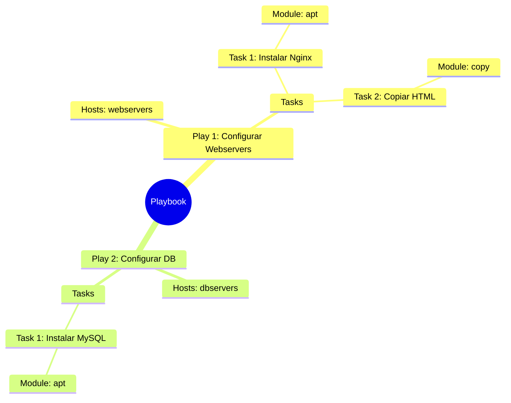

# Playbooks y YAML 📜

El corazón de Ansible: definir el estado deseado de tu infraestructura.

:::info Video pendiente de grabación
:::

## 4.1. Sintaxis YAML: La Regla de Oro

YAML (YAML Ain't Markup Language) es el lenguaje que usa Ansible. Es famoso por ser legible para humanos, pero estricto con las máquinas.

### 🛒 La Analogía: La Lista de la Compra
Imagina una lista de la compra organizada por pasillos. No mezclas todo; agrupas las cosas para ser eficiente.

*   **Pasillo Frutería:**
    *   Manzanas
    *   Peras
*   **Pasillo Limpieza:**
    *   Lejía
    *   Jabón

En YAML, esta estructura visual es **obligatoria**.

### Diccionarios vs Listas

Hay dos estructuras clave que debes dominar:

1.  **Diccionarios (mapas):** Pares `clave: valor`. Definen propiedades.
2.  **Listas (arrays):** Elementos que empiezan con un guion `-`. Son colecciones.

```yaml
# Esto es un Diccionario (Propiedades de un coche)
coche:
  marca: Toyota
  modelo: Corolla
  color: Rojo

# Esto es una Lista (Cosas en el maletero)
maletero:
  - Rueda de repuesto
  - Gato hidráulico
  - Triángulos
```

### ⚠️ La Regla de Oro de la Indentación
En YAML, la jerarquía se define por la indentación (espacios a la izquierda).

> **NUNCA uses tabuladores (Tabs). Usa siempre ESPACIOS (generalmente 2 por nivel).**

#### ✅ BIEN (Espacios)
```yaml
hosts: webservers
tasks:
  - name: Instalar Nginx  # 2 espacios de indentación
    apt:                  # 4 espacios
      name: nginx         # 6 espacios
```

#### ❌ MAL (Tabs o mezcla)
```yaml
hosts: webservers
tasks:
	- name: Instalar Nginx  # <--- ¡ERROR! Tabulador detectado
    apt:
      name: nginx
```
*Si mezclas tabs y espacios, Ansible te odiará y el Playbook fallará.*

---

## 4.2. Estructura de un Playbook

Un **Playbook** es el archivo donde orquestamos todo. Tiene una jerarquía estricta.

### 🎬 La Analogía: El Guion de Cine
*   **Playbook:** Es la película completa.
*   **Play:** Es una **Escena**. Ocurre en un lugar específico (un grupo de `hosts`) y tiene unos actores (tareas).
*   **Task:** Es una **Acción** concreta del guion ("El actor abre la puerta").
*   **Module:** Es la **Herramienta** usada para la acción (La puerta, el pomo).

### Jerarquía Visual



### Anatomía en Código

```yaml
# Playbook
- name: Play 1 - Configurar Servidores Web  # <-- PLAY
  hosts: webservers
  become: yes  # Usar sudo

  tasks:
    - name: Task 1 - Instalar paquete       # <-- TASK
      apt:                                  # <-- MODULE
        name: nginx
        state: present
```

---

## 4.3. Módulos Esenciales (Los 4 Fantásticos)

Ansible tiene miles de módulos, pero usarás estos 4 el 80% del tiempo.

### 1. Gestión de Paquetes (`apt` / `yum`)
Instala, actualiza o elimina software.

```yaml
- name: Instalar git
  apt:
    name: git
    state: present  # Opciones: present (instalar), absent (borrar), latest (actualizar)
```

### 2. Gestión de Archivos (`copy`)
Sube archivos desde tu máquina de control al servidor remoto.

```yaml
- name: Subir archivo de configuración
  copy:
    src: ./files/nginx.conf   # Origen (tu PC)
    dest: /etc/nginx/nginx.conf # Destino (Servidor remoto)
```

### 3. Gestión de Servicios (`service` / `systemd`)
Arranca, para o reinicia demonios.

```yaml
- name: Arrancar Nginx
  service:
    name: nginx
    state: started  # Opciones: started, stopped, restarted
    enabled: yes    # ¿Arrancar al inicio del sistema?
```

### 4. Gestión de Usuarios (`user`)
Crea o modifica usuarios del sistema.

```yaml
- name: Crear usuario deploy
  user:
    name: deploy
    shell: /bin/bash
    groups: sudo
```

### 💡 El Concepto de Idempotencia
Fíjate en el parámetro `state`. En Ansible no decimos "Instala esto", decimos "Asegúrate de que esto esté **presente**".
*   Si no está -> Lo instala.
*   Si ya está -> **No hace nada**.

Esto es **Idempotencia**: Puedes ejecutar el mismo Playbook 1000 veces, y el resultado final siempre será el mismo, sin romper nada.

---

## 4.4. Tasks y Handlers

### Tasks: Las Acciones del Playbook

Las **tasks** (tareas) son la unidad básica de ejecución en Ansible. Cada task ejecuta un módulo para realizar una acción específica.

```yaml
tasks:
  - name: Instalar Apache
    apt:
      name: apache2
      state: present

  - name: Copiar configuración
    copy:
      src: apache.conf
      dest: /etc/apache2/apache2.conf
```

### Handlers: Tareas Especiales que Solo se Ejecutan Cuando Hay Cambios

Los **handlers** son tasks especiales que solo se ejecutan cuando son "notificados" por otra task que ha hecho cambios.

#### 🔧 La Analogía: El Interruptor de la Luz
Cuando cambias una bombilla (task), necesitas probar el interruptor (handler) para verificar que funciona. Pero si no cambiaste la bombilla, no tiene sentido probar el interruptor.

```yaml
tasks:
  - name: Modificar configuración de Apache
    copy:
      src: apache.conf
      dest: /etc/apache2/apache2.conf
    notify: Reiniciar Apache  # Solo notifica si el archivo cambió

handlers:
  - name: Reiniciar Apache
    service:
      name: apache2
      state: restarted
```

**Características clave de los handlers:**
- Solo se ejecutan si la task que los notifica reporta un cambio
- Se ejecutan **al final** del play, una sola vez (aunque múltiples tasks los notifiquen)
- Son perfectos para reiniciar servicios tras cambios de configuración

---

## 4.5. Ejecución Condicional con `when`

A veces necesitas ejecutar una task solo si se cumple cierta condición. Para eso usamos `when`.

### 🚦 La Analogía: El Semáforo
No arrancas el coche hasta que el semáforo está en verde. La condición es: "color == verde".

```yaml
- name: Instalar Apache solo en Ubuntu
  apt:
    name: apache2
    state: present
  when: ansible_distribution == "Ubuntu"

- name: Instalar Apache solo en CentOS
  yum:
    name: httpd
    state: present
  when: ansible_distribution == "CentOS"
```

### Ejemplos de Condiciones Comunes

```yaml
# Verificar versión del SO
- name: Tarea solo para Ubuntu 20.04
  debug:
    msg: "Este es Ubuntu 20.04"
  when: ansible_distribution_version == "20.04"

# Verificar si existe un archivo
- name: Configurar backup solo si existe el directorio
  command: /usr/local/bin/backup.sh
  when: backup_dir.stat.exists

# Múltiples condiciones (AND)
- name: Instalar solo en servidores de producción con Ubuntu
  apt:
    name: monitoring-agent
  when:
    - ansible_distribution == "Ubuntu"
    - environment == "production"

# Condición OR
- name: Instalar en Debian o Ubuntu
  apt:
    name: nginx
  when: ansible_distribution == "Debian" or ansible_distribution == "Ubuntu"
```

---

## 4.6. Loops: Repetir Tareas

En lugar de copiar y pegar la misma task 10 veces, usamos loops (bucles).

### 🔁 La Analogía: La Cadena de Montaje
En una fábrica, la misma acción se repite para cada producto que pasa por la cinta. No creas 100 estaciones iguales, usas una y procesas cada item.

### Loop Básico: `loop`

```yaml
- name: Instalar múltiples paquetes
  apt:
    name: "{{ item }}"
    state: present
  loop:
    - git
    - curl
    - vim
    - htop
```

**Equivalente sin loop (¡NO hagas esto!):**
```yaml
- name: Instalar git
  apt:
    name: git
    state: present

- name: Instalar curl
  apt:
    name: curl
    state: present

- name: Instalar vim
  apt:
    name: vim
    state: present
# ... y así sucesivamente 😱
```

### Loops con Diccionarios

```yaml
- name: Crear múltiples usuarios
  user:
    name: "{{ item.name }}"
    groups: "{{ item.groups }}"
    shell: /bin/bash
  loop:
    - { name: 'alice', groups: 'sudo,developers' }
    - { name: 'bob', groups: 'developers' }
    - { name: 'charlie', groups: 'sudo' }
```

### Loop con Condición

```yaml
- name: Instalar paquetes solo en servidores web
  apt:
    name: "{{ item }}"
    state: present
  loop:
    - nginx
    - php-fpm
    - mysql-client
  when: "'webservers' in group_names"
```

---

## 4.7. Tags: Ejecutar Solo Partes del Playbook

Los **tags** (etiquetas) te permiten ejecutar solo ciertas tasks del playbook sin ejecutarlo completo.

### 🏷️ La Analogía: Filtros de Email
Imagina que tu inbox tiene etiquetas: "Urgente", "Trabajo", "Personal". Puedes ver solo los emails con una etiqueta específica.

```yaml
tasks:
  - name: Instalar paquetes base
    apt:
      name: "{{ item }}"
      state: present
    loop:
      - git
      - curl
    tags:
      - install
      - base

  - name: Configurar firewall
    ufw:
      rule: allow
      port: 80
    tags:
      - security
      - firewall

  - name: Copiar archivos de configuración
    copy:
      src: app.conf
      dest: /etc/app/app.conf
    tags:
      - config
```

### Ejecución con Tags

```bash
# Ejecutar solo las tasks con tag "install"
ansible-playbook site.yml --tags install

# Ejecutar solo "security" y "firewall"
ansible-playbook site.yml --tags "security,firewall"

# Ejecutar TODO excepto las tasks con tag "config"
ansible-playbook site.yml --skip-tags config

# Listar todos los tags disponibles
ansible-playbook site.yml --list-tags
```

### Tags Especiales

Ansible tiene algunos tags predefinidos:

```yaml
tasks:
  - name: Esta task siempre se ejecuta
    debug:
      msg: "Soy inevitable"
    tags:
      - always

  - name: Esta nunca se ejecuta (a menos que lo especifiques)
    debug:
      msg: "Solo con --tags never"
    tags:
      - never
```

---

## 4.8. Práctica: Tu Primer Servidor Web 🌍

Vamos a crear el "Hola Mundo" de la infraestructura: Un servidor web Nginx con una página personalizada usando todo lo aprendido.

### El Playbook Completo (`site.yml`)

```yaml
---
- name: Configurar Servidor Web con Handlers, Loops y Tags
  hosts: all
  become: yes

  tasks:
    - name: Instalar paquetes necesarios
      apt:
        name: "{{ item }}"
        state: present
        update_cache: yes
      loop:
        - nginx
        - ufw
      tags:
        - install
        - base

    - name: Configurar firewall
      ufw:
        rule: allow
        port: "{{ item }}"
      loop:
        - "22"
        - "80"
        - "443"
      tags:
        - security
        - firewall

    - name: Copiar configuración de Nginx
      copy:
        dest: /etc/nginx/sites-available/default
        content: |
          server {
            listen 80;
            root /var/www/html;
            index index.html;
          }
      notify: Reiniciar Nginx
      tags:
        - config

    - name: Crear página web personalizada
      copy:
        dest: /var/www/html/index.html
        content: |
          <h1>¡Hola desde Ansible! 🚀</h1>
          <p>Este servidor ha sido configurado automáticamente.</p>
          <p>SO: {{ ansible_distribution }} {{ ansible_distribution_version }}</p>
      tags:
        - config
        - web

    - name: Asegurar que Nginx está corriendo
      service:
        name: nginx
        state: started
        enabled: yes
      tags:
        - service

    - name: Mostrar IP del servidor (solo en Ubuntu)
      debug:
        msg: "Servidor accesible en: http://{{ ansible_default_ipv4.address }}"
      when: ansible_distribution == "Ubuntu"
      tags:
        - always

  handlers:
    - name: Reiniciar Nginx
      service:
        name: nginx
        state: restarted
```

### Ejecución

```bash
# Ejecutar todo el playbook
ansible-playbook -i inventario.ini site.yml

# Solo instalar paquetes
ansible-playbook -i inventario.ini site.yml --tags install

# Actualizar solo configuración (sin reinstalar)
ansible-playbook -i inventario.ini site.yml --tags config

# Todo excepto seguridad
ansible-playbook -i inventario.ini site.yml --skip-tags security
```

### 🧪 Prueba de "Self-Healing" (Auto-curación)

1.  Entra al servidor y **modifica** la configuración: `echo "test" >> /etc/nginx/sites-available/default`
2.  El servidor puede tener comportamiento inesperado.
3.  **Vuelve a ejecutar el Playbook con `--tags config`**

Verás que Ansible detecta el cambio (Changed: 1), restaura la configuración correcta y ejecuta el handler para reiniciar Nginx. **Ha reparado el sistema automáticamente**.

---

## 📝 Resumen del Capítulo

En este capítulo has aprendido:

✅ **YAML Syntax:** Indentación con espacios, diccionarios vs listas
✅ **Playbook Structure:** Plays, Tasks, Modules
✅ **Essential Modules:** apt/yum, copy, service, user
✅ **Tasks y Handlers:** Tareas normales vs tareas que reaccionan a cambios
✅ **Conditionals (`when`):** Ejecutar tasks basándote en condiciones
✅ **Loops:** Repetir tasks eficientemente sin duplicar código
✅ **Tags:** Ejecutar partes específicas del playbook

**Próximo paso:** Variables y templates para hacer tus playbooks dinámicos y reutilizables 🎯
