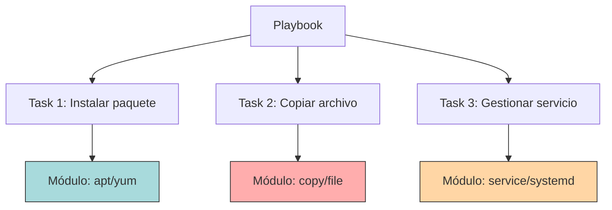

# Módulos de Ansible 🧩

Los bloques de construcción de Ansible: aprende a usar las herramientas que harán el trabajo pesado.

:::info Video pendiente de grabación
:::

## 5.1. ¿Qué son los Módulos?

### 🔧 La Analogía: La Caja de Herramientas
Imagina que eres un mecánico arreglando un coche.
*   **Playbook:** Es el manual de reparación que te dice qué hacer.
*   **Tasks:** Son los pasos específicos ("Cambiar el aceite").
*   **Módulos:** Son las **herramientas físicas** (llave inglesa, gato hidráulico, destornillador).

No usarías un martillo para apretar un tornillo. Cada herramienta tiene un propósito específico. Lo mismo ocurre con los módulos de Ansible.

### 🧠 Concepto Visual



### 📘 Explicación Técnica
Un **módulo** es una unidad de código reutilizable que Ansible ejecuta en los nodos remotos para realizar una acción específica. Cada módulo está diseñado para ser idempotente y manejar diferentes sistemas operativos de forma inteligente.

Ansible incluye más de 3000 módulos, pero usarás aproximadamente 20-30 módulos el 95% del tiempo.

### 💻 Anatomía de un Módulo en una Task

```yaml
- name: Instalar Nginx              # Descripción humana
  apt:                              # <-- NOMBRE DEL MÓDULO
    name: nginx                     # Parámetro 1
    state: present                  # Parámetro 2
    update_cache: yes               # Parámetro 3
```

---

## 5.2. ansible-doc: Tu Documentación Offline

### 📚 La Herramienta Esencial
No necesitas memorizar todos los parámetros de cada módulo. Ansible incluye `ansible-doc`, una herramienta de línea de comandos que te muestra la documentación completa sin necesidad de internet.

### 🔎 Comandos Esenciales

```bash
# Listar TODOS los módulos disponibles
ansible-doc -l

# Buscar módulos relacionados con "user"
ansible-doc -l | grep user

# Ver documentación completa del módulo 'apt'
ansible-doc apt

# Ver ejemplos prácticos del módulo
ansible-doc apt | grep -A 50 "EXAMPLES"

# Mostrar solo los parámetros (versión resumida)
ansible-doc apt -s
```

### 💡 Ejemplo Práctico

```bash
# Necesitas usar el módulo 'file' pero no recuerdas los parámetros
ansible-doc file -s

# Output (resumido):
# - file
#   * path (required): Ruta del archivo
#   * state: absent, directory, file, hard, link, touch
#   * mode: Permisos (ej: '0644')
#   * owner: Propietario del archivo
```

**Consejo Pro:** Mantén siempre una terminal extra abierta con `ansible-doc` mientras escribes playbooks. Es más rápido que buscar en Google.

---

## 5.3. Módulos de Gestión de Paquetes

Los módulos más utilizados para instalar, actualizar y eliminar software.

### 📦 Módulo: `apt` (Debian/Ubuntu)

Gestiona paquetes en sistemas basados en Debian (Ubuntu, Debian, Linux Mint).

```yaml
- name: Instalar múltiples paquetes
  apt:
    name:
      - nginx
      - git
      - curl
    state: present           # present = instalar, absent = eliminar, latest = actualizar
    update_cache: yes        # Equivalente a "apt update"
    cache_valid_time: 3600   # Solo actualizar cache si tiene más de 1 hora
```

#### Estados Importantes
*   **present:** Asegura que el paquete esté instalado (no importa la versión).
*   **absent:** Asegura que el paquete NO esté instalado.
*   **latest:** Instala la última versión disponible (actualiza si hay nueva).

#### 🧪 Caso de Uso Real

```yaml
- name: Preparar servidor web
  apt:
    name:
      - nginx
      - php-fpm
      - mysql-client
      - certbot
    state: present
    update_cache: yes
  when: ansible_os_family == "Debian"  # Solo en Debian/Ubuntu
```

### 📦 Módulo: `yum` / `dnf` (RedHat/CentOS/Fedora)

Para sistemas basados en RedHat (CentOS, RHEL, Rocky Linux, Fedora).

```yaml
- name: Instalar Apache en RedHat
  yum:
    name: httpd
    state: present
  when: ansible_os_family == "RedHat"

# Alternativa moderna (Fedora/RHEL 8+)
- name: Instalar con DNF
  dnf:
    name: httpd
    state: latest
```

### 🌐 Módulo Universal: `package`

Si quieres escribir playbooks que funcionen en cualquier distribución sin condicionales, usa el módulo `package`. Detecta automáticamente el gestor de paquetes del sistema.

```yaml
- name: Instalar git (funciona en Debian, RedHat, Arch, etc.)
  package:
    name: git
    state: present
```

**⚠️ Limitación:** El nombre del paquete debe ser el mismo en todas las distribuciones. `apache2` (Debian) vs `httpd` (RedHat) requiere lógica adicional.

---

## 5.4. Módulos de Gestión de Archivos

### 📄 Módulo: `copy`

Copia archivos desde tu nodo de control (tu PC) a los nodos gestionados (servidores).

```yaml
- name: Subir configuración de Nginx
  copy:
    src: ./files/nginx.conf        # Ruta local (tu PC)
    dest: /etc/nginx/nginx.conf    # Ruta remota (servidor)
    owner: root
    group: root
    mode: '0644'                   # Permisos (lectura para todos, escritura para root)
    backup: yes                    # Crear backup antes de sobrescribir
```

#### Crear Archivos con Contenido Inline

```yaml
- name: Crear archivo de texto simple
  copy:
    dest: /var/www/html/index.html
    content: |
      <html>
        <body>
          <h1>¡Hola desde Ansible!</h1>
          <p>Servidor: {{ ansible_hostname }}</p>
        </body>
      </html>
    mode: '0644'
```

### 📁 Módulo: `file`

Gestiona archivos, directorios, enlaces simbólicos y permisos sin transferir contenido.

```yaml
# Crear directorio
- name: Crear directorio para aplicación
  file:
    path: /opt/miapp
    state: directory
    owner: www-data
    group: www-data
    mode: '0755'

# Eliminar archivo
- name: Borrar archivo temporal
  file:
    path: /tmp/cache.old
    state: absent

# Crear enlace simbólico
- name: Crear symlink para Nginx
  file:
    src: /etc/nginx/sites-available/miapp
    dest: /etc/nginx/sites-enabled/miapp
    state: link

# Cambiar permisos de archivo existente
- name: Ajustar permisos de log
  file:
    path: /var/log/miapp/app.log
    mode: '0600'
    owner: appuser
```

### 📋 Módulo: `template`

Similar a `copy`, pero procesa archivos Jinja2 para hacerlos dinámicos (variables, condicionales, loops).

```yaml
- name: Generar configuración dinámica
  template:
    src: templates/nginx.conf.j2    # Plantilla con variables
    dest: /etc/nginx/nginx.conf
    owner: root
    mode: '0644'
  notify: Reiniciar Nginx
```

**Archivo `templates/nginx.conf.j2`:**
```jinja
server {
    listen {{ http_port }};
    server_name {{ server_name }};
    root {{ document_root }};
}
```

---

## 5.5. Módulos de Gestión de Servicios

### 🚀 Módulo: `service`

Gestiona demonios/servicios del sistema (arrancar, parar, reiniciar, habilitar al inicio).

```yaml
- name: Asegurar que Nginx está corriendo
  service:
    name: nginx
    state: started      # Opciones: started, stopped, restarted, reloaded
    enabled: yes        # Arrancar automáticamente al iniciar el sistema
```

#### Estados Importantes

| Estado | Descripción |
|--------|-------------|
| `started` | Asegura que el servicio está corriendo (si está parado, lo arranca) |
| `stopped` | Asegura que el servicio está parado |
| `restarted` | Para y arranca el servicio (siempre provoca cambio) |
| `reloaded` | Recarga la configuración sin parar el servicio |

#### 🔄 Diferencia: Restart vs Reload

```yaml
# Restart: Para completamente el servicio y lo arranca de nuevo
# Causa breve interrupción del servicio
- name: Reiniciar Nginx (con downtime)
  service:
    name: nginx
    state: restarted

# Reload: Recarga la configuración sin parar el servicio
# No interrumpe las conexiones activas
- name: Recargar Nginx (sin downtime)
  service:
    name: nginx
    state: reloaded
```

### ⚙️ Módulo: `systemd`

Versión moderna y más potente para sistemas con systemd (mayoría de distribuciones actuales).

```yaml
- name: Gestionar servicio con systemd
  systemd:
    name: docker
    state: started
    enabled: yes
    daemon_reload: yes  # Recargar systemd tras cambios en unit files
```

#### Caso Avanzado: Servicios Custom

```yaml
- name: Crear servicio personalizado
  copy:
    dest: /etc/systemd/system/miapp.service
    content: |
      [Unit]
      Description=Mi Aplicación
      After=network.target

      [Service]
      ExecStart=/usr/bin/python3 /opt/miapp/app.py
      Restart=always
      User=appuser

      [Install]
      WantedBy=multi-user.target

- name: Activar servicio custom
  systemd:
    name: miapp
    state: started
    enabled: yes
    daemon_reload: yes
```

---

## 5.6. Módulos de Gestión de Usuarios y Grupos

### 👤 Módulo: `user`

Crea, modifica y elimina usuarios del sistema.

```yaml
- name: Crear usuario para despliegues
  user:
    name: deployer
    shell: /bin/bash
    groups: sudo,docker      # Grupos adicionales
    append: yes              # Añadir a grupos sin eliminar los existentes
    create_home: yes         # Crear directorio home
    state: present

- name: Crear usuario con clave SSH
  user:
    name: admin
    shell: /bin/bash
    groups: sudo
    generate_ssh_key: yes
    ssh_key_bits: 4096
```

#### Eliminar Usuario

```yaml
- name: Eliminar usuario temporal
  user:
    name: testuser
    state: absent
    remove: yes    # También borrar el directorio home
```

### 👥 Módulo: `group`

Gestiona grupos del sistema.

```yaml
- name: Crear grupo para aplicación
  group:
    name: appgroup
    gid: 3000      # ID numérico del grupo
    state: present
```

---

## 5.7. Módulos de Ejecución de Comandos

### ⚠️ Advertencia Importante
Los siguientes módulos ejecutan comandos arbitrarios y **NO son idempotentes** por defecto. Úsalos solo cuando no exista un módulo específico.

### 🖥️ Módulo: `command`

Ejecuta comandos simples en el servidor remoto (sin shell).

```yaml
- name: Verificar versión de Python
  command: python3 --version
  register: python_version  # Guardar output en variable

- name: Mostrar versión
  debug:
    var: python_version.stdout
```

**Limitación:** No soporta pipes (`|`), redirecciones (`>`), ni variables de entorno (`$HOME`).

### 🐚 Módulo: `shell`

Como `command`, pero ejecuta a través de `/bin/sh`, permitiendo sintaxis avanzada.

```yaml
- name: Buscar archivos grandes
  shell: find /var/log -type f -size +100M | wc -l
  register: large_files

- name: Backup con fecha
  shell: tar -czf /backup/app-$(date +%Y%m%d).tar.gz /opt/app
```

### 📝 Módulo: `script`

Ejecuta un script local (de tu PC) en el servidor remoto.

```yaml
- name: Ejecutar script de limpieza
  script: ./scripts/cleanup.sh
  args:
    creates: /var/lock/cleanup.done  # Solo ejecutar si este archivo NO existe
```

### 🔒 Haciendo Comandos Idempotentes

Usa condiciones para evitar cambios innecesarios:

```yaml
- name: Descargar archivo solo si no existe
  command: wget https://example.com/archivo.tar.gz
  args:
    chdir: /opt
    creates: /opt/archivo.tar.gz  # Solo ejecutar si NO existe

- name: Comando condicional
  shell: some_command
  args:
    removes: /tmp/lock  # Solo ejecutar si este archivo SÍ existe
```

---

## 5.8. Otros Módulos Esenciales

### 🔄 Módulo: `git`

Clona y gestiona repositorios Git.

```yaml
- name: Clonar repositorio
  git:
    repo: https://github.com/usuario/proyecto.git
    dest: /opt/proyecto
    version: main        # Branch, tag o commit
    update: yes          # Pull si ya existe
```

### 📥 Módulo: `get_url`

Descarga archivos desde URLs.

```yaml
- name: Descargar binario
  get_url:
    url: https://releases.example.com/app-v1.2.3.tar.gz
    dest: /tmp/app.tar.gz
    checksum: sha256:abc123...  # Verificar integridad
    mode: '0755'
```

### 🗄️ Módulo: `lineinfile`

Modifica líneas específicas en archivos de configuración.

```yaml
- name: Configurar SSH - Deshabilitar root login
  lineinfile:
    path: /etc/ssh/sshd_config
    regexp: '^PermitRootLogin'
    line: 'PermitRootLogin no'
    state: present
  notify: Reiniciar SSH
```

### 🔐 Módulo: `authorized_key`

Gestiona claves SSH para autenticación.

```yaml
- name: Añadir clave SSH pública
  authorized_key:
    user: deployer
    state: present
    key: "{{ lookup('file', '~/.ssh/id_rsa.pub') }}"
```

---

## 5.9. Práctica Completa: Servidor Web desde Cero

Vamos a crear un playbook que demuestre el uso de múltiples módulos para configurar un servidor web completamente funcional.

```yaml
---
- name: Desplegar Servidor Web Completo
  hosts: webservers
  become: yes

  vars:
    app_user: webapp
    app_dir: /opt/webapp
    http_port: 80

  tasks:
    # === GESTIÓN DE USUARIOS ===
    - name: Crear grupo de aplicación
      group:
        name: "{{ app_user }}"
        state: present

    - name: Crear usuario de aplicación
      user:
        name: "{{ app_user }}"
        group: "{{ app_user }}"
        shell: /bin/bash
        create_home: yes

    # === INSTALACIÓN DE PAQUETES ===
    - name: Instalar paquetes necesarios
      apt:
        name:
          - nginx
          - git
          - python3-pip
        state: present
        update_cache: yes
      when: ansible_os_family == "Debian"

    # === GESTIÓN DE ARCHIVOS ===
    - name: Crear directorio de aplicación
      file:
        path: "{{ app_dir }}"
        state: directory
        owner: "{{ app_user }}"
        group: "{{ app_user }}"
        mode: '0755'

    - name: Clonar código de aplicación
      git:
        repo: https://github.com/example/webapp.git
        dest: "{{ app_dir }}"
        version: main
      become_user: "{{ app_user }}"

    - name: Generar configuración de Nginx
      template:
        src: templates/nginx-site.conf.j2
        dest: /etc/nginx/sites-available/webapp
        mode: '0644'
      notify: Recargar Nginx

    - name: Activar sitio en Nginx
      file:
        src: /etc/nginx/sites-available/webapp
        dest: /etc/nginx/sites-enabled/webapp
        state: link
      notify: Recargar Nginx

    - name: Eliminar sitio default de Nginx
      file:
        path: /etc/nginx/sites-enabled/default
        state: absent
      notify: Recargar Nginx

    # === GESTIÓN DE SERVICIOS ===
    - name: Asegurar que Nginx está corriendo
      service:
        name: nginx
        state: started
        enabled: yes

    # === CONFIGURACIÓN DEL SISTEMA ===
    - name: Configurar firewall - Permitir HTTP
      ufw:
        rule: allow
        port: "{{ http_port }}"
        proto: tcp

    - name: Configurar firewall - Permitir SSH
      ufw:
        rule: allow
        port: '22'
        proto: tcp

    - name: Habilitar firewall
      ufw:
        state: enabled

  handlers:
    - name: Recargar Nginx
      service:
        name: nginx
        state: reloaded
```

### Plantilla de Nginx (`templates/nginx-site.conf.j2`)

```jinja
server {
    listen {{ http_port }};
    server_name {{ ansible_hostname }};

    root {{ app_dir }}/public;
    index index.html index.htm;

    location / {
        try_files $uri $uri/ =404;
    }

    access_log /var/log/nginx/{{ app_user }}_access.log;
    error_log /var/log/nginx/{{ app_user }}_error.log;
}
```

---

## 📝 Resumen del Capítulo

En este capítulo has aprendido:

✅ **Qué son los módulos:** Herramientas especializadas para tareas específicas
✅ **ansible-doc:** Tu documentación offline para consultar módulos
✅ **Gestión de paquetes:** apt, yum, package
✅ **Gestión de archivos:** copy, file, template
✅ **Gestión de servicios:** service, systemd
✅ **Gestión de usuarios:** user, group
✅ **Ejecución de comandos:** command, shell, script (con precaución)
✅ **Módulos adicionales:** git, get_url, lineinfile, authorized_key

### 💡 Mejores Prácticas

1.  **Usa módulos específicos antes que command/shell:** Son idempotentes y más seguros.
2.  **Consulta ansible-doc regularmente:** Es más rápido que buscar en internet.
3.  **Aprovecha el estado `present/absent`:** La esencia de la idempotencia.
4.  **Prefiere `reload` sobre `restart`:** Menos disruptivo en producción.
5.  **Usa `template` para configuraciones dinámicas:** Más flexible que `copy`.

**Próximo paso:** Variables y Facts para hacer tus playbooks verdaderamente dinámicos 🎯
