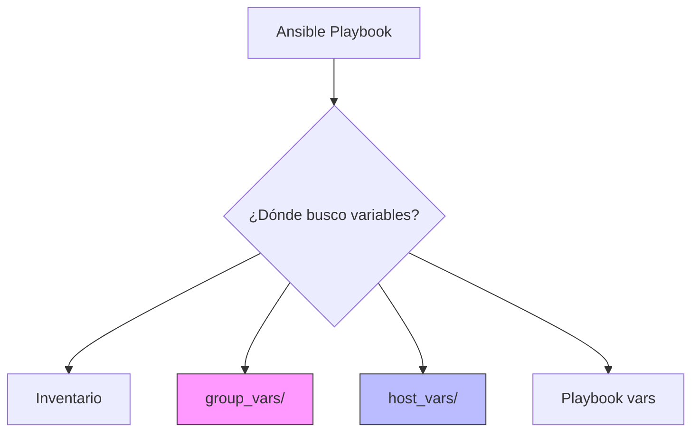

# Variables y facts 📊

Haciendo nuestros playbooks dinámicos y reutilizables.

:::info Video pendiente de grabación
:::

## 6.1. Definición de variables

Las variables son la clave para escribir playbooks que funcionen en cualquier entorno (desarrollo, staging, producción) sin cambiar ni una línea de código.

### 🚫 La regla de oro: no hardcodear
Nunca escribas valores fijos (IPs, nombres de usuario, rutas) directamente en tus tareas. Si lo haces, tendrás que editar el Playbook cada vez que algo cambie.

### 📂 Estructura de carpetas: `group_vars` y `host_vars`
Ansible busca automáticamente variables en carpetas específicas. Esta es la forma profesional de organizar tus datos.


```mermaid
graph TD
    A[Ansible Playbook] --> B{¿Dónde busco variables?}
    B --> C[Inventario]
    B --> D[group_vars/]
    B --> E[host_vars/]
    B --> F[Playbook vars]

    style D fill:#f9f,stroke:#333
    style E fill:#bbf,stroke:#333
```

#### Estructura recomendada del proyecto:
```text
proyecto/
├── inventory.ini
├── playbook.yml
├── group_vars/
│   ├── all.yml          # Variables para TODOS los servidores
│   ├── webservers.yml   # Variables solo para el grupo webservers
│   └── dbservers.yml    # Variables solo para el grupo dbservers
└── host_vars/
    └── web01.empresa.com.yml  # Variables específicas para UN host
```

#### Ejemplo Práctico
**`group_vars/webservers.yml`**:
```yaml
http_port: 80
doc_root: /var/www/html
```

**`playbook.yml`**:
```yaml
- hosts: webservers
  tasks:
    - name: Configurar VirtualHost
      template:
        src: vhost.j2
        dest: "/etc/nginx/sites-available/default"
      # Usamos la variable {{ http_port }} en lugar de escribir 80
```

---

## 6.2. Ansible Facts

Ansible no va a ciegas. Antes de ejecutar cualquier tarea, "interroga" al servidor para conocer su estado actual. Esta información se guarda en variables automáticas llamadas **Facts**.

### 🩺 La Analogía: El Chequeo Médico
Imagina que vas al médico. Antes de recetarte nada, la enfermera te toma la temperatura, la presión y el peso.
*   **Médico:** Ansible.
*   **Paciente:** Servidor.
*   **Signos Vitales:** Facts (IP, Sistema Operativo, Memoria RAM, Discos).

El médico (Ansible) usa esos datos para decidir el tratamiento (Playbook). Si eres alérgico a la penicilina (es un servidor RedHat), te dará otro medicamento (yum en vez de apt).

### Variables Mágicas Comunes
*   `ansible_os_family`: Debian, RedHat, Windows.
*   `ansible_processor_vcpus`: Número de CPUs.
*   `ansible_memtotal_mb`: Memoria total.
*   `ansible_default_ipv4.address`: Dirección IP principal.
*   `ansible_hostname`: Nombre del host.
*   `ansible_distribution`: Distribución específica (Ubuntu, CentOS, etc.).
*   `ansible_distribution_version`: Versión de la distribución.

### 🧪 Práctica: Playbook Inteligente (Cross-Platform)
Vamos a crear un Playbook que funcione tanto en Ubuntu (Debian) como en CentOS (RedHat) usando Facts y condicionales.

```yaml
- name: Instalar Servidor Web Inteligente
  hosts: all
  become: yes

  tasks:
    - name: Mostrar familia del SO
      debug:
        msg: "Este servidor es de la familia: {{ ansible_os_family }}"

    # Caso 1: Si es Debian/Ubuntu
    - name: Instalar Apache en Debian/Ubuntu
      apt:
        name: apache2
        state: present
      when: ansible_os_family == "Debian"

    # Caso 2: Si es RedHat/CentOS
    - name: Instalar Apache en RedHat/CentOS
      yum:
        name: httpd
        state: present
      when: ansible_os_family == "RedHat"
```

---

## 6.3. Register: Capturando Resultados

La directiva `register` te permite capturar la salida de una tarea y guardarla en una variable para usarla después.

### 💾 ¿Para qué sirve?
*   Guardar el resultado de un comando shell.
*   Verificar si un servicio está corriendo.
*   Tomar decisiones basadas en salidas previas.

### Ejemplo Práctico
```yaml
- name: Ejemplo de Register
  hosts: localhost
  tasks:
    - name: Ejecutar comando y guardar resultado
      shell: uptime
      register: uptime_result

    - name: Mostrar el resultado
      debug:
        msg: "Tiempo de actividad: {{ uptime_result.stdout }}"

    - name: Verificar si un archivo existe
      stat:
        path: /etc/nginx/nginx.conf
      register: nginx_config

    - name: Tarea condicional según resultado
      debug:
        msg: "Nginx está configurado"
      when: nginx_config.stat.exists
```

### Estructura de una variable registrada
Una variable `register` contiene varios atributos útiles:
*   `stdout`: Salida estándar del comando.
*   `stderr`: Salida de error.
*   `rc`: Código de retorno (0 = éxito).
*   `changed`: Indica si hubo cambios.
*   `failed`: Indica si la tarea falló.

---

## 6.4. Variables Especiales

Ansible proporciona variables especiales que siempre están disponibles:

### Variables de Inventario
*   `inventory_hostname`: Nombre del host según el inventario.
*   `inventory_hostname_short`: Nombre del host sin el dominio.
*   `inventory_dir`: Ruta del directorio del inventario.
*   `inventory_file`: Nombre del archivo de inventario.
*   `groups`: Diccionario con todos los grupos del inventario.
*   `group_names`: Lista de grupos a los que pertenece el host actual.

### Variables de Ansible
*   `ansible_check_mode`: True si se ejecuta en modo check (--check).
*   `ansible_play_hosts`: Lista de hosts en el play actual.
*   `ansible_version`: Información de la versión de Ansible.
*   `ansible_facts`: Diccionario con todos los facts recopilados.

### Ejemplo de Uso
```yaml
- name: Variables Especiales en Acción
  hosts: webservers
  tasks:
    - name: Mostrar información del host
      debug:
        msg: |
          Host: {{ inventory_hostname }}
          Grupos: {{ group_names }}
          IP: {{ ansible_default_ipv4.address }}
          SO: {{ ansible_distribution }} {{ ansible_distribution_version }}

    - name: Listar todos los hosts del grupo
      debug:
        msg: "Hosts en webservers: {{ groups['webservers'] }}"
```

---

## 6.5. Precedencia de Variables

¿Qué pasa si defines la variable `http_port` en el inventario, en `group_vars` y además la pasas por línea de comandos? ¿Cuál gana?

### 🏆 La Pirámide de Poder
Ansible tiene una jerarquía estricta. La regla general es: **"Lo más específico gana a lo más general"**.

```mermaid
graph BT
    A[1. Roles defaults] --> B[2. Inventory vars]
    B --> C[3. Inventory group_vars]
    C --> D[4. Inventory host_vars]
    D --> E[5. Playbook vars]
    E --> F[6. Extra vars (-e)]

    style F fill:#ff6b6b,stroke:#333,stroke-width:4px,color:white
    style A fill:#eee,stroke:#333
```

### El Ranking (Simplificado)
1.  **Extra Vars (`-e`)**: ¡GANADOR ABSOLUTO! Sobrescribe todo.
2.  **Playbook Vars**: Variables definidas dentro del archivo `.yml`.
3.  **Host Vars**: Variables específicas de un host (`host_vars/`).
4.  **Group Vars**: Variables de grupo (`group_vars/`).
5.  **Defaults**: Valores por defecto en roles (los más débiles).

### 🥊 Ejemplo de Conflicto

**1. En `group_vars/webservers.yml`:**
```yaml
http_port: 80
```

**2. En `playbook.yml`:**
```yaml
vars:
  http_port: 8080
```

**3. Ejecución en terminal:**
```bash
ansible-playbook site.yml -e "http_port=9090"
```

**Resultado Final:**
El puerto será **9090**.
*   ¿Por qué? Porque `-e` (Extra Vars) tiene la máxima prioridad.
*   Si no hubiéramos usado `-e`, sería **8080** (Playbook gana a Group).
*   Si borramos la variable del Playbook, sería **80** (Group vars).

### Resumen
Entender la precedencia te evitará horas de depuración preguntándote "¿Por qué no cambia este valor?". Usa `group_vars` para lo general, `host_vars` para excepciones, y `-e` solo para pruebas rápidas o overrides manuales en tiempo de ejecución.
