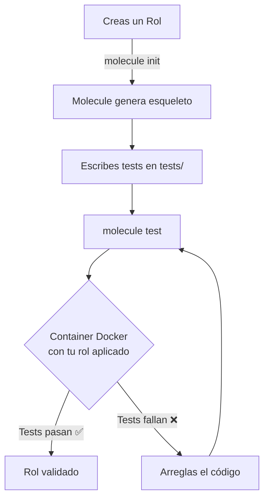
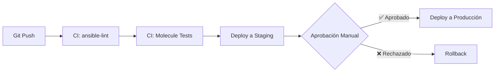

# Buenas prácticas 🎯

Cómo escribir Ansible como un profesional: estructura, seguridad y calidad.

:::info Video pendiente de grabación
:::

## 10.1. Estructura de proyectos

### 🏗️ El Problema: El Playbook Monolítico
Al principio, todos empezamos con un único archivo `site.yml` de 500 líneas. Funciona, pero es imposible de mantener. Es como tener toda tu ropa amontonada en el suelo en lugar de organizada en cajones.

### 📂 La analogía: la biblioteca
Una biblioteca no tiene todos los libros apilados en el centro. Los organiza por:
*   **Género** (Roles: web, base de datos, monitoreo)
*   **Estanterías** (Inventarios: producción, desarrollo)
*   **Fichas** (Variables: por grupo, por host)

### Estructura Recomendada por Red Hat

Esta es la estructura oficial que verás en el examen RHCE y en empresas serias:

```
ansible-project/
├── ansible.cfg                  # Configuración global del proyecto
├── inventory/
│   ├── production.ini          # Servidores de producción
│   ├── staging.ini             # Servidores de pruebas
│   └── group_vars/
│       ├── all.yml             # Variables para todos los hosts
│       ├── webservers.yml      # Variables específicas de webservers
│       └── all/
│           └── secrets.yml     # Secretos cifrados con Vault
├── roles/
│   ├── common/                 # Rol: Configuración base (SSH, usuarios)
│   │   ├── tasks/
│   │   │   └── main.yml
│   │   ├── handlers/
│   │   │   └── main.yml
│   │   ├── templates/
│   │   ├── files/
│   │   ├── vars/
│   │   └── defaults/
│   │       └── main.yml
│   ├── nginx/                  # Rol: Servidor web
│   └── postgresql/             # Rol: Base de datos
├── playbooks/
│   ├── site.yml                # Playbook maestro
│   ├── deploy-web.yml          # Playbook específico
│   └── backup.yml
├── collections/
│   └── requirements.yml        # Collections de Ansible Galaxy
├── .vault_pass                 # Contraseña del Vault (¡EN .GITIGNORE!)
├── .gitignore
└── README.md
```

### 🧪 Práctica: Migrar de Playbook Simple a Estructura Profesional

**Antes (Playbook monolítico):**
```yaml
# site.yml (300 líneas)
- hosts: webservers
  tasks:
    - name: Instalar Nginx
      apt: name=nginx state=present
    - name: Copiar config
      copy: src=nginx.conf dest=/etc/nginx/
    # ... 50 tareas más ...
```

**Después (Estructura profesional):**
```yaml
# playbooks/site.yml (10 líneas)
- name: Configurar Infraestructura Completa
  hosts: all
  roles:
    - common

- name: Configurar Servidores Web
  hosts: webservers
  roles:
    - nginx
    - ssl_certificates

- name: Configurar Base de Datos
  hosts: dbservers
  roles:
    - postgresql
```

### 💡 Beneficios
*   **Reutilización:** El rol `nginx` se puede usar en 10 proyectos diferentes.
*   **Testing:** Puedes probar cada rol de forma aislada con Molecule.
*   **Colaboración:** Cada miembro del equipo trabaja en un rol diferente sin colisiones.

---

## 10.2. Gestión de Secretos con Vault

Ya conoces Ansible Vault del capítulo anterior, pero aquí va la versión profesional.

### 🔐 Regla de Oro: NUNCA encriptes todo el archivo

**❌ Mal:**
```yaml
# group_vars/all/vault.yml (TODO EL ARCHIVO CIFRADO)
db_password: "secreto123"
db_host: "localhost"
db_port: 5432
```

**Problema:** No puedes ver en Git qué cambió sin desencriptar. Los diffs son inútiles.

**✅ Bien:**
```yaml
# group_vars/all/vars.yml (PLANO, visible en Git)
db_host: "localhost"
db_port: 5432
db_password: "{{ vault_db_password }}"  # Referencia a la variable cifrada

# group_vars/all/vault.yml (SOLO SECRETOS)
vault_db_password: "secreto123"
```

### 🎯 Patrón de Nomenclatura
*   Variables cifradas: prefijo `vault_`
*   Variables públicas: sin prefijo
*   En el código, siempre usa la pública (que apunta a la cifrada).

### Rotación de Secretos
En producción, cambias contraseñas cada X meses.

```bash
# 1. Cambiar la contraseña maestra del Vault
ansible-vault rekey group_vars/all/vault.yml

# 2. Cambiar un secreto específico
ansible-vault edit group_vars/all/vault.yml
# (Editas solo la línea vault_db_password)
```

---

## 10.3. Idempotencia: la ley suprema

### ⚖️ La definición
**Idempotencia:** Ejecutar algo 1 vez o 100 veces produce el mismo resultado final.

### 🔄 La analogía: el interruptor de la luz
*   Si le das al interruptor cuando está apagado → se enciende.
*   Si le das al interruptor cuando YA está encendido → sigue encendido (no explota).
*   Da igual cuántas veces pulses: la luz acaba encendida.

### 🚫 Código NO Idempotente
```yaml
- name: Añadir línea al archivo
  shell: echo "servidor web" >> /etc/motd
```

**Problema:** Cada ejecución añade otra línea. Tras 10 ejecuciones, tienes 10 líneas repetidas.

### ✅ Código Idempotente
```yaml
- name: Asegurar que la línea existe (solo una vez)
  lineinfile:
    path: /etc/motd
    line: "servidor web"
    state: present
```

**Resultado:** Ansible comprueba si ya existe. Si está, no hace nada. Si no está, la añade. Ejecuta 1000 veces: sigue siendo UNA línea.

### 🧪 Test de Idempotencia
Ejecuta tu playbook dos veces seguidas:

```bash
ansible-playbook site.yml --check  # Primera vez (modo prueba)
ansible-playbook site.yml          # Segunda vez
```

**Resultado esperado:**
*   Primera ejecución: `changed=10` (hizo cambios)
*   Segunda ejecución: `changed=0` (ya estaba todo configurado)

Si la segunda ejecución sigue cambiando cosas, **no es idempotente**.

---

## 10.4. Testing: ansible-lint y Molecule

### 🔍 Ansible-lint: el corrector ortográfico

Es una herramienta que analiza tus playbooks buscando errores comunes y malas prácticas.

**Instalación:**
```bash
pip install ansible-lint
```

**Uso:**
```bash
ansible-lint playbooks/site.yml
```

**Ejemplo de errores que detecta:**
```yaml
# ❌ Mal: comando sin changed_when
- name: Reiniciar servicio
  command: systemctl restart nginx

# Ansible-lint dice: "command-instead-of-module: usa el módulo systemd"

# ✅ Bien:
- name: Reiniciar servicio
  systemd:
    name: nginx
    state: restarted
```

### 🧪 Molecule: testing de roles en contenedores

Molecule es el framework de testing oficial de Ansible. Levanta un contenedor Docker, ejecuta tu rol y valida que funcione.

**Flujo de Trabajo:**



**Ejemplo de test:**
```python
# roles/nginx/molecule/default/tests/test_default.py
def test_nginx_is_installed(host):
    nginx = host.package("nginx")
    assert nginx.is_installed

def test_nginx_running_and_enabled(host):
    nginx = host.service("nginx")
    assert nginx.is_running
    assert nginx.is_enabled
```

**Ejecución:**
```bash
cd roles/nginx
molecule test
```

Molecule:
1.  Crea un contenedor
2.  Aplica el rol `nginx`
3.  Ejecuta los tests de Python
4.  Destruye el contenedor

---

## 10.5. Integración CI/CD

### 🤖 Pipeline Completo

Este es el flujo estándar en empresas profesionales:



### 🧪 Ejemplo: GitHub Actions

```yaml
# .github/workflows/ansible-ci.yml
name: Ansible CI/CD

on:
  pull_request:
    branches: [ main ]
  push:
    branches: [ main ]

jobs:
  lint:
    runs-on: ubuntu-latest
    steps:
      - uses: actions/checkout@v3
      - name: Instalar ansible-lint
        run: pip install ansible-lint
      - name: Ejecutar lint
        run: ansible-lint playbooks/

  test:
    runs-on: ubuntu-latest
    needs: lint  # Solo si el lint pasó
    steps:
      - uses: actions/checkout@v3
      - name: Instalar Molecule
        run: pip install molecule molecule-docker
      - name: Ejecutar tests
        run: |
          cd roles/nginx
          molecule test

  deploy-staging:
    runs-on: ubuntu-latest
    needs: test
    if: github.ref == 'refs/heads/main'
    steps:
      - uses: actions/checkout@v3
      - name: Configurar SSH
        run: |
          mkdir -p ~/.ssh
          echo "${{ secrets.SSH_KEY }}" > ~/.ssh/id_rsa
          chmod 600 ~/.ssh/id_rsa
      - name: Deploy
        run: |
          echo "${{ secrets.VAULT_PASS }}" > .vault_pass
          ansible-playbook -i inventory/staging.ini playbooks/site.yml \
            --vault-password-file .vault_pass
```

### 🔒 Secretos en CI/CD
*   **GitHub Actions:** Usa "Secrets" en la configuración del repositorio.
*   **GitLab CI:** Variables de entorno protegidas.
*   **Jenkins:** Credentials Plugin.

**Nunca hardcodees claves en el archivo de CI.**

---

## 10.6. Documentación

### 📚 Regla: Si no está documentado, no existe

Tu `README.md` debe responder:
1.  ¿Qué hace este proyecto?
2.  ¿Qué prerrequisitos necesito?
3.  ¿Cómo lo ejecuto?
4.  ¿Dónde están los secretos?

### Plantilla de README

```markdown
# Proyecto Ansible: Infraestructura Web

## Descripción
Automatización completa de servidores web Nginx con SSL, balanceo de carga y monitoreo.

## Prerrequisitos
- Ansible 2.15+
- Python 3.9+
- Acceso SSH a los servidores (clave en `~/.ssh/id_rsa`)

## Estructura
- `inventory/production.ini`: Servidores de producción
- `roles/nginx/`: Configuración del servidor web
- `group_vars/all/vault.yml`: Secretos (cifrado con Vault)

## Ejecución

### 1. Configurar secretos
```bash
# Crear/editar el Vault
ansible-vault edit group_vars/all/vault.yml
```

### 2. Ejecutar en staging
```bash
ansible-playbook -i inventory/staging.ini playbooks/site.yml --ask-vault-pass
```

### 3. Ejecutar en producción (requiere aprobación)
```bash
ansible-playbook -i inventory/production.ini playbooks/site.yml --ask-vault-pass
```

## Testing
```bash
# Lint
ansible-lint playbooks/

# Tests de roles
cd roles/nginx && molecule test
```

## Contacto
Equipo DevOps - devops@empresa.com
```

### 📝 Documenta tus Roles
Cada rol debe tener un `README.md` en su raíz:

```markdown
# Rol: nginx

## Descripción
Instala y configura Nginx con SSL y configuración de seguridad hardened.

## Variables
| Variable | Default | Descripción |
|----------|---------|-------------|
| `nginx_port` | 80 | Puerto HTTP |
| `nginx_ssl_port` | 443 | Puerto HTTPS |
| `nginx_ssl_cert` | - | Ruta al certificado SSL (requerido) |

## Dependencias
- Rol `common` (para configuración de firewall)

## Ejemplo de uso
```yaml
- hosts: webservers
  roles:
    - role: nginx
      nginx_port: 8080
```
```

---

## 🎓 Checklist Final: Playbook de Calidad Profesional

Antes de subir tu código a producción, verifica:

- [ ] **Estructura:** ¿Usas roles en lugar de un playbook monolítico?
- [ ] **Secretos:** ¿Todos los passwords están en Vault con prefijo `vault_`?
- [ ] **Idempotencia:** ¿Ejecutar 2 veces seguidas produce `changed=0` la segunda vez?
- [ ] **Lint:** ¿Pasa `ansible-lint` sin errores?
- [ ] **Tests:** ¿Tienes tests de Molecule para roles críticos?
- [ ] **CI/CD:** ¿Los cambios pasan por un pipeline antes de llegar a producción?
- [ ] **Documentación:** ¿El README explica cómo ejecutar el proyecto?
- [ ] **Git:** ¿El `.gitignore` incluye `.vault_pass` y archivos temporales?
- [ ] **Inventarios:** ¿Separaste claramente staging de producción?
- [ ] **Handlers:** ¿Reinicias servicios solo cuando hay cambios reales?

---

## 📖 Resumen

Las buenas prácticas no son opcionales. Son la diferencia entre:
*   Un script que funciona en tu portátil → Una infraestructura que escala en producción.
*   Un proyecto que solo tú entiendes → Un proyecto que cualquier compañero puede mantener.
*   Un despliegue rezando → Un despliegue con confianza.

**La automatización sin calidad es deuda técnica automatizada.** Escribe Ansible como si el próximo que lo lea fueras tú dentro de 2 años (medio dormido, un viernes a las 11 PM, arreglando un problema crítico en producción).
