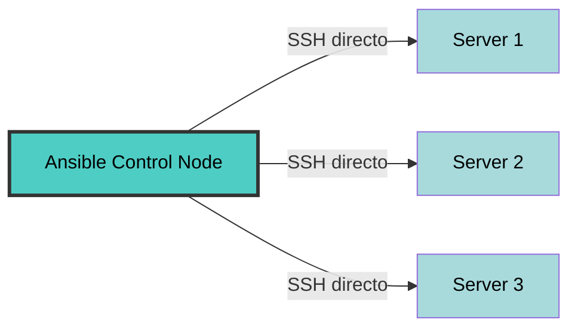
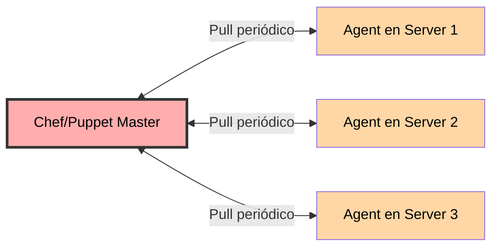
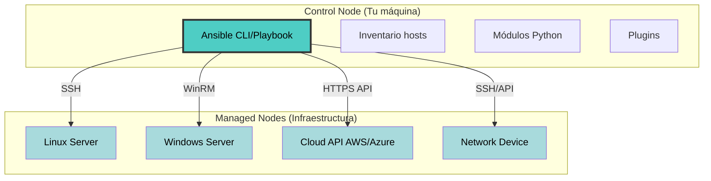
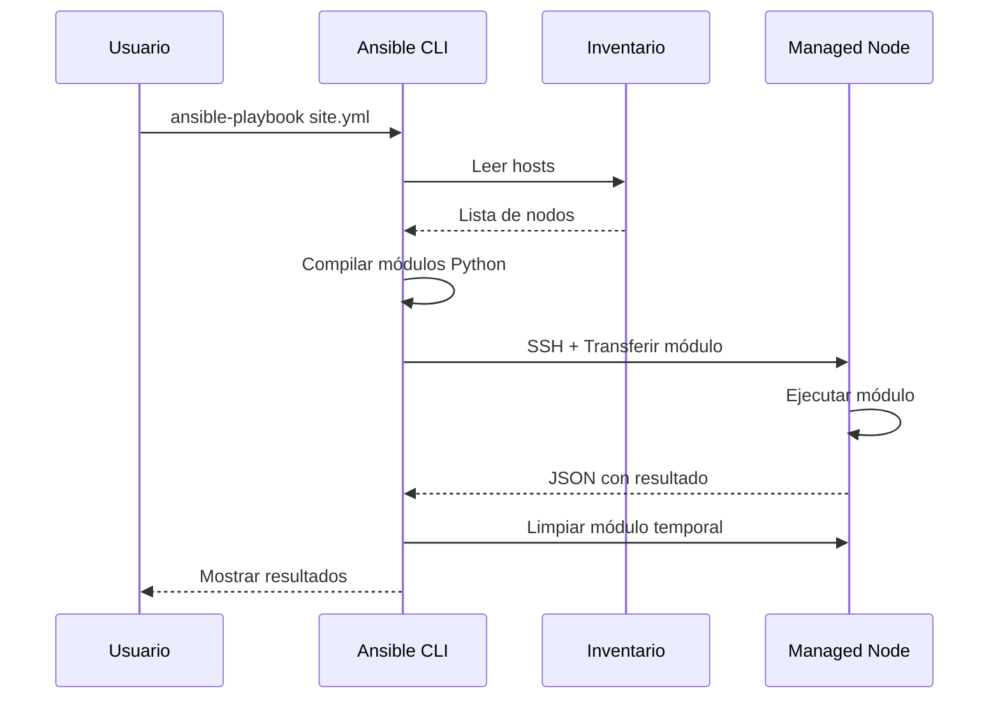
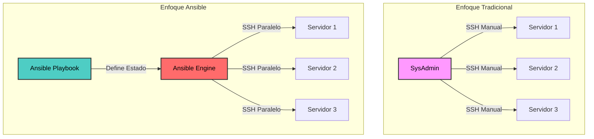
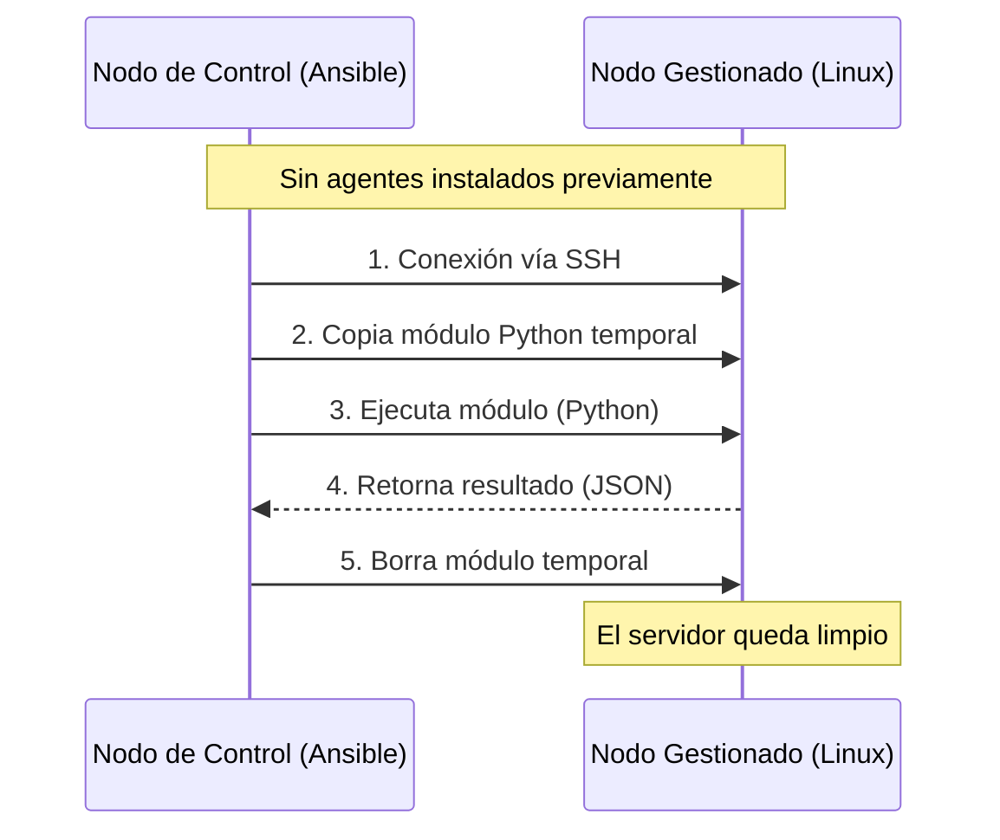
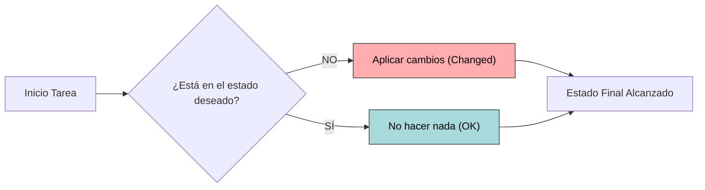
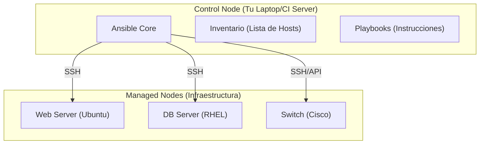
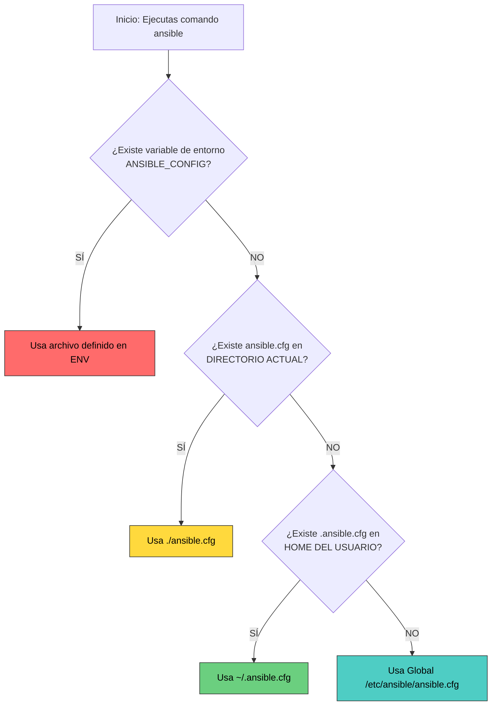

# Introducción, Fundamentos e Instalación 🚀

Bienvenido al curso de Ansible. Este primer capítulo cubre el bloque de fundamentos: **qué es Ansible**, **cómo está construido por dentro** y **cómo dejarlo listo para empezar a automatizar**. 

## 📋 Contenido del capítulo

1. [Introducción: ¿Qué es Ansible?](#introducción-qué-es-ansible-) — Definición, casos de uso y por qué se ha vuelto omnipresente en DevOps.
2. [Fundamentos y arquitectura](#fundamentos-y-arquitectura-de-ansible-️) — Push vs pull, control node y managed nodes, idempotencia, IaC.
3. [Instalación y configuración](#instalación-y-configuración-️) — Requisitos, instalación paso a paso, primer ping, `ansible.cfg`.

:::tip Vídeo asociado
Todos los capítulos se corresponde con **un único vídeo** del [canal de YouTube](https://www.youtube.com/@Pabpereza). Si prefieres aprender en formato vídeo, aquí el vídeo de este capítulo 
:::

TODO Insertar vídeo YT
 
---


## Introducción: ¿Qué es Ansible? 🚀

Bienvenido al curso de Ansible. En esta introducción descubrirás qué es Ansible, por qué es una de las herramientas de automatización más populares del mundo DevOps, y cómo puede transformar la forma en que gestionas tu infraestructura.


### 🎯 ¿Qué es Ansible?

#### Definición
**Ansible** es una plataforma de automatización IT open-source que permite:
- **Gestión de configuraciones**: Mantener servidores en un estado deseado
- **Despliegue de aplicaciones**: Automatizar el deployment de software
- **Orquestación**: Coordinar tareas complejas entre múltiples sistemas
- **Aprovisionamiento**: Configurar infraestructura desde cero

#### La Filosofía: Simplicidad y Potencia
```
Complejidad tradicional → Ansible → Simplicidad radical
      ↓                      ↓              ↓
  Scripts caóticos    YAML legible    Infraestructura predecible
```

Ansible fue creado en 2012 por Michael DeHaan con un objetivo claro: hacer la automatización IT accesible para todos, no solo para expertos en programación. En 2015 fue adquirido por Red Hat (ahora IBM), consolidándose como estándar de la industria.

### 🌟 Casos de Uso Principales

#### 1. Gestión de Configuración
Mantén la coherencia en todos tus servidores. Si tienes 100 servidores web, asegúrate de que todos tengan la misma configuración de Nginx, los mismos certificados SSL y las mismas políticas de seguridad.

**Ejemplo práctico:**
```yaml
- name: Configurar servidores uniformemente
  hosts: servers
  tasks:
    - name: Instalar Nginx
      apt:
        name: nginx
        state: present

    - name: Configurar firewall
      ufw:
        rule: allow
        port: '80,443'
        proto: tcp
```

#### 2. Despliegue Continuo (CI/CD)
Integra Ansible en tus pipelines de Jenkins, GitLab CI o GitHub Actions para desplegar aplicaciones de forma automatizada y consistente.

#### 3. Orquestación Multi-Tier
Coordina despliegues complejos que involucran bases de datos, load balancers, servidores de aplicación y más, en el orden correcto.

#### 4. Gestión de la Nube
Aprovisiona y gestiona recursos en AWS, Azure, Google Cloud, OpenStack y otras plataformas cloud.

#### 5. Cumplimiento y Auditoría
Garantiza que tu infraestructura cumple con estándares de seguridad (PCI-DSS, HIPAA, SOC2) aplicando configuraciones de forma automática y auditable.

#### 6. Disaster Recovery
Automatiza la reconstrucción completa de tu infraestructura en minutos, convirtiendo un desastre en un inconveniente menor.

### ⚔️ Ansible vs Otras Herramientas (Chef, Puppet, SaltStack)

#### Comparativa Rápida

| Característica | Ansible | Chef | Puppet | SaltStack |
|----------------|---------|------|--------|-----------|
| **Agentes** | ❌ No (Agentless) | ✅ Sí | ✅ Sí | ✅ Sí |
| **Lenguaje** | YAML (Declarativo) | Ruby (Imperativo) | DSL propio | YAML + Python |
| **Curva de aprendizaje** | 🟢 Baja | 🔴 Alta | 🟡 Media | 🟡 Media |
| **Modelo** | Push | Pull | Pull | Push/Pull |
| **SSH nativo** | ✅ Sí | ❌ No | ❌ No | ✅ Opcional |
| **Velocidad inicial** | 🚀 Muy rápida | 🐌 Lenta | 🐌 Lenta | 🏃 Rápida |

#### Ventajas de Ansible

##### 1. **Sin Agentes (Agentless)**


**Beneficios:**
- No necesitas instalar/mantener software adicional en tus servidores
- Menor superficie de ataque (seguridad)
- Arranque inmediato: si tiene SSH, puedes gestionarlo

**Chef/Puppet:**


**Inconvenientes:**
- Debes instalar y mantener agentes en cada servidor
- Los agentes consumen recursos (CPU, RAM)
- Si el agente falla, pierdes control del servidor

##### 2. **YAML Legible**
Ansible usa YAML, un formato de datos human-readable que puedes entender aunque no sepas programar.

**Ansible (YAML):**
```yaml
- name: Asegurar que Apache está corriendo
  service:
    name: apache2
    state: started
    enabled: yes
```

**Chef (Ruby DSL):**
```ruby
service 'apache2' do
  action [:enable, :start]
  supports :restart => true, :reload => true
end
```

**Puppet (DSL propio):**
```puppet
service { 'apache2':
  ensure => 'running',
  enable => true,
}
```

##### 3. **Modelo Push vs Pull**

**Ansible (Push):**
- TÚ decides cuándo se ejecutan los cambios
- Control total del timing
- Ideal para CI/CD y despliegues bajo demanda

**Chef/Puppet (Pull):**
- Los agentes consultan periódicamente al master
- Cambios eventuales (cada 30min por defecto)
- Mejor para mantener estado a largo plazo

**¿Cuándo es mejor cada uno?**
- **Push (Ansible)**: Despliegues puntuales, CI/CD, cambios críticos inmediatos
- **Pull (Chef/Puppet)**: Infraestructura masiva que debe autocurarse continuamente

##### 4. **Curva de Aprendizaje**

**Tiempo para ser productivo:**
- **Ansible**: 🟢 1-2 días (si sabes SSH y YAML básico)
- **SaltStack**: 🟡 1-2 semanas
- **Chef**: 🔴 2-4 semanas (requiere conocimientos de Ruby)
- **Puppet**: 🔴 2-4 semanas (requiere aprender su DSL)

#### Cuándo NO usar Ansible

Ansible no siempre es la mejor opción:

❌ **Infraestructura gigante (10,000+ nodos) con cambios frecuentes**: SaltStack es más rápido en ejecución masiva paralela.

❌ **Necesitas un agente siempre monitorizando**: Puppet/Chef tienen agentes que pueden detectar drift (desviación) y autocorregir sin intervención manual.

❌ **Lógica de negocio compleja en Ruby**: Si tu equipo ya es experto en Ruby y Chef, migrar puede no aportar valor.

✅ **La mayoría de los demás casos**: Ansible es la opción más pragmática.

### 🏗️ Arquitectura de Ansible: Visión General

#### Componentes Principales



#### 1. **Control Node (Nodo de Control)**
Es donde instalas y ejecutas Ansible. Puede ser:
- Tu portátil local
- Un servidor bastión/jump host
- Un runner de CI/CD (Jenkins, GitHub Actions, GitLab Runner)

**Requisitos:**
- Sistema operativo: Linux, macOS, WSL (no Windows nativo)
- Python 3.8+
- Ansible instalado (`pip install ansible`)

#### 2. **Managed Nodes (Nodos Gestionados)**
Los sistemas que automatizas. **No necesitan Ansible instalado**, solo:
- **Linux/Unix**: SSH habilitado + Python 2.7 o 3.5+
- **Windows**: WinRM habilitado + PowerShell 3.0+
- **Dispositivos de red**: API REST o SSH

#### 3. **Inventario (Inventory)**
Un archivo (INI, YAML o script dinámico) que lista tus hosts y los agrupa.

**Ejemplo (`hosts.ini`):**
```ini
[madrid]
target1 ansible_host=localhost ansible_port=55000
target2 ansible_host=localhost ansible_port=55001

[barcelona]
target3 ansible_host=localhost ansible_port=55002

[servers:children]
madrid
barcelona
```

#### 4. **Módulos (Modules)**
Unidades de código reutilizable que ejecutan tareas específicas:
- `apt`, `yum`: Gestión de paquetes
- `service`: Gestión de servicios
- `file`, `copy`, `template`: Gestión de archivos
- `user`, `group`: Gestión de usuarios
- `docker_container`, `k8s`: Contenedores
- Más de 3,000 módulos incluidos + colecciones comunitarias

#### 5. **Playbooks**
Archivos YAML que definen el estado deseado de tu infraestructura. Son como "recetas" o "partituras" que Ansible ejecuta.

#### 6. **Plugins**
Extensiones que amplían las capacidades de Ansible:
- **Connection plugins**: SSH, WinRM, Docker, kubectl
- **Inventory plugins**: AWS EC2, Azure, GCP, VMware
- **Filter plugins**: Transformaciones de datos (Jinja2)

#### Flujo de Ejecución



### 📋 Prerrequisitos para este Curso

#### Conocimientos Recomendados

##### Esenciales (Debes tener)
- ✅ **Linux básico**: Navegación por terminal, comandos básicos (ls, cd, cat, vim/nano)
- ✅ **SSH**: Saber conectarte a un servidor remoto (`ssh user@host`)
- ✅ **YAML básico**: Entender la sintaxis (o aprender en el curso)

##### Útiles (Ayudan mucho)
- 🟡 **Git**: Control de versiones para tus playbooks
- 🟡 **Docker**: Para practicar sin romper nada
- 🟡 **Cloud básico**: AWS/Azure/GCP conceptos generales

##### No Necesarios (Los aprenderás aquí)
- ❌ Programación avanzada
- ❌ Experiencia previa con IaC
- ❌ Certificaciones

#### Entorno de Práctica

Para seguir el curso necesitarás:

1. **Un sistema de control (tu PC)**
   - Linux, macOS o Windows con WSL
   - Python 3.8+ instalado
   - Editor de texto (VS Code recomendado con extensión YAML)

2. **Nodos de práctica** (al menos uno):

   **Opción A: Máquinas virtuales locales**
   - VirtualBox/VMware + Ubuntu Server
   - Vagrant para automatizar VMs

   **Opción B: Contenedores Docker**
   - Más ligero y rápido
   - Ideal para experimentar

   **Opción C: VPS en la nube**
   - AWS EC2 free tier
   - DigitalOcean Droplet ($5/mes)
   - Linode, Vultr, etc.

3. **Configuración SSH**
   - Claves SSH generadas (`ssh-keygen`)
   - Acceso sin contraseña configurado (ssh-copy-id)

#### Verificación de Prerrequisitos

Antes de empezar, verifica que tienes todo listo:

```bash
# ¿Tienes Python 3?
python3 --version  # Debe ser 3.8 o superior

# ¿Tienes SSH?
ssh -V  # OpenSSH debe estar instalado

# ¿Tienes un servidor accesible? (ejemplo)
ssh usuario@ip_servidor  # Debe conectar sin errores

# ¿Puedes crear archivos YAML?
echo "clave: valor" > test.yml && cat test.yml
```

Si todos estos comandos funcionan, ¡estás listo! 🎉

### 🎓 Qué Aprenderás en este Curso

Este curso está estructurado en módulos progresivos:

#### **Fundamentos** (Módulos 1-6)
- ✅ Arquitectura y conceptos core
- ✅ Instalación en diferentes sistemas
- ✅ Inventarios y comandos ad-hoc
- ✅ Escribir playbooks efectivos
- ✅ Variables, facts y templating
- ✅ Condicionales, bucles y manejo de errores

#### **Avanzado** (Módulos 7-9)
- ✅ Roles y estructura modular
- ✅ Ansible Vault (secretos seguros)
- ✅ Jinja2 templates avanzados
- ✅ Ansible Tower/AWX (GUI empresarial)
- ✅ Integración con CI/CD
- ✅ Futuro de Ansible y tendencias

Todos ellos acompañados de una parte práctica, como debe ser.

### 🚀 ¿Por qué Aprender Ansible en 2026?

#### Demanda Laboral
- **+40% de ofertas DevOps** mencionan Ansible (Stack Overflow 2025)
- **Salarios**: DevOps Engineers con Ansible ganan 15-25% más que sin automatización
- **Empresas**: Usado por Red Hat, NASA, Apple, Cisco, Bloomberg

#### Comunidad y Ecosistema
- **100,000+ Ansible roles** en Ansible Galaxy
- **3,000+ módulos** oficiales + miles de colecciones comunitarias
- **Documentación exhaustiva** y comunidad activa en GitHub

#### Futuro-Proof
- **Ansible Automation Platform 2.x** (Red Hat) con soporte empresarial
- **Event-Driven Ansible**: Reacciona automáticamente a eventos (próxima generación)
- **Integración con Kubernetes**: Ansible Operator para gestionar apps cloud-native


## Fundamentos y arquitectura de Ansible 🏗️

:::info Video pendiente de grabación
Suscríbete al canal de YouTube para recibir la notificación.
:::

### ¿qué es ansible? iac y evolución

#### 🎻 La analogía: el director de orquesta
Imagina que tienes que dirigir una orquesta de 100 músicos.
*   **Método Manual (SysAdmin tradicional):** Vas músico por músico diciéndole qué nota tocar en cada momento. Te vuelves loco y la música suena fatal.
*   **Scripts (Bash/Python):** Les das una partitura, pero si uno se pierde, la canción se rompe.
*   **Ansible (IaC):** Eres el director. Tienes una partitura maestra (Playbook). Tú marcas el ritmo y el estado deseado ("¡Más fuerte los violines!"). Si un músico desafina, Ansible se encarga de corregirlo automáticamente para que coincida con la partitura.

#### 🧠 Concepto visual



#### 📘 Explicación Técnica
Ansible es una herramienta de **Infraestructura como Código (IaC)** open-source que automatiza el aprovisionamiento de software, la gestión de configuraciones y el despliegue de aplicaciones.

A diferencia de los scripts tradicionales que son **imperativos** (haz esto, luego esto, luego esto), Ansible tiende a ser **declarativo**. Tú defines el **estado final deseado** (quiero que Nginx esté instalado y corriendo) y Ansible se encarga de los pasos necesarios para llegar ahí.

#### 💻 Código: Script vs Ansible

**El método antiguo (Bash Script - Imperativo):**
```bash
# script_instalar.sh
# Si ejecutas esto dos veces, apt podría quejarse o fallar
apt-get update
apt-get install -y nginx
service nginx start
```

**El método Ansible (YAML - Declarativo):**
```yaml
# playbook.yml
- name: Asegurar que Nginx está presente
  apt:
    name: nginx
    state: present  # <-- ESTADO DESEADO

- name: Asegurar que Nginx está corriendo
  service:
    name: nginx
    state: started
    enabled: yes
```

#### 📝 Resumen
*   Ansible permite definir tu infraestructura como código (IaC).
*   Es declarativo: te centras en el "qué" (estado final), no en el "cómo".
*   Escala masivamente: gestiona 1 o 1000 servidores con el mismo esfuerzo.


### Arquitectura "Agentless"

#### 🕵️ La Analogía: La Llave Maestra
Imagina que eres un consultor que visita oficinas.
*   **Con Agente (Puppet/Chef):** Tienes que instalar un robot en cada oficina antes de poder trabajar. Si el robot se rompe, no puedes hacer nada.
*   **Agentless (Ansible):** Usas la puerta estándar (SSH) que ya tienen todas las oficinas. Solo necesitas la llave (credenciales) para entrar, hacer tu trabajo y salir sin dejar rastro.

#### 🧠 Concepto Visual



#### 📘 Explicación Técnica
Ansible es **Agentless**. No requiere instalar ningún software adicional en los nodos que vas a gestionar (ni demonios, ni bases de datos).

Utiliza protocolos estándar existentes:
*   **Linux/Unix:** SSH (Secure Shell).
*   **Windows:** WinRM (Windows Remote Management).

Esto reduce drásticamente la carga administrativa y los agujeros de seguridad, ya que no hay un "agente de Ansible" escuchando en un puerto extraño que debas parchear.

#### 💻 Requisitos Técnicos

**En el Nodo de Control (Tu PC):**
*   Python instalado.
*   Ansible instalado.

**En los Nodos Gestionados (Servidores):**
*   Python instalado (para ejecutar los módulos que envía Ansible).
*   Acceso SSH habilitado.

#### 📝 Resumen
*   Ansible no instala agentes en los servidores destino.
*   Usa SSH para Linux y WinRM para Windows.
*   Es más seguro y ligero al no dejar procesos corriendo en segundo plano.


### Idempotencia

#### 💡 La Analogía: El Interruptor de la Luz
Entras en una habitación y quieres luz.
*   Si el interruptor está apagado, lo pulsas -> **Cambio de estado (Luz ON)**.
*   Si el interruptor ya está encendido, lo miras y no haces nada -> **Estado mantenido (Luz ON)**.
*   Si pulsas el interruptor 50 veces hacia la posición "ON", el resultado es el mismo: la luz está encendida y no explota la bombilla. Eso es **idempotencia**.

#### 🧠 Concepto Visual



#### 📘 Explicación Técnica
La **idempotencia** es la propiedad de realizar una operación varias veces sin cambiar el resultado más allá de la aplicación inicial.

En Ansible, la mayoría de los módulos son idempotentes. Si ejecutas un playbook 100 veces, Ansible solo realizará cambios la primera vez. Las 99 veces restantes verificará que el estado es correcto y reportará "OK" (sin cambios). Esto es vital para la estabilidad.

#### 💻 Caso Práctico

Supongamos que queremos crear un usuario 'deployer'.

**Ejecución 1 (El usuario no existe):**
```bash
TASK [Crear usuario deployer] **************************************************
changed: [servidor1]  <-- Ansible lo crea. Estado: CHANGED (Amarillo)
```

**Ejecución 2 (El usuario YA existe):**
```bash
TASK [Crear usuario deployer] **************************************************
ok: [servidor1]       <-- Ansible verifica y no hace nada. Estado: OK (Verde)
```

#### 📝 Resumen
*   Idempotencia significa que puedes ejecutar el mismo código múltiples veces sin efectos secundarios negativos.
*   Garantiza la consistencia: el resultado final siempre es el estado deseado.
*   Ansible te informa si hubo cambios (`changed`) o si ya estaba todo correcto (`ok`).


### Nodo de Control vs Nodos Gestionados

#### 🎮 La Analogía: La Consola y el Personaje
*   **Nodo de Control:** Es tu mando de la consola. Desde aquí envías las órdenes. Es donde está tu inteligencia.
*   **Nodos Gestionados:** Son los personajes del videojuego. Reciben las órdenes y actúan. Pueden ser guerreros (Linux), magos (Windows) o incluso el entorno (Routers).

#### 🧠 Concepto Visual



#### 📘 Explicación Técnica

1.  **Nodo de Control (Control Node):**
    *   Es la máquina donde instalas y ejecutas Ansible.
    *   Puede ser tu portátil, un servidor bastión o un runner de CI/CD (Jenkins/GitHub Actions).
    *   **Limitación:** No soporta Windows nativo como nodo de control (debes usar WSL).

2.  **Nodos Gestionados (Managed Nodes):**
    *   Son los dispositivos que automatizas (Servidores, Nube, Redes).
    *   No necesitan Ansible instalado.
    *   Se organizan en un **Inventario**.

#### 💻 Configuración Típica

**Inventario (`hosts.ini`):**
```ini
[madrid]
target1 ansible_host=localhost ansible_port=55000
target2 ansible_host=localhost ansible_port=55001

[barcelona]
target3 ansible_host=localhost ansible_port=55002

[servers:children]
madrid
barcelona
```

**Comando desde el Nodo de Control:**
```bash
# Hacemos ping a todos los nodos del inventario
ansible all -i hosts.ini -m ping
```

#### 📝 Resumen
*   **Control Node:** Donde ejecutas los comandos. Solo Linux/Unix (o WSL).
*   **Managed Node:** Donde se aplican los cambios. Cualquier sistema con SSH/WinRM y Python.
*   La relación es 1 a N: Un nodo de control puede gestionar miles de nodos gestionados.


## Instalación y configuración ⚙️

Prepara tu entorno de trabajo para empezar a automatizar.


### Requisitos previos (python)

#### 📋 Requisitos técnicos

##### 1. En el nodo de control (tu ordenador)
Es donde instalas Ansible.
*   **Sistema Operativo:** Linux, macOS, o WSL (Windows Subsystem for Linux). **No** soporta Windows nativo.
*   **Python:** Versión 3.8 o superior recomendada.

##### 2. En los nodos gestionados (tus servidores)
Son las máquinas que vas a controlar.
*   **Python:** Necesitan tener Python instalado (versión 2.7+ o 3.5+).
*   **SSH:** Acceso vía SSH y credenciales válidas.


Si ves un número, ¡estás listo para repostar e instalar el Ferrari!

### Instalación (Ubuntu/RHEL/macOS)

Vamos a instalar Ansible en tu **Nodo de Control**. Recuerda que **NO** necesitas instalar nada en los servidores que vas a gestionar (agentless, ¿recuerdas?).

#### 📦 Guía de Instalación por S.O.

Elige tu sistema operativo y sigue los pasos.

import Tabs from '@theme/Tabs';
import TabItem from '@theme/TabItem';


<Tabs>
  <TabItem value="ubuntu" label="Ubuntu/Debian" default>

    En Ubuntu, lo ideal es usar el PPA oficial para tener la última versión, ya que los repositorios por defecto suelen traer versiones antiguas.

    ```bash
    # 1. Actualizar índices
    sudo apt update

    # 2. Instalar software-properties-common
    sudo apt install -y software-properties-common

    # 3. Añadir el repositorio oficial de Ansible (PPA)
    sudo add-apt-repository --yes --update ppa:ansible/ansible

    # 4. Instalar Ansible
    sudo apt install -y ansible
    ```

  </TabItem>
  <TabItem value="rhel" label="RHEL/CentOS/Fedora">

    En la familia Red Hat, Ansible se encuentra en el repositorio EPEL (Extra Packages for Enterprise Linux).

    ```bash
    # 1. Instalar el repositorio EPEL
    sudo dnf install epel-release

    # 2. Instalar Ansible
    sudo dnf install ansible
    ```

  </TabItem>
  <TabItem value="macos" label="macOS">

    Si usas Mac, la forma más sencilla y limpia es usar **Homebrew**.

    ```bash
    # Instalar Ansible con Brew
    brew install ansible
    ```

  </TabItem>
  <TabItem value="pip" label="Python (Pip)">

    Esta es una opción universal si tienes Python instalado. Es útil para entornos virtuales o si tu distro no tiene paquetes actualizados.

    ```bash
    # 1. Asegúrate de tener pip
    python3 -m ensurepip --default-pip

    # 2. Instalar Ansible
    python3 -m pip install --user ansible

    # 3. Añadir al PATH (si no lo está)
    # Añade esto a tu .bashrc o .zshrc si ansible no se encuentra
    export PATH=$PATH:$HOME/.local/bin
    ```

  </TabItem>
</Tabs>

#### ✅ Verificación

Una vez termine la instalación, verifica que todo ha ido bien preguntándole a Ansible su versión:

```bash
ansible --version
```

Deberías ver una salida similar a esta:
```text
ansible [core 2.14.x]
  config file = /etc/ansible/ansible.cfg
  configured module search path = ...
  ansible python module location = ...
  python version = 3.10.x
```

¡Listo! Ya tienes el poder de la automatización en tus manos.

### 1.Laboratorio Práctico

Para aprender Ansible necesitas romper cosas. Y mejor romper un entorno de pruebas que el servidor de producción de tu empresa.

Vamos a montar un entorno local usando **Docker**. Si no sabes de docker o simplemente quieres repasar, te recuerdo que tienes un [curso completo de Docker aquí](../docker/README.md)

He creado un repositorio que automatiza el proceso, por lo que no tienes que saber nada. Si prefieres montártelo por tu cuenta, también puedes replicarlo con 3 VMs a las que tengas permisos de administrador y acceso SSH.

Clona el repositorio [pabpereza/ansible-laboratory](https://github.com/pabpereza/ansible-laboratory).
```bash
git clone https://github.com/pabpereza/ansible-laboratory.git
```

Dale permisos de ejecución al script de setup:
```bash
cd ansible-laboratory
chmod +x setup.sh
```

Ejecuta el script para montar el laboratorio y sigue los pasos del menú interactivo:
```bash
./setup.sh
```

Para este curso, te recomiendo usar la opción **Local**, esta requiere tener Docker instalado. Te dará a elegir el número de targets (o servidores), te recomiendo 3 para el curso.

Además, si no quieres usar tu host como nodo de control, el script te da la opción de montar un contenedor extra que hará de nodo de control y lenvanta una instalacia de VS Code Server para que puedas editar tus playbooks desde el navegador y no manches tu entorno local.


### 2. Archivo ansible.cfg

Ansible funciona "out of the box", pero para trabajar como un profesional, necesitas configurarlo a tu gusto.

#### 🧠 Precedencia de Configuración

Ansible es muy flexible buscando su configuración. No hay un solo sitio, busca en varios lugares en un orden específico. **El primero que encuentra, gana.**



#### 💡 Best Practice
La mejor práctica es tener un archivo `ansible.cfg` **en la carpeta de tu proyecto**.
*   Así, la configuración viaja con tu código (Git).
*   Tus compañeros tendrán la misma configuración que tú.
*   Evitas romper otros proyectos si cambias la configuración global.

#### 📝 Ejemplo de ansible.cfg Básico

Crea un archivo llamado `ansible.cfg` en tu carpeta de proyecto con este contenido recomendado para empezar:

```ini
[defaults]
# Dónde está tu lista de servidores por defecto
inventory = ./hosts.ini

# Usuario con el que te conectas a los servidores remotos
remote_user = ansible 

# Desactiva la comprobación de huellas SSH (útil para laboratorios, CUIDADO en prod)
host_key_checking = False

# Número de procesos paralelos (por defecto es 5, súbelo si tienes muchos hosts)
forks = 5

[privilege_escalation]
# Activar sudo automáticamente
become = True
# Método de elevación
become_method = sudo
# Usuario al que elevar (root)
become_user = root
# Pedir contraseña de sudo (False si tienes SSH keys configuradas sin pass)
become_ask_pass = False
```

Con esto, Ansible sabrá dónde mirar y cómo comportarse sin que tengas que pasarle mil parámetros por línea de comandos.


##### 3. Crear tu inventario
Crea un archivo llamado `hosts.ini` (o `inventory`) en la misma carpeta. Recuerda ajustar esta información con los puertos que te haya puesto automáticamente el script de setup para cada target.

```ini
[servers]
target1 ansible_port=55000 ansible_host=localhost
target2 ansible_port=55001 ansible_host=localhost
target3 ansible_port=55002 ansible_host=localhost

[all:vars]
# Conectamos a localhost y cada host usa un puerto distinto redirigido al contenedor
ansible_user=ansible
ansible_ssh_pass=ansible # Contraseña por defecto del laboratorio, en producción usarías claves SSH o Ansible Vault para esto, lo veremos más adelante.
```


##### 4. ¡Prueba de fuego! 🔥
Ejecuta tu primer comando ad-hoc para ver si hay conexión (ping):

```bash
ansible all -i hosts.ini -m ping
```

Si ves algo verde que dice `"ping": "pong"`, ¡felicidades! 🎉 Tienes tu laboratorio de Ansible funcionando.


#### 🧹 Limpieza
Cuando termines de jugar, puedes ir a docker y parar todos los contenedores. Si quieres eliminar o reinstalar el laboratorio. Sigue el menú interactivo: 
```bash
./setup.sh
```
