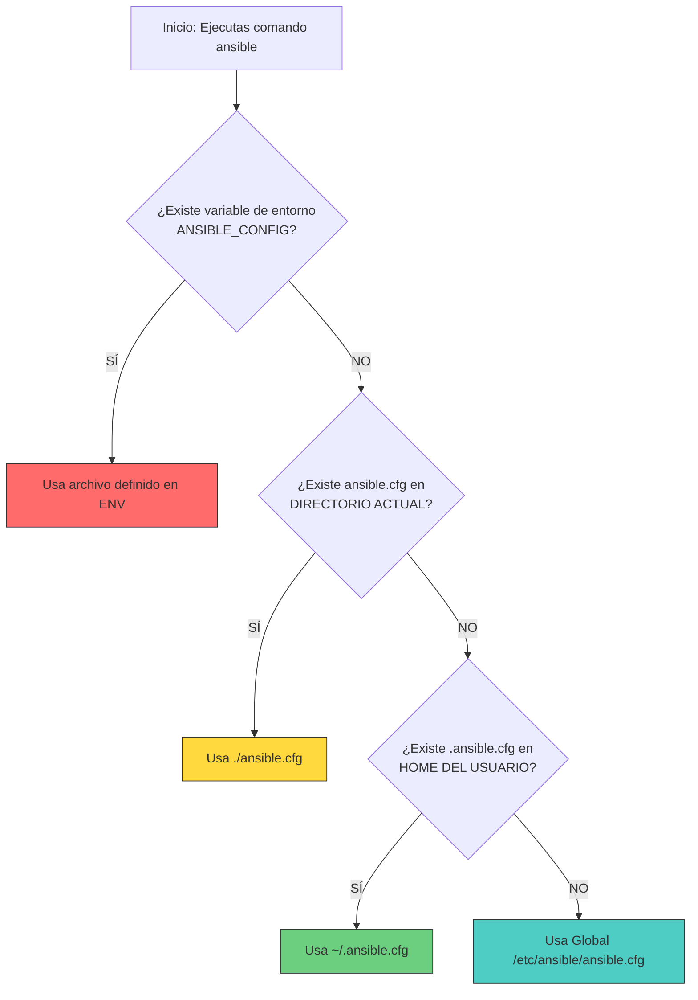

import Tabs from '@theme/Tabs';
import TabItem from '@theme/TabItem';

# Instalación y configuración ⚙️

Prepara tu entorno de trabajo para empezar a automatizar.

:::info Video pendiente de grabación
:::

## 2.1. requisitos previos (python)

### ⛽ La analogía: el combustible
Imagina que Ansible es un **Ferrari** 🏎️. Es rápido, potente y rojo (bueno, el logo es negro y blanco, pero ya me entiendes).
Para que ese Ferrari arranque, necesita gasolina. En el mundo de Ansible, esa gasolina es **Python**.

Sin Python, Ansible es solo un montón de código bonito que no hace nada.

### 🐍 ¿Por qué Python?
Ansible está escrito en Python. Cuando ejecutas un comando, Ansible:
1.  Convierte tus instrucciones (YAML) en pequeños programas de Python (módulos).
2.  Envía esos programas al servidor destino.
3.  Necesita un intérprete de Python en el destino para ejecutarlos.

### 📋 Requisitos técnicos

#### 1. En el nodo de control (tu ordenador)
Es donde instalas Ansible.
*   **Sistema Operativo:** Linux, macOS, o WSL (Windows Subsystem for Linux). **No** soporta Windows nativo.
*   **Python:** Versión 3.8 o superior recomendada.

#### 2. En los nodos gestionados (tus servidores)
Son las máquinas que vas a controlar.
*   **Python:** Necesitan tener Python instalado (versión 2.7+ o 3.5+).
*   **SSH:** Acceso vía SSH y credenciales válidas.

:::warning Ojo con Python 2
Aunque Ansible soporta Python 2.7 en los nodos gestionados, es una versión obsoleta (End of Life). Siempre que puedas, asegúrate de que tus servidores tengan **Python 3**.
:::

### 🔍 Cómo verificar tu versión
Abre tu terminal y comprueba si tienes "gasolina":

```bash
python3 --version
# O si usas python 2
python --version
```

Si ves un número, ¡estás listo para repostar e instalar el Ferrari!

## 2.2. Instalación (Ubuntu/RHEL/macOS)

Vamos a instalar Ansible en tu **Nodo de Control**. Recuerda que **NO** necesitas instalar nada en los servidores que vas a gestionar (agentless, ¿recuerdas?).

### 📦 Guía de Instalación por S.O.

Elige tu sistema operativo y sigue los pasos.

<Tabs>
  <TabItem value="ubuntu" label="Ubuntu/Debian" default>
    
    En Ubuntu, lo ideal es usar el PPA oficial para tener la última versión, ya que los repositorios por defecto suelen traer versiones antiguas.

    ```bash
    # 1. Actualizar índices
    sudo apt update

    # 2. Instalar software-properties-common
    sudo apt install -y software-properties-common

    # 3. Añadir el repositorio oficial de Ansible (PPA)
    sudo add-apt-repository --yes --update ppa:ansible/ansible

    # 4. Instalar Ansible
    sudo apt install -y ansible
    ```

  </TabItem>
  <TabItem value="rhel" label="RHEL/CentOS/Fedora">
    
    En la familia Red Hat, Ansible se encuentra en el repositorio EPEL (Extra Packages for Enterprise Linux).

    ```bash
    # 1. Instalar el repositorio EPEL
    sudo dnf install epel-release

    # 2. Instalar Ansible
    sudo dnf install ansible
    ```

  </TabItem>
  <TabItem value="macos" label="macOS">
    
    Si usas Mac, la forma más sencilla y limpia es usar **Homebrew**.

    ```bash
    # Instalar Ansible con Brew
    brew install ansible
    ```

  </TabItem>
  <TabItem value="pip" label="Python (Pip)">
    
    Esta es una opción universal si tienes Python instalado. Es útil para entornos virtuales o si tu distro no tiene paquetes actualizados.

    ```bash
    # 1. Asegúrate de tener pip
    python3 -m ensurepip --default-pip

    # 2. Instalar Ansible
    python3 -m pip install --user ansible

    # 3. Añadir al PATH (si no lo está)
    # Añade esto a tu .bashrc o .zshrc si ansible no se encuentra
    export PATH=$PATH:$HOME/.local/bin
    ```

  </TabItem>
</Tabs>

### ✅ Verificación

Una vez termine la instalación, verifica que todo ha ido bien preguntándole a Ansible su versión:

```bash
ansible --version
```

Deberías ver una salida similar a esta:
```text
ansible [core 2.14.x]
  config file = /etc/ansible/ansible.cfg
  configured module search path = ...
  ansible python module location = ...
  python version = 3.10.x
```

¡Listo! Ya tienes el poder de la automatización en tus manos.

## 2.3. Archivo ansible.cfg

Ansible funciona "out of the box", pero para trabajar como un profesional, necesitas configurarlo a tu gusto.

### 🧠 Precedencia de Configuración

Ansible es muy flexible buscando su configuración. No hay un solo sitio, busca en varios lugares en un orden específico. **El primero que encuentra, gana.**



### 💡 Best Practice
La mejor práctica es tener un archivo `ansible.cfg` **en la carpeta de tu proyecto**.
*   Así, la configuración viaja con tu código (Git).
*   Tus compañeros tendrán la misma configuración que tú.
*   Evitas romper otros proyectos si cambias la configuración global.

### 📝 Ejemplo de ansible.cfg Básico

Crea un archivo llamado `ansible.cfg` en tu carpeta de proyecto con este contenido recomendado para empezar:

```ini
[defaults]
# Dónde está tu lista de servidores por defecto
inventory = ./hosts

# Usuario con el que te conectas a los servidores remotos
remote_user = tu_usuario

# Desactiva la comprobación de huellas SSH (útil para laboratorios, CUIDADO en prod)
host_key_checking = False

# Número de procesos paralelos (por defecto es 5, súbelo si tienes muchos hosts)
forks = 10

[privilege_escalation]
# Activar sudo automáticamente
become = True
# Método de elevación
become_method = sudo
# Usuario al que elevar (root)
become_user = root
# Pedir contraseña de sudo (False si tienes SSH keys configuradas sin pass)
become_ask_pass = False
```

Con esto, Ansible sabrá dónde mirar y cómo comportarse sin que tengas que pasarle mil parámetros por línea de comandos.

## 2.4. Laboratorio Práctico (Vagrant/AWS)

Para aprender Ansible necesitas romper cosas. Y mejor romper un entorno de pruebas que el servidor de producción de tu empresa (créeme, no quieres esa llamada un viernes por la tarde).

Vamos a montar un entorno local usando **Docker**. Es rápido, ligero y gratis.

### 🐳 Opción: Docker Compose (Recomendada)

Simularemos 3 máquinas:
1.  **Control Node:** Tu máquina con Ansible (o un contenedor con Ansible).
2.  **Web:** Un servidor Ubuntu que gestionaremos.
3.  **Db:** Otro servidor Ubuntu que gestionaremos.

#### 1. Estructura de archivos
Crea una carpeta `ansible-lab` y dentro este archivo `docker-compose.yml`:

```yaml
version: '3'

services:
  # Simulamos el servidor WEB
  ubuntu-web:
    image: paramrod/ubuntu-ssh-enabled:latest # Imagen con SSH server listo
    container_name: ubuntu-web
    hostname: webserver
    ports:
      - "2222:22" # Exponemos SSH en puerto 2222
    networks:
      - ansible-net

  # Simulamos el servidor DB
  ubuntu-db:
    image: paramrod/ubuntu-ssh-enabled:latest
    container_name: ubuntu-db
    hostname: dbserver
    ports:
      - "2223:22" # Exponemos SSH en puerto 2223
    networks:
      - ansible-net

networks:
  ansible-net:
    driver: bridge
```

#### 2. Levantar el laboratorio
```bash
docker compose up -d
```

#### 3. Crear tu inventario
Crea un archivo llamado `hosts` (o `inventory`) en la misma carpeta:

```ini
[webservers]
# Conectamos a localhost puerto 2222 que redirige al contenedor
ubuntu-web ansible_host=localhost ansible_port=2222 ansible_user=ansible ansible_ssh_pass=password

[dbservers]
ubuntu-db ansible_host=localhost ansible_port=2223 ansible_user=ansible ansible_ssh_pass=password
```

:::note Credenciales
La imagen `paramrod/ubuntu-ssh-enabled` es una imagen pública preparada para labs con usuario `ansible` y contraseña `password`. ¡No usar en producción!
:::

#### 4. ¡Prueba de fuego! 🔥
Ejecuta tu primer comando ad-hoc para ver si hay conexión (ping):

```bash
ansible all -i hosts -m ping
```

Si ves algo verde que dice `"ping": "pong"`, ¡felicidades! 🎉 Tienes tu laboratorio de Ansible funcionando.

### 🧹 Limpieza
Cuando termines de jugar, apaga todo para liberar recursos:
```bash
docker compose down
```
