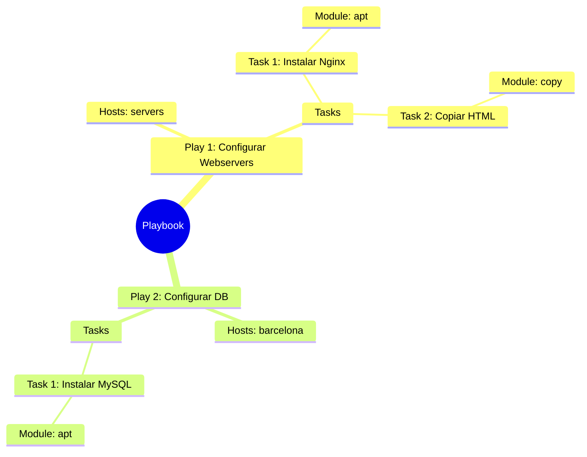

# Playbooks y YAML 📜

El corazón de Ansible: definir el estado deseado de tu infraestructura.

Estas piezas de código son tus "recetas" para configurar servidores, desplegar aplicaciones y orquestar tareas complejas. En este capítulo, vamos a diseccionar la sintaxis YAML, la estructura de un playbook y cómo ejecutar tus creaciones con `ansible-playbook`.

:::info Video pendiente de grabación
:::

## Sintaxis YAML: la regla de oro

YAML (YAML Ain't Markup Language) es el lenguaje que usa Ansible. Es famoso por ser legible para humanos, pero estricto con las máquinas.

### 🛒 La analogía: la lista de la compra
Imagina una lista de la compra organizada por pasillos. No mezclas todo; agrupas las cosas para ser eficiente.

*   **Pasillo Frutería:**
    *   Manzanas
    *   Peras
*   **Pasillo Limpieza:**
    *   Lejía
    *   Jabón

En YAML, esta estructura visual es **obligatoria**.

### Diccionarios vs listas

Hay dos estructuras clave que debes dominar:

1.  **Diccionarios (mapas):** Pares `clave: valor`. Definen propiedades.
2.  **Listas (arrays):** Elementos que empiezan con un guion `-`. Son colecciones.

```yaml
# Esto es un Diccionario (Propiedades de un coche)
coche:
  marca: Toyota
  modelo: Corolla
  color: Rojo

# Esto es una Lista (Cosas en el maletero)
maletero:
  - Rueda de repuesto
  - Gato hidráulico
  - Triángulos
```

### ⚠️ La regla de oro de la indentación
En YAML, la jerarquía se define por la indentación (espacios a la izquierda).

> **NUNCA uses tabuladores (Tabs). Usa siempre ESPACIOS (generalmente 2 por nivel).**

#### ✅ BIEN (Espacios)
```yaml
hosts: servers
tasks:
  - name: Instalar Nginx  # 2 espacios de indentación
    apt:                  # 4 espacios
      name: nginx         # 6 espacios
```

#### ❌ MAL (Tabs o mezcla)
```yaml
hosts: servers
tasks:
	- name: Instalar Nginx  # <--- ¡ERROR! Tabulador detectado
    apt:
      name: nginx
```
*Si mezclas tabs y espacios, Ansible te odiará y el playbook fallará. Configura tu editor para usar solo espacios.*


## Estructura de un playbook

Un **Playbook** es el archivo donde orquestamos todo. Tiene una jerarquía estricta.

Supongamos que un playbook es como una película:
*   **Playbook:** Es la película completa.
*   **Play:** Es una **Escena**. Ocurre en un lugar específico (un grupo de `hosts`) y tiene unos actores (tareas).
*   **Task:** Es una **Acción** concreta del guion ("El actor abre la puerta").
*   **Module:** Es la **Herramienta** usada para la acción (La puerta, el pomo).

### Jerarquía visual



### Anatomía en código

```yaml
# Playbook
- name: Play 1 - Configurar servidores web nginx  # <-- PLAYBOOK
  hosts: servers
  become: yes  # Usar sudo

  tasks:
    - name: Task 1 - Instalar paquete       # <-- TASK
      apt:                                  # <-- MODULE
        name: nginx
        state: present
```


## Módulos esenciales (los 4 fantásticos)

Ansible tiene miles de módulos, pero usarás estos 4 el 80% del tiempo. Los presentamos en el orden lógico de ejecución: primero el usuario, luego el software, luego la configuración y por último el servicio.

### Gestión de usuarios (`user`)
Crea o modifica usuarios del sistema. El usuario debe existir **antes** de instalar el software que va a correr bajo él.

```yaml
- name: Crear usuario nginx
  user:
    name: nginx
    shell: /usr/sbin/nologin  # Sin login interactivo, solo para correr el proceso
    system: yes               # Usuario de sistema (UID < 1000)
```

### Actualización del índice de paquetes (`apt`)
Antes de instalar nada, actualizamos el índice de paquetes para que `apt` conozca las versiones más recientes disponibles. Sin este paso, podrías instalar una versión antigua o encontrar errores de "package not found".

```yaml
- name: Actualizar índice de paquetes
  apt:
    update_cache: yes
    cache_valid_time: 3600  # No repetir si el índice tiene menos de 1 hora
```

### Gestión de paquetes (`apt` / `yum`)
Instala, actualiza o elimina software.

```yaml
- name: Instalar nginx
  apt:
    name: nginx
    state: present  # Opciones: present (instalar), absent (borrar), latest (actualizar)
```

### Gestión de archivos (`copy`)
Sube archivos desde tu máquina de control al servidor remoto. Asignamos propietario `nginx` para que el proceso pueda leer su configuración.

El archivo `./files/nginx.conf` que vamos a subir tiene el contenido mínimo para servir una página en el puerto 80:

```nginx
# files/nginx.conf
user nginx;
worker_processes auto;

events {
    worker_connections 1024;
}

http {
    include       /etc/nginx/mime.types;
    default_type  application/octet-stream;

    server {
        listen       80;
        server_name  _;

        location / {
            root   /var/www/html;
            index  index.html;
        }
    }
}
```

Y la task de Ansible que lo despliega:

```yaml
- name: Subir configuración de nginx
  copy:
    src: ./nginx.conf      # Origen (tu PC)
    dest: /etc/nginx/nginx.conf  # Destino (servidor remoto)
    owner: nginx
    group: nginx
    mode: '0644'
```

### Gestión de servicios (`service` / `systemd`)
Arranca, para o reinicia demonios. Solo llegamos aquí si el usuario, el paquete y la config ya están en su sitio.

```yaml
- name: Arrancar nginx
  service:
    name: nginx
    state: started  # Opciones: started, stopped, restarted
    enabled: yes    # ¿Arrancar al inicio del sistema?
```

### Resumen y primera ejecución
Todos estos pasos por separado, los podríamos agrupar en un único playbook:

```yaml
- name: Configurar Servidor Web Nginx
  hosts: target1 
  become: yes

  tasks:
    - name: Actualizar índice de paquetes
      apt:
        update_cache: yes
        cache_valid_time: 3600

    - name: Crear usuario nginx
      user:
        name: nginx
        shell: /usr/sbin/nologin
        system: yes

    - name: Instalar nginx
      apt:
        name: nginx
        state: present

    - name: Subir configuración de nginx
      copy:
        src: ./nginx.conf
        dest: /etc/nginx/nginx.conf
        owner: nginx
        group: nginx
        mode: '0644'

    - name: Arrancar nginx
      service:
        name: nginx
        state: started
        enabled: yes
```

Ya tendríamos nuestro primer playbook completo y es el momento de ejecutarlo. Para este bloque, he creado en la raíz del proyecto un carpeta `nginx` con el playbook `nginx.yml` y el archivo de configuración `nginx.conf`.

Instalemos nginx en el `target1`, modificando el campo `hosts` del playbook. Luego podemos ejecutarlo así:
```bash
ansible-playbook nginx/nginx.yml
```


### 💡 El concepto de idempotencia
Fíjate en el parámetro `state`. En Ansible no decimos "Instala esto", decimos "Asegúrate de que esto esté **presente**".
*   Si no está -> Lo instala.
*   Si ya está -> **No hace nada**.

Esto es **Idempotencia**: Puedes ejecutar el mismo Playbook 1000 veces, y el resultado final siempre será el mismo, sin romper nada.

### 🔄 Variable de estado: el "destroy" de Ansible

A diferencia de Terraform, Ansible no tiene un comando `destroy` nativo porque es **stateless** — no recuerda lo que hizo en ejecuciones anteriores. La solución idiomática es controlar el `state` mediante una variable:

```yaml
- name: Gestionar instalación por estado 
  hosts: all
  vars:
    app_state: present  # Cambiar a 'absent' para destruir

  tasks:
    - name: Paquete nginx 
      apt:
        name: nginx
        state: "{{ app_state }}"  # 'present' o 'absent'

    - name: Servicio nginx
      service:
        name: nginx
        state: "{{ 'started' if app_state == 'present' else 'stopped' }}"
        enabled: "{{ app_state == 'present' }}"
```

Con esto, el mismo playbook sirve para desplegar o limpiar:
```bash
# Desplegar
ansible-playbook playbook.yml

# Destruir (equivalente al destroy)
ansible-playbook playbook.yml -e app_state=absent
```

> La variable `-e` (extra vars) tiene la **máxima prioridad** y sobreescribe cualquier valor definido en el playbook.


## Tasks y handlers

### Tasks: las acciones del playbook

Las **tasks** (tareas) son la unidad básica de ejecución en Ansible. Cada task ejecuta un módulo para realizar una acción específica.

```yaml
tasks:
  - name: Instalar apache
    apt:
      name: apache2
      state: present

  - name: Copiar configuración
    copy:
      src: apache.conf
      dest: /etc/apache2/apache2.conf
```

### Handlers: tareas especiales que solo se ejecutan cuando hay cambios

Los **handlers** son tasks especiales que solo se ejecutan cuando son "notificados" por otra task que ha hecho cambios.

#### El interruptor de la luz
Cuando cambias una bombilla (task), necesitas probar el interruptor (handler) para verificar que funciona. Pero si no cambiaste la bombilla, no tiene sentido probar el interruptor.

```yaml
tasks:
  - name: Modificar configuración de Apache
    copy:
      src: apache.conf
      dest: /etc/apache2/apache2.conf
    notify: Reiniciar Apache  # Solo notifica si el archivo cambió

handlers:
  - name: Reiniciar Apache
    service:
      name: apache2
      state: restarted
```

**Características clave de los handlers:**
- Solo se ejecutan si la task que los notifica reporta un cambio
- Se ejecutan **al final** del play, una sola vez (aunque múltiples tasks los notifiquen)
- Son perfectos para reiniciar servicios tras cambios de configuración

```yaml
- name: Play 1 - Configurar servidor nginx
  hosts: target1
  become: yes # Es para ejecutar con sudo
  vars:
    app_state: present

  tasks:
    - name: Actualizar índices de paquetes
      apt:
        update_cache: yes
        cache_valid_time: 3600

    - name: Instalar nginx
      apt:
        name: nginx
        state: "{{ app_state }}"

    - name: Crear usuario nginx
      user:
        name: nginx
        shell: /usr/bin/nologin
        system: yes
    

    - name: Subir la configuración de nginx
      copy:
        src: ./nginx.conf
        dest: /etc/nginx/nginx.conf
        owner: nginx
        group: nginx
        mode: '0644'
        backup: yes
        validate: 'nginx -t -c %s'
      notify: Recargar nginx

    - name: Arrancar servicio nginx
      service:
        name: ngin`
        state: "{{ 'started' if app_state == 'present' else 'stopped' }}"
        enabled: "{{ app_state == 'present' }}"
  
  handlers:
    - name: Recargar nginx
      service:
        name: nginx
        state: reloaded
```

## Ejecución condicional con `when`

A veces necesitas ejecutar una task solo si se cumple cierta condición. Para eso usamos `when`.

### 🚦 La analogía: el semáforo
No arrancas el coche hasta que el semáforo está en verde. La condición es: "color == verde".

En nuestro inventario, `target1` y `target2` son contenedores Ubuntu, por lo que el módulo `apt` se ejecutará en ambos y la tarea de CentOS se saltará (`skipped`):

```yaml
- name: Instalar Apache en target1 y target2 (Ubuntu)
  hosts: all
  tasks:
    - name: Instalar Apache en Ubuntu/Debian
      apt:
        name: apache2
        state: present
      when: ansible_facts['distribution'] == "Ubuntu"

    - name: Instalar Apache en CentOS/RHEL
      yum:
        name: httpd
        state: present
      when: ansible_facts['distribution'] == "CentOS"
```

Al ejecutarlo con `ansible-playbook -i hosts.ini playbook.yml`, Ansible recopila los *facts* de cada host y evalúa la condición. En `target1` y `target2` verás:
- `apt` → **ok** (son Ubuntu)
- `yum` → **skipping** (no es CentOS)

### Ejemplos de condiciones comunes

```yaml
# Verificar versión del SO
- name: Tarea solo para Ubuntu 20.04
  debug:
    msg: "Este es Ubuntu 20.04"
  when: ansible_facts['distribution_version'] == "20.04"

# Verificar si existe un archivo
- name: Configurar backup solo si existe el directorio
  command: /usr/local/bin/backup.sh
  when: backup_dir.stat.exists

# Múltiples condiciones (AND)
- name: Instalar solo en servidores de producción con Ubuntu
  apt:
    name: monitoring-agent
  when:
    - ansible_facts['distribution'] == "Ubuntu"
    - ansible_facts['environment'] == "production"

# Condición OR
- name: Instalar en Debian o Ubuntu
  apt:
    name: nginx
  when: ansible_facts['distribution'] == "Debian" or ansible_facts['distribution'] == "Ubuntu"
```


## Loops: repetir tareas

En lugar de copiar y pegar la misma task 10 veces, usamos loops (bucles).

### 🔁 La analogía: la cadena de montaje
En una fábrica, la misma acción se repite para cada producto que pasa por la cinta. No creas 100 estaciones iguales, usas una y procesas cada item.

### Loop básico: `loop`

```yaml
- name: Instalar múltiples paquetes
  apt:
    name: "{{ item }}"
    state: present
  loop:
    - git
    - curl
    - vim
    - htop
```

**Equivalente sin loop (¡NO hagas esto!):**
```yaml
- name: Instalar git
  apt:
    name: git
    state: present

- name: Instalar curl
  apt:
    name: curl
    state: present

- name: Instalar vim
  apt:
    name: vim
    state: present
# ... y así sucesivamente 😱
```

### Loops con diccionarios

```yaml
- name: Crear múltiples usuarios
  user:
    name: "{{ item.name }}"
    groups: "{{ item.groups }}"
    shell: /bin/bash
  loop:
    - name: 'alice'
      groups: 'sudo,developers'
    - name: 'bob'
      groups: 'developers'
    - name: 'charlie'
      groups: 'sudo'
```

### Loop con condición

```yaml
- name: Instalar paquetes solo en servidores web
  apt:
    name: "{{ item }}"
    state: present
  loop:
    - nginx
    - php-fpm
    - mysql-client
  when: "'servers' in group_names"
```

### Ejemplo completo con loops

```yaml
- name: Play 3 - Instalación en bloque
  hosts: target1
  become: yes # Es para ejecutar con sudo

  tasks:
  - name: Instalar paquetes
    apt:
      name: "{{ item }}"
    loop:
      - git
      - curl
      - vim
      - apache2

  - name: Ensure group developer exists
    group:
      name: developers
      state: present

  - name: Crear múltiples usuarios
    user:
      name: "{{ item.name }}"
      groups: "{{ item.groups }}"
      shell: /bin/bash
    loop:
      - name: 'alice'
        groups: 'sudo'
      - name: 'bob'
        groups: 'developers'
      - name: 'charlie'
        groups: 'developers'


## Tags: ejecutar solo partes del playbook

Los **tags** (etiquetas) te permiten ejecutar solo ciertas tasks del playbook sin ejecutarlo completo.

### 🏷️ La analogía: filtros de email
Imagina que tu inbox tiene etiquetas: "Urgente", "Trabajo", "Personal". Puedes ver solo los emails con una etiqueta específica. En los playbooks es lo mismo, pero aplicado a cada una de las tareas.

```yaml
tasks:
  - name: Instalar paquetes base
    apt:
      name: "{{ item }}"
      state: present
    loop:
      - git
      - curl
    tags:
      - install
      - base

  - name: Configurar firewall
    ufw:
      rule: allow
      port: 80
    tags:
      - security
      - firewall

  - name: Copiar archivos de configuración
    copy:
      src: app.conf
      dest: /etc/app/app.conf
    tags:
      - config
```

### Ejecución con tags

```bash
# Ejecutar solo las tasks con tag "install"
ansible-playbook site.yml --tags install

# Ejecutar solo "security" y "firewall"
ansible-playbook site.yml --tags "security,firewall"

# Ejecutar TODO excepto las tasks con tag "config"
ansible-playbook site.yml --skip-tags config

# Listar todos los tags disponibles
ansible-playbook site.yml --list-tags
```

### Tags especiales

Ansible tiene algunos tags predefinidos:

```yaml
tasks:
  - name: Esta task siempre se ejecuta
    debug:
      msg: "Soy inevitable"
    tags:
      - always

  - name: Esta nunca se ejecuta (a menos que lo especifiques)
    debug:
      msg: "Solo con --tags never"
    tags:
      - never
```


## Práctica: tu primer servidor web 🌍

Vamos a crear el "Hola Mundo" de la infraestructura: Un servidor web Nginx con una página personalizada usando todo lo aprendido.

### El playbook completo (`site.yml`)

```yaml
- name: Configurar Servidor web con handlers, loops y tags
  hosts: target1
  become: yes

  tasks:
    - name: Actualizar índices de paquetes
      apt:
        update_cache: yes
        cache_valid_time: 3600

    - name: Instalar paquetes necesarios
      apt:
        name: "{{ item }}"
        state: present
        update_cache: yes
      loop:
        - nginx
        - ufw
      tags:
        - install

    - name: Configurar firewall
      ufw:
        rule: allow
        port: "{{ item }}"
      loop:
        - "22"
        - "80"
        - "443"
      tags:
        - security
        - config

    - name: Copiar configuración de Nginx
      copy:
        src: ./nginx.conf
        dest: /etc/nginx/nginx.conf
        owner: nginx
        group: nginx
        mode: '0644'
        backup: yes
        validate: 'nginx -t -c %s'
      notify: Recargar nginx
      tags:
        - config
        - nginx

    - name: Crear página web personalizada
      copy:
        dest: /var/www/html/index.html
        content: |
          <h1>¡Hola desde Ansible! 🚀</h1>
          <p>Este servidor ha sido configurado automáticamente.</p>
          <p>SO: {{ ansible_facts['distribution'] }} {{ ansible_facts['distribution_version'] }}</p>
        owner: nginx

      tags:
        - config
        - nginx

    - name: Asegurar que Nginx está corriendo
      service:
        name: nginx
        state: started
        enabled: yes
      tags:
        - nginx

    - name: Mostrar IP del servidor (solo en Debian)
      debug:
        msg: "Servidor accesible en: http://{{ ansible_facts['default_ipv4']['address'] }}"
      when: ansible_facts['distribution'] == "Debian"
      tags:
        - ip

  handlers:
    - name: Recargar nginx
      service:
        name: nginx
        state: reloaded
```

### Ejecución

```bash
# Ejecutar todo el playbook
ansible-playbook site.yml

# Solo instalar paquetes
ansible-playbook site.yml --tags install

# Actualizar solo configuración (sin reinstalar)
ansible-playbook site.yml --tags config

# Todo excepto seguridad
ansible-playbook site.yml --skip-tags security
```

### 🧪 Prueba de "self-healing" (auto-curación)

1.  Entra al servidor y **modifica** la configuración: `echo "test" >> /etc/nginx/sites-available/default`
2.  El servidor puede tener comportamiento inesperado.
3.  **Vuelve a ejecutar el Playbook con `--tags config`**

Verás que Ansible detecta el cambio (Changed: 1), restaura la configuración correcta y ejecuta el handler para reiniciar Nginx. **Ha reparado el sistema automáticamente**.


## 📝 Resumen del capítulo

En este capítulo has aprendido:

* **YAML Syntax:** Indentación con espacios, diccionarios vs listas
* **Playbook Structure:** Plays, Tasks, Modules
* **Essential Modules:** apt/yum, copy, service, user
* **Tasks y Handlers:** Tareas normales vs tareas que reaccionan a cambios
* **Conditionals (`when`):** Ejecutar tasks basándote en condiciones
* **Loops:** Repetir tasks eficientemente sin duplicar código
* **Tags:** Ejecutar partes específicas del playbook

**Próximo paso:** Variables y templates para hacer tus playbooks dinámicos y reutilizables 🎯
