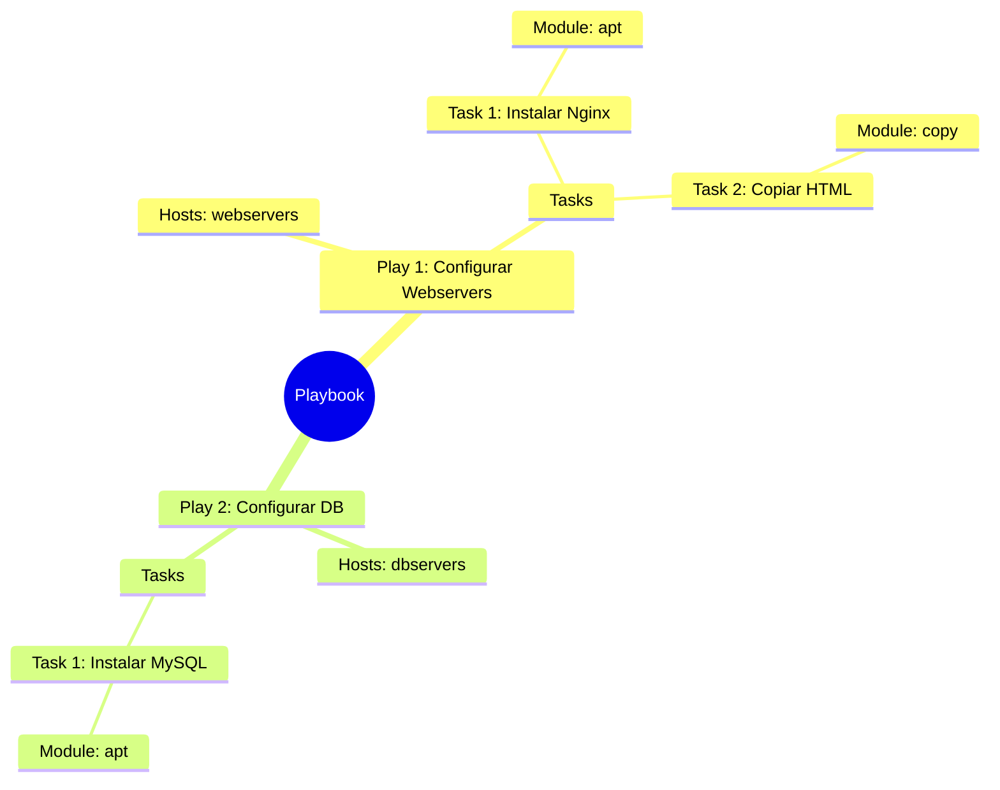

# Playbooks y YAML 📜

El corazón de Ansible: definir el estado deseado de tu infraestructura.

:::info Video pendiente de grabación
:::

## 4.1. Sintaxis YAML: La Regla de Oro

YAML (YAML Ain't Markup Language) es el lenguaje que usa Ansible. Es famoso por ser legible para humanos, pero estricto con las máquinas.

### 🛒 La Analogía: La Lista de la Compra
Imagina una lista de la compra organizada por pasillos. No mezclas todo; agrupas las cosas para ser eficiente.

*   **Pasillo Frutería:**
    *   Manzanas
    *   Peras
*   **Pasillo Limpieza:**
    *   Lejía
    *   Jabón

En YAML, esta estructura visual es **obligatoria**.

### Diccionarios vs Listas

Hay dos estructuras clave que debes dominar:

1.  **Diccionarios (Mapas):** Pares `clave: valor`. Definen propiedades.
2.  **Listas (Arrays):** Elementos que empiezan con un guion `-`. Son colecciones.

```yaml
# Esto es un Diccionario (Propiedades de un coche)
coche:
  marca: Toyota
  modelo: Corolla
  color: Rojo

# Esto es una Lista (Cosas en el maletero)
maletero:
  - Rueda de repuesto
  - Gato hidráulico
  - Triángulos
```

### ⚠️ La Regla de Oro de la Indentación
En YAML, la jerarquía se define por la indentación (espacios a la izquierda).

> **NUNCA uses tabuladores (Tabs). Usa siempre ESPACIOS (generalmente 2 por nivel).**

#### ✅ BIEN (Espacios)
```yaml
hosts: webservers
tasks:
  - name: Instalar Nginx  # 2 espacios de indentación
    apt:                  # 4 espacios
      name: nginx         # 6 espacios
```

#### ❌ MAL (Tabs o mezcla)
```yaml
hosts: webservers
tasks:
	- name: Instalar Nginx  # <--- ¡ERROR! Tabulador detectado
    apt:
      name: nginx
```
*Si mezclas tabs y espacios, Ansible te odiará y el Playbook fallará.*

---

## 4.2. Estructura de un Playbook

Un **Playbook** es el archivo donde orquestamos todo. Tiene una jerarquía estricta.

### 🎬 La Analogía: El Guion de Cine
*   **Playbook:** Es la película completa.
*   **Play:** Es una **Escena**. Ocurre en un lugar específico (un grupo de `hosts`) y tiene unos actores (tareas).
*   **Task:** Es una **Acción** concreta del guion ("El actor abre la puerta").
*   **Module:** Es la **Herramienta** usada para la acción (La puerta, el pomo).

### Jerarquía Visual



### Anatomía en Código

```yaml
# Playbook
- name: Play 1 - Configurar Servidores Web  # <-- PLAY
  hosts: webservers
  become: yes  # Usar sudo

  tasks:
    - name: Task 1 - Instalar paquete       # <-- TASK
      apt:                                  # <-- MODULE
        name: nginx
        state: present
```

---

## 4.3. Módulos Esenciales (Los 4 Fantásticos)

Ansible tiene miles de módulos, pero usarás estos 4 el 80% del tiempo.

### 1. Gestión de Paquetes (`apt` / `yum`)
Instala, actualiza o elimina software.

```yaml
- name: Instalar git
  apt:
    name: git
    state: present  # Opciones: present (instalar), absent (borrar), latest (actualizar)
```

### 2. Gestión de Archivos (`copy`)
Sube archivos desde tu máquina de control al servidor remoto.

```yaml
- name: Subir archivo de configuración
  copy:
    src: ./files/nginx.conf   # Origen (tu PC)
    dest: /etc/nginx/nginx.conf # Destino (Servidor remoto)
```

### 3. Gestión de Servicios (`service` / `systemd`)
Arranca, para o reinicia demonios.

```yaml
- name: Arrancar Nginx
  service:
    name: nginx
    state: started  # Opciones: started, stopped, restarted
    enabled: yes    # ¿Arrancar al inicio del sistema?
```

### 4. Gestión de Usuarios (`user`)
Crea o modifica usuarios del sistema.

```yaml
- name: Crear usuario deploy
  user:
    name: deploy
    shell: /bin/bash
    groups: sudo
```

### 💡 El Concepto de Idempotencia
Fíjate en el parámetro `state`. En Ansible no decimos "Instala esto", decimos "Asegúrate de que esto esté **presente**".
*   Si no está -> Lo instala.
*   Si ya está -> **No hace nada**.

Esto es **Idempotencia**: Puedes ejecutar el mismo Playbook 1000 veces, y el resultado final siempre será el mismo, sin romper nada.

---

## 4.4. Práctica: Tu Primer Servidor Web 🌍

Vamos a crear el "Hola Mundo" de la infraestructura: Un servidor web Nginx con una página personalizada.

### El Playbook (`site.yml`)

Crea un archivo llamado `site.yml` con este contenido:

```yaml
---
- name: Configurar mi Servidor Web
  hosts: all  # O el grupo que tengas en tu inventario
  become: yes # Necesitamos root para instalar cosas

  tasks:
    - name: 1. Instalar Nginx
      apt:
        name: nginx
        state: present
        update_cache: yes # Equivalente a apt-get update

    - name: 2. Crear página web personalizada
      copy:
        dest: /var/www/html/index.html
        content: |
          <h1>¡Hola desde Ansible! 🚀</h1>
          <p>Este servidor ha sido configurado automáticamente.</p>

    - name: 3. Asegurar que Nginx está corriendo
      service:
        name: nginx
        state: started
        enabled: yes
```

### Ejecución

Lanza el playbook:
```bash
ansible-playbook -i inventario.ini site.yml
```

### 🧪 Prueba de "Self-Healing" (Auto-curación)

1.  Entra al servidor y **borra** el archivo index: `rm /var/www/html/index.html`.
2.  ¡Oh no! La web ha desaparecido (error 403/404).
3.  **Vuelve a ejecutar el Playbook.**

Verás que Ansible detecta que el archivo falta (Changed: 1) y lo vuelve a crear. **Ha reparado el sistema automáticamente** para que coincida con tu definición de "estado deseado".
