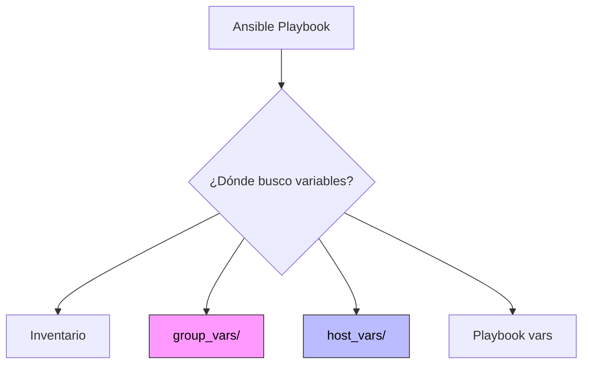

# Variables y facts 📊

Haciendo nuestros playbooks dinámicos y reutilizables.

:::info Video pendiente de grabación
:::

## Definición de variables

Las variables son la clave para escribir playbooks que funcionen en cualquier entorno (desarrollo, staging, producción) sin cambiar ni una línea de código.

### 🚫 La regla de oro: no hardcodear
Nunca escribas valores fijos (IPs, nombres de usuario, rutas) directamente en tus tareas. Si lo haces, tendrás que editar el Playbook cada vez que algo cambie.

### 📂 Estructura de carpetas: `group_vars` y `host_vars`
Ansible busca automáticamente variables en carpetas específicas. Esta es la forma profesional de organizar tus datos.



#### Estructura recomendada del proyecto:
```text
proyecto/
├── inventory.ini
├── playbook.yml
├── group_vars/
│   ├── all.yml          # Variables para TODOS los servidores
│   ├── servers.yml      # Variables solo para el grupo servers
│   └── barcelona.yml    # Variables solo para el grupo barcelona
└── host_vars/
    └── target1.yml      # Variables específicas para UN host
```

#### Ejemplo Práctico
**`group_vars/servers.yml`**:
```yaml
http_port: 80
doc_root: /var/www/html
```

**`playbook.yml`**:
```yaml
- hosts: servers
  tasks:
    - name: Configurar VirtualHost
      template:
        src: vhost.j2
        dest: "/etc/nginx/sites-available/default"
      # Usamos la variable {{ http_port }} en lugar de escribir 80
```


## Ansible Facts

Ansible no va a ciegas. Antes de ejecutar cualquier tarea, "interroga" al servidor para conocer su estado actual. Esta información se guarda en variables automáticas llamadas **Facts**.

### 🩺 La Analogía: El Chequeo Médico
Imagina que vas al médico. Antes de recetarte nada, la enfermera te toma la temperatura, la presión y el peso.
*   **Médico:** Ansible.
*   **Paciente:** Servidor.
*   **Signos Vitales:** Facts (IP, Sistema Operativo, Memoria RAM, Discos).

El médico (Ansible) usa esos datos para decidir el tratamiento (Playbook). Si eres alérgico a la penicilina (es un servidor RedHat), te dará otro medicamento (yum en vez de apt).

### Variables Mágicas Comunes
*   `ansible_os_family`: Debian, RedHat, Windows.
*   `ansible_processor_vcpus`: Número de CPUs.
*   `ansible_memtotal_mb`: Memoria total.
*   `ansible_default_ipv4.address`: Dirección IP principal.
*   `ansible_hostname`: Nombre del host.
*   `ansible_distribution`: Distribución específica (Ubuntu, CentOS, etc.).
*   `ansible_distribution_version`: Versión de la distribución.

### 🧪 Práctica: Playbook Inteligente (Cross-Platform)
Vamos a crear un Playbook que funcione tanto en Ubuntu (Debian) como en CentOS (RedHat) usando Facts y condicionales.

```yaml
- name: Instalar Servidor Web Inteligente
  hosts: all
  become: yes

  tasks:
    - name: Mostrar familia del SO
      debug:
        msg: "Este servidor es de la familia: {{ ansible_os_family }}"

    # Caso 1: Si es Debian/Ubuntu
    - name: Instalar Apache en Debian/Ubuntu
      apt:
        name: apache2
        state: present
      when: ansible_os_family == "Debian"

    # Caso 2: Si es RedHat/CentOS
    - name: Instalar Apache en RedHat/CentOS
      yum:
        name: httpd
        state: present
      when: ansible_os_family == "RedHat"
```


## Register: Capturando Resultados

La directiva `register` te permite capturar la salida de una tarea y guardarla en una variable para usarla después.

### 💾 ¿Para qué sirve?
*   Guardar el resultado de un comando shell.
*   Verificar si un servicio está corriendo.
*   Tomar decisiones basadas en salidas previas.

### Ejemplo Práctico
```yaml
- name: Ejemplo de Register
  hosts: localhost
  tasks:
    - name: Ejecutar comando y guardar resultado
      shell: uptime
      register: uptime_result

    - name: Mostrar el resultado
      debug:
        msg: "Tiempo de actividad: {{ uptime_result.stdout }}"

    - name: Verificar si un archivo existe
      stat:
        path: /etc/nginx/nginx.conf
      register: nginx_config

    - name: Tarea condicional según resultado
      debug:
        msg: "Nginx está configurado"
      when: nginx_config.stat.exists
```

### Estructura de una variable registrada
Una variable `register` contiene varios atributos útiles:
*   `stdout`: Salida estándar del comando.
*   `stderr`: Salida de error.
*   `rc`: Código de retorno (0 = éxito).
*   `changed`: Indica si hubo cambios.
*   `failed`: Indica si la tarea falló.


## Variables Especiales

Ansible proporciona variables especiales que siempre están disponibles:

### Variables de Inventario
*   `inventory_hostname`: Nombre del host según el inventario.
*   `inventory_hostname_short`: Nombre del host sin el dominio.
*   `inventory_dir`: Ruta del directorio del inventario.
*   `inventory_file`: Nombre del archivo de inventario.
*   `groups`: Diccionario con todos los grupos del inventario.
*   `group_names`: Lista de grupos a los que pertenece el host actual.

### Variables de Ansible
*   `ansible_check_mode`: True si se ejecuta en modo check (--check).
*   `ansible_play_hosts`: Lista de hosts en el play actual.
*   `ansible_version`: Información de la versión de Ansible.
*   `ansible_facts`: Diccionario con todos los facts recopilados.

### Ejemplo de Uso
```yaml
- name: Variables Especiales en Acción
  hosts: servers
  tasks:
    - name: Mostrar información del host
      debug:
        msg: |
          Host: {{ inventory_hostname }}
          Grupos: {{ group_names }}
          IP: {{ ansible_default_ipv4.address }}
          SO: {{ ansible_distribution }} {{ ansible_distribution_version }}

    - name: Listar todos los hosts del grupo
      debug:
        msg: "Hosts en servers: {{ groups['servers'] }}"
```


## Precedencia de Variables

¿Qué pasa si defines la variable `http_port` en el inventario, en `group_vars` y además la pasas por línea de comandos? ¿Cuál gana?

### 🏆 La Pirámide de Poder
Ansible tiene una jerarquía estricta. La regla general es: **"Lo más específico gana a lo más general"**.

```mermaid
graph BT
    A[1. Roles defaults] --> B[2. Inventory vars]
    B --> C[3. Inventory group_vars]
    C --> D[4. Inventory host_vars]
    D --> E[5. Playbook vars]
    E --> F[6. Extra vars (-e)]

    style F fill:#ff6b6b,stroke:#333,stroke-width:4px,color:white
    style A fill:#eee,stroke:#333,color:#000
```

### El Ranking (Simplificado)
1.  **Extra Vars (`-e`)**: ¡GANADOR ABSOLUTO! Sobrescribe todo.
2.  **Playbook Vars**: Variables definidas dentro del archivo `.yml`.
3.  **Host Vars**: Variables específicas de un host (`host_vars/`).
4.  **Group Vars**: Variables de grupo (`group_vars/`).
5.  **Defaults**: Valores por defecto en roles (los más débiles).

### 🥊 Ejemplo de Conflicto

**1. En `group_vars/servers.yml`:**
```yaml
http_port: 80
```

**2. En `playbook.yml`:**
```yaml
vars:
  http_port: 8080
```

**3. Ejecución en terminal:**
```bash
ansible-playbook site.yml -e "http_port=9090"
```

**Resultado Final:**
El puerto será **9090**.
*   ¿Por qué? Porque `-e` (Extra Vars) tiene la máxima prioridad.
*   Si no hubiéramos usado `-e`, sería **8080** (Playbook gana a Group).
*   Si borramos la variable del Playbook, sería **80** (Group vars).

### Resumen
Entender la precedencia te evitará horas de depuración preguntándote "¿Por qué no cambia este valor?". Usa `group_vars` para lo general, `host_vars` para excepciones, y `-e` solo para pruebas rápidas o overrides manuales en tiempo de ejecución.

## Condicionales con `when`

Las variables sin condicionales son listas de la compra; las condicionales convierten un playbook en un programa que **decide qué hacer en cada host**. La directiva clave es `when`.

### Sintaxis básica

```yaml
- name: Instalar Apache solo en Debian/Ubuntu
  ansible.builtin.apt:
    name: apache2
    state: present
  when: ansible_os_family == "Debian"

- name: Instalar Apache en RedHat/CentOS
  ansible.builtin.dnf:
    name: httpd
    state: present
  when: ansible_os_family == "RedHat"
```

> ⚠️ **No uses `{{ }}` dentro de `when`**. La expresión ya se evalúa como Jinja2: escribe `when: variable == "valor"`, no `when: "{{ variable }} == 'valor'"`.

### Operadores y combinaciones

```yaml
# AND
when: ansible_distribution == "Ubuntu" and ansible_distribution_major_version == "22"

# OR (lista implícita = AND, así que para OR usa la palabra clave)
when: ansible_os_family == "Debian" or ansible_os_family == "RedHat"

# Negación
when: not app_is_installed

# Tests Jinja2 (defined, undefined, in, match...)
when: backup_dir is defined
when: "'nginx' in installed_packages"
when: hostname is match("^web-.*")
```

### Condicionales sobre el resultado de tareas anteriores

`register` (que ya viste en 6.3) se combina con `when` para encadenar lógica:

```yaml
- name: Comprobar si Docker está instalado
  ansible.builtin.command: which docker
  register: docker_check
  failed_when: false       # No fallar si no existe
  changed_when: false      # No marcarlo como "changed"

- name: Instalar Docker si falta
  ansible.builtin.apt:
    name: docker.io
    state: present
  when: docker_check.rc != 0
```

### Condicionales por host (`group_names`, `inventory_hostname`)

```yaml
- name: Configurar firewall en hosts de producción
  ansible.builtin.iptables:
    chain: INPUT
    source: 10.0.0.0/8
    jump: ACCEPT
  when: "'servers' in group_names"
```

## Bucles con `loop`

Cuando necesitas repetir una tarea con datos distintos, usas un bucle. Ansible ofrece tres formas: la moderna (`loop`) y dos legacy (`with_items`, `with_dict`) que aún verás en código antiguo.

### `loop` simple

```yaml
- name: Crear varios usuarios
  ansible.builtin.user:
    name: "{{ item }}"
    state: present
    groups: developers
  loop:
    - alice
    - bob
    - charlie
```

### `loop` con diccionarios

```yaml
- name: Crear usuarios con shell específica
  ansible.builtin.user:
    name: "{{ item.name }}"
    shell: "{{ item.shell }}"
    groups: "{{ item.groups }}"
  loop:
    - { name: alice,   shell: /bin/zsh,  groups: ['admins'] }
    - { name: bob,     shell: /bin/bash, groups: ['devs'] }
    - { name: charlie, shell: /bin/fish, groups: ['devs', 'qa'] }
```

### Control del bucle: `loop_control`

```yaml
- name: Instalar paquetes con etiquetas legibles
  ansible.builtin.apt:
    name: "{{ pkg.name }}"
    state: "{{ pkg.state }}"
  loop:
    - { name: nginx, state: present }
    - { name: apache2, state: absent }
  loop_control:
    loop_var: pkg                    # renombra "item" a "pkg"
    label: "{{ pkg.name }}"          # qué mostrar en la salida
    pause: 2                         # segundos entre iteraciones
    index_var: idx                   # contador disponible como {{ idx }}
```

### Bucles anidados (`subelements`, `product`)

```yaml
# Asignar varias claves SSH a varios usuarios
- name: Add SSH keys
  ansible.posix.authorized_key:
    user: "{{ item.0.name }}"
    key: "{{ item.1 }}"
  loop: "{{ users | subelements('keys') }}"
  vars:
    users:
      - name: alice
        keys:
          - ssh-ed25519 AAAA...alice-laptop
          - ssh-ed25519 AAAA...alice-yubikey
      - name: bob
        keys:
          - ssh-ed25519 AAAA...bob-laptop
```

### Reintentos con `until` / `retries` / `delay`

Útil para esperar a que un servicio esté listo:

```yaml
- name: Esperar a que la API responda
  ansible.builtin.uri:
    url: http://localhost:8080/health
    status_code: 200
  register: health
  until: health.status == 200
  retries: 30
  delay: 5
```

> 💡 **Pro tip**: cuando combines `loop` y `register`, el resultado es una lista en `results[]`. Itéralo con un segundo `loop` o filtros (`map`, `selectattr`) para tomar decisiones.

## Handlers: reaccionar a cambios

Un **handler** es una tarea especial que **sólo se ejecuta cuando otra tarea reporta un cambio** (`changed`). Se ejecuta una sola vez por play, al final, aunque hayan sido notificados varias veces. Es la forma idiomática en Ansible de decir "*si cambió la config, recarga el servicio*".

### La analogía: el botón del timbre

Imagina que llamas al timbre cinco veces seguidas: el portero **no abre la puerta cinco veces**. La abre una vez al final, cuando termina su tarea actual. Eso es un handler: lo notificas tantas veces como haga falta y se dispara una única vez al final del play.

### Estructura básica

```yaml
- name: Configurar Nginx
  hosts: servers
  become: true

  tasks:
    - name: Copiar fichero de configuración
      ansible.builtin.template:
        src: nginx.conf.j2
        dest: /etc/nginx/nginx.conf
      notify: Reload nginx           # 👈 nombre del handler

    - name: Copiar virtual host
      ansible.builtin.template:
        src: site.conf.j2
        dest: /etc/nginx/conf.d/site.conf
      notify: Reload nginx           # mismo handler, sólo correrá una vez

  handlers:
    - name: Reload nginx
      ansible.builtin.service:
        name: nginx
        state: reloaded
```

### Notificar varios handlers

```yaml
tasks:
  - name: Actualizar configuración
    ansible.builtin.template:
      src: app.conf.j2
      dest: /etc/app/app.conf
    notify:
      - Restart app
      - Notify Slack

handlers:
  - name: Restart app
    ansible.builtin.service: { name: app, state: restarted }

  - name: Notify Slack
    ansible.builtin.uri:
      url: "{{ slack_webhook }}"
      method: POST
      body_format: json
      body: { text: "App reiniciada en {{ inventory_hostname }}" }
```

### Forzar la ejecución antes del final del play

Por defecto los handlers corren al final del play. Si necesitas que corran **ahora** (por ejemplo, recargar antes de seguir):

```yaml
- name: Aplicar cambios pendientes
  ansible.builtin.meta: flush_handlers
```

### Handlers que escuchan a varios eventos (`listen`)

```yaml
tasks:
  - name: Modificar TLS
    ansible.builtin.copy:
      src: cert.pem
      dest: /etc/ssl/cert.pem
    notify: "tls config changed"

handlers:
  - name: Reload nginx
    ansible.builtin.service: { name: nginx, state: reloaded }
    listen: "tls config changed"

  - name: Reload haproxy
    ansible.builtin.service: { name: haproxy, state: reloaded }
    listen: "tls config changed"
```

### Buenas prácticas con handlers

- **Nombres claros y únicos** dentro del play. Evita colisiones.
- **Idempotentes**: un handler debe poder lanzarse cero o una vez sin romper nada.
- **No abuses**: si una tarea siempre debe correr, ponla como tarea normal, no como handler.
- **Cuidado con `--check`**: en modo dry-run los handlers no se ejecutan, sólo se marcan como notificados.
- **Si el play falla antes del final**, los handlers pendientes **no se ejecutan** (a menos que uses `--force-handlers` o `force_handlers: true`).

## ✅ Resumen del capítulo

- **Variables**: data que hace dinámicos a tus playbooks (`vars`, `vars_files`, `group_vars`, `host_vars`, `-e`).
- **Facts**: información autodescubierta de cada host. Cárgala con `gather_facts` o `setup`.
- **Register**: captura el resultado de una tarea para usarlo después.
- **Precedencia**: extra-vars → playbook → host → group → defaults.
- **`when`**: ejecuta una tarea sólo si se cumple la condición.
- **`loop`**: itera con listas, dicts o estructuras anidadas.
- **Handlers**: reaccionan a cambios (`notify`) y se ejecutan una sola vez al final del play.

Con estas piezas tu playbook deja de ser un script lineal y se convierte en lógica reactiva. En el próximo capítulo veremos cómo organizar todo esto en **roles** reutilizables.
