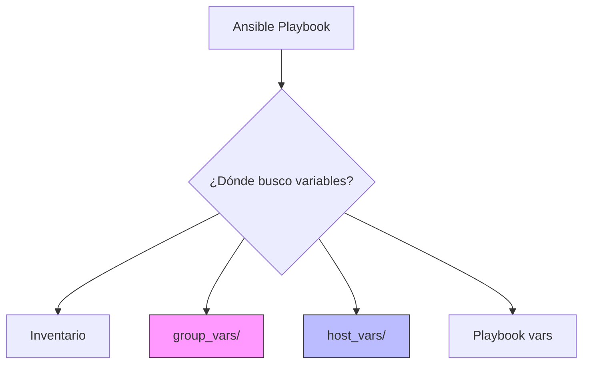

# Variables y Facts 📊

Haciendo nuestros playbooks dinámicos y reutilizables.

:::info Video pendiente de grabación
:::

## 5.1. Definición de Variables

Las variables son la clave para escribir Playbooks que funcionen en cualquier entorno (Desarrollo, Staging, Producción) sin cambiar ni una línea de código.

### 🚫 La Regla de Oro: No Hardcodear
Nunca escribas valores fijos (IPs, nombres de usuario, rutas) directamente en tus tareas. Si lo haces, tendrás que editar el Playbook cada vez que algo cambie.

### 📂 Estructura de Carpetas: `group_vars` y `host_vars`
Ansible busca automáticamente variables en carpetas específicas. Esta es la forma profesional de organizar tus datos.



#### Estructura recomendada del proyecto:
```text
proyecto/
├── inventory.ini
├── playbook.yml
├── group_vars/
│   ├── all.yml          # Variables para TODOS los servidores
│   ├── webservers.yml   # Variables solo para el grupo webservers
│   └── dbservers.yml    # Variables solo para el grupo dbservers
└── host_vars/
    └── web01.empresa.com.yml  # Variables específicas para UN host
```

#### Ejemplo Práctico
**`group_vars/webservers.yml`**:
```yaml
http_port: 80
doc_root: /var/www/html
```

**`playbook.yml`**:
```yaml
- hosts: webservers
  tasks:
    - name: Configurar VirtualHost
      template:
        src: vhost.j2
        dest: "/etc/nginx/sites-available/default"
      # Usamos la variable {{ http_port }} en lugar de escribir 80
```

---

## 5.2. Ansible Facts

Ansible no va a ciegas. Antes de ejecutar cualquier tarea, "interroga" al servidor para conocer su estado actual. Esta información se guarda en variables automáticas llamadas **Facts**.

### 🩺 La Analogía: El Chequeo Médico
Imagina que vas al médico. Antes de recetarte nada, la enfermera te toma la temperatura, la presión y el peso.
*   **Médico:** Ansible.
*   **Paciente:** Servidor.
*   **Signos Vitales:** Facts (IP, Sistema Operativo, Memoria RAM, Discos).

El médico (Ansible) usa esos datos para decidir el tratamiento (Playbook). Si eres alérgico a la penicilina (es un servidor RedHat), te dará otro medicamento (yum en vez de apt).

### Variables Mágicas Comunes
*   `ansible_os_family`: Debian, RedHat, Windows.
*   `ansible_processor_vcpus`: Número de CPUs.
*   `ansible_memtotal_mb`: Memoria total.
*   `ansible_default_ipv4.address`: Dirección IP principal.

### 🧪 Práctica: Playbook Inteligente (Cross-Platform)
Vamos a crear un Playbook que funcione tanto en Ubuntu (Debian) como en CentOS (RedHat) usando Facts y condicionales.

```yaml
- name: Instalar Servidor Web Inteligente
  hosts: all
  become: yes

  tasks:
    - name: Mostrar familia del SO
      debug:
        msg: "Este servidor es de la familia: {{ ansible_os_family }}"

    # Caso 1: Si es Debian/Ubuntu
    - name: Instalar Apache en Debian/Ubuntu
      apt:
        name: apache2
        state: present
      when: ansible_os_family == "Debian"

    # Caso 2: Si es RedHat/CentOS
    - name: Instalar Apache en RedHat/CentOS
      yum:
        name: httpd
        state: present
      when: ansible_os_family == "RedHat"
```

---

## 5.3. Precedencia de Variables

¿Qué pasa si defines la variable `http_port` en el inventario, en `group_vars` y además la pasas por línea de comandos? ¿Cuál gana?

### 🏆 La Pirámide de Poder
Ansible tiene una jerarquía estricta. La regla general es: **"Lo más específico gana a lo más general"**.

```mermaid
graph BT
    A[1. Roles defaults] --> B[2. Inventory vars]
    B --> C[3. Inventory group_vars]
    C --> D[4. Inventory host_vars]
    D --> E[5. Playbook vars]
    E --> F[6. Extra vars (-e)]
    
    style F fill:#ff6b6b,stroke:#333,stroke-width:4px,color:white
    style A fill:#eee,stroke:#333
```

### El Ranking (Simplificado)
1.  **Extra Vars (`-e`)**: ¡GANADOR ABSOLUTO! Sobrescribe todo.
2.  **Playbook Vars**: Variables definidas dentro del archivo `.yml`.
3.  **Host Vars**: Variables específicas de un host (`host_vars/`).
4.  **Group Vars**: Variables de grupo (`group_vars/`).
5.  **Defaults**: Valores por defecto en roles (los más débiles).

### 🥊 Ejemplo de Conflicto

**1. En `group_vars/webservers.yml`:**
```yaml
http_port: 80
```

**2. En `playbook.yml`:**
```yaml
vars:
  http_port: 8080
```

**3. Ejecución en terminal:**
```bash
ansible-playbook site.yml -e "http_port=9090"
```

**Resultado Final:**
El puerto será **9090**.
*   ¿Por qué? Porque `-e` (Extra Vars) tiene la máxima prioridad.
*   Si no hubiéramos usado `-e`, sería **8080** (Playbook gana a Group).
*   Si borramos la variable del Playbook, sería **80** (Group vars).

### Resumen
Entender la precedencia te evitará horas de depuración preguntándote "¿Por qué no cambia este valor?". Usa `group_vars` para lo general, `host_vars` para excepciones, y `-e` solo para pruebas rápidas o overrides manuales en tiempo de ejecución.
