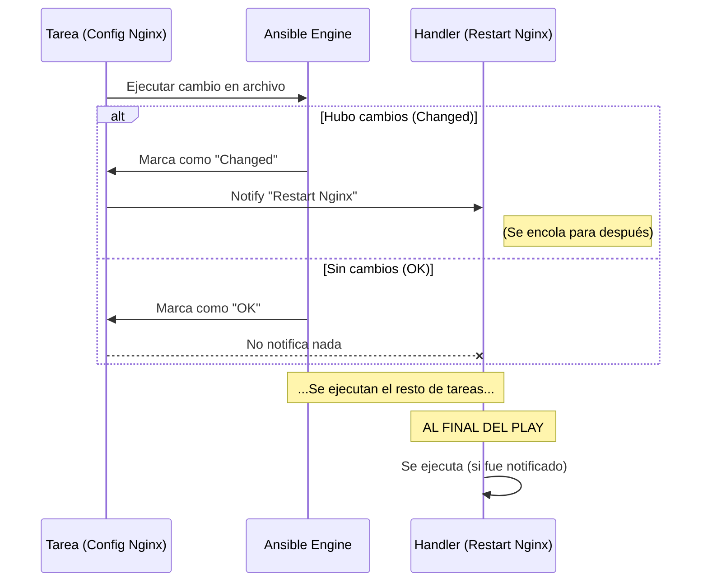

# Lógica de control 🔀

Añadiendo inteligencia a nuestras automatizaciones.

:::info Video pendiente de grabación
:::

## 6.1. Condicionales (`when`)

A veces quieres que una tarea se ejecute solo en circunstancias específicas. Para esto usamos la cláusula `when`.

### 🚪 La analogía: el portero de discoteca
Imagina un portero en la entrada de un club. No deja pasar a todo el mundo; evalúa condiciones:
*   ¿Llevas zapatillas? -> **No pasas** (Skipped).
*   ¿Llevas zapatos? -> **Pasas** (Executed).

En Ansible, el portero es `when`.

### Flujo de decisión

```mermaid
flowchart TD
    A[Inicio Tarea] --> B{¿Condición Cumplida?}
    B -- Sí (True) --> C[Ejecutar Tarea]
    B -- No (False) --> D[Saltar Tarea \n(Skipped)]
    C --> E[Siguiente Tarea]
    D --> E
    
    style B fill:#f9f,stroke:#333
    style D fill:#ccc,stroke:#333,stroke-dasharray: 5 5
```

### 🧪 Práctica: decisión por sistema operativo
El caso de uso más común: instalar paquetes con el gestor adecuado según la distribución de Linux.

```yaml
tasks:
  - name: Instalar Apache en Debian/Ubuntu
    apt:
      name: apache2
      state: present
    when: ansible_os_family == "Debian"

  - name: Instalar Apache en RedHat/CentOS
    yum:
      name: httpd
      state: present
    when: ansible_os_family == "RedHat"
```

También puedes combinar condiciones con `and` y `or`:
```yaml
when: ansible_os_family == "Debian" and ansible_memtotal_mb > 1024
```

---

## 6.2. Bucles (`loop`)

En programación existe el principio **DRY (Don't Repeat Yourself)**. En lugar de escribir 5 tareas idénticas para crear 5 usuarios, escribimos una sola tarea que se repite 5 veces.

### 🏭 La Analogía: La Cadena de Montaje
Imagina un brazo robótico en una fábrica de botellas.
*   **Mal método:** Tienes 5 robots, cada uno pone un tapón a una sola botella.
*   **Buen método (Bucle):** Tienes 1 robot que repite la acción "poner tapón" mientras pasen botellas por la cinta.

### Sintaxis Moderna: `loop` vs `with_items`
Antiguamente se usaba `with_items`. Aunque lo verás en muchos tutoriales viejos, **la forma moderna y recomendada es `loop`**.

### 🧪 Práctica 1: Lista Simple
Instalar múltiples paquetes en una sola pasada.

```yaml
- name: Instalar herramientas esenciales
  apt:
    name: "{{ item }}"
    state: present
  loop:
    - git
    - curl
    - vim
    - htop
```
*Nota: La variable mágica `{{ item }}` representa el valor actual de la iteración.*

### 🧪 Práctica 2: Lista de Diccionarios (Complejo)
Crear usuarios con diferentes atributos.

```yaml
- name: Crear usuarios desarrolladores
  user:
    name: "{{ item.nombre }}"
    groups: "{{ item.grupo }}"
    shell: /bin/bash
  loop:
    - { nombre: 'ana', grupo: 'admin' }
    - { nombre: 'pablo', grupo: 'devops' }
    - { nombre: 'luis', grupo: 'developers' }
```

---

## 6.3. Handlers (Manejadores de Eventos)

Los Handlers son tareas especiales que **solo se ejecutan si son notificadas**. Son ideales para reiniciar servicios cuando cambia un archivo de configuración.

### 🚨 La Analogía: La Alarma de Incendios
Una alarma de incendios no está sonando todo el día (eso sería molesto y rompería el servicio).
*   La alarma está "a la espera" (Handler).
*   Solo suena SI el sensor de humo detecta fuego (Change + Notify).
*   Si no hay fuego, la alarma sigue en silencio.

### Características Clave
1.  **Son perezosos:** Solo actúan si una tarea tiene estado `changed`.
2.  **Se ejecutan al final:** Por defecto, esperan a que termine todo el Play para ejecutarse (para evitar reiniciar Apache 5 veces si cambiaste 5 archivos; solo se reinicia una vez al final).

### Flujo de Ejecución



### 🧪 Práctica: Configuración de Nginx

```yaml
tasks:
  - name: Copiar configuración de Nginx
    template:
      src: nginx.conf.j2
      dest: /etc/nginx/nginx.conf
    notify: Reiniciar Nginx  # <--- El disparador

  - name: Otra tarea cualquiera
    debug:
      msg: "Haciendo otras cosas..."

handlers:  # <--- Sección separada al final
  - name: Reiniciar Nginx
    service:
      name: nginx
      state: restarted
```

**Escenario:**
1.  Ejecutas el Playbook. El archivo cambia. Se notifica al Handler.
2.  Se ejecuta la tarea de debug.
3.  Termina el Play. **Se reinicia Nginx.**
4.  Vuelves a ejecutar el Playbook inmediatamente. El archivo NO cambia (Idempotencia). **El Handler NO se ejecuta.**

## Resumen
Con **Conditionals**, **Loops** y **Handlers**, tus Playbooks dejan de ser simples listas de la compra y se convierten en programas inteligentes capaces de adaptarse al entorno y gestionar el ciclo de vida de tus servicios eficientemente.
