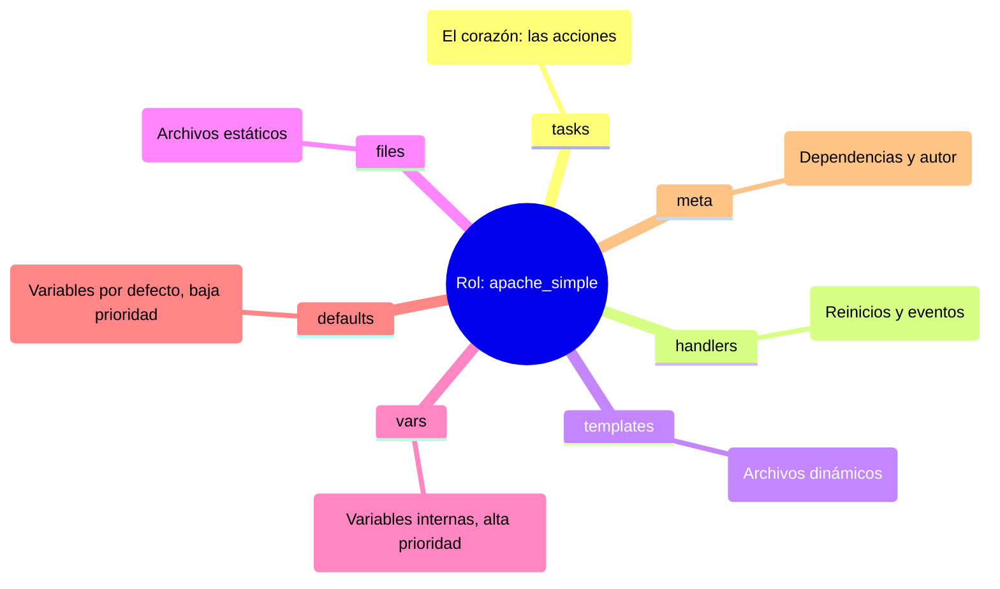
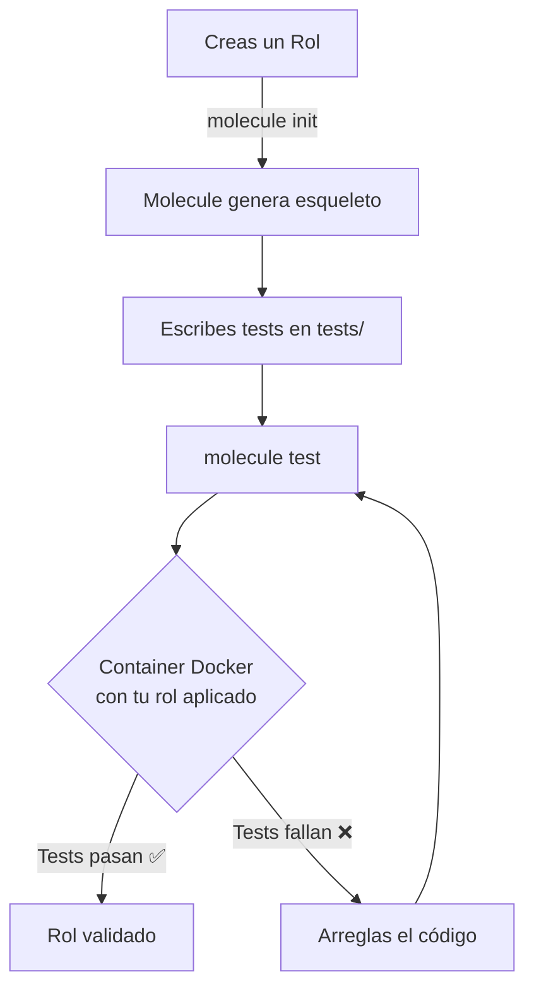
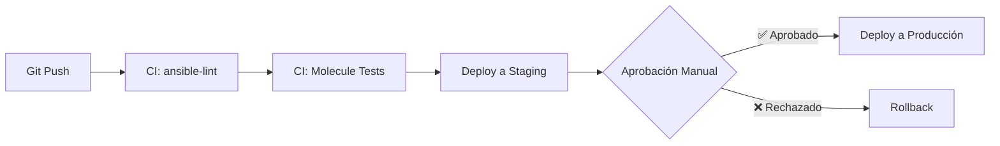

# Roles, Templates Jinja2 y Ansible Galaxy 📦

Hasta ahora has escrito playbooks lineales. Cuando un proyecto crece, esos ficheros se vuelven inmanejables. En este capítulo aprendes a **modularizar tu código** con roles, generar configuración dinámica con **Jinja2**, reutilizar trabajo de la comunidad con **Ansible Galaxy** y aplicar **buenas prácticas** que mantendrán tu repositorio sano a largo plazo.

## 📋 Contenido del capítulo

1. [Roles y modularidad](#roles-y-modularidad-) — Estructura de un rol, cómo crearlos y consumirlos.
2. [Templates con Jinja2](#templates-con-jinja2-) — Renderizado de configuración dinámica.
3. [Ansible Galaxy y Collections](#ansible-galaxy-y-collections-) — Compartir y consumir contenido de la comunidad.
4. [Buenas prácticas](#buenas-prácticas-) — Layout de proyecto, naming, tags y patrones recomendados.
5. [Include, Import y control avanzado](#include-import-y-control-avanzado-de-tareas-) — Cómo orquestar playbooks complejos.

:::tip Vídeo asociado
Este capítulo se corresponde con **un único vídeo** del [canal de YouTube](https://www.youtube.com/@Pabpereza). Es probablemente el capítulo más denso del curso: si lo necesitas, divídelo en dos sesiones.
:::

---


## Roles y modularidad 📦

Organiza tu código como un profesional usando la estructura de roles.

:::info Video pendiente de grabación
:::

### 7.1. Introducción: ¿por qué roles?

Hasta ahora, hemos escrito playbooks que son listas largas de tareas. Esto funciona bien para 10 o 20 tareas, pero ¿qué pasa cuando tienes 500? ¿O cuando quieres configurar Nginx en 10 proyectos diferentes?

#### 🍝 La analogía: código espagueti vs. librerías
Imagina un libro de 1000 páginas sin capítulos ni índice. Eso es un playbook gigante. Es difícil de leer, difícil de mantener y casi imposible de reutilizar.

Los **roles** son como las **"habilidades" en un videojuego**.
*   Tienes un personaje (servidor).
*   Quieres que sepa hacer magia (servidor web).
*   En lugar de enseñarle los movimientos uno a uno cada vez, le equipas el libro de hechizos "Mago de Fuego" (rol `webserver`).
*   ¡Pum! Ahora sabe lanzar bolas de fuego (instalar nginx, configurar vhosts, abrir puertos) automáticamente.

### 7.2. La estructura de un rol

Ansible espera una estructura de carpetas muy específica. Si la respetas, la magia ocurre sola (autoloading).

#### 🌳 Anatomía visual



#### Diccionario de carpetas
*   **`tasks/`**: Aquí van los módulos (`apt`, `copy`, `service`). Es lo que antes tenías en la sección `tasks:` del playbook.
*   **`handlers/`**: Los disparadores (`restart nginx`).
*   **`templates/`**: Tus archivos `.j2`.
*   **`files/`**: Archivos que se copian tal cual (certificados, imágenes).
*   **`defaults/`**: Variables con la prioridad **más baja**. Están hechas para ser sobrescritas fácilmente por el usuario del rol.
*   **`vars/`**: Variables con prioridad alta. Úsalas para constantes que rara vez cambian.
*   **`meta/`**: Metadatos del rol: información del autor, licencia y **dependencias** de otros roles.


### 7.3. Manos a la obra: creando tu primer rol

Vamos a refactorizar. Tomaremos el "código espagueti" de un servidor web y lo convertiremos en un rol elegante.

#### Paso 1: inicializar la estructura
Ansible tiene un comando para crear el esqueleto por ti:

```bash
ansible-galaxy init apache_simple
```

#### Paso 2: mover las piezas (refactorización)

Supongamos que tenías este playbook antiguo:

```yaml
# old_playbook.yml (espagueti) ❌
- hosts: webservers
  vars:
    http_port: 80
  tasks:
    - name: Instalar Apache
      apt: name=apache2 state=present
    - name: Copiar config
      template: src=templates/httpd.conf.j2 dest=/etc/apache2/httpd.conf
      notify: Reiniciar Apache
  handlers:
    - name: Reiniciar Apache
      service: name=apache2 state=restarted
```

Ahora, "descuartizamos" este archivo y ponemos cada cosa en su lugar dentro de la carpeta `apache_simple/`:

**1. `roles/apache_simple/tasks/main.yml`**
```yaml
- name: Instalar Apache
  apt:
    name: apache2
    state: present

- name: Copiar config
  template:
    src: httpd.conf.j2  # Nota: Ya no hace falta poner "templates/" delante
    dest: /etc/apache2/httpd.conf
  notify: Reiniciar Apache
```

**2. `roles/apache_simple/handlers/main.yml`**
```yaml
- name: Reiniciar Apache
  service:
    name: apache2
    state: restarted
```

**3. `roles/apache_simple/defaults/main.yml`**
```yaml
http_port: 80
```

#### Paso 3: el resultado final (limpio y profesional)

Tu playbook principal (`site.yml`) ahora queda así de minimalista:

```yaml
# site.yml (modular) ✅
- hosts: webservers
  roles:
    - apache_simple
```

¡De 15 líneas a 3! Y lo mejor: puedes usar `apache_simple` en cualquier otro proyecto simplemente copiando la carpeta.


### 7.4. Dependencias entre roles

Los roles pueden depender de otros roles. Por ejemplo, si tu rol `wordpress` necesita que primero esté instalado `mysql` y `php`, puedes declarar estas dependencias en el archivo `meta/main.yml`.

#### 🔗 Ejemplo de dependencias

**`roles/wordpress/meta/main.yml`**
```yaml
dependencies:
  - role: mysql
    vars:
      mysql_root_password: "secreto123"

  - role: php
    vars:
      php_version: "8.1"
```

#### ¿Cómo funciona?
1.  Cuando ejecutas el rol `wordpress`, Ansible primero ejecuta `mysql` y luego `php`.
2.  Los roles se ejecutan **solo una vez**, aunque múltiples roles los tengan como dependencia.
3.  Puedes pasar variables específicas a cada dependencia usando `vars:`.

#### Usar roles en playbooks con dependencias

```yaml
# site.yml
- hosts: webservers
  roles:
    - wordpress  # Automáticamente ejecutará mysql → php → wordpress
```

#### 💡 Buenas prácticas
*   **No abuses**: Si tienes 10 niveles de dependencias, algo está mal en tu diseño.
*   **Documenta**: Siempre indica en el README qué roles son prerequisitos.
*   **Versiona**: Si usas roles de Galaxy, fija las versiones en `requirements.yml`.


### 7.5. Ansible galaxy y collections

No reinventes la rueda. Probablemente alguien ya ha creado el rol perfecto para instalar Docker, Kubernetes o MySQL.

#### 🌌 Ansible galaxy (el "app store")
Es el repositorio oficial de contenido comunitario.

*   **Buscar roles:** `ansible-galaxy search elasticsearch`
*   **Instalar un rol:** `ansible-galaxy install geerlingguy.elasticsearch`

#### 📦 Content collections (el nuevo estándar)
Antiguamente, Galaxy solo tenía roles. Ahora, con la complejidad de la nube, usamos **collections**.
Una collection es un paquete que incluye: **roles + módulos + plugins**.

Por ejemplo, la collection `amazon.aws` incluye módulos para EC2, S3, Lambda, etc.

##### Comandos esenciales

```bash
# Instalar una colección
ansible-galaxy collection install amazon.aws

# Listar lo que tienes instalado
ansible-galaxy collection list
```

##### Usando collections en un playbook
```yaml
- hosts: localhost
  collections:
    - amazon.aws  # Declaramos que usaremos esta colección
  tasks:
    - name: Crear instancia EC2
      ec2_instance:  # Módulo que viene dentro de la colección
        instance_type: t2.micro
```

### Resumen
1.  **Divide y vencerás:** Usa roles para separar responsabilidades.
2.  **Estandariza:** Respeta la estructura de carpetas (`tasks`, `vars`, `templates`) para que cualquiera entienda tu código.
3.  **Reutiliza:** Antes de escribir código, busca en Ansible Galaxy. Si tienes que escribirlo, hazlo pensando en que sea un rol genérico para el futuro.
4.  **Declara dependencias:** Usa `meta/main.yml` para especificar qué roles necesita tu rol antes de ejecutarse.

## Templates con Jinja2 📝

Creación de archivos de configuración dinámicos y personalizados.

:::info Video pendiente de grabación
:::

### 8.1. ¿Por qué necesitamos templates?

Hasta ahora usábamos el módulo `copy` para subir archivos estáticos. Pero, ¿y si cada servidor necesita una configuración ligeramente diferente (su propia IP, su propio nombre, su propio entorno)?

#### 📝 La analogía: "Mad Libs" o carta modelo
Imagina una carta del banco. No escriben una carta nueva para cada cliente. Tienen una plantilla:

```jinja
Hola {{ nombre_cliente }}, su saldo actual es de {{ saldo }} euros.
```

Ansible usa **Jinja2** (el motor de plantillas de Python) para rellenar esos huecos justo antes de subir el archivo al servidor.

#### 🎯 Ventajas de los Templates
*   **Reutilización**: Una plantilla, miles de configuraciones diferentes.
*   **Mantenimiento**: Cambias la plantilla una vez y se actualiza en todos los servidores.
*   **Adaptabilidad**: Cada servidor recibe su configuración personalizada automáticamente.
*   **Variables Ansible**: Acceso directo a facts, variables de inventario y facts del sistema.


### 8.2. Sintaxis Básica de Jinja2

Jinja2 usa tres tipos de delimitadores especiales:

#### 📌 Tipos de Expresiones

1.  **`{{ variable }}`**: **Imprimir/Sustituir**
    ```jinja
    Servidor: {{ ansible_hostname }}
    IP: {{ ansible_default_ipv4.address }}
    ```

2.  **``**: **Lógica/Control de Flujo**
    ```jinja
    
        hacer algo
    

    
        {{ item }}
    
    ```

3.  **`{# comentario #}`**: **Comentarios** (no aparecen en el archivo final)
    ```jinja
    {# TODO: añadir validación de SSL #}
    ```

#### 🔗 Acceso a Variables Anidadas

```jinja
{# Diccionario anidado #}
{{ ansible_default_ipv4.address }}
{{ servidor.config.puerto }}

{# Listas #}
{{ usuarios[0] }}
{{ servidores_web[2].nombre }}
```


### 8.3. Variables en Templates

#### Variables de Ansible
Todas las variables definidas en tu playbook, inventario o roles están disponibles:

```yaml
# En tu playbook
vars:
  app_name: "MiApp"
  app_version: "2.1.0"
  app_port: 8080
```

```jinja
# En tu template
Aplicación: {{ app_name }}
Versión: {{ app_version }}
Puerto: {{ app_port }}
```

#### Facts del Sistema
Ansible recopila automáticamente información del servidor (facts):

```jinja
{# Información del sistema #}
Hostname: {{ ansible_hostname }}
FQDN: {{ ansible_fqdn }}
SO: {{ ansible_distribution }} {{ ansible_distribution_version }}
Arquitectura: {{ ansible_architecture }}

{# Red #}
IP Principal: {{ ansible_default_ipv4.address }}
Gateway: {{ ansible_default_ipv4.gateway }}
Interfaz: {{ ansible_default_ipv4.interface }}

{# Hardware #}
CPUs: {{ ansible_processor_vcpus }}
RAM Total: {{ ansible_memtotal_mb }} MB
```


### 8.4. Condicionales en Jinja2

#### If / Elif / Else

```jinja

    LogLevel warn
    DebugMode off

    LogLevel info
    DebugMode on

    LogLevel debug
    DebugMode on

```

#### Operadores Lógicos

```jinja
{# AND #}

    AllowFullAccess yes


{# OR #}

    EnableSSL yes


{# NOT #}

    ServerActive yes


{# IN #}

    IncludeNginxConfig yes

```


### 8.5. Bucles en Jinja2

#### For Loop Básico

```jinja
# Lista de servidores permitidos

allow {{ servidor }};

```

#### For con Diccionarios

```jinja

{{ nombre }} = {{ valor }}

```

#### For con Else (cuando la lista está vacía)

```jinja
<ul>

    <li>{{ user }}</li>

    <li>No hay usuarios configurados</li>

</ul>
```

#### Variables Especiales en Bucles

```jinja

    Índice: {{ loop.index }}     {# Comienza en 1 #}
    Índice0: {{ loop.index0 }}   {# Comienza en 0 #}
    ¿Es el primero?: {{ loop.first }}
    ¿Es el último?: {{ loop.last }}
    Longitud total: {{ loop.length }}

```


### 8.6. Filtros Útiles en Jinja2

Los filtros transforman variables. Se aplican con el símbolo `|` (pipe).

#### Filtros de Texto

```jinja
{# Mayúsculas/Minúsculas #}
{{ nombre | upper }}          → PABLO
{{ nombre | lower }}          → pablo
{{ nombre | capitalize }}     → Pablo
{{ titulo | title }}          → Mi Aplicación Web

{# Valores por defecto #}
{{ variable_opcional | default('valor_por_defecto') }}

{# Reemplazar #}
{{ ruta | replace('/home', '/usr') }}
```

#### Filtros de Listas

```jinja
{# Unir elementos #}
{{ ['web01', 'web02', 'web03'] | join(', ') }}
→ web01, web02, web03

{# Longitud #}
Total de servidores: {{ servidores | length }}

{# Primer/Último elemento #}
{{ servidores | first }}
{{ servidores | last }}

{# Ordenar #}
{{ numeros | sort }}
{{ nombres | sort(reverse=True) }}
```

#### Filtros de Números

```jinja
{# Matemáticas #}
{{ precio | round }}           → Redondear
{{ numero | abs }}             → Valor absoluto
{{ valor | int }}              → Convertir a entero
{{ valor | float }}            → Convertir a decimal
```

#### Filtros de Archivos/Rutas

```jinja
{{ '/etc/nginx/nginx.conf' | basename }}      → nginx.conf
{{ '/etc/nginx/nginx.conf' | dirname }}       → /etc/nginx
{{ 'archivo.txt' | splitext }}                → ['archivo', '.txt']
```

#### Filtros de Formato

```jinja
{# JSON #}
{{ diccionario | to_json }}
{{ diccionario | to_nice_json }}    {# Formateado #}

{# YAML #}
{{ configuracion | to_yaml }}
{{ configuracion | to_nice_yaml }}

{# Escapar HTML #}
{{ texto_usuario | escape }}
```


### 8.7. Práctica 1: Configuración de Nginx

Vamos a crear un template para configurar un virtual host de Nginx que se adapte a cada servidor.

#### **Template: `templates/nginx-vhost.conf.j2`**

```nginx
# Generado automáticamente por Ansible
# Servidor: {{ ansible_hostname }}
# Fecha: {{ ansible_date_time.date }}

server {
    listen {{ puerto_web | default(80) }};
    server_name {{ dominio }};

    root /var/www/{{ app_name }}/public;
    index index.html index.php;

    # Logs personalizados por entorno
    
    access_log /var/log/nginx/{{ app_name }}-access.log combined;
    error_log /var/log/nginx/{{ app_name }}-error.log warn;
    
    access_log /var/log/nginx/{{ app_name }}-access.log combined;
    error_log /var/log/nginx/{{ app_name }}-error.log debug;
    

    # IPs permitidas (generado desde lista)
    
    
    allow {{ ip }};
    
    deny all;
    

    location / {
        try_files $uri $uri/ =404;
    }

    # PHP solo en producción
    
    location ~ \.php$ {
        fastcgi_pass unix:/var/run/php-fpm.sock;
        fastcgi_index index.php;
        include fastcgi_params;
    }
    
}
```

#### **Playbook: `deploy-nginx.yml`**

```yaml
- name: Configurar Nginx
  hosts: webservers
  vars:
    app_name: miapp
    app_env: production
    dominio: www.ejemplo.com
    puerto_web: 80
    ips_permitidas:
      - 192.168.1.0/24
      - 10.0.0.1
    servicios:
      - nginx
      - php

  tasks:
    - name: Generar configuración de Nginx desde template
      template:
        src: templates/nginx-vhost.conf.j2
        dest: /etc/nginx/sites-available/{{ app_name }}.conf
        owner: root
        group: root
        mode: '0644'
      notify: Reiniciar Nginx

  handlers:
    - name: Reiniciar Nginx
      service:
        name: nginx
        state: restarted
```


### 8.8. Práctica 2: Página HTML Dinámica

Generemos una página de estado del servidor con información en tiempo real.

#### **Template: `templates/server-status.html.j2`**

```html
<!DOCTYPE html>
<html lang="es">
<head>
    <meta charset="UTF-8">
    <title>Estado de {{ ansible_hostname | upper }}</title>
    <style>
        body { font-family: Arial; margin: 40px; background: #f4f4f4; }
        .card { background: white; padding: 20px; margin: 10px 0; border-radius: 8px; }
        .prod { border-left: 5px solid red; }
        .dev { border-left: 5px solid green; }
        table { width: 100%; border-collapse: collapse; }
        td, th { padding: 10px; text-align: left; border-bottom: 1px solid #ddd; }
    </style>
</head>
<body>
    <h1>🖥️ Panel de Estado del Servidor</h1>

    <div class="card {{ 'prod' if app_env == 'production' else 'dev' }}">
        <h2>Información General</h2>
        <table>
            <tr><th>Hostname</th><td>{{ ansible_hostname }}</td></tr>
            <tr><th>FQDN</th><td>{{ ansible_fqdn }}</td></tr>
            <tr><th>IP Principal</th><td>{{ ansible_default_ipv4.address }}</td></tr>
            <tr><th>Entorno</th><td>{{ app_env | upper }}</td></tr>
            <tr><th>Última actualización</th><td>{{ ansible_date_time.date }} {{ ansible_date_time.time }}</td></tr>
        </table>
    </div>

    <div class="card">
        <h2>Sistema Operativo</h2>
        <table>
            <tr><th>Distribución</th><td>{{ ansible_distribution }} {{ ansible_distribution_version }}</td></tr>
            <tr><th>Kernel</th><td>{{ ansible_kernel }}</td></tr>
            <tr><th>Arquitectura</th><td>{{ ansible_architecture }}</td></tr>
        </table>
    </div>

    <div class="card">
        <h2>Hardware</h2>
        <table>
            <tr><th>CPUs</th><td>{{ ansible_processor_vcpus }}</td></tr>
            <tr><th>RAM Total</th><td>{{ (ansible_memtotal_mb / 1024) | round(2) }} GB</td></tr>
            <tr><th>Swap</th><td>{{ (ansible_swaptotal_mb / 1024) | round(2) }} GB</td></tr>
        </table>
    </div>

    <div class="card">
        <h2>Servicios Configurados</h2>
        <ul>
        
            <li>✅ {{ servicio | capitalize }}</li>
        
            <li>⚠️ No hay servicios configurados</li>
        
        </ul>
    </div>

    <div class="card">
        <h2>Interfaces de Red</h2>
        
            
            <p><strong>{{ interface }}:</strong>
            
                {{ ansible_facts[interface]['ipv4']['address'] }}
            
                Sin IP asignada
            
            </p>
            
        
    </div>

    <footer>
        <p style="text-align: center; color: #888; margin-top: 40px;">
            Generado automáticamente por Ansible el {{ ansible_date_time.iso8601 }}
        </p>
    </footer>
</body>
</html>
```

#### **Playbook: `deploy-status-page.yml`**

```yaml
- name: Desplegar Página de Estado
  hosts: webservers
  vars:
    app_env: "{{ lookup('env', 'APP_ENV') | default('development', true) }}"
    servicios_activos:
      - nginx
      - mysql
      - redis
      - php-fpm

  tasks:
    - name: Generar página de estado desde template
      template:
        src: templates/server-status.html.j2
        dest: /var/www/html/status.html
        owner: www-data
        group: www-data
        mode: '0644'
```


### 8.9. Práctica 3: Archivo de Configuración de Base de Datos

Configuración de MySQL adaptada a cada entorno.

#### **Template: `templates/mysql.cnf.j2`**

```ini
# MySQL Configuration for {{ ansible_hostname }}
# Environment: {{ db_env | upper }}
# Generated by Ansible on {{ ansible_date_time.iso8601 }}

[mysqld]
# Configuración básica
user = mysql
pid-file = /var/run/mysqld/mysqld.pid
socket = /var/run/mysqld/mysqld.sock
port = {{ mysql_port | default(3306) }}
datadir = /var/lib/mysql

# Ajuste de memoria según RAM disponible


    
    

    
    

    
    


innodb_buffer_pool_size = {{ buffer_pool }}M
max_connections = {{ max_connections }}

# Logs según entorno

# Producción: logs mínimos
log_error = /var/log/mysql/error.log
slow_query_log = 1
slow_query_log_file = /var/log/mysql/slow.log
long_query_time = 2

# Desarrollo: logs detallados
log_error = /var/log/mysql/error.log
general_log = 1
general_log_file = /var/log/mysql/general.log
slow_query_log = 1
slow_query_log_file = /var/log/mysql/slow.log
long_query_time = 0.5


# Replicación (solo en producción)

server-id = {{ ansible_default_ipv4.address.split('.')[-1] }}
log_bin = /var/log/mysql/mysql-bin.log
binlog_format = ROW

server-id = {{ ansible_default_ipv4.address.split('.')[-1] }}
relay-log = /var/log/mysql/relay-bin
read_only = 1


# Character set
character-set-server = utf8mb4
collation-server = utf8mb4_unicode_ci

[client]
port = {{ mysql_port | default(3306) }}
socket = /var/run/mysqld/mysqld.sock
default-character-set = utf8mb4
```

#### **Playbook: `configure-mysql.yml`**

```yaml
- name: Configurar MySQL
  hosts: databases
  vars:
    db_env: production
    mysql_port: 3306

  tasks:
    - name: Generar configuración de MySQL
      template:
        src: templates/mysql.cnf.j2
        dest: /etc/mysql/mysql.conf.d/custom.cnf
        owner: root
        group: root
        mode: '0644'
      notify: Reiniciar MySQL

  handlers:
    - name: Reiniciar MySQL
      service:
        name: mysql
        state: restarted
```


### 8.10. Resultado de la Ejecución

Cuando ejecutes estos playbooks, Ansible:

1.  **Leerá** el archivo `.j2` de la plantilla.
2.  **Recopilará** los facts del servidor destino (memoria, CPUs, IPs, etc.).
3.  **Evaluará** todas las expresiones Jinja2:
    *   Sustituirá `{{ variables }}`
    *   Ejecutará los `` y ``
    *   Aplicará los filtros `| upper`, `| round`, etc.
4.  **Generará** el archivo final personalizado para ese servidor específico.
5.  **Subirá** el archivo resultante al destino.

#### Ejemplo de Salida Real

Si tu servidor tiene:
*   Hostname: `web01`
*   RAM: 4096 MB
*   IP: `192.168.1.100`

La configuración de MySQL generada será:

```ini
# MySQL Configuration for web01
# Environment: PRODUCTION

[mysqld]
innodb_buffer_pool_size = 1024M
max_connections = 150
server-id = 100
log_bin = /var/log/mysql/mysql-bin.log
```


### 8.11. Buenas Prácticas

#### ✅ DO:
*   Usa extensión `.j2` para identificar templates.
*   Comenta las secciones complejas con `{# comentario #}`.
*   Usa filtros `| default()` para valores opcionales.
*   Valida el resultado con `--check` y `--diff`.
*   Usa `{{ variable | mandatory }}` para forzar que exista.

#### ❌ DON'T:
*   No pongas lógica de negocio compleja en templates (muévela al playbook).
*   No repitas código: usa includes o roles.
*   No olvides escapar datos de usuario con `| escape`.

#### 🧪 Validar Templates

```bash
# Ver qué cambiaría sin aplicarlo
ansible-playbook site.yml --check --diff

# Ver el archivo generado antes de subirlo
ansible -m template -a "src=template.j2 dest=/tmp/test.conf" localhost
```


### Resumen

Con **Jinja2**, tus configuraciones se adaptan elásticamente a cualquier entorno:
*   📝 **Variables** para personalización
*   🔀 **Condicionales** para lógica adaptativa
*    🔄 **Bucles** para repetición eficiente
*   🎨 **Filtros** para transformación de datos

Un solo template puede generar miles de configuraciones diferentes, manteniendo tu código **DRY** (Don't Repeat Yourself) y profesional.

## Ansible Galaxy y Collections 🌌

Aprende a reutilizar código de la comunidad y a compartir tus propios roles con el mundo.

:::info Video pendiente de grabación
:::

### 9.1. ¿Qué es Ansible Galaxy?

#### 🌟 La analogía: el "App Store" de Ansible
Imagina que necesitas configurar un servidor con Docker. Podrías escribir todas las tareas desde cero (instalar dependencias, añadir repositorios, configurar el daemon, etc.), o simplemente descargar un rol ya probado y mantenido por la comunidad.

**Ansible Galaxy** es el repositorio oficial donde miles de desarrolladores comparten roles, collections y plugins listos para usar.

#### 🎯 Ventajas de usar Galaxy
*   **Ahorro de tiempo**: No reinventes la rueda. Usa roles probados en producción.
*   **Calidad**: Los roles populares tienen miles de descargas y están bien mantenidos.
*   **Estandarización**: Aprende buenas prácticas viendo código de expertos.
*   **Comunidad**: Contribuye con mejoras y reporta bugs.

#### 🌐 Galaxy vs Collections
*   **Galaxy (tradicional)**: Repositorio de roles individuales.
*   **Collections (moderno)**: Paquetes que incluyen roles + módulos + plugins + documentación.


### 9.2. Buscando roles en Galaxy

#### 🔍 Búsqueda desde línea de comandos

```bash
# Buscar roles relacionados con "docker"
ansible-galaxy search docker

# Buscar con un término más específico
ansible-galaxy search mysql --author geerlingguy

# Ver detalles de un rol específico
ansible-galaxy info geerlingguy.docker
```

#### 📊 Output de ejemplo

```bash
$ ansible-galaxy search nginx

Found 523 roles matching your search:

 Name                          Description
 ----                          -----------
 geerlingguy.nginx            Nginx installation for Linux
 jdauphant.nginx              Install and configure nginx
 nginxinc.nginx               Official NGINX role
 ...
```

#### 🌐 Búsqueda en la web
La forma más cómoda es buscar en [galaxy.ansible.com](https://galaxy.ansible.com):

*   **Filtros**: Por plataforma (Ubuntu, CentOS, etc.), categoría, autor.
*   **Métricas**: Descargas, estrellas, fecha de última actualización.
*   **Documentación**: README, dependencias, versiones compatibles.

#### 💡 Criterios para elegir un buen rol

| Criterio | ¿Qué buscar? |
|----------|-------------|
| **Popularidad** | Más de 1000 descargas, estrellas altas |
| **Mantenimiento** | Última actualización reciente (< 6 meses) |
| **Compatibilidad** | Soporta tu distribución y versión de Ansible |
| **Documentación** | README completo con ejemplos |
| **Licencia** | Open source (MIT, Apache, BSD) |


### 9.3. Instalando roles desde Galaxy

#### 📥 Instalación básica

```bash
# Instalar un rol (se guarda en ~/.ansible/roles/)
ansible-galaxy install geerlingguy.docker

# Instalar en una ruta específica
ansible-galaxy install geerlingguy.nginx -p ./roles/

# Instalar una versión específica
ansible-galaxy install geerlingguy.mysql,3.4.0
```

#### 📦 Usando requirements.yml

Para proyectos profesionales, **nunca instales roles manualmente**. Usa un archivo `requirements.yml` para documentar todas las dependencias.

**`requirements.yml`**
```yaml
# Roles desde Galaxy
roles:
  - name: geerlingguy.docker
    version: 6.1.0

  - name: geerlingguy.nginx
    version: 3.1.4

  - name: geerlingguy.mysql
    version: 4.3.3

  - name: geerlingguy.redis
    version: 1.8.0

# Collections
collections:
  - name: community.general
    version: 8.1.0

  - name: ansible.posix
    version: 1.5.4

  - name: amazon.aws
    version: 7.1.0
```

#### 🚀 Instalación desde requirements.yml

```bash
# Instalar todos los roles y collections del archivo
ansible-galaxy install -r requirements.yml

# Forzar reinstalación (útil para actualizar)
ansible-galaxy install -r requirements.yml --force

# Instalar en ruta específica
ansible-galaxy install -r requirements.yml -p ./roles/
```

#### 🔗 Instalando desde Git

Puedes instalar roles directamente desde repositorios Git (GitHub, GitLab, etc.):

**`requirements.yml`**
```yaml
roles:
  # Desde GitHub
  - src: https://github.com/usuario/mi-rol.git
    name: mi_rol_custom
    version: main  # Branch, tag o commit

  # Desde GitLab
  - src: git@gitlab.com:empresa/rol-interno.git
    name: rol_interno
    scm: git

  # Desde Galaxy con nombre personalizado
  - src: geerlingguy.apache
    name: apache_role
    version: 3.2.0
```


### 9.4. Usando roles instalados en playbooks

Una vez instalados, los roles se usan como cualquier otro rol local:

#### 📝 Ejemplo: Playbook con roles de Galaxy

**`site.yml`**
```yaml
- name: Configurar servidor web con roles de Galaxy
  hosts: webservers
  become: yes

  vars:
    # Variables para geerlingguy.docker
    docker_users:
      - deployer
      - jenkins

    # Variables para geerlingguy.nginx
    nginx_vhosts:
      - listen: "80"
        server_name: "ejemplo.com www.ejemplo.com"
        root: "/var/www/ejemplo"

  roles:
    - geerlingguy.docker
    - geerlingguy.nginx
    - geerlingguy.certbot

  post_tasks:
    - name: Verificar que Docker está corriendo
      service:
        name: docker
        state: started
```

#### 🔧 Sobrescribiendo variables de roles

Los roles de Galaxy suelen tener muchas variables configurables. Revisa su documentación:

```bash
# Ver variables disponibles de un rol
cat ~/.ansible/roles/geerlingguy.docker/defaults/main.yml

# O en GitHub:
# https://github.com/geerlingguy/ansible-role-docker#role-variables
```

**Ejemplo de sobrescritura:**
```yaml
- hosts: servers
  roles:
    - role: geerlingguy.mysql
      vars:
        mysql_root_password: "secreto123"
        mysql_databases:
          - name: wordpress
            encoding: utf8mb4
        mysql_users:
          - name: wpuser
            password: "pass123"
            priv: "wordpress.*:ALL"
```


### 9.5. Collections: el nuevo estándar

#### 📦 ¿Qué es una Collection?

Una **collection** es un paquete que puede incluir:
*   **Roles**: Como los tradicionales
*   **Módulos**: Nuevas funcionalidades (`aws_ec2`, `docker_container`)
*   **Plugins**: Filtros, callbacks, inventarios
*   **Documentación**: Guías y ejemplos

#### 🌍 Collections oficiales importantes

| Collection | Descripción | Ejemplo de uso |
|-----------|-------------|----------------|
| `community.general` | Módulos generales de la comunidad | `timezone`, `snap`, `git_config` |
| `ansible.posix` | Herramientas POSIX/Unix | `mount`, `sysctl`, `firewalld` |
| `amazon.aws` | Servicios de AWS | `ec2`, `s3`, `rds`, `lambda` |
| `azure.azcollection` | Microsoft Azure | `azure_rm_virtualmachine` |
| `google.cloud` | Google Cloud Platform | `gcp_compute_instance` |
| `community.docker` | Gestión de Docker | `docker_container`, `docker_image` |
| `community.mysql` | Base de datos MySQL | `mysql_db`, `mysql_user` |
| `community.kubernetes` | Kubernetes/K8s | `k8s`, `helm` |

#### 📥 Instalando collections

```bash
# Instalar una collection
ansible-galaxy collection install community.general

# Instalar versión específica
ansible-galaxy collection install amazon.aws:7.1.0

# Instalar desde requirements.yml
ansible-galaxy collection install -r requirements.yml

# Listar collections instaladas
ansible-galaxy collection list

# Ver información de una collection
ansible-galaxy collection info community.docker
```

#### 🗂️ Ubicación de collections

Las collections se instalan en:
*   Sistema: `/usr/share/ansible/collections/`
*   Usuario: `~/.ansible/collections/ansible_collections/`
*   Proyecto: `./collections/ansible_collections/`

#### 📝 Usando collections en playbooks

**Opción 1: Declarar a nivel de play**
```yaml
- name: Gestionar AWS EC2
  hosts: localhost
  collections:
    - amazon.aws  # Todos los módulos de esta collection están disponibles

  tasks:
    - name: Crear instancia EC2
      ec2_instance:  # Módulo de amazon.aws
        name: servidor-web-01
        instance_type: t3.micro
        image_id: ami-0c55b159cbfafe1f0
        region: us-east-1
        key_name: mi-llave
        state: running
```

**Opción 2: Usar FQCN (Fully Qualified Collection Name)**
```yaml
- name: Gestionar Docker
  hosts: servidores
  tasks:
    - name: Crear contenedor Nginx
      community.docker.docker_container:  # FQCN completo
        name: nginx
        image: nginx:latest
        ports:
          - "80:80"
        state: started

    - name: Configurar timezone
      community.general.timezone:  # FQCN completo
        name: Europe/Madrid
```

**Recomendación**: Usa FQCN para evitar conflictos si dos collections tienen módulos con el mismo nombre.


### 9.6. Creando y publicando tu propio rol

#### 🛠️ Paso 1: Inicializar el rol

```bash
# Crear estructura del rol
ansible-galaxy init mi_rol_apache

# Estructura generada:
# mi_rol_apache/
# ├── README.md
# ├── defaults/
# │   └── main.yml
# ├── files/
# ├── handlers/
# │   └── main.yml
# ├── meta/
# │   └── main.yml
# ├── tasks/
# │   └── main.yml
# ├── templates/
# ├── tests/
# │   ├── inventory
# │   └── test.yml
# └── vars/
#     └── main.yml
```

#### 📝 Paso 2: Escribir el código del rol

**`tasks/main.yml`**
```yaml
- name: Instalar Apache
  apt:
    name: apache2
    state: present
    update_cache: yes

- name: Configurar virtual host
  template:
    src: vhost.conf.j2
    dest: "/etc/apache2/sites-available/{{ app_name }}.conf"
  notify: Reiniciar Apache

- name: Habilitar sitio
  file:
    src: "/etc/apache2/sites-available/{{ app_name }}.conf"
    dest: "/etc/apache2/sites-enabled/{{ app_name }}.conf"
    state: link
  notify: Reiniciar Apache
```

**`defaults/main.yml`**
```yaml
app_name: miapp
app_port: 80
app_root: /var/www/html
```

**`handlers/main.yml`**
```yaml
- name: Reiniciar Apache
  service:
    name: apache2
    state: restarted
```

#### 📄 Paso 3: Documentar en meta/main.yml

**`meta/main.yml`**
```yaml
galaxy_info:
  author: Tu Nombre
  description: Instalación y configuración de Apache
  company: Tu Empresa (opcional)
  license: MIT
  min_ansible_version: "2.14"

  platforms:
    - name: Ubuntu
      versions:
        - focal
        - jammy
    - name: Debian
      versions:
        - bullseye
        - bookworm

  galaxy_tags:
    - web
    - apache
    - httpd
    - webserver

dependencies: []  # Si tu rol necesita otros roles
```

#### ✍️ Paso 4: Escribir README.md completo

**`README.md`**
```markdown
# Rol Ansible: mi_rol_apache

Instala y configura Apache en servidores Ubuntu/Debian.

## Requisitos

- Ansible >= 2.14
- Ubuntu 20.04+ o Debian 11+

## Variables

| Variable | Default | Descripción |
|----------|---------|-------------|
| `app_name` | `miapp` | Nombre de la aplicación |
| `app_port` | `80` | Puerto de escucha |
| `app_root` | `/var/www/html` | Directorio raíz |

## Ejemplo de uso

```yaml
- hosts: webservers
  roles:
    - role: mi_rol_apache
      vars:
        app_name: sitio_ejemplo
        app_port: 8080
```

## Licencia

MIT

## Autor

Tu Nombre (@tu_usuario)
```

#### 🧪 Paso 5: Probar el rol localmente

```bash
# Ejecutar el test incluido
ansible-playbook tests/test.yml -i tests/inventory

# O crear un playbook de prueba
cat > test-rol.yml <<EOF
- hosts: localhost
  become: yes
  roles:
    - mi_rol_apache
EOF

ansible-playbook test-rol.yml
```

#### 📤 Paso 6: Publicar en Galaxy

**6.1. Subir a GitHub**
```bash
cd mi_rol_apache
git init
git add .
git commit -m "Versión inicial"
git remote add origin https://github.com/tu_usuario/ansible-role-apache.git
git push -u origin main

# Crear un tag de versión
git tag 1.0.0
git push origin 1.0.0
```

**6.2. Importar en Galaxy**
1. Ve a [galaxy.ansible.com](https://galaxy.ansible.com)
2. Inicia sesión con GitHub
3. Ve a "My Content" → "Add Content"
4. Selecciona tu repositorio `ansible-role-apache`
5. Galaxy importará automáticamente tu rol

**6.3. Actualizar versiones**
```bash
# Hacer cambios en el código
git add .
git commit -m "Añadida compatibilidad con SSL"
git tag 1.1.0
git push origin main --tags

# Galaxy detectará el nuevo tag automáticamente
```


### 9.7. Buenas prácticas con Galaxy

#### ✅ DO:

*   **Fija versiones en requirements.yml**: Evita sorpresas con actualizaciones.
*   **Lee el README antes de instalar**: Entiende qué hace el rol.
*   **Revisa el código**: Especialmente en roles con pocos downloads.
*   **Contribuye con issues y PRs**: Ayuda a mejorar los roles que usas.
*   **Usa FQCN en collections**: Mayor claridad y evita conflictos.

#### ❌ DON'T:

*   **No uses roles sin mantenimiento**: Busca alternativas activas.
*   **No instales sin probar primero**: Usa `--check` mode.
*   **No expongas credenciales**: Usa Ansible Vault para secretos.
*   **No dependas de un solo rol**: Ten un plan B si el autor lo abandona.

#### 🔒 Seguridad

```bash
# Verificar el código antes de ejecutar
cat ~/.ansible/roles/nombre_rol/tasks/main.yml

# Ejecutar en modo dry-run
ansible-playbook site.yml --check

# Limitar a un host de pruebas primero
ansible-playbook site.yml --limit test-server
```


### 9.8. Creando tu propia collection

#### 🎯 Cuándo crear una collection

Crea una collection cuando tengas:
*   Múltiples roles relacionados
*   Módulos personalizados
*   Plugins o filtros custom
*   Documentación extensa

#### 🛠️ Inicializar collection

```bash
# Crear estructura de collection
ansible-galaxy collection init mi_namespace.mi_collection

# Estructura generada:
# mi_namespace/
# └── mi_collection/
#     ├── README.md
#     ├── galaxy.yml        # Metadatos de la collection
#     ├── docs/
#     ├── plugins/
#     │   ├── modules/      # Tus módulos custom
#     │   ├── inventory/
#     │   ├── lookup/
#     │   └── filter/
#     ├── roles/            # Roles incluidos
#     └── playbooks/        # Playbooks de ejemplo
```

#### 📝 Configurar galaxy.yml

**`galaxy.yml`**
```yaml
namespace: mi_namespace
name: mi_collection
version: 1.0.0
readme: README.md
authors:
  - Tu Nombre <email@ejemplo.com>

description: Collection para gestión de infraestructura web

license:
  - MIT

tags:
  - web
  - infrastructure
  - automation

dependencies: {}

repository: https://github.com/tu_usuario/mi_collection
documentation: https://docs.ejemplo.com
homepage: https://ejemplo.com
issues: https://github.com/tu_usuario/mi_collection/issues
```

#### 📦 Build y publicar

```bash
# Construir la collection (crea un .tar.gz)
ansible-galaxy collection build

# Publicar en Galaxy (necesitas API key)
ansible-galaxy collection publish mi_namespace-mi_collection-1.0.0.tar.gz --api-key=TU_API_KEY

# Instalar localmente para pruebas
ansible-galaxy collection install ./mi_namespace-mi_collection-1.0.0.tar.gz
```


### 9.9. Ejemplo completo: proyecto con Galaxy

**Estructura del proyecto:**
```
mi-proyecto/
├── ansible.cfg
├── requirements.yml
├── inventory/
│   └── hosts.yml
├── group_vars/
│   └── all.yml
├── playbooks/
│   └── site.yml
└── roles/            # Roles locales custom
    └── mi_rol/
```

**`ansible.cfg`**
```ini
[defaults]
roles_path = ./roles:~/.ansible/roles
collections_path = ./collections:~/.ansible/collections
inventory = inventory/hosts.yml
```

**`requirements.yml`**
```yaml
roles:
  - name: geerlingguy.docker
    version: 6.1.0
  - name: geerlingguy.nginx
    version: 3.1.4

collections:
  - name: community.general
    version: 8.1.0
  - name: community.docker
    version: 3.4.11
```

**Workflow:**
```bash
# 1. Instalar dependencias
ansible-galaxy install -r requirements.yml

# 2. Ejecutar playbook
ansible-playbook playbooks/site.yml

# 3. Actualizar dependencias cuando sea necesario
ansible-galaxy install -r requirements.yml --force
```


### 9.10. Comandos de referencia rápida

```bash
# === ROLES ===
# Buscar roles
ansible-galaxy search <término>

# Instalar rol
ansible-galaxy install <autor>.<rol>

# Instalar desde requirements
ansible-galaxy install -r requirements.yml

# Listar roles instalados
ansible-galaxy list

# Eliminar rol
ansible-galaxy remove <autor>.<rol>

# Ver información de un rol
ansible-galaxy info <autor>.<rol>

# === COLLECTIONS ===
# Buscar collections
ansible-galaxy collection search <término>

# Instalar collection
ansible-galaxy collection install <namespace>.<collection>

# Listar collections instaladas
ansible-galaxy collection list

# Ver información
ansible-galaxy collection info <namespace>.<collection>

# === CREACIÓN ===
# Inicializar rol
ansible-galaxy init <nombre_rol>

# Inicializar collection
ansible-galaxy collection init <namespace>.<collection>

# Build collection
ansible-galaxy collection build

# Publicar collection
ansible-galaxy collection publish <archivo.tar.gz> --api-key=<KEY>
```


### Resumen

En este capítulo has aprendido:

✅ **Qué es Ansible Galaxy**: El repositorio oficial de contenido de la comunidad.
✅ **Buscar e instalar roles**: Cómo encontrar y usar roles de calidad.
✅ **Requirements.yml**: Gestión profesional de dependencias.
✅ **Collections**: El nuevo estándar que incluye roles, módulos y plugins.
✅ **Publicar tu contenido**: Comparte tus roles con la comunidad.
✅ **Buenas prácticas**: Seguridad, versiones fijas y documentación.

#### 💡 Puntos clave

1.  **No reinventes la rueda**: Usa roles de Galaxy cuando sea posible.
2.  **Fija versiones**: `requirements.yml` es tu mejor amigo.
3.  **Lee el código**: Especialmente de roles con pocos usuarios.
4.  **Contribuye**: Reporta bugs, envía PRs, mejora la comunidad.
5.  **Usa FQCN**: Claridad y compatibilidad a largo plazo.

**Próximo paso:** Optimización y mejores prácticas para proyectos grandes 🚀

## Buenas prácticas 🎯

Cómo escribir Ansible como un profesional: estructura, seguridad y calidad.

:::info Video pendiente de grabación
:::

### 10.1. Estructura de proyectos

#### 🏗️ El Problema: El Playbook Monolítico
Al principio, todos empezamos con un único archivo `site.yml` de 500 líneas. Funciona, pero es imposible de mantener. Es como tener toda tu ropa amontonada en el suelo en lugar de organizada en cajones.

#### 📂 La analogía: la biblioteca
Una biblioteca no tiene todos los libros apilados en el centro. Los organiza por:
*   **Género** (Roles: web, base de datos, monitoreo)
*   **Estanterías** (Inventarios: producción, desarrollo)
*   **Fichas** (Variables: por grupo, por host)

#### Estructura Recomendada por Red Hat

Esta es la estructura oficial que verás en el examen RHCE y en empresas serias:

```
ansible-project/
├── ansible.cfg                  # Configuración global del proyecto
├── inventory/
│   ├── production.ini          # Servidores de producción
│   ├── staging.ini             # Servidores de pruebas
│   └── group_vars/
│       ├── all.yml             # Variables para todos los hosts
│       ├── webservers.yml      # Variables específicas de webservers
│       └── all/
│           └── secrets.yml     # Secretos cifrados con Vault
├── roles/
│   ├── common/                 # Rol: Configuración base (SSH, usuarios)
│   │   ├── tasks/
│   │   │   └── main.yml
│   │   ├── handlers/
│   │   │   └── main.yml
│   │   ├── templates/
│   │   ├── files/
│   │   ├── vars/
│   │   └── defaults/
│   │       └── main.yml
│   ├── nginx/                  # Rol: Servidor web
│   └── postgresql/             # Rol: Base de datos
├── playbooks/
│   ├── site.yml                # Playbook maestro
│   ├── deploy-web.yml          # Playbook específico
│   └── backup.yml
├── collections/
│   └── requirements.yml        # Collections de Ansible Galaxy
├── .vault_pass                 # Contraseña del Vault (¡EN .GITIGNORE!)
├── .gitignore
└── README.md
```

#### 🧪 Práctica: Migrar de Playbook Simple a Estructura Profesional

**Antes (Playbook monolítico):**
```yaml
# site.yml (300 líneas)
- hosts: webservers
  tasks:
    - name: Instalar Nginx
      apt: name=nginx state=present
    - name: Copiar config
      copy: src=nginx.conf dest=/etc/nginx/
    # ... 50 tareas más ...
```

**Después (Estructura profesional):**
```yaml
# playbooks/site.yml (10 líneas)
- name: Configurar Infraestructura Completa
  hosts: all
  roles:
    - common

- name: Configurar Servidores Web
  hosts: webservers
  roles:
    - nginx
    - ssl_certificates

- name: Configurar Base de Datos
  hosts: dbservers
  roles:
    - postgresql
```

#### 💡 Beneficios
*   **Reutilización:** El rol `nginx` se puede usar en 10 proyectos diferentes.
*   **Testing:** Puedes probar cada rol de forma aislada con Molecule.
*   **Colaboración:** Cada miembro del equipo trabaja en un rol diferente sin colisiones.


### 10.2. Gestión de Secretos con Vault

Ya conoces Ansible Vault del capítulo anterior, pero aquí va la versión profesional.

#### 🔐 Regla de Oro: NUNCA encriptes todo el archivo

**❌ Mal:**
```yaml
# group_vars/all/vault.yml (TODO EL ARCHIVO CIFRADO)
db_password: "secreto123"
db_host: "localhost"
db_port: 5432
```

**Problema:** No puedes ver en Git qué cambió sin desencriptar. Los diffs son inútiles.

**✅ Bien:**
```yaml
# group_vars/all/vars.yml (PLANO, visible en Git)
db_host: "localhost"
db_port: 5432
db_password: "{{ vault_db_password }}"  # Referencia a la variable cifrada

# group_vars/all/vault.yml (SOLO SECRETOS)
vault_db_password: "secreto123"
```

#### 🎯 Patrón de Nomenclatura
*   Variables cifradas: prefijo `vault_`
*   Variables públicas: sin prefijo
*   En el código, siempre usa la pública (que apunta a la cifrada).

#### Rotación de Secretos
En producción, cambias contraseñas cada X meses.

```bash
# 1. Cambiar la contraseña maestra del Vault
ansible-vault rekey group_vars/all/vault.yml

# 2. Cambiar un secreto específico
ansible-vault edit group_vars/all/vault.yml
# (Editas solo la línea vault_db_password)
```


### 10.3. Idempotencia: la ley suprema

#### ⚖️ La definición
**Idempotencia:** Ejecutar algo 1 vez o 100 veces produce el mismo resultado final.

#### 🔄 La analogía: el interruptor de la luz
*   Si le das al interruptor cuando está apagado → se enciende.
*   Si le das al interruptor cuando YA está encendido → sigue encendido (no explota).
*   Da igual cuántas veces pulses: la luz acaba encendida.

#### 🚫 Código NO Idempotente
```yaml
- name: Añadir línea al archivo
  shell: echo "servidor web" >> /etc/motd
```

**Problema:** Cada ejecución añade otra línea. Tras 10 ejecuciones, tienes 10 líneas repetidas.

#### ✅ Código Idempotente
```yaml
- name: Asegurar que la línea existe (solo una vez)
  lineinfile:
    path: /etc/motd
    line: "servidor web"
    state: present
```

**Resultado:** Ansible comprueba si ya existe. Si está, no hace nada. Si no está, la añade. Ejecuta 1000 veces: sigue siendo UNA línea.

#### 🧪 Test de Idempotencia
Ejecuta tu playbook dos veces seguidas:

```bash
ansible-playbook site.yml --check  # Primera vez (modo prueba)
ansible-playbook site.yml          # Segunda vez
```

**Resultado esperado:**
*   Primera ejecución: `changed=10` (hizo cambios)
*   Segunda ejecución: `changed=0` (ya estaba todo configurado)

Si la segunda ejecución sigue cambiando cosas, **no es idempotente**.


### 10.4. Testing: ansible-lint y Molecule

#### 🔍 Ansible-lint: el corrector ortográfico

Es una herramienta que analiza tus playbooks buscando errores comunes y malas prácticas.

**Instalación:**
```bash
pip install ansible-lint
```

**Uso:**
```bash
ansible-lint playbooks/site.yml
```

**Ejemplo de errores que detecta:**
```yaml
# ❌ Mal: comando sin changed_when
- name: Reiniciar servicio
  command: systemctl restart nginx

# Ansible-lint dice: "command-instead-of-module: usa el módulo systemd"

# ✅ Bien:
- name: Reiniciar servicio
  systemd:
    name: nginx
    state: restarted
```

#### 🧪 Molecule: testing de roles en contenedores

Molecule es el framework de testing oficial de Ansible. Levanta un contenedor Docker, ejecuta tu rol y valida que funcione.

**Flujo de Trabajo:**



**Ejemplo de test:**
```python
# roles/nginx/molecule/default/tests/test_default.py
def test_nginx_is_installed(host):
    nginx = host.package("nginx")
    assert nginx.is_installed

def test_nginx_running_and_enabled(host):
    nginx = host.service("nginx")
    assert nginx.is_running
    assert nginx.is_enabled
```

**Ejecución:**
```bash
cd roles/nginx
molecule test
```

Molecule:
1.  Crea un contenedor
2.  Aplica el rol `nginx`
3.  Ejecuta los tests de Python
4.  Destruye el contenedor


### 10.5. Integración CI/CD

#### 🤖 Pipeline Completo

Este es el flujo estándar en empresas profesionales:



#### 🧪 Ejemplo: GitHub Actions

```yaml
# .github/workflows/ansible-ci.yml
name: Ansible CI/CD

on:
  pull_request:
    branches: [ main ]
  push:
    branches: [ main ]

jobs:
  lint:
    runs-on: ubuntu-latest
    steps:
      - uses: actions/checkout@v3
      - name: Instalar ansible-lint
        run: pip install ansible-lint
      - name: Ejecutar lint
        run: ansible-lint playbooks/

  test:
    runs-on: ubuntu-latest
    needs: lint  # Solo si el lint pasó
    steps:
      - uses: actions/checkout@v3
      - name: Instalar Molecule
        run: pip install molecule molecule-docker
      - name: Ejecutar tests
        run: |
          cd roles/nginx
          molecule test

  deploy-staging:
    runs-on: ubuntu-latest
    needs: test
    if: github.ref == 'refs/heads/main'
    steps:
      - uses: actions/checkout@v3
      - name: Configurar SSH
        run: |
          mkdir -p ~/.ssh
          echo "${{ secrets.SSH_KEY }}" > ~/.ssh/id_rsa
          chmod 600 ~/.ssh/id_rsa
      - name: Deploy
        run: |
          echo "${{ secrets.VAULT_PASS }}" > .vault_pass
          ansible-playbook -i inventory/staging.ini playbooks/site.yml \
            --vault-password-file .vault_pass
```

#### 🔒 Secretos en CI/CD
*   **GitHub Actions:** Usa "Secrets" en la configuración del repositorio.
*   **GitLab CI:** Variables de entorno protegidas.
*   **Jenkins:** Credentials Plugin.

**Nunca hardcodees claves en el archivo de CI.**


### 10.6. Documentación

#### 📚 Regla: Si no está documentado, no existe

Tu `README.md` debe responder:
1.  ¿Qué hace este proyecto?
2.  ¿Qué prerrequisitos necesito?
3.  ¿Cómo lo ejecuto?
4.  ¿Dónde están los secretos?

#### Plantilla de README

```markdown
# Proyecto Ansible: Infraestructura Web

## Descripción
Automatización completa de servidores web Nginx con SSL, balanceo de carga y monitoreo.

## Prerrequisitos
- Ansible 2.15+
- Python 3.9+
- Acceso SSH a los servidores (clave en `~/.ssh/id_rsa`)

## Estructura
- `inventory/production.ini`: Servidores de producción
- `roles/nginx/`: Configuración del servidor web
- `group_vars/all/vault.yml`: Secretos (cifrado con Vault)

## Ejecución

### 1. Configurar secretos
```bash
# Crear/editar el Vault
ansible-vault edit group_vars/all/vault.yml
```

### 2. Ejecutar en staging
```bash
ansible-playbook -i inventory/staging.ini playbooks/site.yml --ask-vault-pass
```

### 3. Ejecutar en producción (requiere aprobación)
```bash
ansible-playbook -i inventory/production.ini playbooks/site.yml --ask-vault-pass
```

## Testing
```bash
# Lint
ansible-lint playbooks/

# Tests de roles
cd roles/nginx && molecule test
```

## Contacto
Equipo DevOps - devops@empresa.com
```

#### 📝 Documenta tus Roles
Cada rol debe tener un `README.md` en su raíz:

```markdown
# Rol: nginx

## Descripción
Instala y configura Nginx con SSL y configuración de seguridad hardened.

## Variables
| Variable | Default | Descripción |
|----------|---------|-------------|
| `nginx_port` | 80 | Puerto HTTP |
| `nginx_ssl_port` | 443 | Puerto HTTPS |
| `nginx_ssl_cert` | - | Ruta al certificado SSL (requerido) |

## Dependencias
- Rol `common` (para configuración de firewall)

## Ejemplo de uso
```yaml
- hosts: webservers
  roles:
    - role: nginx
      nginx_port: 8080
```
```


### 🎓 Checklist Final: Playbook de Calidad Profesional

Antes de subir tu código a producción, verifica:

- [ ] **Estructura:** ¿Usas roles en lugar de un playbook monolítico?
- [ ] **Secretos:** ¿Todos los passwords están en Vault con prefijo `vault_`?
- [ ] **Idempotencia:** ¿Ejecutar 2 veces seguidas produce `changed=0` la segunda vez?
- [ ] **Lint:** ¿Pasa `ansible-lint` sin errores?
- [ ] **Tests:** ¿Tienes tests de Molecule para roles críticos?
- [ ] **CI/CD:** ¿Los cambios pasan por un pipeline antes de llegar a producción?
- [ ] **Documentación:** ¿El README explica cómo ejecutar el proyecto?
- [ ] **Git:** ¿El `.gitignore` incluye `.vault_pass` y archivos temporales?
- [ ] **Inventarios:** ¿Separaste claramente staging de producción?
- [ ] **Handlers:** ¿Reinicias servicios solo cuando hay cambios reales?


### 📖 Resumen

Las buenas prácticas no son opcionales. Son la diferencia entre:
*   Un script que funciona en tu portátil → Una infraestructura que escala en producción.
*   Un proyecto que solo tú entiendes → Un proyecto que cualquier compañero puede mantener.
*   Un despliegue rezando → Un despliegue con confianza.

**La automatización sin calidad es deuda técnica automatizada.** Escribe Ansible como si el próximo que lo lea fueras tú dentro de 2 años (medio dormido, un viernes a las 11 PM, arreglando un problema crítico en producción).

## Include, Import y Control Avanzado de Tareas 📦

Reutilizar código, delegar tareas y controlar la ejecución en entornos complejos.

:::info Video pendiente de grabación
:::

### 13.1. El Problema: Playbooks Gigantes

Cuando tu infraestructura crece, los playbooks crecen con ella. Un archivo de 500 líneas es difícil de leer, mantener y reutilizar. La solución es **dividir y conquistar**.

#### 🧩 La Analogía: Los Bloques de LEGO

No construyes una nave espacial de LEGO con una sola pieza. Usas bloques pequeños y reutilizables que encajas juntos. `include` e `import` son el sistema de encaje de tus bloques Ansible.


### 13.2. `import_tasks` vs `include_tasks`: La Diferencia Clave

Ansible tiene dos formas de incluir tareas externas. Parecen iguales, pero funcionan de forma muy diferente.

#### La Regla Rápida

| Característica | `import_tasks` | `include_tasks` |
|---------------|----------------|-----------------|
| **Cuándo se procesa** | Al cargar el playbook (estático) | Al ejecutar la tarea (dinámico) |
| **Tags** | Se aplican a las tareas importadas | NO se propagan automáticamente |
| **Condicionales** | Se aplican a CADA tarea | Se evalúan UNA vez |
| **Loops** | NO funciona con loops | Funciona con loops |
| **Rendimiento** | Más rápido (pre-procesado) | Más flexible (runtime) |

#### 📺 La Analogía: DVD vs Streaming

- **`import_tasks`** es como un DVD: todo el contenido se carga al principio. Es rápido porque ya está ahí, pero no puedes cambiar la película a mitad de camino.
- **`include_tasks`** es como streaming: el contenido se carga bajo demanda. Es más flexible pero requiere decisiones en tiempo real.


### 13.3. `import_tasks`: Inclusión Estática

Las tareas se "pegan" en el playbook antes de ejecutarse, como si las hubieras escrito directamente ahí.

#### Estructura de Archivos

```
proyecto/
├── playbooks/
│   └── site.yml
└── tasks/
    ├── instalar-paquetes.yml
    ├── configurar-nginx.yml
    └── configurar-firewall.yml
```

#### Archivos de Tareas

```yaml
# tasks/instalar-paquetes.yml
- name: Actualizar caché de paquetes
  apt:
    update_cache: yes
    cache_valid_time: 3600

- name: Instalar paquetes base
  apt:
    name: "{{ item }}"
    state: present
  loop:
    - nginx
    - curl
    - git
    - htop
```

```yaml
# tasks/configurar-nginx.yml
- name: Copiar configuración de Nginx
  template:
    src: nginx.conf.j2
    dest: /etc/nginx/sites-available/default
  notify: Reiniciar Nginx

- name: Activar sitio
  file:
    src: /etc/nginx/sites-available/default
    dest: /etc/nginx/sites-enabled/default
    state: link
```

#### Playbook Principal

```yaml
# playbooks/site.yml
- name: Configurar servidor web
  hosts: webservers
  become: yes

  tasks:
    - name: Instalar paquetes necesarios
      import_tasks: ../tasks/instalar-paquetes.yml
      tags: install

    - name: Configurar Nginx
      import_tasks: ../tasks/configurar-nginx.yml
      tags: config

    - name: Configurar firewall
      import_tasks: ../tasks/configurar-firewall.yml
      tags: security

  handlers:
    - name: Reiniciar Nginx
      systemd:
        name: nginx
        state: restarted
```

#### Ventaja con Tags

Como `import_tasks` es estático, los tags se propagan. Esto funciona:

```bash
# Ejecutar solo las tareas de instalación
ansible-playbook site.yml --tags install
# ✅ Ejecuta las tareas de instalar-paquetes.yml
```


### 13.4. `include_tasks`: Inclusión Dinámica

Las tareas se cargan **en tiempo de ejecución**. Esto permite usar variables, condicionales y loops para decidir qué incluir.

#### Caso de Uso: Playbook Multi-OS

```yaml
- name: Configurar servidor según el sistema operativo
  hosts: all
  become: yes

  tasks:
    - name: Incluir tareas específicas del OS
      include_tasks: "tasks/{{ ansible_os_family | lower }}.yml"
      # Si es Ubuntu → tasks/debian.yml
      # Si es CentOS → tasks/redhat.yml
```

```yaml
# tasks/debian.yml
- name: Instalar paquetes en Debian/Ubuntu
  apt:
    name: "{{ item }}"
    state: present
  loop:
    - apache2
    - libapache2-mod-php

# tasks/redhat.yml
- name: Instalar paquetes en RedHat/CentOS
  yum:
    name: "{{ item }}"
    state: present
  loop:
    - httpd
    - php
```

#### Caso de Uso: Include con Loop

```yaml
- name: Configurar múltiples aplicaciones
  include_tasks: tasks/deploy-app.yml
  loop:
    - { name: 'frontend', port: 3000 }
    - { name: 'backend', port: 8080 }
    - { name: 'api', port: 5000 }
  loop_control:
    loop_var: app
```

```yaml
# tasks/deploy-app.yml
- name: "Crear directorio para {{ app.name }}"
  file:
    path: "/opt/{{ app.name }}"
    state: directory

- name: "Configurar {{ app.name }} en puerto {{ app.port }}"
  template:
    src: app-config.j2
    dest: "/opt/{{ app.name }}/config.yml"
```

#### Caso de Uso: Include Condicional

```yaml
- name: Incluir tareas de monitoreo solo en producción
  include_tasks: tasks/setup-monitoring.yml
  when: environment == "production"

- name: Incluir tareas de debug solo en desarrollo
  include_tasks: tasks/setup-debug-tools.yml
  when: environment == "development"
```


### 13.5. `import_playbook`: Orquestar Playbooks

Si `import_tasks` incluye tareas, `import_playbook` incluye playbooks completos. Es la forma de crear un **playbook maestro** que orquesta todo.

```yaml
# site.yml - El playbook maestro
- name: Configuración común en todos los servidores
  import_playbook: playbooks/common.yml

- name: Configurar servidores web
  import_playbook: playbooks/webservers.yml

- name: Configurar bases de datos
  import_playbook: playbooks/databases.yml

- name: Configurar monitoreo
  import_playbook: playbooks/monitoring.yml
```

```yaml
# playbooks/webservers.yml
- name: Configurar Nginx
  hosts: webservers
  become: yes
  roles:
    - nginx
    - ssl_certificates
```

#### Ejecución Selectiva

```bash
# Ejecutar todo
ansible-playbook site.yml

# Ejecutar solo webservers (usando tags o --limit)
ansible-playbook site.yml --limit webservers

# Ejecutar un playbook específico directamente
ansible-playbook playbooks/webservers.yml
```


### 13.6. `import_role` e `include_role`: Roles Dinámicos

Además de la sección `roles:` del play, puedes incluir roles dentro de las tareas.

```yaml
- name: Despliegue condicional de servicios
  hosts: all
  become: yes

  tasks:
    - name: Configuración base (siempre)
      import_role:
        name: common

    - name: Servidor web (solo si está en el grupo)
      include_role:
        name: nginx
      when: "'webservers' in group_names"

    - name: Base de datos (solo si está en el grupo)
      include_role:
        name: postgresql
      when: "'dbservers' in group_names"

    - name: Instalar aplicaciones dinámicamente
      include_role:
        name: "{{ item }}"
      loop: "{{ apps_to_install }}"
      # apps_to_install: ['redis', 'memcached', 'elasticsearch']
```


### 13.7. `delegate_to`: Ejecutar en Otro Host

A veces necesitas ejecutar una tarea en un host diferente al que estás configurando. Por ejemplo, sacar un servidor del balanceador **antes** de actualizarlo.

#### 🎯 La Analogía: El Árbitro en un Partido

El árbitro no juega en ninguno de los dos equipos, pero toma decisiones que afectan a ambos. `delegate_to` permite que una tarea "arbitre" desde otro host.

```yaml
- name: Actualización con zero-downtime
  hosts: webservers
  become: yes
  serial: 1  # Servidor a servidor

  tasks:
    - name: Sacar del balanceador de carga
      uri:
        url: "http://loadbalancer.ejemplo.com/api/disable/{{ inventory_hostname }}"
        method: POST
      delegate_to: localhost  # Se ejecuta desde tu máquina, no desde el servidor

    - name: Actualizar aplicación
      apt:
        name: myapp
        state: latest

    - name: Reiniciar servicio
      systemd:
        name: myapp
        state: restarted

    - name: Esperar a que esté sano
      uri:
        url: "http://{{ inventory_hostname }}:8080/health"
        status_code: 200
      retries: 10
      delay: 3
      delegate_to: localhost

    - name: Devolver al balanceador
      uri:
        url: "http://loadbalancer.ejemplo.com/api/enable/{{ inventory_hostname }}"
        method: POST
      delegate_to: localhost
```

#### `run_once`: Ejecutar Solo una Vez

Combinado con `delegate_to`, es útil para tareas que solo deben ejecutarse una vez en todo el play.

```yaml
- name: Ejecutar migración de base de datos (solo una vez)
  shell: /opt/app/bin/migrate
  run_once: true
  delegate_to: "{{ groups['dbservers'][0] }}"
  # Se ejecuta solo en el primer servidor de bases de datos
```


### 13.8. `serial`: Despliegue en Lotes

Cuando actualizas 100 servidores, no quieres hacerlo todos a la vez. `serial` controla cuántos se procesan simultáneamente.

```yaml
- name: Rolling update del cluster
  hosts: webservers
  become: yes
  serial: 2  # De 2 en 2

  tasks:
    - name: Actualizar aplicación
      apt:
        name: myapp
        state: latest
      notify: Reiniciar aplicación

  handlers:
    - name: Reiniciar aplicación
      systemd:
        name: myapp
        state: restarted
```

#### Estrategias de Serial

```yaml
# Número fijo
serial: 5  # 5 servidores a la vez

# Porcentaje
serial: "25%"  # 25% del total a la vez

# Escalonado (primero pocos, luego más)
serial:
  - 1    # Primero prueba con 1 (canary)
  - 5    # Si va bien, 5 más
  - "50%" # Luego la mitad del resto
```

#### 🐤 Despliegue Canary

```yaml
- name: Canary deployment
  hosts: webservers
  become: yes
  serial:
    - 1      # Paso 1: Solo 1 servidor (el canary)
    - "100%" # Paso 2: El resto (si el canary fue bien)

  tasks:
    - name: Desplegar nueva versión
      apt:
        name: "myapp={{ app_version }}"
        state: present

    - name: Verificar salud
      uri:
        url: "http://localhost:8080/health"
        status_code: 200
      retries: 5
      delay: 3

    - name: Pausa manual después del canary
      pause:
        prompt: "El canary está sano. ¿Continuar con el resto? (Ctrl+C para abortar)"
      when: ansible_play_batch | length == 1
      run_once: true
```


### 13.9. Tareas Asíncronas (`async` y `poll`)

Para tareas que tardan mucho (compilaciones, backups, descargas), puedes lanzarlas en segundo plano y seguir con otras cosas.

#### ⏱️ La Analogía: Poner la Lavadora

No te quedas mirando la lavadora 2 horas. La pones, haces otras cosas, y vuelves a comprobar cuando crees que ha terminado.

```yaml
- name: Tareas asíncronas
  hosts: all
  become: yes

  tasks:
    - name: Lanzar backup pesado en segundo plano
      shell: /usr/local/bin/full-backup.sh
      async: 3600    # Timeout máximo: 1 hora
      poll: 0        # No esperar (lanzar y olvidar)
      register: backup_job

    - name: Mientras tanto, actualizar paquetes
      apt:
        upgrade: dist
        update_cache: yes

    - name: Configurar monitoreo
      import_tasks: tasks/monitoring.yml

    - name: Comprobar si el backup terminó
      async_status:
        jid: "{{ backup_job.ansible_job_id }}"
      register: backup_result
      until: backup_result.finished
      retries: 120
      delay: 30  # Comprobar cada 30 segundos
```

#### Múltiples Tareas en Paralelo

```yaml
- name: Lanzar compilaciones en paralelo
  shell: "/opt/build/compile-{{ item }}.sh"
  async: 1800
  poll: 0
  register: compile_jobs
  loop:
    - frontend
    - backend
    - docs

- name: Esperar a que todas las compilaciones terminen
  async_status:
    jid: "{{ item.ansible_job_id }}"
  register: job_result
  until: job_result.finished
  retries: 60
  delay: 30
  loop: "{{ compile_jobs.results }}"
```


### 13.10. Práctica: Orquestación Multi-Tier 🏗️

Vamos a combinar todo en un ejemplo de despliegue de una aplicación de 3 capas.

#### Estructura del Proyecto

```
multi-tier/
├── site.yml
├── playbooks/
│   ├── common.yml
│   ├── databases.yml
│   └── webservers.yml
├── tasks/
│   ├── backup-db.yml
│   ├── deploy-app.yml
│   └── health-check.yml
└── inventory/
    └── production.ini
```

#### Playbook Maestro

```yaml
# site.yml
- name: Configuración común
  import_playbook: playbooks/common.yml

- name: Actualizar base de datos
  import_playbook: playbooks/databases.yml

- name: Desplegar en servidores web
  import_playbook: playbooks/webservers.yml
```

#### Playbook de Base de Datos

```yaml
# playbooks/databases.yml
- name: Actualizar base de datos
  hosts: dbservers
  become: yes

  tasks:
    - name: Backup antes de migrar
      include_tasks: ../tasks/backup-db.yml

    - name: Ejecutar migración (solo una vez)
      shell: /opt/app/bin/migrate
      run_once: true
      register: migration
      changed_when: "'Applied' in migration.stdout"
```

#### Playbook de Servidores Web

```yaml
# playbooks/webservers.yml
- name: Rolling deploy en servidores web
  hosts: webservers
  become: yes
  serial:
    - 1
    - "50%"
    - "100%"

  tasks:
    - name: Sacar del balanceador
      uri:
        url: "http://{{ lb_host }}/api/disable/{{ inventory_hostname }}"
        method: POST
      delegate_to: localhost
      changed_when: false

    - name: Desplegar aplicación
      include_tasks: ../tasks/deploy-app.yml

    - name: Verificar salud
      include_tasks: ../tasks/health-check.yml

    - name: Devolver al balanceador
      uri:
        url: "http://{{ lb_host }}/api/enable/{{ inventory_hostname }}"
        method: POST
      delegate_to: localhost
      changed_when: false
```

#### Health Check Reutilizable

```yaml
# tasks/health-check.yml
- name: Esperar a que el puerto esté abierto
  wait_for:
    port: "{{ app_port }}"
    delay: 3
    timeout: 30

- name: Verificar endpoint de salud
  uri:
    url: "http://localhost:{{ app_port }}/health"
    status_code: 200
  retries: 5
  delay: 3
  register: health
  until: health.status == 200
```


### 📝 Resumen del Capítulo

En este capítulo has aprendido:

✅ **`import_tasks`**: Inclusión estática (pre-procesado, tags se propagan)
✅ **`include_tasks`**: Inclusión dinámica (runtime, permite loops y condicionales)
✅ **`import_playbook`**: Orquestar múltiples playbooks desde uno maestro
✅ **`import_role` / `include_role`**: Incluir roles condicionalmente dentro de tareas
✅ **`delegate_to`**: Ejecutar tareas en un host diferente al actual
✅ **`run_once`**: Ejecutar una tarea solo una vez en todo el play
✅ **`serial`**: Controlar el despliegue en lotes (rolling updates, canary)
✅ **`async/poll`**: Tareas asíncronas para operaciones de larga duración

**Próximo paso:** Depurar y solucionar problemas cuando las cosas no salen como esperabas 🔍
