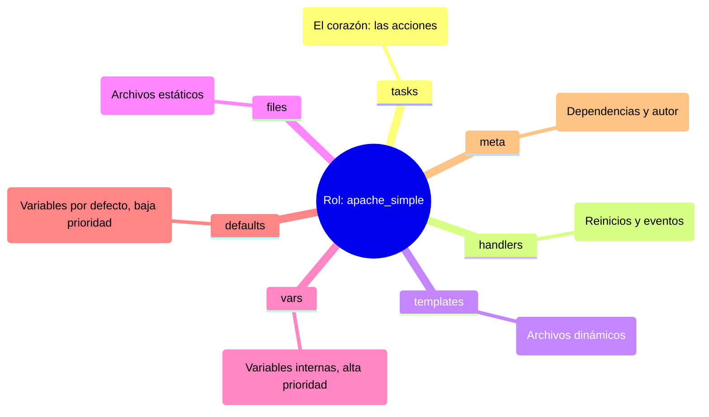

# Roles, Templates Jinja2 y Ansible Galaxy 📦

Hasta ahora has escrito playbooks lineales. Cuando un proyecto crece, esos ficheros se vuelven inmanejables. En este capítulo aprendes a **modularizar tu código** con roles, generar configuración dinámica con **Jinja2**, reutilizar trabajo de la comunidad con **Ansible Galaxy** y aplicar **buenas prácticas** que mantendrán tu repositorio sano a largo plazo.

## 📋 Contenido del capítulo

1. [Roles y modularidad](#roles-y-modularidad-) — Estructura de un rol, cómo crearlos y consumirlos.
2. [Templates con Jinja2](#templates-con-jinja2-) — Renderizado de configuración dinámica.
3. [Ansible Galaxy y Collections](#ansible-galaxy-y-collections-) — Compartir y consumir contenido de la comunidad.

## Roles y modularidad 📦

Organiza tu código como un profesional usando la estructura de roles.

:::info Video pendiente de grabación
:::

### Introducción: ¿por qué roles?

Hasta ahora, hemos escrito playbooks que son listas largas de tareas. Esto funciona bien para 10 o 20 tareas, pero ¿qué pasa cuando tienes 500? ¿O cuando quieres configurar Nginx en 10 proyectos diferentes?

#### 🍝 La analogía: código espagueti vs. librerías
Imagina un libro de 1000 páginas sin capítulos ni índice. Eso es un playbook gigante. Es difícil de leer, difícil de mantener y casi imposible de reutilizar.

Los **roles** son como las **"habilidades" en un videojuego**.
*   Tienes un personaje (servidor).
*   Quieres que sepa hacer magia (servidor web).
*   En lugar de enseñarle los movimientos uno a uno cada vez, le equipas el libro de hechizos "Mago de Fuego" (rol `webserver`).
*   ¡Pum! Ahora sabe lanzar bolas de fuego (instalar nginx, configurar vhosts, abrir puertos) automáticamente.

### La estructura de un rol

Ansible espera una estructura de carpetas muy específica. Si la respetas, la magia ocurre sola (autoloading).

#### 🌳 Anatomía visual



#### Diccionario de carpetas
*   **`tasks/`**: Aquí van los módulos (`apt`, `copy`, `service`). Es lo que antes tenías en la sección `tasks:` del playbook.
*   **`handlers/`**: Los disparadores (`restart nginx`).
*   **`templates/`**: Tus archivos `.j2`.
*   **`files/`**: Archivos que se copian tal cual (certificados, imágenes).
*   **`defaults/`**: Variables con la prioridad **más baja**. Están hechas para ser sobrescritas fácilmente por el usuario del rol.
*   **`vars/`**: Variables con prioridad alta. Úsalas para constantes que rara vez cambian.
*   **`meta/`**: Metadatos del rol: información del autor, licencia y **dependencias** de otros roles.


### Manos a la obra: creando tu primer rol

Vamos a refactorizar. Tomaremos el "código espagueti" de un servidor web y lo convertiremos en un rol elegante.

#### Paso 1: inicializar la estructura
Ansible tiene un comando para crear el esqueleto por ti:

```bash
ansible-galaxy init apache_simple
```

#### Paso 2: mover las piezas (refactorización)

Supongamos que tenías este playbook antiguo:

```yaml
# old_playbook.yml (espagueti) ❌
- hosts: servers
  vars:
    http_port: 80
  tasks:
    - name: Instalar Apache
      apt: name=apache2 state=present
    - name: Copiar config
      template: src=templates/httpd.conf.j2 dest=/etc/apache2/httpd.conf
      notify: Reiniciar Apache
  handlers:
    - name: Reiniciar Apache
      service: name=apache2 state=restarted
```

Ahora, "descuartizamos" este archivo y ponemos cada cosa en su lugar dentro de la carpeta `apache_simple/`:

**1. `roles/apache_simple/tasks/main.yml`**
```yaml
- name: Instalar Apache
  apt:
    name: apache2
    state: present

- name: Copiar config
  template:
    src: httpd.conf.j2  # Nota: Ya no hace falta poner "templates/" delante
    dest: /etc/apache2/httpd.conf
  notify: Reiniciar Apache
```

**2. `roles/apache_simple/handlers/main.yml`**
```yaml
- name: Reiniciar Apache
  service:
    name: apache2
    state: restarted
```

**3. `roles/apache_simple/defaults/main.yml`**
```yaml
http_port: 80
```

#### Paso 3: el resultado final (limpio y profesional)

Tu playbook principal (`site.yml`) ahora queda así de minimalista:

```yaml
# site.yml (modular) ✅
- hosts: servers
  roles:
    - apache_simple
```

¡De 15 líneas a 3! Y lo mejor: puedes usar `apache_simple` en cualquier otro proyecto simplemente copiando la carpeta.


### Dependencias entre roles

Los roles pueden depender de otros roles. Por ejemplo, si tu rol `wordpress` necesita que primero esté instalado `mysql` y `php`, puedes declarar estas dependencias en el archivo `meta/main.yml`.

#### 🔗 Ejemplo de dependencias

**`roles/wordpress/meta/main.yml`**
```yaml
dependencies:
  - role: mysql
    vars:
      mysql_root_password: "secreto123"

  - role: php
    vars:
      php_version: "8.1"
```

#### ¿Cómo funciona?
1.  Cuando ejecutas el rol `wordpress`, Ansible primero ejecuta `mysql` y luego `php`.
2.  Los roles se ejecutan **solo una vez**, aunque múltiples roles los tengan como dependencia.
3.  Puedes pasar variables específicas a cada dependencia usando `vars:`.

#### Usar roles en playbooks con dependencias

```yaml
# site.yml
- hosts: servers
  roles:
    - wordpress  # Automáticamente ejecutará mysql → php → wordpress
```

#### 💡 Buenas prácticas
*   **No abuses**: Si tienes 10 niveles de dependencias, algo está mal en tu diseño.
*   **Documenta**: Siempre indica en el README qué roles son prerequisitos.
*   **Versiona**: Si usas roles de Galaxy, fija las versiones en `requirements.yml`.


### Ansible galaxy y collections

No reinventes la rueda. Probablemente alguien ya ha creado el rol perfecto para instalar Docker, Kubernetes o MySQL.

#### 🌌 Ansible galaxy (el "app store")
Es el repositorio oficial de contenido comunitario.

*   **Buscar roles:** `ansible-galaxy search elasticsearch`
*   **Instalar un rol:** `ansible-galaxy install geerlingguy.elasticsearch`

#### 📦 Content collections (el nuevo estándar)
Antiguamente, Galaxy solo tenía roles. Ahora, con la complejidad de la nube, usamos **collections**.
Una collection es un paquete que incluye: **roles + módulos + plugins**.

Por ejemplo, la collection `amazon.aws` incluye módulos para EC2, S3, Lambda, etc.

##### Comandos esenciales

```bash
# Instalar una colección
ansible-galaxy collection install amazon.aws

# Listar lo que tienes instalado
ansible-galaxy collection list
```

##### Usando collections en un playbook
```yaml
- hosts: localhost
  collections:
    - amazon.aws  # Declaramos que usaremos esta colección
  tasks:
    - name: Crear instancia EC2
      ec2_instance:  # Módulo que viene dentro de la colección
        instance_type: t2.micro
```

### Resumen
1.  **Divide y vencerás:** Usa roles para separar responsabilidades.
2.  **Estandariza:** Respeta la estructura de carpetas (`tasks`, `vars`, `templates`) para que cualquiera entienda tu código.
3.  **Reutiliza:** Antes de escribir código, busca en Ansible Galaxy. Si tienes que escribirlo, hazlo pensando en que sea un rol genérico para el futuro.
4.  **Declara dependencias:** Usa `meta/main.yml` para especificar qué roles necesita tu rol antes de ejecutarse.

## Templates con Jinja2 📝

Creación de archivos de configuración dinámicos y personalizados.


### ¿Por qué necesitamos templates?

Hasta ahora usábamos el módulo `copy` para subir archivos estáticos. Pero, ¿y si cada servidor necesita una configuración ligeramente diferente (su propia IP, su propio nombre, su propio entorno)?

#### 📝 La analogía: "Mad Libs" o carta modelo
Imagina una carta del banco. No escriben una carta nueva para cada cliente. Tienen una plantilla:

```jinja
Hola {{ nombre_cliente }}, su saldo actual es de {{ saldo }} euros.
```

Ansible usa **Jinja2** (el motor de plantillas de Python) para rellenar esos huecos justo antes de subir el archivo al servidor.

#### 🎯 Ventajas de los Templates
*   **Reutilización**: Una plantilla, miles de configuraciones diferentes.
*   **Mantenimiento**: Cambias la plantilla una vez y se actualiza en todos los servidores.
*   **Adaptabilidad**: Cada servidor recibe su configuración personalizada automáticamente.
*   **Variables Ansible**: Acceso directo a facts, variables de inventario y facts del sistema.


### Sintaxis Básica de Jinja2

Jinja2 usa tres tipos de delimitadores especiales:

#### 📌 Tipos de Expresiones

1.  **`{{ variable }}`**: **Imprimir/Sustituir**
    ```jinja
    Servidor: {{ ansible_hostname }}
    IP: {{ ansible_default_ipv4.address }}
    ```

2.  **``**: **Lógica/Control de Flujo**
    ```jinja
    
        hacer algo
    

    
        {{ item }}
    
    ```

3.  **`{# comentario #}`**: **Comentarios** (no aparecen en el archivo final)
    ```jinja
    {# TODO: añadir validación de SSL #}
    ```

#### 🔗 Acceso a Variables Anidadas

```jinja
{# Diccionario anidado #}
{{ ansible_default_ipv4.address }}
{{ servidor.config.puerto }}

{# Listas #}
{{ usuarios[0] }}
{{ servidores_web[2].nombre }}
```


### Variables en Templates

#### Variables de Ansible
Todas las variables definidas en tu playbook, inventario o roles están disponibles:

```yaml
# En tu playbook
vars:
  app_name: "MiApp"
  app_version: "2.1.0"
  app_port: 8080
```

```jinja
# En tu template
Aplicación: {{ app_name }}
Versión: {{ app_version }}
Puerto: {{ app_port }}
```

#### Facts del Sistema
Ansible recopila automáticamente información del servidor (facts):

```jinja
{# Información del sistema #}
Hostname: {{ ansible_hostname }}
FQDN: {{ ansible_fqdn }}
SO: {{ ansible_distribution }} {{ ansible_distribution_version }}
Arquitectura: {{ ansible_architecture }}

{# Red #}
IP Principal: {{ ansible_default_ipv4.address }}
Gateway: {{ ansible_default_ipv4.gateway }}
Interfaz: {{ ansible_default_ipv4.interface }}

{# Hardware #}
CPUs: {{ ansible_processor_vcpus }}
RAM Total: {{ ansible_memtotal_mb }} MB
```


### Condicionales en Jinja2

#### If / Elif / Else

```jinja

    LogLevel warn
    DebugMode off

    LogLevel info
    DebugMode on

    LogLevel debug
    DebugMode on

```

#### Operadores Lógicos

```jinja
{# AND #}

    AllowFullAccess yes


{# OR #}

    EnableSSL yes


{# NOT #}

    ServerActive yes


{# IN #}

    IncludeNginxConfig yes

```


### Bucles en Jinja2

#### For Loop Básico

```jinja
# Lista de servidores permitidos

allow {{ servidor }};

```

#### For con Diccionarios

```jinja

{{ nombre }} = {{ valor }}

```

#### For con Else (cuando la lista está vacía)

```jinja
<ul>

    <li>{{ user }}</li>

    <li>No hay usuarios configurados</li>

</ul>
```

#### Variables Especiales en Bucles

```jinja

    Índice: {{ loop.index }}     {# Comienza en 1 #}
    Índice0: {{ loop.index0 }}   {# Comienza en 0 #}
    ¿Es el primero?: {{ loop.first }}
    ¿Es el último?: {{ loop.last }}
    Longitud total: {{ loop.length }}

```


### Filtros Útiles en Jinja2

Los filtros transforman variables. Se aplican con el símbolo `|` (pipe).

#### Filtros de Texto

```jinja
{# Mayúsculas/Minúsculas #}
{{ nombre | upper }}          → PABLO
{{ nombre | lower }}          → pablo
{{ nombre | capitalize }}     → Pablo
{{ titulo | title }}          → Mi Aplicación Web

{# Valores por defecto #}
{{ variable_opcional | default('valor_por_defecto') }}

{# Reemplazar #}
{{ ruta | replace('/home', '/usr') }}
```

#### Filtros de Listas

```jinja
{# Unir elementos #}
{{ ['target1', 'target2', 'target3'] | join(', ') }}
→ target1, target2, target3

{# Longitud #}
Total de servidores: {{ servidores | length }}

{# Primer/Último elemento #}
{{ servidores | first }}
{{ servidores | last }}

{# Ordenar #}
{{ numeros | sort }}
{{ nombres | sort(reverse=True) }}
```

#### Filtros de Números

```jinja
{# Matemáticas #}
{{ precio | round }}           → Redondear
{{ numero | abs }}             → Valor absoluto
{{ valor | int }}              → Convertir a entero
{{ valor | float }}            → Convertir a decimal
```

#### Filtros de Archivos/Rutas

```jinja
{{ '/etc/nginx/nginx.conf' | basename }}      → nginx.conf
{{ '/etc/nginx/nginx.conf' | dirname }}       → /etc/nginx
{{ 'archivo.txt' | splitext }}                → ['archivo', '.txt']
```

#### Filtros de Formato

```jinja
{# JSON #}
{{ diccionario | to_json }}
{{ diccionario | to_nice_json }}    {# Formateado #}

{# YAML #}
{{ configuracion | to_yaml }}
{{ configuracion | to_nice_yaml }}

{# Escapar HTML #}
{{ texto_usuario | escape }}
```


### Práctica 1: Configuración de Nginx

Vamos a crear un template para configurar un virtual host de Nginx que se adapte a cada servidor.

#### **Template: `templates/nginx-vhost.conf.j2`**

```nginx
# Generado automáticamente por Ansible
# Servidor: {{ ansible_hostname }}
# Fecha: {{ ansible_date_time.date }}

server {
    listen {{ puerto_web | default(80) }};
    server_name {{ dominio }};

    root /var/www/{{ app_name }}/public;
    index index.html index.php;

    # Logs personalizados por entorno
    
    access_log /var/log/nginx/{{ app_name }}-access.log combined;
    error_log /var/log/nginx/{{ app_name }}-error.log warn;
    
    access_log /var/log/nginx/{{ app_name }}-access.log combined;
    error_log /var/log/nginx/{{ app_name }}-error.log debug;
    

    # IPs permitidas (generado desde lista)
    
    
    allow {{ ip }};
    
    deny all;
    

    location / {
        try_files $uri $uri/ =404;
    }

    # PHP solo en producción
    
    location ~ \.php$ {
        fastcgi_pass unix:/var/run/php-fpm.sock;
        fastcgi_index index.php;
        include fastcgi_params;
    }
    
}
```

#### **Playbook: `deploy-nginx.yml`**

```yaml
- name: Configurar Nginx
  hosts: servers
  vars:
    app_name: miapp
    app_env: production
    dominio: www.ejemplo.com
    puerto_web: 80
    ips_permitidas:
      - 127.0.0.0/8
    servicios:
      - nginx
      - php

  tasks:
    - name: Generar configuración de Nginx desde template
      template:
        src: templates/nginx-vhost.conf.j2
        dest: /etc/nginx/sites-available/{{ app_name }}.conf
        owner: root
        group: root
        mode: '0644'
      notify: Reiniciar Nginx

  handlers:
    - name: Reiniciar Nginx
      service:
        name: nginx
        state: restarted
```


### Resultado de la Ejecución

Cuando ejecutes estos playbooks, Ansible:

1.  **Leerá** el archivo `.j2` de la plantilla.
2.  **Recopilará** los facts del servidor destino (memoria, CPUs, IPs, etc.).
3.  **Evaluará** todas las expresiones Jinja2:
    *   Sustituirá `{{ variables }}`
    *   Ejecutará los `` y ``
    *   Aplicará los filtros `| upper`, `| round`, etc.
4.  **Generará** el archivo final personalizado para ese servidor específico.
5.  **Subirá** el archivo resultante al destino.

#### Ejemplo de Salida Real

Si tu servidor tiene:
*   Hostname: `target1`
*   RAM: 4096 MB
*   IP: `127.0.0.1`

La configuración de MySQL generada será:

```ini
# MySQL Configuration for target1
# Environment: PRODUCTION

[mysqld]
innodb_buffer_pool_size = 1024M
max_connections = 150
server-id = 100
log_bin = /var/log/mysql/mysql-bin.log
```


### Buenas Prácticas

#### ✅ DO:
*   Usa extensión `.j2` para identificar templates.
*   Comenta las secciones complejas con `{# comentario #}`.
*   Usa filtros `| default()` para valores opcionales.
*   Valida el resultado con `--check` y `--diff`.
*   Usa `{{ variable | mandatory }}` para forzar que exista.

#### ❌ DON'T:
*   No pongas lógica de negocio compleja en templates (muévela al playbook).
*   No repitas código: usa includes o roles.
*   No olvides escapar datos de usuario con `| escape`.

#### 🧪 Validar Templates

```bash
# Ver qué cambiaría sin aplicarlo
ansible-playbook site.yml --check --diff

# Ver el archivo generado antes de subirlo
ansible -m template -a "src=template.j2 dest=/tmp/test.conf" localhost
```


### Resumen

Con **Jinja2**, tus configuraciones se adaptan elásticamente a cualquier entorno:
*   📝 **Variables** para personalización
*   🔀 **Condicionales** para lógica adaptativa
*    🔄 **Bucles** para repetición eficiente
*   🎨 **Filtros** para transformación de datos

Un solo template puede generar miles de configuraciones diferentes, manteniendo tu código **DRY** (Don't Repeat Yourself) y profesional.

## Ansible Galaxy y Collections 🌌

Aprende a reutilizar código de la comunidad y a compartir tus propios roles con el mundo.

### ¿Qué es Ansible Galaxy?

#### 🌟 La analogía: el "App Store" de Ansible
Imagina que necesitas configurar un servidor con Docker. Podrías escribir todas las tareas desde cero (instalar dependencias, añadir repositorios, configurar el daemon, etc.), o simplemente descargar un rol ya probado y mantenido por la comunidad.

**Ansible Galaxy** es el repositorio oficial donde miles de desarrolladores comparten roles, collections y plugins listos para usar.

#### 🎯 Ventajas de usar Galaxy
*   **Ahorro de tiempo**: No reinventes la rueda. Usa roles probados en producción.
*   **Calidad**: Los roles populares tienen miles de descargas y están bien mantenidos.
*   **Estandarización**: Aprende buenas prácticas viendo código de expertos.
*   **Comunidad**: Contribuye con mejoras y reporta bugs.

#### 🌐 Galaxy vs Collections
*   **Galaxy (tradicional)**: Repositorio de roles individuales.
*   **Collections (moderno)**: Paquetes que incluyen roles + módulos + plugins + documentación.


### Buscando roles en Galaxy

#### 🔍 Búsqueda desde línea de comandos

```bash
# Buscar roles relacionados con "docker"
ansible-galaxy search docker

# Buscar con un término más específico
ansible-galaxy search mysql --author geerlingguy

# Ver detalles de un rol específico
ansible-galaxy info geerlingguy.docker
```

#### 📊 Output de ejemplo

```bash
$ ansible-galaxy search nginx

Found 523 roles matching your search:

 Name                          Description
 ----                          -----------
 geerlingguy.nginx            Nginx installation for Linux
 jdauphant.nginx              Install and configure nginx
 nginxinc.nginx               Official NGINX role
 ...
```

#### 🌐 Búsqueda en la web
La forma más cómoda es buscar en [galaxy.ansible.com](https://galaxy.ansible.com):

*   **Filtros**: Por plataforma (Ubuntu, CentOS, etc.), categoría, autor.
*   **Métricas**: Descargas, estrellas, fecha de última actualización.
*   **Documentación**: README, dependencias, versiones compatibles.

#### 💡 Criterios para elegir un buen rol

| Criterio | ¿Qué buscar? |
|----------|-------------|
| **Popularidad** | Más de 1000 descargas, estrellas altas |
| **Mantenimiento** | Última actualización reciente (< 6 meses) |
| **Compatibilidad** | Soporta tu distribución y versión de Ansible |
| **Documentación** | README completo con ejemplos |
| **Licencia** | Open source (MIT, Apache, BSD) |


### Instalando roles desde Galaxy

#### 📥 Instalación básica

```bash
# Instalar un rol (se guarda en ~/.ansible/roles/)
ansible-galaxy install geerlingguy.docker

# Instalar en una ruta específica
ansible-galaxy install geerlingguy.nginx -p ./roles/

# Instalar una versión específica
ansible-galaxy install geerlingguy.mysql,3.4.0
```

#### 📦 Usando requirements.yml

Para proyectos profesionales, **nunca instales roles manualmente**. Usa un archivo `requirements.yml` para documentar todas las dependencias.

**`requirements.yml`**
```yaml
# Roles desde Galaxy
roles:
  - name: geerlingguy.docker
    version: 6.1.0

  - name: geerlingguy.nginx
    version: 3.1.4

  - name: geerlingguy.mysql
    version: 4.3.3

  - name: geerlingguy.redis
    version: 1.8.0

# Collections
collections:
  - name: community.general
    version: 8.1.0

  - name: ansible.posix
    version: 1.5.4

  - name: amazon.aws
    version: 7.1.0
```

#### 🚀 Instalación desde requirements.yml

```bash
# Instalar todos los roles y collections del archivo
ansible-galaxy install -r requirements.yml

# Forzar reinstalación (útil para actualizar)
ansible-galaxy install -r requirements.yml --force

# Instalar en ruta específica
ansible-galaxy install -r requirements.yml -p ./roles/
```

#### 🔗 Instalando desde Git

Puedes instalar roles directamente desde repositorios Git (GitHub, GitLab, etc.):

**`requirements.yml`**
```yaml
roles:
  # Desde GitHub
  - src: https://github.com/usuario/mi-rol.git
    name: mi_rol_custom
    version: main  # Branch, tag o commit

  # Desde GitLab
  - src: git@gitlab.com:empresa/rol-interno.git
    name: rol_interno
    scm: git

  # Desde Galaxy con nombre personalizado
  - src: geerlingguy.apache
    name: apache_role
    version: 3.2.0
```


### Usando roles instalados en playbooks

Una vez instalados, los roles se usan como cualquier otro rol local:

#### 📝 Ejemplo: Playbook con roles de Galaxy

**`site.yml`**
```yaml
- name: Configurar servidor web con roles de Galaxy
  hosts: servers
  become: yes

  vars:
    # Variables para geerlingguy.docker
    docker_users:
      - deployer
      - jenkins

    # Variables para geerlingguy.nginx
    nginx_vhosts:
      - listen: "80"
        server_name: "ejemplo.com www.ejemplo.com"
        root: "/var/www/ejemplo"

  roles:
    - geerlingguy.docker
    - geerlingguy.nginx
    - geerlingguy.certbot

  post_tasks:
    - name: Verificar que Docker está corriendo
      service:
        name: docker
        state: started
```

#### 🔧 Sobrescribiendo variables de roles

Los roles de Galaxy suelen tener muchas variables configurables. Revisa su documentación:

```bash
# Ver variables disponibles de un rol
cat ~/.ansible/roles/geerlingguy.docker/defaults/main.yml

# O en GitHub:
# https://github.com/geerlingguy/ansible-role-docker#role-variables
```

**Ejemplo de sobrescritura:**
```yaml
- hosts: servers
  roles:
    - role: geerlingguy.mysql
      vars:
        mysql_root_password: "secreto123"
        mysql_databases:
          - name: wordpress
            encoding: utf8mb4
        mysql_users:
          - name: wpuser
            password: "pass123"
            priv: "wordpress.*:ALL"
```


### Collections: el nuevo estándar

#### 📦 ¿Qué es una Collection?

Una **collection** es un paquete que puede incluir:
*   **Roles**: Como los tradicionales
*   **Módulos**: Nuevas funcionalidades (`aws_ec2`, `docker_container`)
*   **Plugins**: Filtros, callbacks, inventarios
*   **Documentación**: Guías y ejemplos

#### 🌍 Collections oficiales importantes

| Collection | Descripción | Ejemplo de uso |
|-----------|-------------|----------------|
| `community.general` | Módulos generales de la comunidad | `timezone`, `snap`, `git_config` |
| `ansible.posix` | Herramientas POSIX/Unix | `mount`, `sysctl`, `firewalld` |
| `amazon.aws` | Servicios de AWS | `ec2`, `s3`, `rds`, `lambda` |
| `azure.azcollection` | Microsoft Azure | `azure_rm_virtualmachine` |
| `google.cloud` | Google Cloud Platform | `gcp_compute_instance` |
| `community.docker` | Gestión de Docker | `docker_container`, `docker_image` |
| `community.mysql` | Base de datos MySQL | `mysql_db`, `mysql_user` |
| `community.kubernetes` | Kubernetes/K8s | `k8s`, `helm` |

#### 📥 Instalando collections

```bash
# Instalar una collection
ansible-galaxy collection install community.general

# Instalar versión específica
ansible-galaxy collection install amazon.aws:7.1.0

# Instalar desde requirements.yml
ansible-galaxy collection install -r requirements.yml

# Listar collections instaladas
ansible-galaxy collection list

# Ver información de una collection
ansible-galaxy collection info community.docker
```

#### 🗂️ Ubicación de collections

Las collections se instalan en:
*   Sistema: `/usr/share/ansible/collections/`
*   Usuario: `~/.ansible/collections/ansible_collections/`
*   Proyecto: `./collections/ansible_collections/`

#### 📝 Usando collections en playbooks

**Opción 1: Declarar a nivel de play**
```yaml
- name: Gestionar AWS EC2
  hosts: localhost
  collections:
    - amazon.aws  # Todos los módulos de esta collection están disponibles

  tasks:
    - name: Crear instancia EC2
      ec2_instance:  # Módulo de amazon.aws
        name: target1
        instance_type: t3.micro
        image_id: ami-0c55b159cbfafe1f0
        region: us-east-1
        key_name: mi-llave
        state: running
```

**Opción 2: Usar FQCN (Fully Qualified Collection Name)**
```yaml
- name: Gestionar Docker
  hosts: servidores
  tasks:
    - name: Crear contenedor Nginx
      community.docker.docker_container:  # FQCN completo
        name: nginx
        image: nginx:latest
        ports:
          - "80:80"
        state: started

    - name: Configurar timezone
      community.general.timezone:  # FQCN completo
        name: Europe/Madrid
```

**Recomendación**: Usa FQCN para evitar conflictos si dos collections tienen módulos con el mismo nombre.


### Creando y publicando tu propio rol

#### 🛠️ Paso 1: Inicializar el rol

```bash
# Crear estructura del rol
ansible-galaxy init mi_rol_apache

# Estructura generada:
# mi_rol_apache/
# ├── README.md
# ├── defaults/
# │   └── main.yml
# ├── files/
# ├── handlers/
# │   └── main.yml
# ├── meta/
# │   └── main.yml
# ├── tasks/
# │   └── main.yml
# ├── templates/
# ├── tests/
# │   ├── inventory
# │   └── test.yml
# └── vars/
#     └── main.yml
```

#### 📝 Paso 2: Escribir el código del rol

**`tasks/main.yml`**
```yaml
- name: Instalar Apache
  apt:
    name: apache2
    state: present
    update_cache: yes

- name: Configurar virtual host
  template:
    src: vhost.conf.j2
    dest: "/etc/apache2/sites-available/{{ app_name }}.conf"
  notify: Reiniciar Apache

- name: Habilitar sitio
  file:
    src: "/etc/apache2/sites-available/{{ app_name }}.conf"
    dest: "/etc/apache2/sites-enabled/{{ app_name }}.conf"
    state: link
  notify: Reiniciar Apache
```

**`defaults/main.yml`**
```yaml
app_name: miapp
app_port: 80
app_root: /var/www/html
```

**`handlers/main.yml`**
```yaml
- name: Reiniciar Apache
  service:
    name: apache2
    state: restarted
```

#### 📄 Paso 3: Documentar en meta/main.yml

**`meta/main.yml`**
```yaml
galaxy_info:
  author: Tu Nombre
  description: Instalación y configuración de Apache
  company: Tu Empresa (opcional)
  license: MIT
  min_ansible_version: "2.14"

  platforms:
    - name: Ubuntu
      versions:
        - focal
        - jammy
    - name: Debian
      versions:
        - bullseye
        - bookworm

  galaxy_tags:
    - web
    - apache
    - httpd
    - webserver

dependencies: []  # Si tu rol necesita otros roles
```

#### ✍️ Paso 4: Escribir README.md completo

**`README.md`**
```markdown
# Rol Ansible: mi_rol_apache

Instala y configura Apache en servidores Ubuntu/Debian.

## Requisitos

- Ansible >= 2.14
- Ubuntu 20.04+ o Debian 11+

## Variables

| Variable | Default | Descripción |
|----------|---------|-------------|
| `app_name` | `miapp` | Nombre de la aplicación |
| `app_port` | `80` | Puerto de escucha |
| `app_root` | `/var/www/html` | Directorio raíz |

## Ejemplo de uso

```yaml
- hosts: servers
  roles:
    - role: mi_rol_apache
      vars:
        app_name: sitio_ejemplo
        app_port: 8080
```

## Licencia

MIT

## Autor

Tu Nombre (@tu_usuario)
```

#### 🧪 Paso 5: Probar el rol localmente

```bash
# Ejecutar el test incluido
ansible-playbook tests/test.yml -i tests/inventory

# O crear un playbook de prueba
cat > test-rol.yml <<EOF
- hosts: localhost
  become: yes
  roles:
    - mi_rol_apache
EOF

ansible-playbook test-rol.yml
```

#### 📤 Paso 6: Publicar en Galaxy

**6.1. Subir a GitHub**
```bash
cd mi_rol_apache
git init
git add .
git commit -m "Versión inicial"
git remote add origin https://github.com/tu_usuario/ansible-role-apache.git
git push -u origin main

# Crear un tag de versión
git tag 1.0.0
git push origin 1.0.0
```

**6.2. Importar en Galaxy**
1. Ve a [galaxy.ansible.com](https://galaxy.ansible.com)
2. Inicia sesión con GitHub
3. Ve a "My Content" → "Add Content"
4. Selecciona tu repositorio `ansible-role-apache`
5. Galaxy importará automáticamente tu rol

**6.3. Actualizar versiones**
```bash
# Hacer cambios en el código
git add .
git commit -m "Añadida compatibilidad con SSL"
git tag 1.1.0
git push origin main --tags

# Galaxy detectará el nuevo tag automáticamente
```


### Buenas prácticas con Galaxy

#### ✅ DO:

*   **Fija versiones en requirements.yml**: Evita sorpresas con actualizaciones.
*   **Lee el README antes de instalar**: Entiende qué hace el rol.
*   **Revisa el código**: Especialmente en roles con pocos downloads.
*   **Contribuye con issues y PRs**: Ayuda a mejorar los roles que usas.
*   **Usa FQCN en collections**: Mayor claridad y evita conflictos.

#### ❌ DON'T:

*   **No uses roles sin mantenimiento**: Busca alternativas activas.
*   **No instales sin probar primero**: Usa `--check` mode.
*   **No expongas credenciales**: Usa Ansible Vault para secretos.
*   **No dependas de un solo rol**: Ten un plan B si el autor lo abandona.

#### 🔒 Seguridad

```bash
# Verificar el código antes de ejecutar
cat ~/.ansible/roles/nombre_rol/tasks/main.yml

# Ejecutar en modo dry-run
ansible-playbook site.yml --check

# Limitar a un host de pruebas primero
ansible-playbook site.yml --limit test-server
```


### Creando tu propia collection

#### 🎯 Cuándo crear una collection

Crea una collection cuando tengas:
*   Múltiples roles relacionados
*   Módulos personalizados
*   Plugins o filtros custom
*   Documentación extensa

#### 🛠️ Inicializar collection

```bash
# Crear estructura de collection
ansible-galaxy collection init mi_namespace.mi_collection

# Estructura generada:
# mi_namespace/
# └── mi_collection/
#     ├── README.md
#     ├── galaxy.yml        # Metadatos de la collection
#     ├── docs/
#     ├── plugins/
#     │   ├── modules/      # Tus módulos custom
#     │   ├── inventory/
#     │   ├── lookup/
#     │   └── filter/
#     ├── roles/            # Roles incluidos
#     └── playbooks/        # Playbooks de ejemplo
```

#### 📝 Configurar galaxy.yml

**`galaxy.yml`**
```yaml
namespace: mi_namespace
name: mi_collection
version: 1.0.0
readme: README.md
authors:
  - Tu Nombre <email@ejemplo.com>

description: Collection para gestión de infraestructura web

license:
  - MIT

tags:
  - web
  - infrastructure
  - automation

dependencies: {}

repository: https://github.com/tu_usuario/mi_collection
documentation: https://docs.ejemplo.com
homepage: https://ejemplo.com
issues: https://github.com/tu_usuario/mi_collection/issues
```

#### 📦 Build y publicar

```bash
# Construir la collection (crea un .tar.gz)
ansible-galaxy collection build

# Publicar en Galaxy (necesitas API key)
ansible-galaxy collection publish mi_namespace-mi_collection-1.0.0.tar.gz --api-key=TU_API_KEY

# Instalar localmente para pruebas
ansible-galaxy collection install ./mi_namespace-mi_collection-1.0.0.tar.gz
```


### Ejemplo completo: proyecto con Galaxy

**Estructura del proyecto:**
```
mi-proyecto/
├── ansible.cfg
├── requirements.yml
├── inventory/
│   └── hosts.yml
├── group_vars/
│   └── all.yml
├── playbooks/
│   └── site.yml
└── roles/            # Roles locales custom
    └── mi_rol/
```

**`ansible.cfg`**
```ini
[defaults]
roles_path = ./roles:~/.ansible/roles
collections_path = ./collections:~/.ansible/collections
inventory = inventory/hosts.yml
```

**`requirements.yml`**
```yaml
roles:
  - name: geerlingguy.docker
    version: 6.1.0
  - name: geerlingguy.nginx
    version: 3.1.4

collections:
  - name: community.general
    version: 8.1.0
  - name: community.docker
    version: 3.4.11
```

**Workflow:**
```bash
# 1. Instalar dependencias
ansible-galaxy install -r requirements.yml

# 2. Ejecutar playbook
ansible-playbook playbooks/site.yml

# 3. Actualizar dependencias cuando sea necesario
ansible-galaxy install -r requirements.yml --force
```


### Comandos de referencia rápida

```bash
# === ROLES ===
# Buscar roles
ansible-galaxy search <término>

# Instalar rol
ansible-galaxy install <autor>.<rol>

# Instalar desde requirements
ansible-galaxy install -r requirements.yml

# Listar roles instalados
ansible-galaxy list

# Eliminar rol
ansible-galaxy remove <autor>.<rol>

# Ver información de un rol
ansible-galaxy info <autor>.<rol>

# === COLLECTIONS ===
# Buscar collections
ansible-galaxy collection search <término>

# Instalar collection
ansible-galaxy collection install <namespace>.<collection>

# Listar collections instaladas
ansible-galaxy collection list

# Ver información
ansible-galaxy collection info <namespace>.<collection>

# === CREACIÓN ===
# Inicializar rol
ansible-galaxy init <nombre_rol>

# Inicializar collection
ansible-galaxy collection init <namespace>.<collection>

# Build collection
ansible-galaxy collection build

# Publicar collection
ansible-galaxy collection publish <archivo.tar.gz> --api-key=<KEY>
```


### Resumen

En este capítulo has aprendido:

✅ **Qué es Ansible Galaxy**: El repositorio oficial de contenido de la comunidad.
✅ **Buscar e instalar roles**: Cómo encontrar y usar roles de calidad.
✅ **Requirements.yml**: Gestión profesional de dependencias.
✅ **Collections**: El nuevo estándar que incluye roles, módulos y plugins.
✅ **Publicar tu contenido**: Comparte tus roles con la comunidad.
✅ **Buenas prácticas**: Seguridad, versiones fijas y documentación.

#### 💡 Puntos clave

1.  **No reinventes la rueda**: Usa roles de Galaxy cuando sea posible.
2.  **Fija versiones**: `requirements.yml` es tu mejor amigo.
3.  **Lee el código**: Especialmente de roles con pocos usuarios.
4.  **Contribuye**: Reporta bugs, envía PRs, mejora la comunidad.
5.  **Usa FQCN**: Claridad y compatibilidad a largo plazo.


