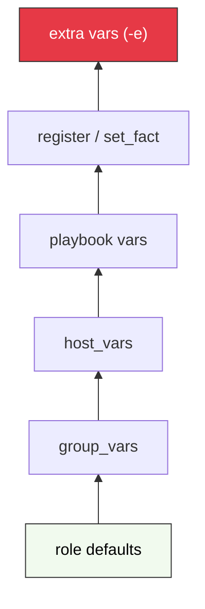

# Variables, Facts y control de flujo avanzado 📊

En el módulo 3 viste cómo usar `when`, `loop` y handlers en su forma básica. Aquí vamos un paso más allá: el sistema de variables de Ansible, los facts como fuente de verdad del sistema, y los patrones avanzados que convierten un playbook en lógica reactiva real.

:::info Video pendiente de grabación
:::

## El sistema de variables: más allá de `vars:`

En el módulo 3 definiste variables directamente en el playbook con `vars:`. Funciona, pero no escala: si tienes 50 hosts con configuraciones distintas, acabas con un playbook ilegible lleno de condicionales.

La solución profesional son las carpetas `group_vars` y `host_vars`. Ansible las carga automáticamente sin que tengas que importarlas.

### Estructura de carpetas

```text
proyecto/
├── inventory.ini
├── playbook.yml
├── group_vars/
│   ├── all.yml          # Variables para TODOS los hosts
│   ├── madrid.yml       # Solo para el grupo madrid
│   └── barcelona.yml   # Solo para el grupo barcelona
└── host_vars/
    ├── target1.yml      # Variables específicas de target1
    └── target2.yml      # Variables específicas de target2
```

### Ejemplo práctico

**`group_vars/all.yml`** — parámetros comunes del grupo:
```yaml
nginx_port: 80
nginx_version: "1.27-alpine"
```

**`host_vars/target1.yml`** — excepción para un host concreto:
```yaml
nginx_port: 8080      # target1 corre en un puerto no estándar
```

**`playbook.yml`** — no hay ningún valor hardcodeado:
```yaml
- hosts: madrid
  tasks:
    - name: Desplegar Nginx con Docker
      community.docker.docker_container:
        name: nginx
        image: "nginx:{{ nginx_version }}"
        state: started
        ports:
          - "{{ nginx_port }}:80"
        restart_policy: unless-stopped
      # {{ nginx_port }} y {{ nginx_version }} vienen de group_vars/host_vars
```

Ansible fusiona automáticamente las variables. `target1` usará `nginx_port: 8080` porque `host_vars` es más específico que `group_vars`.


## Ansible Facts: el sistema autodescubierto

Antes de ejecutar cualquier tarea, Ansible interroga cada host y almacena su estado en variables automáticas llamadas **facts**. Son tu fuente de verdad sobre el sistema real.

### Variables más usadas

| Variable | Ejemplo de valor |
|----------|-----------------|
| `ansible_facts['os_family']` | `Debian`, `RedHat` |
| `ansible_facts['distribution']` | `Ubuntu`, `CentOS` |
| `ansible_facts['distribution_version']` | `22.04`, `8.7` |
| `ansible_facts['distribution_major_version']` | `22`, `8` |
| `ansible_facts['processor_vcpus']` | `4` |
| `ansible_facts['memtotal_mb']` | `8192` |
| `ansible_facts['default_ipv4']['address']` | `192.168.1.10` |
| `ansible_facts['hostname']` | `target1` |
| `ansible_facts['fqdn']` | `target1.ejemplo.com` |
| `ansible_facts['date_time']['date']` | `2025-09-01` |

### Ver todos los facts de un host

```bash
# Volcar todos los facts de target1
ansible target1 -m setup

# Filtrar por patrón
ansible target1 -m setup -a "filter=ansible_memory*"
ansible target1 -m setup -a "filter=ansible_*ipv4*"
```

### Crear facts personalizados (`set_fact`)

A veces necesitas derivar un valor a partir de otros. `set_fact` crea una variable en tiempo de ejecución, disponible para el resto del play:

```yaml
- name: Calcular memoria disponible para la JVM
  set_fact:
    jvm_heap_mb: "{{ (ansible_facts['memtotal_mb'] * 0.7) | int }}"

- name: Lanzar aplicación Java con heap calculado
  command: "java -Xmx{{ jvm_heap_mb }}m -jar app.jar"
```

### Deshabilitar la recopilación de facts

En playbooks que no necesitan facts (o cuando son lentos en hosts remotos), puedes desactivarlos:

```yaml
- hosts: all
  gather_facts: false   # Ahorra 1-2 segundos por host en playbooks grandes

  tasks:
    - name: Copiar archivo de configuración
      copy:
        src: config.yml
        dest: /opt/app/config.yml
```


## `register`: capturar resultados de tareas

`register` guarda el resultado de una tarea en una variable. Viste su uso para idempotencia con `command` en el módulo anterior. Aquí va el uso completo.

### Estructura de una variable registrada

```yaml
- name: Verificar estado de nginx
  command: systemctl is-active nginx
  register: nginx_status
  failed_when: false    # No fallar si nginx no está activo

- name: Mostrar estado
  debug:
    msg: "Nginx está: {{ nginx_status.stdout }}"
```

La variable `nginx_status` contiene:

| Atributo | Descripción |
|----------|-------------|
| `stdout` | Salida estándar del comando |
| `stderr` | Salida de error |
| `rc` | Código de retorno (0 = éxito) |
| `changed` | Si la tarea reportó cambio |
| `failed` | Si la tarea falló |

### Caso real: verificar antes de actuar

```yaml
- name: Comprobar si existe la base de datos
  community.mysql.mysql_db:
    name: miapp
    state: present
    login_unix_socket: /var/run/mysqld/mysqld.sock
  register: db_result
  check_mode: yes       # Solo verifica, no modifica

- name: Inicializar esquema solo si la BD es nueva
  command: mysql miapp < /opt/app/schema.sql
  when: db_result.changed
```

### `register` con módulo `stat`

Para verificar existencia de archivos/directorios:

```yaml
- name: Verificar si la configuración existe
  stat:
    path: /etc/app/config.yml
  register: config_file

- name: Generar configuración inicial si no existe
  template:
    src: config.yml.j2
    dest: /etc/app/config.yml
  when: not config_file.stat.exists
```


## Precedencia de variables

Si defines `http_port` en `group_vars`, en el playbook y también lo pasas por línea de comandos, ¿cuál gana?

### La pirámide de precedencia (simplificada)



La regla es: **lo más específico y lo más tardío gana**. Extra vars (`-e`) tienen la máxima prioridad absoluta; se usan para overrides manuales en tiempo de ejecución.

```bash
# http_port será 9090 aunque esté definido en group_vars y playbook vars
ansible-playbook site.yml -e "http_port=9090"
```

### Caso concreto con tres niveles

| Fuente | Valor |
|--------|-------|
| `group_vars/madrid.yml` | `http_port: 80` |
| `playbook.yml` (vars:) | `http_port: 8080` |
| `ansible-playbook -e` | `http_port: 9090` |
| **Resultado final** | **9090** |


## Variables especiales de Ansible

Siempre disponibles, sin declararlas:

```yaml
- name: Mostrar metadatos del host actual
  debug:
    msg: |
      Host en inventario: {{ inventory_hostname }}
      Grupos a los que pertenece: {{ group_names }}
      Todos los hosts del grupo madrid: {{ groups['madrid'] }}
      ¿Modo check activo?: {{ ansible_check_mode }}
```

Las más útiles:

| Variable | Descripción |
|----------|-------------|
| `inventory_hostname` | Nombre del host en el inventario |
| `inventory_hostname_short` | Sin dominio |
| `group_names` | Lista de grupos del host actual |
| `groups` | Diccionario con todos los grupos |
| `ansible_play_hosts` | Hosts activos en el play actual |
| `ansible_check_mode` | `true` si se ejecuta con `--check` |


## `when` avanzado: operadores y tests

Las condiciones básicas ya las viste en el módulo 3. Aquí van los patrones que usarás en código real.

### Tests Jinja2

```yaml
# Verificar si una variable existe (evita error si no está definida)
when: backup_config is defined

# Lo contrario
when: custom_port is undefined

# Verificar si es un número específico
when: ansible_facts['distribution_major_version'] | int >= 20

# Comprobar si un valor está en una lista
when: "'nginx' in installed_packages"

# Regex sobre una variable
when: inventory_hostname is match("^web-.*")
when: app_version is version('2.0', '>=')
```

### Combinar condiciones

```yaml
# AND implícito con lista
when:
  - ansible_facts['os_family'] == "Debian"
  - ansible_facts['distribution_major_version'] | int >= 20
  - not maintenance_mode | default(false)

# OR explícito
when: ansible_facts['os_family'] == "Debian" or ansible_facts['os_family'] == "RedHat"
```

### Condiciones sobre `register`

```yaml
- name: Verificar si Docker está instalado
  command: which docker
  register: docker_check
  failed_when: false
  changed_when: false

- name: Instalar Docker si falta
  apt:
    name: docker.io
    state: present
  when: docker_check.rc != 0

- name: Mostrar versión si está instalado
  command: docker --version
  when: docker_check.rc == 0
  changed_when: false
```

### Condicionales por grupo

```yaml
- name: Configurar firewall solo en producción
  ufw:
    rule: allow
    port: "{{ http_port }}"
  when: "'production' in group_names"

- name: Tareas solo para el primer host del grupo
  debug:
    msg: "Soy el host principal"
  when: inventory_hostname == groups['madrid'][0]
```


## `loop` avanzado

El loop básico (lista simple, diccionario) está en el módulo 3. Aquí van los patrones que no encajan en los básicos.

### `loop_control`: personalizar la salida y el comportamiento

```yaml
- name: Instalar paquetes con etiqueta legible
  apt:
    name: "{{ pkg.name }}"
    state: "{{ pkg.state }}"
  loop:
    - name: nginx
      state: present
    - name: apache2
      state: absent
  loop_control:
    loop_var: pkg              # Renombra "item" a algo más descriptivo
    label: "{{ pkg.name }}"    # Qué mostrar en la salida (evita dumps de JSON)
    pause: 1                   # Segundos entre iteraciones
    index_var: idx             # Contador disponible como {{ idx }}
```

### Bucles anidados con `subelements`

Para iterar sobre una lista dentro de otra:

```yaml
- name: Añadir claves SSH a varios usuarios
  authorized_key:
    user: "{{ item.0.name }}"
    key: "{{ item.1 }}"
    state: present
  loop: "{{ users | subelements('ssh_keys') }}"
  vars:
    users:
      - name: alice
        ssh_keys:
          - "ssh-ed25519 AAAA...alice-laptop"
          - "ssh-ed25519 AAAA...alice-yubikey"
      - name: bob
        ssh_keys:
          - "ssh-ed25519 AAAA...bob-laptop"
```

### Esperar a que algo esté listo: `until` / `retries` / `delay`

Ideal para esperar a que un servicio arranque o una API responda:

```yaml
- name: Esperar a que la aplicación responda
  uri:
    url: http://localhost:8080/health
    status_code: 200
  register: health_check
  until: health_check.status == 200
  retries: 30         # Máximo 30 intentos
  delay: 5            # Segundos entre intentos (total: hasta 150s)

- name: Esperar a que el puerto esté abierto
  wait_for:
    host: localhost
    port: 5432
    timeout: 60
```

> Cuando combinas `loop` con `register`, el resultado es una lista en `result.results[]`. Puedes filtrarla con `selectattr('failed', 'equalto', true)` para tomar decisiones basadas en qué elementos del loop fallaron.


## Handlers avanzados

El patrón básico de handlers (notify → ejecutar al final del play) está en el módulo 3. Aquí van los patrones que necesitas en entornos reales.

### Notificar varios handlers desde una tarea

```yaml
tasks:
  - name: Actualizar certificado TLS
    copy:
      src: files/cert.pem
      dest: /etc/ssl/app.crt
    notify:
      - Reload nginx
      - Reload haproxy   # Ambos necesitan recargar tras cambio de cert

handlers:
  - name: Reload nginx
    service: 
      name: nginx
      state: reloaded

  - name: Reload haproxy
    service:
      name: haproxy
      state: reloaded
```

### `listen`: un handler que responde a múltiples eventos

En lugar de que cada tarea conozca el nombre exacto del handler, usa un topic:

```yaml
tasks:
  - name: Actualizar nginx.conf
    template:
      src: nginx.conf.j2
      dest: /etc/nginx/nginx.conf
    notify: "nginx config changed"

  - name: Actualizar virtual host
    template:
      src: vhost.j2
      dest: /etc/nginx/conf.d/app.conf
    notify: "nginx config changed"

handlers:
  - name: Reload nginx
    service:
      name: nginx
      state: reloaded
    listen: "nginx config changed"    # Escucha el topic, no el nombre

  - name: Verificar config de nginx
    command: nginx -t
    listen: "nginx config changed"
```

### Ejecutar handlers antes del final del play: `flush_handlers`

Por defecto los handlers se ejecutan al final. Si necesitas que se ejecuten **ahora** (por ejemplo, el servicio debe estar corriendo antes de que la siguiente tarea lo use):

```yaml
tasks:
  - name: Instalar nginx
    apt:
      name: nginx
      state: present
    notify: Start nginx

  - name: Forzar ejecución de handlers pendientes
    meta: flush_handlers

  - name: Desplegar app (nginx ya está corriendo aquí)
    copy:
      src: app/
      dest: /var/www/html/
```

### Si el play falla: `force_handlers`

Por defecto, si el play falla antes del final, los handlers pendientes **no se ejecutan**. Útil en CI/CD donde quieres garantizar limpieza aunque haya error:

```yaml
- hosts: servers
  force_handlers: true    # Los handlers corren aunque el play falle

  tasks:
    - name: Modificar configuración
      template:
        src: app.conf.j2
        dest: /etc/app/app.conf
      notify: Restart app

    - name: Esta tarea puede fallar
      command: /opt/app/validate.sh
      # Si falla aquí, "Restart app" corre igualmente
```


## Práctica: configuración multi-entorno

Aplicamos todo lo visto desplegando quotes con diferentes parámetros por entorno (dev, staging, prod) sin duplicar código. Los recursos Docker se calculan dinámicamente a partir de los facts del servidor.

### Estructura de archivos

```text
quotes-deploy/
├── inventory/
│   ├── dev.yml
│   ├── staging.yml
│   └── prod.yml
├── group_vars/
│   ├── all.yml
│   ├── dev.yml
│   ├── staging.yml
│   └── prod.yml
├── templates/
│   └── docker-compose.yml.j2
└── site.yml
```

### Inventarios en formato YAML

Los inventarios YAML permiten definir variables inline, grupos anidados y son más expresivos que el formato `.ini`.

**`inventory/dev.yml`**
```yaml
all:
  children:
    dev:
      hosts:
        target1:
          ansible_host: 192.168.1.10
          ansible_user: ansible
```

**`inventory/prod.yml`**
```yaml
all:
  children:
    prod:
      hosts:
        target1:
          ansible_host: 10.0.1.10
          ansible_user: deploy
        target2:
          ansible_host: 10.0.1.11
          ansible_user: deploy
```

### `group_vars/all.yml`

```yaml
app_name: quotes
app_image: pabpereza/quotes:latest
app_port: 8000
postgres_user: quotes
postgres_db: quotes
postgres_password: changeme
compose_dir: /opt/quotes
```

### `group_vars/prod.yml`

```yaml
app_image: pabpereza/quotes:stable
postgres_password: "{{ vault_postgres_password }}"   # Sobreescribe con secreto cifrado
```

### `templates/docker-compose.yml.j2`

Ansible renderiza este template antes de pasárselo a Compose. Los límites de CPU se calculan en `site.yml` y se inyectan aquí:

```yaml
services:
  postgres:
    image: postgres:16-alpine
    deploy:
      resources:
        limits:
          cpus: "{{ cpu_per_container }}"
    environment:
      POSTGRES_USER: "{{ postgres_user }}"
      POSTGRES_PASSWORD: "{{ postgres_password }}"
      POSTGRES_DB: "{{ postgres_db }}"
    volumes:
      - postgres_data:/var/lib/postgresql/data
    restart: unless-stopped
    healthcheck:
      test: ["CMD", "pg_isready", "-U", "{{ postgres_user }}"]
      interval: 10s
      retries: 5

  quotes:
    image: "{{ app_image }}"
    deploy:
      resources:
        limits:
          cpus: "{{ cpu_per_container }}"
    ports:
      - "{{ app_port }}:8000"
    environment:
      POSTGRES_HOST: postgres
      POSTGRES_USER: "{{ postgres_user }}"
      POSTGRES_PASSWORD: "{{ postgres_password }}"
      POSTGRES_DB: "{{ postgres_db }}"
    depends_on:
      postgres:
        condition: service_healthy
    restart: unless-stopped

volumes:
  postgres_data:
```

### `site.yml`

```yaml
- name: Desplegar quotes por entorno
  hosts: all
  become: yes

  tasks:
    - name: Mostrar entorno y recursos detectados
      debug:
        msg: "Desplegando en {{ group_names }} — {{ ansible_facts['processor_vcpus'] }} vCPUs disponibles"

    - name: Calcular límite de CPU por contenedor
      set_fact:
        # Divide las vCPUs a partes iguales entre quotes y postgres
        cpu_per_container: "{{ (ansible_facts['processor_vcpus'] / 2) | round(1) }}"

    - name: Crear directorio del proyecto
      file:
        path: "{{ compose_dir }}"
        state: directory
        mode: '0755'

    - name: Renderizar docker-compose.yml con variables del entorno
      template:
        src: templates/docker-compose.yml.j2
        dest: "{{ compose_dir }}/docker-compose.yml"
        mode: '0644'
      notify: Reiniciar stack

    - name: Levantar stack quotes
      community.docker.docker_compose_v2:
        project_src: "{{ compose_dir }}"
        state: present
        pull: missing

    - name: Esperar a que la API responda
      uri:
        url: "http://localhost:{{ app_port }}/health"
        status_code: 200
      register: health
      until: health.status == 200
      retries: 12
      delay: 5
      when: "'prod' in group_names"   # Solo verificar en producción

  handlers:
    - name: Reiniciar stack
      community.docker.docker_compose_v2:
        project_src: "{{ compose_dir }}"
        state: present
        recreate: always
```

En un servidor de 4 vCPUs, `cpu_per_container` será `2.0` — postgres y quotes se reparten el servidor a partes iguales. En uno de 2 vCPUs, cada contenedor tendrá `1.0`. El ajuste es automático y no requiere tocar ningún fichero.

### Ejecución por entorno

```bash
# Desarrollo
ansible-playbook -i inventory/dev.yml site.yml

# Producción con override de imagen
ansible-playbook -i inventory/prod.yml site.yml -e "app_image=pabpereza/quotes:v1.2.0"

# Simular cambios en producción antes de aplicar
ansible-playbook -i inventory/prod.yml site.yml --check --diff
```


## 📝 Resumen del capítulo

* **`group_vars` / `host_vars`**: Organiza variables por grupo o host sin tocar el playbook.
* **Facts**: Información autodescubierta del sistema. `set_fact` para derivar valores calculados.
* **`register`**: Captura el resultado de cualquier tarea para usarlo en condiciones o templates.
* **Precedencia**: `extra-vars (-e)` > `set_fact` > `playbook vars` > `host_vars` > `group_vars`.
* **Variables especiales**: `inventory_hostname`, `group_names`, `groups`, `ansible_check_mode`.
* **`when` avanzado**: Tests Jinja2 (`is defined`, `is match`, `is version`), AND/OR, combinación con `register`.
* **`loop` avanzado**: `loop_control`, `subelements` para anidados, `until`/`retries`/`delay`.
* **Handlers avanzados**: `listen` (topics), `flush_handlers` (ejecutar ahora), `force_handlers` (ejecutar aunque falle).

Con estas herramientas, un único playbook puede gestionar dev, staging y producción sin duplicar nada. En el próximo capítulo organizamos todo esto en **roles** reutilizables.
