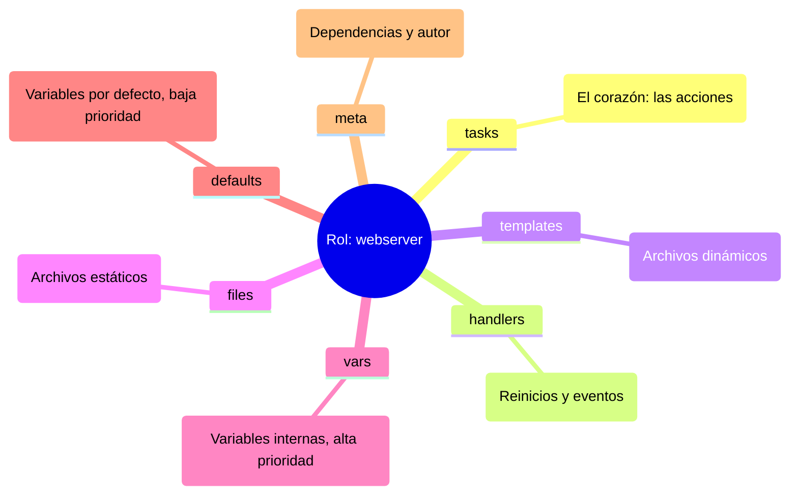

# Roles en Ansible y Ansible Galaxy: modulariza nuestro código

Hasta ahora hemos escrito playbooks lineales. Cuando un proyecto crece, esos ficheros se vuelven inmanejables. En este capítulo aprendemos a **modularizar nuestro código** con roles, reutilizamos trabajo de la comunidad con **Ansible Galaxy** y aplicamos **buenas prácticas** que mantendrán nuestro repositorio sano a largo plazo.

Los roles usan templates Jinja2 para generar configuraciones dinámicas — si necesitamos repasar la sintaxis de Jinja2, volvemos al [módulo 4](104.Modulos_idempotencia.md).


## Roles y modularidad 📦

Organizamos nuestro código como un profesional usando la estructura de roles.

:::info Video pendiente de grabación
:::

### Introducción: ¿por qué roles?

Hasta ahora, hemos escrito playbooks que son listas largas de tareas. Esto funciona bien para 10 o 20 tareas, pero ¿qué pasa cuando tenemos 500? ¿O cuando queremos configurar Nginx en 10 proyectos diferentes?

#### 🍝 La analogía: código espagueti vs. librerías
Imaginemos un libro de 1000 páginas sin capítulos ni índice. Eso es un playbook gigante. Es difícil de leer, difícil de mantener y casi imposible de reutilizar.

Los **roles** son como las **"habilidades" en un videojuego**.
*   Tenemos un personaje (servidor).
*   Queremos que sepa hacer magia (servidor web).
*   En lugar de enseñarle los movimientos uno a uno cada vez, le equipamos el libro de hechizos "Mago de Fuego" (rol `webserver`).
*   ¡Pum! Ahora sabe lanzar bolas de fuego (instalar nginx, configurar vhosts, abrir puertos) automáticamente.

### La estructura de un rol

Ansible espera una estructura de carpetas muy específica. Si la respetamos, la magia ocurre sola (autoloading).

#### 🌳 Anatomía visual



#### Diccionario de carpetas
*   **`tasks/`**: Aquí van los módulos (`apt`, `copy`, `service`). Es lo que antes teníamos en la sección `tasks:` del playbook.
*   **`handlers/`**: Los disparadores (`restart nginx`).
*   **`templates/`**: Nuestros archivos `.j2`.
*   **`files/`**: Archivos que se copian tal cual (certificados, imágenes).
*   **`defaults/`**: Variables con la prioridad **más baja**. Están hechas para ser sobrescritas fácilmente por el usuario del rol.
*   **`vars/`**: Variables con prioridad alta. Las usamos para constantes que rara vez cambian.
*   **`meta/`**: Metadatos del rol: información del autor, licencia y **dependencias** de otros roles.


### Creando nuestro primer rol

Vamos a refactorizar. Tomaremos el "código espagueti" de un servidor web y lo convertiremos en un rol elegante.

#### Paso 1: inicializar la estructura
Ansible tiene un comando para crear el esqueleto por nosotros:

```bash
ansible-galaxy init webserver
```

#### Paso 2: mover las piezas (refactorización)

Supongamos que teníamos este playbook espagueti que despliega varios contenedores:

```yaml
# old_playbook.yml (espagueti) ❌
- hosts: servers
  become: true
  tasks:
    - name: Desplegar PostgreSQL
      community.docker.docker_container:
        name: postgres
        image: postgres:16-alpine
        state: started
        restart_policy: unless-stopped
        env:
          POSTGRES_USER: postgres
          POSTGRES_PASSWORD: changeme
          POSTGRES_DB: quotes

    - name: Desplegar quotes API
      community.docker.docker_container:
        name: quotes
        image: pabpereza/quotes:latest
        state: started
        restart_policy: unless-stopped
        ports:
          - "8000:8000"
        env:
          POSTGRES_USER: postgres
          POSTGRES_PASSWORD: changeme
          POSTGRES_HOST: postgres
          POSTGRES_DB: quotes
```

Cuando necesitamos desplegar quotes en tres entornos distintos, copiamos y pegamos esas tareas cada vez. Cuando queremos cambiar la versión de la imagen, buscamos en 10 ficheros. **Eso es espagueti.**

Ahora, "descuartizamos" las tareas de Nginx y ponemos cada cosa en su lugar dentro de la carpeta `webserver/`:

**1. `roles/webserver/tasks/main.yml`**
```yaml
- name: Desplegar contenedor web
  community.docker.docker_container:
    name: "{{ container_name }}"
    image: "{{ container_image }}"
    state: started
    restart_policy: unless-stopped
    ports:
      - "{{ container_port }}:80"
    volumes:
      - "{{ html_root }}:/usr/share/nginx/html:ro"
  notify: Recrear contenedor
```

**2. `roles/webserver/handlers/main.yml`**
```yaml
- name: Recrear contenedor
  community.docker.docker_container:
    name: "{{ container_name }}"
    image: "{{ container_image }}"
    state: started
    restart_policy: unless-stopped
    recreate: true
```

**3. `roles/webserver/defaults/main.yml`**
```yaml
container_name: web
container_image: nginx:1.27-alpine
container_port: 80
html_root: /srv/web/html
```

#### Paso 3: el resultado final (limpio y profesional)

Nuestro playbook principal (`site.yml`) ahora queda así de minimalista:

```yaml
# site.yml (modular) ✅
- hosts: servers
  roles:
    - webserver
```

¡Y si mañana queremos usar una imagen distinta, cambiamos `container_image` en un sitio y listo! Podemos usar el rol `webserver` en cualquier proyecto simplemente añadiéndolo a nuestro `requirements.yml`.


### Dependencias entre roles

Los roles pueden depender de otros roles. Por ejemplo, si nuestro rol `quotes` necesita que primero esté corriendo el contenedor de base de datos y el proxy inverso, podemos declarar estas dependencias en el archivo `meta/main.yml`.

#### 🔗 Ejemplo de dependencias

**`roles/quotes/meta/main.yml`**
```yaml
dependencies:
  - role: postgres
    vars:
      postgres_password: "secreto123"
      db_port: 5432

  - role: webserver
    vars:
      container_image: pabpereza/quotes:latest
      container_port: 8000
```

#### ¿Cómo funciona?
1.  Cuando ejecutamos el rol `quotes`, Ansible primero levanta `database_container` y luego `webserver`.
2.  Los roles se ejecutan **solo una vez**, aunque múltiples roles los tengan como dependencia.
3.  Podemos pasar variables específicas a cada dependencia usando `vars:`.

#### Usar roles en playbooks con dependencias

```yaml
# site.yml
- hosts: servers
  roles:
    - quotes  # Ejecutará postgres → webserver → quotes
```


#### 💡 Buenas prácticas
*   **No abusemos**: Si tenemos 10 niveles de dependencias, algo está mal en nuestro diseño.
*   **Documentemos**: Siempre indicamos en el README qué roles son prerequisitos.
*   **Versionemos**: Si usamos roles de Galaxy, fijamos las versiones en `requirements.yml`.


### Ansible galaxy y collections

No reinventemos la rueda. Probablemente alguien ya ha creado el rol perfecto para instalar Docker, Kubernetes o MySQL.

#### 🌌 Ansible galaxy (el "app store")
Es el repositorio oficial de contenido comunitario.

*   **Buscar roles:** `ansible-galaxy search elasticsearch`
*   **Instalar un rol:** `ansible-galaxy install geerlingguy.elasticsearch`

#### 📦 Content collections (el nuevo estándar)
Antiguamente, Galaxy solo tenía roles. Ahora, con la complejidad de la nube, usamos **collections**.
Una collection es un paquete que incluye: **roles + módulos + plugins**.

Por ejemplo, la collection `amazon.aws` incluye módulos para EC2, S3, Lambda, etc.

##### Comandos esenciales

```bash
# Instalar una colección
ansible-galaxy collection install amazon.aws

# Listar lo que tienes instalado
ansible-galaxy collection list
```

##### Usando collections en un playbook
```yaml
- hosts: localhost
  collections:
    - amazon.aws  # Declaramos que usaremos esta colección
  tasks:
    - name: Crear instancia EC2
      ec2_instance:  # Módulo que viene dentro de la colección
        instance_type: t2.micro
```

### Resumen
1.  **Divide y vencerás:** Usamos roles para separar responsabilidades.
2.  **Estandaricemos:** Respetamos la estructura de carpetas (`tasks`, `vars`, `templates`) para que cualquiera entienda nuestro código.
3.  **Reutilicemos:** Antes de escribir código, buscamos en Ansible Galaxy. Si tenemos que escribirlo, lo hacemos pensando en que sea un rol genérico para el futuro.
4.  **Declaremos dependencias:** Usamos `meta/main.yml` para especificar qué roles necesita nuestro rol antes de ejecutarse.

## Ansible Galaxy y Collections 🌌

Aprendemos a reutilizar código de la comunidad y a compartir nuestros propios roles con el mundo.

### ¿Qué es Ansible Galaxy?

#### 🌟 La analogía: el "App Store" de Ansible
Imaginemos que necesitamos configurar un servidor con Docker. Podríamos escribir todas las tareas desde cero (instalar dependencias, añadir repositorios, configurar el daemon, etc.), o simplemente descargar un rol ya probado y mantenido por la comunidad.

**Ansible Galaxy** es el repositorio oficial donde miles de desarrolladores comparten roles, collections y plugins listos para usar.

#### 🎯 Ventajas de usar Galaxy
*   **Ahorro de tiempo**: No reinventemos la rueda. Usamos roles probados en producción.
*   **Calidad**: Los roles populares tienen miles de descargas y están bien mantenidos.
*   **Estandarización**: Aprendemos buenas prácticas viendo código de expertos.
*   **Comunidad**: Contribuimos con mejoras y reportamos bugs.

#### 🌐 Galaxy vs Collections
*   **Galaxy (tradicional)**: Repositorio de roles individuales.
*   **Collections (moderno)**: Paquetes que incluyen roles + módulos + plugins + documentación.


### Buscando roles en Galaxy

#### 🔍 Búsqueda desde línea de comandos

```bash
# Buscar roles relacionados con "docker"
ansible-galaxy search docker

# Buscar con un término más específico
ansible-galaxy search mysql --author geerlingguy

# Ver detalles de un rol específico
ansible-galaxy info geerlingguy.docker
```

#### 📊 Output de ejemplo

```bash
$ ansible-galaxy search nginx

Found 523 roles matching your search:

 Name                          Description
 ----                          -----------
 geerlingguy.nginx            Nginx installation for Linux
 jdauphant.nginx              Install and configure nginx
 nginxinc.nginx               Official NGINX role
 ...
```

#### 🌐 Búsqueda en la web
La forma más cómoda es buscar en [galaxy.ansible.com](https://galaxy.ansible.com):

*   **Filtros**: Por plataforma (Ubuntu, CentOS, etc.), categoría, autor.
*   **Métricas**: Descargas, estrellas, fecha de última actualización.
*   **Documentación**: README, dependencias, versiones compatibles.

#### 💡 Criterios para elegir un buen rol

| Criterio | ¿Qué buscar? |
|----------|-------------|
| **Popularidad** | Más de 1000 descargas, estrellas altas |
| **Mantenimiento** | Última actualización reciente (< 6 meses) |
| **Compatibilidad** | Soporta nuestra distribución y versión de Ansible |
| **Documentación** | README completo con ejemplos |
| **Licencia** | Open source (MIT, Apache, BSD) |


### Instalando roles desde Galaxy

#### 📥 Instalación básica

```bash
# Instalar un rol (se guarda en ~/.ansible/roles/)
ansible-galaxy install geerlingguy.docker

# Instalar en una ruta específica
ansible-galaxy install geerlingguy.nginx -p ./roles/

# Instalar una versión específica
ansible-galaxy install geerlingguy.mysql,3.4.0
```

#### 📦 Usando requirements.yml

Para proyectos profesionales, **nunca instalemos roles manualmente**. Usamos un archivo `requirements.yml` para documentar todas las dependencias.

**`requirements.yml`**
```yaml
# Roles desde Galaxy
roles:
  - name: geerlingguy.docker
    version: 6.1.0

  - name: geerlingguy.nginx
    version: 3.1.4

  - name: geerlingguy.mysql
    version: 4.3.3

  - name: geerlingguy.redis
    version: 1.8.0

# Collections
collections:
  - name: community.general
    version: 8.1.0

  - name: ansible.posix
    version: 1.5.4

  - name: amazon.aws
    version: 7.1.0
```

#### 🚀 Instalación desde requirements.yml

```bash
# Instalar todos los roles y collections del archivo
ansible-galaxy install -r requirements.yml

# Forzar reinstalación (útil para actualizar)
ansible-galaxy install -r requirements.yml --force

# Instalar en ruta específica
ansible-galaxy install -r requirements.yml -p ./roles/
```

#### 🔗 Instalando desde Git

Podemos instalar roles directamente desde repositorios Git (GitHub, GitLab, etc.):

**`requirements.yml`**
```yaml
roles:
  # Desde GitHub
  - src: https://github.com/usuario/mi-rol.git
    name: mi_rol_custom
    version: main  # Branch, tag o commit

  # Desde GitLab
  - src: git@gitlab.com:empresa/rol-interno.git
    name: rol_interno
    scm: git

  # Desde Galaxy con nombre personalizado
  - src: geerlingguy.apache
    name: apache_role
    version: 3.2.0
```


### Usando roles instalados en playbooks

Una vez instalados, los roles se usan como cualquier otro rol local:

#### 📝 Ejemplo: playbook con roles de Galaxy

**`site.yml`**
```yaml
- name: Configurar servidor web con roles de Galaxy
  hosts: servers
  become: true

  vars:
    # Variables para geerlingguy.docker
    docker_users:
      - deployer
      - jenkins

    # Variables para geerlingguy.nginx
    nginx_vhosts:
      - listen: "80"
        server_name: "ejemplo.com www.ejemplo.com"
        root: "/var/www/ejemplo"

  roles:
    - geerlingguy.docker
    - geerlingguy.nginx
    - geerlingguy.certbot

  post_tasks:
    - name: Verificar que Docker está corriendo
      service:
        name: docker
        state: started
```

#### 🔧 Sobrescribiendo variables de roles

Los roles de Galaxy suelen tener muchas variables configurables. Revisamos su documentación:

```bash
# Ver variables disponibles de un rol
cat ~/.ansible/roles/geerlingguy.docker/defaults/main.yml

# O en GitHub:
# https://github.com/geerlingguy/ansible-role-docker#role-variables
```

**Ejemplo de sobrescritura:**
```yaml
- hosts: servers
  roles:
    - role: geerlingguy.mysql
      vars:
        mysql_root_password: "secreto123"
        mysql_databases:
          - name: wordpress
            encoding: utf8mb4
        mysql_users:
          - name: wpuser
            password: "pass123"
            priv: "wordpress.*:ALL"
```


### Collections: el nuevo estándar

#### 📦 ¿Qué es una Collection?

Una **collection** es un paquete que puede incluir:
*   **Roles**: Como los tradicionales
*   **Módulos**: Nuevas funcionalidades (`aws_ec2`, `docker_container`)
*   **Plugins**: Filtros, callbacks, inventarios
*   **Documentación**: Guías y ejemplos

#### 🌍 Collections oficiales importantes

| Collection | Descripción | Ejemplo de uso |
|-----------|-------------|----------------|
| `community.general` | Módulos generales de la comunidad | `timezone`, `snap`, `git_config` |
| `ansible.posix` | Herramientas POSIX/Unix | `mount`, `sysctl`, `firewalld` |
| `amazon.aws` | Servicios de AWS | `ec2`, `s3`, `rds`, `lambda` |
| `azure.azcollection` | Microsoft Azure | `azure_rm_virtualmachine` |
| `google.cloud` | Google Cloud Platform | `gcp_compute_instance` |
| `community.docker` | Gestión de Docker | `docker_container`, `docker_image` |
| `community.mysql` | Base de datos MySQL | `mysql_db`, `mysql_user` |
| `community.kubernetes` | Kubernetes/K8s | `k8s`, `helm` |

#### 📥 Instalando collections

```bash
# Instalar una collection
ansible-galaxy collection install community.general

# Instalar versión específica
ansible-galaxy collection install amazon.aws:7.1.0

# Instalar desde requirements.yml
ansible-galaxy collection install -r requirements.yml

# Listar collections instaladas
ansible-galaxy collection list

# Ver información de una collection
ansible-galaxy collection info community.docker
```

#### 🗂️ Ubicación de collections

Las collections se instalan en:
*   Sistema: `/usr/share/ansible/collections/`
*   Usuario: `~/.ansible/collections/ansible_collections/`
*   Proyecto: `./collections/ansible_collections/`

#### 📝 Usando collections en playbooks

**Opción 1: Declarar a nivel de play**
```yaml
- name: Gestionar AWS EC2
  hosts: localhost
  collections:
    - amazon.aws  # Todos los módulos de esta collection están disponibles

  tasks:
    - name: Crear instancia EC2
      ec2_instance:  # Módulo de amazon.aws
        name: target1
        instance_type: t3.micro
        image_id: ami-0c55b159cbfafe1f0
        region: us-east-1
        key_name: mi-llave
        state: running
```

**Opción 2: Usar FQCN (Fully Qualified Collection Name)**
```yaml
- name: Gestionar Docker
  hosts: servidores
  tasks:
    - name: Crear contenedor Nginx
      community.docker.docker_container:  # FQCN completo
        name: nginx
        image: nginx:latest
        ports:
          - "80:80"
        state: started

    - name: Configurar timezone
      community.general.timezone:  # FQCN completo
        name: Europe/Madrid
```

**Recomendación**: Usamos FQCN para evitar conflictos si dos collections tienen módulos con el mismo nombre.


### Creando y publicando nuestro propio rol

#### 🛠️ Paso 1: Inicializar el rol

```bash
# Crear estructura del rol
ansible-galaxy init webserver

# Estructura generada:
# webserver/
# ├── README.md
# ├── defaults/
# │   └── main.yml
# ├── files/
# ├── handlers/
# │   └── main.yml
# ├── meta/
# │   └── main.yml
# ├── tasks/
# │   └── main.yml
# ├── templates/
# ├── tests/
# │   ├── inventory
# │   └── test.yml
# └── vars/
#     └── main.yml
```

#### 📝 Paso 2: Escribir el código del rol

**`tasks/main.yml`**
```yaml
- name: Desplegar contenedor web
  community.docker.docker_container:
    name: "{{ container_name }}"
    image: "{{ container_image }}"
    state: started
    restart_policy: unless-stopped
    ports:
      - "{{ container_port }}:80"
    volumes:
      - "{{ html_root }}:/usr/share/nginx/html:ro"
    env: "{{ container_env | default({}) }}"
  notify: Recrear contenedor
```

**`defaults/main.yml`**
```yaml
container_name: web
container_image: nginx:1.27-alpine
container_port: 80
html_root: /srv/web/html
container_env: {}
```

**`handlers/main.yml`**
```yaml
- name: Recrear contenedor
  community.docker.docker_container:
    name: "{{ container_name }}"
    image: "{{ container_image }}"
    state: started
    restart_policy: unless-stopped
    recreate: true
```

#### 📄 Paso 3: Documentar en meta/main.yml

**`meta/main.yml`**
```yaml
galaxy_info:
  author: Tu Nombre
  description: Despliegue de Nginx como contenedor Docker
  company: Tu Empresa (opcional)
  license: MIT
  min_ansible_version: "2.14"

  platforms:
    - name: Ubuntu
      versions:
        - focal
        - jammy
    - name: Debian
      versions:
        - bullseye
        - bookworm

  galaxy_tags:
    - docker
    - containers
    - web
    - nginx

dependencies: []
```

#### ✍️ Paso 4: Escribir README.md completo

**`README.md`**
```markdown
# Rol Ansible: webserver

Despliega Nginx como contenedor Docker en servidores Linux.

## Requisitos

- Ansible >= 2.14
- Colección `community.docker` instalada (`ansible-galaxy collection install community.docker`)
- Docker instalado en los hosts destino

## Variables

| Variable | Default | Descripción |
|----------|---------|-------------|
| `container_name` | `web` | Nombre del contenedor |
| `container_image` | `nginx:1.27-alpine` | Imagen Docker |
| `container_port` | `80` | Puerto externo |
| `html_root` | `/srv/web/html` | Directorio con el HTML estático |
| `container_env` | `{}` | Variables de entorno del contenedor |

## Ejemplo de uso

```yaml
- hosts: servers
  roles:
    - role: webserver
      vars:
        container_name: mi_sitio
        container_port: 8080
        html_root: /data/html
```

## Licencia

MIT

## Autor

Tu Nombre (@tu_usuario)
```

#### 🧪 Paso 5: Probar el rol localmente

```bash
# Ejecutar el test incluido
ansible-playbook tests/test.yml -i tests/inventory

# O crear un playbook de prueba
cat > test-rol.yml <<EOF
- hosts: localhost
  become: true
  roles:
    - webserver
EOF

ansible-playbook test-rol.yml
```

#### 📤 Paso 6: Publicar en Galaxy

**6.1. Subir a GitHub**
```bash
cd webserver
git init
git add .
git commit -m "Versión inicial"
git remote add origin https://github.com/tu_usuario/ansible-role-webserver.git
git push -u origin main

# Crear un tag de versión
git tag 1.0.0
git push origin 1.0.0
```

**6.2. Importar en Galaxy**
1. Vamos a [galaxy.ansible.com](https://galaxy.ansible.com)
2. Iniciamos sesión con GitHub
3. Vamos a "My Content" → "Add Content"
4. Seleccionamos nuestro repositorio `ansible-role-apache`
5. Galaxy importará automáticamente nuestro rol

**6.3. Actualizar versiones**
```bash
# Hacer cambios en el código
git add .
git commit -m "Añadida compatibilidad con SSL"
git tag 1.1.0
git push origin main --tags

# Galaxy detectará el nuevo tag automáticamente
```


### Buenas prácticas con Galaxy

#### ✅ DO:

*   **Fijamos versiones en requirements.yml**: Evitamos sorpresas con actualizaciones.
*   **Leemos el README antes de instalar**: Entendemos qué hace el rol.
*   **Revisamos el código**: Especialmente en roles con pocos downloads.
*   **Contribuimos con issues y PRs**: Ayudamos a mejorar los roles que usamos.
*   **Usamos FQCN en collections**: Mayor claridad y evitamos conflictos.

#### ❌ DON'T:

*   **No usemos roles sin mantenimiento**: Buscamos alternativas activas.
*   **No instalemos sin probar primero**: Usamos `--check` mode.
*   **No expongamos credenciales**: Usamos Ansible Vault para secretos.
*   **No dependamos de un solo rol**: Tenemos un plan B si el autor lo abandona.

#### 🔒 Seguridad

```bash
# Verificar el código antes de ejecutar
cat ~/.ansible/roles/nombre_rol/tasks/main.yml

# Ejecutar en modo dry-run
ansible-playbook site.yml --check

# Limitar a un host de pruebas primero
ansible-playbook site.yml --limit test-server
```


### Creando nuestra propia collection

#### 🎯 Cuándo crear una collection

Creamos una collection cuando tengamos:
*   Múltiples roles relacionados
*   Módulos personalizados
*   Plugins o filtros custom
*   Documentación extensa

#### 🛠️ Inicializar collection

```bash
# Crear estructura de collection
ansible-galaxy collection init mi_namespace.mi_collection

# Estructura generada:
# mi_namespace/
# └── mi_collection/
#     ├── README.md
#     ├── galaxy.yml        # Metadatos de la collection
#     ├── docs/
#     ├── plugins/
#     │   ├── modules/      # Tus módulos custom
#     │   ├── inventory/
#     │   ├── lookup/
#     │   └── filter/
#     ├── roles/            # Roles incluidos
#     └── playbooks/        # Playbooks de ejemplo
```

#### 📝 Configurar galaxy.yml

**`galaxy.yml`**
```yaml
namespace: mi_namespace
name: mi_collection
version: 1.0.0
readme: README.md
authors:
  - Tu Nombre <email@ejemplo.com>

description: Collection para gestión de infraestructura web

license:
  - MIT

tags:
  - web
  - infrastructure
  - automation

dependencies: {}

repository: https://github.com/tu_usuario/mi_collection
documentation: https://docs.ejemplo.com
homepage: https://ejemplo.com
issues: https://github.com/tu_usuario/mi_collection/issues
```

#### 📦 Build y publicar

```bash
# Construir la collection (crea un .tar.gz)
ansible-galaxy collection build

# Publicar en Galaxy (necesitas API key)
ansible-galaxy collection publish mi_namespace-mi_collection-1.0.0.tar.gz --api-key=TU_API_KEY

# Instalar localmente para pruebas
ansible-galaxy collection install ./mi_namespace-mi_collection-1.0.0.tar.gz
```


### Ejemplo completo: proyecto con Galaxy

**Estructura del proyecto:**
```
mi-proyecto/
├── ansible.cfg
├── requirements.yml
├── inventory/
│   └── hosts.yml
├── group_vars/
│   └── all.yml
├── playbooks/
│   └── site.yml
└── roles/            # Roles locales custom
    └── mi_rol/
```

**`ansible.cfg`**
```ini
[defaults]
roles_path = ./roles:~/.ansible/roles
collections_path = ./collections:~/.ansible/collections
inventory = inventory/hosts.yml
```

**`requirements.yml`**
```yaml
roles:
  - name: geerlingguy.docker
    version: 6.1.0
  - name: geerlingguy.nginx
    version: 3.1.4

collections:
  - name: community.general
    version: 8.1.0
  - name: community.docker
    version: 3.4.11
```

**Workflow:**
```bash
# 1. Instalar dependencias
ansible-galaxy install -r requirements.yml

# 2. Ejecutar playbook
ansible-playbook playbooks/site.yml

# 3. Actualizar dependencias cuando sea necesario
ansible-galaxy install -r requirements.yml --force
```


### Comandos de referencia rápida

```bash
# === ROLES ===
# Buscar roles
ansible-galaxy search <término>

# Instalar rol
ansible-galaxy install <autor>.<rol>

# Instalar desde requirements
ansible-galaxy install -r requirements.yml

# Listar roles instalados
ansible-galaxy list

# Eliminar rol
ansible-galaxy remove <autor>.<rol>

# Ver información de un rol
ansible-galaxy info <autor>.<rol>

# === COLLECTIONS ===
# Buscar collections
ansible-galaxy collection search <término>

# Instalar collection
ansible-galaxy collection install <namespace>.<collection>

# Listar collections instaladas
ansible-galaxy collection list

# Ver información
ansible-galaxy collection info <namespace>.<collection>

# === CREACIÓN ===
# Inicializar rol
ansible-galaxy init <nombre_rol>

# Inicializar collection
ansible-galaxy collection init <namespace>.<collection>

# Build collection
ansible-galaxy collection build

# Publicar collection
ansible-galaxy collection publish <archivo.tar.gz> --api-key=<KEY>
```


### Resumen

En este capítulo hemos aprendido:

✅ **Qué es Ansible Galaxy**: El repositorio oficial de contenido de la comunidad.
✅ **Buscar e instalar roles**: Cómo encontrar y usar roles de calidad.
✅ **Requirements.yml**: Gestión profesional de dependencias.
✅ **Collections**: El nuevo estándar que incluye roles, módulos y plugins.
✅ **Publicar nuestro contenido**: Compartimos nuestros roles con la comunidad.
✅ **Buenas prácticas**: Seguridad, versiones fijas y documentación.

#### 💡 Puntos clave

1.  **No reinventemos la rueda**: Usamos roles de Galaxy cuando sea posible.
2.  **Fijamos versiones**: `requirements.yml` es nuestro mejor amigo.
3.  **Leemos el código**: Especialmente de roles con pocos usuarios.
4.  **Contribuimos**: Reportamos bugs, enviamos PRs, mejoramos la comunidad.
5.  **Usamos FQCN**: Claridad y compatibilidad a largo plazo.


