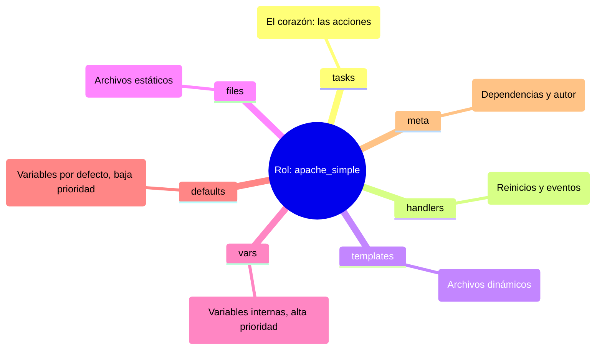

# Roles y modularidad 📦

Organiza tu código como un profesional usando la estructura de roles.

:::info Video pendiente de grabación
:::

## 7.1. Introducción: ¿por qué roles?

Hasta ahora, hemos escrito playbooks que son listas largas de tareas. Esto funciona bien para 10 o 20 tareas, pero ¿qué pasa cuando tienes 500? ¿O cuando quieres configurar Nginx en 10 proyectos diferentes?

### 🍝 La analogía: código espagueti vs. librerías
Imagina un libro de 1000 páginas sin capítulos ni índice. Eso es un playbook gigante. Es difícil de leer, difícil de mantener y casi imposible de reutilizar.

Los **roles** son como las **"habilidades" en un videojuego**.
*   Tienes un personaje (servidor).
*   Quieres que sepa hacer magia (servidor web).
*   En lugar de enseñarle los movimientos uno a uno cada vez, le equipas el libro de hechizos "Mago de Fuego" (rol `webserver`).
*   ¡Pum! Ahora sabe lanzar bolas de fuego (instalar nginx, configurar vhosts, abrir puertos) automáticamente.

## 7.2. La estructura de un rol

Ansible espera una estructura de carpetas muy específica. Si la respetas, la magia ocurre sola (autoloading).

### 🌳 Anatomía visual



### Diccionario de carpetas
*   **`tasks/`**: Aquí van los módulos (`apt`, `copy`, `service`). Es lo que antes tenías en la sección `tasks:` del playbook.
*   **`handlers/`**: Los disparadores (`restart nginx`).
*   **`templates/`**: Tus archivos `.j2`.
*   **`files/`**: Archivos que se copian tal cual (certificados, imágenes).
*   **`defaults/`**: Variables con la prioridad **más baja**. Están hechas para ser sobrescritas fácilmente por el usuario del rol.
*   **`vars/`**: Variables con prioridad alta. Úsalas para constantes que rara vez cambian.

---

## 7.3. Manos a la obra: creando tu primer rol

Vamos a refactorizar. Tomaremos el "código espagueti" de un servidor web y lo convertiremos en un rol elegante.

### Paso 1: inicializar la estructura
Ansible tiene un comando para crear el esqueleto por ti:

```bash
ansible-galaxy init apache_simple
```

### Paso 2: mover las piezas (refactorización)

Supongamos que tenías este playbook antiguo:

```yaml
# old_playbook.yml (espagueti) ❌
- hosts: webservers
  vars:
    http_port: 80
  tasks:
    - name: Instalar Apache
      apt: name=apache2 state=present
    - name: Copiar config
      template: src=templates/httpd.conf.j2 dest=/etc/apache2/httpd.conf
      notify: Reiniciar Apache
  handlers:
    - name: Reiniciar Apache
      service: name=apache2 state=restarted
```

Ahora, "descuartizamos" este archivo y ponemos cada cosa en su lugar dentro de la carpeta `apache_simple/`:

**1. `roles/apache_simple/tasks/main.yml`**
```yaml
---
- name: Instalar Apache
  apt:
    name: apache2
    state: present

- name: Copiar config
  template:
    src: httpd.conf.j2  # Nota: Ya no hace falta poner "templates/" delante
    dest: /etc/apache2/httpd.conf
  notify: Reiniciar Apache
```

**2. `roles/apache_simple/handlers/main.yml`**
```yaml
---
- name: Reiniciar Apache
  service:
    name: apache2
    state: restarted
```

**3. `roles/apache_simple/defaults/main.yml`**
```yaml
---
http_port: 80
```

### Paso 3: el resultado final (limpio y profesional)

Tu playbook principal (`site.yml`) ahora queda así de minimalista:

```yaml
# site.yml (modular) ✅
- hosts: webservers
  roles:
    - apache_simple
```

¡De 15 líneas a 3! Y lo mejor: puedes usar `apache_simple` en cualquier otro proyecto simplemente copiando la carpeta.

---

## 7.4. Ansible galaxy y collections

No reinventes la rueda. Probablemente alguien ya ha creado el rol perfecto para instalar Docker, Kubernetes o MySQL.

### 🌌 Ansible galaxy (el "app store")
Es el repositorio oficial de contenido comunitario.

*   **Buscar roles:** `ansible-galaxy search elasticsearch`
*   **Instalar un rol:** `ansible-galaxy install geerlingguy.elasticsearch`

### 📦 Content collections (el nuevo estándar)
Antiguamente, Galaxy solo tenía roles. Ahora, con la complejidad de la nube, usamos **collections**.
Una collection es un paquete que incluye: **roles + módulos + plugins**.

Por ejemplo, la collection `amazon.aws` incluye módulos para EC2, S3, Lambda, etc.

#### Comandos esenciales

```bash
# Instalar una colección
ansible-galaxy collection install amazon.aws

# Listar lo que tienes instalado
ansible-galaxy collection list
```

#### Usando collections en un playbook
```yaml
- hosts: localhost
  collections:
    - amazon.aws  # Declaramos que usaremos esta colección
  tasks:
    - name: Crear instancia EC2
      ec2_instance:  # Módulo que viene dentro de la colección
        instance_type: t2.micro
```

## Resumen
1.  **Divide y vencerás:** Usa roles para separar responsabilidades.
2.  **Estandariza:** Respeta la estructura de carpetas (`tasks`, `vars`, `templates`) para que cualquiera entienda tu código.
3.  **Reutiliza:** Antes de escribir código, busca en Ansible Galaxy. Si tienes que escribirlo, hazlo pensando en que sea un rol genérico para el futuro.
