# Roles y Modularidad 📦

Organiza tu código como un profesional usando la estructura de Roles.

:::info Video pendiente de grabación
:::

## 7.1. Introducción: ¿Por qué Roles?

Hasta ahora, hemos escrito Playbooks que son listas largas de tareas. Esto funciona bien para 10 o 20 tareas, pero ¿qué pasa cuando tienes 500? ¿O cuando quieres configurar Nginx en 10 proyectos diferentes?

### 🍝 La Analogía: Código Espagueti vs. Librerías
Imagina un libro de 1000 páginas sin capítulos ni índice. Eso es un Playbook gigante. Es difícil de leer, difícil de mantener y casi imposible de reutilizar.

Los **Roles** son como las **"Habilidades" en un videojuego**.
*   Tienes un personaje (Servidor).
*   Quieres que sepa hacer magia (Servidor Web).
*   En lugar de enseñarle los movimientos uno a uno cada vez, le equipas el libro de hechizos "Mago de Fuego" (Rol `webserver`).
*   ¡Pum! Ahora sabe lanzar bolas de fuego (instalar nginx, configurar vhosts, abrir puertos) automáticamente.

## 7.2. La Estructura de un Rol

Ansible espera una estructura de carpetas muy específica. Si la respetas, la magia ocurre sola (autoloading).

### 🌳 Anatomía Visual

```mermaid
mindmap
  root((Rol: apache_simple))
    tasks
      main.yml (El corazón: las acciones)
    handlers
      main.yml (Reinicios y eventos)
    templates
      index.html.j2 (Archivos dinámicos)
    files
      logo.png (Archivos estáticos)
    vars
      main.yml (Variables internas, alta prioridad)
    defaults
      main.yml (Variables por defecto, baja prioridad)
    meta
      main.yml (Dependencias y autor)
```



### Diccionario de Carpetas
*   **`tasks/`**: Aquí van los módulos (`apt`, `copy`, `service`). Es lo que antes tenías en la sección `tasks:` del playbook.
*   **`handlers/`**: Los disparadores (`restart nginx`).
*   **`templates/`**: Tus archivos `.j2`.
*   **`files/`**: Archivos que se copian tal cual (certificados, imágenes).
*   **`defaults/`**: Variables con la prioridad **más baja**. Están hechas para ser sobrescritas fácilmente por el usuario del rol.
*   **`vars/`**: Variables con prioridad alta. Úsalas para constantes que rara vez cambian.

---

## 7.3. Manos a la Obra: Creando tu primer Rol

Vamos a refactorizar. Tomaremos el "código espagueti" de un servidor web y lo convertiremos en un Rol elegante.

### Paso 1: Inicializar la estructura
Ansible tiene un comando para crear el esqueleto por ti:

```bash
ansible-galaxy init apache_simple
```

### Paso 2: Mover las piezas (Refactorización)

Supongamos que tenías este Playbook antiguo:

```yaml
# OLD_PLAYBOOK.yml (Espagueti) ❌
- hosts: webservers
  vars:
    http_port: 80
  tasks:
    - name: Instalar Apache
      apt: name=apache2 state=present
    - name: Copiar config
      template: src=templates/httpd.conf.j2 dest=/etc/apache2/httpd.conf
      notify: Reiniciar Apache
  handlers:
    - name: Reiniciar Apache
      service: name=apache2 state=restarted
```

Ahora, "descuartizamos" este archivo y ponemos cada cosa en su lugar dentro de la carpeta `apache_simple/`:

**1. `roles/apache_simple/tasks/main.yml`**
```yaml
---
- name: Instalar Apache
  apt:
    name: apache2
    state: present

- name: Copiar config
  template:
    src: httpd.conf.j2  # Nota: Ya no hace falta poner "templates/" delante
    dest: /etc/apache2/httpd.conf
  notify: Reiniciar Apache
```

**2. `roles/apache_simple/handlers/main.yml`**
```yaml
---
- name: Reiniciar Apache
  service:
    name: apache2
    state: restarted
```

**3. `roles/apache_simple/defaults/main.yml`**
```yaml
---
http_port: 80
```

### Paso 3: El Resultado Final (Limpio y Profesional)

Tu playbook principal (`site.yml`) ahora queda así de minimalista:

```yaml
# SITE.yml (Modular) ✅
- hosts: webservers
  roles:
    - apache_simple
```

¡De 15 líneas a 3! Y lo mejor: puedes usar `apache_simple` en cualquier otro proyecto simplemente copiando la carpeta.

---

## 7.4. Ansible Galaxy y Collections

No reinventes la rueda. Probablemente alguien ya ha creado el rol perfecto para instalar Docker, Kubernetes o MySQL.

### 🌌 Ansible Galaxy (El "App Store")
Es el repositorio oficial de contenido comunitario.

*   **Buscar roles:** `ansible-galaxy search elasticsearch`
*   **Instalar un rol:** `ansible-galaxy install geerlingguy.elasticsearch`

### 📦 Content Collections (El Nuevo Estándar)
Antiguamente, Galaxy solo tenía Roles. Ahora, con la complejidad de la nube, usamos **Collections**.
Una Collection es un paquete que incluye: **Roles + Módulos + Plugins**.

Por ejemplo, la colección `amazon.aws` incluye módulos para EC2, S3, Lambda, etc.

#### Comandos Esenciales

```bash
# Instalar una colección
ansible-galaxy collection install amazon.aws

# Listar lo que tienes instalado
ansible-galaxy collection list
```

#### Usando Collections en un Playbook
```yaml
- hosts: localhost
  collections:
    - amazon.aws  # Declaramos que usaremos esta colección
  tasks:
    - name: Crear instancia EC2
      ec2_instance:  # Módulo que viene dentro de la colección
        instance_type: t2.micro
```

## Resumen
1.  **Divide y vencerás:** Usa Roles para separar responsabilidades.
2.  **Estandariza:** Respeta la estructura de carpetas (`tasks`, `vars`, `templates`) para que cualquiera entienda tu código.
3.  **Reutiliza:** Antes de escribir código, busca en Ansible Galaxy. Si tienes que escribirlo, hazlo pensando en que sea un Rol genérico para el futuro.
