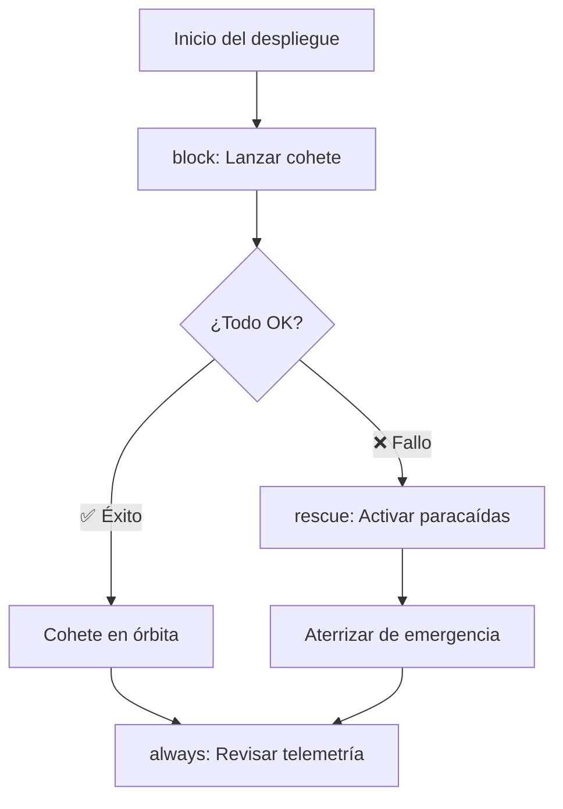
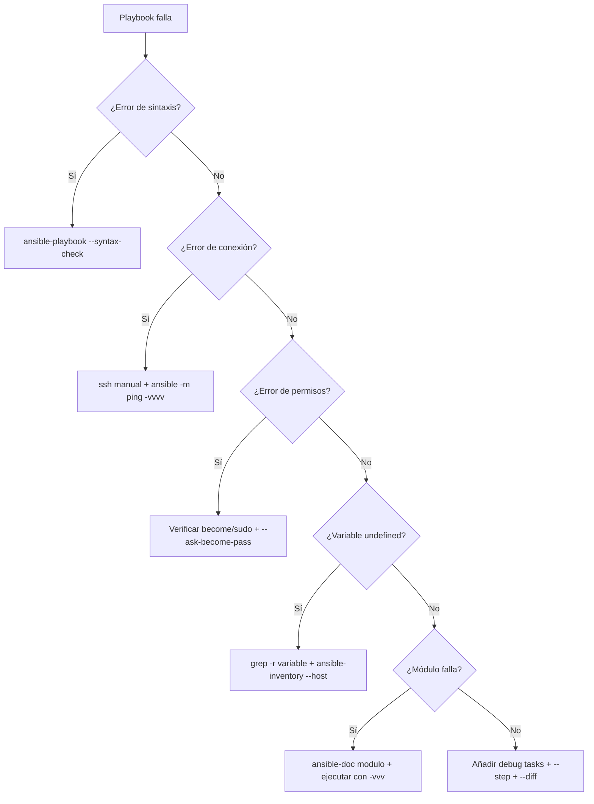
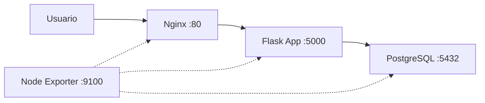

# Automatización en Entornos Reales 🏭

Llegamos al capítulo donde Ansible deja de ser un juguete de laboratorio y entra en producción. Aquí cubrimos **lo que sale mal cuando algo sale mal** (manejo de errores), **cómo encontrar el problema cuando un playbook revienta a las 3 AM** (depuración) y **un proyecto integrador completo** que une todo lo aprendido: el despliegue de NotaStack.

## 📋 Contenido del capítulo

1. [Manejo de errores](#manejo-de-errores-️) — `block`/`rescue`/`always`, `failed_when`, `ignore_errors` y patrones de tolerancia a fallos.
2. [Depuración y troubleshooting](#depuración-y-troubleshooting-) — `--check`, `--diff`, módulo `debug`, verbosity y técnicas de bisección.
3. [Proyecto final: desplegando NotaStack](#proyecto-final-desplegando-notastack) — Aplicación completa con base de datos, backend, frontend y proxy reverso desplegada con roles, vault e inventarios separados por entorno.


---


## Manejo de Errores 🛡️

Cómo hacer que tus playbooks sean resistentes a fallos y reaccionen de forma inteligente.

:::info Video pendiente de grabación
:::

### 11.1. El Problema: Playbooks Frágiles

Cuando un playbook falla, Ansible se detiene inmediatamente. Eso puede ser catastrófico si estás a mitad de un despliegue en producción. Necesitas mecanismos para:
- **Ignorar** errores esperados
- **Capturar** fallos y ejecutar acciones de recuperación
- **Controlar** qué se considera un fallo
- **Validar** condiciones antes de continuar

#### 🏥 La Analogía: El Plan de Emergencia del Hospital

Un hospital no cierra si falla la luz. Tiene un plan B:
1. **Intenta** usar la electricidad normal (block)
2. **Si falla**, activa el generador de emergencia (rescue)
3. **Siempre** notifica al equipo de mantenimiento (always)

Ansible funciona exactamente igual con `block`, `rescue` y `always`.


### 11.2. `ignore_errors`: La Tirita Rápida

La forma más simple de manejar errores: decirle a Ansible "si falla, sigue adelante".

```yaml
- name: Intentar detener un servicio que puede no existir
  systemd:
    name: servicio-opcional
    state: stopped
  ignore_errors: yes
```

#### ⚠️ Cuándo usarlo y cuándo NO

**✅ Usar para:**
- Servicios que pueden no existir en todos los servidores
- Comprobaciones previas donde el fallo es esperado
- Limpieza de recursos que pueden no estar presentes

**❌ NO usar para:**
- Tareas críticas donde un fallo indica un problema real
- Sustituir una lógica de manejo de errores adecuada
- "Tapar" errores sin entenderlos

```yaml
# ❌ MAL: Ignorar un error crítico sin más
- name: Instalar dependencia esencial
  apt:
    name: paquete-critico
    state: present
  ignore_errors: yes  # Si esto falla, todo lo demás fallará también

# ✅ BIEN: Ignorar solo lo esperado
- name: Eliminar archivo temporal que puede no existir
  file:
    path: /tmp/deploy-lock.pid
    state: absent
  ignore_errors: yes
```


### 11.3. `block`, `rescue` y `always`: El Trío de Oro

Esta es la forma profesional de manejar errores en Ansible. Funciona igual que `try`, `catch`, `finally` en programación.

#### Estructura Básica

```yaml
- name: Despliegue con protección ante errores
  block:
    # === TRY: Lo que quieres hacer ===
    - name: Descargar nueva versión de la app
      get_url:
        url: "https://releases.ejemplo.com/app-{{ version }}.tar.gz"
        dest: /tmp/app.tar.gz

    - name: Desplegar nueva versión
      unarchive:
        src: /tmp/app.tar.gz
        dest: /opt/app/
        remote_src: yes

    - name: Reiniciar aplicación
      systemd:
        name: myapp
        state: restarted

  rescue:
    # === CATCH: Si algo falla en el block ===
    - name: Registrar el fallo
      debug:
        msg: "¡FALLO EN EL DESPLIEGUE! Iniciando rollback..."

    - name: Restaurar versión anterior
      copy:
        src: /opt/app/backup/
        dest: /opt/app/current/
        remote_src: yes

    - name: Reiniciar con versión anterior
      systemd:
        name: myapp
        state: restarted

  always:
    # === FINALLY: Siempre se ejecuta ===
    - name: Limpiar archivos temporales
      file:
        path: /tmp/app.tar.gz
        state: absent

    - name: Enviar notificación al equipo
      debug:
        msg: "Proceso de despliegue completado (éxito o rollback)"
```

#### 🎬 La Analogía: Lanzamiento de Cohete



#### Ejemplo Real: Actualización de Base de Datos

```yaml
- name: Migración de base de datos con protección
  hosts: dbservers
  become: yes

  tasks:
    - name: Migración segura de base de datos
      block:
        - name: Crear backup antes de migrar
          shell: |
            mysqldump --all-databases > /backup/pre-migration-$(date +%Y%m%d).sql
          register: backup_result

        - name: Ejecutar migración
          shell: mysql < /opt/migrations/v2.0.sql
          register: migration_result

        - name: Verificar integridad
          shell: mysqlcheck --all-databases --check
          register: check_result

      rescue:
        - name: La migración falló, restaurar backup
          shell: mysql < /backup/pre-migration-*.sql

        - name: Notificar al equipo de DB
          debug:
            msg: |
              ❌ Migración fallida.
              Backup restaurado automáticamente.
              Error: {{ ansible_failed_result.msg | default('Desconocido') }}

      always:
        - name: Registrar resultado en log
          lineinfile:
            path: /var/log/migrations.log
            line: "{{ ansible_date_time.iso8601 }} - Migración v2.0 - {{ 'OK' if migration_result is defined and migration_result.rc == 0 else 'FALLIDA' }}"
            create: yes
```


### 11.4. `failed_when`: Redefinir qué es un Fallo

A veces Ansible piensa que algo falló cuando en realidad está todo bien, o viceversa. Con `failed_when` tú decides qué es un fallo.

#### 🚦 La Analogía: El Detector de Humo

Un detector de humo convencional salta con cualquier humo, incluido el de cocinar. `failed_when` es como configurar el detector para que solo salte con humo real de incendio.

```yaml
# El comando grep devuelve rc=1 si no encuentra nada.
# Ansible lo interpreta como "error", pero NO lo es.

# ❌ Sin failed_when (Ansible cree que falló)
- name: Buscar errores en el log
  shell: grep "ERROR" /var/log/app.log
  register: log_errors
  # Si no hay errores, grep devuelve rc=1 → Ansible dice "FAILED"

# ✅ Con failed_when (tú defines el fallo)
- name: Buscar errores en el log
  shell: grep "ERROR" /var/log/app.log
  register: log_errors
  failed_when: log_errors.rc not in [0, 1]
  # rc=0 → encontró errores (ok, queremos saberlo)
  # rc=1 → no encontró errores (ok, mejor aún)
  # rc=2+ → algo raro pasó con grep (ESTO sí es un error)
```

#### Más Ejemplos Prácticos

```yaml
- name: Verificar que la API responde correctamente
  uri:
    url: "http://localhost:{{ app_port }}/health"
    return_content: yes
  register: health_check
  failed_when: "'healthy' not in health_check.content"

- name: Ejecutar script de validación
  shell: /opt/scripts/validate.sh
  register: validation
  failed_when:
    - validation.rc != 0
    - "'WARNING' not in validation.stdout"
  # Falla SOLO si el rc no es 0 Y no hay un warning esperado
```


### 11.5. `changed_when`: Controlar Cuándo Ansible Reporta Cambios

Ansible marca una tarea como "changed" cuando modifica algo. Pero con comandos `shell` o `command`, siempre dice "changed" aunque no haya cambiado nada. Eso rompe la **idempotencia** y activa handlers innecesariamente.

#### El Problema

```yaml
# ❌ Siempre reporta "changed", aunque no haga nada
- name: Verificar versión de la app
  shell: /opt/app/bin/app --version
  register: app_version
  # changed: true (SIEMPRE, aunque solo leyó la versión)
```

#### La Solución

```yaml
# ✅ Solo reporta "changed" si realmente cambió algo
- name: Verificar versión de la app
  shell: /opt/app/bin/app --version
  register: app_version
  changed_when: false  # Este comando NUNCA cambia nada

- name: Aplicar migración solo si es necesaria
  shell: /opt/app/bin/migrate --check-and-apply
  register: migration
  changed_when: "'Applied' in migration.stdout"
  # Solo "changed" si realmente aplicó una migración
```

#### Ejemplo Completo: Script de Backup Inteligente

```yaml
- name: Ejecutar backup incremental
  shell: |
    /usr/local/bin/backup.sh --incremental --output-stats
  register: backup_result
  changed_when: "'New files: 0' not in backup_result.stdout"
  failed_when: backup_result.rc != 0
  notify: Enviar reporte de backup

# El handler solo se ejecuta si el backup realmente copió archivos nuevos
```


### 11.6. `assert`: Validar Antes de Actuar

El módulo `assert` es como un **guardia de seguridad** en la puerta. Verifica condiciones antes de que el playbook haga algo peligroso.

```yaml
- name: Validaciones previas al despliegue en producción
  hosts: production
  become: yes

  tasks:
    - name: Verificar requisitos mínimos del servidor
      assert:
        that:
          - ansible_memtotal_mb >= 4096
          - ansible_processor_vcpus >= 2
          - ansible_mounts | selectattr('mount', 'equalto', '/') | map(attribute='size_available') | first > 5368709120
        fail_msg: |
          ❌ El servidor no cumple los requisitos mínimos:
          - RAM: {{ ansible_memtotal_mb }}MB (mínimo 4096MB)
          - CPUs: {{ ansible_processor_vcpus }} (mínimo 2)
        success_msg: "✅ Servidor validado. Procediendo con el despliegue."

    - name: Verificar que la versión es correcta
      assert:
        that:
          - app_version is defined
          - app_version is match('^[0-9]+\.[0-9]+\.[0-9]+$')
        fail_msg: "La versión '{{ app_version | default('NO DEFINIDA') }}' no es válida. Formato esperado: X.Y.Z"

    - name: Verificar conectividad con servicios externos
      uri:
        url: "https://api.ejemplo.com/status"
        status_code: 200
      register: api_status

    - name: Confirmar que la API está operativa
      assert:
        that:
          - api_status.status == 200
        fail_msg: "La API externa no está disponible. Abortando despliegue."
```


### 11.7. `any_errors_fatal`: Parar Todo si Uno Falla

Cuando despliegas en múltiples servidores, a veces necesitas que si **uno** falla, se detengan **todos**. Es la diferencia entre un fallo parcial controlado y un desastre.

```yaml
- name: Actualización crítica en cluster
  hosts: webservers
  any_errors_fatal: true  # Si un servidor falla, TODOS paran
  serial: 2               # Desplegar de 2 en 2

  tasks:
    - name: Actualizar aplicación
      apt:
        name: myapp
        state: latest

    - name: Verificar salud post-actualización
      uri:
        url: "http://localhost:8080/health"
        status_code: 200
      retries: 3
      delay: 5
```

#### ¿Cuándo usarlo?

- **Clusters** donde la consistencia es crítica (todos deben tener la misma versión)
- **Bases de datos** en modo réplica (si el primario falla, no toques los secundarios)
- **Balanceadores de carga** donde necesitas al menos N servidores sanos


### 11.8. `retries` y `delay`: Reintentos Inteligentes

A veces un servicio necesita unos segundos para arrancar. En lugar de fallar, reintenta.

```yaml
- name: Esperar a que la aplicación esté lista
  uri:
    url: "http://localhost:{{ app_port }}/health"
    status_code: 200
  register: health
  retries: 10        # Intentar hasta 10 veces
  delay: 6           # Esperar 6 segundos entre intentos
  until: health.status == 200

- name: Esperar a que el puerto esté escuchando
  wait_for:
    port: "{{ app_port }}"
    host: localhost
    delay: 3
    timeout: 60
    state: started
```

#### Ejemplo: Esperar Convergencia de un Cluster

```yaml
- name: Esperar a que el cluster Elasticsearch esté verde
  uri:
    url: "http://localhost:9200/_cluster/health"
    return_content: yes
  register: cluster_health
  retries: 30
  delay: 10
  until: "'green' in cluster_health.content"
```


### 11.9. Práctica Completa: Despliegue Resiliente 🚀

Vamos a combinar todo lo aprendido en un playbook de despliegue profesional.

```yaml
- name: Despliegue Resiliente de Aplicación Web
  hosts: webservers
  become: yes
  serial: "30%"        # Desplegar al 30% de los servidores a la vez
  any_errors_fatal: true

  pre_tasks:
    - name: Validar requisitos del servidor
      assert:
        that:
          - ansible_memtotal_mb >= 2048
          - app_version is defined
        fail_msg: "Servidor no cumple requisitos o falta app_version"

    - name: Sacar servidor del balanceador
      uri:
        url: "http://{{ lb_host }}/api/servers/{{ inventory_hostname }}/disable"
        method: POST
      delegate_to: localhost
      changed_when: false

  tasks:
    - name: Despliegue de la nueva versión
      block:
        - name: Crear backup de la versión actual
          archive:
            path: /opt/app/current/
            dest: "/opt/app/backups/backup-{{ ansible_date_time.epoch }}.tar.gz"

        - name: Descargar nueva versión
          get_url:
            url: "https://releases.ejemplo.com/app-{{ app_version }}.tar.gz"
            dest: /tmp/app-new.tar.gz
            checksum: "sha256:{{ app_checksum }}"

        - name: Desplegar nueva versión
          unarchive:
            src: /tmp/app-new.tar.gz
            dest: /opt/app/current/
            remote_src: yes
          notify: Reiniciar aplicación

        - name: Ejecutar migraciones
          shell: /opt/app/current/bin/migrate
          register: migration
          changed_when: "'Applied' in migration.stdout"
          failed_when: migration.rc != 0

        - name: Verificar salud de la aplicación
          uri:
            url: "http://localhost:{{ app_port }}/health"
            status_code: 200
          retries: 5
          delay: 3
          until: health_result.status == 200
          register: health_result

      rescue:
        - name: ROLLBACK - Restaurar versión anterior
          shell: |
            LATEST_BACKUP=$(ls -t /opt/app/backups/*.tar.gz | head -1)
            tar xzf "$LATEST_BACKUP" -C /opt/app/current/

        - name: ROLLBACK - Reiniciar con versión anterior
          systemd:
            name: myapp
            state: restarted

        - name: ROLLBACK - Verificar que funciona
          uri:
            url: "http://localhost:{{ app_port }}/health"
            status_code: 200
          retries: 3
          delay: 5

      always:
        - name: Limpiar archivos temporales
          file:
            path: /tmp/app-new.tar.gz
            state: absent

  post_tasks:
    - name: Devolver servidor al balanceador
      uri:
        url: "http://{{ lb_host }}/api/servers/{{ inventory_hostname }}/enable"
        method: POST
      delegate_to: localhost
      changed_when: false

  handlers:
    - name: Reiniciar aplicación
      systemd:
        name: myapp
        state: restarted
```


## Depuración y Troubleshooting 🔍

Cómo encontrar y solucionar problemas cuando tus playbooks no funcionan como esperabas.

:::info Video pendiente de grabación
:::

### 14.1. La Realidad: Las Cosas Fallan

No importa lo bueno que seas, tus playbooks van a fallar. La diferencia entre un principiante y un profesional es la **velocidad a la que diagnostican y resuelven** el problema.

#### 🕵️ La Analogía: El Detective

Depurar es como resolver un caso policial:
1. **Examinas la escena del crimen** (los logs de error)
2. **Buscas pistas** (verbose mode, debug)
3. **Interrogas a los sospechosos** (variables, facts, conexión SSH)
4. **Reconstruyes los hechos** (paso a paso)


### 14.2. Niveles de Verbosidad (`-v`)

La primera herramienta de diagnóstico es **subir el volumen** de la salida de Ansible.

```bash
# Normal (solo resultados)
ansible-playbook site.yml

# Verbose (-v): Muestra el resultado de cada tarea
ansible-playbook site.yml -v

# Más verbose (-vv): Incluye detalles de conexión
ansible-playbook site.yml -vv

# Muy verbose (-vvv): Incluye comandos SSH completos
ansible-playbook site.yml -vvv

# Máximo verbose (-vvvv): Incluye debug de conexión SSH
ansible-playbook site.yml -vvvv
```

#### ¿Qué nivel usar?

| Nivel | Cuándo usarlo |
|-------|-------------|
| `-v` | "¿Qué devolvió esta tarea?" |
| `-vv` | "¿Se está conectando al host correcto?" |
| `-vvv` | "¿Qué comando SSH está ejecutando?" |
| `-vvvv` | "¿Por qué no se conecta por SSH?" |

#### Ejemplo Práctico

```bash
# Tu playbook falla en una tarea de apt
$ ansible-playbook site.yml -v

TASK [Instalar Nginx] ***************
fatal: [web01]: FAILED! => {
    "changed": false,
    "msg": "No package matching 'ngnix' is available"
    #                              ^^^^^^ ¡Typo! Es "nginx"
}
```

Con `-v` pudiste ver el mensaje de error completo que te reveló el problema.


### 14.3. El Módulo `debug`: Tu Mejor Amigo

El módulo `debug` es el equivalente a `console.log()` o `print()`. Te permite inspeccionar variables en cualquier punto del playbook.

#### Inspeccionar Variables

```yaml
- name: Ver el valor de una variable
  debug:
    var: my_variable

- name: Ver con formato personalizado
  debug:
    msg: "El puerto es {{ app_port }} y el host es {{ db_host }}"

- name: Ver tipo y contenido de una variable compleja
  debug:
    var: ansible_facts
    verbosity: 2  # Solo se muestra con -vv o más
```

#### Inspeccionar el Resultado de una Tarea

```yaml
- name: Ejecutar comando
  shell: systemctl status nginx
  register: nginx_status
  ignore_errors: yes

- name: Ver TODO el resultado (estructura completa)
  debug:
    var: nginx_status

- name: Ver solo lo que necesitas
  debug:
    msg: |
      RC: {{ nginx_status.rc }}
      Stdout: {{ nginx_status.stdout_lines | join('\n') }}
      Stderr: {{ nginx_status.stderr }}
      Changed: {{ nginx_status.changed }}
      Failed: {{ nginx_status.failed }}
```

#### Inspeccionar Facts del Sistema

```yaml
- name: Ver TODOS los facts (genera MUCHO output)
  debug:
    var: ansible_facts

- name: Ver facts específicos
  debug:
    msg: |
      SO: {{ ansible_distribution }} {{ ansible_distribution_version }}
      IP: {{ ansible_default_ipv4.address }}
      RAM: {{ ansible_memtotal_mb }}MB
      Disco libre (/): {{ ansible_mounts | selectattr('mount','equalto','/') | map(attribute='size_available') | first | human_readable }}
```

#### Truco: Debug Condicional

```yaml
# Solo muestra debug si la variable tiene un valor inesperado
- name: Alerta si hay poco disco
  debug:
    msg: "⚠️ ¡Poco espacio en disco! Solo {{ disk_free }}MB libres"
  when: disk_free | int < 1024
```


### 14.4. Modo Check (Dry Run) y Diff

#### `--check`: Simulación sin Cambios

Ansible ejecuta el playbook pero **no aplica ningún cambio**. Es como un ensayo general.

```bash
ansible-playbook site.yml --check
```

**Limitaciones:**
- Tareas que dependen de resultados de tareas anteriores pueden fallar (porque la tarea anterior no se ejecutó realmente)
- Módulos `shell` y `command` se saltan por defecto

```yaml
# Forzar que un comando se ejecute incluso en modo check
- name: Verificar versión de la app
  shell: /opt/app/bin/app --version
  register: app_version
  check_mode: no  # Se ejecuta incluso con --check
  changed_when: false
```

#### `--diff`: Ver Qué Cambia

Muestra las diferencias exactas que Ansible va a aplicar en archivos.

```bash
# Ver qué cambiará (sin aplicar)
ansible-playbook site.yml --check --diff

# Aplicar y ver los cambios
ansible-playbook site.yml --diff
```

**Ejemplo de salida:**

```diff
TASK [Copiar configuración de Nginx] ***
--- before: /etc/nginx/nginx.conf
+++ after: /etc/nginx/nginx.conf
@@ -1,3 +1,3 @@
 server {
-    listen 80;
+    listen 8080;
     server_name example.com;
```


### 14.5. `--step` y `--start-at-task`: Control Manual

#### Ejecución Paso a Paso

```bash
ansible-playbook site.yml --step
```

Ansible te preguntará antes de cada tarea:

```
TASK [Instalar Nginx] ****
Perform task: TASK: Instalar Nginx (N)o/(y)es/(c)ontinue:
```

- **y**: Ejecutar esta tarea
- **n**: Saltar esta tarea
- **c**: Ejecutar esta y todas las siguientes sin preguntar

#### Empezar desde una Tarea Específica

```bash
# Saltar todo hasta la tarea "Configurar firewall"
ansible-playbook site.yml --start-at-task "Configurar firewall"
```

Es muy útil cuando el playbook falla a mitad de camino y quieres reiniciar desde donde falló sin repetir todo.

#### Listar Tareas sin Ejecutar

```bash
# Ver todas las tareas del playbook
ansible-playbook site.yml --list-tasks

# Ver solo las de un tag
ansible-playbook site.yml --list-tasks --tags config
```


### 14.6. Errores Comunes y sus Soluciones

#### Error 1: "Unreachable" - No se puede conectar

```
fatal: [web01]: UNREACHABLE! => {
    "msg": "Failed to connect to the host via ssh"
}
```

**Diagnóstico:**

```bash
# 1. ¿Puedes hacer SSH manualmente?
ssh usuario@web01

# 2. ¿El host es correcto?
ansible -i inventory.ini web01 -m ping -vvvv

# 3. ¿La clave SSH es correcta?
ssh -i ~/.ssh/id_rsa usuario@web01

# 4. ¿El puerto SSH es el estándar?
ssh -p 2222 usuario@web01
```

**Soluciones comunes:**

```ini
# inventory.ini
web01 ansible_host=192.168.1.10 ansible_port=2222 ansible_user=deploy ansible_ssh_private_key_file=~/.ssh/deploy_key
```

#### Error 2: "Permission denied" - Falta sudo

```
fatal: [web01]: FAILED! => {
    "msg": "Missing sudo password"
}
```

**Solución:**

```bash
# Opción 1: Pedir contraseña sudo
ansible-playbook site.yml --ask-become-pass

# Opción 2: Configurar sudo sin contraseña (en el servidor)
echo "deploy ALL=(ALL) NOPASSWD:ALL" | sudo tee /etc/sudoers.d/deploy
```

#### Error 3: "Module failure" - El módulo no existe

```
fatal: [web01]: FAILED! => {
    "msg": "The module custom_module was not found"
}
```

**Diagnóstico:**

```bash
# ¿El módulo existe?
ansible-doc -l | grep custom_module

# ¿Es de una collection?
ansible-galaxy collection list

# ¿Falta instalar la collection?
ansible-galaxy collection install community.general
```

#### Error 4: "Variable undefined" - Variable no definida

```
fatal: [web01]: FAILED! => {
    "msg": "The task includes an option with an undefined variable. The error was: 'app_port' is undefined"
}
```

**Diagnóstico:**

```bash
# ¿Dónde debería estar definida?
grep -r "app_port" group_vars/ host_vars/ inventory/

# ¿Qué variables ve Ansible para este host?
ansible -i inventory.ini web01 -m debug -a "var=hostvars[inventory_hostname]"
```

#### Error 5: Indentación YAML incorrecta

```
ERROR! Syntax Error while loading YAML.
  mapping values are not allowed in this context
```

**Diagnóstico:**

```bash
# Validar sintaxis YAML
python -c "import yaml; yaml.safe_load(open('playbook.yml'))"

# Usar yamllint para más detalle
pip install yamllint
yamllint playbook.yml

# Verificar sintaxis del playbook
ansible-playbook --syntax-check playbook.yml
```

**Causa más frecuente:** mezclar tabs y espacios, o indentación incorrecta.

#### Error 6: "Vault password not provided"

```
ERROR! Attempting to decrypt but no vault secrets found
```

**Solución:**

```bash
# Proporcionar contraseña
ansible-playbook site.yml --ask-vault-pass

# O usar archivo de contraseña
ansible-playbook site.yml --vault-password-file ~/.vault_pass
```


### 14.7. Herramientas de Diagnóstico Avanzadas

#### `ansible-config dump`: Ver Configuración Efectiva

```bash
# Ver TODA la configuración activa
ansible-config dump

# Ver solo las que difieren del default
ansible-config dump --only-changed

# Ver de dónde viene cada configuración
ansible-config dump -v
```

#### `ansible-inventory`: Inspeccionar el Inventario

```bash
# Ver el inventario completo en JSON
ansible-inventory -i inventory.ini --list

# Ver el grafo de grupos
ansible-inventory -i inventory.ini --graph

# Ver variables de un host específico
ansible-inventory -i inventory.ini --host web01
```

**Ejemplo de salida de `--graph`:**

```
@all:
  |--@webservers:
  |  |--web01
  |  |--web02
  |--@dbservers:
  |  |--db01
  |--@ungrouped:
```

#### `ansible-console`: Shell Interactiva

```bash
# Abrir consola interactiva contra los webservers
ansible-console -i inventory.ini webservers --become

# Dentro de la consola, ejecutar módulos directamente
web01,web02> ping
web01,web02> shell uptime
web01,web02> setup filter=ansible_distribution
web01,web02> apt name=htop state=present
```

Es perfecto para explorar y probar módulos antes de escribirlos en un playbook.


### 14.8. Callback Plugins: Mejorar la Salida

Los callback plugins cambian cómo Ansible muestra los resultados.

#### `yaml` - Salida legible

```ini
# ansible.cfg
[defaults]
stdout_callback = yaml
```

**Antes (default):**
```
ok: [web01] => {"ansible_facts": {"ansible_distribution": "Ubuntu"}}
```

**Después (yaml):**
```yaml
ok: [web01] =>
  ansible_facts:
    ansible_distribution: Ubuntu
```

#### `timer` - Tiempo de ejecución

```ini
# ansible.cfg
[defaults]
callbacks_enabled = timer, profile_tasks
```

Añade el tiempo total al final y el tiempo de cada tarea:

```
TASK [Instalar paquetes] ****
ok: [web01]
 --- 12.45s

Playbook run took 0 days, 0 hours, 2 minutes, 34 seconds
```

#### `debug` - Más detalles en errores

```ini
# ansible.cfg
[defaults]
stdout_callback = debug
```

Muestra stdout y stderr separados y formateados cuando una tarea falla.


### 14.9. Estrategia de Depuración: El Método Sistemático

Cuando algo falla, sigue este proceso ordenado:



#### Checklist de Depuración Rápida

```bash
# 1. ¿La sintaxis es correcta?
ansible-playbook --syntax-check playbook.yml

# 2. ¿Los hosts son accesibles?
ansible -i inventory.ini all -m ping

# 3. ¿Las variables están definidas?
ansible-inventory -i inventory.ini --host web01

# 4. ¿Qué haría sin ejecutar?
ansible-playbook playbook.yml --check --diff -v

# 5. ¿Dónde exactamente falla?
ansible-playbook playbook.yml -vvv --start-at-task "Tarea problemática"
```


### 14.10. Práctica: Debuggeando un Playbook Roto 🐛

A continuación tienes un playbook con **varios errores intencionados**. Tu misión es encontrarlos y arreglarlos usando las técnicas de este capítulo.

#### El Playbook Roto

```yaml
- name: Configurar servidor web
  hosts: webservers
  become: yes

  vars:
    app_port: 8080

  tasks:
    - name: Instalar Ngnix    # 🐛 Error 1: ¿Ves algo raro en el nombre del paquete?
      apt:
        name: ngnix
        state: present

    - name: Crear directorio de la app
      file:
        path: "/opt/{{ app_name }}/current"  # 🐛 Error 2: ¿Está definida app_name?
        state: directory
        owner: www-data

    - name: Verificar si la app ya está corriendo
      shell: "curl -s http://localhost:{{ app_port }}/health"
      register: health
      # 🐛 Error 3: ¿Qué pasa si la app no está corriendo aún?

    - name: Copiar configuración
      copy:
        src: ./files/app.conf
        dest: /etc/app/config.yml
	    mode: '0644'        # 🐛 Error 4: Indentación con tabs

    - name: Reiniciar aplicación
      command: systemctl restart myapp
      # 🐛 Error 5: ¿command o systemd? ¿changed_when?
```

#### Proceso de Diagnóstico

```bash
# Paso 1: Verificar sintaxis
ansible-playbook broken.yml --syntax-check
# → Detecta Error 4 (tabs vs espacios)

# Paso 2: Ejecutar en dry-run con verbosidad
ansible-playbook broken.yml --check -v
# → Detecta Error 1 (paquete "ngnix" no existe)
# → Detecta Error 2 (app_name undefined)

# Paso 3: Añadir debug tasks para investigar Error 3
# Añadir failed_when para que curl no falle si la app no está corriendo

# Paso 4: Corregir Error 5 usando el módulo systemd
```

#### El Playbook Corregido

```yaml
- name: Configurar servidor web
  hosts: webservers
  become: yes

  vars:
    app_port: 8080
    app_name: myapp  # ✅ Fix 2: Variable definida

  tasks:
    - name: Instalar Nginx
      apt:
        name: nginx  # ✅ Fix 1: Nombre correcto
        state: present

    - name: Crear directorio de la app
      file:
        path: "/opt/{{ app_name }}/current"
        state: directory
        owner: www-data

    - name: Verificar si la app ya está corriendo
      shell: "curl -s http://localhost:{{ app_port }}/health"
      register: health
      failed_when: false         # ✅ Fix 3: No fallar si no está corriendo
      changed_when: false

    - name: Copiar configuración
      copy:
        src: ./files/app.conf
        dest: /etc/app/config.yml
        mode: '0644'             # ✅ Fix 4: Espacios, no tabs

    - name: Reiniciar aplicación
      systemd:                   # ✅ Fix 5: Módulo correcto
        name: myapp
        state: restarted
```


## Proyecto Final: Desplegando "NotaStack"

Has llegado al final del curso. Es hora de poner todo en práctica con un proyecto que simula un escenario real: desplegar una aplicación web completa con base de datos, servidor web y monitorización.

:::info Video pendiente de grabación
:::

### 15.1. El Escenario

Tu empresa ficticia, **NotaStack**, necesita automatizar el despliegue de su aplicación de notas. La infraestructura consta de:

- **Servidor web**: Nginx como proxy inverso
- **Aplicación**: Una API sencilla en Python (Flask)
- **Base de datos**: PostgreSQL
- **Monitorización**: Node Exporter (Prometheus)



#### Entorno de trabajo

Usaremos contenedores Docker como nodos gestionados para no necesitar máquinas virtuales. Si no tienes Docker, puedes adaptar el inventario a máquinas virtuales o instancias en la nube.

```yaml
# docker-compose.yml
version: '3'
services:
  web:
    image: geerlingguy/docker-ubuntu2204-ansible
    privileged: true
    ports:
      - "8080:80"
    volumes:
      - /sys/fs/cgroup:/sys/fs/cgroup:ro
    networks:
      notastack:
        ipv4_address: 172.20.0.10

  app:
    image: geerlingguy/docker-ubuntu2204-ansible
    privileged: true
    ports:
      - "5000:5000"
    volumes:
      - /sys/fs/cgroup:/sys/fs/cgroup:ro
    networks:
      notastack:
        ipv4_address: 172.20.0.11

  db:
    image: geerlingguy/docker-ubuntu2204-ansible
    privileged: true
    volumes:
      - /sys/fs/cgroup:/sys/fs/cgroup:ro
    networks:
      notastack:
        ipv4_address: 172.20.0.12

networks:
  notastack:
    driver: bridge
    ipam:
      config:
        - subnet: 172.20.0.0/24
```

Levanta el entorno con:
```bash
docker compose up -d
```

> El proyecto se divide en **fases incrementales**. Cada fase añade complejidad y utiliza conceptos nuevos del curso. No intentes hacerlo todo de golpe, ve fase a fase.


### 15.2. Fase 1 - Estructura y primeros pasos

**Conceptos**: inventarios, comandos ad-hoc, playbooks básicos, módulos

#### Objetivo

Crear la estructura del proyecto y verificar la conectividad con todos los nodos.

#### Paso 1: Estructura del proyecto

Crea la siguiente estructura de carpetas:

```
notastack/
├── ansible.cfg
├── inventory/
│   └── hosts.yml
├── playbooks/
│   └── site.yml
├── roles/
├── group_vars/
│   └── all.yml
├── host_vars/
├── templates/
└── files/
```

#### Paso 2: Configuración base

```ini
# ansible.cfg
[defaults]
inventory = inventory/hosts.yml
roles_path = roles
host_key_checking = False
retry_files_enabled = False

[privilege_escalation]
become = True
become_method = sudo
```

#### Paso 3: Inventario

Aquí aplicamos lo aprendido en la [sección de inventarios](03-inventarios.md). Fíjate en cómo agrupamos los hosts por función y cómo usamos variables de grupo.

```yaml
# inventory/hosts.yml
all:
  children:
    webservers:
      hosts:
        web01:
          ansible_host: 172.20.0.10
    appservers:
      hosts:
        app01:
          ansible_host: 172.20.0.11
    databases:
      hosts:
        db01:
          ansible_host: 172.20.0.12
  vars:
    ansible_user: root
    ansible_connection: ssh
```

#### Paso 4: Variables globales

```yaml
# group_vars/all.yml
project_name: notastack
app_user: notastack
app_group: notastack
app_port: 5000
db_port: 5432
```

#### Paso 5: Verifica la conectividad

Usa comandos ad-hoc para comprobar que todo funciona:

```bash
# Ping a todos los nodos
ansible all -m ping

# Obtener facts de un nodo
ansible web01 -m setup -a "filter=ansible_distribution*"
```

#### Paso 6: Primer playbook

Crea un playbook básico que prepare todos los servidores:

```yaml
# playbooks/site.yml
- name: Preparar todos los servidores
  hosts: all
  tasks:
    - name: Actualizar caché de paquetes
      apt:
        update_cache: yes
        cache_valid_time: 3600

    - name: Instalar paquetes comunes
      apt:
        name:
          - python3
          - python3-pip
          - curl
          - vim
          - htop
        state: present

    - name: Crear usuario de la aplicación
      user:
        name: "{{ app_user }}"
        state: present
        shell: /bin/bash
        create_home: yes

    - name: Mostrar información del sistema
      debug:
        msg: >
          Servidor {{ inventory_hostname }} preparado.
          OS: {{ ansible_distribution }} {{ ansible_distribution_version }}.
          RAM: {{ ansible_memtotal_mb }} MB.
```

Ejecútalo y verifica que funciona:

```bash
ansible-playbook playbooks/site.yml
```

#### Checkpoint

Antes de continuar, verifica que:
- [ ] `ansible all -m ping` responde `pong` en los tres nodos
- [ ] El playbook `site.yml` se ejecuta sin errores
- [ ] El usuario `notastack` existe en todos los nodos


### 15.3. Fase 2 - Roles y la base de datos

**Conceptos**: roles, variables, handlers, templates Jinja2

#### Objetivo

Crear un rol para PostgreSQL que instale, configure y prepare la base de datos de la aplicación.

#### Paso 1: Crear el rol

```bash
mkdir -p roles/postgresql/{tasks,handlers,templates,defaults,vars}
```

#### Paso 2: Variables por defecto del rol

```yaml
# roles/postgresql/defaults/main.yml
postgresql_version: "14"
postgresql_port: 5432
postgresql_listen_addresses: "*"
postgresql_max_connections: 100

# Base de datos de la aplicación
postgresql_db_name: "notastack_db"
postgresql_db_user: "notastack_user"
postgresql_db_password: "CHANGEME"
```

#### Paso 3: Tareas del rol

```yaml
# roles/postgresql/tasks/main.yml
- name: Instalar PostgreSQL
  apt:
    name:
      - "postgresql-{{ postgresql_version }}"
      - python3-psycopg2
    state: present
    update_cache: yes

- name: Configurar PostgreSQL
  template:
    src: postgresql.conf.j2
    dest: "/etc/postgresql/{{ postgresql_version }}/main/postgresql.conf"
    owner: postgres
    group: postgres
    mode: '0644'
  notify: Reiniciar PostgreSQL

- name: Configurar acceso remoto (pg_hba)
  template:
    src: pg_hba.conf.j2
    dest: "/etc/postgresql/{{ postgresql_version }}/main/pg_hba.conf"
    owner: postgres
    group: postgres
    mode: '0640'
  notify: Reiniciar PostgreSQL

- name: Asegurar que PostgreSQL está arrancado
  systemd:
    name: postgresql
    state: started
    enabled: yes

- name: Crear usuario de base de datos
  become_user: postgres
  community.postgresql.postgresql_user:
    name: "{{ postgresql_db_user }}"
    password: "{{ postgresql_db_password }}"
    state: present

- name: Crear base de datos
  become_user: postgres
  community.postgresql.postgresql_db:
    name: "{{ postgresql_db_name }}"
    owner: "{{ postgresql_db_user }}"
    encoding: UTF-8
    state: present
```

#### Paso 4: Templates

Aquí aplicamos lo aprendido en la [sección de templates](08-templates.md):

```jinja2
{# roles/postgresql/templates/postgresql.conf.j2 #}
# Configuración generada por Ansible - No editar manualmente
# Servidor: {{ inventory_hostname }}
# Fecha: {{ ansible_date_time.iso8601 }}

listen_addresses = '{{ postgresql_listen_addresses }}'
port = {{ postgresql_port }}
max_connections = {{ postgresql_max_connections }}

# Memoria - ajustada al {{ (ansible_memtotal_mb * 0.25) | int }} MB (25% de RAM)
shared_buffers = {{ (ansible_memtotal_mb * 0.25) | int }}MB
work_mem = {{ (ansible_memtotal_mb * 0.05) | int }}MB

# Logging
log_destination = 'stderr'
logging_collector = on
log_directory = 'log'
log_filename = 'postgresql-%Y-%m-%d.log'
```

```jinja2
{# roles/postgresql/templates/pg_hba.conf.j2 #}
# Acceso local
local   all   postgres   peer
local   all   all        peer

# Acceso desde la red de la aplicación

host    {{ postgresql_db_name }}   {{ postgresql_db_user }}   {{ hostvars[host]['ansible_host'] }}/32   md5


# Acceso IPv6 local
host    all   all   ::1/128   md5
```

Fíjate cómo el template de `pg_hba.conf` itera sobre los hosts del grupo `appservers` para dar acceso automáticamente. Si mañana añades otro servidor de aplicación al inventario, se configurará solo.

#### Paso 5: Handlers

```yaml
# roles/postgresql/handlers/main.yml
- name: Reiniciar PostgreSQL
  systemd:
    name: postgresql
    state: restarted
```

#### Paso 6: Integrar el rol en el playbook

```yaml
# playbooks/site.yml
- name: Preparar todos los servidores
  hosts: all
  tasks:
    - name: Actualizar caché de paquetes
      apt:
        update_cache: yes
        cache_valid_time: 3600

    - name: Instalar paquetes comunes
      apt:
        name: [python3, python3-pip, curl, vim]
        state: present

    - name: Crear usuario de la aplicación
      user:
        name: "{{ app_user }}"
        state: present
        shell: /bin/bash

- name: Configurar base de datos
  hosts: databases
  roles:
    - postgresql
```

#### Checkpoint

- [ ] PostgreSQL arranca correctamente en `db01`
- [ ] La base de datos `notastack_db` existe
- [ ] El usuario `notastack_user` puede conectarse


### 15.4. Fase 3 - La aplicación Flask

**Conceptos**: variables de host, register, condicionales, Ansible Galaxy

#### Objetivo

Crear un rol para desplegar la aplicación Flask e instalar una colección de Ansible Galaxy.

#### Paso 1: Instalar colección de Galaxy

Necesitamos la colección `community.postgresql` que ya usamos antes. Vamos a gestionar dependencias con un fichero de requisitos, como aprendimos en la [sección de Galaxy](09-ansible-galaxy.md):

```yaml
# requirements.yml
collections:
  - name: community.postgresql
    version: ">=3.0.0"
  - name: community.general
    version: ">=7.0.0"
```

```bash
ansible-galaxy install -r requirements.yml
```

#### Paso 2: Crear el rol de la aplicación

```bash
mkdir -p roles/flask_app/{tasks,handlers,templates,defaults,files}
```

```yaml
# roles/flask_app/defaults/main.yml
flask_app_name: notastack
flask_app_port: 5000
flask_app_dir: "/opt/{{ flask_app_name }}"
flask_app_venv: "{{ flask_app_dir }}/venv"
flask_app_workers: "{{ ansible_processor_vcpus | default(2) }}"
```

#### Paso 3: Código de la aplicación

```python
# roles/flask_app/files/app.py
from flask import Flask, jsonify, request
import psycopg2
import os

app = Flask(__name__)

def get_db():
    return psycopg2.connect(
        host=os.environ.get('DB_HOST', 'localhost'),
        port=os.environ.get('DB_PORT', '5432'),
        dbname=os.environ.get('DB_NAME', 'notastack_db'),
        user=os.environ.get('DB_USER', 'notastack_user'),
        password=os.environ.get('DB_PASSWORD', '')
    )

@app.route('/health')
def health():
    try:
        conn = get_db()
        conn.close()
        return jsonify({"status": "ok", "database": "connected"})
    except Exception as e:
        return jsonify({"status": "error", "database": str(e)}), 500

@app.route('/api/notes', methods=['GET'])
def get_notes():
    conn = get_db()
    cur = conn.cursor()
    cur.execute("SELECT id, title, content, created_at FROM notes ORDER BY created_at DESC")
    notes = [{"id": r[0], "title": r[1], "content": r[2], "created_at": str(r[3])} for r in cur.fetchall()]
    cur.close()
    conn.close()
    return jsonify(notes)

@app.route('/api/notes', methods=['POST'])
def create_note():
    data = request.get_json()
    conn = get_db()
    cur = conn.cursor()
    cur.execute("INSERT INTO notes (title, content) VALUES (%s, %s) RETURNING id",
                (data['title'], data.get('content', '')))
    note_id = cur.fetchone()[0]
    conn.commit()
    cur.close()
    conn.close()
    return jsonify({"id": note_id}), 201

if __name__ == '__main__':
    app.run(host='0.0.0.0', port=int(os.environ.get('PORT', 5000)))
```

#### Paso 4: Tareas del rol

```yaml
# roles/flask_app/tasks/main.yml
- name: Instalar dependencias del sistema
  apt:
    name:
      - python3-venv
      - python3-dev
      - libpq-dev
      - gcc
    state: present

- name: Crear directorio de la aplicación
  file:
    path: "{{ flask_app_dir }}"
    state: directory
    owner: "{{ app_user }}"
    group: "{{ app_group }}"
    mode: '0755'

- name: Crear entorno virtual
  command: python3 -m venv {{ flask_app_venv }}
  args:
    creates: "{{ flask_app_venv }}/bin/activate"
  become_user: "{{ app_user }}"

- name: Instalar dependencias Python
  pip:
    name:
      - flask
      - gunicorn
      - psycopg2-binary
    virtualenv: "{{ flask_app_venv }}"
  become_user: "{{ app_user }}"

- name: Copiar código de la aplicación
  copy:
    src: app.py
    dest: "{{ flask_app_dir }}/app.py"
    owner: "{{ app_user }}"
    group: "{{ app_group }}"
    mode: '0644'
  notify: Reiniciar aplicación

- name: Crear fichero de configuración
  template:
    src: app.env.j2
    dest: "{{ flask_app_dir }}/.env"
    owner: "{{ app_user }}"
    group: "{{ app_group }}"
    mode: '0600'
  notify: Reiniciar aplicación

- name: Crear servicio systemd
  template:
    src: app.service.j2
    dest: "/etc/systemd/system/{{ flask_app_name }}.service"
    mode: '0644'
  notify:
    - Recargar systemd
    - Reiniciar aplicación

- name: Iniciar aplicación
  systemd:
    name: "{{ flask_app_name }}"
    state: started
    enabled: yes

- name: Esperar a que la aplicación arranque
  uri:
    url: "http://localhost:{{ flask_app_port }}/health"
    status_code: [200, 500]
  register: health_check
  retries: 5
  delay: 3
  until: health_check.status == 200
```

#### Paso 5: Templates del rol

```jinja2
{# roles/flask_app/templates/app.env.j2 #}
# Variables de entorno para {{ flask_app_name }}
# Generado por Ansible
DB_HOST={{ hostvars[groups['databases'][0]]['ansible_host'] }}
DB_PORT={{ db_port }}
DB_NAME={{ postgresql_db_name }}
DB_USER={{ postgresql_db_user }}
DB_PASSWORD={{ postgresql_db_password }}
PORT={{ flask_app_port }}
```

```jinja2
{# roles/flask_app/templates/app.service.j2 #}
[Unit]
Description={{ flask_app_name }} Flask Application
After=network.target

[Service]
User={{ app_user }}
Group={{ app_group }}
WorkingDirectory={{ flask_app_dir }}
EnvironmentFile={{ flask_app_dir }}/.env
ExecStart={{ flask_app_venv }}/bin/gunicorn \
    --workers {{ flask_app_workers }} \
    --bind 0.0.0.0:{{ flask_app_port }} \
    app:app
Restart=always
RestartSec=5

[Install]
WantedBy=multi-user.target
```

#### Paso 6: Handlers

```yaml
# roles/flask_app/handlers/main.yml
- name: Recargar systemd
  systemd:
    daemon_reload: yes

- name: Reiniciar aplicación
  systemd:
    name: "{{ flask_app_name }}"
    state: restarted
```

#### Paso 7: Inicializar la tabla en la base de datos

Necesitamos que la tabla `notes` exista antes de arrancar la app. Añade esta tarea al rol de PostgreSQL:

```yaml
# Añadir al final de roles/postgresql/tasks/main.yml
- name: Crear tabla de notas
  become_user: postgres
  community.postgresql.postgresql_query:
    db: "{{ postgresql_db_name }}"
    query: |
      CREATE TABLE IF NOT EXISTS notes (
        id SERIAL PRIMARY KEY,
        title VARCHAR(200) NOT NULL,
        content TEXT,
        created_at TIMESTAMP DEFAULT CURRENT_TIMESTAMP
      );
      ALTER TABLE notes OWNER TO {{ postgresql_db_user }};
```

#### Checkpoint

- [ ] La aplicación Flask arranca en `app01`
- [ ] El endpoint `/health` responde `{"status": "ok", "database": "connected"}`
- [ ] Puedes crear y listar notas via la API


### 15.5. Fase 4 - Nginx y el proxy inverso

**Conceptos**: include/import, dependencias entre plays, tags

#### Objetivo

Configurar Nginx como proxy inverso y organizar el playbook principal con includes.

#### Paso 1: Rol de Nginx

```bash
mkdir -p roles/nginx/{tasks,handlers,templates,defaults}
```

```yaml
# roles/nginx/defaults/main.yml
nginx_worker_processes: auto
nginx_worker_connections: 1024
nginx_upstream_servers: []
```

```yaml
# roles/nginx/tasks/main.yml
- name: Instalar Nginx
  apt:
    name: nginx
    state: present
    update_cache: yes

- name: Eliminar configuración por defecto
  file:
    path: /etc/nginx/sites-enabled/default
    state: absent
  notify: Recargar Nginx

- name: Copiar configuración del sitio
  template:
    src: notastack.conf.j2
    dest: /etc/nginx/sites-available/notastack.conf
    mode: '0644'
  notify: Recargar Nginx

- name: Activar sitio
  file:
    src: /etc/nginx/sites-available/notastack.conf
    dest: /etc/nginx/sites-enabled/notastack.conf
    state: link
  notify: Recargar Nginx

- name: Validar configuración de Nginx
  command: nginx -t
  changed_when: false

- name: Iniciar Nginx
  systemd:
    name: nginx
    state: started
    enabled: yes
```

```jinja2
{# roles/nginx/templates/notastack.conf.j2 #}
# Proxy inverso para NotaStack
# Generado por Ansible el {{ ansible_date_time.iso8601 }}

upstream app_backend {

    server {{ hostvars[host]['ansible_host'] }}:{{ app_port }};

}

server {
    listen 80;
    server_name _;

    location / {
        proxy_pass http://app_backend;
        proxy_set_header Host $host;
        proxy_set_header X-Real-IP $remote_addr;
        proxy_set_header X-Forwarded-For $proxy_add_x_forwarded_for;
        proxy_connect_timeout 10s;
        proxy_read_timeout 30s;
    }

    location /health {
        proxy_pass http://app_backend/health;
        access_log off;
    }

    location /stub_status {
        stub_status;
        allow 127.0.0.1;
        deny all;
    }
}
```

```yaml
# roles/nginx/handlers/main.yml
- name: Recargar Nginx
  systemd:
    name: nginx
    state: reloaded
```

#### Paso 2: Reorganizar con import_playbook

Aquí aplicamos lo aprendido en la [sección de include e import](13-include-import.md). Separamos cada capa en su propio playbook:

```yaml
# playbooks/common.yml
- name: Preparación común
  hosts: all
  tags: [common]
  tasks:
    - name: Actualizar caché de paquetes
      apt:
        update_cache: yes
        cache_valid_time: 3600

    - name: Instalar paquetes comunes
      apt:
        name: [python3, python3-pip, curl, vim]
        state: present

    - name: Crear usuario de la aplicación
      user:
        name: "{{ app_user }}"
        state: present
        shell: /bin/bash
```

```yaml
# playbooks/database.yml
- name: Configurar base de datos
  hosts: databases
  tags: [database]
  roles:
    - postgresql
```

```yaml
# playbooks/application.yml
- name: Desplegar aplicación
  hosts: appservers
  tags: [app]
  roles:
    - flask_app
```

```yaml
# playbooks/webserver.yml
- name: Configurar proxy inverso
  hosts: webservers
  tags: [web]
  roles:
    - nginx
```

```yaml
# playbooks/site.yml - Playbook maestro
- import_playbook: common.yml
- import_playbook: database.yml
- import_playbook: application.yml
- import_playbook: webserver.yml
```

Ahora puedes desplegar todo o solo una capa:

```bash
# Desplegar todo
ansible-playbook playbooks/site.yml

# Solo la base de datos
ansible-playbook playbooks/site.yml --tags database

# Todo menos el proxy
ansible-playbook playbooks/site.yml --skip-tags web
```

#### Checkpoint

- [ ] Nginx sirve la aplicación en el puerto 80 de `web01`
- [ ] Accediendo a `http://172.20.0.10/health` se ve la respuesta de la API
- [ ] El playbook `site.yml` despliega toda la infraestructura de una vez


### 15.6. Fase 5 - Secretos con Vault

**Conceptos**: Ansible Vault, variables cifradas, no_log

#### Objetivo

Proteger las contraseñas y datos sensibles con Ansible Vault, como aprendimos en la [sección de Vault](12-vault.md).

#### Paso 1: Crear fichero de secretos

```bash
ansible-vault create group_vars/vault.yml
```

Contenido del fichero cifrado:

```yaml
# group_vars/vault.yml (cifrado con Vault)
vault_postgresql_db_password: "S3cur3_P4ssw0rd_2024!"
vault_app_secret_key: "flask-super-secret-key-xyz"
```

#### Paso 2: Referenciar secretos desde variables

La buena práctica es usar un prefijo `vault_` para las variables cifradas y referenciarlas desde variables normales:

```yaml
# group_vars/all.yml (actualizado)
project_name: notastack
app_user: notastack
app_group: notastack
app_port: 5000
db_port: 5432

# Referencia a secretos (cifrados en vault.yml)
postgresql_db_name: notastack_db
postgresql_db_user: notastack_user
postgresql_db_password: "{{ vault_postgresql_db_password }}"
app_secret_key: "{{ vault_app_secret_key }}"
```

#### Paso 3: Proteger logs sensibles

Añade `no_log: yes` a las tareas que manejan secretos:

```yaml
# En roles/flask_app/tasks/main.yml, actualiza la tarea del .env
- name: Crear fichero de configuración
  template:
    src: app.env.j2
    dest: "{{ flask_app_dir }}/.env"
    owner: "{{ app_user }}"
    group: "{{ app_group }}"
    mode: '0600'
  no_log: yes
  notify: Reiniciar aplicación
```

#### Paso 4: Ejecutar con Vault

```bash
# Con prompt de contraseña
ansible-playbook playbooks/site.yml --ask-vault-pass

# Con fichero de contraseña (no subir a Git)
echo "mi_password_vault" > .vault_pass
echo ".vault_pass" >> .gitignore
ansible-playbook playbooks/site.yml --vault-password-file .vault_pass
```

#### Checkpoint

- [ ] El fichero `vault.yml` está cifrado (no se leen las contraseñas en texto plano)
- [ ] El despliegue funciona igual que antes pero usando `--ask-vault-pass`
- [ ] Las contraseñas no aparecen en la salida de Ansible


### 15.7. Fase 6 - Manejo de errores y robustez

**Conceptos**: blocks, rescue, assert, failed_when, changed_when

#### Objetivo

Hacer el despliegue resistente a fallos, aplicando lo aprendido en la [sección de manejo de errores](11-manejo-errores.md).

#### Paso 1: Validaciones previas al despliegue

Crea un playbook de validación:

```yaml
# playbooks/preflight.yml
- name: Validaciones previas al despliegue
  hosts: all
  tags: [preflight]
  tasks:
    - name: Verificar requisitos mínimos de RAM
      assert:
        that:
          - ansible_memtotal_mb >= 256
        fail_msg: >
          El servidor {{ inventory_hostname }} tiene solo
          {{ ansible_memtotal_mb }} MB de RAM. Se necesitan al menos 256 MB.
        success_msg: "RAM OK: {{ ansible_memtotal_mb }} MB"

    - name: Verificar espacio en disco
      assert:
        that:
          - item.size_available > 1073741824
        fail_msg: "Poco espacio en {{ item.mount }}: {{ (item.size_available / 1048576) | int }} MB libres"
      loop: "{{ ansible_mounts }}"
      when: item.mount == "/"

    - name: Verificar conectividad entre app y db
      command: "ping -c 1 -W 2 {{ hostvars[groups['databases'][0]]['ansible_host'] }}"
      changed_when: false
      when: inventory_hostname in groups['appservers']
```

#### Paso 2: Despliegue con rollback

Añade bloques de error en el rol de la aplicación:

```yaml
# roles/flask_app/tasks/main.yml - Añadir al final, reemplazando la tarea de health check
- name: Despliegue con verificación
  block:
    - name: Reiniciar aplicación
      systemd:
        name: "{{ flask_app_name }}"
        state: restarted

    - name: Verificar que la aplicación responde
      uri:
        url: "http://localhost:{{ flask_app_port }}/health"
        status_code: 200
      register: health_result
      retries: 5
      delay: 3
      until: health_result.status == 200

    - name: Confirmar despliegue exitoso
      debug:
        msg: "Despliegue completado. La aplicación responde correctamente."

  rescue:
    - name: La aplicación no responde - Recopilar logs
      command: journalctl -u {{ flask_app_name }} --no-pager -n 50
      register: app_logs
      changed_when: false

    - name: Mostrar logs del error
      debug:
        msg: "{{ app_logs.stdout_lines }}"

    - name: Fallo en el despliegue
      fail:
        msg: >
          El despliegue ha fallado. La aplicación no responde en el puerto {{ flask_app_port }}.
          Revisa los logs anteriores para diagnosticar el problema.

  always:
    - name: Registrar resultado del despliegue
      debug:
        msg: "Despliegue en {{ inventory_hostname }} finalizado a las {{ ansible_date_time.iso8601 }}"
```

#### Paso 3: Actualizar el playbook maestro

```yaml
# playbooks/site.yml
- import_playbook: preflight.yml
- import_playbook: common.yml
- import_playbook: database.yml
- import_playbook: application.yml
- import_playbook: webserver.yml
```

#### Checkpoint

- [ ] Las validaciones previas detectan problemas antes de desplegar
- [ ] Si la app no arranca, los logs se muestran automáticamente
- [ ] El bloque `always` se ejecuta siempre, tanto en éxito como en fallo


### 15.8. Fase 7 - Monitorización y depuración

**Conceptos**: Ansible Galaxy (roles), depuración, variables registradas

#### Objetivo

Añadir Node Exporter para monitorización y crear un playbook de diagnóstico.

#### Paso 1: Rol de monitorización

```bash
mkdir -p roles/monitoring/{tasks,handlers,templates,defaults}
```

```yaml
# roles/monitoring/defaults/main.yml
node_exporter_version: "1.7.0"
node_exporter_port: 9100
node_exporter_user: node_exporter
```

```yaml
# roles/monitoring/tasks/main.yml
- name: Crear usuario para Node Exporter
  user:
    name: "{{ node_exporter_user }}"
    shell: /usr/sbin/nologin
    system: yes
    create_home: no

- name: Descargar Node Exporter
  get_url:
    url: "https://github.com/prometheus/node_exporter/releases/download/v{{ node_exporter_version }}/node_exporter-{{ node_exporter_version }}.linux-amd64.tar.gz"
    dest: "/tmp/node_exporter-{{ node_exporter_version }}.tar.gz"
    mode: '0644'

- name: Extraer Node Exporter
  unarchive:
    src: "/tmp/node_exporter-{{ node_exporter_version }}.tar.gz"
    dest: /usr/local/bin/
    remote_src: yes
    extra_opts:
      - --strip-components=1
      - --wildcards
      - "*/node_exporter"
  notify: Reiniciar Node Exporter

- name: Crear servicio systemd
  template:
    src: node_exporter.service.j2
    dest: /etc/systemd/system/node_exporter.service
    mode: '0644'
  notify:
    - Recargar systemd
    - Reiniciar Node Exporter

- name: Iniciar Node Exporter
  systemd:
    name: node_exporter
    state: started
    enabled: yes
```

```jinja2
{# roles/monitoring/templates/node_exporter.service.j2 #}
[Unit]
Description=Prometheus Node Exporter
After=network.target

[Service]
User={{ node_exporter_user }}
ExecStart=/usr/local/bin/node_exporter --web.listen-address=:{{ node_exporter_port }}
Restart=always

[Install]
WantedBy=multi-user.target
```

```yaml
# roles/monitoring/handlers/main.yml
- name: Recargar systemd
  systemd:
    daemon_reload: yes

- name: Reiniciar Node Exporter
  systemd:
    name: node_exporter
    state: restarted
```

#### Paso 2: Playbook de diagnóstico

Para aplicar las técnicas de la [sección de depuración](14-depuracion.md), crea un playbook que recoja información útil de toda la infraestructura:

```yaml
# playbooks/diagnostico.yml
- name: Diagnóstico de la infraestructura NotaStack
  hosts: all
  tags: [diagnostico]
  tasks:
    - name: Recoger uso de disco
      command: df -h /
      register: disk_usage
      changed_when: false

    - name: Recoger uso de memoria
      command: free -m
      register: memory_usage
      changed_when: false

    - name: Mostrar resumen del sistema
      debug:
        msg:
          - "=== {{ inventory_hostname }} ==="
          - "OS: {{ ansible_distribution }} {{ ansible_distribution_version }}"
          - "Disco: {{ disk_usage.stdout_lines[1] }}"
          - "Memoria: {{ memory_usage.stdout_lines[1] }}"

- name: Diagnóstico de la base de datos
  hosts: databases
  tasks:
    - name: Comprobar estado de PostgreSQL
      command: pg_isready
      register: pg_status
      changed_when: false
      failed_when: false

    - name: Estado de PostgreSQL
      debug:
        msg: "PostgreSQL: {{ 'OK' if pg_status.rc == 0 else 'NO RESPONDE' }}"

- name: Diagnóstico de la aplicación
  hosts: appservers
  tasks:
    - name: Comprobar health de la app
      uri:
        url: "http://localhost:{{ app_port }}/health"
        return_content: yes
      register: app_health
      failed_when: false

    - name: Estado de la aplicación
      debug:
        msg: "App: {{ app_health.json | default('NO RESPONDE') }}"

- name: Diagnóstico del proxy
  hosts: webservers
  tasks:
    - name: Comprobar Nginx
      uri:
        url: "http://localhost/health"
        return_content: yes
      register: nginx_health
      failed_when: false

    - name: Estado de Nginx
      debug:
        msg: "Nginx proxy: {{ 'OK' if nginx_health.status == 200 else 'ERROR: ' + (nginx_health.msg | default('sin respuesta')) }}"

- name: Resumen de monitorización
  hosts: all
  tasks:
    - name: Comprobar Node Exporter
      uri:
        url: "http://localhost:9100/metrics"
        return_content: no
      register: exporter_status
      failed_when: false

    - name: Estado de Node Exporter
      debug:
        msg: "Node Exporter en {{ inventory_hostname }}: {{ 'OK' if exporter_status.status == 200 else 'NO DISPONIBLE' }}"
```

```bash
# Ejecutar diagnóstico con verbosidad
ansible-playbook playbooks/diagnostico.yml -v
```

#### Paso 3: Integrar monitorización en site.yml

```yaml
# playbooks/monitoring.yml
- name: Configurar monitorización
  hosts: all
  tags: [monitoring]
  roles:
    - monitoring
```

```yaml
# playbooks/site.yml (versión final)
- import_playbook: preflight.yml
- import_playbook: common.yml
- import_playbook: database.yml
- import_playbook: application.yml
- import_playbook: webserver.yml
- import_playbook: monitoring.yml
```

#### Checkpoint

- [ ] Node Exporter responde en el puerto 9100 de todos los nodos
- [ ] El playbook de diagnóstico muestra el estado completo de la infraestructura
- [ ] `ansible-playbook playbooks/site.yml` despliega todo de principio a fin


### 15.9. Estructura Final del Proyecto

Al completar todas las fases, tu proyecto debería verse así:

```
notastack/
├── ansible.cfg
├── requirements.yml
├── .vault_pass                    # No subir a Git
├── .gitignore
├── inventory/
│   └── hosts.yml
├── group_vars/
│   ├── all.yml
│   └── vault.yml                  # Cifrado con Ansible Vault
├── playbooks/
│   ├── site.yml                   # Playbook maestro
│   ├── preflight.yml              # Validaciones
│   ├── common.yml                 # Preparación común
│   ├── database.yml               # Base de datos
│   ├── application.yml            # Aplicación Flask
│   ├── webserver.yml              # Proxy inverso
│   ├── monitoring.yml             # Monitorización
│   └── diagnostico.yml            # Diagnóstico
├── roles/
│   ├── postgresql/
│   │   ├── defaults/main.yml
│   │   ├── tasks/main.yml
│   │   ├── handlers/main.yml
│   │   └── templates/
│   │       ├── postgresql.conf.j2
│   │       └── pg_hba.conf.j2
│   ├── flask_app/
│   │   ├── defaults/main.yml
│   │   ├── tasks/main.yml
│   │   ├── handlers/main.yml
│   │   ├── files/app.py
│   │   └── templates/
│   │       ├── app.env.j2
│   │       └── app.service.j2
│   ├── nginx/
│   │   ├── defaults/main.yml
│   │   ├── tasks/main.yml
│   │   ├── handlers/main.yml
│   │   └── templates/
│   │       └── notastack.conf.j2
│   └── monitoring/
│       ├── defaults/main.yml
│       ├── tasks/main.yml
│       ├── handlers/main.yml
│       └── templates/
│           └── node_exporter.service.j2
└── docker-compose.yml             # Entorno de laboratorio
```


### 15.10. Mapa de Conceptos del Curso Aplicados

| Concepto del curso | Dónde se aplica en el proyecto |
|---|---|
| [Inventarios](03-inventarios.md) | `inventory/hosts.yml` - Grupos por función (web, app, db) |
| [Playbooks](04-playbooks.md) | Todos los ficheros en `playbooks/` |
| [Módulos](05-modulos.md) | apt, systemd, template, uri, file, user, copy... |
| [Variables y Facts](06-variables.md) | `group_vars/`, defaults de roles, facts del sistema |
| [Roles](07-roles.md) | Cuatro roles independientes y reutilizables |
| [Templates Jinja2](08-templates.md) | Configuraciones dinámicas de Nginx, PostgreSQL, systemd |
| [Ansible Galaxy](09-ansible-galaxy.md) | `requirements.yml` con colecciones community |
| [Buenas prácticas](10-buenas-practicas.md) | Estructura del proyecto, idempotencia, separación de concerns |
| [Manejo de errores](11-manejo-errores.md) | Bloques block/rescue/always, assert, validaciones |
| [Vault](12-vault.md) | Contraseñas cifradas en `vault.yml` |
| [Include/Import](13-include-import.md) | `site.yml` como orquestador con import_playbook |
| [Depuración](14-depuracion.md) | Playbook de diagnóstico, debug, verbosidad |


### 15.11. Ideas para Seguir Practicando

Si has completado el proyecto y quieres ir más allá, aquí tienes algunos retos adicionales:

- **Añadir un segundo servidor de aplicación** al inventario y comprobar que Nginx lo balancea automáticamente gracias a los templates dinámicos
- **Crear un entorno de staging** con un inventario separado y variables diferentes
- **Implementar despliegues rolling** con `serial` para actualizar la app sin downtime
- **Añadir backups automatizados** de PostgreSQL con un playbook programado
- **Integrar con CI/CD** ejecutando el playbook desde GitHub Actions o GitLab CI


### Conclusiones

Este proyecto te ha llevado desde cero hasta una infraestructura completa automatizada con Ansible. Lo más importante no es el resultado final, sino el proceso: has aprendido a **pensar en infraestructura como código**, a **organizar tu automatización** en piezas reutilizables y a **manejar la complejidad** de forma incremental.

En el mundo real, los proyectos de Ansible crecen exactamente así: empiezas con un playbook sencillo, lo vas dividiendo en roles, añades manejo de errores, proteges los secretos y, antes de darte cuenta, tienes una infraestructura que se despliega sola con un solo comando.

```bash
ansible-playbook playbooks/site.yml --ask-vault-pass
```

Ese comando es el resumen de todo el curso. Una línea que automatiza lo que antes llevaba horas de trabajo manual.
