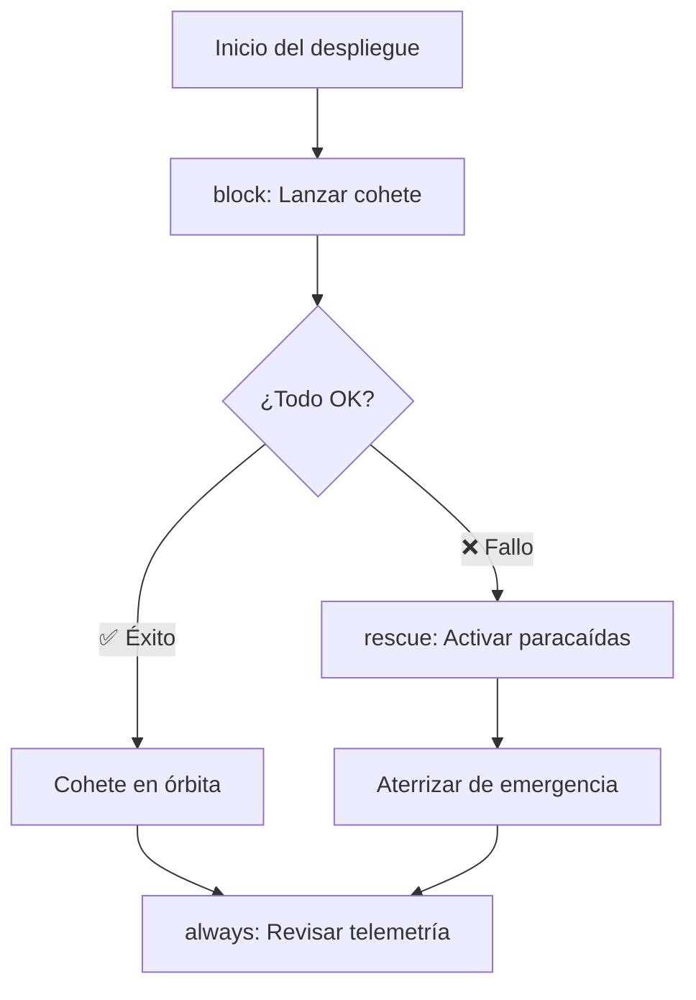
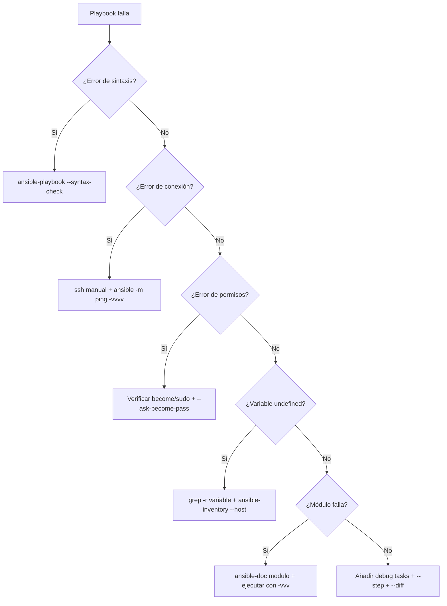

# Errores y depuración en Ansible 🔧

Aquí cubrimos **lo que sale mal cuando algo sale mal** (manejo de errores) y **cómo encontrar el problema cuando un playbook revienta a las 3 AM** (depuración).

## 📋 Contenido del capítulo

1. [Manejo de errores](#manejo-de-errores-️) — `block`/`rescue`/`always`, `failed_when`, `ignore_errors` y patrones de tolerancia a fallos.
2. [Depuración y troubleshooting](#depuración-y-troubleshooting-) — `--check`, `--diff`, módulo `debug`, verbosity y técnicas de bisección.


---


## Manejo de Errores 🛡️

Cómo hacer que tus playbooks sean resistentes a fallos y reaccionen de forma inteligente.

:::info Video pendiente de grabación
:::

### El Problema: Playbooks Frágiles

Cuando un playbook falla, Ansible se detiene inmediatamente. Eso puede ser catastrófico si estás a mitad de un despliegue en producción. Necesitas mecanismos para:
- **Ignorar** errores esperados
- **Capturar** fallos y ejecutar acciones de recuperación
- **Controlar** qué se considera un fallo
- **Validar** condiciones antes de continuar

#### 🏥 La Analogía: El Plan de Emergencia del Hospital

Un hospital no cierra si falla la luz. Tiene un plan B:
1. **Intenta** usar la electricidad normal (block)
2. **Si falla**, activa el generador de emergencia (rescue)
3. **Siempre** notifica al equipo de mantenimiento (always)

Ansible funciona exactamente igual con `block`, `rescue` y `always`.


### `ignore_errors`: La Tirita Rápida

La forma más simple de manejar errores: decirle a Ansible "si falla, sigue adelante".

```yaml
- name: Intentar detener un servicio que puede no existir
  systemd:
    name: servicio-opcional
    state: stopped
  ignore_errors: yes
```

#### ⚠️ Cuándo usarlo y cuándo NO

**✅ Usar para:**
- Servicios que pueden no existir en todos los servidores
- Comprobaciones previas donde el fallo es esperado
- Limpieza de recursos que pueden no estar presentes

**❌ NO usar para:**
- Tareas críticas donde un fallo indica un problema real
- Sustituir una lógica de manejo de errores adecuada
- "Tapar" errores sin entenderlos

```yaml
# ❌ MAL: Ignorar un error crítico sin más
- name: Instalar dependencia esencial
  apt:
    name: paquete-critico
    state: present
  ignore_errors: yes  # Si esto falla, todo lo demás fallará también

# ✅ BIEN: Ignorar solo lo esperado
- name: Eliminar archivo temporal que puede no existir
  file:
    path: /tmp/deploy-lock.pid
    state: absent
  ignore_errors: yes
```


### `block`, `rescue` y `always`: El Trío de Oro

Esta es la forma profesional de manejar errores en Ansible. Funciona igual que `try`, `catch`, `finally` en programación.

#### Estructura Básica

```yaml
- name: Despliegue con protección ante errores
  block:
    # === TRY: Lo que quieres hacer ===
    - name: Descargar nueva versión de la app
      get_url:
        url: "https://releases.ejemplo.com/app-{{ version }}.tar.gz"
        dest: /tmp/app.tar.gz

    - name: Desplegar nueva versión
      unarchive:
        src: /tmp/app.tar.gz
        dest: /opt/app/
        remote_src: yes

    - name: Reiniciar aplicación
      systemd:
        name: myapp
        state: restarted

  rescue:
    # === CATCH: Si algo falla en el block ===
    - name: Registrar el fallo
      debug:
        msg: "¡FALLO EN EL DESPLIEGUE! Iniciando rollback..."

    - name: Restaurar versión anterior
      copy:
        src: /opt/app/backup/
        dest: /opt/app/current/
        remote_src: yes

    - name: Reiniciar con versión anterior
      systemd:
        name: myapp
        state: restarted

  always:
    # === FINALLY: Siempre se ejecuta ===
    - name: Limpiar archivos temporales
      file:
        path: /tmp/app.tar.gz
        state: absent

    - name: Enviar notificación al equipo
      debug:
        msg: "Proceso de despliegue completado (éxito o rollback)"
```

#### 🎬 La Analogía: Lanzamiento de Cohete



#### Ejemplo Real: Actualización de Base de Datos

```yaml
- name: Migración de base de datos con protección
  hosts: barcelona
  become: yes

  tasks:
    - name: Migración segura de base de datos
      block:
        - name: Crear backup antes de migrar
          shell: |
            mysqldump --all-databases > /backup/pre-migration-$(date +%Y%m%d).sql
          register: backup_result

        - name: Ejecutar migración
          shell: mysql < /opt/migrations/v2.0.sql
          register: migration_result

        - name: Verificar integridad
          shell: mysqlcheck --all-databases --check
          register: check_result

      rescue:
        - name: La migración falló, restaurar backup
          shell: mysql < /backup/pre-migration-*.sql

        - name: Notificar al equipo de DB
          debug:
            msg: |
              ❌ Migración fallida.
              Backup restaurado automáticamente.
              Error: {{ ansible_failed_result.msg | default('Desconocido') }}

      always:
        - name: Registrar resultado en log
          lineinfile:
            path: /var/log/migrations.log
            line: "{{ ansible_date_time.iso8601 }} - Migración v2.0 - {{ 'OK' if migration_result is defined and migration_result.rc == 0 else 'FALLIDA' }}"
            create: yes
```


### `failed_when`: Redefinir qué es un Fallo

A veces Ansible piensa que algo falló cuando en realidad está todo bien, o viceversa. Con `failed_when` tú decides qué es un fallo.

#### 🚦 La Analogía: El Detector de Humo

Un detector de humo convencional salta con cualquier humo, incluido el de cocinar. `failed_when` es como configurar el detector para que solo salte con humo real de incendio.

```yaml
# El comando grep devuelve rc=1 si no encuentra nada.
# Ansible lo interpreta como "error", pero NO lo es.

# ❌ Sin failed_when (Ansible cree que falló)
- name: Buscar errores en el log
  shell: grep "ERROR" /var/log/app.log
  register: log_errors
  # Si no hay errores, grep devuelve rc=1 → Ansible dice "FAILED"

# ✅ Con failed_when (tú defines el fallo)
- name: Buscar errores en el log
  shell: grep "ERROR" /var/log/app.log
  register: log_errors
  failed_when: log_errors.rc not in [0, 1]
  # rc=0 → encontró errores (ok, queremos saberlo)
  # rc=1 → no encontró errores (ok, mejor aún)
  # rc=2+ → algo raro pasó con grep (ESTO sí es un error)
```

#### Más Ejemplos Prácticos

```yaml
- name: Verificar que la API responde correctamente
  uri:
    url: "http://localhost:{{ app_port }}/health"
    return_content: yes
  register: health_check
  failed_when: "'healthy' not in health_check.content"

- name: Ejecutar script de validación
  shell: /opt/scripts/validate.sh
  register: validation
  failed_when:
    - validation.rc != 0
    - "'WARNING' not in validation.stdout"
  # Falla SOLO si el rc no es 0 Y no hay un warning esperado
```


### `changed_when`: Controlar Cuándo Ansible Reporta Cambios

Ansible marca una tarea como "changed" cuando modifica algo. Pero con comandos `shell` o `command`, siempre dice "changed" aunque no haya cambiado nada. Eso rompe la **idempotencia** y activa handlers innecesariamente.

#### El Problema

```yaml
# ❌ Siempre reporta "changed", aunque no haga nada
- name: Verificar versión de la app
  shell: /opt/app/bin/app --version
  register: app_version
  # changed: true (SIEMPRE, aunque solo leyó la versión)
```

#### La Solución

```yaml
# ✅ Solo reporta "changed" si realmente cambió algo
- name: Verificar versión de la app
  shell: /opt/app/bin/app --version
  register: app_version
  changed_when: false  # Este comando NUNCA cambia nada

- name: Aplicar migración solo si es necesaria
  shell: /opt/app/bin/migrate --check-and-apply
  register: migration
  changed_when: "'Applied' in migration.stdout"
  # Solo "changed" si realmente aplicó una migración
```

#### Ejemplo Completo: Script de Backup Inteligente

```yaml
- name: Ejecutar backup incremental
  shell: |
    /usr/local/bin/backup.sh --incremental --output-stats
  register: backup_result
  changed_when: "'New files: 0' not in backup_result.stdout"
  failed_when: backup_result.rc != 0
  notify: Enviar reporte de backup

# El handler solo se ejecuta si el backup realmente copió archivos nuevos
```


### `assert`: Validar Antes de Actuar

El módulo `assert` es como un **guardia de seguridad** en la puerta. Verifica condiciones antes de que el playbook haga algo peligroso.

```yaml
- name: Validaciones previas al despliegue en producción
  hosts: servers
  become: yes

  tasks:
    - name: Verificar requisitos mínimos del servidor
      assert:
        that:
          - ansible_memtotal_mb >= 4096
          - ansible_processor_vcpus >= 2
          - ansible_mounts | selectattr('mount', 'equalto', '/') | map(attribute='size_available') | first > 5368709120
        fail_msg: |
          ❌ El servidor no cumple los requisitos mínimos:
          - RAM: {{ ansible_memtotal_mb }}MB (mínimo 4096MB)
          - CPUs: {{ ansible_processor_vcpus }} (mínimo 2)
        success_msg: "✅ Servidor validado. Procediendo con el despliegue."

    - name: Verificar que la versión es correcta
      assert:
        that:
          - app_version is defined
          - app_version is match('^[0-9]+\.[0-9]+\.[0-9]+$')
        fail_msg: "La versión '{{ app_version | default('NO DEFINIDA') }}' no es válida. Formato esperado: X.Y.Z"

    - name: Verificar conectividad con servicios externos
      uri:
        url: "https://api.ejemplo.com/status"
        status_code: 200
      register: api_status

    - name: Confirmar que la API está operativa
      assert:
        that:
          - api_status.status == 200
        fail_msg: "La API externa no está disponible. Abortando despliegue."
```


### `any_errors_fatal`: Parar Todo si Uno Falla

Cuando despliegas en múltiples servidores, a veces necesitas que si **uno** falla, se detengan **todos**. Es la diferencia entre un fallo parcial controlado y un desastre.

```yaml
- name: Actualización crítica en cluster
  hosts: servers
  any_errors_fatal: true  # Si un servidor falla, TODOS paran
  serial: 2               # Desplegar de 2 en 2

  tasks:
    - name: Actualizar aplicación
      apt:
        name: myapp
        state: latest

    - name: Verificar salud post-actualización
      uri:
        url: "http://localhost:8080/health"
        status_code: 200
      retries: 3
      delay: 5
```

#### ¿Cuándo usarlo?

- **Clusters** donde la consistencia es crítica (todos deben tener la misma versión)
- **Bases de datos** en modo réplica (si el primario falla, no toques los secundarios)
- **Balanceadores de carga** donde necesitas al menos N servidores sanos


### `retries` y `delay`: Reintentos Inteligentes

A veces un servicio necesita unos segundos para arrancar. En lugar de fallar, reintenta.

```yaml
- name: Esperar a que la aplicación esté lista
  uri:
    url: "http://localhost:{{ app_port }}/health"
    status_code: 200
  register: health
  retries: 10        # Intentar hasta 10 veces
  delay: 6           # Esperar 6 segundos entre intentos
  until: health.status == 200

- name: Esperar a que el puerto esté escuchando
  wait_for:
    port: "{{ app_port }}"
    host: localhost
    delay: 3
    timeout: 60
    state: started
```

#### Ejemplo: Esperar Convergencia de un Cluster

```yaml
- name: Esperar a que el cluster Elasticsearch esté verde
  uri:
    url: "http://localhost:9200/_cluster/health"
    return_content: yes
  register: cluster_health
  retries: 30
  delay: 10
  until: "'green' in cluster_health.content"
```


### Práctica Completa: Despliegue Resiliente 🚀

Vamos a combinar todo lo aprendido en un playbook de despliegue profesional.

```yaml
- name: Despliegue Resiliente de Aplicación Web
  hosts: servers
  become: yes
  serial: "30%"        # Desplegar al 30% de los servidores a la vez
  any_errors_fatal: true

  pre_tasks:
    - name: Validar requisitos del servidor
      assert:
        that:
          - ansible_memtotal_mb >= 2048
          - app_version is defined
        fail_msg: "Servidor no cumple requisitos o falta app_version"

    - name: Sacar servidor del balanceador
      uri:
        url: "http://{{ lb_host }}/api/servers/{{ inventory_hostname }}/disable"
        method: POST
      delegate_to: localhost
      changed_when: false

  tasks:
    - name: Despliegue de la nueva versión
      block:
        - name: Crear backup de la versión actual
          archive:
            path: /opt/app/current/
            dest: "/opt/app/backups/backup-{{ ansible_date_time.epoch }}.tar.gz"

        - name: Descargar nueva versión
          get_url:
            url: "https://releases.ejemplo.com/app-{{ app_version }}.tar.gz"
            dest: /tmp/app-new.tar.gz
            checksum: "sha256:{{ app_checksum }}"

        - name: Desplegar nueva versión
          unarchive:
            src: /tmp/app-new.tar.gz
            dest: /opt/app/current/
            remote_src: yes
          notify: Reiniciar aplicación

        - name: Ejecutar migraciones
          shell: /opt/app/current/bin/migrate
          register: migration
          changed_when: "'Applied' in migration.stdout"
          failed_when: migration.rc != 0

        - name: Verificar salud de la aplicación
          uri:
            url: "http://localhost:{{ app_port }}/health"
            status_code: 200
          retries: 5
          delay: 3
          until: health_result.status == 200
          register: health_result

      rescue:
        - name: ROLLBACK - Restaurar versión anterior
          shell: |
            LATEST_BACKUP=$(ls -t /opt/app/backups/*.tar.gz | head -1)
            tar xzf "$LATEST_BACKUP" -C /opt/app/current/

        - name: ROLLBACK - Reiniciar con versión anterior
          systemd:
            name: myapp
            state: restarted

        - name: ROLLBACK - Verificar que funciona
          uri:
            url: "http://localhost:{{ app_port }}/health"
            status_code: 200
          retries: 3
          delay: 5

      always:
        - name: Limpiar archivos temporales
          file:
            path: /tmp/app-new.tar.gz
            state: absent

  post_tasks:
    - name: Devolver servidor al balanceador
      uri:
        url: "http://{{ lb_host }}/api/servers/{{ inventory_hostname }}/enable"
        method: POST
      delegate_to: localhost
      changed_when: false

  handlers:
    - name: Reiniciar aplicación
      systemd:
        name: myapp
        state: restarted
```


## Depuración y Troubleshooting 🔍

Cómo encontrar y solucionar problemas cuando tus playbooks no funcionan como esperabas.

### La Realidad: Las Cosas Fallan

No importa lo bueno que seas, tus playbooks van a fallar. La diferencia entre un principiante y un profesional es la **velocidad a la que diagnostican y resuelven** el problema.

#### 🕵️ La Analogía: El Detective

Depurar es como resolver un caso policial:
1. **Examinas la escena del crimen** (los logs de error)
2. **Buscas pistas** (verbose mode, debug)
3. **Interrogas a los sospechosos** (variables, facts, conexión SSH)
4. **Reconstruyes los hechos** (paso a paso)


### Niveles de Verbosidad (`-v`)

La primera herramienta de diagnóstico es **subir el volumen** de la salida de Ansible.

```bash
# Normal (solo resultados)
ansible-playbook site.yml

# Verbose (-v): Muestra el resultado de cada tarea
ansible-playbook site.yml -v

# Más verbose (-vv): Incluye detalles de conexión
ansible-playbook site.yml -vv

# Muy verbose (-vvv): Incluye comandos SSH completos
ansible-playbook site.yml -vvv

# Máximo verbose (-vvvv): Incluye debug de conexión SSH
ansible-playbook site.yml -vvvv
```

#### ¿Qué nivel usar?

| Nivel | Cuándo usarlo |
|-------|-------------|
| `-v` | "¿Qué devolvió esta tarea?" |
| `-vv` | "¿Se está conectando al host correcto?" |
| `-vvv` | "¿Qué comando SSH está ejecutando?" |
| `-vvvv` | "¿Por qué no se conecta por SSH?" |

#### Ejemplo Práctico

```bash
# Tu playbook falla en una tarea de apt
$ ansible-playbook site.yml -v

TASK [Instalar Nginx] ***************
fatal: [target1]: FAILED! => {
    "changed": false,
    "msg": "No package matching 'ngnix' is available"
    #                              ^^^^^^ ¡Typo! Es "nginx"
}
```

Con `-v` pudiste ver el mensaje de error completo que te reveló el problema.


### El Módulo `debug`: Tu Mejor Amigo

El módulo `debug` es el equivalente a `console.log()` o `print()`. Te permite inspeccionar variables en cualquier punto del playbook.

#### Inspeccionar Variables

```yaml
- name: Ver el valor de una variable
  debug:
    var: my_variable

- name: Ver con formato personalizado
  debug:
    msg: "El puerto es {{ app_port }} y el host es {{ db_host }}"

- name: Ver tipo y contenido de una variable compleja
  debug:
    var: ansible_facts
    verbosity: 2  # Solo se muestra con -vv o más
```

#### Inspeccionar el Resultado de una Tarea

```yaml
- name: Ejecutar comando
  shell: systemctl status nginx
  register: nginx_status
  ignore_errors: yes

- name: Ver TODO el resultado (estructura completa)
  debug:
    var: nginx_status

- name: Ver solo lo que necesitas
  debug:
    msg: |
      RC: {{ nginx_status.rc }}
      Stdout: {{ nginx_status.stdout_lines | join('\n') }}
      Stderr: {{ nginx_status.stderr }}
      Changed: {{ nginx_status.changed }}
      Failed: {{ nginx_status.failed }}
```

#### Inspeccionar Facts del Sistema

```yaml
- name: Ver TODOS los facts (genera MUCHO output)
  debug:
    var: ansible_facts

- name: Ver facts específicos
  debug:
    msg: |
      SO: {{ ansible_distribution }} {{ ansible_distribution_version }}
      IP: {{ ansible_default_ipv4.address }}
      RAM: {{ ansible_memtotal_mb }}MB
      Disco libre (/): {{ ansible_mounts | selectattr('mount','equalto','/') | map(attribute='size_available') | first | human_readable }}
```

#### Truco: Debug Condicional

```yaml
# Solo muestra debug si la variable tiene un valor inesperado
- name: Alerta si hay poco disco
  debug:
    msg: "⚠️ ¡Poco espacio en disco! Solo {{ disk_free }}MB libres"
  when: disk_free | int < 1024
```


### Modo Check (Dry Run) y Diff

#### `--check`: Simulación sin Cambios

Ansible ejecuta el playbook pero **no aplica ningún cambio**. Es como un ensayo general.

```bash
ansible-playbook site.yml --check
```

**Limitaciones:**
- Tareas que dependen de resultados de tareas anteriores pueden fallar (porque la tarea anterior no se ejecutó realmente)
- Módulos `shell` y `command` se saltan por defecto

```yaml
# Forzar que un comando se ejecute incluso en modo check
- name: Verificar versión de la app
  shell: /opt/app/bin/app --version
  register: app_version
  check_mode: no  # Se ejecuta incluso con --check
  changed_when: false
```

#### `--diff`: Ver Qué Cambia

Muestra las diferencias exactas que Ansible va a aplicar en archivos.

```bash
# Ver qué cambiará (sin aplicar)
ansible-playbook site.yml --check --diff

# Aplicar y ver los cambios
ansible-playbook site.yml --diff
```

**Ejemplo de salida:**

```diff
TASK [Copiar configuración de Nginx] ***
--- before: /etc/nginx/nginx.conf
+++ after: /etc/nginx/nginx.conf
@@ -1,3 +1,3 @@
 server {
-    listen 80;
+    listen 8080;
     server_name example.com;
```


### `--step` y `--start-at-task`: Control Manual

#### Ejecución Paso a Paso

```bash
ansible-playbook site.yml --step
```

Ansible te preguntará antes de cada tarea:

```
TASK [Instalar Nginx] ****
Perform task: TASK: Instalar Nginx (N)o/(y)es/(c)ontinue:
```

- **y**: Ejecutar esta tarea
- **n**: Saltar esta tarea
- **c**: Ejecutar esta y todas las siguientes sin preguntar

#### Empezar desde una Tarea Específica

```bash
# Saltar todo hasta la tarea "Configurar firewall"
ansible-playbook site.yml --start-at-task "Configurar firewall"
```

Es muy útil cuando el playbook falla a mitad de camino y quieres reiniciar desde donde falló sin repetir todo.

#### Listar Tareas sin Ejecutar

```bash
# Ver todas las tareas del playbook
ansible-playbook site.yml --list-tasks

# Ver solo las de un tag
ansible-playbook site.yml --list-tasks --tags config
```


### Errores Comunes y sus Soluciones

#### Error 1: "Unreachable" - No se puede conectar

```
fatal: [target1]: UNREACHABLE! => {
    "msg": "Failed to connect to the host via ssh"
}
```

**Diagnóstico:**

```bash
# 1. ¿Puedes hacer SSH manualmente?
ssh -p 55000 ansible@localhost

# 2. ¿El host es correcto?
ansible -i inventory.yml target1 -m ping -vvvv

# 3. ¿La clave SSH es correcta?
ssh -p 55000 ansible@localhost

# 4. ¿El puerto SSH es el estándar?
ssh -p 55000 ansible@localhost
```

**Soluciones comunes:**

```ini
# inventory.ini
target1 ansible_host=localhost ansible_port=55000 ansible_user=ansible ansible_ssh_pass=ansible
```

#### Error 2: "Permission denied" - Falta sudo

```
fatal: [target1]: FAILED! => {
    "msg": "Missing sudo password"
}
```

**Solución:**

```bash
# Opción 1: Pedir contraseña sudo
ansible-playbook site.yml --ask-become-pass

# Opción 2: Configurar sudo sin contraseña (en el servidor)
echo "deploy ALL=(ALL) NOPASSWD:ALL" | sudo tee /etc/sudoers.d/deploy
```

#### Error 3: "Module failure" - El módulo no existe

```
fatal: [target1]: FAILED! => {
    "msg": "The module custom_module was not found"
}
```

**Diagnóstico:**

```bash
# ¿El módulo existe?
ansible-doc -l | grep custom_module

# ¿Es de una collection?
ansible-galaxy collection list

# ¿Falta instalar la collection?
ansible-galaxy collection install community.general
```

#### Error 4: "Variable undefined" - Variable no definida

```
fatal: [target1]: FAILED! => {
    "msg": "The task includes an option with an undefined variable. The error was: 'app_port' is undefined"
}
```

**Diagnóstico:**

```bash
# ¿Dónde debería estar definida?
grep -r "app_port" group_vars/ host_vars/ inventory/

# ¿Qué variables ve Ansible para este host?
ansible -i inventory.yml target1 -m debug -a "var=hostvars[inventory_hostname]"
```

#### Error 5: Indentación YAML incorrecta

```
ERROR! Syntax Error while loading YAML.
  mapping values are not allowed in this context
```

**Diagnóstico:**

```bash
# Validar sintaxis YAML
python -c "import yaml; yaml.safe_load(open('playbook.yml'))"

# Usar yamllint para más detalle
pip install yamllint
yamllint playbook.yml

# Verificar sintaxis del playbook
ansible-playbook --syntax-check playbook.yml
```

**Causa más frecuente:** mezclar tabs y espacios, o indentación incorrecta.

#### Error 6: "Vault password not provided"

```
ERROR! Attempting to decrypt but no vault secrets found
```

**Solución:**

```bash
# Proporcionar contraseña
ansible-playbook site.yml --ask-vault-pass

# O usar archivo de contraseña
ansible-playbook site.yml --vault-password-file ~/.vault_pass
```


### Herramientas de Diagnóstico Avanzadas

#### `ansible-config dump`: Ver Configuración Efectiva

```bash
# Ver TODA la configuración activa
ansible-config dump

# Ver solo las que difieren del default
ansible-config dump --only-changed

# Ver de dónde viene cada configuración
ansible-config dump -v
```

#### `ansible-inventory`: Inspeccionar el Inventario

```bash
# Ver el inventario completo en JSON
ansible-inventory -i inventory.yml --list

# Ver el grafo de grupos
ansible-inventory -i inventory.yml --graph

# Ver variables de un host específico
ansible-inventory -i inventory.yml --host target1
```

**Ejemplo de salida de `--graph`:**

```
@all:
  |--@servers:
  |  |--@madrid:
  |  |  |--target1
  |  |  |--target2
  |  |--@barcelona:
  |  |  |--target3
  |--@ungrouped:
```

#### `ansible-console`: Shell Interactiva

```bash
# Abrir consola interactiva contra el grupo servers
ansible-console -i inventory.yml servers --become

# Dentro de la consola, ejecutar módulos directamente
target1,target2> ping
target1,target2> shell uptime
target1,target2> setup filter=ansible_distribution
target1,target2> apt name=htop state=present
```

Es perfecto para explorar y probar módulos antes de escribirlos en un playbook.


### Callback Plugins: Mejorar la Salida

Los callback plugins cambian cómo Ansible muestra los resultados.

#### `yaml` - Salida legible

```ini
# ansible.cfg
[defaults]
stdout_callback = yaml
```

**Antes (default):**
```
ok: [target1] => {"ansible_facts": {"ansible_distribution": "Ubuntu"}}
```

**Después (yaml):**
```yaml
ok: [target1] =>
  ansible_facts:
    ansible_distribution: Ubuntu
```

#### `timer` - Tiempo de ejecución

```ini
# ansible.cfg
[defaults]
callbacks_enabled = timer, profile_tasks
```

Añade el tiempo total al final y el tiempo de cada tarea:

```
TASK [Instalar paquetes] ****
ok: [target1]
 --- 12.45s

Playbook run took 0 days, 0 hours, 2 minutes, 34 seconds
```

#### `debug` - Más detalles en errores

```ini
# ansible.cfg
[defaults]
stdout_callback = debug
```

Muestra stdout y stderr separados y formateados cuando una tarea falla.


### Estrategia de Depuración: El Método Sistemático

Cuando algo falla, sigue este proceso ordenado:



#### Checklist de Depuración Rápida

```bash
# 1. ¿La sintaxis es correcta?
ansible-playbook --syntax-check playbook.yml

# 2. ¿Los hosts son accesibles?
ansible -i inventory.yml all -m ping

# 3. ¿Las variables están definidas?
ansible-inventory -i inventory.yml --host target1

# 4. ¿Qué haría sin ejecutar?
ansible-playbook playbook.yml --check --diff -v

# 5. ¿Dónde exactamente falla?
ansible-playbook playbook.yml -vvv --start-at-task "Tarea problemática"
```


### Práctica: Debuggeando un Playbook Roto 🐛

A continuación tienes un playbook con **varios errores intencionados**. Tu misión es encontrarlos y arreglarlos usando las técnicas de este capítulo.

#### El Playbook Roto

```yaml
- name: Configurar servidor web
  hosts: servers
  become: yes

  vars:
    app_port: 8080

  tasks:
    - name: Instalar Ngnix    # 🐛 Error 1: ¿Ves algo raro en el nombre del paquete?
      apt:
        name: ngnix
        state: present

    - name: Crear directorio de la app
      file:
        path: "/opt/{{ app_name }}/current"  # 🐛 Error 2: ¿Está definida app_name?
        state: directory
        owner: www-data

    - name: Verificar si la app ya está corriendo
      shell: "curl -s http://localhost:{{ app_port }}/health"
      register: health
      # 🐛 Error 3: ¿Qué pasa si la app no está corriendo aún?

    - name: Copiar configuración
      copy:
        src: ./files/app.conf
        dest: /etc/app/config.yml
	    mode: '0644'        # 🐛 Error 4: Indentación con tabs

    - name: Reiniciar aplicación
      command: systemctl restart myapp
      # 🐛 Error 5: ¿command o systemd? ¿changed_when?
```

#### Proceso de Diagnóstico

```bash
# Paso 1: Verificar sintaxis
ansible-playbook broken.yml --syntax-check
# → Detecta Error 4 (tabs vs espacios)

# Paso 2: Ejecutar en dry-run con verbosidad
ansible-playbook broken.yml --check -v
# → Detecta Error 1 (paquete "ngnix" no existe)
# → Detecta Error 2 (app_name undefined)

# Paso 3: Añadir debug tasks para investigar Error 3
# Añadir failed_when para que curl no falle si la app no está corriendo

# Paso 4: Corregir Error 5 usando el módulo systemd
```

#### El Playbook Corregido

```yaml
- name: Configurar servidor web
  hosts: servers
  become: yes

  vars:
    app_port: 8080
    app_name: myapp  # ✅ Fix 2: Variable definida

  tasks:
    - name: Instalar Nginx
      apt:
        name: nginx  # ✅ Fix 1: Nombre correcto
        state: present

    - name: Crear directorio de la app
      file:
        path: "/opt/{{ app_name }}/current"
        state: directory
        owner: www-data

    - name: Verificar si la app ya está corriendo
      shell: "curl -s http://localhost:{{ app_port }}/health"
      register: health
      failed_when: false         # ✅ Fix 3: No fallar si no está corriendo
      changed_when: false

    - name: Copiar configuración
      copy:
        src: ./files/app.conf
        dest: /etc/app/config.yml
        mode: '0644'             # ✅ Fix 4: Espacios, no tabs

    - name: Reiniciar aplicación
      systemd:                   # ✅ Fix 5: Módulo correcto
        name: myapp
        state: restarted
```


