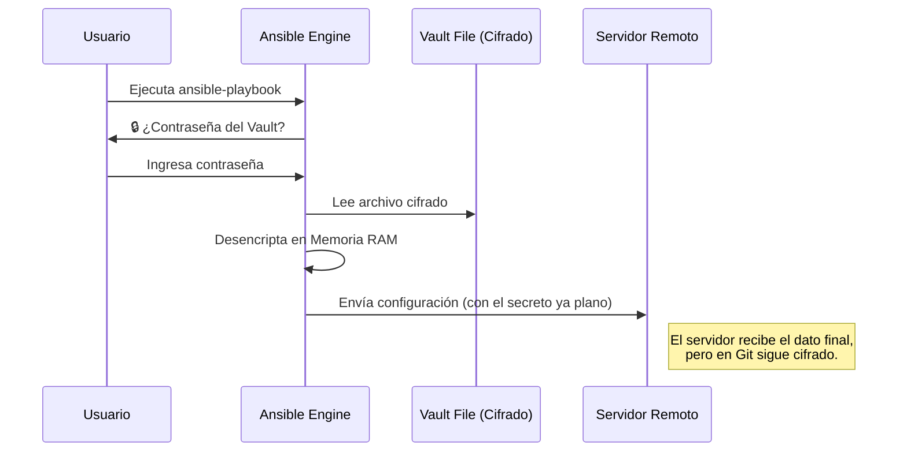

# Seguridad y Templating 🔒

Gestión de secretos y configuración dinámica de archivos.

:::info Video pendiente de grabación
:::

## 8.1. Ansible Vault: Protegiendo tus Secretos

### 🚫 El Problema: Secretos en Texto Plano
Subir contraseñas, claves API o tokens privados a GitHub en texto plano es el pecado capital de DevOps. Si tu repositorio es público, te hackearán en minutos. Si es privado, cualquier persona con acceso al código (becarios, auditores) podrá ver las claves de producción.

### 🔐 La Analogía: La Caja Fuerte Viajera
Imagina que tienes que enviar documentos confidenciales por correo. No los metes en un sobre transparente.
*   **Ansible Vault** es una **caja fuerte digital**.
*   Metes tus secretos dentro (`secrets.yml`).
*   La caja fuerte viaja con tu código (se sube al repositorio), pero está cerrada.
*   Solo quien tenga la combinación (contraseña del Vault) puede abrirla para usar los secretos.

### Flujo de Desencriptación

Ansible nunca guarda los secretos desencriptados en el disco. Todo ocurre en la memoria RAM durante la ejecución.



### 🛠️ Comandos Esenciales

Ansible incluye la herramienta `ansible-vault` de serie.

1.  **Crear un archivo cifrado:**
    ```bash
    ansible-vault create secrets.yml
    ```
2.  **Encriptar un archivo existente:**
    ```bash
    ansible-vault encrypt vars_plano.yml
    ```
3.  **Editar un archivo cifrado (lo abre, editas y lo vuelve a cifrar al cerrar):**
    ```bash
    ansible-vault edit secrets.yml
    ```
4.  **Ver contenido sin editar:**
    ```bash
    ansible-vault view secrets.yml
    ```

### 🧪 Práctica: Usando Secretos en un Playbook

**Paso 1: Crear el almacén de secretos**
Crea un archivo `group_vars/all/secrets.yml` usando `ansible-vault create`:

```yaml
# Dentro del editor seguro
db_password: "SuperSecretPassword123!"
api_token: "x8z-999-token-secreto"
```

**Paso 2: Usar la variable en el Playbook**
En tu `site.yml`, usa la variable como cualquier otra:

```yaml
- name: Configurar Base de Datos
  hosts: dbservers
  tasks:
    - name: Crear usuario de BD
      mysql_user:
        name: admin
        password: "{{ db_password }}"  # <-- Ansible la inyectará aquí
        priv: "*.*:ALL"
```

**Paso 3: Ejecutar**
```bash
ansible-playbook site.yml --ask-vault-pass
```

### 💡 Pro Tip: Automatización (CI/CD)
En un pipeline (Jenkins, GitHub Actions) no hay un humano para escribir la contraseña.
Usa un archivo de contraseña protegido:

```bash
# 1. Crea un archivo con la clave (¡AÑÁDELO AL .GITIGNORE!)
echo "mi_contraseña_maestra" > .vault_pass

# 2. Ejecuta sin preguntar
ansible-playbook site.yml --vault-password-file .vault_pass
```

---

## 8.2. Jinja2 Templates: Archivos Dinámicos

Hasta ahora usábamos el módulo `copy` para subir archivos estáticos. Pero, ¿y si cada servidor necesita una configuración ligeramente diferente (su propia IP, su propio nombre)?

### 📝 La Analogía: "Mad Libs" o Carta Modelo
Imagina una carta del banco. No escriben una carta nueva para cada cliente. Tienen una plantilla:

```jinja
Hola {{ nombre_cliente }}, su saldo actual es de {{ saldo }} euros.
```

Ansible usa **Jinja2** (el motor de plantillas de Python) para rellenar esos huecos justo antes de subir el archivo al servidor.

### Sintaxis Básica

*   `{{ variable }}`: **Imprimir**. Sustituye esto por el valor de la variable.
*   ``: **Lógica**. Control de flujo (condicionales, bucles).
*   `{# comentario #}`: Comentarios que no aparecerán en el archivo final.

### 🧪 Práctica: HTML Dinámico

Vamos a generar una página de inicio personalizada para cada servidor web que muestre información del sistema en tiempo real.

**1. El Template (`templates/index.j2`)**
Crea este archivo en tu máquina de control. Fíjate en la extensión `.j2`.

```html
<!-- templates/index.j2 -->
<!DOCTYPE html>
<html>
<head>
    <title>Bienvenido a {{ ansible_hostname }}</title>
</head>
<body>
    <h1>Información del Servidor</h1>
    <p><strong>Hostname:</strong> {{ ansible_hostname }}</p>
    <p><strong>IP Pública:</strong> {{ ansible_default_ipv4.address }}</p>
    <p><strong>Sistema Operativo:</strong> {{ ansible_distribution }} {{ ansible_distribution_version }}</p>

    <h2>Usuarios del Sistema (Generado por bucle)</h2>
    <ul>
    
        <li>Usuario: {{ user }}</li>
    
        <li>No hay usuarios definidos.</li>
    
    </ul>

    <!-- Lógica condicional -->
    
        <div style="color: red;">⚠️ ENTORNO DE PRODUCCIÓN</div>
    
        <div style="color: green;">✅ Entorno de Desarrollo</div>
    
</body>
</html>
```

**2. El Playbook (`site.yml`)**

```yaml
- name: Desplegar Web Dinámica
  hosts: webservers
  vars:
    app_env: production
    usuarios_sistema:
      - pablo
      - ana
      - admin
  
  tasks:
    - name: Generar index.html desde plantilla
      template:
        src: templates/index.j2
        dest: /var/www/html/index.html
        owner: www-data
        group: www-data
        mode: '0644'
```

### Resultado
Cuando ejecutes esto, Ansible:
1.  Leerá `index.j2`.
2.  Sustituirá `{{ ansible_hostname }}` por el nombre real de CADA máquina (ej: `web01`, `web02`).
3.  Generará la lista `<ul>` repitiendo el `<li>` 3 veces.
4.  Evaluará el `if` y pondrá el aviso de "PRODUCCIÓN".
5.  Subirá el archivo resultante `.html` al servidor.

## Resumen
Con **Vault**, duermes tranquilo sabiendo que tus secretos están cifrados. Con **Jinja2**, tus configuraciones se adaptan elásticamente a cualquier entorno. Juntos, convierten tus Playbooks en herramientas profesionales y seguras.
