# Futuro y Tendencias 🚀

Hacia dónde va la automatización con Ansible.

:::info Video pendiente de grabación
:::

## 9.1. Automatización de Redes (Network Automation)

Hasta ahora hemos usado Ansible para configurar servidores (Linux/Windows). Pero la infraestructura no son solo servidores; son también routers, switches, firewalls y balanceadores.

### 🛫 La Analogía: El Controlador Aéreo
Imagina un controlador de tráfico aéreo.
*   Hasta ahora, solo hablabas con los **pilotos** (Servidores).
*   Pero para que el aeropuerto funcione, también necesitas controlar las **luces de la pista**, los **radares** y las **barreras de acceso** (La Red).

Ansible es ese controlador universal. Puede hablar con un servidor Linux y, en la siguiente tarea, configurar una VLAN en un switch Cisco.

### La Diferencia Técnica: `network_cli`
En Linux, Ansible sube un script de Python y lo ejecuta. Pero en un router Cisco o Juniper, **no puedes instalar Python**. Son sistemas cerrados.

Por eso, Ansible usa módulos de red que funcionan diferente: se conectan por SSH, lanzan comandos nativos del router y analizan la respuesta de texto.

```yaml
- name: Configurar Switch Cisco
  hosts: switches
  connection: network_cli  # <--- La clave: No usa Python en el destino
  gather_facts: no
  
  tasks:
    - name: Configurar VLAN 10
      cisco.ios.ios_vlan:
        vlan_id: 10
        name: VENTAS
        state: present
```

---

## 9.2. Event-Driven Ansible (EDA) y AI

El futuro de la automatización no es solo ejecutar tareas cuando tú quieras, sino que la infraestructura se arregle sola cuando algo suceda.

### ⚡ De Proactivo a Reactivo
*   **Ansible Clásico (Proactivo):** Tú ejecutas el Playbook manualmente o programado.
*   **Event-Driven Ansible (Reactivo):** "Si el monitoreo detecta X, entonces ejecuta Y".

### Flujo de Trabajo EDA

```mermaid
flowchart LR
    A[Fuente de Eventos\n(Prometheus / Kafka / Webhook)] -->|1. Alerta: Web Caída| B(Ansible Rulebook)
    B -->|2. Decisión: Reiniciar Servicio| C[Ansible Controller]
    C -->|3. Ejecuta Playbook| D[Servidor Remoto]
    D -->|4. Problema Resuelto| A
    style A fill:#ff9900,color:black
    style B fill:#333,color:white
    style C fill:#cc0000,color:white
```

### 🤖 Ansible Lightspeed (IA Generativa)
Escribir YAML es fácil, pero saberse los 5000 módulos de memoria es imposible.
**Ansible Lightspeed** (con IBM Watson Code Assistant) es el "Copilot" de Ansible.
Tú escribes en lenguaje natural: *"Create an AWS EC2 instance t2.micro in us-east-1"* y la IA genera el código YAML válido por ti.

---

## 9.3. Integración en CI/CD

El objetivo final de un ingeniero DevOps no es ejecutar `ansible-playbook` desde su portátil, sino que todo ocurra automáticamente en un pipeline.

### 🔄 El Flujo GitOps
Nadie toca producción manualmente. Todo cambio pasa por Git.

```mermaid
sequenceDiagram
    participant D as Developer
    participant G as GitHub/GitLab
    participant CI as CI Pipeline (Actions)
    participant S as Servidor Prod

    D->>G: git push (Cambio en config)
    G->>CI: Dispara Pipeline
    CI->>CI: Instala Ansible
    CI->>CI: Descifra secretos (Vault)
    CI->>S: Ejecuta Playbook
    S-->>CI: Configuración Aplicada
    CI-->>D: Notificación (Éxito ✅)
```



### 🧪 Caso Práctico: GitHub Actions
Este es un ejemplo real de cómo se ve un archivo `.github/workflows/deploy.yml` que ejecuta Ansible:

```yaml
name: Despliegue con Ansible

on:
  push:
    branches: [ "main" ]

jobs:
  deploy:
    runs-on: ubuntu-latest
    steps:
      - uses: actions/checkout@v3

      - name: Instalar Ansible
        run: pip install ansible

      - name: Configurar clave SSH
        run: |
          mkdir -p ~/.ssh
          echo "${{ secrets.SSH_PRIVATE_KEY }}" > ~/.ssh/id_rsa
          chmod 600 ~/.ssh/id_rsa
          # Evitar prompt de "Host key verification"
          echo "StrictHostKeyChecking no" >> ~/.ssh/config

      - name: Ejecutar Playbook
        run: |
          echo "${{ secrets.VAULT_PASSWORD }}" > .vault_pass
          ansible-playbook -i inventory.ini site.yml --vault-password-file .vault_pass
```

---

## 🎓 Conclusión del Curso

¡Felicidades! Has pasado de ejecutar comandos SSH manuales a entender cómo orquestar infraestructuras enteras con código.

**¿Qué sigue ahora?**
1.  **Practica:** Automatiza tu entorno local, tu Raspberry Pi o tu VPS.
2.  **Certifícate:** El examen **Red Hat Certified Engineer (RHCE)** es el estándar de oro en la industria y se basa casi totalmente en Ansible.
3.  **Explora:** Métete en Ansible Galaxy y mira cómo los expertos estructuran sus roles.

La automatización es un superpoder. Úsalo bien y nunca más tendrás que trabajar un viernes por la tarde. ¡Nos vemos en el siguiente curso! 🚀
