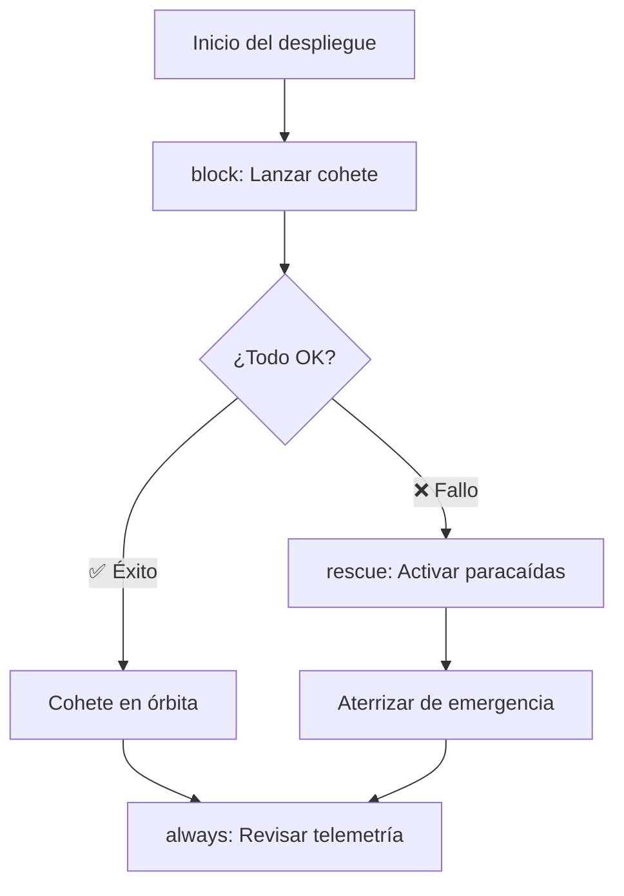

# Manejo de Errores 🛡️

Cómo hacer que tus playbooks sean resistentes a fallos y reaccionen de forma inteligente.

:::info Video pendiente de grabación
:::

## 11.1. El Problema: Playbooks Frágiles

Cuando un playbook falla, Ansible se detiene inmediatamente. Eso puede ser catastrófico si estás a mitad de un despliegue en producción. Necesitas mecanismos para:
- **Ignorar** errores esperados
- **Capturar** fallos y ejecutar acciones de recuperación
- **Controlar** qué se considera un fallo
- **Validar** condiciones antes de continuar

### 🏥 La Analogía: El Plan de Emergencia del Hospital

Un hospital no cierra si falla la luz. Tiene un plan B:
1. **Intenta** usar la electricidad normal (block)
2. **Si falla**, activa el generador de emergencia (rescue)
3. **Siempre** notifica al equipo de mantenimiento (always)

Ansible funciona exactamente igual con `block`, `rescue` y `always`.

---

## 11.2. `ignore_errors`: La Tirita Rápida

La forma más simple de manejar errores: decirle a Ansible "si falla, sigue adelante".

```yaml
- name: Intentar detener un servicio que puede no existir
  systemd:
    name: servicio-opcional
    state: stopped
  ignore_errors: yes
```

### ⚠️ Cuándo usarlo y cuándo NO

**✅ Usar para:**
- Servicios que pueden no existir en todos los servidores
- Comprobaciones previas donde el fallo es esperado
- Limpieza de recursos que pueden no estar presentes

**❌ NO usar para:**
- Tareas críticas donde un fallo indica un problema real
- Sustituir una lógica de manejo de errores adecuada
- "Tapar" errores sin entenderlos

```yaml
# ❌ MAL: Ignorar un error crítico sin más
- name: Instalar dependencia esencial
  apt:
    name: paquete-critico
    state: present
  ignore_errors: yes  # Si esto falla, todo lo demás fallará también

# ✅ BIEN: Ignorar solo lo esperado
- name: Eliminar archivo temporal que puede no existir
  file:
    path: /tmp/deploy-lock.pid
    state: absent
  ignore_errors: yes
```

---

## 11.3. `block`, `rescue` y `always`: El Trío de Oro

Esta es la forma profesional de manejar errores en Ansible. Funciona igual que `try`, `catch`, `finally` en programación.

### Estructura Básica

```yaml
- name: Despliegue con protección ante errores
  block:
    # === TRY: Lo que quieres hacer ===
    - name: Descargar nueva versión de la app
      get_url:
        url: "https://releases.ejemplo.com/app-{{ version }}.tar.gz"
        dest: /tmp/app.tar.gz

    - name: Desplegar nueva versión
      unarchive:
        src: /tmp/app.tar.gz
        dest: /opt/app/
        remote_src: yes

    - name: Reiniciar aplicación
      systemd:
        name: myapp
        state: restarted

  rescue:
    # === CATCH: Si algo falla en el block ===
    - name: Registrar el fallo
      debug:
        msg: "¡FALLO EN EL DESPLIEGUE! Iniciando rollback..."

    - name: Restaurar versión anterior
      copy:
        src: /opt/app/backup/
        dest: /opt/app/current/
        remote_src: yes

    - name: Reiniciar con versión anterior
      systemd:
        name: myapp
        state: restarted

  always:
    # === FINALLY: Siempre se ejecuta ===
    - name: Limpiar archivos temporales
      file:
        path: /tmp/app.tar.gz
        state: absent

    - name: Enviar notificación al equipo
      debug:
        msg: "Proceso de despliegue completado (éxito o rollback)"
```

### 🎬 La Analogía: Lanzamiento de Cohete



### Ejemplo Real: Actualización de Base de Datos

```yaml
- name: Migración de base de datos con protección
  hosts: dbservers
  become: yes

  tasks:
    - name: Migración segura de base de datos
      block:
        - name: Crear backup antes de migrar
          shell: |
            mysqldump --all-databases > /backup/pre-migration-$(date +%Y%m%d).sql
          register: backup_result

        - name: Ejecutar migración
          shell: mysql < /opt/migrations/v2.0.sql
          register: migration_result

        - name: Verificar integridad
          shell: mysqlcheck --all-databases --check
          register: check_result

      rescue:
        - name: La migración falló, restaurar backup
          shell: mysql < /backup/pre-migration-*.sql

        - name: Notificar al equipo de DB
          debug:
            msg: |
              ❌ Migración fallida.
              Backup restaurado automáticamente.
              Error: {{ ansible_failed_result.msg | default('Desconocido') }}

      always:
        - name: Registrar resultado en log
          lineinfile:
            path: /var/log/migrations.log
            line: "{{ ansible_date_time.iso8601 }} - Migración v2.0 - {{ 'OK' if migration_result is defined and migration_result.rc == 0 else 'FALLIDA' }}"
            create: yes
```

---

## 11.4. `failed_when`: Redefinir qué es un Fallo

A veces Ansible piensa que algo falló cuando en realidad está todo bien, o viceversa. Con `failed_when` tú decides qué es un fallo.

### 🚦 La Analogía: El Detector de Humo

Un detector de humo convencional salta con cualquier humo, incluido el de cocinar. `failed_when` es como configurar el detector para que solo salte con humo real de incendio.

```yaml
# El comando grep devuelve rc=1 si no encuentra nada.
# Ansible lo interpreta como "error", pero NO lo es.

# ❌ Sin failed_when (Ansible cree que falló)
- name: Buscar errores en el log
  shell: grep "ERROR" /var/log/app.log
  register: log_errors
  # Si no hay errores, grep devuelve rc=1 → Ansible dice "FAILED"

# ✅ Con failed_when (tú defines el fallo)
- name: Buscar errores en el log
  shell: grep "ERROR" /var/log/app.log
  register: log_errors
  failed_when: log_errors.rc not in [0, 1]
  # rc=0 → encontró errores (ok, queremos saberlo)
  # rc=1 → no encontró errores (ok, mejor aún)
  # rc=2+ → algo raro pasó con grep (ESTO sí es un error)
```

### Más Ejemplos Prácticos

```yaml
- name: Verificar que la API responde correctamente
  uri:
    url: "http://localhost:{{ app_port }}/health"
    return_content: yes
  register: health_check
  failed_when: "'healthy' not in health_check.content"

- name: Ejecutar script de validación
  shell: /opt/scripts/validate.sh
  register: validation
  failed_when:
    - validation.rc != 0
    - "'WARNING' not in validation.stdout"
  # Falla SOLO si el rc no es 0 Y no hay un warning esperado
```

---

## 11.5. `changed_when`: Controlar Cuándo Ansible Reporta Cambios

Ansible marca una tarea como "changed" cuando modifica algo. Pero con comandos `shell` o `command`, siempre dice "changed" aunque no haya cambiado nada. Eso rompe la **idempotencia** y activa handlers innecesariamente.

### El Problema

```yaml
# ❌ Siempre reporta "changed", aunque no haga nada
- name: Verificar versión de la app
  shell: /opt/app/bin/app --version
  register: app_version
  # changed: true (SIEMPRE, aunque solo leyó la versión)
```

### La Solución

```yaml
# ✅ Solo reporta "changed" si realmente cambió algo
- name: Verificar versión de la app
  shell: /opt/app/bin/app --version
  register: app_version
  changed_when: false  # Este comando NUNCA cambia nada

- name: Aplicar migración solo si es necesaria
  shell: /opt/app/bin/migrate --check-and-apply
  register: migration
  changed_when: "'Applied' in migration.stdout"
  # Solo "changed" si realmente aplicó una migración
```

### Ejemplo Completo: Script de Backup Inteligente

```yaml
- name: Ejecutar backup incremental
  shell: |
    /usr/local/bin/backup.sh --incremental --output-stats
  register: backup_result
  changed_when: "'New files: 0' not in backup_result.stdout"
  failed_when: backup_result.rc != 0
  notify: Enviar reporte de backup

# El handler solo se ejecuta si el backup realmente copió archivos nuevos
```

---

## 11.6. `assert`: Validar Antes de Actuar

El módulo `assert` es como un **guardia de seguridad** en la puerta. Verifica condiciones antes de que el playbook haga algo peligroso.

```yaml
- name: Validaciones previas al despliegue en producción
  hosts: production
  become: yes

  tasks:
    - name: Verificar requisitos mínimos del servidor
      assert:
        that:
          - ansible_memtotal_mb >= 4096
          - ansible_processor_vcpus >= 2
          - ansible_mounts | selectattr('mount', 'equalto', '/') | map(attribute='size_available') | first > 5368709120
        fail_msg: |
          ❌ El servidor no cumple los requisitos mínimos:
          - RAM: {{ ansible_memtotal_mb }}MB (mínimo 4096MB)
          - CPUs: {{ ansible_processor_vcpus }} (mínimo 2)
        success_msg: "✅ Servidor validado. Procediendo con el despliegue."

    - name: Verificar que la versión es correcta
      assert:
        that:
          - app_version is defined
          - app_version is match('^[0-9]+\.[0-9]+\.[0-9]+$')
        fail_msg: "La versión '{{ app_version | default('NO DEFINIDA') }}' no es válida. Formato esperado: X.Y.Z"

    - name: Verificar conectividad con servicios externos
      uri:
        url: "https://api.ejemplo.com/status"
        status_code: 200
      register: api_status

    - name: Confirmar que la API está operativa
      assert:
        that:
          - api_status.status == 200
        fail_msg: "La API externa no está disponible. Abortando despliegue."
```

---

## 11.7. `any_errors_fatal`: Parar Todo si Uno Falla

Cuando despliegas en múltiples servidores, a veces necesitas que si **uno** falla, se detengan **todos**. Es la diferencia entre un fallo parcial controlado y un desastre.

```yaml
- name: Actualización crítica en cluster
  hosts: webservers
  any_errors_fatal: true  # Si un servidor falla, TODOS paran
  serial: 2               # Desplegar de 2 en 2

  tasks:
    - name: Actualizar aplicación
      apt:
        name: myapp
        state: latest

    - name: Verificar salud post-actualización
      uri:
        url: "http://localhost:8080/health"
        status_code: 200
      retries: 3
      delay: 5
```

### ¿Cuándo usarlo?

- **Clusters** donde la consistencia es crítica (todos deben tener la misma versión)
- **Bases de datos** en modo réplica (si el primario falla, no toques los secundarios)
- **Balanceadores de carga** donde necesitas al menos N servidores sanos

---

## 11.8. `retries` y `delay`: Reintentos Inteligentes

A veces un servicio necesita unos segundos para arrancar. En lugar de fallar, reintenta.

```yaml
- name: Esperar a que la aplicación esté lista
  uri:
    url: "http://localhost:{{ app_port }}/health"
    status_code: 200
  register: health
  retries: 10        # Intentar hasta 10 veces
  delay: 6           # Esperar 6 segundos entre intentos
  until: health.status == 200

- name: Esperar a que el puerto esté escuchando
  wait_for:
    port: "{{ app_port }}"
    host: localhost
    delay: 3
    timeout: 60
    state: started
```

### Ejemplo: Esperar Convergencia de un Cluster

```yaml
- name: Esperar a que el cluster Elasticsearch esté verde
  uri:
    url: "http://localhost:9200/_cluster/health"
    return_content: yes
  register: cluster_health
  retries: 30
  delay: 10
  until: "'green' in cluster_health.content"
```

---

## 11.9. Práctica Completa: Despliegue Resiliente 🚀

Vamos a combinar todo lo aprendido en un playbook de despliegue profesional.

```yaml
---
- name: Despliegue Resiliente de Aplicación Web
  hosts: webservers
  become: yes
  serial: "30%"        # Desplegar al 30% de los servidores a la vez
  any_errors_fatal: true

  pre_tasks:
    - name: Validar requisitos del servidor
      assert:
        that:
          - ansible_memtotal_mb >= 2048
          - app_version is defined
        fail_msg: "Servidor no cumple requisitos o falta app_version"

    - name: Sacar servidor del balanceador
      uri:
        url: "http://{{ lb_host }}/api/servers/{{ inventory_hostname }}/disable"
        method: POST
      delegate_to: localhost
      changed_when: false

  tasks:
    - name: Despliegue de la nueva versión
      block:
        - name: Crear backup de la versión actual
          archive:
            path: /opt/app/current/
            dest: "/opt/app/backups/backup-{{ ansible_date_time.epoch }}.tar.gz"

        - name: Descargar nueva versión
          get_url:
            url: "https://releases.ejemplo.com/app-{{ app_version }}.tar.gz"
            dest: /tmp/app-new.tar.gz
            checksum: "sha256:{{ app_checksum }}"

        - name: Desplegar nueva versión
          unarchive:
            src: /tmp/app-new.tar.gz
            dest: /opt/app/current/
            remote_src: yes
          notify: Reiniciar aplicación

        - name: Ejecutar migraciones
          shell: /opt/app/current/bin/migrate
          register: migration
          changed_when: "'Applied' in migration.stdout"
          failed_when: migration.rc != 0

        - name: Verificar salud de la aplicación
          uri:
            url: "http://localhost:{{ app_port }}/health"
            status_code: 200
          retries: 5
          delay: 3
          until: health_result.status == 200
          register: health_result

      rescue:
        - name: ROLLBACK - Restaurar versión anterior
          shell: |
            LATEST_BACKUP=$(ls -t /opt/app/backups/*.tar.gz | head -1)
            tar xzf "$LATEST_BACKUP" -C /opt/app/current/

        - name: ROLLBACK - Reiniciar con versión anterior
          systemd:
            name: myapp
            state: restarted

        - name: ROLLBACK - Verificar que funciona
          uri:
            url: "http://localhost:{{ app_port }}/health"
            status_code: 200
          retries: 3
          delay: 5

      always:
        - name: Limpiar archivos temporales
          file:
            path: /tmp/app-new.tar.gz
            state: absent

  post_tasks:
    - name: Devolver servidor al balanceador
      uri:
        url: "http://{{ lb_host }}/api/servers/{{ inventory_hostname }}/enable"
        method: POST
      delegate_to: localhost
      changed_when: false

  handlers:
    - name: Reiniciar aplicación
      systemd:
        name: myapp
        state: restarted
```

---

## 📝 Resumen del Capítulo

En este capítulo has aprendido:

✅ **`ignore_errors`**: Ignorar fallos esperados (usar con precaución)
✅ **`block/rescue/always`**: Manejo estructurado de errores (try/catch/finally)
✅ **`failed_when`**: Redefinir qué es un fallo para Ansible
✅ **`changed_when`**: Controlar cuándo se reportan cambios (idempotencia)
✅ **`assert`**: Validar condiciones antes de actuar
✅ **`any_errors_fatal`**: Detener todo el despliegue si un servidor falla
✅ **`retries/delay/until`**: Reintentar tareas con esperas inteligentes

**Próximo paso:** Proteger tus secretos con Ansible Vault 🔐
