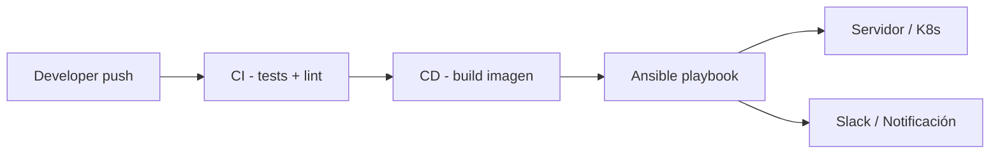

# Ansible en DevOps y CI/CD 🚀

Hasta ahora hemos ejecutado nuestros playbooks **a mano**. En el mundo real, Ansible vive dentro de pipelines automatizados que se disparan con cada push a `main`, cada tag de release o cada merge de PR. En este capítulo cerramos el círculo: Jenkins, GitHub Actions, gestión de secretos en pipelines y estrategias de despliegue de nivel producción.

:::info Video pendiente de grabación
Suscríbete al canal de YouTube para recibir la notificación.
:::

## 🎯 ¿Por qué Ansible en CI/CD?

### La analogía: la fábrica y la línea de montaje

Tener Ansible sin CI/CD es como tener un **brazo robótico** carísimo… que un operario tiene que pulsar manualmente. Una pipeline es la **línea de montaje** que conecta el código (commit) con la infraestructura (servidor en producción) sin intervención humana, de forma trazable y reproducible.

### El flujo típico



Ansible se sitúa en la **etapa de despliegue**: recibe artefactos ya construidos (binarios, imágenes Docker, paquetes) y los lleva al entorno destino aplicando configuración, secretos y reinicios.

## 🔐 Antes de nada: secretos en pipelines

Esta es la parte que más bugs de seguridad genera. Reglas básicas:

1. **Nunca** comitees `vault_password.txt` ni `.env` en el repo.
2. Usa el **almacén de secretos del CI** (Jenkins Credentials, GitHub Secrets, HashiCorp Vault).
3. Pasa la contraseña de Ansible Vault como variable de entorno: `ANSIBLE_VAULT_PASSWORD_FILE=...`.
4. Usa claves SSH **dedicadas** al CI, con permisos mínimos (idealmente vía bastion + cert SSH).
5. Aplica `no_log: true` en tareas que manejen credenciales.

## 🏗 Parte 1: Ansible + Jenkins

### Requisitos en el agente Jenkins

- Ansible instalado (`pip install ansible-core`).
- Acceso SSH al inventario de destino.
- Plugin **Credentials Binding** y, opcionalmente, **Ansible Plugin**.

### Pipeline declarativa básica

```groovy
// Jenkinsfile
pipeline {
    agent any

    environment {
        ANSIBLE_FORCE_COLOR = 'true'
        ANSIBLE_HOST_KEY_CHECKING = 'False'
    }

    stages {
        stage('Checkout') {
            steps {
                checkout scm
            }
        }

        stage('Lint') {
            steps {
                sh 'ansible-lint playbooks/'
            }
        }

        stage('Deploy') {
            steps {
                withCredentials([
                    sshUserPrivateKey(
                        credentialsId: 'ansible-ssh-key',
                        keyFileVariable: 'SSH_KEY'
                    ),
                    string(
                        credentialsId: 'vault-password',
                        variable: 'VAULT_PASS'
                    )
                ]) {
                    sh '''
                        echo "$VAULT_PASS" > .vault_pass
                        ansible-playbook \
                          -i inventories/prod \
                          --private-key "$SSH_KEY" \
                          --vault-password-file .vault_pass \
                          playbooks/deploy.yml
                        rm -f .vault_pass
                    '''
                }
            }
        }
    }

    post {
        always {
            cleanWs()
        }
        failure {
            slackSend color: 'danger', message: "Deploy fallido: ${env.BUILD_URL}"
        }
    }
}
```

### Patrón multibranch + entornos

```groovy
stage('Deploy') {
    steps {
        script {
            def env_name = (env.BRANCH_NAME == 'main') ? 'prod' : 'staging'
            sh "ansible-playbook -i inventories/${env_name} playbooks/deploy.yml"
        }
    }
}
```

## ⚙️ Parte 2: Ansible + GitHub Actions

GitHub Actions es la opción más sencilla si tu código ya vive en GitHub. No necesitas infraestructura propia: los runners hosted ya traen Python.

### Workflow básico

```yaml
# .github/workflows/deploy.yml
name: Deploy con Ansible

on:
  push:
    branches: [main]
  workflow_dispatch:

jobs:
  deploy:
    runs-on: ubuntu-latest
    steps:
      - name: Checkout
        uses: actions/checkout@v4

      - name: Setup Python
        uses: actions/setup-python@v5
        with:
          python-version: "3.12"

      - name: Instalar Ansible
        run: |
          pip install ansible-core ansible-lint
          ansible-galaxy collection install -r requirements.yml

      - name: Lint
        run: ansible-lint playbooks/

      - name: Configurar SSH
        env:
          SSH_PRIVATE_KEY: ${{ secrets.ANSIBLE_SSH_KEY }}
        run: |
          mkdir -p ~/.ssh
          echo "$SSH_PRIVATE_KEY" > ~/.ssh/id_ed25519
          chmod 600 ~/.ssh/id_ed25519
          ssh-keyscan -H ${{ secrets.PROD_HOST }} >> ~/.ssh/known_hosts

      - name: Ejecutar playbook
        env:
          ANSIBLE_VAULT_PASSWORD: ${{ secrets.VAULT_PASSWORD }}
        run: |
          echo "$ANSIBLE_VAULT_PASSWORD" > .vault_pass
          ansible-playbook \
            -i inventories/prod \
            --vault-password-file .vault_pass \
            playbooks/deploy.yml
          rm -f .vault_pass
```

### Reusable workflow para varios entornos

```yaml
# .github/workflows/deploy-env.yml (reusable)
on:
  workflow_call:
    inputs:
      environment:
        required: true
        type: string
    secrets:
      SSH_KEY:
        required: true
      VAULT_PASSWORD:
        required: true

jobs:
  deploy:
    runs-on: ubuntu-latest
    environment: ${{ inputs.environment }}
    steps:
      # ...mismos pasos...
      - name: Deploy
        run: ansible-playbook -i inventories/${{ inputs.environment }} playbooks/deploy.yml
```

Y se llama desde el workflow principal:

```yaml
jobs:
  staging:
    uses: ./.github/workflows/deploy-env.yml
    with: { environment: staging }
    secrets: inherit

  prod:
    needs: staging
    uses: ./.github/workflows/deploy-env.yml
    with: { environment: prod }
    secrets: inherit
```

## 🚦 Estrategias de despliegue con Ansible

Ansible te da control fino sobre **cómo** se aplican los cambios. Las cuatro estrategias clásicas:

### Rolling update

Despliega de N en N para no tirar el servicio. Es el comportamiento por defecto si usas `serial`:

```yaml
- name: Rolling deploy de contenedor
  hosts: servers
  serial: 2          # 2 hosts a la vez
  max_fail_percentage: 0
  tasks:
    - name: Sacar del balanceador
      community.general.haproxy:
        state: disabled
        socket: /var/run/haproxy.sock
        backend: web
        host: "{{ inventory_hostname }}"
      delegate_to: "{{ groups['lb'][0] }}"

    - name: Descargar nueva imagen del contenedor
      community.docker.docker_image:
        name: "pabpereza/quotes:{{ app_version }}"
        source: pull
        force_source: true

    - name: Recrear contenedor con la nueva versión
      community.docker.docker_container:
        name: quotes
        image: "pabpereza/quotes:{{ app_version }}"
        state: started
        restart_policy: unless-stopped
        recreate: true
        ports:
          - "8000:8000"

    - name: Esperar a que el healthcheck responda
      ansible.builtin.uri:
        url: "http://{{ inventory_hostname }}:8000/health"
        status_code: 200
      retries: 10
      delay: 3

    - name: Devolver al balanceador
      community.general.haproxy:
        state: enabled
        socket: /var/run/haproxy.sock
        backend: web
        host: "{{ inventory_hostname }}"
      delegate_to: "{{ groups['lb'][0] }}"
```

### Blue-green

Mantienes dos entornos idénticos (`blue` y `green`) y mueves el tráfico de uno a otro de golpe.

```yaml
- name: Desplegar versión nueva en GREEN
  hosts: green
  tasks:
    - import_tasks: deploy_app.yml

- name: Smoke tests en GREEN
  hosts: green
  tasks:
    - ansible.builtin.uri:
        url: "http://{{ inventory_hostname }}/health"
        status_code: 200

- name: Cambiar tráfico al pool GREEN
  hosts: lb
  tasks:
    - name: Apuntar el balanceador a GREEN
      ansible.builtin.template:
        src: haproxy.cfg.j2
        dest: /etc/haproxy/haproxy.cfg
      vars:
        active_pool: green
      notify: reload haproxy
```

### Canary

Sólo un porcentaje del tráfico va a la versión nueva. Útil para validar en producción real.

```yaml
- name: Canary 10%
  hosts: servers[0]    # primer host = 1 de 10
  tasks:
    - import_tasks: deploy_app.yml

- name: Validar métricas durante 10 min
  hosts: localhost
  tasks:
    - name: Consultar Prometheus
      ansible.builtin.uri:
        url: "http://prom/api/v1/query?query=error_rate{host='canary'}"
      register: prom
      until: prom.json.data.result[0].value[1] | float < 0.01
      retries: 60
      delay: 10
```

### Recreate (sólo dev/staging)

Para el resto, elimina el contenedor y vuelve a crearlo desde cero. **Nunca en prod** (causa downtime completo).

```yaml
- name: Stop & redeploy de contenedor (dev/staging)
  hosts: app
  tasks:
    - name: Detener y eliminar contenedor actual
      community.docker.docker_container:
        name: quotes
        state: absent

    - import_tasks: deploy_app.yml   # Crea el contenedor con docker_container state: started

    - name: Verificar que el contenedor arrancó
      community.docker.docker_container_info:
        name: quotes
      register: info
      failed_when: not info.container.State.Running
```

## 📊 Comparativa Jenkins vs GitHub Actions

| Aspecto | Jenkins | GitHub Actions |
|--------|---------|----------------|
| Coste | Self-hosted (servidor propio) | Gratis hasta cierto uso |
| Mantenimiento | Tú gestionas el master + agentes | Cero |
| Lenguaje | Groovy (Jenkinsfile) | YAML |
| Plugins | Enorme ecosistema | Marketplace creciente |
| Acceso a red interna | Nativo si lo despliegas dentro | Necesita self-hosted runners o tunnels |
| Ideal para | Empresas con infra on-prem | Proyectos en GitHub, OSS, startups |

## ✅ Buenas prácticas finales

- **Lint y test** de tus playbooks antes de desplegar (`ansible-lint`, `molecule`).
- **Pin de versiones** de colecciones en `requirements.yml`.
- **Idempotencia comprobada**: un segundo `ansible-playbook` seguido no debe cambiar nada (`--check` + `--diff`).
- **Logs estructurados**: usa `ANSIBLE_LOG_PATH` y archívalos como artefacto del pipeline.
- **Notificaciones**: integra Slack, Teams o Telegram en el `post` del pipeline.
- **Aprobaciones manuales** para producción: ambos sistemas las soportan (input step en Jenkins, environments protegidos en GitHub).

## 🧪 Reto final del curso

Construye una pipeline completa que:
1. En cada PR: ejecute `ansible-lint` y `molecule test`.
2. En cada merge a `main`: despliegue a staging con rolling update.
3. En cada tag `v*`: despliegue a producción con blue-green y aprobación manual.
4. Notifique en Slack cualquier fallo.

Si llegas hasta aquí, ya tienes un setup de DevOps real basado en Ansible. 🎉

## 📚 Recursos

- [Ansible Lint](https://ansible.readthedocs.io/projects/lint/)
- [Molecule (testing de roles)](https://ansible.readthedocs.io/projects/molecule/)
- [GitHub Actions docs](https://docs.github.com/actions)
- [Jenkins Pipeline syntax](https://www.jenkins.io/doc/book/pipeline/syntax/)

---

**Has terminado el curso de Ansible.** 🎓 Vuelve al [README](./README.md) o pásate por el [canal de YouTube](https://www.youtube.com/@Pabpereza) para seguir aprendiendo.
