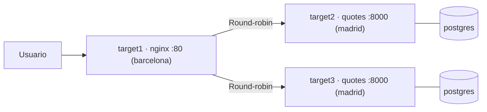

# Proyecto Final: Infraestructura quotes

Has llegado al final del curso. Es hora de juntar todo lo aprendido en un proyecto que simula una infraestructura real: tres servidores, balanceo de carga, secretos cifrados y firewall bastionado, todo automatizado con Ansible.

:::info Video pendiente de grabación
:::

## El escenario

Tienes tres servidores (`target1`, `target2`, `target3`) y necesitas desplegar la aplicación [pabpereza/quotes](https://github.com/pabpereza/quotes) con alta disponibilidad básica:

- **`barcelona`** (`target1`): Nginx como balanceador de carga
- **`madrid`** (`target2`, `target3`): cada nodo corre el stack completo — quotes API + PostgreSQL



Si un nodo de madrid cae, Nginx sigue enviando tráfico al otro. Cada nodo tiene su propia base de datos (válido para APIs sin estado compartido).

El proyecto se divide en **tres fases**, cada una como un playbook independiente importado desde `site.yml`:

| Fase | Playbook | Descripción | Módulos del curso |
|------|----------|-------------|-------------------|
| **1 - Plataformado** | `playbooks/01_plataformado.yml` | Preflight, Docker, facts | 101–107 |
| **2 - Despliegue** | `playbooks/02_stack.yml` + `03_nginx.yml` | Stack quotes + Nginx balanceador | 105–109 |
| **3 - Bastionado** | `playbooks/04_bastionado.yml` | Firewall UFW por rol de servidor | 106–109 |


## Estructura del proyecto

```text
quotes-infra/
├── ansible.cfg
├── .gitignore
├── inventory/
│   ├── hosts.yml
│   └── group_vars/           # junto al inventario — requerido por ansible-core 2.13+
│       ├── all/
│       │   ├── vars.yml
│       │   └── vault.yml     # cifrado con Ansible Vault
│       ├── barcelona.yml
│       └── madrid.yml
├── playbooks/
│   ├── 01_plataformado.yml
│   ├── 02_stack.yml
│   ├── 03_nginx.yml
│   ├── 04_bastionado.yml
│   └── templates/
│       ├── docker-compose.yml.j2
│       └── quotes.conf.j2
└── site.yml
```

Sin roles. Cada fase es un playbook autocontenido con sus templates en `playbooks/templates/`.

:::tip group_vars junto al inventario
En ansible-core 2.13+ con playbooks en subdirectorios, Ansible busca `group_vars/` relativo al fichero de inventario, no al directorio raíz. Colocarlo dentro de `inventory/` garantiza que las variables cargan correctamente en cualquier escenario.
:::


## Configuración base

### `ansible.cfg`

```ini
[defaults]
inventory            = inventory/hosts.yml
host_key_checking    = False

[privilege_escalation]
become        = True
become_method = sudo
```

### `inventory/hosts.yml`

```yaml
all:
  children:
    barcelona:
      hosts:
        target1:
          ansible_host: localhost
          ansible_port: 55000
    madrid:
      hosts:
        target2:
          ansible_host: localhost
          ansible_port: 55001
        target3:
          ansible_host: localhost
          ansible_port: 55002
  vars:
    ansible_user: ansible
    ansible_ssh_pass: ansible
```

### `inventory/group_vars/all/vars.yml`

```yaml
app_image: pabpereza/quotes:latest
app_port: 8000
postgres_image: postgres:16-alpine
postgres_user: quotes
postgres_db: quotes
postgres_password: "{{ vault_postgres_password }}"
compose_dir: /opt/quotes
```

### `inventory/group_vars/all/vault.yml` (cifrado)

```bash
ansible-vault create inventory/group_vars/all/vault.yml
```

Contenido antes de cifrar:

```yaml
vault_postgres_password: "S3cur3_P4ss_2026!"
```

### `inventory/group_vars/barcelona.yml`

```yaml
allowed_ports:
  - port: "80"
    proto: tcp
    src: any
```

### `inventory/group_vars/madrid.yml`

```yaml
allowed_ports:
  - port: "{{ app_port }}"
    proto: tcp
    src: any
```

### `.gitignore`

```
.vault_pass
*.retry
```

---

## Fase 1: Plataformado

**Conceptos aplicados**: assert, facts, set_fact, instalación manual de Docker

### `playbooks/01_plataformado.yml`

```yaml
---
- name: "Fase 1 — Plataformado"
  hosts: all
  become: yes
  tags: [plataformado]

  vars:
    docker_arch_map:
      x86_64: amd64
      aarch64: arm64
      armv7l: armhf

  pre_tasks:
    - name: Verificar requisitos mínimos del servidor
      assert:
        that:
          - ansible_facts['memtotal_mb'] >= 512
          - ansible_facts['processor_vcpus'] >= 1
        fail_msg: >
          {{ inventory_hostname }} no cumple requisitos:
          RAM {{ ansible_facts['memtotal_mb'] }}MB (mínimo 512MB),
          vCPUs {{ ansible_facts['processor_vcpus'] }} (mínimo 1)
        success_msg: "{{ inventory_hostname }} validado — {{ ansible_facts['processor_vcpus'] }} vCPUs, {{ ansible_facts['memtotal_mb'] }}MB RAM"

    - name: Calcular CPU disponible por contenedor (75% del servidor)
      set_fact:
        cpu_per_container: "{{ (ansible_facts['processor_vcpus'] * 0.75) | round(1) }}"

  tasks:
    - name: Actualizar índice de paquetes
      apt:
        update_cache: yes
        cache_valid_time: 3600

    - name: Instalar dependencias para Docker
      apt:
        name:
          - ca-certificates
          - curl
          - python3-debian
        state: present

    - name: Añadir repositorio de Docker
      deb822_repository:
        name: docker
        types: deb
        uris: "https://download.docker.com/linux/{{ ansible_facts['distribution'] | lower }}"
        suites: "{{ ansible_facts['distribution_release'] }}"
        components: stable
        architectures: "{{ docker_arch_map[ansible_facts['architecture']] | default(ansible_facts['architecture']) }}"
        signed_by: "https://download.docker.com/linux/{{ ansible_facts['distribution'] | lower }}/gpg"
        state: present

    - name: Instalar Docker CE
      apt:
        name: docker-ce
        state: present

    - name: Configurar storage driver del daemon
      copy:
        dest: /etc/docker/daemon.json
        content: |
          {
            "storage-driver": "vfs"
          }
      notify: Reiniciar Docker

    - name: Arrancar servicio de Docker
      service:
        name: docker
        state: started
        enabled: yes

    - name: Añadir usuario ansible al grupo docker
      user:
        name: ansible
        groups: docker
        append: yes

    - name: Instalar SDK Python de Docker
      apt:
        name: python3-docker
        state: present

  handlers:
    - name: Reiniciar Docker
      service:
        name: docker
        state: restarted
```

### Checkpoint ✅

```bash
# Verificar conectividad
ansible all -m ping

# Comprobar Docker en los tres nodos
ansible all -m command -a "docker --version"

# Ver los facts calculados
ansible all -m debug -a "var=cpu_per_container"
```

---

## Fase 2: Despliegue

**Conceptos aplicados**: templates Jinja2, docker_compose_v2, block/rescue/always, handlers, no_log, Vault, docker_container

### Template `playbooks/templates/docker-compose.yml.j2`

```yaml
# Generado por Ansible para {{ inventory_hostname }}
services:
  postgres:
    image: {{ postgres_image }}
    environment:
      POSTGRES_USER: "{{ postgres_user }}"
      POSTGRES_PASSWORD: "{{ postgres_password }}"
      POSTGRES_DB: "{{ postgres_db }}"
    volumes:
      - postgres_data:/var/lib/postgresql/data
    restart: unless-stopped
    healthcheck:
      test: ["CMD", "pg_isready", "-U", "{{ postgres_user }}"]
      interval: 10s
      retries: 5

  quotes:
    image: "{{ app_image }}"
    ports:
      - "{{ app_port }}:80"
    environment:
      POSTGRES_HOST: postgres
      POSTGRES_USER: "{{ postgres_user }}"
      POSTGRES_PASSWORD: "{{ postgres_password }}"
      POSTGRES_DB: "{{ postgres_db }}"
    depends_on:
      postgres:
        condition: service_healthy
    restart: unless-stopped

volumes:
  postgres_data:
```

### `playbooks/02_stack.yml` — quotes + postgres en madrid

```yaml
---
- name: "Fase 2a — Stack quotes + postgres en madrid"
  hosts: madrid
  become: yes
  tags: [despliegue, stack]

  tasks:
    - name: Crear directorio del proyecto
      file:
        path: "{{ compose_dir }}"
        state: directory
        mode: '0755'

    - name: Renderizar docker-compose.yml
      template:
        src: templates/docker-compose.yml.j2
        dest: "{{ compose_dir }}/docker-compose.yml"
        mode: '0644'
      notify: Reiniciar stack
      no_log: true

    - name: Despliegue resiliente del stack
      block:
        - name: Levantar stack quotes
          community.docker.docker_compose_v2:
            project_src: "{{ compose_dir }}"
            state: present
            pull: missing

        - name: Esperar a que quotes responda
          uri:
            url: "http://localhost:{{ app_port }}/"
            status_code: 200
          register: health
          until: health.status == 200
          retries: 15
          delay: 5

      rescue:
        - name: Volcar últimas líneas del log de quotes
          command: docker logs --tail 30 quotes
          register: quotes_logs
          changed_when: false
          failed_when: false

        - name: Mostrar logs para diagnóstico
          debug:
            msg: "{{ quotes_logs.stdout_lines | default(['sin logs disponibles']) }}"

        - name: Fallar con mensaje claro
          fail:
            msg: "Stack no arrancó en {{ inventory_hostname }}. Revisa los logs anteriores."

      always:
        - name: Registrar resultado
          debug:
            msg: "Despliegue de stack finalizado en {{ inventory_hostname }}"

  handlers:
    - name: Reiniciar stack
      community.docker.docker_compose_v2:
        project_src: "{{ compose_dir }}"
        state: present
        recreate: always
      no_log: true
```

### Template `playbooks/templates/quotes.conf.j2`

El template itera sobre `groups['madrid']` para construir el upstream automáticamente. Si mañana añades `target4` al grupo `madrid`, nginx lo incluye sin tocar ningún fichero.

```nginx
# Generado por Ansible — {{ ansible_facts['date_time']['date'] }}
# Upstream dinámico: {{ groups['madrid'] | join(', ') }}

upstream quotes_backend {

    server {{ hostvars[host]['ansible_facts']['default_ipv4']['address'] }}:{{ app_port }};

}

server {
    listen 80;
    server_name _;

    location / {
        proxy_pass         http://quotes_backend;
        proxy_set_header   Host              $host;
        proxy_set_header   X-Real-IP         $remote_addr;
        proxy_set_header   X-Forwarded-For   $proxy_add_x_forwarded_for;
        proxy_connect_timeout 5s;
        proxy_read_timeout    30s;
    }

    location /health {
        proxy_pass   http://quotes_backend/health;
        access_log   off;
    }
}
```

### `playbooks/03_nginx.yml` — balanceador en barcelona

```yaml
---
- name: "Fase 2b — Nginx balanceador en barcelona"
  hosts: barcelona
  become: yes
  tags: [despliegue, nginx]

  vars:
    nginx_image: nginx:1.27-alpine
    nginx_port: 80
    nginx_conf_dir: /etc/nginx/quotes

  tasks:
    - name: Crear directorio de configuración de nginx
      file:
        path: "{{ nginx_conf_dir }}"
        state: directory
        mode: '0755'

    - name: Renderizar configuración nginx
      template:
        src: templates/quotes.conf.j2
        dest: "{{ nginx_conf_dir }}/quotes.conf"
        mode: '0644'
      notify: Recrear contenedor nginx

    - name: Desplegar contenedor nginx
      community.docker.docker_container:
        name: nginx
        image: "{{ nginx_image }}"
        state: started
        restart_policy: unless-stopped
        ports:
          - "{{ nginx_port }}:80"
        volumes:
          - "{{ nginx_conf_dir }}/quotes.conf:/etc/nginx/conf.d/default.conf:ro"

  handlers:
    - name: Recrear contenedor nginx
      community.docker.docker_container:
        name: nginx
        image: "{{ nginx_image }}"
        state: started
        restart_policy: unless-stopped
        recreate: true
        ports:
          - "{{ nginx_port }}:80"
        volumes:
          - "{{ nginx_conf_dir }}/quotes.conf:/etc/nginx/conf.d/default.conf:ro"
```

### Checkpoint ✅

```bash
# Comprobar que el stack corre en target2 y target3
ansible madrid -m command -a "docker compose -f /opt/quotes/docker-compose.yml ps"

# Verificar salud de cada API directamente
ansible madrid -m uri -a "url=http://localhost:8000/"

# Verificar que nginx balancea (debe responder desde barcelona)
ansible barcelona -m uri -a "url=http://localhost/"

# Varias peticiones para ver el round-robin
curl http://localhost/quotes
curl http://localhost/quotes
```

---

## Fase 3: Bastionado

**Conceptos aplicados**: loop, group_vars por rol, when, community.general.ufw

Cada servidor solo abre los puertos que necesita, usando la variable `allowed_ports` definida por grupo:

- **barcelona**: puerto 80 abierto al mundo
- **madrid**: puerto 8000 accesible (en producción restringirías el origen a la IP de target1)

### `playbooks/04_bastionado.yml`

```yaml
---
- name: "Fase 3 — Bastionado UFW"
  hosts: all
  become: yes
  tags: [bastionado]

  tasks:
    - name: Instalar UFW
      apt:
        name: ufw
        state: present
        update_cache: yes

    - name: Política por defecto — denegar entrada
      community.general.ufw:
        direction: incoming
        policy: deny

    - name: Permitir SSH siempre
      community.general.ufw:
        rule: allow
        port: "22"
        proto: tcp

    - name: Abrir puertos según rol del servidor
      community.general.ufw:
        rule: allow
        port: "{{ item.port }}"
        proto: "{{ item.proto }}"
        src: "{{ item.src | default('any') }}"
      loop: "{{ allowed_ports }}"
      loop_control:
        label: "{{ item.port }}/{{ item.proto }} desde {{ item.src | default('any') }}"

    - name: Activar UFW
      community.general.ufw:
        state: enabled
```

### Checkpoint ✅

```bash
# Ver reglas activas en cada servidor
ansible all -m command -a "ufw status verbose"

# Comprobar que todo sigue funcionando tras el bastionado
ansible barcelona -m uri -a "url=http://localhost/"
```

---

## `site.yml` completo

El playbook principal no contiene lógica: solo importa los cuatro playbooks en orden. Esto permite ejecutar todo de una vez o fases individuales con `--tags`.

```yaml
---
- name: "Infraestructura quotes — entrada principal"
  import_playbook: playbooks/01_plataformado.yml

- name: "Stack quotes en madrid"
  import_playbook: playbooks/02_stack.yml

- name: "Nginx balanceador en barcelona"
  import_playbook: playbooks/03_nginx.yml

- name: "Bastionado UFW"
  import_playbook: playbooks/04_bastionado.yml
```

### Ejecución

```bash
# Desplegar todo
ansible-playbook site.yml --ask-vault-pass

# Solo plataformado
ansible-playbook site.yml --tags plataformado --ask-vault-pass

# Solo despliegue (asume Docker ya instalado)
ansible-playbook site.yml --tags despliegue --ask-vault-pass

# Solo bastionado
ansible-playbook site.yml --tags bastionado

# Simular sin aplicar cambios
ansible-playbook site.yml --check --diff --ask-vault-pass

# Ejecutar un playbook individual directamente
ansible-playbook playbooks/02_stack.yml --ask-vault-pass
```

---

## Mapa de conceptos del curso

| Concepto | Módulo | Dónde se aplica |
|----------|--------|-----------------|
| Inventarios YAML, grupos anidados | [102](102.Inventarios.md) | `inventory/hosts.yml` — grupos `madrid`/`barcelona` |
| Comandos ad-hoc | [103](103.Playbooks.md) | Checkpoints con `ansible all -m ping` |
| Módulos e idempotencia | [104](104.Modulos_idempotencia.md) | `file`, `apt`, `uri` en playbooks |
| `community.docker`, Compose | [105](105.Contenedores.md) | `02_stack.yml` con `docker_compose_v2`; `03_nginx.yml` con `docker_container` |
| `group_vars`, facts, `set_fact` | [106](106.Variables_control_flujo.md) | `cpu_per_container` calculado por servidor; `allowed_ports` por grupo |
| Vault, `no_log` | [108](108.Seguridad.md) | `vault_postgres_password` en `vault.yml`; `no_log: true` en tareas con credenciales |
| `assert`, `block`/`rescue`/`always` | [109](109.Errores_depuracion.md) | Preflight con `assert`; despliegue resiliente con rollback en `02_stack.yml` |
| Tags, `import_playbook` | [110](110.CICD.md) | Tags `plataformado`, `despliegue`, `bastionado`; `site.yml` como orquestador |
