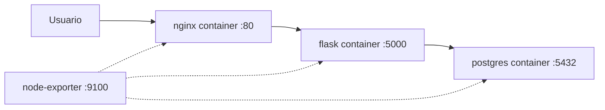

# Proyecto Final: Desplegando "NotaStack"

Has llegado al final del curso. Es hora de poner todo en práctica con un proyecto que simula un escenario real: desplegar una aplicación web completa con base de datos, servidor web y monitorización, **todo como contenedores Docker**.

## El escenario

Tu empresa ficticia, **NotaStack**, necesita automatizar el despliegue de su aplicación de notas. La infraestructura consta de:

- **Proxy inverso**: Nginx como contenedor Docker
- **Aplicación**: API sencilla en Python (Flask) como contenedor Docker
- **Base de datos**: PostgreSQL como contenedor Docker
- **Monitorización**: Node Exporter como contenedor Docker



### Entorno de trabajo

Usaremos contenedores Docker como **nodos gestionados por Ansible** (simulando servidores reales). Dentro de esos nodos, Ansible desplegará las aplicaciones como contenedores. El resultado es una pila Docker-en-Docker que funciona perfectamente para el laboratorio.

```yaml
# docker-compose.yml
version: '3'
services:
  web:
    image: geerlingguy/docker-ubuntu2204-ansible
    privileged: true
    ports:
      - "8080:80"
    volumes:
      - /sys/fs/cgroup:/sys/fs/cgroup:ro
    networks:
      notastack:
        ipv4_address: 172.20.0.10

  app:
    image: geerlingguy/docker-ubuntu2204-ansible
    privileged: true
    ports:
      - "5000:5000"
    volumes:
      - /sys/fs/cgroup:/sys/fs/cgroup:ro
    networks:
      notastack:
        ipv4_address: 172.20.0.11

  db:
    image: geerlingguy/docker-ubuntu2204-ansible
    privileged: true
    volumes:
      - /sys/fs/cgroup:/sys/fs/cgroup:ro
    networks:
      notastack:
        ipv4_address: 172.20.0.12

networks:
  notastack:
    driver: bridge
    ipam:
      config:
        - subnet: 172.20.0.0/24
```

Levanta el entorno con:
```bash
docker compose up -d
```

> El proyecto se divide en **fases incrementales**. Cada fase añade complejidad y utiliza conceptos nuevos del curso. No intentes hacerlo todo de golpe, ve fase a fase.


## Fase 1 - Estructura y primeros pasos

**Conceptos**: inventarios, comandos ad-hoc, playbooks básicos, Ansible Galaxy

### Objetivo

Crear la estructura del proyecto, verificar conectividad e instalar Docker en todos los nodos usando un rol de Galaxy.

### Paso 1: Estructura del proyecto

Crea la siguiente estructura de carpetas:

```
notastack/
├── ansible.cfg
├── requirements.yml
├── inventory/
│   └── hosts.yml
├── playbooks/
│   └── site.yml
├── roles/
├── group_vars/
│   └── all.yml
├── host_vars/
└── .gitignore
```

### Paso 2: Configuración base

```ini
# ansible.cfg
[defaults]
inventory = inventory/hosts.yml
roles_path = roles
collections_paths = ./collections:~/.ansible/collections
host_key_checking = False
retry_files_enabled = False

[privilege_escalation]
become = True
become_method = sudo
```

### Paso 3: Inventario

```yaml
# inventory/hosts.yml
all:
  children:
    madrid:
      hosts:
        target1:
          ansible_host: 172.20.0.10
        target2:
          ansible_host: 172.20.0.11
    barcelona:
      hosts:
        target3:
          ansible_host: 172.20.0.12
    servers:
      children:
        madrid:
        barcelona:
  vars:
    ansible_user: ansible
    ansible_ssh_pass: ansible
    ansible_connection: ssh
```

### Paso 4: Variables globales

```yaml
# group_vars/all.yml
project_name: notastack
app_port: 5000
db_port: 5432

# Imágenes Docker de cada componente
db_image: postgres:16-alpine
app_image: python:3.12-slim
nginx_image: nginx:1.27-alpine
node_exporter_image: prom/node-exporter:v1.7.0
```

### Paso 5: Dependencias con requirements.yml

Declaramos los roles y colecciones que necesitamos, como aprendimos en la [sección de Roles y Ansible Galaxy](107.Roles.md):

```yaml
# requirements.yml
roles:
  - name: geerlingguy.docker
    version: 7.4.2

collections:
  - name: community.docker
    version: ">=3.4.0"
  - name: community.general
    version: ">=7.0.0"
```

```bash
ansible-galaxy install -r requirements.yml
ansible-galaxy collection install -r requirements.yml
```

### Paso 6: Primer playbook — instalar Docker en todos los nodos

```yaml
# playbooks/common.yml
- name: Instalar Docker en todos los servidores
  hosts: all
  tags: [common]

  vars:
    docker_users:
      - ansible

  roles:
    - geerlingguy.docker

  post_tasks:
    - name: Instalar SDK Python de Docker (requerido por community.docker)
      ansible.builtin.pip:
        name: docker
        state: present

    - name: Mostrar información del nodo
      ansible.builtin.debug:
        msg: >
          Nodo {{ inventory_hostname }} listo.
          OS: {{ ansible_distribution }} {{ ansible_distribution_version }}.
          Docker: instalado.
```

```yaml
# playbooks/site.yml
- import_playbook: common.yml
```

```bash
ansible-playbook playbooks/site.yml
```

### Checkpoint

- [ ] `ansible all -m ping` responde `pong` en los tres nodos
- [ ] `ansible all -m command -a "docker --version"` devuelve la versión de Docker
- [ ] El usuario `ansible` puede ejecutar Docker sin sudo


## Fase 2 - Roles y la base de datos

**Conceptos**: roles, variables, handlers, templates Jinja2

### Objetivo

Crear un rol para PostgreSQL que lo despliegue como contenedor Docker con datos persistentes.

### Paso 1: Crear el rol

```bash
ansible-galaxy init roles/postgresql
```

### Paso 2: Variables por defecto del rol

```yaml
# roles/postgresql/defaults/main.yml
postgresql_image: postgres:16-alpine
postgresql_port: 5432
postgresql_data_dir: /data/postgresql
postgresql_db_name: notastack_db
postgresql_db_user: notastack_user
postgresql_db_password: CHANGEME
```

### Paso 3: Tareas del rol

```yaml
# roles/postgresql/tasks/main.yml
- name: Crear directorio de datos persistentes
  ansible.builtin.file:
    path: "{{ postgresql_data_dir }}"
    state: directory
    mode: '0700'

- name: Desplegar contenedor PostgreSQL
  community.docker.docker_container:
    name: postgresql
    image: "{{ postgresql_image }}"
    state: started
    restart_policy: unless-stopped
    ports:
      - "{{ postgresql_port }}:5432"
    volumes:
      - "{{ postgresql_data_dir }}:/var/lib/postgresql/data"
    env:
      POSTGRES_DB: "{{ postgresql_db_name }}"
      POSTGRES_USER: "{{ postgresql_db_user }}"
      POSTGRES_PASSWORD: "{{ postgresql_db_password }}"
  no_log: true
  notify: Esperar PostgreSQL

- name: Esperar a que el puerto PostgreSQL esté disponible
  ansible.builtin.wait_for:
    port: "{{ postgresql_port }}"
    host: localhost
    delay: 3
    timeout: 60
    state: started

- name: Crear tabla de notas
  community.docker.docker_container_exec:
    container: postgresql
    command: >
      psql -U {{ postgresql_db_user }} -d {{ postgresql_db_name }} -c
      "CREATE TABLE IF NOT EXISTS notes (
        id SERIAL PRIMARY KEY,
        title VARCHAR(200) NOT NULL,
        content TEXT,
        created_at TIMESTAMP DEFAULT CURRENT_TIMESTAMP
      );"
  register: create_table
  changed_when: "'CREATE TABLE' in create_table.stdout"
```

### Paso 4: Handlers

```yaml
# roles/postgresql/handlers/main.yml
- name: Esperar PostgreSQL
  ansible.builtin.wait_for:
    port: "{{ postgresql_port }}"
    host: localhost
    delay: 5
    timeout: 60
    state: started
```

### Paso 5: Integrar el rol en el playbook

```yaml
# playbooks/database.yml
- name: Desplegar base de datos
  hosts: barcelona
  tags: [database]
  roles:
    - postgresql
```

```yaml
# playbooks/site.yml (actualizado)
- import_playbook: common.yml
- import_playbook: database.yml
```

### Checkpoint

- [ ] El contenedor `postgresql` está corriendo en `target3`
- [ ] El puerto 5432 responde en `172.20.0.12`
- [ ] La tabla `notes` existe en la base de datos


## Fase 3 - La aplicación Flask

**Conceptos**: variables de host, register, condicionales

### Objetivo

Crear un rol que despliegue la aplicación Flask como contenedor Docker.

### Paso 1: Crear el rol

```bash
ansible-galaxy init roles/flask_app
```

### Paso 2: Variables por defecto

```yaml
# roles/flask_app/defaults/main.yml
flask_app_name: notastack
flask_app_port: 5000
flask_app_dir: /opt/notastack
flask_app_image: python:3.12-slim
```

### Paso 3: Código de la aplicación

```python
# roles/flask_app/files/app.py
from flask import Flask, jsonify, request
import psycopg2
import os

app = Flask(__name__)

def get_db():
    return psycopg2.connect(
        host=os.environ.get('DB_HOST', 'localhost'),
        port=os.environ.get('DB_PORT', '5432'),
        dbname=os.environ.get('DB_NAME', 'notastack_db'),
        user=os.environ.get('DB_USER', 'notastack_user'),
        password=os.environ.get('DB_PASSWORD', '')
    )

@app.route('/health')
def health():
    try:
        conn = get_db()
        conn.close()
        return jsonify({"status": "ok", "database": "connected"})
    except Exception as e:
        return jsonify({"status": "error", "database": str(e)}), 500

@app.route('/api/notes', methods=['GET'])
def get_notes():
    conn = get_db()
    cur = conn.cursor()
    cur.execute("SELECT id, title, content, created_at FROM notes ORDER BY created_at DESC")
    notes = [{"id": r[0], "title": r[1], "content": r[2], "created_at": str(r[3])} for r in cur.fetchall()]
    cur.close()
    conn.close()
    return jsonify(notes)

@app.route('/api/notes', methods=['POST'])
def create_note():
    data = request.get_json()
    conn = get_db()
    cur = conn.cursor()
    cur.execute("INSERT INTO notes (title, content) VALUES (%s, %s) RETURNING id",
                (data['title'], data.get('content', '')))
    note_id = cur.fetchone()[0]
    conn.commit()
    cur.close()
    conn.close()
    return jsonify({"id": note_id}), 201

if __name__ == '__main__':
    app.run(host='0.0.0.0', port=int(os.environ.get('PORT', 5000)))
```

```
# roles/flask_app/files/requirements.txt
flask==3.0.3
gunicorn==22.0.0
psycopg2-binary==2.9.9
```

### Paso 4: Tareas del rol

```yaml
# roles/flask_app/tasks/main.yml
- name: Crear directorio de la aplicación en el host
  ansible.builtin.file:
    path: "{{ flask_app_dir }}"
    state: directory
    mode: '0755'

- name: Copiar código de la aplicación
  ansible.builtin.copy:
    src: app.py
    dest: "{{ flask_app_dir }}/app.py"
    mode: '0644'
  notify: Recrear contenedor app

- name: Copiar fichero de requisitos Python
  ansible.builtin.copy:
    src: requirements.txt
    dest: "{{ flask_app_dir }}/requirements.txt"
    mode: '0644'
  notify: Recrear contenedor app

- name: Desplegar contenedor Flask
  community.docker.docker_container:
    name: "{{ flask_app_name }}"
    image: "{{ flask_app_image }}"
    state: started
    restart_policy: unless-stopped
    ports:
      - "{{ flask_app_port }}:5000"
    volumes:
      - "{{ flask_app_dir }}:/app:ro"
    working_dir: /app
    command: >
      sh -c "pip install -q -r requirements.txt && python app.py"
    env:
      DB_HOST: "{{ hostvars[groups['barcelona'][0]]['ansible_host'] }}"
      DB_PORT: "{{ db_port | string }}"
      DB_NAME: "{{ postgresql_db_name }}"
      DB_USER: "{{ postgresql_db_user }}"
      DB_PASSWORD: "{{ postgresql_db_password }}"
      PORT: "{{ flask_app_port | string }}"
  no_log: true

- name: Esperar a que la aplicación arranque
  ansible.builtin.uri:
    url: "http://localhost:{{ flask_app_port }}/health"
    status_code: [200, 500]
  register: health_check
  retries: 10
  delay: 5
  until: health_check.status == 200
```

### Paso 5: Handlers

```yaml
# roles/flask_app/handlers/main.yml
- name: Recrear contenedor app
  community.docker.docker_container:
    name: "{{ flask_app_name }}"
    image: "{{ flask_app_image }}"
    state: started
    restart_policy: unless-stopped
    recreate: true
    ports:
      - "{{ flask_app_port }}:5000"
    volumes:
      - "{{ flask_app_dir }}:/app:ro"
    working_dir: /app
    command: >
      sh -c "pip install -q -r requirements.txt && python app.py"
```

### Paso 6: Integrar en el playbook

```yaml
# playbooks/application.yml
- name: Desplegar aplicación Flask
  hosts: madrid
  tags: [app]
  roles:
    - flask_app
```

```yaml
# playbooks/site.yml (actualizado)
- import_playbook: common.yml
- import_playbook: database.yml
- import_playbook: application.yml
```

### Checkpoint

- [ ] El contenedor `notastack` está corriendo en `target2`
- [ ] `http://172.20.0.11:5000/health` responde `{"status": "ok", "database": "connected"}`
- [ ] Puedes crear y listar notas via la API


## Fase 4 - Nginx y el proxy inverso

**Conceptos**: include/import, dependencias entre plays, tags, templates Jinja2

### Objetivo

Configurar Nginx como proxy inverso ejecutándolo como contenedor y organizar el playbook principal con includes.

### Paso 1: Rol de Nginx

```bash
ansible-galaxy init roles/nginx
```

```yaml
# roles/nginx/defaults/main.yml
nginx_image: nginx:1.27-alpine
nginx_port: 80
nginx_conf_dir: /etc/nginx/notastack
```

```yaml
# roles/nginx/tasks/main.yml
- name: Crear directorio de configuración
  ansible.builtin.file:
    path: "{{ nginx_conf_dir }}"
    state: directory
    mode: '0755'

- name: Generar configuración Nginx con Jinja2
  ansible.builtin.template:
    src: notastack.conf.j2
    dest: "{{ nginx_conf_dir }}/default.conf"
    mode: '0644'
  notify: Recrear contenedor nginx

- name: Desplegar contenedor Nginx
  community.docker.docker_container:
    name: nginx
    image: "{{ nginx_image }}"
    state: started
    restart_policy: unless-stopped
    ports:
      - "{{ nginx_port }}:80"
    volumes:
      - "{{ nginx_conf_dir }}/default.conf:/etc/nginx/conf.d/default.conf:ro"
```

```jinja2
{# roles/nginx/templates/notastack.conf.j2 #}
# Proxy inverso para NotaStack
# Generado por Ansible el {{ ansible_date_time.iso8601 }}

upstream app_backend {

    server {{ hostvars[host]['ansible_host'] }}:{{ app_port }};

}

server {
    listen 80;
    server_name _;

    location / {
        proxy_pass http://app_backend;
        proxy_set_header Host $host;
        proxy_set_header X-Real-IP $remote_addr;
        proxy_set_header X-Forwarded-For $proxy_add_x_forwarded_for;
        proxy_connect_timeout 10s;
        proxy_read_timeout 30s;
    }

    location /health {
        proxy_pass http://app_backend/health;
        access_log off;
    }
}
```

Fíjate cómo el template itera sobre los hosts del grupo `madrid` para generar el upstream de Nginx. Si mañana añades otro servidor al inventario, el balanceo se reconfigura solo.

```yaml
# roles/nginx/handlers/main.yml
- name: Recrear contenedor nginx
  community.docker.docker_container:
    name: nginx
    image: "{{ nginx_image }}"
    state: started
    restart_policy: unless-stopped
    recreate: true
    ports:
      - "{{ nginx_port }}:80"
    volumes:
      - "{{ nginx_conf_dir }}/default.conf:/etc/nginx/conf.d/default.conf:ro"
```

### Paso 2: Reorganizar con import_playbook

```yaml
# playbooks/webserver.yml
- name: Desplegar proxy inverso Nginx
  hosts: madrid
  tags: [web]
  roles:
    - nginx
```

```yaml
# playbooks/site.yml (versión de la Fase 4)
- import_playbook: common.yml
- import_playbook: database.yml
- import_playbook: application.yml
- import_playbook: webserver.yml
```

Ahora puedes desplegar todo o solo una capa:

```bash
# Desplegar todo
ansible-playbook playbooks/site.yml

# Solo la base de datos
ansible-playbook playbooks/site.yml --tags database

# Todo menos el proxy
ansible-playbook playbooks/site.yml --skip-tags web
```

### Checkpoint

- [ ] El contenedor `nginx` está corriendo en `target1`
- [ ] `http://172.20.0.10/health` devuelve la respuesta de la API Flask
- [ ] El playbook `site.yml` despliega toda la infraestructura de una vez


## Fase 5 - Secretos con Vault

**Conceptos**: Ansible Vault, variables cifradas, no_log

### Objetivo

Proteger las contraseñas de la base de datos y pasarlas como variables de entorno al contenedor de forma segura, como aprendimos en la [sección de Seguridad](108.Seguridad.md).

### Paso 1: Crear fichero de secretos

```bash
ansible-vault create group_vars/vault.yml
```

Contenido del fichero cifrado:

```yaml
# group_vars/vault.yml (cifrado con Vault)
vault_postgresql_db_password: "S3cur3_P4ssw0rd_2024!"
```

### Paso 2: Referenciar secretos desde variables

```yaml
# group_vars/all.yml (actualizado)
project_name: notastack
app_port: 5000
db_port: 5432

db_image: postgres:16-alpine
app_image: python:3.12-slim
nginx_image: nginx:1.27-alpine
node_exporter_image: prom/node-exporter:v1.7.0

# Variables de base de datos (el password referencia al vault)
postgresql_db_name: notastack_db
postgresql_db_user: notastack_user
postgresql_db_password: "{{ vault_postgresql_db_password }}"
```

### Paso 3: Los secretos viajan como env vars al contenedor

La tarea en `roles/flask_app/tasks/main.yml` ya usa `no_log: true` para que la contraseña no aparezca en los logs cuando se pasa como variable de entorno al contenedor. El patrón es:

```yaml
# Ya implementado en el rol flask_app
- name: Desplegar contenedor Flask
  community.docker.docker_container:
    ...
    env:
      DB_PASSWORD: "{{ postgresql_db_password }}"   # ← viene del vault
  no_log: true   # ← evita que aparezca en los logs
```

### Paso 4: Ejecutar con Vault

```bash
# Con prompt de contraseña
ansible-playbook playbooks/site.yml --ask-vault-pass

# Con fichero de contraseña (no subir a Git)
echo "mi_password_vault" > .vault_pass
echo ".vault_pass" >> .gitignore
ansible-playbook playbooks/site.yml --vault-password-file .vault_pass
```

### Checkpoint

- [ ] El fichero `vault.yml` está cifrado (no se lee la contraseña en texto plano)
- [ ] El despliegue funciona igual que antes pero usando `--ask-vault-pass`
- [ ] La contraseña no aparece en la salida de Ansible


## Fase 6 - Manejo de errores y robustez

**Conceptos**: blocks, rescue, assert, failed_when

### Objetivo

Hacer el despliegue resistente a fallos, aplicando técnicas del [módulo de errores](109.Errores_depuracion.md).

### Paso 1: Validaciones previas al despliegue

```yaml
# playbooks/preflight.yml
- name: Validaciones previas al despliegue
  hosts: all
  tags: [preflight]
  tasks:
    - name: Verificar requisitos mínimos de RAM
      ansible.builtin.assert:
        that:
          - ansible_memtotal_mb >= 256
        fail_msg: >
          El servidor {{ inventory_hostname }} tiene solo
          {{ ansible_memtotal_mb }} MB de RAM. Se necesitan al menos 256 MB.
        success_msg: "RAM OK: {{ ansible_memtotal_mb }} MB"

    - name: Verificar que Docker está corriendo
      ansible.builtin.command: docker info
      register: docker_info
      changed_when: false
      failed_when: docker_info.rc != 0

    - name: Verificar conectividad entre app y db
      ansible.builtin.command: >
        ping -c 1 -W 2 {{ hostvars[groups['barcelona'][0]]['ansible_host'] }}
      changed_when: false
      when: inventory_hostname in groups['madrid']
```

### Paso 2: Despliegue con rollback de contenedor

Añade el bloque de error en el rol de la aplicación:

```yaml
# roles/flask_app/tasks/main.yml — reemplazar la tarea "Esperar a que la aplicación arranque" por:
- name: Despliegue con verificación
  block:
    - name: Esperar a que la aplicación arranque
      ansible.builtin.uri:
        url: "http://localhost:{{ flask_app_port }}/health"
        status_code: 200
      retries: 10
      delay: 5
      until: health_result.status == 200
      register: health_result

    - name: Confirmar despliegue exitoso
      ansible.builtin.debug:
        msg: "Contenedor {{ flask_app_name }} desplegado y respondiendo correctamente."

  rescue:
    - name: Recopilar logs del contenedor
      community.docker.docker_container_exec:
        container: "{{ flask_app_name }}"
        command: cat /proc/1/fd/1
      register: container_logs
      failed_when: false

    - name: Mostrar logs del contenedor
      ansible.builtin.debug:
        msg: "{{ container_logs.stdout_lines | default(['sin logs disponibles']) }}"

    - name: Fallo en el despliegue
      ansible.builtin.fail:
        msg: >
          El contenedor {{ flask_app_name }} no responde en el puerto {{ flask_app_port }}.
          Revisa los logs anteriores para diagnosticar el problema.

  always:
    - name: Registrar resultado del despliegue
      ansible.builtin.debug:
        msg: "Despliegue en {{ inventory_hostname }} finalizado a las {{ ansible_date_time.iso8601 }}"
```

### Paso 3: Actualizar el playbook maestro

```yaml
# playbooks/site.yml
- import_playbook: preflight.yml
- import_playbook: common.yml
- import_playbook: database.yml
- import_playbook: application.yml
- import_playbook: webserver.yml
```

### Checkpoint

- [ ] Las validaciones previas detectan problemas antes de desplegar
- [ ] Si el contenedor no arranca, los logs se muestran automáticamente
- [ ] El bloque `always` se ejecuta siempre, tanto en éxito como en fallo


## Fase 7 - Monitorización y depuración

**Conceptos**: Ansible Galaxy (colecciones), depuración, variables registradas

### Objetivo

Añadir Node Exporter como contenedor para monitorización con Prometheus y crear un playbook de diagnóstico que use `community.docker`.

### Paso 1: Rol de monitorización

```bash
ansible-galaxy init roles/monitoring
```

```yaml
# roles/monitoring/defaults/main.yml
node_exporter_image: prom/node-exporter:v1.7.0
node_exporter_port: 9100
```

```yaml
# roles/monitoring/tasks/main.yml
- name: Desplegar contenedor Node Exporter
  community.docker.docker_container:
    name: node_exporter
    image: "{{ node_exporter_image }}"
    state: started
    restart_policy: unless-stopped
    ports:
      - "{{ node_exporter_port }}:9100"
    volumes:
      - /proc:/host/proc:ro
      - /sys:/host/sys:ro
      - /:/rootfs:ro
    command: >
      --path.procfs=/host/proc
      --path.sysfs=/host/sys
      --path.rootfs=/rootfs
      --web.listen-address=:9100

- name: Esperar a que Node Exporter esté disponible
  ansible.builtin.uri:
    url: "http://localhost:{{ node_exporter_port }}/metrics"
    status_code: 200
  retries: 5
  delay: 3
```

### Paso 2: Playbook de diagnóstico

Crea un playbook que use `community.docker` para inspeccionar el estado de los contenedores en toda la infraestructura:

```yaml
# playbooks/diagnostico.yml
- name: Diagnóstico de la infraestructura NotaStack
  hosts: all
  tags: [diagnostico]
  tasks:
    - name: Recoger uso de disco
      ansible.builtin.command: df -h /
      register: disk_usage
      changed_when: false

    - name: Listar contenedores corriendo en el nodo
      community.docker.docker_host_info:
        containers: true
        containers_filters:
          status: running
      register: docker_info

    - name: Mostrar resumen del nodo
      ansible.builtin.debug:
        msg:
          - "=== {{ inventory_hostname }} ==="
          - "OS: {{ ansible_distribution }} {{ ansible_distribution_version }}"
          - "Disco: {{ disk_usage.stdout_lines[1] }}"
          - "Contenedores activos: {{ docker_info.containers | map(attribute='Names') | list }}"

- name: Diagnóstico de la base de datos
  hosts: barcelona
  tasks:
    - name: Obtener info del contenedor PostgreSQL
      community.docker.docker_container_info:
        name: postgresql
      register: pg_info
      failed_when: false

    - name: Estado de PostgreSQL
      ansible.builtin.debug:
        msg: >
          PostgreSQL: {{ 'OK - corriendo' if pg_info.container.State.Running | default(false)
          else 'NO DISPONIBLE' }}

- name: Diagnóstico de la aplicación
  hosts: madrid
  tasks:
    - name: Comprobar health de la app
      ansible.builtin.uri:
        url: "http://localhost:{{ app_port }}/health"
        return_content: true
      register: app_health
      failed_when: false

    - name: Estado de la aplicación
      ansible.builtin.debug:
        msg: "App: {{ app_health.json | default('NO RESPONDE') }}"

- name: Diagnóstico del proxy
  hosts: madrid
  tasks:
    - name: Obtener info del contenedor Nginx
      community.docker.docker_container_info:
        name: nginx
      register: nginx_info
      failed_when: false

    - name: Estado de Nginx
      ansible.builtin.debug:
        msg: >
          Nginx: {{ 'OK - corriendo' if nginx_info.container.State.Running | default(false)
          else 'NO DISPONIBLE' }}

- name: Resumen de monitorización
  hosts: all
  tasks:
    - name: Comprobar Node Exporter
      ansible.builtin.uri:
        url: "http://localhost:9100/metrics"
        return_content: false
      register: exporter_status
      failed_when: false

    - name: Estado de Node Exporter
      ansible.builtin.debug:
        msg: >
          Node Exporter en {{ inventory_hostname }}:
          {{ 'OK' if exporter_status.status == 200 else 'NO DISPONIBLE' }}
```

```bash
ansible-playbook playbooks/diagnostico.yml -v
```

### Paso 3: Integrar monitorización en site.yml

```yaml
# playbooks/monitoring.yml
- name: Configurar monitorización
  hosts: all
  tags: [monitoring]
  roles:
    - monitoring
```

```yaml
# playbooks/site.yml (versión final)
- import_playbook: preflight.yml
- import_playbook: common.yml
- import_playbook: database.yml
- import_playbook: application.yml
- import_playbook: webserver.yml
- import_playbook: monitoring.yml
```

### Checkpoint

- [ ] El contenedor `node_exporter` está corriendo en los tres nodos
- [ ] `http://172.20.0.10:9100/metrics` devuelve métricas
- [ ] El playbook de diagnóstico muestra el estado completo de todos los contenedores
- [ ] `ansible-playbook playbooks/site.yml` despliega todo de principio a fin


## Estructura final del proyecto

Al completar todas las fases, tu proyecto debería verse así:

```
notastack/
├── ansible.cfg
├── requirements.yml
├── .vault_pass                    # No subir a Git
├── .gitignore
├── inventory/
│   └── hosts.yml
├── group_vars/
│   ├── all.yml
│   └── vault.yml                  # Cifrado con Ansible Vault
├── playbooks/
│   ├── site.yml                   # Playbook maestro
│   ├── preflight.yml              # Validaciones
│   ├── common.yml                 # Instalar Docker
│   ├── database.yml               # Contenedor PostgreSQL
│   ├── application.yml            # Contenedor Flask
│   ├── webserver.yml              # Contenedor Nginx
│   ├── monitoring.yml             # Contenedor Node Exporter
│   └── diagnostico.yml            # Diagnóstico con docker_container_info
├── roles/
│   ├── postgresql/
│   │   ├── defaults/main.yml
│   │   ├── tasks/main.yml
│   │   └── handlers/main.yml
│   ├── flask_app/
│   │   ├── defaults/main.yml
│   │   ├── tasks/main.yml
│   │   ├── handlers/main.yml
│   │   └── files/
│   │       ├── app.py
│   │       └── requirements.txt
│   ├── nginx/
│   │   ├── defaults/main.yml
│   │   ├── tasks/main.yml
│   │   ├── handlers/main.yml
│   │   └── templates/
│   │       └── notastack.conf.j2
│   └── monitoring/
│       ├── defaults/main.yml
│       └── tasks/main.yml
└── docker-compose.yml             # Entorno de laboratorio (nodos Ansible)
```


## Mapa de conceptos del curso aplicados

| Concepto del curso | Dónde se aplica en el proyecto |
|---|---|
| [Inventarios](102.Inventarios.md) | `inventory/hosts.yml` - Grupos por función (`madrid`, `barcelona`, `servers`) |
| [Playbooks](103.Playbooks.md) | Todos los ficheros en `playbooks/` con `import_playbook` |
| [Módulos e idempotencia](104.Modulos_idempotencia.md) | `docker_container`, `template`, `uri`, `file`, `copy`... |
| [Variables, condicionales y handlers](105.Variables_control_flujo.md) | `group_vars/`, defaults de roles, facts del sistema |
| [Ansible y Contenedores](106.Contenedores.md) | `community.docker` en todos los roles: `docker_container`, `docker_container_info`, `docker_container_exec` |
| [Roles y Galaxy](107.Roles.md) | Cuatro roles locales + `geerlingguy.docker` desde Galaxy, `community.docker` colección |
| [Seguridad - Vault y credenciales](108.Seguridad.md) | Contraseñas cifradas en `vault.yml`, `no_log: true` en tareas con secretos |
| [Manejo de errores](109.Errores_depuracion.md) | `block`/`rescue`/`always`, `assert`, validaciones en `preflight.yml` |
| [Depuración](109.Errores_depuracion.md) | `diagnostico.yml` con `docker_host_info`, `debug`, registros |
| [CI/CD](110.CICD.md) | `site.yml` como orquestador, listo para conectar con GitHub Actions |


## Ideas para seguir practicando

- **Añadir un segundo servidor de aplicación** al grupo `madrid` y comprobar que Nginx lo balancea automáticamente gracias al template Jinja2 dinámico
- **Crear un entorno de staging** con inventario separado e imágenes de contenedor distintas
- **Implementar despliegues rolling** con `serial` para actualizar el contenedor de cada servidor sin downtime
- **Añadir backups de PostgreSQL** usando `docker_container_exec` para ejecutar `pg_dump`
- **Integrar con CI/CD**: ejecutar `site.yml` desde GitHub Actions en cada push a `main` usando secrets para el vault password


## Conclusiones

Este proyecto te ha llevado desde cero hasta una infraestructura completa automatizada con Ansible. Lo más importante no es el resultado final, sino el proceso: has aprendido a **pensar en infraestructura como código**, a **organizar tu automatización** en piezas reutilizables y a **desplegar aplicaciones como contenedores** de forma idempotente y segura.

En el mundo real, los proyectos de Ansible crecen exactamente así: empiezas con un playbook sencillo, lo divides en roles, añades manejo de errores, proteges los secretos con Vault y antes de darte cuenta tienes una infraestructura que se despliega sola con un solo comando.

```bash
ansible-playbook playbooks/site.yml --ask-vault-pass
```

Ese comando es el resumen de todo el curso. Una línea que automatiza lo que antes llevaba horas de trabajo manual.
