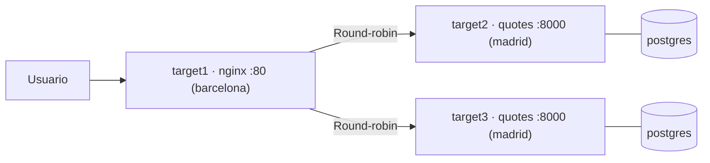

# Proyecto Final: Infraestructura quotes 🏗️

Has llegado al final del curso. Es hora de juntar todo lo aprendido en un proyecto que simula una infraestructura real: tres servidores, balanceo de carga, secretos cifrados y firewall bastionado, todo automatizado con Ansible.

:::info Video pendiente de grabación
:::

## El escenario

Tienes tres servidores (`target1`, `target2`, `target3`) y necesitas desplegar la aplicación [pabpereza/quotes](https://github.com/pabpereza/quotes) con alta disponibilidad básica:

- **`barcelona`** (`target1`): Nginx como balanceador de carga
- **`madrid`** (`target2`, `target3`): cada nodo corre el stack completo — quotes API + PostgreSQL



Si un nodo de madrid cae, Nginx sigue enviando tráfico al otro. Cada nodo tiene su propia base de datos (válido para APIs sin estado compartido).

El proyecto se divide en **tres fases**:

| Fase | Descripción | Módulos del curso |
|------|-------------|-------------------|
| **1 - Plataformado** | Preflight, Docker, facts | 101–107 |
| **2 - Despliegue** | Stack quotes + Nginx balanceador | 105–109 |
| **3 - Bastionado** | Firewall UFW por rol de servidor | 106–109 |


## Estructura del proyecto

```text
quotes-infra/
├── ansible.cfg
├── requirements.yml
├── .gitignore
├── inventory/
│   └── hosts.yml
├── group_vars/
│   ├── all/
│   │   ├── vars.yml
│   │   └── vault.yml         # cifrado con Ansible Vault
│   ├── barcelona.yml
│   └── madrid.yml
├── roles/
│   ├── stack/                # quotes + postgres via Compose
│   │   ├── defaults/main.yml
│   │   ├── tasks/main.yml
│   │   ├── handlers/main.yml
│   │   └── templates/
│   │       └── docker-compose.yml.j2
│   └── nginx/                # balanceador de carga
│       ├── defaults/main.yml
│       ├── tasks/main.yml
│       ├── handlers/main.yml
│       └── templates/
│           └── quotes.conf.j2
└── site.yml
```


## Fase 1: Plataformado

**Conceptos aplicados**: inventarios YAML, group_vars, assert, facts, set_fact, roles de Galaxy, requirements.yml

### `ansible.cfg`

```ini
[defaults]
inventory            = inventory/hosts.yml
roles_path           = roles:~/.ansible/roles
collections_paths    = ./collections:~/.ansible/collections
host_key_checking    = False
stdout_callback      = yaml

[privilege_escalation]
become      = True
become_method = sudo
```

### `requirements.yml`

```yaml
roles:
  - name: geerlingguy.docker
    version: 7.4.2

collections:
  - name: community.docker
    version: ">=3.4.0"
```

```bash
ansible-galaxy install -r requirements.yml
ansible-galaxy collection install -r requirements.yml
```

### `inventory/hosts.yml`

```yaml
all:
  children:
    barcelona:
      hosts:
        target1:
          ansible_host: localhost
          ansible_port: 55000
    madrid:
      hosts:
        target2:
          ansible_host: localhost
          ansible_port: 55001
        target3:
          ansible_host: localhost
          ansible_port: 55002
  vars:
    ansible_user: ansible
    ansible_ssh_pass: ansible
```

### `group_vars/all/vars.yml`

```yaml
app_image: pabpereza/quotes:latest
app_port: 8000
postgres_image: postgres:16-alpine
postgres_user: quotes
postgres_db: quotes
postgres_password: "{{ vault_postgres_password }}"
compose_dir: /opt/quotes
```

### `group_vars/all/vault.yml` (cifrado)

```bash
ansible-vault create group_vars/all/vault.yml
```

Contenido antes de cifrar:

```yaml
vault_postgres_password: "S3cur3_P4ss_2025!"
```

### `group_vars/barcelona.yml`

```yaml
# Puertos que nginx necesita exponer
allowed_ports:
  - { port: "80", proto: tcp, src: any }
```

### `group_vars/madrid.yml`

```yaml
# Puerto de la API quotes
allowed_ports:
  - { port: "{{ app_port }}", proto: tcp, src: any }
```

### `.gitignore`

```
.vault_pass
*.retry
collections/
```

### Play de plataformado en `site.yml`

```yaml
- name: "Fase 1 — Plataformado"
  hosts: all
  become: yes
  tags: [plataformado]

  pre_tasks:
    - name: Verificar requisitos mínimos del servidor
      assert:
        that:
          - ansible_facts['memtotal_mb'] >= 512
          - ansible_facts['processor_vcpus'] >= 1
        fail_msg: >
          {{ inventory_hostname }} no cumple requisitos:
          RAM {{ ansible_facts['memtotal_mb'] }}MB (mínimo 512MB),
          vCPUs {{ ansible_facts['processor_vcpus'] }} (mínimo 1)
        success_msg: "{{ inventory_hostname }} validado — {{ ansible_facts['processor_vcpus'] }} vCPUs, {{ ansible_facts['memtotal_mb'] }}MB RAM"

    - name: Calcular CPU disponible por contenedor (75% del servidor)
      set_fact:
        cpu_per_container: "{{ (ansible_facts['processor_vcpus'] * 0.75) | round(1) }}"

  roles:
    - geerlingguy.docker

  post_tasks:
    - name: Instalar SDK Python de Docker
      ansible.builtin.pip:
        name: docker
        state: present
```

### Checkpoint ✅

```bash
# Verificar conectividad
ansible all -m ping

# Comprobar Docker en los tres nodos
ansible all -m command -a "docker --version"

# Ver los facts calculados
ansible all -m debug -a "var=cpu_per_container"
```

---

## Fase 2: Despliegue

**Conceptos aplicados**: roles, templates Jinja2, docker_compose_v2, block/rescue/always, handlers, no_log, Vault

### Rol `stack` — quotes + postgres en madrid

#### `roles/stack/defaults/main.yml`

```yaml
stack_compose_dir: "{{ compose_dir }}"
```

#### `roles/stack/templates/docker-compose.yml.j2`

```yaml
# Generado por Ansible para {{ inventory_hostname }}
# cpu_per_container: {{ cpu_per_container }}
services:
  postgres:
    image: {{ postgres_image }}
    deploy:
      resources:
        limits:
          cpus: "{{ cpu_per_container }}"
    environment:
      POSTGRES_USER: "{{ postgres_user }}"
      POSTGRES_PASSWORD: "{{ postgres_password }}"
      POSTGRES_DB: "{{ postgres_db }}"
    volumes:
      - postgres_data:/var/lib/postgresql/data
    restart: unless-stopped
    healthcheck:
      test: ["CMD", "pg_isready", "-U", "{{ postgres_user }}"]
      interval: 10s
      retries: 5

  quotes:
    image: "{{ app_image }}"
    deploy:
      resources:
        limits:
          cpus: "{{ cpu_per_container }}"
    ports:
      - "{{ app_port }}:8000"
    environment:
      POSTGRES_HOST: postgres
      POSTGRES_USER: "{{ postgres_user }}"
      POSTGRES_PASSWORD: "{{ postgres_password }}"
      POSTGRES_DB: "{{ postgres_db }}"
    depends_on:
      postgres:
        condition: service_healthy
    restart: unless-stopped

volumes:
  postgres_data:
```

#### `roles/stack/tasks/main.yml`

```yaml
- name: Crear directorio del proyecto
  ansible.builtin.file:
    path: "{{ stack_compose_dir }}"
    state: directory
    mode: '0755'

- name: Renderizar docker-compose.yml
  ansible.builtin.template:
    src: docker-compose.yml.j2
    dest: "{{ stack_compose_dir }}/docker-compose.yml"
    mode: '0644'
  notify: Reiniciar stack
  no_log: true   # evita que postgres_password aparezca en los logs

- name: Despliegue resiliente del stack
  block:
    - name: Levantar stack quotes
      community.docker.docker_compose_v2:
        project_src: "{{ stack_compose_dir }}"
        state: present
        pull: missing

    - name: Esperar a que quotes responda
      ansible.builtin.uri:
        url: "http://localhost:{{ app_port }}/health"
        status_code: 200
      register: health
      until: health.status == 200
      retries: 15
      delay: 5

  rescue:
    - name: Volcar últimas líneas del log de quotes
      ansible.builtin.command: docker logs --tail 30 quotes
      register: quotes_logs
      changed_when: false
      failed_when: false

    - name: Mostrar logs para diagnóstico
      ansible.builtin.debug:
        msg: "{{ quotes_logs.stdout_lines | default(['sin logs disponibles']) }}"

    - name: Fallar con mensaje claro
      ansible.builtin.fail:
        msg: "Stack no arrancó en {{ inventory_hostname }}. Revisa los logs anteriores."

  always:
    - name: Registrar resultado en {{ inventory_hostname }}
      ansible.builtin.debug:
        msg: "Despliegue de stack finalizado en {{ inventory_hostname }}"
```

#### `roles/stack/handlers/main.yml`

```yaml
- name: Reiniciar stack
  community.docker.docker_compose_v2:
    project_src: "{{ stack_compose_dir }}"
    state: present
    recreate: always
  no_log: true
```

---

### Rol `nginx` — balanceador en barcelona

El template itera sobre `groups['madrid']` para construir el upstream automáticamente. Si mañana añades `target4` al grupo `madrid`, nginx lo incluye sin tocar ningún fichero.

#### `roles/nginx/defaults/main.yml`

```yaml
nginx_image: nginx:1.27-alpine
nginx_port: 80
nginx_conf_dir: /etc/nginx/quotes
```

#### `roles/nginx/templates/quotes.conf.j2`

```nginx
# Generado por Ansible — {{ ansible_facts['date_time']['date'] }}
# Upstream dinámico: {{ groups['madrid'] | join(', ') }}

upstream quotes_backend {

    server {{ hostvars[host]['ansible_facts']['default_ipv4']['address'] }}:{{ app_port }};

}

server {
    listen {{ nginx_port }};
    server_name _;

    location / {
        proxy_pass         http://quotes_backend;
        proxy_set_header   Host              $host;
        proxy_set_header   X-Real-IP         $remote_addr;
        proxy_set_header   X-Forwarded-For   $proxy_add_x_forwarded_for;
        proxy_connect_timeout 5s;
        proxy_read_timeout    30s;
    }

    location /health {
        proxy_pass   http://quotes_backend/health;
        access_log   off;
    }
}
```

#### `roles/nginx/tasks/main.yml`

```yaml
- name: Crear directorio de configuración de nginx
  ansible.builtin.file:
    path: "{{ nginx_conf_dir }}"
    state: directory
    mode: '0755'

- name: Renderizar configuración nginx
  ansible.builtin.template:
    src: quotes.conf.j2
    dest: "{{ nginx_conf_dir }}/quotes.conf"
    mode: '0644'
  notify: Recrear contenedor nginx

- name: Desplegar contenedor nginx
  community.docker.docker_container:
    name: nginx
    image: "{{ nginx_image }}"
    state: started
    restart_policy: unless-stopped
    ports:
      - "{{ nginx_port }}:80"
    volumes:
      - "{{ nginx_conf_dir }}/quotes.conf:/etc/nginx/conf.d/default.conf:ro"
```

#### `roles/nginx/handlers/main.yml`

```yaml
- name: Recrear contenedor nginx
  community.docker.docker_container:
    name: nginx
    image: "{{ nginx_image }}"
    state: started
    restart_policy: unless-stopped
    recreate: true
    ports:
      - "{{ nginx_port }}:80"
    volumes:
      - "{{ nginx_conf_dir }}/quotes.conf:/etc/nginx/conf.d/default.conf:ro"
```

---

### Plays de despliegue en `site.yml`

```yaml
- name: "Fase 2a — Stack quotes + postgres en madrid"
  hosts: madrid
  become: yes
  tags: [despliegue, stack]
  roles:
    - stack

- name: "Fase 2b — Nginx balanceador en barcelona"
  hosts: barcelona
  become: yes
  tags: [despliegue, nginx]
  roles:
    - nginx
```

### Checkpoint ✅

```bash
# Comprobar que el stack corre en target2 y target3
ansible madrid -m command -a "docker compose -f /opt/quotes/docker-compose.yml ps"

# Verificar salud de cada API directamente
ansible madrid -m uri -a "url=http://localhost:8000/health"

# Verificar que nginx balancea (debe responder desde barcelona)
ansible barcelona -m uri -a "url=http://localhost/health"

# Varias peticiones para ver el round-robin
curl http://localhost/quotes
curl http://localhost/quotes
```

---

## Fase 3: Bastionado

**Conceptos aplicados**: loop, group_vars por rol, when, handlers

Cada servidor solo abre los puertos que necesita, usando la variable `allowed_ports` definida por grupo:

- **barcelona**: puerto 80 abierto al mundo
- **madrid**: puerto 8000 accesible (en producción restringirías el origen a la IP de target1)

```yaml
- name: "Fase 3 — Bastionado UFW"
  hosts: all
  become: yes
  tags: [bastionado]

  tasks:
    - name: Instalar UFW
      ansible.builtin.apt:
        name: ufw
        state: present
        update_cache: yes

    - name: Política por defecto — denegar entrada
      community.general.ufw:
        direction: incoming
        policy: deny

    - name: Permitir SSH siempre
      community.general.ufw:
        rule: allow
        port: "22"
        proto: tcp

    - name: Abrir puertos según rol del servidor
      community.general.ufw:
        rule: allow
        port: "{{ item.port }}"
        proto: "{{ item.proto }}"
        src: "{{ item.src | default('any') }}"
      loop: "{{ allowed_ports }}"
      loop_control:
        label: "{{ item.port }}/{{ item.proto }} desde {{ item.src | default('any') }}"

    - name: Activar UFW
      community.general.ufw:
        state: enabled
```

### Checkpoint ✅

```bash
# Ver reglas activas en cada servidor
ansible all -m command -a "ufw status verbose"

# Comprobar que todo sigue funcionando tras el bastionado
ansible barcelona -m uri -a "url=http://localhost/health"
```

---

## `site.yml` completo

```yaml
---
- name: "Fase 1 — Plataformado"
  hosts: all
  become: yes
  tags: [plataformado]

  pre_tasks:
    - name: Verificar requisitos mínimos
      ansible.builtin.assert:
        that:
          - ansible_facts['memtotal_mb'] >= 512
          - ansible_facts['processor_vcpus'] >= 1
        fail_msg: >
          {{ inventory_hostname }} no cumple requisitos mínimos
          (RAM: {{ ansible_facts['memtotal_mb'] }}MB, vCPUs: {{ ansible_facts['processor_vcpus'] }})
        success_msg: "{{ inventory_hostname }} validado"

    - name: Calcular CPU disponible por contenedor
      ansible.builtin.set_fact:
        cpu_per_container: "{{ (ansible_facts['processor_vcpus'] * 0.75) | round(1) }}"

  roles:
    - geerlingguy.docker

  post_tasks:
    - name: Instalar SDK Python de Docker
      ansible.builtin.pip:
        name: docker
        state: present

- name: "Fase 2a — Stack quotes + postgres en madrid"
  hosts: madrid
  become: yes
  tags: [despliegue, stack]
  roles:
    - stack

- name: "Fase 2b — Nginx balanceador en barcelona"
  hosts: barcelona
  become: yes
  tags: [despliegue, nginx]
  roles:
    - nginx

- name: "Fase 3 — Bastionado UFW"
  hosts: all
  become: yes
  tags: [bastionado]

  tasks:
    - name: Instalar UFW
      ansible.builtin.apt:
        name: ufw
        state: present

    - name: Política por defecto — denegar entrada
      community.general.ufw:
        direction: incoming
        policy: deny

    - name: Permitir SSH siempre
      community.general.ufw:
        rule: allow
        port: "22"
        proto: tcp

    - name: Abrir puertos según rol del servidor
      community.general.ufw:
        rule: allow
        port: "{{ item.port }}"
        proto: "{{ item.proto }}"
        src: "{{ item.src | default('any') }}"
      loop: "{{ allowed_ports }}"
      loop_control:
        label: "{{ item.port }}/{{ item.proto }} desde {{ item.src | default('any') }}"

    - name: Activar UFW
      community.general.ufw:
        state: enabled
```

### Ejecución

```bash
# Desplegar todo
ansible-playbook site.yml --ask-vault-pass

# Solo plataformado
ansible-playbook site.yml --tags plataformado --ask-vault-pass

# Solo despliegue (asume Docker ya instalado)
ansible-playbook site.yml --tags despliegue --ask-vault-pass

# Solo bastionado
ansible-playbook site.yml --tags bastionado

# Simular sin aplicar cambios
ansible-playbook site.yml --check --diff --ask-vault-pass
```

---

## Mapa de conceptos del curso

| Concepto | Módulo | Dónde se aplica |
|----------|--------|-----------------|
| Inventarios YAML, grupos anidados | [102](102.Inventarios.md) | `inventory/hosts.yml` — grupos `madrid`/`barcelona` |
| Comandos ad-hoc | [103](103.Playbooks.md) | Checkpoints con `ansible all -m ping` |
| Módulos e idempotencia | [104](104.Modulos_idempotencia.md) | `file`, `apt`, `pip`, `uri` en roles y plays |
| `community.docker`, Compose | [105](105.Contenedores.md) | Rol `stack` con `docker_compose_v2` |
| `group_vars`, facts, `set_fact` | [106](106.Variables_control_flujo.md) | `cpu_per_container` calculado por servidor; `allowed_ports` por grupo |
| Roles, Galaxy, `requirements.yml` | [107](107.Roles.md) | Roles `stack` y `nginx`; `geerlingguy.docker` de Galaxy |
| Vault, `no_log` | [108](108.Seguridad.md) | `vault_postgres_password` en `vault.yml`; `no_log: true` en tareas con credenciales |
| `assert`, `block`/`rescue`/`always` | [109](109.Errores_depuracion.md) | Preflight con `assert`; despliegue resiliente con rollback en rol `stack` |
| Tags, despliegue selectivo | [110](110.CICD.md) | Tags `plataformado`, `despliegue`, `bastionado` en `site.yml` |
