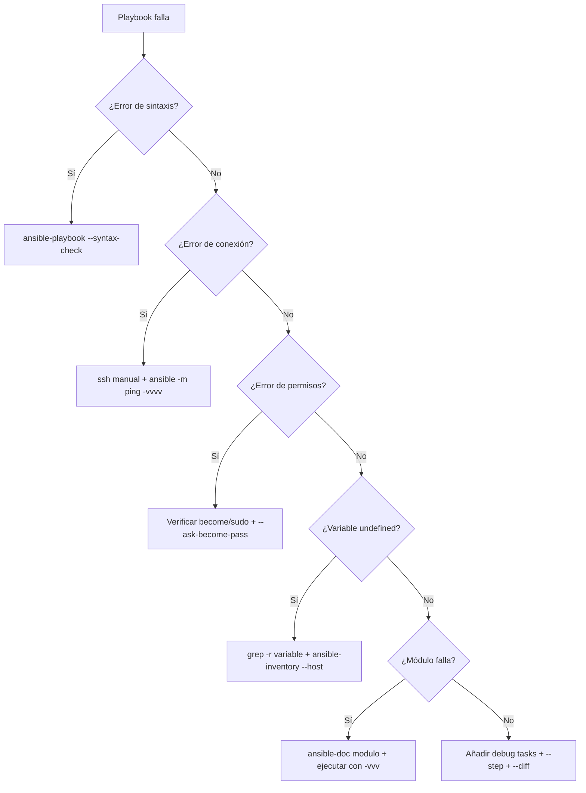

# Depuración y Troubleshooting 🔍

Cómo encontrar y solucionar problemas cuando tus playbooks no funcionan como esperabas.

:::info Video pendiente de grabación
:::

## 14.1. La Realidad: Las Cosas Fallan

No importa lo bueno que seas, tus playbooks van a fallar. La diferencia entre un principiante y un profesional es la **velocidad a la que diagnostican y resuelven** el problema.

### 🕵️ La Analogía: El Detective

Depurar es como resolver un caso policial:
1. **Examinas la escena del crimen** (los logs de error)
2. **Buscas pistas** (verbose mode, debug)
3. **Interrogas a los sospechosos** (variables, facts, conexión SSH)
4. **Reconstruyes los hechos** (paso a paso)

---

## 14.2. Niveles de Verbosidad (`-v`)

La primera herramienta de diagnóstico es **subir el volumen** de la salida de Ansible.

```bash
# Normal (solo resultados)
ansible-playbook site.yml

# Verbose (-v): Muestra el resultado de cada tarea
ansible-playbook site.yml -v

# Más verbose (-vv): Incluye detalles de conexión
ansible-playbook site.yml -vv

# Muy verbose (-vvv): Incluye comandos SSH completos
ansible-playbook site.yml -vvv

# Máximo verbose (-vvvv): Incluye debug de conexión SSH
ansible-playbook site.yml -vvvv
```

### ¿Qué nivel usar?

| Nivel | Cuándo usarlo |
|-------|-------------|
| `-v` | "¿Qué devolvió esta tarea?" |
| `-vv` | "¿Se está conectando al host correcto?" |
| `-vvv` | "¿Qué comando SSH está ejecutando?" |
| `-vvvv` | "¿Por qué no se conecta por SSH?" |

### Ejemplo Práctico

```bash
# Tu playbook falla en una tarea de apt
$ ansible-playbook site.yml -v

TASK [Instalar Nginx] ***************
fatal: [web01]: FAILED! => {
    "changed": false,
    "msg": "No package matching 'ngnix' is available"
    #                              ^^^^^^ ¡Typo! Es "nginx"
}
```

Con `-v` pudiste ver el mensaje de error completo que te reveló el problema.

---

## 14.3. El Módulo `debug`: Tu Mejor Amigo

El módulo `debug` es el equivalente a `console.log()` o `print()`. Te permite inspeccionar variables en cualquier punto del playbook.

### Inspeccionar Variables

```yaml
- name: Ver el valor de una variable
  debug:
    var: my_variable

- name: Ver con formato personalizado
  debug:
    msg: "El puerto es {{ app_port }} y el host es {{ db_host }}"

- name: Ver tipo y contenido de una variable compleja
  debug:
    var: ansible_facts
    verbosity: 2  # Solo se muestra con -vv o más
```

### Inspeccionar el Resultado de una Tarea

```yaml
- name: Ejecutar comando
  shell: systemctl status nginx
  register: nginx_status
  ignore_errors: yes

- name: Ver TODO el resultado (estructura completa)
  debug:
    var: nginx_status

- name: Ver solo lo que necesitas
  debug:
    msg: |
      RC: {{ nginx_status.rc }}
      Stdout: {{ nginx_status.stdout_lines | join('\n') }}
      Stderr: {{ nginx_status.stderr }}
      Changed: {{ nginx_status.changed }}
      Failed: {{ nginx_status.failed }}
```

### Inspeccionar Facts del Sistema

```yaml
- name: Ver TODOS los facts (genera MUCHO output)
  debug:
    var: ansible_facts

- name: Ver facts específicos
  debug:
    msg: |
      SO: {{ ansible_distribution }} {{ ansible_distribution_version }}
      IP: {{ ansible_default_ipv4.address }}
      RAM: {{ ansible_memtotal_mb }}MB
      Disco libre (/): {{ ansible_mounts | selectattr('mount','equalto','/') | map(attribute='size_available') | first | human_readable }}
```

### Truco: Debug Condicional

```yaml
# Solo muestra debug si la variable tiene un valor inesperado
- name: Alerta si hay poco disco
  debug:
    msg: "⚠️ ¡Poco espacio en disco! Solo {{ disk_free }}MB libres"
  when: disk_free | int < 1024
```

---

## 14.4. Modo Check (Dry Run) y Diff

### `--check`: Simulación sin Cambios

Ansible ejecuta el playbook pero **no aplica ningún cambio**. Es como un ensayo general.

```bash
ansible-playbook site.yml --check
```

**Limitaciones:**
- Tareas que dependen de resultados de tareas anteriores pueden fallar (porque la tarea anterior no se ejecutó realmente)
- Módulos `shell` y `command` se saltan por defecto

```yaml
# Forzar que un comando se ejecute incluso en modo check
- name: Verificar versión de la app
  shell: /opt/app/bin/app --version
  register: app_version
  check_mode: no  # Se ejecuta incluso con --check
  changed_when: false
```

### `--diff`: Ver Qué Cambia

Muestra las diferencias exactas que Ansible va a aplicar en archivos.

```bash
# Ver qué cambiará (sin aplicar)
ansible-playbook site.yml --check --diff

# Aplicar y ver los cambios
ansible-playbook site.yml --diff
```

**Ejemplo de salida:**

```diff
TASK [Copiar configuración de Nginx] ***
--- before: /etc/nginx/nginx.conf
+++ after: /etc/nginx/nginx.conf
@@ -1,3 +1,3 @@
 server {
-    listen 80;
+    listen 8080;
     server_name example.com;
```

---

## 14.5. `--step` y `--start-at-task`: Control Manual

### Ejecución Paso a Paso

```bash
ansible-playbook site.yml --step
```

Ansible te preguntará antes de cada tarea:

```
TASK [Instalar Nginx] ****
Perform task: TASK: Instalar Nginx (N)o/(y)es/(c)ontinue:
```

- **y**: Ejecutar esta tarea
- **n**: Saltar esta tarea
- **c**: Ejecutar esta y todas las siguientes sin preguntar

### Empezar desde una Tarea Específica

```bash
# Saltar todo hasta la tarea "Configurar firewall"
ansible-playbook site.yml --start-at-task "Configurar firewall"
```

Es muy útil cuando el playbook falla a mitad de camino y quieres reiniciar desde donde falló sin repetir todo.

### Listar Tareas sin Ejecutar

```bash
# Ver todas las tareas del playbook
ansible-playbook site.yml --list-tasks

# Ver solo las de un tag
ansible-playbook site.yml --list-tasks --tags config
```

---

## 14.6. Errores Comunes y sus Soluciones

### Error 1: "Unreachable" - No se puede conectar

```
fatal: [web01]: UNREACHABLE! => {
    "msg": "Failed to connect to the host via ssh"
}
```

**Diagnóstico:**

```bash
# 1. ¿Puedes hacer SSH manualmente?
ssh usuario@web01

# 2. ¿El host es correcto?
ansible -i inventory.ini web01 -m ping -vvvv

# 3. ¿La clave SSH es correcta?
ssh -i ~/.ssh/id_rsa usuario@web01

# 4. ¿El puerto SSH es el estándar?
ssh -p 2222 usuario@web01
```

**Soluciones comunes:**

```ini
# inventory.ini
web01 ansible_host=192.168.1.10 ansible_port=2222 ansible_user=deploy ansible_ssh_private_key_file=~/.ssh/deploy_key
```

### Error 2: "Permission denied" - Falta sudo

```
fatal: [web01]: FAILED! => {
    "msg": "Missing sudo password"
}
```

**Solución:**

```bash
# Opción 1: Pedir contraseña sudo
ansible-playbook site.yml --ask-become-pass

# Opción 2: Configurar sudo sin contraseña (en el servidor)
echo "deploy ALL=(ALL) NOPASSWD:ALL" | sudo tee /etc/sudoers.d/deploy
```

### Error 3: "Module failure" - El módulo no existe

```
fatal: [web01]: FAILED! => {
    "msg": "The module custom_module was not found"
}
```

**Diagnóstico:**

```bash
# ¿El módulo existe?
ansible-doc -l | grep custom_module

# ¿Es de una collection?
ansible-galaxy collection list

# ¿Falta instalar la collection?
ansible-galaxy collection install community.general
```

### Error 4: "Variable undefined" - Variable no definida

```
fatal: [web01]: FAILED! => {
    "msg": "The task includes an option with an undefined variable. The error was: 'app_port' is undefined"
}
```

**Diagnóstico:**

```bash
# ¿Dónde debería estar definida?
grep -r "app_port" group_vars/ host_vars/ inventory/

# ¿Qué variables ve Ansible para este host?
ansible -i inventory.ini web01 -m debug -a "var=hostvars[inventory_hostname]"
```

### Error 5: Indentación YAML incorrecta

```
ERROR! Syntax Error while loading YAML.
  mapping values are not allowed in this context
```

**Diagnóstico:**

```bash
# Validar sintaxis YAML
python -c "import yaml; yaml.safe_load(open('playbook.yml'))"

# Usar yamllint para más detalle
pip install yamllint
yamllint playbook.yml

# Verificar sintaxis del playbook
ansible-playbook --syntax-check playbook.yml
```

**Causa más frecuente:** mezclar tabs y espacios, o indentación incorrecta.

### Error 6: "Vault password not provided"

```
ERROR! Attempting to decrypt but no vault secrets found
```

**Solución:**

```bash
# Proporcionar contraseña
ansible-playbook site.yml --ask-vault-pass

# O usar archivo de contraseña
ansible-playbook site.yml --vault-password-file ~/.vault_pass
```

---

## 14.7. Herramientas de Diagnóstico Avanzadas

### `ansible-config dump`: Ver Configuración Efectiva

```bash
# Ver TODA la configuración activa
ansible-config dump

# Ver solo las que difieren del default
ansible-config dump --only-changed

# Ver de dónde viene cada configuración
ansible-config dump -v
```

### `ansible-inventory`: Inspeccionar el Inventario

```bash
# Ver el inventario completo en JSON
ansible-inventory -i inventory.ini --list

# Ver el grafo de grupos
ansible-inventory -i inventory.ini --graph

# Ver variables de un host específico
ansible-inventory -i inventory.ini --host web01
```

**Ejemplo de salida de `--graph`:**

```
@all:
  |--@webservers:
  |  |--web01
  |  |--web02
  |--@dbservers:
  |  |--db01
  |--@ungrouped:
```

### `ansible-console`: Shell Interactiva

```bash
# Abrir consola interactiva contra los webservers
ansible-console -i inventory.ini webservers --become

# Dentro de la consola, ejecutar módulos directamente
web01,web02> ping
web01,web02> shell uptime
web01,web02> setup filter=ansible_distribution
web01,web02> apt name=htop state=present
```

Es perfecto para explorar y probar módulos antes de escribirlos en un playbook.

---

## 14.8. Callback Plugins: Mejorar la Salida

Los callback plugins cambian cómo Ansible muestra los resultados.

### `yaml` - Salida legible

```ini
# ansible.cfg
[defaults]
stdout_callback = yaml
```

**Antes (default):**
```
ok: [web01] => {"ansible_facts": {"ansible_distribution": "Ubuntu"}}
```

**Después (yaml):**
```yaml
ok: [web01] =>
  ansible_facts:
    ansible_distribution: Ubuntu
```

### `timer` - Tiempo de ejecución

```ini
# ansible.cfg
[defaults]
callbacks_enabled = timer, profile_tasks
```

Añade el tiempo total al final y el tiempo de cada tarea:

```
TASK [Instalar paquetes] ****
ok: [web01]
 --- 12.45s

Playbook run took 0 days, 0 hours, 2 minutes, 34 seconds
```

### `debug` - Más detalles en errores

```ini
# ansible.cfg
[defaults]
stdout_callback = debug
```

Muestra stdout y stderr separados y formateados cuando una tarea falla.

---

## 14.9. Estrategia de Depuración: El Método Sistemático

Cuando algo falla, sigue este proceso ordenado:



### Checklist de Depuración Rápida

```bash
# 1. ¿La sintaxis es correcta?
ansible-playbook --syntax-check playbook.yml

# 2. ¿Los hosts son accesibles?
ansible -i inventory.ini all -m ping

# 3. ¿Las variables están definidas?
ansible-inventory -i inventory.ini --host web01

# 4. ¿Qué haría sin ejecutar?
ansible-playbook playbook.yml --check --diff -v

# 5. ¿Dónde exactamente falla?
ansible-playbook playbook.yml -vvv --start-at-task "Tarea problemática"
```

---

## 14.10. Práctica: Debuggeando un Playbook Roto 🐛

A continuación tienes un playbook con **varios errores intencionados**. Tu misión es encontrarlos y arreglarlos usando las técnicas de este capítulo.

### El Playbook Roto

```yaml
---
- name: Configurar servidor web
  hosts: webservers
  become: yes

  vars:
    app_port: 8080

  tasks:
    - name: Instalar Ngnix    # 🐛 Error 1: ¿Ves algo raro en el nombre del paquete?
      apt:
        name: ngnix
        state: present

    - name: Crear directorio de la app
      file:
        path: "/opt/{{ app_name }}/current"  # 🐛 Error 2: ¿Está definida app_name?
        state: directory
        owner: www-data

    - name: Verificar si la app ya está corriendo
      shell: "curl -s http://localhost:{{ app_port }}/health"
      register: health
      # 🐛 Error 3: ¿Qué pasa si la app no está corriendo aún?

    - name: Copiar configuración
      copy:
        src: ./files/app.conf
        dest: /etc/app/config.yml
	    mode: '0644'        # 🐛 Error 4: Indentación con tabs

    - name: Reiniciar aplicación
      command: systemctl restart myapp
      # 🐛 Error 5: ¿command o systemd? ¿changed_when?
```

### Proceso de Diagnóstico

```bash
# Paso 1: Verificar sintaxis
ansible-playbook broken.yml --syntax-check
# → Detecta Error 4 (tabs vs espacios)

# Paso 2: Ejecutar en dry-run con verbosidad
ansible-playbook broken.yml --check -v
# → Detecta Error 1 (paquete "ngnix" no existe)
# → Detecta Error 2 (app_name undefined)

# Paso 3: Añadir debug tasks para investigar Error 3
# Añadir failed_when para que curl no falle si la app no está corriendo

# Paso 4: Corregir Error 5 usando el módulo systemd
```

### El Playbook Corregido

```yaml
---
- name: Configurar servidor web
  hosts: webservers
  become: yes

  vars:
    app_port: 8080
    app_name: myapp  # ✅ Fix 2: Variable definida

  tasks:
    - name: Instalar Nginx
      apt:
        name: nginx  # ✅ Fix 1: Nombre correcto
        state: present

    - name: Crear directorio de la app
      file:
        path: "/opt/{{ app_name }}/current"
        state: directory
        owner: www-data

    - name: Verificar si la app ya está corriendo
      shell: "curl -s http://localhost:{{ app_port }}/health"
      register: health
      failed_when: false         # ✅ Fix 3: No fallar si no está corriendo
      changed_when: false

    - name: Copiar configuración
      copy:
        src: ./files/app.conf
        dest: /etc/app/config.yml
        mode: '0644'             # ✅ Fix 4: Espacios, no tabs

    - name: Reiniciar aplicación
      systemd:                   # ✅ Fix 5: Módulo correcto
        name: myapp
        state: restarted
```

---

## 📝 Resumen del Capítulo

En este capítulo has aprendido:

✅ **Verbosidad** (`-v` a `-vvvv`): Subir el nivel de detalle de la salida
✅ **Módulo debug**: Inspeccionar variables, facts y resultados de tareas
✅ **`--check` y `--diff`**: Simular ejecución y ver cambios exactos
✅ **`--step` y `--start-at-task`**: Control manual de la ejecución
✅ **Errores comunes**: Conexión, permisos, variables, YAML, Vault
✅ **Herramientas avanzadas**: `ansible-config`, `ansible-inventory`, `ansible-console`
✅ **Callback plugins**: Mejorar la legibilidad de la salida
✅ **Método sistemático**: Checklist de depuración paso a paso

**Has completado el curso de Ansible.** Ahora tienes las herramientas para automatizar, proteger, organizar y depurar tu infraestructura como un profesional. ¡Feliz automatización! 🚀
