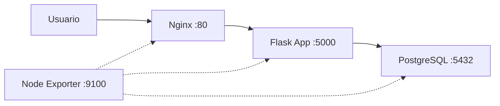

# Proyecto Final: Desplegando "NotaStack"

Has llegado al final del curso. Es hora de poner todo en práctica con un proyecto que simula un escenario real: desplegar una aplicación web completa con base de datos, servidor web y monitorización.

:::info Video pendiente de grabación
:::

## 15.1. El Escenario

Tu empresa ficticia, **NotaStack**, necesita automatizar el despliegue de su aplicación de notas. La infraestructura consta de:

- **Servidor web**: Nginx como proxy inverso
- **Aplicación**: Una API sencilla en Python (Flask)
- **Base de datos**: PostgreSQL
- **Monitorización**: Node Exporter (Prometheus)



### Entorno de trabajo

Usaremos contenedores Docker como nodos gestionados para no necesitar máquinas virtuales. Si no tienes Docker, puedes adaptar el inventario a máquinas virtuales o instancias en la nube.

```yaml
# docker-compose.yml
version: '3'
services:
  web:
    image: geerlingguy/docker-ubuntu2204-ansible
    privileged: true
    ports:
      - "8080:80"
    volumes:
      - /sys/fs/cgroup:/sys/fs/cgroup:ro
    networks:
      notastack:
        ipv4_address: 172.20.0.10

  app:
    image: geerlingguy/docker-ubuntu2204-ansible
    privileged: true
    ports:
      - "5000:5000"
    volumes:
      - /sys/fs/cgroup:/sys/fs/cgroup:ro
    networks:
      notastack:
        ipv4_address: 172.20.0.11

  db:
    image: geerlingguy/docker-ubuntu2204-ansible
    privileged: true
    volumes:
      - /sys/fs/cgroup:/sys/fs/cgroup:ro
    networks:
      notastack:
        ipv4_address: 172.20.0.12

networks:
  notastack:
    driver: bridge
    ipam:
      config:
        - subnet: 172.20.0.0/24
```

Levanta el entorno con:
```bash
docker compose up -d
```

> El proyecto se divide en **fases incrementales**. Cada fase añade complejidad y utiliza conceptos nuevos del curso. No intentes hacerlo todo de golpe, ve fase a fase.


## 15.2. Fase 1 - Estructura y primeros pasos

**Conceptos**: inventarios, comandos ad-hoc, playbooks básicos, módulos

### Objetivo

Crear la estructura del proyecto y verificar la conectividad con todos los nodos.

### Paso 1: Estructura del proyecto

Crea la siguiente estructura de carpetas:

```
notastack/
├── ansible.cfg
├── inventory/
│   └── hosts.yml
├── playbooks/
│   └── site.yml
├── roles/
├── group_vars/
│   └── all.yml
├── host_vars/
├── templates/
└── files/
```

### Paso 2: Configuración base

```ini
# ansible.cfg
[defaults]
inventory = inventory/hosts.yml
roles_path = roles
host_key_checking = False
retry_files_enabled = False

[privilege_escalation]
become = True
become_method = sudo
```

### Paso 3: Inventario

Aquí aplicamos lo aprendido en la [sección de inventarios](03-inventarios.md). Fíjate en cómo agrupamos los hosts por función y cómo usamos variables de grupo.

```yaml
# inventory/hosts.yml
all:
  children:
    webservers:
      hosts:
        web01:
          ansible_host: 172.20.0.10
    appservers:
      hosts:
        app01:
          ansible_host: 172.20.0.11
    databases:
      hosts:
        db01:
          ansible_host: 172.20.0.12
  vars:
    ansible_user: root
    ansible_connection: ssh
```

### Paso 4: Variables globales

```yaml
# group_vars/all.yml
---
project_name: notastack
app_user: notastack
app_group: notastack
app_port: 5000
db_port: 5432
```

### Paso 5: Verifica la conectividad

Usa comandos ad-hoc para comprobar que todo funciona:

```bash
# Ping a todos los nodos
ansible all -m ping

# Obtener facts de un nodo
ansible web01 -m setup -a "filter=ansible_distribution*"
```

### Paso 6: Primer playbook

Crea un playbook básico que prepare todos los servidores:

```yaml
# playbooks/site.yml
---
- name: Preparar todos los servidores
  hosts: all
  tasks:
    - name: Actualizar caché de paquetes
      apt:
        update_cache: yes
        cache_valid_time: 3600

    - name: Instalar paquetes comunes
      apt:
        name:
          - python3
          - python3-pip
          - curl
          - vim
          - htop
        state: present

    - name: Crear usuario de la aplicación
      user:
        name: "{{ app_user }}"
        state: present
        shell: /bin/bash
        create_home: yes

    - name: Mostrar información del sistema
      debug:
        msg: >
          Servidor {{ inventory_hostname }} preparado.
          OS: {{ ansible_distribution }} {{ ansible_distribution_version }}.
          RAM: {{ ansible_memtotal_mb }} MB.
```

Ejecútalo y verifica que funciona:

```bash
ansible-playbook playbooks/site.yml
```

### Checkpoint

Antes de continuar, verifica que:
- [ ] `ansible all -m ping` responde `pong` en los tres nodos
- [ ] El playbook `site.yml` se ejecuta sin errores
- [ ] El usuario `notastack` existe en todos los nodos


## 15.3. Fase 2 - Roles y la base de datos

**Conceptos**: roles, variables, handlers, templates Jinja2

### Objetivo

Crear un rol para PostgreSQL que instale, configure y prepare la base de datos de la aplicación.

### Paso 1: Crear el rol

```bash
mkdir -p roles/postgresql/{tasks,handlers,templates,defaults,vars}
```

### Paso 2: Variables por defecto del rol

```yaml
# roles/postgresql/defaults/main.yml
---
postgresql_version: "14"
postgresql_port: 5432
postgresql_listen_addresses: "*"
postgresql_max_connections: 100

# Base de datos de la aplicación
postgresql_db_name: "notastack_db"
postgresql_db_user: "notastack_user"
postgresql_db_password: "CHANGEME"
```

### Paso 3: Tareas del rol

```yaml
# roles/postgresql/tasks/main.yml
---
- name: Instalar PostgreSQL
  apt:
    name:
      - "postgresql-{{ postgresql_version }}"
      - python3-psycopg2
    state: present
    update_cache: yes

- name: Configurar PostgreSQL
  template:
    src: postgresql.conf.j2
    dest: "/etc/postgresql/{{ postgresql_version }}/main/postgresql.conf"
    owner: postgres
    group: postgres
    mode: '0644'
  notify: Reiniciar PostgreSQL

- name: Configurar acceso remoto (pg_hba)
  template:
    src: pg_hba.conf.j2
    dest: "/etc/postgresql/{{ postgresql_version }}/main/pg_hba.conf"
    owner: postgres
    group: postgres
    mode: '0640'
  notify: Reiniciar PostgreSQL

- name: Asegurar que PostgreSQL está arrancado
  systemd:
    name: postgresql
    state: started
    enabled: yes

- name: Crear usuario de base de datos
  become_user: postgres
  community.postgresql.postgresql_user:
    name: "{{ postgresql_db_user }}"
    password: "{{ postgresql_db_password }}"
    state: present

- name: Crear base de datos
  become_user: postgres
  community.postgresql.postgresql_db:
    name: "{{ postgresql_db_name }}"
    owner: "{{ postgresql_db_user }}"
    encoding: UTF-8
    state: present
```

### Paso 4: Templates

Aquí aplicamos lo aprendido en la [sección de templates](08-templates.md):

```jinja2
{# roles/postgresql/templates/postgresql.conf.j2 #}
# Configuración generada por Ansible - No editar manualmente
# Servidor: {{ inventory_hostname }}
# Fecha: {{ ansible_date_time.iso8601 }}

listen_addresses = '{{ postgresql_listen_addresses }}'
port = {{ postgresql_port }}
max_connections = {{ postgresql_max_connections }}

# Memoria - ajustada al {{ (ansible_memtotal_mb * 0.25) | int }} MB (25% de RAM)
shared_buffers = {{ (ansible_memtotal_mb * 0.25) | int }}MB
work_mem = {{ (ansible_memtotal_mb * 0.05) | int }}MB

# Logging
log_destination = 'stderr'
logging_collector = on
log_directory = 'log'
log_filename = 'postgresql-%Y-%m-%d.log'
```

```jinja2
{# roles/postgresql/templates/pg_hba.conf.j2 #}
# Acceso local
local   all   postgres   peer
local   all   all        peer

# Acceso desde la red de la aplicación

host    {{ postgresql_db_name }}   {{ postgresql_db_user }}   {{ hostvars[host]['ansible_host'] }}/32   md5


# Acceso IPv6 local
host    all   all   ::1/128   md5
```

Fíjate cómo el template de `pg_hba.conf` itera sobre los hosts del grupo `appservers` para dar acceso automáticamente. Si mañana añades otro servidor de aplicación al inventario, se configurará solo.

### Paso 5: Handlers

```yaml
# roles/postgresql/handlers/main.yml
---
- name: Reiniciar PostgreSQL
  systemd:
    name: postgresql
    state: restarted
```

### Paso 6: Integrar el rol en el playbook

```yaml
# playbooks/site.yml
---
- name: Preparar todos los servidores
  hosts: all
  tasks:
    - name: Actualizar caché de paquetes
      apt:
        update_cache: yes
        cache_valid_time: 3600

    - name: Instalar paquetes comunes
      apt:
        name: [python3, python3-pip, curl, vim]
        state: present

    - name: Crear usuario de la aplicación
      user:
        name: "{{ app_user }}"
        state: present
        shell: /bin/bash

- name: Configurar base de datos
  hosts: databases
  roles:
    - postgresql
```

### Checkpoint

- [ ] PostgreSQL arranca correctamente en `db01`
- [ ] La base de datos `notastack_db` existe
- [ ] El usuario `notastack_user` puede conectarse


## 15.4. Fase 3 - La aplicación Flask

**Conceptos**: variables de host, register, condicionales, Ansible Galaxy

### Objetivo

Crear un rol para desplegar la aplicación Flask e instalar una colección de Ansible Galaxy.

### Paso 1: Instalar colección de Galaxy

Necesitamos la colección `community.postgresql` que ya usamos antes. Vamos a gestionar dependencias con un fichero de requisitos, como aprendimos en la [sección de Galaxy](09-ansible-galaxy.md):

```yaml
# requirements.yml
---
collections:
  - name: community.postgresql
    version: ">=3.0.0"
  - name: community.general
    version: ">=7.0.0"
```

```bash
ansible-galaxy install -r requirements.yml
```

### Paso 2: Crear el rol de la aplicación

```bash
mkdir -p roles/flask_app/{tasks,handlers,templates,defaults,files}
```

```yaml
# roles/flask_app/defaults/main.yml
---
flask_app_name: notastack
flask_app_port: 5000
flask_app_dir: "/opt/{{ flask_app_name }}"
flask_app_venv: "{{ flask_app_dir }}/venv"
flask_app_workers: "{{ ansible_processor_vcpus | default(2) }}"
```

### Paso 3: Código de la aplicación

```python
# roles/flask_app/files/app.py
from flask import Flask, jsonify, request
import psycopg2
import os

app = Flask(__name__)

def get_db():
    return psycopg2.connect(
        host=os.environ.get('DB_HOST', 'localhost'),
        port=os.environ.get('DB_PORT', '5432'),
        dbname=os.environ.get('DB_NAME', 'notastack_db'),
        user=os.environ.get('DB_USER', 'notastack_user'),
        password=os.environ.get('DB_PASSWORD', '')
    )

@app.route('/health')
def health():
    try:
        conn = get_db()
        conn.close()
        return jsonify({"status": "ok", "database": "connected"})
    except Exception as e:
        return jsonify({"status": "error", "database": str(e)}), 500

@app.route('/api/notes', methods=['GET'])
def get_notes():
    conn = get_db()
    cur = conn.cursor()
    cur.execute("SELECT id, title, content, created_at FROM notes ORDER BY created_at DESC")
    notes = [{"id": r[0], "title": r[1], "content": r[2], "created_at": str(r[3])} for r in cur.fetchall()]
    cur.close()
    conn.close()
    return jsonify(notes)

@app.route('/api/notes', methods=['POST'])
def create_note():
    data = request.get_json()
    conn = get_db()
    cur = conn.cursor()
    cur.execute("INSERT INTO notes (title, content) VALUES (%s, %s) RETURNING id",
                (data['title'], data.get('content', '')))
    note_id = cur.fetchone()[0]
    conn.commit()
    cur.close()
    conn.close()
    return jsonify({"id": note_id}), 201

if __name__ == '__main__':
    app.run(host='0.0.0.0', port=int(os.environ.get('PORT', 5000)))
```

### Paso 4: Tareas del rol

```yaml
# roles/flask_app/tasks/main.yml
---
- name: Instalar dependencias del sistema
  apt:
    name:
      - python3-venv
      - python3-dev
      - libpq-dev
      - gcc
    state: present

- name: Crear directorio de la aplicación
  file:
    path: "{{ flask_app_dir }}"
    state: directory
    owner: "{{ app_user }}"
    group: "{{ app_group }}"
    mode: '0755'

- name: Crear entorno virtual
  command: python3 -m venv {{ flask_app_venv }}
  args:
    creates: "{{ flask_app_venv }}/bin/activate"
  become_user: "{{ app_user }}"

- name: Instalar dependencias Python
  pip:
    name:
      - flask
      - gunicorn
      - psycopg2-binary
    virtualenv: "{{ flask_app_venv }}"
  become_user: "{{ app_user }}"

- name: Copiar código de la aplicación
  copy:
    src: app.py
    dest: "{{ flask_app_dir }}/app.py"
    owner: "{{ app_user }}"
    group: "{{ app_group }}"
    mode: '0644'
  notify: Reiniciar aplicación

- name: Crear fichero de configuración
  template:
    src: app.env.j2
    dest: "{{ flask_app_dir }}/.env"
    owner: "{{ app_user }}"
    group: "{{ app_group }}"
    mode: '0600'
  notify: Reiniciar aplicación

- name: Crear servicio systemd
  template:
    src: app.service.j2
    dest: "/etc/systemd/system/{{ flask_app_name }}.service"
    mode: '0644'
  notify:
    - Recargar systemd
    - Reiniciar aplicación

- name: Iniciar aplicación
  systemd:
    name: "{{ flask_app_name }}"
    state: started
    enabled: yes

- name: Esperar a que la aplicación arranque
  uri:
    url: "http://localhost:{{ flask_app_port }}/health"
    status_code: [200, 500]
  register: health_check
  retries: 5
  delay: 3
  until: health_check.status == 200
```

### Paso 5: Templates del rol

```jinja2
{# roles/flask_app/templates/app.env.j2 #}
# Variables de entorno para {{ flask_app_name }}
# Generado por Ansible
DB_HOST={{ hostvars[groups['databases'][0]]['ansible_host'] }}
DB_PORT={{ db_port }}
DB_NAME={{ postgresql_db_name }}
DB_USER={{ postgresql_db_user }}
DB_PASSWORD={{ postgresql_db_password }}
PORT={{ flask_app_port }}
```

```jinja2
{# roles/flask_app/templates/app.service.j2 #}
[Unit]
Description={{ flask_app_name }} Flask Application
After=network.target

[Service]
User={{ app_user }}
Group={{ app_group }}
WorkingDirectory={{ flask_app_dir }}
EnvironmentFile={{ flask_app_dir }}/.env
ExecStart={{ flask_app_venv }}/bin/gunicorn \
    --workers {{ flask_app_workers }} \
    --bind 0.0.0.0:{{ flask_app_port }} \
    app:app
Restart=always
RestartSec=5

[Install]
WantedBy=multi-user.target
```

### Paso 6: Handlers

```yaml
# roles/flask_app/handlers/main.yml
---
- name: Recargar systemd
  systemd:
    daemon_reload: yes

- name: Reiniciar aplicación
  systemd:
    name: "{{ flask_app_name }}"
    state: restarted
```

### Paso 7: Inicializar la tabla en la base de datos

Necesitamos que la tabla `notes` exista antes de arrancar la app. Añade esta tarea al rol de PostgreSQL:

```yaml
# Añadir al final de roles/postgresql/tasks/main.yml
- name: Crear tabla de notas
  become_user: postgres
  community.postgresql.postgresql_query:
    db: "{{ postgresql_db_name }}"
    query: |
      CREATE TABLE IF NOT EXISTS notes (
        id SERIAL PRIMARY KEY,
        title VARCHAR(200) NOT NULL,
        content TEXT,
        created_at TIMESTAMP DEFAULT CURRENT_TIMESTAMP
      );
      ALTER TABLE notes OWNER TO {{ postgresql_db_user }};
```

### Checkpoint

- [ ] La aplicación Flask arranca en `app01`
- [ ] El endpoint `/health` responde `{"status": "ok", "database": "connected"}`
- [ ] Puedes crear y listar notas via la API


## 15.5. Fase 4 - Nginx y el proxy inverso

**Conceptos**: include/import, dependencias entre plays, tags

### Objetivo

Configurar Nginx como proxy inverso y organizar el playbook principal con includes.

### Paso 1: Rol de Nginx

```bash
mkdir -p roles/nginx/{tasks,handlers,templates,defaults}
```

```yaml
# roles/nginx/defaults/main.yml
---
nginx_worker_processes: auto
nginx_worker_connections: 1024
nginx_upstream_servers: []
```

```yaml
# roles/nginx/tasks/main.yml
---
- name: Instalar Nginx
  apt:
    name: nginx
    state: present
    update_cache: yes

- name: Eliminar configuración por defecto
  file:
    path: /etc/nginx/sites-enabled/default
    state: absent
  notify: Recargar Nginx

- name: Copiar configuración del sitio
  template:
    src: notastack.conf.j2
    dest: /etc/nginx/sites-available/notastack.conf
    mode: '0644'
  notify: Recargar Nginx

- name: Activar sitio
  file:
    src: /etc/nginx/sites-available/notastack.conf
    dest: /etc/nginx/sites-enabled/notastack.conf
    state: link
  notify: Recargar Nginx

- name: Validar configuración de Nginx
  command: nginx -t
  changed_when: false

- name: Iniciar Nginx
  systemd:
    name: nginx
    state: started
    enabled: yes
```

```jinja2
{# roles/nginx/templates/notastack.conf.j2 #}
# Proxy inverso para NotaStack
# Generado por Ansible el {{ ansible_date_time.iso8601 }}

upstream app_backend {

    server {{ hostvars[host]['ansible_host'] }}:{{ app_port }};

}

server {
    listen 80;
    server_name _;

    location / {
        proxy_pass http://app_backend;
        proxy_set_header Host $host;
        proxy_set_header X-Real-IP $remote_addr;
        proxy_set_header X-Forwarded-For $proxy_add_x_forwarded_for;
        proxy_connect_timeout 10s;
        proxy_read_timeout 30s;
    }

    location /health {
        proxy_pass http://app_backend/health;
        access_log off;
    }

    location /stub_status {
        stub_status;
        allow 127.0.0.1;
        deny all;
    }
}
```

```yaml
# roles/nginx/handlers/main.yml
---
- name: Recargar Nginx
  systemd:
    name: nginx
    state: reloaded
```

### Paso 2: Reorganizar con import_playbook

Aquí aplicamos lo aprendido en la [sección de include e import](13-include-import.md). Separamos cada capa en su propio playbook:

```yaml
# playbooks/common.yml
---
- name: Preparación común
  hosts: all
  tags: [common]
  tasks:
    - name: Actualizar caché de paquetes
      apt:
        update_cache: yes
        cache_valid_time: 3600

    - name: Instalar paquetes comunes
      apt:
        name: [python3, python3-pip, curl, vim]
        state: present

    - name: Crear usuario de la aplicación
      user:
        name: "{{ app_user }}"
        state: present
        shell: /bin/bash
```

```yaml
# playbooks/database.yml
---
- name: Configurar base de datos
  hosts: databases
  tags: [database]
  roles:
    - postgresql
```

```yaml
# playbooks/application.yml
---
- name: Desplegar aplicación
  hosts: appservers
  tags: [app]
  roles:
    - flask_app
```

```yaml
# playbooks/webserver.yml
---
- name: Configurar proxy inverso
  hosts: webservers
  tags: [web]
  roles:
    - nginx
```

```yaml
# playbooks/site.yml - Playbook maestro
---
- import_playbook: common.yml
- import_playbook: database.yml
- import_playbook: application.yml
- import_playbook: webserver.yml
```

Ahora puedes desplegar todo o solo una capa:

```bash
# Desplegar todo
ansible-playbook playbooks/site.yml

# Solo la base de datos
ansible-playbook playbooks/site.yml --tags database

# Todo menos el proxy
ansible-playbook playbooks/site.yml --skip-tags web
```

### Checkpoint

- [ ] Nginx sirve la aplicación en el puerto 80 de `web01`
- [ ] Accediendo a `http://172.20.0.10/health` se ve la respuesta de la API
- [ ] El playbook `site.yml` despliega toda la infraestructura de una vez


## 15.6. Fase 5 - Secretos con Vault

**Conceptos**: Ansible Vault, variables cifradas, no_log

### Objetivo

Proteger las contraseñas y datos sensibles con Ansible Vault, como aprendimos en la [sección de Vault](12-vault.md).

### Paso 1: Crear fichero de secretos

```bash
ansible-vault create group_vars/vault.yml
```

Contenido del fichero cifrado:

```yaml
# group_vars/vault.yml (cifrado con Vault)
---
vault_postgresql_db_password: "S3cur3_P4ssw0rd_2024!"
vault_app_secret_key: "flask-super-secret-key-xyz"
```

### Paso 2: Referenciar secretos desde variables

La buena práctica es usar un prefijo `vault_` para las variables cifradas y referenciarlas desde variables normales:

```yaml
# group_vars/all.yml (actualizado)
---
project_name: notastack
app_user: notastack
app_group: notastack
app_port: 5000
db_port: 5432

# Referencia a secretos (cifrados en vault.yml)
postgresql_db_name: notastack_db
postgresql_db_user: notastack_user
postgresql_db_password: "{{ vault_postgresql_db_password }}"
app_secret_key: "{{ vault_app_secret_key }}"
```

### Paso 3: Proteger logs sensibles

Añade `no_log: yes` a las tareas que manejan secretos:

```yaml
# En roles/flask_app/tasks/main.yml, actualiza la tarea del .env
- name: Crear fichero de configuración
  template:
    src: app.env.j2
    dest: "{{ flask_app_dir }}/.env"
    owner: "{{ app_user }}"
    group: "{{ app_group }}"
    mode: '0600'
  no_log: yes
  notify: Reiniciar aplicación
```

### Paso 4: Ejecutar con Vault

```bash
# Con prompt de contraseña
ansible-playbook playbooks/site.yml --ask-vault-pass

# Con fichero de contraseña (no subir a Git)
echo "mi_password_vault" > .vault_pass
echo ".vault_pass" >> .gitignore
ansible-playbook playbooks/site.yml --vault-password-file .vault_pass
```

### Checkpoint

- [ ] El fichero `vault.yml` está cifrado (no se leen las contraseñas en texto plano)
- [ ] El despliegue funciona igual que antes pero usando `--ask-vault-pass`
- [ ] Las contraseñas no aparecen en la salida de Ansible


## 15.7. Fase 6 - Manejo de errores y robustez

**Conceptos**: blocks, rescue, assert, failed_when, changed_when

### Objetivo

Hacer el despliegue resistente a fallos, aplicando lo aprendido en la [sección de manejo de errores](11-manejo-errores.md).

### Paso 1: Validaciones previas al despliegue

Crea un playbook de validación:

```yaml
# playbooks/preflight.yml
---
- name: Validaciones previas al despliegue
  hosts: all
  tags: [preflight]
  tasks:
    - name: Verificar requisitos mínimos de RAM
      assert:
        that:
          - ansible_memtotal_mb >= 256
        fail_msg: >
          El servidor {{ inventory_hostname }} tiene solo
          {{ ansible_memtotal_mb }} MB de RAM. Se necesitan al menos 256 MB.
        success_msg: "RAM OK: {{ ansible_memtotal_mb }} MB"

    - name: Verificar espacio en disco
      assert:
        that:
          - item.size_available > 1073741824
        fail_msg: "Poco espacio en {{ item.mount }}: {{ (item.size_available / 1048576) | int }} MB libres"
      loop: "{{ ansible_mounts }}"
      when: item.mount == "/"

    - name: Verificar conectividad entre app y db
      command: "ping -c 1 -W 2 {{ hostvars[groups['databases'][0]]['ansible_host'] }}"
      changed_when: false
      when: inventory_hostname in groups['appservers']
```

### Paso 2: Despliegue con rollback

Añade bloques de error en el rol de la aplicación:

```yaml
# roles/flask_app/tasks/main.yml - Añadir al final, reemplazando la tarea de health check
- name: Despliegue con verificación
  block:
    - name: Reiniciar aplicación
      systemd:
        name: "{{ flask_app_name }}"
        state: restarted

    - name: Verificar que la aplicación responde
      uri:
        url: "http://localhost:{{ flask_app_port }}/health"
        status_code: 200
      register: health_result
      retries: 5
      delay: 3
      until: health_result.status == 200

    - name: Confirmar despliegue exitoso
      debug:
        msg: "Despliegue completado. La aplicación responde correctamente."

  rescue:
    - name: La aplicación no responde - Recopilar logs
      command: journalctl -u {{ flask_app_name }} --no-pager -n 50
      register: app_logs
      changed_when: false

    - name: Mostrar logs del error
      debug:
        msg: "{{ app_logs.stdout_lines }}"

    - name: Fallo en el despliegue
      fail:
        msg: >
          El despliegue ha fallado. La aplicación no responde en el puerto {{ flask_app_port }}.
          Revisa los logs anteriores para diagnosticar el problema.

  always:
    - name: Registrar resultado del despliegue
      debug:
        msg: "Despliegue en {{ inventory_hostname }} finalizado a las {{ ansible_date_time.iso8601 }}"
```

### Paso 3: Actualizar el playbook maestro

```yaml
# playbooks/site.yml
---
- import_playbook: preflight.yml
- import_playbook: common.yml
- import_playbook: database.yml
- import_playbook: application.yml
- import_playbook: webserver.yml
```

### Checkpoint

- [ ] Las validaciones previas detectan problemas antes de desplegar
- [ ] Si la app no arranca, los logs se muestran automáticamente
- [ ] El bloque `always` se ejecuta siempre, tanto en éxito como en fallo


## 15.8. Fase 7 - Monitorización y depuración

**Conceptos**: Ansible Galaxy (roles), depuración, variables registradas

### Objetivo

Añadir Node Exporter para monitorización y crear un playbook de diagnóstico.

### Paso 1: Rol de monitorización

```bash
mkdir -p roles/monitoring/{tasks,handlers,templates,defaults}
```

```yaml
# roles/monitoring/defaults/main.yml
---
node_exporter_version: "1.7.0"
node_exporter_port: 9100
node_exporter_user: node_exporter
```

```yaml
# roles/monitoring/tasks/main.yml
---
- name: Crear usuario para Node Exporter
  user:
    name: "{{ node_exporter_user }}"
    shell: /usr/sbin/nologin
    system: yes
    create_home: no

- name: Descargar Node Exporter
  get_url:
    url: "https://github.com/prometheus/node_exporter/releases/download/v{{ node_exporter_version }}/node_exporter-{{ node_exporter_version }}.linux-amd64.tar.gz"
    dest: "/tmp/node_exporter-{{ node_exporter_version }}.tar.gz"
    mode: '0644'

- name: Extraer Node Exporter
  unarchive:
    src: "/tmp/node_exporter-{{ node_exporter_version }}.tar.gz"
    dest: /usr/local/bin/
    remote_src: yes
    extra_opts:
      - --strip-components=1
      - --wildcards
      - "*/node_exporter"
  notify: Reiniciar Node Exporter

- name: Crear servicio systemd
  template:
    src: node_exporter.service.j2
    dest: /etc/systemd/system/node_exporter.service
    mode: '0644'
  notify:
    - Recargar systemd
    - Reiniciar Node Exporter

- name: Iniciar Node Exporter
  systemd:
    name: node_exporter
    state: started
    enabled: yes
```

```jinja2
{# roles/monitoring/templates/node_exporter.service.j2 #}
[Unit]
Description=Prometheus Node Exporter
After=network.target

[Service]
User={{ node_exporter_user }}
ExecStart=/usr/local/bin/node_exporter --web.listen-address=:{{ node_exporter_port }}
Restart=always

[Install]
WantedBy=multi-user.target
```

```yaml
# roles/monitoring/handlers/main.yml
---
- name: Recargar systemd
  systemd:
    daemon_reload: yes

- name: Reiniciar Node Exporter
  systemd:
    name: node_exporter
    state: restarted
```

### Paso 2: Playbook de diagnóstico

Para aplicar las técnicas de la [sección de depuración](14-depuracion.md), crea un playbook que recoja información útil de toda la infraestructura:

```yaml
# playbooks/diagnostico.yml
---
- name: Diagnóstico de la infraestructura NotaStack
  hosts: all
  tags: [diagnostico]
  tasks:
    - name: Recoger uso de disco
      command: df -h /
      register: disk_usage
      changed_when: false

    - name: Recoger uso de memoria
      command: free -m
      register: memory_usage
      changed_when: false

    - name: Mostrar resumen del sistema
      debug:
        msg:
          - "=== {{ inventory_hostname }} ==="
          - "OS: {{ ansible_distribution }} {{ ansible_distribution_version }}"
          - "Disco: {{ disk_usage.stdout_lines[1] }}"
          - "Memoria: {{ memory_usage.stdout_lines[1] }}"

- name: Diagnóstico de la base de datos
  hosts: databases
  tasks:
    - name: Comprobar estado de PostgreSQL
      command: pg_isready
      register: pg_status
      changed_when: false
      failed_when: false

    - name: Estado de PostgreSQL
      debug:
        msg: "PostgreSQL: {{ 'OK' if pg_status.rc == 0 else 'NO RESPONDE' }}"

- name: Diagnóstico de la aplicación
  hosts: appservers
  tasks:
    - name: Comprobar health de la app
      uri:
        url: "http://localhost:{{ app_port }}/health"
        return_content: yes
      register: app_health
      failed_when: false

    - name: Estado de la aplicación
      debug:
        msg: "App: {{ app_health.json | default('NO RESPONDE') }}"

- name: Diagnóstico del proxy
  hosts: webservers
  tasks:
    - name: Comprobar Nginx
      uri:
        url: "http://localhost/health"
        return_content: yes
      register: nginx_health
      failed_when: false

    - name: Estado de Nginx
      debug:
        msg: "Nginx proxy: {{ 'OK' if nginx_health.status == 200 else 'ERROR: ' + (nginx_health.msg | default('sin respuesta')) }}"

- name: Resumen de monitorización
  hosts: all
  tasks:
    - name: Comprobar Node Exporter
      uri:
        url: "http://localhost:9100/metrics"
        return_content: no
      register: exporter_status
      failed_when: false

    - name: Estado de Node Exporter
      debug:
        msg: "Node Exporter en {{ inventory_hostname }}: {{ 'OK' if exporter_status.status == 200 else 'NO DISPONIBLE' }}"
```

```bash
# Ejecutar diagnóstico con verbosidad
ansible-playbook playbooks/diagnostico.yml -v
```

### Paso 3: Integrar monitorización en site.yml

```yaml
# playbooks/monitoring.yml
---
- name: Configurar monitorización
  hosts: all
  tags: [monitoring]
  roles:
    - monitoring
```

```yaml
# playbooks/site.yml (versión final)
---
- import_playbook: preflight.yml
- import_playbook: common.yml
- import_playbook: database.yml
- import_playbook: application.yml
- import_playbook: webserver.yml
- import_playbook: monitoring.yml
```

### Checkpoint

- [ ] Node Exporter responde en el puerto 9100 de todos los nodos
- [ ] El playbook de diagnóstico muestra el estado completo de la infraestructura
- [ ] `ansible-playbook playbooks/site.yml` despliega todo de principio a fin


## 15.9. Estructura Final del Proyecto

Al completar todas las fases, tu proyecto debería verse así:

```
notastack/
├── ansible.cfg
├── requirements.yml
├── .vault_pass                    # No subir a Git
├── .gitignore
├── inventory/
│   └── hosts.yml
├── group_vars/
│   ├── all.yml
│   └── vault.yml                  # Cifrado con Ansible Vault
├── playbooks/
│   ├── site.yml                   # Playbook maestro
│   ├── preflight.yml              # Validaciones
│   ├── common.yml                 # Preparación común
│   ├── database.yml               # Base de datos
│   ├── application.yml            # Aplicación Flask
│   ├── webserver.yml              # Proxy inverso
│   ├── monitoring.yml             # Monitorización
│   └── diagnostico.yml            # Diagnóstico
├── roles/
│   ├── postgresql/
│   │   ├── defaults/main.yml
│   │   ├── tasks/main.yml
│   │   ├── handlers/main.yml
│   │   └── templates/
│   │       ├── postgresql.conf.j2
│   │       └── pg_hba.conf.j2
│   ├── flask_app/
│   │   ├── defaults/main.yml
│   │   ├── tasks/main.yml
│   │   ├── handlers/main.yml
│   │   ├── files/app.py
│   │   └── templates/
│   │       ├── app.env.j2
│   │       └── app.service.j2
│   ├── nginx/
│   │   ├── defaults/main.yml
│   │   ├── tasks/main.yml
│   │   ├── handlers/main.yml
│   │   └── templates/
│   │       └── notastack.conf.j2
│   └── monitoring/
│       ├── defaults/main.yml
│       ├── tasks/main.yml
│       ├── handlers/main.yml
│       └── templates/
│           └── node_exporter.service.j2
└── docker-compose.yml             # Entorno de laboratorio
```


## 15.10. Mapa de Conceptos del Curso Aplicados

| Concepto del curso | Dónde se aplica en el proyecto |
|---|---|
| [Inventarios](03-inventarios.md) | `inventory/hosts.yml` - Grupos por función (web, app, db) |
| [Playbooks](04-playbooks.md) | Todos los ficheros en `playbooks/` |
| [Módulos](05-modulos.md) | apt, systemd, template, uri, file, user, copy... |
| [Variables y Facts](06-variables.md) | `group_vars/`, defaults de roles, facts del sistema |
| [Roles](07-roles.md) | Cuatro roles independientes y reutilizables |
| [Templates Jinja2](08-templates.md) | Configuraciones dinámicas de Nginx, PostgreSQL, systemd |
| [Ansible Galaxy](09-ansible-galaxy.md) | `requirements.yml` con colecciones community |
| [Buenas prácticas](10-buenas-practicas.md) | Estructura del proyecto, idempotencia, separación de concerns |
| [Manejo de errores](11-manejo-errores.md) | Bloques block/rescue/always, assert, validaciones |
| [Vault](12-vault.md) | Contraseñas cifradas en `vault.yml` |
| [Include/Import](13-include-import.md) | `site.yml` como orquestador con import_playbook |
| [Depuración](14-depuracion.md) | Playbook de diagnóstico, debug, verbosidad |


## 15.11. Ideas para Seguir Practicando

Si has completado el proyecto y quieres ir más allá, aquí tienes algunos retos adicionales:

- **Añadir un segundo servidor de aplicación** al inventario y comprobar que Nginx lo balancea automáticamente gracias a los templates dinámicos
- **Crear un entorno de staging** con un inventario separado y variables diferentes
- **Implementar despliegues rolling** con `serial` para actualizar la app sin downtime
- **Añadir backups automatizados** de PostgreSQL con un playbook programado
- **Integrar con CI/CD** ejecutando el playbook desde GitHub Actions o GitLab CI


## Conclusiones

Este proyecto te ha llevado desde cero hasta una infraestructura completa automatizada con Ansible. Lo más importante no es el resultado final, sino el proceso: has aprendido a **pensar en infraestructura como código**, a **organizar tu automatización** en piezas reutilizables y a **manejar la complejidad** de forma incremental.

En el mundo real, los proyectos de Ansible crecen exactamente así: empiezas con un playbook sencillo, lo vas dividiendo en roles, añades manejo de errores, proteges los secretos y, antes de darte cuenta, tienes una infraestructura que se despliega sola con un solo comando.

```bash
ansible-playbook playbooks/site.yml --ask-vault-pass
```

Ese comando es el resumen de todo el curso. Una línea que automatiza lo que antes llevaba horas de trabajo manual.
