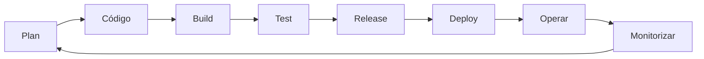

# Qué es DevOps

DevOps es un conjunto de prácticas culturales y técnicas que busca acortar el camino entre escribir código y que ese código esté funcionando para alguien.

La definición corta que más me gusta: **DevOps es lo que haces para que desplegar deje de dar miedo.**

## De dónde viene

Durante décadas, desarrollo y operaciones eran departamentos separados con objetivos opuestos. Desarrollo cobraba por entregar cambios; operaciones, por que nada se rompiera. Y el cambio es, precisamente, lo que rompe las cosas.

El resultado era un modelo por lotes:

```
Desarrollo (meses) → QA → Operaciones → Producción
                                            ↓
                                    "en mi máquina iba"
```

Con síntomas que reconocerás si has trabajado así: releases nocturnas de fin de semana, documentos de despliegue de cuarenta páginas, y una reunión post-incidente dedicada a decidir de quién había sido la culpa.

DevOps propone algo distinto: **un solo equipo responsable del ciclo completo**, y automatizar todo lo repetitivo para que entregar sea aburrido.

## Los cuatro pilares

El modelo **CAMS**:

**Cultura.** Responsabilidad compartida sobre el resultado. Es el pilar que sostiene los demás, y el único que no se puede comprar.

**Automatización.** Todo lo que se hace más de dos veces a mano. Compilar, probar, desplegar, aprovisionar infraestructura.

**Medición.** No puedes mejorar lo que no mides, y no puedes discutir con datos si no los tienes.

**Compartir.** Que el conocimiento circule en lugar de acumularse en las personas.

Fíjate en que solo uno de los cuatro es técnico. Es la razón por la que tantas transformaciones DevOps se quedan a medias: se compran herramientas y se ignoran los otros tres.

## Las métricas DORA

El programa de investigación DORA lleva más de una década midiendo equipos de software. Su conclusión más útil es que **cuatro métricas predicen el rendimiento**, y que velocidad y estabilidad no están enfrentadas: los equipos que despliegan más a menudo tienen *menos* incidentes.

Eso rompe la intuición de mucha gente, y es el argumento más sólido a favor de DevOps.

| Métrica | Qué mide | Equipos de alto rendimiento |
|---|---|---|
| **Frecuencia de despliegue** | Cada cuánto llegas a producción | Varias veces al día |
| **Lead time for changes** | De commit a producción | Menos de un día |
| **Change failure rate** | % de despliegues que causan un fallo | 0-15% |
| **Time to restore** | Cuánto tardas en recuperarte | Menos de una hora |

Las dos primeras miden velocidad; las dos últimas, estabilidad. **Hay que mirar las cuatro juntas**: desplegar veinte veces al día rompiendo la mitad no es alto rendimiento, y no desplegar nunca tampoco.

### Por qué desplegar más a menudo falla menos

No es magia. Si despliegas una vez al trimestre, cada release acumula cientos de cambios: cuando algo falla, buscar la causa entre todos ellos es una investigación. Si despliegas veinte veces al día, cada release lleva un puñado de cambios y el culpable es evidente.

Los lotes pequeños son más fáciles de revisar, de probar y de revertir. Esa es toda la explicación.

## El ciclo



Lo importante del diagrama es que **se cierra**. Lo que aprendes monitorizando en producción alimenta lo que planificas después. Un proceso que termina en "desplegado" y no vuelve al principio no es DevOps, es una cadena de montaje.

## DevOps vs DevSecOps

DevOps optimizó la velocidad de entrega, y al hacerlo dejó al descubierto un problema: el proceso de seguridad tradicional —una auditoría de dos semanas antes de cada release— no aguanta quince despliegues al día.

**DevSecOps** es la respuesta: integrar la seguridad en cada etapa en lugar de dejarla al final. No es otro stack ni otro equipo, es el mismo pipeline con controles añadidos.

Lo ves resumido en el [capítulo de seguridad](204.Seguridad.md) de este curso, y desarrollado con laboratorios en el [curso de DevSecOps](../devsecops/README.md).

## Roles

DevOps no es un puesto, es una forma de trabajar. Pero sí han aparecido perfiles especializados:

- **DevOps Engineer** — automatización, pipelines, infraestructura
- **SRE** — fiabilidad medible mediante SLOs y error budgets
- **Platform Engineer** — construye la plataforma interna para que los demás equipos se sirvan solos
- **DevSecOps Engineer** — seguridad integrada en el ciclo

:::warning Ojo con el "equipo DevOps"

Crear un departamento llamado DevOps entre desarrollo y operaciones suele producir justo lo que se quería evitar: un tercer silo. Lo vemos en el [capítulo de cultura](102.Cultura.md).

:::

## Cuatro mitos

**"DevOps es un conjunto de herramientas".** Las herramientas ayudan, pero automatizar un proceso roto solo lo rompe más rápido.

**"DevOps elimina operaciones".** Lo transforma: menos trabajo manual repetitivo, más ingeniería de plataforma.

**"Solo sirve para startups".** Los principios escalan hacia arriba y hacia abajo. Lo que cambia es el ritmo de adopción.

**"Es solo automatización".** La automatización es un medio. El fin es entregar valor de forma rápida y fiable.

## Qué vas a ver en este curso

- **Fundamentos** — cultura, Git y metodologías
- **Infraestructura** — IaC, gestión de configuraciones, monitorización y seguridad
- **Automatización** — CI/CD, testing y estrategias de despliegue
- **Avanzado** — contenedores, microservicios y SRE

Un consejo antes de seguir: **no intentes implantarlo todo a la vez**. Elige el punto que más duele hoy —normalmente el despliegue manual—, arréglalo y mide la diferencia. Es lo que convence a los escépticos.

## Resumen

- DevOps busca acortar el camino entre escribir código y que funcione para alguien
- **CAMS**: cultura, automatización, medición y compartir. Solo uno es técnico
- Las cuatro métricas DORA hay que mirarlas juntas: dos de velocidad, dos de estabilidad
- Desplegar más a menudo falla menos porque los lotes pequeños son más fáciles de todo
- El ciclo se cierra: lo que aprendes en producción alimenta lo que planificas
- DevOps no es un puesto, y un "equipo DevOps" suele acabar siendo un tercer silo

## Recursos adicionales

- [The DevOps Handbook](https://itrevolution.com/product/the-devops-handbook/)
- [Accelerate](https://itrevolution.com/product/accelerate/) — la investigación detrás de DORA
- [DORA](https://dora.dev/) — los informes anuales, gratuitos
- [Curso de DevSecOps](../devsecops/README.md) — el siguiente paso

---

> 💡 **Recuerda**: si tu último despliegue requirió una reunión previa y un fin de semana, ya sabes por dónde empezar.

**En el próximo capítulo entramos en el pilar que sostiene todos los demás: la cultura.**
