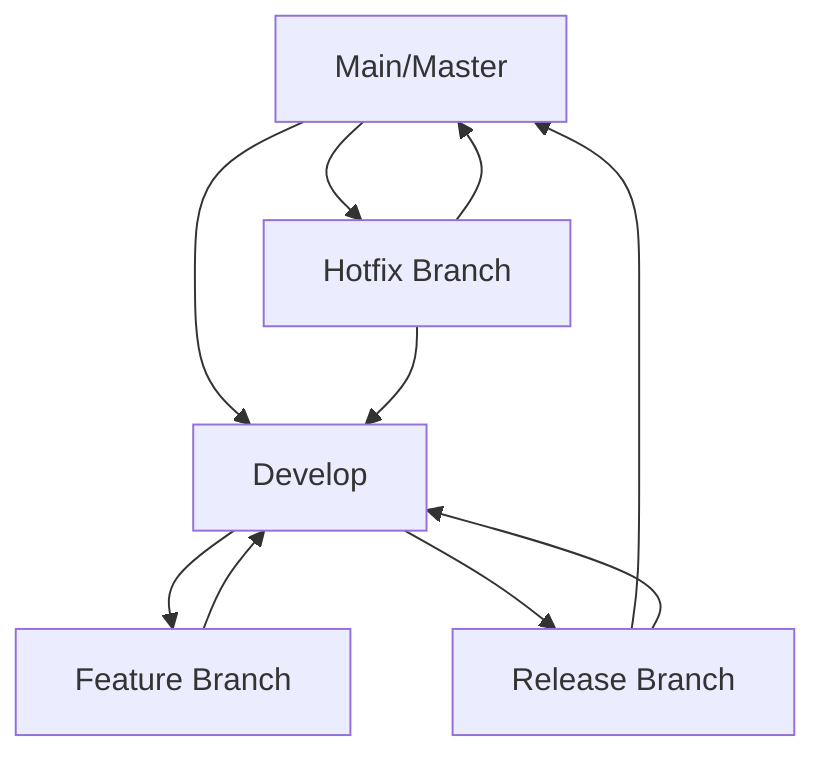

# Control de Versiones con Git Avanzado 🌳

## ¿Por qué Git es fundamental en DevOps?

Git no es solo una herramienta de control de versiones; es el corazón del flujo DevOps. Todo pipeline, toda automatización, toda colaboración pasa por Git.

## 🎯 Objetivos del Capítulo

- Dominar flujos de trabajo Git avanzados
- Implementar estrategias de branching eficientes
- Configurar hooks para automatización
- Gestionar releases y versionado semántico

## 📋 Estrategias de Branching

### Git Flow vs GitHub Flow vs GitLab Flow



#### Git Flow (para proyectos complejos)
```bash
# Inicializar Git Flow
git flow init

# Crear feature
git flow feature start nueva-funcionalidad
git flow feature finish nueva-funcionalidad

# Crear release
git flow release start v1.2.0
git flow release finish v1.2.0

# Hotfix crítico
git flow hotfix start critical-fix
git flow hotfix finish critical-fix
```

#### GitHub Flow (para desarrollo continuo)
```bash
# 1. Crear branch desde main
git checkout -b feature/user-authentication

# 2. Desarrollar y hacer commits
git add .
git commit -m "feat: add JWT authentication"

# 3. Push y crear Pull Request
git push origin feature/user-authentication

# 4. Review, test, merge
```

## 🚀 Git Hooks para DevOps

### Pre-commit Hook (Calidad de código)
```bash
#!/bin/sh
# .git/hooks/pre-commit

echo "🔍 Ejecutando verificaciones pre-commit..."

# Verificar sintaxis
npm run lint
if [ $? -ne 0 ]; then
  echo "❌ Lint failed. Commit abortado."
  exit 1
fi

# Ejecutar tests
npm test
if [ $? -ne 0 ]; then
  echo "❌ Tests failed. Commit abortado."
  exit 1
fi

# Verificar secrets
gitleaks detect --verbose
if [ $? -ne 0 ]; then
  echo "❌ Secrets detectados. Commit abortado."
  exit 1
fi

echo "✅ Todas las verificaciones pasaron"
```

### Pre-push Hook (Seguridad)
```bash
#!/bin/sh
# .git/hooks/pre-push

echo "🔒 Verificando seguridad antes del push..."

# Escanear vulnerabilidades
npm audit
if [ $? -ne 0 ]; then
  echo "⚠️ Vulnerabilidades encontradas"
  read -p "¿Continuar? (y/N): " confirm
  if [ "$confirm" != "y" ]; then
    exit 1
  fi
fi
```

## 📦 Versionado Semántico

### Conventional Commits
```bash
# Formato: tipo(scope): descripción
feat(auth): add JWT authentication
fix(api): resolve memory leak in user service
docs(readme): update installation instructions
style(css): improve button hover effects
refactor(utils): simplify data validation
test(unit): add tests for user controller
chore(deps): update dependencies

# Breaking changes
feat!: change API authentication method
```

### Automatización con commitizen
```bash
# Instalar commitizen
npm install -g commitizen
npm install -g cz-conventional-changelog

# Configurar
echo '{ "path": "cz-conventional-changelog" }' > ~/.czrc

# Usar
git cz
```

## 🏷️ Gestión de Tags y Releases

### Creación automática de tags
```bash
# Tag manual
git tag -a v1.2.0 -m "Release version 1.2.0"
git push origin v1.2.0

# Tag automatizado con npm
npm version patch  # 1.2.0 -> 1.2.1
npm version minor  # 1.2.1 -> 1.3.0
npm version major  # 1.3.0 -> 2.0.0
```

### Release automation con GitHub Actions
```yaml
# .github/workflows/release.yml
name: Release
on:
  push:
    tags:
      - 'v*'

jobs:
  release:
    runs-on: ubuntu-latest
    steps:
      - uses: actions/checkout@v3
      
      - name: Create Release
        uses: actions/create-release@v1
        env:
          GITHUB_TOKEN: ${{ secrets.GITHUB_TOKEN }}
        with:
          tag_name: ${{ github.ref }}
          release_name: Release ${{ github.ref }}
          draft: false
          prerelease: false
```

## 🔄 Flujos de Trabajo Avanzados

### Rebase vs Merge
```bash
# Merge (preserva historial)
git checkout main
git merge feature/nueva-funcionalidad

# Rebase (historial lineal)
git checkout feature/nueva-funcionalidad
git rebase main
git checkout main
git merge feature/nueva-funcionalidad --ff-only
```

### Interactive Rebase para limpiar historial
```bash
# Reescribir últimos 3 commits
git rebase -i HEAD~3

# En el editor:
# pick abc1234 Add user model
# squash def5678 Fix typo in user model
# squash ghi9012 Update user model tests
```

### Cherry-pick para hotfixes
```bash
# Aplicar commit específico a otra rama
git checkout main
git cherry-pick abc1234
```

## 🛡️ Seguridad en Git

### Configuración segura
```bash
# Firmar commits con GPG
git config --global user.signingkey YOUR_GPG_KEY
git config --global commit.gpgsign true

# Verificar commits firmados
git log --show-signature

# Push con verificación
git config --global push.default simple
git config --global push.followTags true
```

### .gitignore esencial para DevOps
```gitignore
# Secrets y configuraciones
.env
.env.local
*.key
*.pem
secrets/
config/production.json

# Dependencies
node_modules/
vendor/
.venv/

# Build outputs
dist/
build/
target/
*.log

# IDE
.vscode/
.idea/
*.swp

# OS
.DS_Store
Thumbs.db

# DevOps tools
.terraform/
.vagrant/
ansible-vault-pass
kubeconfig
```

## 🔧 Herramientas y Extensiones

### Aliases útiles para DevOps
```bash
# ~/.gitconfig
[alias]
    # Status y logs
    st = status
    lg = log --oneline --graph --decorate --all
    
    # Branching
    co = checkout
    br = branch
    
    # DevOps specific
    last = log -1 HEAD
    unstage = reset HEAD --
    pushf = push --force-with-lease
    
    # Cleanup
    cleanup = "!git branch --merged | grep -v '\\*\\|master\\|main\\|develop' | xargs -n 1 git branch -d"
```

### Git LFS para archivos grandes
```bash
# Instalar Git LFS
git lfs install

# Trackear tipos de archivos
git lfs track "*.zip"
git lfs track "*.tar.gz"
git lfs track "docker-images/*"

# Verificar tracking
git lfs ls-files
```

## 📊 Monitoreo y Métricas

### Estadísticas del repositorio
```bash
# Commits por autor
git shortlog -sn

# Actividad por fecha
git log --format="%ai" | cut -d' ' -f1 | sort | uniq -c

# Archivos más modificados
git log --name-only --pretty=format: | sort | uniq -c | sort -rg
```

## 🎯 Ejercicios Prácticos

### Ejercicio 1: Configurar Git Flow
1. Inicializa Git Flow en un proyecto
2. Crea una feature branch
3. Simula un hotfix
4. Gestiona un release

### Ejercicio 2: Implementar Hooks
1. Configura pre-commit hook con linting
2. Añade verificación de secrets
3. Implementa pre-push hook con tests

### Ejercicio 3: Workflow de Release
1. Configura conventional commits
2. Automatiza versionado semántico
3. Crea GitHub Action para releases

## ✅ Checklist de Buenas Prácticas

- [ ] Commits descriptivos con conventional commits
- [ ] Branches con naming convention clara
- [ ] Pre-commit hooks configurados
- [ ] Secrets nunca en el repositorio
- [ ] Tags para todas las releases
- [ ] .gitignore completo y actualizado
- [ ] Firma de commits activada
- [ ] Documentación actualizada en cada release

## 🔗 Recursos Adicionales

- [Pro Git Book](https://git-scm.com/book)
- [Conventional Commits](https://www.conventionalcommits.org/)
- [Semantic Versioning](https://semver.org/)
- [Git Hooks Documentation](https://git-scm.com/book/en/v2/Customizing-Git-Git-Hooks)

---


> 💡 **Recuerda**: Git es la base de todo pipeline DevOps. Dominarlo es esencial para la automatización y colaboración eficiente.
