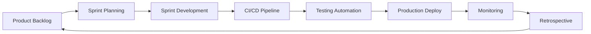
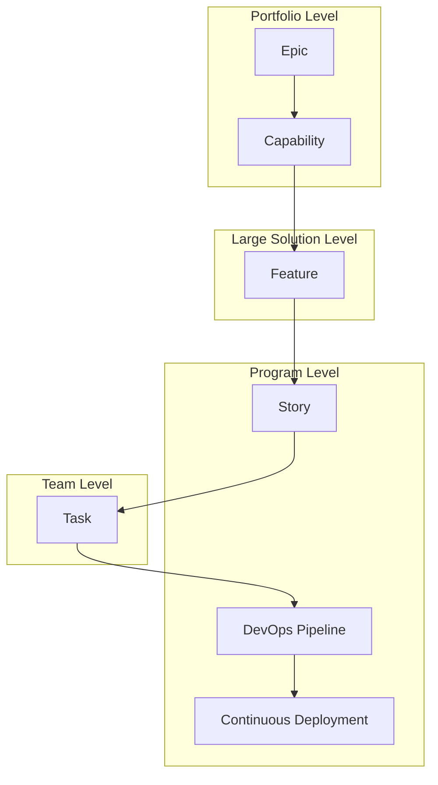

# Metodologías Ágiles y DevOps 🔄

## ¿Cómo se complementan Agile y DevOps?

Agile y DevOps no son competidores, son aliados. Mientras Agile optimiza el desarrollo, DevOps optimiza la entrega y operación. Juntos crean un flujo continuo desde la idea hasta producción.

## 🎯 Objetivos del Capítulo

- Entender la sinergia entre Agile y DevOps
- Implementar Scrum con prácticas DevOps
- Aplicar Kanban para flujo continuo
- Adoptar metodologías híbridas modernas

## 📊 Agile + DevOps: La Combinación Perfecta



### Los Principios Compartidos

| Agile | DevOps | Sinergia |
|-------|--------|----------|
| Individuos > Procesos | Colaboración Dev-Ops | Equipos multifuncionales |
| Software funcionando | Entrega continua | Deployments frecuentes |
| Colaboración cliente | Feedback loops | Monitoreo usuario real |
| Respuesta al cambio | Automatización | Adaptación rápida |

## 🏃‍♂️ Scrum con DevOps

### Sprint Planning DevOps-Ready

```markdown
## Sprint Planning Checklist DevOps

### Definition of Ready (DoR)
- [ ] User Story clara y estimada
- [ ] Criterios de aceptación definidos
- [ ] Dependencias identificadas
- [ ] **Pipeline de CI/CD preparado**
- [ ] **Tests automatizados planificados**
- [ ] **Métricas de observabilidad definidas**

### Definition of Done (DoD)
- [ ] Código desarrollado y revisado
- [ ] Tests unitarios y de integración pasando
- [ ] **Pipeline CI/CD ejecutado exitosamente**
- [ ] **Desplegado en ambiente de staging**
- [ ] **Métricas y logs configurados**
- [ ] **Documentación actualizada**
- [ ] **Security scan aprobado**
```

### Daily Standup DevOps-Enhanced

```markdown
## Daily Standup Questions DevOps

### Preguntas tradicionales:
1. ¿Qué hiciste ayer?
2. ¿Qué harás hoy?
3. ¿Tienes impedimentos?

### Preguntas DevOps adicionales:
4. ¿Los pipelines están funcionando?
5. ¿Hay alertas o incidentes activos?
6. ¿El ambiente de testing está disponible?
7. ¿Necesitas acceso o permisos especiales?
```

### Sprint Review con Métricas DevOps

```yaml
# Sprint Review Dashboard
métricas_desarrollo:
  - velocidad_equipo: "32 story points"
  - burndown_completion: "95%"
  - code_coverage: "85%"

métricas_devops:
  - deployment_frequency: "12 deploys"
  - lead_time: "2.3 días promedio"
  - mean_time_to_recovery: "45 minutos"
  - change_failure_rate: "8%"

métricas_calidad:
  - bugs_producción: 2
  - security_vulnerabilities: 0
  - performance_regression: 0
```

## 📋 Kanban para Flujo Continuo

### Tablero Kanban DevOps

```
┌─────────────┬─────────────┬─────────────┬─────────────┬─────────────┐
│   Backlog   │   Doing     │   Review    │   Testing   │    Done     │
├─────────────┼─────────────┼─────────────┼─────────────┼─────────────┤
│ Feature A   │ Feature B   │ Feature C   │ Feature D   │ Feature E   │
│ Bug Fix 1   │ Bug Fix 2   │             │             │ Hotfix 1    │
│ Tech Debt   │             │             │             │             │
└─────────────┴─────────────┴─────────────┴─────────────┴─────────────┘
       3             2             1             1             ∞
   (WIP Limit)   (WIP Limit)   (WIP Limit)   (WIP Limit)   (No Limit)
```

### Métricas Kanban para DevOps

#### Lead Time y Cycle Time
```python
# Cálculo de métricas Kanban
def calcular_metricas_kanban(tareas):
    for tarea in tareas:
        # Lead Time: desde creación hasta entrega
        lead_time = tarea.fecha_entrega - tarea.fecha_creacion
        
        # Cycle Time: desde inicio desarrollo hasta entrega  
        cycle_time = tarea.fecha_entrega - tarea.fecha_inicio_desarrollo
        
        # Deployment Lead Time (DevOps específico)
        deployment_lead_time = tarea.fecha_produccion - tarea.fecha_commit
        
        print(f"Tarea {tarea.id}:")
        print(f"  Lead Time: {lead_time.days} días")
        print(f"  Cycle Time: {cycle_time.days} días") 
        print(f"  Deployment Lead Time: {deployment_lead_time.hours} horas")
```

## 🔄 Metodologías Híbridas Modernas

### SAFe (Scaled Agile Framework) con DevOps



### DevSecOps Integration

```yaml
# DevSecOps en metodología ágil
sprint_activities:
  planning:
    - threat_modeling
    - security_requirements
    - compliance_checklist
  
  development:
    - secure_coding_practices
    - sast_tools_integration
    - dependency_scanning
  
  testing:
    - dast_testing
    - penetration_testing
    - security_regression_tests
  
  deployment:
    - infrastructure_scanning
    - runtime_security_monitoring
    - incident_response_planning
```

## 🎯 Implementación Práctica

### Scrum Master + DevOps Engineer

```markdown
## Responsabilidades Combinadas

### Scrum Master tradicional:
- Facilitar ceremonias
- Remover impedimentos
- Coaching del equipo
- Proteger al equipo de interrupciones

### DevOps responsibilities:
- Mantener pipelines funcionando
- Optimizar automatización
- Gestionar infraestructura
- Monitorear aplicaciones

### Híbrido Scrum Master-DevOps:
- Impedimentos técnicos y de proceso
- Métricas de desarrollo Y operación
- Continuous improvement en ambos aspectos
- Cultural transformation
```

### Product Owner DevOps-Aware

```markdown
## Product Owner con mentalidad DevOps

### Decisiones informadas por métricas:
- Feature flags y A/B testing
- User behavior analytics
- Performance metrics
- Error rates y user satisfaction

### Backlog priorization:
- Technical debt vs new features
- Infrastructure improvements
- Security updates
- Performance optimizations

### Acceptance criteria DevOps-ready:
- Performance requirements
- Security compliance
- Monitoring needs
- Rollback procedures
```

## 🛠️ Herramientas para Agile + DevOps

### Planificación y Tracking

```yaml
herramientas_agile_devops:
  planning:
    - jira: "User stories + DevOps tasks"
    - azure_devops: "Integrated ALM"
    - linear: "Modern issue tracking"
  
  collaboration:
    - slack: "ChatOps integration"
    - microsoft_teams: "DevOps notifications"
    - mattermost: "Open source alternative"
  
  documentation:
    - confluence: "Knowledge management"
    - notion: "All-in-one workspace"
    - gitbook: "Developer-focused docs"
```

### Configuración de Jira para DevOps

```javascript
// Jira Automation Rules para DevOps
{
  "trigger": "Issue transitions to In Progress",
  "conditions": [
    "Issue type is Story",
    "Sprint is active"
  ],
  "actions": [
    "Create branch in GitHub",
    "Trigger CI pipeline",
    "Post to Slack channel"
  ]
}
```

## 📈 Métricas Agile + DevOps

### Dashboard Unificado

```json
{
  "sprint_metrics": {
    "velocity": 28,
    "burndown_ideal": 85,
    "burndown_actual": 82,
    "scope_changes": 2
  },
  "devops_metrics": {
    "deployment_frequency": "3.2/day",
    "lead_time_changes": "4.5 hours",
    "mttr": "32 minutes",
    "change_failure_rate": "12%"
  },
  "quality_metrics": {
    "code_coverage": "87%",
    "technical_debt_ratio": "8.5%",
    "security_vulnerabilities": 0,
    "performance_score": 92
  }
}
```

### OKRs (Objectives and Key Results) DevOps

```markdown
## Q1 2024 OKRs - Engineering Team

### Objective 1: Improve Delivery Speed
- KR1: Reduce lead time from 5 days to 2 days
- KR2: Increase deployment frequency to 2x/day
- KR3: Achieve 95% pipeline success rate

### Objective 2: Enhance Quality
- KR1: Maintain code coverage > 80%
- KR2: Reduce production bugs by 50%
- KR3: Zero critical security vulnerabilities

### Objective 3: Optimize Team Performance
- KR1: Increase team velocity by 25%
- KR2: Reduce context switching by 40%
- KR3: Achieve 95% sprint goal completion
```

## 🚀 Casos de Uso Reales

### Caso 1: E-commerce con Alto Tráfico

```yaml
metodologia: "Scrum + Kanban híbrido"
sprint_duration: "1 semana"
release_cycle: "Continuous deployment"

challenges:
  - peak_traffic_handling
  - feature_flags_management
  - a_b_testing_coordination

solutions:
  - feature_toggles_in_backlog
  - performance_testing_in_dod
  - monitoring_alerts_in_sprint_review
```

### Caso 2: FinTech con Regulaciones

```yaml
metodologia: "SAFe con DevSecOps"
compliance_requirements:
  - PCI_DSS
  - SOX
  - GDPR

devops_adaptations:
  - automated_compliance_testing
  - audit_trail_in_pipelines
  - security_gates_mandatory
  - segregation_of_duties_automated
```

## 🎓 Ejercicios Prácticos

### Ejercicio 1: Rediseñar Sprint Planning
1. Toma un sprint planning típico
2. Añade elementos DevOps (DoR, DoD, métricas)
3. Incluye consideraciones de infraestructura

### Ejercicio 2: Crear Dashboard Combinado
1. Diseña métricas Agile + DevOps
2. Define alertas automáticas
3. Establece umbrales de calidad

### Ejercicio 3: Incident Response Ágil
1. Crea proceso de incident response
2. Integra con sprint planning
3. Define learning loops

## ✅ Checklist de Integración

- [ ] Definition of Done incluye criterios DevOps
- [ ] Métricas de ambos mundos en retrospectivas
- [ ] Pipeline failures tratados como impedimentos
- [ ] Security y compliance en user stories
- [ ] Monitoring y observability en acceptance criteria
- [ ] Technical debt visible en product backlog
- [ ] Cross-functional teams (Dev + Ops + QA)
- [ ] Continuous learning culture establecida

## 🔗 Recursos Adicionales

- [Agile Manifesto](https://agilemanifesto.org/)
- [DevOps Handbook](https://itrevolution.com/the-devops-handbook/)
- [SAFe Framework](https://www.scaledagileframework.com/)
- [State of DevOps Report](https://cloud.google.com/devops/state-of-devops/)

---

> 💡 **Recuerda**: Agile y DevOps se potencian mutuamente. No se trata de elegir uno, sino de combinar lo mejor de ambos mundos.
