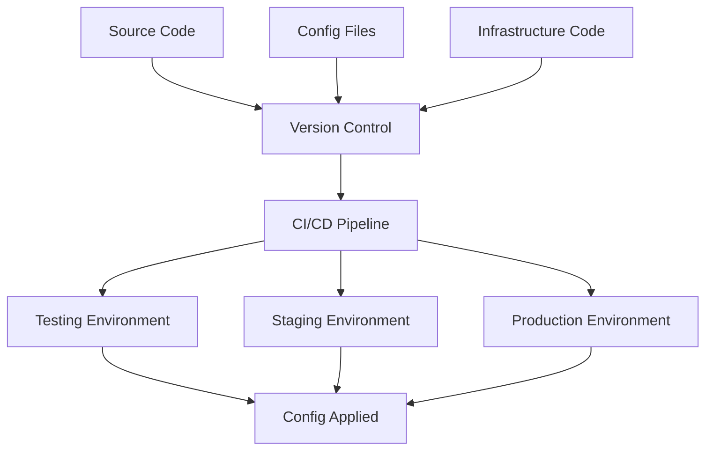

# Gestión de Configuraciones 🔧

## ¿Por qué gestionar configuraciones es crítico?

En DevOps, la gestión de configuraciones es el pilar que sostiene la consistencia, seguridad y escalabilidad de toda la infraestructura. Sin ella, los entornos se vuelven impredecibles y los deployments, una ruleta rusa.

## 🎯 Objetivos del Capítulo

- Dominar herramientas de gestión de configuraciones
- Implementar configuraciones como código
- Asegurar consistencia entre entornos
- Automatizar la aplicación de configuraciones

## 📊 Filosofía: Configuration as Code



### Principios Fundamentales

1. **Declarativo sobre Imperativo**: Define el estado deseado, no los pasos
2. **Idempotencia**: Ejecutar múltiples veces = mismo resultado
3. **Versionado**: Toda configuración en control de versiones
4. **Inmutabilidad**: Servers como ganado, no mascotas

## 🛠️ Herramientas Principales

### Ansible: Simplicidad y Potencia

#### Playbook básico
```yaml
---
- name: Configurar servidor web
  hosts: webservers
  become: yes
  
  vars:
    nginx_port: 80
    app_env: production
    
  tasks:
    - name: Instalar nginx
      package:
        name: nginx
        state: present
        
    - name: Configurar nginx
      template:
        src: nginx.conf.j2
        dest: /etc/nginx/nginx.conf
        backup: yes
      notify:
        - restart nginx
        
    - name: Asegurar nginx está corriendo
      service:
        name: nginx
        state: started
        enabled: yes
        
  handlers:
    - name: restart nginx
      service:
        name: nginx
        state: restarted
```

#### Template Jinja2 (nginx.conf.j2)
```nginx
server {
    listen {{ nginx_port }};
    server_name {{ ansible_fqdn }};
    
    location / {
        proxy_pass http://localhost:3000;
        proxy_set_header Host $host;
        proxy_set_header X-Real-IP $remote_addr;
    }
    
    # Environment specific
    
    access_log /var/log/nginx/access.log;
    error_log /var/log/nginx/error.log;
    
    access_log /var/log/nginx/access_debug.log debug;
    
}
```

#### Inventario dinámico
```ini
# inventory/hosts
[webservers]
web-01 ansible_host=10.0.1.10
web-02 ansible_host=10.0.1.11

[databases]
db-01 ansible_host=10.0.2.10

[production:children]
webservers
databases

[production:vars]
ansible_user=ubuntu
ansible_ssh_private_key_file=~/.ssh/production.pem
```

### Chef: Enterprise Configuration Management

#### Recipe ejemplo
```ruby
# recipes/webserver.rb
package 'nginx' do
  action :install
end

template '/etc/nginx/nginx.conf' do
  source 'nginx.conf.erb'
  variables(
    port: node['nginx']['port'],
    server_name: node['fqdn']
  )
  notifies :restart, 'service[nginx]', :delayed
end

service 'nginx' do
  action [:enable, :start]
  supports restart: true, reload: true
end

# Configuración de firewall
firewall_rule 'http' do
  port 80
  action :allow
end
```

#### Attributes (attributes/default.rb)
```ruby
default['nginx']['port'] = 80
default['nginx']['worker_processes'] = node['cpu']['total']
default['nginx']['keepalive_timeout'] = 65

# Environment specific
case node.chef_environment
when 'production'
  default['nginx']['worker_connections'] = 2048
  default['app']['log_level'] = 'warn'
when 'staging'
  default['nginx']['worker_connections'] = 1024
  default['app']['log_level'] = 'info'
else
  default['nginx']['worker_connections'] = 512
  default['app']['log_level'] = 'debug'
end
```

### Puppet: Declarative Configuration

#### Manifest principal
```puppet
# manifests/site.pp
node 'webserver' {
  include nginx
  include app_config
  include monitoring
}

# modules/nginx/manifests/init.pp
class nginx {
  package { 'nginx':
    ensure => installed,
  }
  
  file { '/etc/nginx/nginx.conf':
    ensure  => file,
    content => template('nginx/nginx.conf.erb'),
    require => Package['nginx'],
    notify  => Service['nginx'],
  }
  
  service { 'nginx':
    ensure    => running,
    enable    => true,
    subscribe => File['/etc/nginx/nginx.conf'],
  }
}
```

### SaltStack: Event-Driven Configuration

#### State file (salt/webserver/init.sls)
```yaml
nginx:
  pkg.installed: []
  
nginx_config:
  file.managed:
    - name: /etc/nginx/nginx.conf
    - source: salt://webserver/files/nginx.conf.j2
    - template: jinja
    - context:
        port: {{ pillar['nginx']['port'] }}
        workers: {{ grains['num_cpus'] }}
    - require:
      - pkg: nginx
    - watch_in:
      - service: nginx_service

nginx_service:
  service.running:
    - name: nginx
    - enable: True
    - require:
      - pkg: nginx
```

## 🏗️ Patrones de Configuración

### 1. Separation of Concerns

```yaml
# ansible/group_vars/all.yml (Variables globales)
app_name: "mi-aplicacion"
app_user: "appuser"

# ansible/group_vars/production.yml (Específico de producción)
db_host: "prod-db.company.com"
redis_host: "prod-redis.company.com" 
log_level: "WARNING"

# ansible/group_vars/staging.yml (Específico de staging)
db_host: "staging-db.company.com"
redis_host: "staging-redis.company.com"
log_level: "DEBUG"
```

### 2. Secrets Management

#### Con Ansible Vault
```bash
# Crear archivo encriptado
ansible-vault create secrets.yml

# Contenido de secrets.yml
db_password: "super_secret_password"
api_key: "abc123def456"
ssl_certificate: |
  -----BEGIN CERTIFICATE-----
  MIIDXTCCAkWgAwIBAgIJAKoK/hT...
  -----END CERTIFICATE-----

# Usar en playbook
- name: Configurar base de datos
  mysql_user:
    name: "{{ app_user }}"
    password: "{{ db_password }}"
    priv: "{{ app_name }}.*:ALL"
```

#### Con Kubernetes Secrets
```yaml
# secret.yml
apiVersion: v1
kind: Secret
metadata:
  name: app-secrets
type: Opaque
data:
  database-password: cGFzc3dvcmQxMjM=  # base64 encoded
  api-key: YWJjMTIzZGVmNDU2

---
# deployment.yml
apiVersion: apps/v1
kind: Deployment
metadata:
  name: app-deployment
spec:
  template:
    spec:
      containers:
      - name: app
        env:
        - name: DB_PASSWORD
          valueFrom:
            secretKeyRef:
              name: app-secrets
              key: database-password
```

### 3. Configuration Drift Detection

#### Script de verificación
```python
#!/usr/bin/env python3
import yaml
import subprocess
import sys

def check_nginx_config():
    """Verificar configuración de nginx"""
    expected_port = "80"
    
    # Obtener configuración actual
    result = subprocess.run(['nginx', '-T'], 
                          capture_output=True, text=True)
    
    if f"listen {expected_port}" not in result.stdout:
        return False, f"Puerto esperado {expected_port} no encontrado"
    
    return True, "Configuración nginx OK"

def check_service_status():
    """Verificar servicios corriendo"""
    services = ['nginx', 'postgresql', 'redis']
    
    for service in services:
        result = subprocess.run(['systemctl', 'is-active', service],
                              capture_output=True, text=True)
        if result.stdout.strip() != 'active':
            return False, f"Servicio {service} no activo"
    
    return True, "Todos los servicios activos"

if __name__ == "__main__":
    checks = [check_nginx_config, check_service_status]
    
    for check in checks:
        status, message = check()
        if not status:
            print(f"❌ {message}")
            sys.exit(1)
        else:
            print(f"✅ {message}")
    
    print("🎉 Todos los checks pasaron")
```

## 🔄 Estrategias de Deployment

### Blue-Green Deployment con Configuraciones

```yaml
# ansible/blue-green-deploy.yml
- name: Blue-Green Deployment
  hosts: loadbalancer
  vars:
    current_env: "{{ 'blue' if active_env == 'green' else 'green' }}"
    
  tasks:
    - name: Actualizar configuración en {{ current_env }}
      template:
        src: app-config.j2
        dest: "/opt/{{ current_env }}/config/app.conf"
        
    - name: Reiniciar aplicación {{ current_env }}
      systemd:
        name: "app-{{ current_env }}"
        state: restarted
        
    - name: Health check {{ current_env }}
      uri:
        url: "http://localhost:{{ ports[current_env] }}/health"
        method: GET
      register: health_check
      retries: 5
      delay: 10
      
    - name: Cambiar tráfico a {{ current_env }}
      template:
        src: nginx-upstream.j2
        dest: /etc/nginx/conf.d/upstream.conf
        vars:
          active_env: "{{ current_env }}"
      notify: reload nginx
      when: health_check.status == 200
```

### Canary Deployment con Feature Flags

```yaml
# feature-flags.yml
feature_flags:
  new_payment_system:
    enabled: true
    percentage: 10  # Solo 10% de usuarios
    environments: ['staging', 'production']
    
  enhanced_search:
    enabled: false
    percentage: 0
    environments: ['staging']

# aplicar configuración
- name: Configurar feature flags
  template:
    src: features.json.j2
    dest: /etc/app/features.json
  vars:
    features: "{{ feature_flags }}"
  notify: restart app
```

## 🛡️ Seguridad en Configuraciones

### Hardening Automático

```yaml
# ansible/security-hardening.yml
- name: Security Hardening
  hosts: all
  become: yes
  
  tasks:
    - name: Actualizar sistema
      package:
        name: "*"
        state: latest
        
    - name: Configurar SSH seguro
      lineinfile:
        path: /etc/ssh/sshd_config
        regexp: "{{ item.regexp }}"
        line: "{{ item.line }}"
        backup: yes
      with_items:
        - { regexp: '^PasswordAuthentication', line: 'PasswordAuthentication no' }
        - { regexp: '^PermitRootLogin', line: 'PermitRootLogin no' }
        - { regexp: '^Protocol', line: 'Protocol 2' }
      notify: restart ssh
      
    - name: Configurar firewall
      ufw:
        rule: "{{ item.rule }}"
        port: "{{ item.port }}"
        proto: "{{ item.proto }}"
      with_items:
        - { rule: 'allow', port: '22', proto: 'tcp' }
        - { rule: 'allow', port: '80', proto: 'tcp' }
        - { rule: 'allow', port: '443', proto: 'tcp' }
        
    - name: Habilitar firewall
      ufw:
        state: enabled
        policy: deny
```

### Compliance as Code (CIS Benchmarks)

```yaml
# cis-compliance.yml
- name: CIS Benchmark Compliance
  hosts: all
  
  tasks:
    - name: 1.1.1.1 Disable unused filesystems
      lineinfile:
        path: /etc/modprobe.d/blacklist.conf
        line: "install {{ item }} /bin/true"
        create: yes
      with_items:
        - cramfs
        - freevxfs
        - jffs2
        - hfs
        - hfsplus
        
    - name: 1.3.1 Ensure AIDE is installed
      package:
        name: aide
        state: present
        
    - name: 1.3.2 Ensure filesystem integrity checking
      cron:
        name: "AIDE integrity check"
        cron_file: aide-check
        minute: "0"
        hour: "5"
        job: "/usr/bin/aide --check"
```

## 📊 Monitoreo de Configuraciones

### Métricas de Configuration Management

```python
#!/usr/bin/env python3
import json
import time
from datetime import datetime
import subprocess

class ConfigMonitor:
    def __init__(self):
        self.metrics = {
            'last_run': None,
            'success_rate': 0,
            'failed_nodes': [],
            'drift_detected': False,
            'compliance_score': 0
        }
    
    def run_ansible_check(self):
        """Ejecutar Ansible en modo check"""
        cmd = ['ansible-playbook', 'site.yml', '--check', '--diff']
        result = subprocess.run(cmd, capture_output=True, text=True)
        
        if result.returncode != 0:
            self.metrics['drift_detected'] = True
            return False
        return True
    
    def check_compliance(self):
        """Verificar compliance con políticas"""
        # Implementar checks específicos
        score = 95  # Ejemplo
        self.metrics['compliance_score'] = score
        return score > 90
    
    def generate_report(self):
        """Generar reporte de estado"""
        report = {
            'timestamp': datetime.now().isoformat(),
            'status': 'healthy' if not self.metrics['drift_detected'] else 'drift',
            'metrics': self.metrics
        }
        
        with open('/var/log/config-monitor.json', 'w') as f:
            json.dump(report, f, indent=2)
        
        return report

if __name__ == "__main__":
    monitor = ConfigMonitor()
    
    # Ejecutar checks
    ansible_ok = monitor.run_ansible_check()
    compliance_ok = monitor.check_compliance()
    
    # Generar reporte
    report = monitor.generate_report()
    
    if not ansible_ok or not compliance_ok:
        print("❌ Configuration drift o compliance issues detectados")
        exit(1)
    else:
        print("✅ Configuration management OK")
```

## 🎯 Ejercicios Prácticos

### Ejercicio 1: Ansible Básico
1. Instala Ansible
2. Crea playbook para configurar servidor web
3. Implementa variables por ambiente
4. Añade manejo de secrets con Vault

### Ejercicio 2: Configuration Drift
1. Implementa script de detección de drift
2. Configura alertas automáticas
3. Crea proceso de remediación

### Ejercicio 3: Multi-Tool Integration
1. Combina Terraform + Ansible
2. IaC para infraestructura, Ansible para configuración
3. Pipeline automatizado completo

## ✅ Checklist de Mejores Prácticas

- [ ] Todas las configuraciones en version control
- [ ] Secrets manejados con herramientas dedicadas
- [ ] Idempotencia verificada en todos los scripts
- [ ] Tests automatizados de configuraciones
- [ ] Monitoreo de configuration drift
- [ ] Documentación actualizada de procedures
- [ ] Rollback procedures definidos
- [ ] Compliance checks automatizados

## 🔗 Recursos Adicionales

- [Ansible Documentation](https://docs.ansible.com/)
- [Chef Documentation](https://docs.chef.io/)
- [Puppet Documentation](https://puppet.com/docs/)
- [SaltStack Documentation](https://docs.saltproject.io/)
- [CIS Benchmarks](https://www.cisecurity.org/cis-benchmarks/)

---


---

> 💡 **Recuerda**: La configuración manual es el enemigo de la consistencia. Todo debe ser código, versionado y automatizado.
