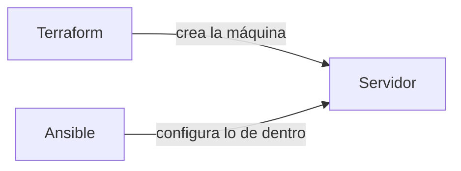

# Gestión de configuraciones

En el capítulo anterior creamos servidores con Terraform. Ahora toca la otra mitad del problema: **qué hay dentro de esos servidores**.

Terraform crea la máquina. La gestión de configuraciones instala el software, escribe los ficheros y arranca los servicios. Son herramientas distintas para problemas distintos, y usar una para lo que hace la otra suele salir mal.

## El problema de los servidores únicos

Sin automatización, cada servidor acaba siendo distinto. Alguien instaló un paquete a mano para salir de un apuro, otro cambió un límite del kernel en 2022 y nadie lo documentó.

El resultado es el **servidor mascota**: una máquina que nadie se atreve a tocar porque nadie sabe reconstruirla. Cuando muere, se lleva por delante un fin de semana entero.

La alternativa es tratar los servidores como **ganado**: si uno falla, se destruye y se crea otro idéntico desde su definición. Para eso, la configuración tiene que estar escrita en algún sitio que no sea la memoria de nadie.

## Los cuatro principios

**Declarativo, no imperativo.** Describamos el estado final, no los pasos:

```yaml
# ✅ Declarativo: qué quiero
- name: Nginx instalado y arrancado
  package: { name: nginx, state: present }
- name: Nginx activo
  service: { name: nginx, state: started, enabled: yes }
```

**Idempotencia.** Ejecutarlo una vez o cincuenta debe dejar el mismo resultado. Es lo que nos permite lanzarlo sin miedo para verificar el estado, no solo para cambiarlo.

**Todo versionado.** Si la configuración está en Git, tenemos historial, revisión por pares y capacidad de volver atrás.

**Inmutabilidad, cuando se pueda.** En lugar de modificar un servidor, crear uno nuevo con la configuración correcta y sustituirlo. Es el modelo de los contenedores, y elimina el drift de raíz.

## La idempotencia en la práctica

```bash
# ❌ No idempotente: a la segunda ejecución hay dos líneas
echo "export JAVA_HOME=/opt/java" >> ~/.bashrc
```

```yaml
# ✅ Idempotente: comprueba antes de escribir
- lineinfile:
    path: ~/.bashrc
    regexp: '^export JAVA_HOME='
    line: 'export JAVA_HOME=/opt/java'
```

Cuando ejecutamos un playbook idempotente, Ansible nos dice cuántas tareas cambiaron algo:

```
ok=12  changed=0  failed=0
```

Ese `changed=0` significa que el sistema ya estaba como debía. Y ahí está la clave: **el mismo comando que configura, sirve para verificar**.

## Ansible en dos minutos

Es la opción por defecto hoy, sobre todo porque no necesita instalar nada en las máquinas: se conecta por SSH y ya.

```yaml
- name: Configurar servidores web
  hosts: webservers
  become: true

  tasks:
    - name: Instalar nginx
      package: { name: nginx, state: present }

    - name: Configurar nginx
      template:
        src: nginx.conf.j2
        dest: /etc/nginx/nginx.conf
      notify: reiniciar nginx

  handlers:
    - name: reiniciar nginx
      service: { name: nginx, state: restarted }
```

Fijémonos en el `notify` y el `handler`: el reinicio solo ocurre **si la plantilla cambió algo**. Reiniciar servicios en cada ejecución es una forma habitual de romper la idempotencia sin darse cuenta.

El curso de Ansible cubre todo esto en profundidad: [inventarios, roles, plantillas y Vault](../ansible/README.md).

## Comparativa de herramientas

| | Ansible | Chef | Puppet | SaltStack |
|---|---|---|---|---|
| **Agente en el nodo** | No, usa SSH | Sí | Sí | Opcional |
| **Lenguaje** | YAML | Ruby | DSL propio | YAML |
| **Curva de aprendizaje** | Baja | Alta | Media | Media |
| **Fuerte en** | Simplicidad, orquestación | Lógica compleja | Grandes flotas | Velocidad, eventos |

Para empezar hoy, Ansible: no requiere agentes, el YAML es legible y hay módulos para todo. Chef y Puppet siguen vivos en organizaciones grandes que llevan años con ellos.

## Ansible y Terraform juntos

Es la combinación más habitual, y la división de responsabilidades es clara:


```mermaid
graph LR
    A[Terraform] -->|crea la máquina| B[Servidor]
    C[Ansible] -->|configura lo de dentro| B
```

- **Terraform** — recursos cloud: máquinas, redes, balanceadores, bases de datos gestionadas
- **Ansible** — dentro de la máquina: paquetes, ficheros, servicios, usuarios

Usar Terraform para configurar el interior de una máquina (con `provisioner`) funciona en la demo y da problemas en cuanto crece. Ansible para crear infraestructura cloud, igual.

## Configuration drift

El **drift** es la diferencia entre lo que dice nuestro código y lo que hay realmente. Aparece siempre que alguien entra por SSH a arreglar algo con prisa.

Es peligroso porque es invisible hasta que reconstruimos el servidor y ya no funciona como el anterior.

Ansible lo detecta gratis, gracias a la idempotencia:

```bash
ansible-playbook site.yml --check --diff
```

`--check` simula sin aplicar y `--diff` muestra exactamente qué cambiaría. Si sale algo, tenemos drift.

Ejecutémoslo periódicamente desde el pipeline: es de las automatizaciones más rentables que podemos montar en una tarde.

Tres formas de tratarlo, de peor a mejor:

1. **Detectar y avisar** — mínimo aceptable
2. **Detectar y corregir** — ejecutar el playbook de verdad en cuanto aparece
3. **Hacerlo imposible** — infraestructura inmutable, sin acceso SSH a producción

## Configuración por entorno

La misma definición, valores distintos:

```
group_vars/
├── all.yml          # común a todo
├── produccion.yml   # específico de producción
└── staging.yml      # específico de staging
```

La regla: **la estructura es la misma en todos los entornos, solo cambian los valores**. En cuanto staging y producción difieren en estructura, staging deja de servir para probar.

Los valores sensibles (contraseñas, tokens, certificados) no van aquí en claro. Eso se trata en el [capítulo de gestión de secretos del curso de DevSecOps](../devsecops/108.Gestion_secretos.md) y, para Ansible en concreto, en [su capítulo de Vault](../ansible/108.Seguridad.md).

## Resumen

- Terraform crea la máquina; la gestión de configuraciones se ocupa de lo de dentro
- Declarativo, idempotente, versionado e inmutable cuando se pueda
- La idempotencia permite usar el mismo comando para configurar y para verificar
- Los `handlers` evitan reiniciar servicios sin necesidad
- Ansible es la opción por defecto: sin agentes y con YAML legible
- El **drift** es invisible hasta que reconstruimos: detectémoslo con `--check --diff` desde el pipeline
- Misma estructura en todos los entornos, solo cambian los valores

## Recursos adicionales

- [Curso de Ansible](../ansible/README.md) — inventarios, roles, plantillas y Vault
- [Infraestructura como código](201.Infraestructura_codigo.md) — la otra mitad del problema
- [Gestión de secretos](../devsecops/108.Gestion_secretos.md)

---

> 💡 **Recordemos**: si no podemos reconstruir un servidor desde el código, no tenemos gestión de configuraciones. Tenemos una mascota.

**En el próximo capítulo vemos cómo saber qué está pasando en todo eso que acabamos de automatizar.**
