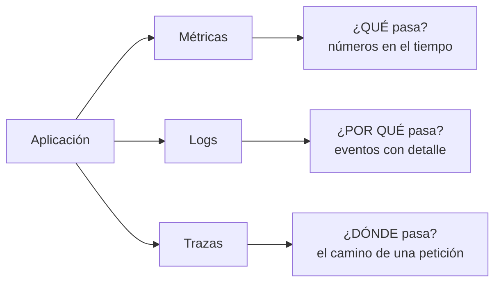

# Monitorización y observabilidad

Hay una diferencia real entre ambos términos, más allá del marketing:

- **Monitorización** — vigilar cosas que ya sabemos que pueden fallar. "Avísame si la CPU pasa del 80%."
- **Observabilidad** — poder responder preguntas que **no habíamos previsto**, sin desplegar código nuevo. "¿Por qué los usuarios de Chile ven la página lenta solo los martes?"

La primera nos avisa de lo conocido. La segunda nos permite investigar lo desconocido. Necesitamos ambas, pero solo la segunda nos salva cuando el problema es raro — y los problemas que llegan a producción suelen ser raros, porque los evidentes se detectan antes.

## Los tres pilares


```mermaid
graph LR
    A[Aplicación] --> B[Métricas]
    A --> C[Logs]
    A --> D[Trazas]

    B --> B1["¿QUÉ pasa?<br/>números en el tiempo"]
    C --> C1["¿POR QUÉ pasa?<br/>eventos con detalle"]
    D --> D1["¿DÓNDE pasa?<br/>el camino de una petición"]
```

Cada uno responde a una pregunta distinta, y el flujo natural de una investigación los recorre en ese orden: una métrica nos avisa de que la latencia subió, una traza nos dice qué servicio la causa y los logs de ese servicio nos cuentan por qué.

Un aviso sobre el coste: los tres crecen con el tráfico, pero **los logs crecen linealmente y son con diferencia lo más caro**. Es habitual descubrirlo con la factura.

## Los cuatro golden signals

Si tenemos que empezar por algo, empecemos por estos cuatro:

| Señal | Qué mide | Ejemplo de alerta |
|---|---|---|
| **Latencia** | Cuánto tardan las peticiones | p95 > 500 ms durante 5 min |
| **Tráfico** | Cuántas peticiones llegan | Caída del 50% respecto a lo normal |
| **Errores** | Cuántas fallan | Tasa de error > 1% |
| **Saturación** | Cómo de lleno está el sistema | Memoria > 85% |

Dos matices que importan:

**Midamos la latencia de las peticiones con error por separado.** Un error 500 rápido baja nuestra media de latencia y hace que las cosas parezcan mejor cuanto peor van.

**Usemos percentiles, nunca medias.** Una latencia media de 200 ms puede significar que el 95% responde en 50 ms y el 5% en cuatro segundos. Ese 5% son personas reales que se están yendo.

## Métricas con Prometheus

Prometheus funciona por *pull*: nuestra aplicación expone sus métricas en un endpoint y Prometheus las recoge cada pocos segundos.

```yaml
# docker-compose.yml — lo mínimo para tener algo funcionando
services:
  prometheus:
    image: prom/prometheus:latest
    ports: ["9090:9090"]
    volumes:
      - ./prometheus.yml:/etc/prometheus/prometheus.yml

  grafana:
    image: grafana/grafana:latest
    ports: ["3000:3000"]
```

```yaml
# prometheus.yml
global:
  scrape_interval: 15s

scrape_configs:
  - job_name: 'mi-app'
    static_configs:
      - targets: ['app:8080']
```

### Instrumentar la aplicación

```python
from prometheus_client import Counter, Histogram

PETICIONES = Counter(
    'http_peticiones_total', 'Peticiones totales',
    ['metodo', 'ruta', 'estado']
)

DURACION = Histogram(
    'http_duracion_segundos', 'Duración de las peticiones',
    ['ruta']
)
```

Los tipos que vamos a usar el 90% del tiempo:

- **Counter** — solo sube. Peticiones, errores. Se consulta con `rate()`.
- **Gauge** — sube y baja. Memoria, conexiones activas, cosas en una cola.
- **Histogram** — reparte valores en cubos. Es lo que permite calcular percentiles.

:::warning Cuidado con las etiquetas

Cada combinación de valores de etiqueta crea una serie temporal nueva. Poner el ID de usuario o la URL completa como etiqueta genera millones de series y tumba Prometheus. Es el error que más veces revienta una instalación.

Usemos `/usuarios/:id`, nunca `/usuarios/12345`.

:::

## Logs

La regla más rentable de todo el capítulo: **logs estructurados**.

```python
# ❌ Bonito de leer, imposible de consultar
logger.info(f"Usuario {id} compró {producto} por {precio}€")

# ✅ Consultable
logger.info("compra_completada", extra={
    "usuario_id": id, "producto": producto,
    "precio": precio, "trace_id": trace_id
})
```

Con el primero podemos hacer `grep`. Con el segundo podemos preguntar *"¿cuál fue el importe medio de las compras de ayer entre las 14:00 y las 15:00?"*.

Ese `trace_id` es lo que nos permite pasar de una traza a sus logs. Sin él, correlacionar es adivinar.

Para centralizarlos tenemos dos opciones habituales: el stack **ELK** (Elasticsearch, Logstash, Kibana), muy potente y pesado de operar, o **Loki**, que indexa solo las etiquetas y no el contenido — mucho más barato y suficiente para la mayoría.

Y dos avisos:

- **Nunca registremos datos personales ni credenciales.** Los logs se copian, se exportan y los ve mucha gente.
- **Pongamos retención desde el día uno.** Treinta días cubren casi todos los casos y evitan la sorpresa de la factura.

## Trazas distribuidas

Cuando una petición atraviesa cinco servicios y tarda tres segundos, la pregunta es *¿dónde* se fueron esos tres segundos?

Una traza sigue la petición completa y mide cada tramo:

```
Petición ─── api-gateway (5 ms)
         └── servicio-usuarios (12 ms)
             └── base-de-datos (890 ms)  ← aquí está
```

El estándar es **OpenTelemetry**, y su gran ventaja es que desacopla la instrumentación del backend: instrumentamos una vez y cambiamos de Jaeger a Tempo o a un servicio de pago sin tocar el código.

En la práctica, la instrumentación automática de los frameworks habituales cubre casi todo sin escribir nada.

## Alertas

El apartado que más se hace mal.

**Una alerta debe implicar que alguien tiene que hacer algo, ahora.** Todo lo demás es un panel, no una alerta.

Si recibimos alertas que miramos y cerramos sin actuar, tenemos un problema serio: el equipo se acostumbra a ignorarlas y el día que llega una de verdad, también la ignora.

```yaml
groups:
  - name: aplicacion
    rules:
      - alert: TasaErroresAlta
        expr: |
          sum(rate(http_peticiones_total{estado=~"5.."}[5m]))
          / sum(rate(http_peticiones_total[5m])) > 0.05
        for: 2m
        labels:
          severity: critica
        annotations:
          resumen: "Tasa de errores del {{ $value | humanizePercentage }}"
          runbook: "https://wiki.interna/runbooks/errores-altos"
```

Tres detalles de esa configuración:

- **`for: 2m`** evita alertas por picos momentáneos que se resuelven solos
- **La alerta es sobre síntomas** (los usuarios ven errores), no sobre causas (la CPU está alta)
- **`runbook`** — un enlace a qué hacer. Recibir una alerta a las tres de la mañana sin saber qué hacer es una forma cara de despertar a alguien.

Lo ideal es alertar sobre **consumo de error budget** en lugar de umbrales fijos, como se explica en el [capítulo de SRE](403.SRE.md).

## Dashboards

Un panel se diseña para su audiencia, y por eso no vale uno solo:

- **Guardias** — cuatro gráficos: ¿funciona, va rápido, da errores, aguanta?
- **Equipo de desarrollo** — detalle por servicio y endpoint
- **Negocio** — pedidos, registros, ingresos

El error habitual es el panel con cuarenta gráficas que nadie mira porque no cabe en una pantalla. Si tenemos que hacer scroll durante un incidente, el panel ha fallado.

## Por dónde empezar

1. Los **cuatro golden signals** de nuestro servicio más crítico
2. **Logs estructurados** con `trace_id`
3. **Dos o tres alertas** que de verdad requieran acción
4. **Un panel** para guardias
5. Trazas, cuando tengas más de un servicio

## Resumen

- Monitorizar es vigilar lo conocido; observar es poder investigar lo inesperado
- Métricas (qué), logs (por qué) y trazas (dónde) — y los logs son lo más caro
- Golden signals: latencia, tráfico, errores y saturación
- **Percentiles, no medias**, y separa la latencia de las peticiones con error
- No pongamos identificadores en las etiquetas de Prometheus
- Logs estructurados con `trace_id`, sin datos personales y con retención
- Una alerta sin acción asociada no es una alerta
- Alertemos sobre síntomas, no sobre causas, y adjuntemos el runbook

## Recursos adicionales

- [Documentación de Prometheus](https://prometheus.io/docs/)
- [OpenTelemetry](https://opentelemetry.io/)
- [SRE, capítulo de monitorización](https://sre.google/sre-book/monitoring-distributed-systems/)
- [SLI, SLO y error budgets](403.SRE.md)

---

> 💡 **Recordemos**: no monitorizamos para tener gráficas bonitas. Monitorizamos para responder rápido a una pregunta que aún no sabemos que vamos a hacernos.

**En el próximo capítulo integramos la seguridad en todo este flujo.**
